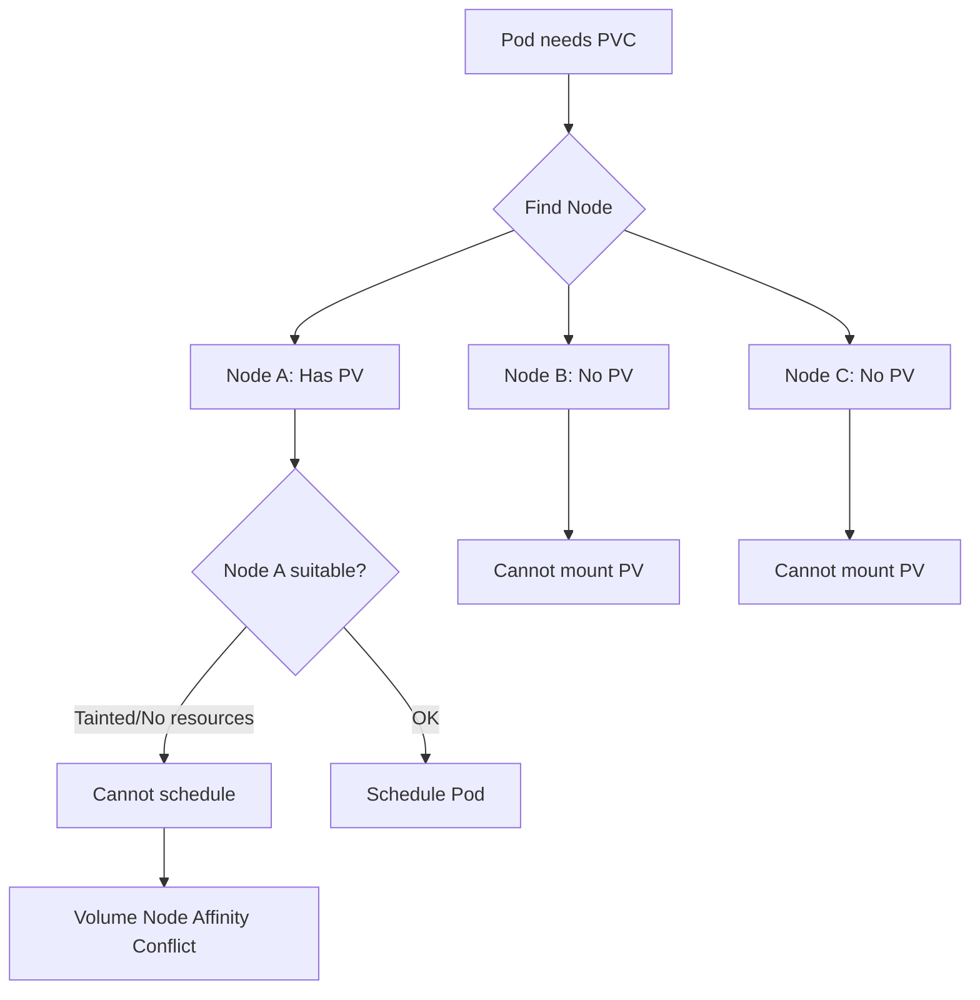

# How to Fix "Volume Node Affinity Conflict" Errors in Kubernetes

Author: [nawazdhandala](https://www.github.com/nawazdhandala)

Tags: Kubernetes, Storage, PersistentVolume, Scheduling, Troubleshooting

Description: Learn how to resolve Volume Node Affinity Conflict errors in Kubernetes. This guide explains why these errors occur and provides solutions for local volumes, cloud storage, and StatefulSets.

---

Your pod is stuck in Pending state with the event message "volume node affinity conflict." This means Kubernetes cannot schedule your pod because the required volume is only available on specific nodes, and those nodes do not satisfy other pod constraints. Let us understand why this happens and how to fix it.

## Understanding the Error

PersistentVolumes can have node affinity rules that restrict which nodes can access them. Local volumes, for example, only exist on one node. When your pod needs that volume but cannot run on that node (due to taints, resource constraints, or other affinity rules), you get a conflict.



## Step 1: Check the Error Details

Start by examining the pod events:

```bash
# Get pod status and events
kubectl describe pod your-pod-name -n your-namespace

# Look for events like:
# Warning  FailedScheduling  default-scheduler  0/3 nodes are available:
#   1 node(s) had volume node affinity conflict,
#   2 node(s) didn't match Pod's node affinity/selector.
```

## Step 2: Check PV Node Affinity

Find out which nodes can access your PersistentVolume:

```bash
# Get the PV name from the PVC
kubectl get pvc your-pvc -n your-namespace -o jsonpath='{.spec.volumeName}'

# Check the PV's node affinity
kubectl get pv your-pv -o yaml | grep -A 20 nodeAffinity
```

Example output showing a local volume tied to a specific node:

```yaml
nodeAffinity:
  required:
    nodeSelectorTerms:
    - matchExpressions:
      - key: kubernetes.io/hostname
        operator: In
        values:
        - worker-node-1
```

This PV can only be mounted on `worker-node-1`.

## Step 3: Check Why the Node is Unavailable

Verify if the node with the PV is schedulable:

```bash
# Check node status
kubectl get nodes

# Check for taints that prevent scheduling
kubectl describe node worker-node-1 | grep -A 5 Taints

# Check node resources
kubectl describe node worker-node-1 | grep -A 10 "Allocated resources"
```

Common reasons:
- Node is cordoned or drained
- Node has taints your pod does not tolerate
- Node lacks sufficient CPU/memory
- Node is in NotReady state

## Common Solutions

### Solution 1: Remove Node Taints

If the node is tainted, either remove the taint or add a toleration to your pod:

```bash
# Check current taints
kubectl describe node worker-node-1 | grep Taints

# Remove a taint
kubectl taint nodes worker-node-1 key=value:NoSchedule-
```

Or add toleration to your pod:

```yaml
spec:
  tolerations:
  - key: "key"
    operator: "Equal"
    value: "value"
    effect: "NoSchedule"
```

### Solution 2: Use Node Selector to Match PV Location

Ensure your pod targets the correct node:

```yaml
apiVersion: v1
kind: Pod
metadata:
  name: my-pod
spec:
  nodeSelector:
    kubernetes.io/hostname: worker-node-1  # Node where PV exists
  containers:
  - name: app
    image: myapp:1.0
    volumeMounts:
    - name: data
      mountPath: /data
  volumes:
  - name: data
    persistentVolumeClaim:
      claimName: my-pvc
```

### Solution 3: Use Storage That Works Across Nodes

For storage that needs to follow pods to any node, use network-attached storage:

```yaml
# Use a StorageClass that provisions network storage
apiVersion: v1
kind: PersistentVolumeClaim
metadata:
  name: my-pvc
spec:
  accessModes:
  - ReadWriteOnce
  storageClassName: ceph-rbd  # Or gp2, standard-rwo, etc.
  resources:
    requests:
      storage: 10Gi
```

Network storage options:
- AWS EBS (gp2, gp3)
- GCP Persistent Disk
- Azure Disk
- Ceph RBD
- NFS
- iSCSI

### Solution 4: Delete and Recreate PVC with WaitForFirstConsumer

Use `WaitForFirstConsumer` binding mode so the PV is created on the same node where the pod runs:

```yaml
# StorageClass with WaitForFirstConsumer
apiVersion: storage.k8s.io/v1
kind: StorageClass
metadata:
  name: local-storage
provisioner: kubernetes.io/no-provisioner
volumeBindingMode: WaitForFirstConsumer  # Delays PV binding
```

Then recreate your PVC:

```bash
# Delete existing PVC (data will be lost if ReclaimPolicy is Delete)
kubectl delete pvc my-pvc

# Recreate with the new StorageClass
kubectl apply -f pvc.yaml
```

### Solution 5: Migrate Data to a New Volume

If you need the data but must move to a different node:

```bash
# Create a temporary pod that mounts both old and new volumes
cat <<EOF | kubectl apply -f -
apiVersion: v1
kind: Pod
metadata:
  name: data-migration
spec:
  nodeSelector:
    kubernetes.io/hostname: worker-node-1  # Node with old PV
  containers:
  - name: migrate
    image: busybox:1.35
    command: ["sleep", "3600"]
    volumeMounts:
    - name: old-data
      mountPath: /old
    - name: new-data
      mountPath: /new
  volumes:
  - name: old-data
    persistentVolumeClaim:
      claimName: old-pvc
  - name: new-data
    persistentVolumeClaim:
      claimName: new-pvc  # Network-attached storage
EOF
```

Copy the data:

```bash
kubectl exec -it data-migration -- sh -c "cp -av /old/* /new/"
```

### Solution 6: Fix StatefulSet Volume Affinity Issues

StatefulSets create one PVC per replica. If a pod moves nodes, the old PVC may have node affinity:

```bash
# List PVCs for the StatefulSet
kubectl get pvc -l app=my-statefulset

# Check each PV's node affinity
for pv in $(kubectl get pvc -l app=my-statefulset -o jsonpath='{.items[*].spec.volumeName}'); do
  echo "PV: $pv"
  kubectl get pv $pv -o jsonpath='{.spec.nodeAffinity}' | jq .
done
```

Options:
1. Schedule StatefulSet pods to specific nodes using nodeSelector
2. Use network storage that works across nodes
3. Delete the StatefulSet, PVCs, and start fresh (data loss)

## Diagnostic Script

Use this script to diagnose volume affinity issues:

```bash
#!/bin/bash
# diagnose-volume-affinity.sh

POD=$1
NAMESPACE=${2:-default}

echo "=== Pod Status ==="
kubectl get pod $POD -n $NAMESPACE

echo -e "\n=== Pod Events ==="
kubectl describe pod $POD -n $NAMESPACE | grep -A 10 "Events:"

echo -e "\n=== Pod Volumes ==="
PVC=$(kubectl get pod $POD -n $NAMESPACE -o jsonpath='{.spec.volumes[*].persistentVolumeClaim.claimName}')
echo "PVC: $PVC"

echo -e "\n=== PVC Status ==="
kubectl get pvc $PVC -n $NAMESPACE

echo -e "\n=== PV Node Affinity ==="
PV=$(kubectl get pvc $PVC -n $NAMESPACE -o jsonpath='{.spec.volumeName}')
echo "PV: $PV"
kubectl get pv $PV -o jsonpath='{.spec.nodeAffinity}' | jq . 2>/dev/null || \
  kubectl get pv $PV -o yaml | grep -A 20 nodeAffinity

echo -e "\n=== Node Status ==="
REQUIRED_NODE=$(kubectl get pv $PV -o jsonpath='{.spec.nodeAffinity.required.nodeSelectorTerms[0].matchExpressions[0].values[0]}')
if [ -n "$REQUIRED_NODE" ]; then
  echo "Required node: $REQUIRED_NODE"
  kubectl get node $REQUIRED_NODE
  echo "Taints:"
  kubectl describe node $REQUIRED_NODE | grep -A 5 Taints
fi
```

## Prevention Tips

1. **Use network storage for portable workloads** - Local volumes should only be used when you truly need local disk performance
2. **Use WaitForFirstConsumer** - Let Kubernetes bind the PV after scheduling decisions
3. **Plan node maintenance** - Drain nodes gracefully and ensure StatefulSet pods can migrate
4. **Monitor node health** - Set up alerts for node issues before they cause scheduling failures
5. **Document storage requirements** - Make node affinity constraints part of your runbooks

## Summary

Volume node affinity conflicts occur when a PersistentVolume is tied to a specific node but your pod cannot run on that node. Check the PV's nodeAffinity to find which node has the volume, then determine why your pod cannot schedule there. Solutions include removing node taints, adding tolerations, using network storage, or migrating data to a new volume. For new deployments, prefer StorageClasses with WaitForFirstConsumer binding mode to avoid these issues.
