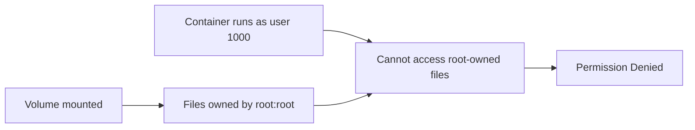

# How to Troubleshoot VolumeMount Permission Denied Issues

Author: [nawazdhandala](https://www.github.com/nawazdhandala)

Tags: Kubernetes, Storage, Security, Permissions, Troubleshooting

Description: Learn how to fix permission denied errors when mounting volumes in Kubernetes pods. This guide covers fsGroup, securityContext, init containers, and common permission issues.

---

Your pod starts but your application cannot read or write to a mounted volume. The error messages say "permission denied" or "read-only file system." These permission issues are common when Kubernetes security contexts clash with volume ownership. This guide explains why these errors happen and how to fix them.

## Understanding Volume Permissions

When Kubernetes mounts a volume, the files have specific user/group ownership. If your container runs as a different user, it may not have access:



## Step 1: Identify the Permission Error

Check pod logs and events:

```bash
# Check pod status
kubectl get pod my-pod -n your-namespace

# Get detailed events
kubectl describe pod my-pod -n your-namespace

# Check container logs for permission errors
kubectl logs my-pod -n your-namespace

# Common error messages:
# - "Permission denied"
# - "Read-only file system"
# - "Operation not permitted"
# - "cannot create directory: Permission denied"
```

## Step 2: Check Current Security Context

See what user your container runs as:

```bash
# Check the effective user inside the container
kubectl exec my-pod -- id

# Example output:
# uid=1000(node) gid=1000(node) groups=1000(node)
```

Check the volume's current permissions:

```bash
# List files and their ownership in the mounted volume
kubectl exec my-pod -- ls -la /data

# Example showing root ownership:
# drwxr-xr-x 2 root root 4096 Jan 25 10:00 .
# -rw-r--r-- 1 root root  100 Jan 25 10:00 config.txt
```

If the container runs as uid 1000 but files are owned by root (uid 0), you have a mismatch.

## Solution 1: Use fsGroup in Security Context

The most common fix is setting `fsGroup`. Kubernetes changes the group ownership of mounted volumes to this GID:

```yaml
apiVersion: v1
kind: Pod
metadata:
  name: my-pod
spec:
  securityContext:
    # All volumes are group-owned by this GID
    fsGroup: 1000
  containers:
  - name: app
    image: myapp:1.0
    securityContext:
      # Container runs as this user
      runAsUser: 1000
      runAsGroup: 1000
    volumeMounts:
    - name: data
      mountPath: /data
  volumes:
  - name: data
    persistentVolumeClaim:
      claimName: my-pvc
```

After applying, files in `/data` will be accessible:

```bash
kubectl exec my-pod -- ls -la /data
# drwxrwsr-x 2 root 1000 4096 Jan 25 10:00 .
# -rw-rw-r-- 1 root 1000  100 Jan 25 10:00 config.txt
```

The `s` in permissions indicates the setgid bit, which makes new files inherit the group.

## Solution 2: Use fsGroupChangePolicy

For large volumes, changing ownership of all files can be slow. Use `fsGroupChangePolicy` to optimize:

```yaml
apiVersion: v1
kind: Pod
metadata:
  name: my-pod
spec:
  securityContext:
    fsGroup: 1000
    # Only change ownership if current permissions are wrong
    fsGroupChangePolicy: OnRootMismatch
  containers:
  - name: app
    image: myapp:1.0
    volumeMounts:
    - name: data
      mountPath: /data
  volumes:
  - name: data
    persistentVolumeClaim:
      claimName: my-pvc
```

Options for `fsGroupChangePolicy`:
- `Always` (default): Always change ownership recursively
- `OnRootMismatch`: Only change if root directory permissions differ

## Solution 3: Use Init Container to Set Permissions

For complex permission requirements, use an init container:

```yaml
apiVersion: v1
kind: Pod
metadata:
  name: my-pod
spec:
  initContainers:
  - name: fix-permissions
    image: busybox:1.35
    # Run as root to change ownership
    securityContext:
      runAsUser: 0
    command:
    - sh
    - -c
    - |
      # Change ownership of the data directory
      chown -R 1000:1000 /data
      # Set directory permissions
      chmod 755 /data
      # Set file permissions
      find /data -type f -exec chmod 644 {} \;
    volumeMounts:
    - name: data
      mountPath: /data
  containers:
  - name: app
    image: myapp:1.0
    securityContext:
      runAsUser: 1000
      runAsGroup: 1000
    volumeMounts:
    - name: data
      mountPath: /data
  volumes:
  - name: data
    persistentVolumeClaim:
      claimName: my-pvc
```

## Solution 4: Configure Container to Run as Root

If your application must write as root (not recommended but sometimes necessary):

```yaml
apiVersion: v1
kind: Pod
metadata:
  name: my-pod
spec:
  containers:
  - name: app
    image: myapp:1.0
    securityContext:
      runAsUser: 0  # Run as root
    volumeMounts:
    - name: data
      mountPath: /data
  volumes:
  - name: data
    persistentVolumeClaim:
      claimName: my-pvc
```

**Warning**: Running as root is a security risk. Only do this if absolutely necessary.

## Solution 5: Fix Image User Configuration

Some container images run as non-root by default. Check the Dockerfile:

```dockerfile
# Dockerfile that sets non-root user
FROM node:20-alpine
RUN addgroup -g 1001 appgroup && adduser -u 1001 -G appgroup -D appuser
USER appuser
WORKDIR /app
```

Match your security context to the image's user:

```yaml
securityContext:
  runAsUser: 1001
  runAsGroup: 1001
  fsGroup: 1001
```

## Solution 6: Handle ConfigMap/Secret Mount Permissions

ConfigMaps and Secrets mount as read-only by default. You cannot write to them, but you can control read permissions:

```yaml
apiVersion: v1
kind: Pod
metadata:
  name: my-pod
spec:
  containers:
  - name: app
    image: myapp:1.0
    volumeMounts:
    - name: config
      mountPath: /config
  volumes:
  - name: config
    configMap:
      name: my-config
      # Set file permissions (octal)
      defaultMode: 0644
      items:
      - key: app.conf
        path: app.conf
        # Override mode for specific files
        mode: 0600
```

For Secrets (often need restricted permissions):

```yaml
volumes:
- name: creds
  secret:
    secretName: my-secret
    defaultMode: 0400  # Read-only for owner
```

## Solution 7: Handle EmptyDir with Medium Memory

EmptyDir volumes with `medium: Memory` may have different default permissions:

```yaml
volumes:
- name: cache
  emptyDir:
    medium: Memory
    sizeLimit: 100Mi
```

Use fsGroup to ensure proper access:

```yaml
spec:
  securityContext:
    fsGroup: 1000
```

## Troubleshooting Checklist

Run through this checklist when debugging:

```bash
#!/bin/bash
# permission-debug.sh

POD=$1
MOUNT_PATH=${2:-/data}
NAMESPACE=${3:-default}

echo "=== Container User ==="
kubectl exec $POD -n $NAMESPACE -- id

echo -e "\n=== Mount Permissions ==="
kubectl exec $POD -n $NAMESPACE -- ls -la $MOUNT_PATH

echo -e "\n=== Security Context ==="
kubectl get pod $POD -n $NAMESPACE -o jsonpath='{.spec.securityContext}' | jq .
echo ""
kubectl get pod $POD -n $NAMESPACE -o jsonpath='{.spec.containers[0].securityContext}' | jq .

echo -e "\n=== Write Test ==="
kubectl exec $POD -n $NAMESPACE -- touch $MOUNT_PATH/test-write 2>&1 || echo "Write failed"

echo -e "\n=== Mount Info ==="
kubectl exec $POD -n $NAMESPACE -- mount | grep $MOUNT_PATH
```

## Common Permission Patterns

| Scenario | Solution |
|----------|----------|
| App runs as uid 1000, needs write access | Set `fsGroup: 1000` |
| Multiple containers share volume | Use same fsGroup for all |
| Existing data with wrong ownership | Init container with chown |
| ConfigMap needs specific permissions | Set `defaultMode` on ConfigMap volume |
| Secret files too open | Set `defaultMode: 0400` |
| ReadOnlyRootFilesystem enabled | Mount writable volumes for temp files |

## Summary

Permission denied errors on volume mounts usually come from a mismatch between the container's user and the volume's file ownership. The primary fix is setting `fsGroup` in the pod's security context, which changes group ownership of mounted volumes. For complex scenarios, use init containers to set exact permissions. Always check what user your container runs as (`kubectl exec -- id`) and what permissions files have (`ls -la`) to identify the mismatch.
