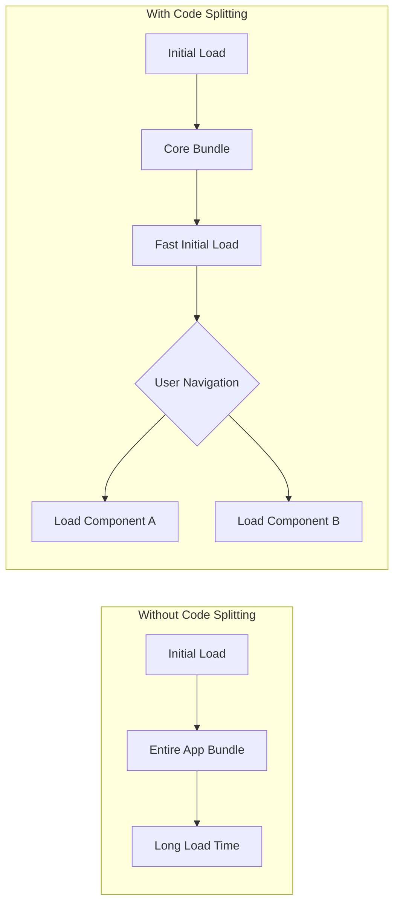
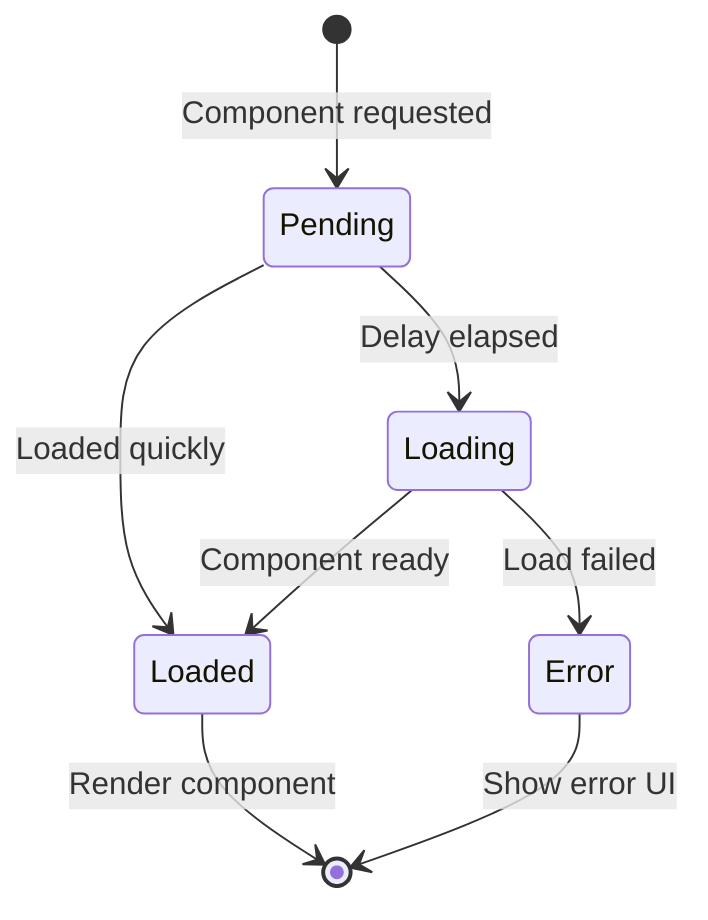
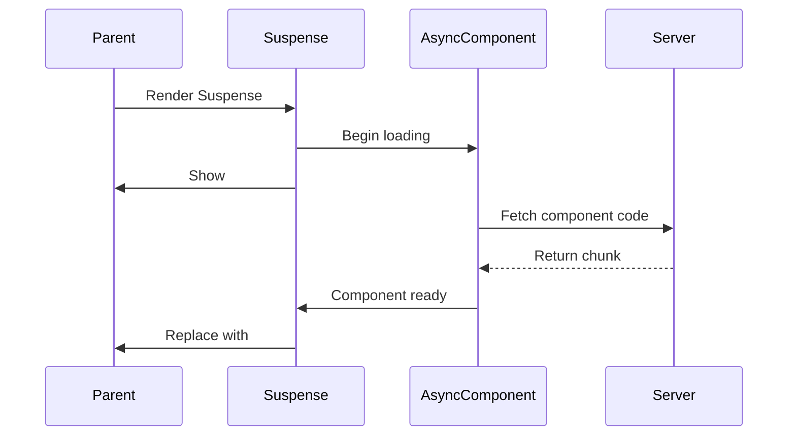
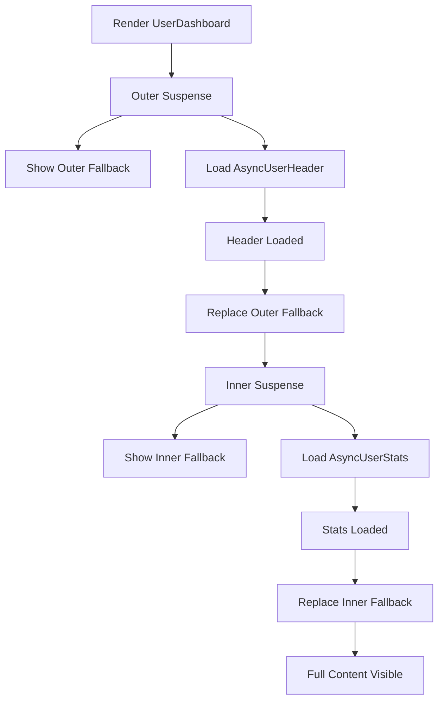
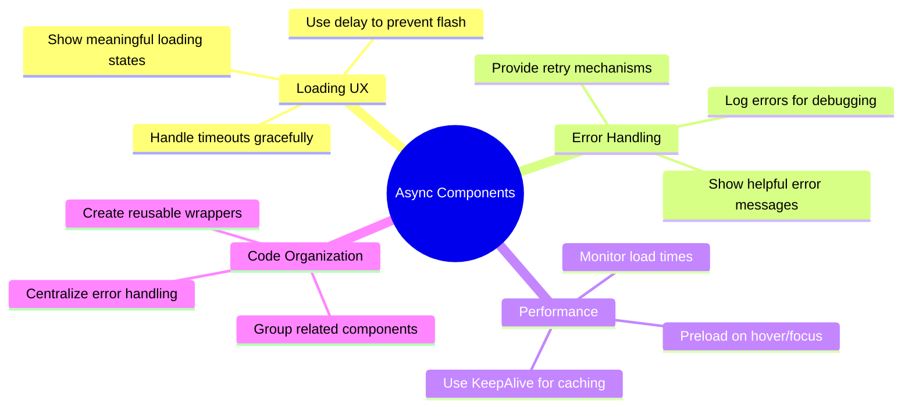

# How to Handle Async Components in Vue

Author: [nawazdhandala](https://www.github.com/nawazdhandala)

Tags: Vue, Async Components, Lazy Loading, Suspense, Code Splitting, Performance

Description: A complete guide to implementing and managing async components in Vue 3 with Suspense, error handling, and performance optimization.

---

Async components allow you to split your Vue application into smaller chunks that are loaded on demand, improving initial load times and overall performance. In this guide, we will explore various patterns for handling async components effectively.

## Why Use Async Components?

Async components enable code splitting, which means parts of your application are loaded only when needed rather than all at once.



## Basic Async Component Definition

Vue 3 provides `defineAsyncComponent` for creating async components:

```typescript
// src/router/index.ts
import { createRouter, createWebHistory } from 'vue-router';
import { defineAsyncComponent } from 'vue';

// Basic async component
const AsyncUserProfile = defineAsyncComponent(() =>
    import('../components/UserProfile.vue')
);

// Use in router for route-level code splitting
const routes = [
    {
        path: '/',
        name: 'Home',
        // Eagerly loaded
        component: () => import('../views/Home.vue')
    },
    {
        path: '/dashboard',
        name: 'Dashboard',
        // Lazy loaded
        component: () => import('../views/Dashboard.vue')
    },
    {
        path: '/profile',
        name: 'Profile',
        component: () => import('../views/Profile.vue')
    }
];

const router = createRouter({
    history: createWebHistory(),
    routes
});

export default router;
```

## Async Component Loading States



## Advanced Async Component Options

Configure loading and error states for better user experience:

```typescript
// src/components/async/AsyncDashboard.ts
import { defineAsyncComponent, h } from 'vue';
import LoadingSpinner from '../LoadingSpinner.vue';
import ErrorDisplay from '../ErrorDisplay.vue';

export const AsyncDashboard = defineAsyncComponent({
    // The loader function
    loader: () => import('../Dashboard.vue'),

    // Component to show while loading
    loadingComponent: LoadingSpinner,

    // Delay before showing loading component (ms)
    // Prevents flashing for fast loads
    delay: 200,

    // Component to show on error
    errorComponent: ErrorDisplay,

    // Timeout before showing error (ms)
    timeout: 10000,

    // Suspensible allows use with Suspense
    suspensible: true,

    // Called when loading fails
    onError(error, retry, fail, attempts) {
        if (error.message.includes('fetch') && attempts <= 3) {
            // Retry on network errors, up to 3 times
            console.log(`Retrying load, attempt ${attempts}`);
            retry();
        } else {
            // Give up after 3 retries or non-network error
            fail();
        }
    }
});
```

## Creating Reusable Loading and Error Components

```vue
<!-- src/components/LoadingSpinner.vue -->
<template>
    <div class="loading-container">
        <div class="spinner"></div>
        <p class="loading-text">{{ message }}</p>
    </div>
</template>

<script setup lang="ts">
withDefaults(defineProps<{
    message?: string;
}>(), {
    message: 'Loading...'
});
</script>

<style scoped>
.loading-container {
    display: flex;
    flex-direction: column;
    align-items: center;
    justify-content: center;
    padding: 2rem;
}

.spinner {
    width: 40px;
    height: 40px;
    border: 3px solid #f3f3f3;
    border-top: 3px solid #3498db;
    border-radius: 50%;
    animation: spin 1s linear infinite;
}

@keyframes spin {
    0% { transform: rotate(0deg); }
    100% { transform: rotate(360deg); }
}

.loading-text {
    margin-top: 1rem;
    color: #666;
}
</style>
```

```vue
<!-- src/components/ErrorDisplay.vue -->
<template>
    <div class="error-container">
        <div class="error-icon">!</div>
        <h3 class="error-title">{{ title }}</h3>
        <p class="error-message">{{ message }}</p>
        <button
            v-if="showRetry"
            @click="$emit('retry')"
            class="retry-button"
        >
            Try Again
        </button>
    </div>
</template>

<script setup lang="ts">
withDefaults(defineProps<{
    title?: string;
    message?: string;
    showRetry?: boolean;
}>(), {
    title: 'Failed to Load',
    message: 'Something went wrong while loading this content.',
    showRetry: true
});

defineEmits<{
    (e: 'retry'): void;
}>();
</script>

<style scoped>
.error-container {
    display: flex;
    flex-direction: column;
    align-items: center;
    padding: 2rem;
    text-align: center;
}

.error-icon {
    width: 50px;
    height: 50px;
    border-radius: 50%;
    background: #e74c3c;
    color: white;
    font-size: 24px;
    font-weight: bold;
    display: flex;
    align-items: center;
    justify-content: center;
}

.error-title {
    margin-top: 1rem;
    color: #333;
}

.error-message {
    color: #666;
    margin-top: 0.5rem;
}

.retry-button {
    margin-top: 1rem;
    padding: 0.5rem 1rem;
    background: #3498db;
    color: white;
    border: none;
    border-radius: 4px;
    cursor: pointer;
}

.retry-button:hover {
    background: #2980b9;
}
</style>
```

## Using Suspense with Async Components

Vue 3's Suspense component provides built-in handling for async dependencies:

```vue
<!-- src/views/DashboardPage.vue -->
<template>
    <div class="dashboard-page">
        <h1>Dashboard</h1>

        <Suspense>
            <!-- Main content with async component -->
            <template #default>
                <AsyncDashboardContent />
            </template>

            <!-- Fallback shown while loading -->
            <template #fallback>
                <LoadingSpinner message="Loading dashboard..." />
            </template>
        </Suspense>
    </div>
</template>

<script setup lang="ts">
import { defineAsyncComponent } from 'vue';
import LoadingSpinner from '@/components/LoadingSpinner.vue';

const AsyncDashboardContent = defineAsyncComponent(() =>
    import('@/components/DashboardContent.vue')
);
</script>
```

## Suspense Flow



## Handling Errors with Suspense

Use error boundaries with Suspense for comprehensive error handling:

```vue
<!-- src/components/AsyncBoundary.vue -->
<template>
    <Suspense @pending="onPending" @resolve="onResolve" @fallback="onFallback">
        <template #default>
            <slot />
        </template>

        <template #fallback>
            <slot name="loading">
                <LoadingSpinner />
            </slot>
        </template>
    </Suspense>
</template>

<script setup lang="ts">
import { onErrorCaptured, ref } from 'vue';
import LoadingSpinner from './LoadingSpinner.vue';

const emit = defineEmits<{
    (e: 'pending'): void;
    (e: 'resolve'): void;
    (e: 'fallback'): void;
    (e: 'error', error: Error): void;
}>();

const error = ref<Error | null>(null);

function onPending() {
    error.value = null;
    emit('pending');
}

function onResolve() {
    emit('resolve');
}

function onFallback() {
    emit('fallback');
}

// Capture errors from async components
onErrorCaptured((err: Error) => {
    error.value = err;
    emit('error', err);
    // Return false to stop propagation
    return false;
});
</script>
```

## Async Components with Data Fetching

Combine async components with async setup for data fetching:

```vue
<!-- src/components/UserProfile.vue -->
<template>
    <div class="user-profile">
        
        <h2>{{ user.name }}</h2>
        <p>{{ user.email }}</p>
        <p>Member since: {{ formatDate(user.createdAt) }}</p>
    </div>
</template>

<script setup lang="ts">
import { ref } from 'vue';

interface User {
    id: number;
    name: string;
    email: string;
    avatar: string;
    createdAt: string;
}

const props = defineProps<{
    userId: number;
}>();

// Async setup - component will suspend until resolved
const user = ref<User>(await fetchUser(props.userId));

async function fetchUser(id: number): Promise<User> {
    const response = await fetch(`/api/users/${id}`);
    if (!response.ok) {
        throw new Error('Failed to fetch user');
    }
    return response.json();
}

function formatDate(dateString: string): string {
    return new Date(dateString).toLocaleDateString();
}
</script>
```

## Nested Async Components

When dealing with nested async components, understand the loading behavior:

```vue
<!-- src/views/UserDashboard.vue -->
<template>
    <div class="user-dashboard">
        <Suspense>
            <template #default>
                <!-- Parent async component -->
                <AsyncUserHeader :userId="userId">
                    <!-- Nested async component -->
                    <Suspense>
                        <template #default>
                            <AsyncUserStats :userId="userId" />
                        </template>
                        <template #fallback>
                            <LoadingSpinner message="Loading stats..." />
                        </template>
                    </Suspense>
                </AsyncUserHeader>
            </template>
            <template #fallback>
                <LoadingSpinner message="Loading user..." />
            </template>
        </Suspense>
    </div>
</template>

<script setup lang="ts">
import { defineAsyncComponent } from 'vue';
import LoadingSpinner from '@/components/LoadingSpinner.vue';

const props = defineProps<{
    userId: number;
}>();

const AsyncUserHeader = defineAsyncComponent(() =>
    import('@/components/UserHeader.vue')
);

const AsyncUserStats = defineAsyncComponent(() =>
    import('@/components/UserStats.vue')
);
</script>
```

## Nested Loading Flow



## Preloading Async Components

Improve perceived performance by preloading components before they are needed:

```typescript
// src/utils/preload.ts
import { defineAsyncComponent, Component } from 'vue';

// Create a preloadable async component
export function createPreloadableComponent(
    loader: () => Promise<{ default: Component }>
) {
    // Store the loader for preloading
    const asyncComponent = defineAsyncComponent(loader);

    // Attach preload method
    (asyncComponent as any).preload = loader;

    return asyncComponent;
}

// Usage
export const AsyncSettings = createPreloadableComponent(() =>
    import('@/views/Settings.vue')
);

// Preload on hover
export function preloadOnHover(component: any) {
    if (component.preload) {
        component.preload();
    }
}
```

```vue
<!-- src/components/Navigation.vue -->
<template>
    <nav class="navigation">
        <router-link
            to="/settings"
            @mouseenter="preloadSettings"
        >
            Settings
        </router-link>
    </nav>
</template>

<script setup lang="ts">
import { AsyncSettings, preloadOnHover } from '@/utils/preload';

function preloadSettings() {
    preloadOnHover(AsyncSettings);
}
</script>
```

## Conditional Async Loading

Load components conditionally based on user interaction:

```vue
<!-- src/views/ProductPage.vue -->
<template>
    <div class="product-page">
        <ProductDetails :product="product" />

        <div class="tabs">
            <button
                v-for="tab in tabs"
                :key="tab.id"
                :class="{ active: activeTab === tab.id }"
                @click="activeTab = tab.id"
            >
                {{ tab.label }}
            </button>
        </div>

        <div class="tab-content">
            <!-- Only load component when tab is active -->
            <KeepAlive>
                <component :is="activeComponent" :productId="product.id" />
            </KeepAlive>
        </div>
    </div>
</template>

<script setup lang="ts">
import { ref, computed, defineAsyncComponent, shallowRef } from 'vue';
import ProductDetails from '@/components/ProductDetails.vue';

const props = defineProps<{
    product: {
        id: number;
        name: string;
    };
}>();

const tabs = [
    { id: 'reviews', label: 'Reviews' },
    { id: 'specs', label: 'Specifications' },
    { id: 'related', label: 'Related Products' }
];

const activeTab = ref('reviews');

// Define async components for each tab
const tabComponents = {
    reviews: defineAsyncComponent(() =>
        import('@/components/ProductReviews.vue')
    ),
    specs: defineAsyncComponent(() =>
        import('@/components/ProductSpecs.vue')
    ),
    related: defineAsyncComponent(() =>
        import('@/components/RelatedProducts.vue')
    )
};

const activeComponent = computed(() => {
    return tabComponents[activeTab.value as keyof typeof tabComponents];
});
</script>
```

## Performance Monitoring

Track async component loading performance:

```typescript
// src/utils/asyncComponentMonitor.ts
import { defineAsyncComponent, Component } from 'vue';

interface LoadMetrics {
    componentName: string;
    startTime: number;
    endTime: number;
    duration: number;
    success: boolean;
}

const metrics: LoadMetrics[] = [];

export function createMonitoredAsyncComponent(
    name: string,
    loader: () => Promise<{ default: Component }>
) {
    return defineAsyncComponent({
        loader: async () => {
            const startTime = performance.now();

            try {
                const component = await loader();
                const endTime = performance.now();

                metrics.push({
                    componentName: name,
                    startTime,
                    endTime,
                    duration: endTime - startTime,
                    success: true
                });

                console.log(`[Async] ${name} loaded in ${(endTime - startTime).toFixed(2)}ms`);

                return component;
            } catch (error) {
                const endTime = performance.now();

                metrics.push({
                    componentName: name,
                    startTime,
                    endTime,
                    duration: endTime - startTime,
                    success: false
                });

                throw error;
            }
        },
        delay: 200,
        timeout: 10000
    });
}

export function getLoadMetrics(): LoadMetrics[] {
    return [...metrics];
}

export function clearLoadMetrics(): void {
    metrics.length = 0;
}
```

## Common Issues and Solutions

### Issue 1: Flash of Loading State

```typescript
// Solution: Use appropriate delay
const AsyncComponent = defineAsyncComponent({
    loader: () => import('./HeavyComponent.vue'),
    // Only show loading after 200ms
    delay: 200
});
```

### Issue 2: Component Not Re-loading on Prop Change

```vue
<!-- Solution: Use key to force re-mount -->
<template>
    <Suspense>
        <AsyncUserProfile :key="userId" :userId="userId" />
    </Suspense>
</template>
```

### Issue 3: Memory Leaks with KeepAlive

```vue
<!-- Solution: Limit cached instances -->
<template>
    <KeepAlive :max="5">
        <component :is="currentComponent" />
    </KeepAlive>
</template>
```

## Best Practices Summary



## Conclusion

Async components are essential for building performant Vue applications. By leveraging `defineAsyncComponent`, Suspense, and proper loading/error states, you can create a smooth user experience while keeping your bundle sizes manageable. Remember to consider the user experience at every step, from loading indicators to error recovery options.
