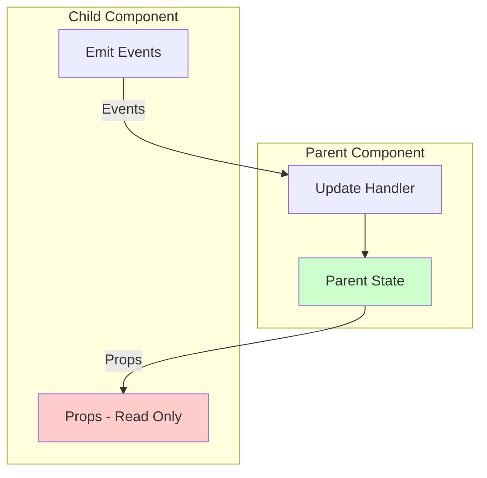
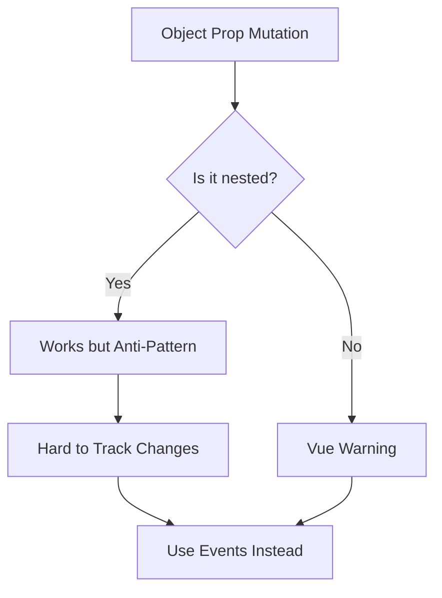
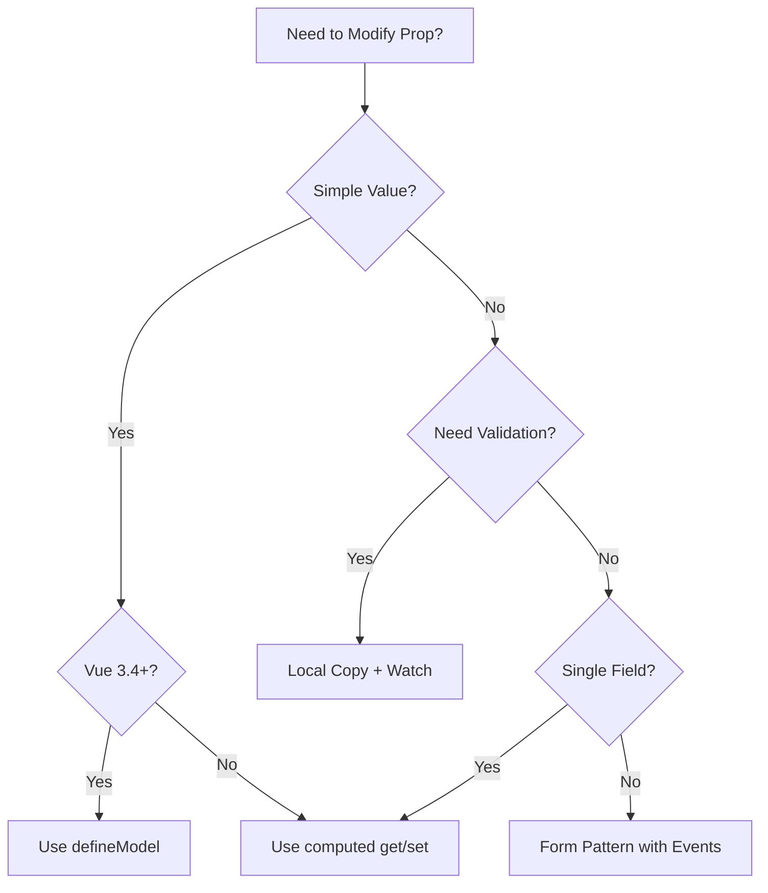

# How to Fix 'Avoid Mutating Prop' Warnings in Vue

Author: [nawazdhandala](https://www.github.com/nawazdhandala)

Tags: Vue, JavaScript, Props, Components, Reactivity, Frontend, Best Practices, Component Communication

Description: Learn how to properly handle prop mutations in Vue by understanding one-way data flow and implementing correct patterns for parent-child component communication.

---

> The "Avoid mutating a prop directly" warning is Vue's way of enforcing one-way data flow. When you try to modify a prop inside a child component, Vue warns you because this creates a maintenance nightmare and breaks the predictable data flow pattern.

Understanding why this warning exists and how to properly communicate between components will help you write more maintainable Vue applications.

---

## Understanding One-Way Data Flow

Vue enforces a one-way data flow from parent to child components:



Props should be treated as read-only. To update data, emit events to the parent.

---

## Common Mistake: Direct Prop Mutation

Here is what triggers the warning:

```vue
<!-- ChildComponent.vue -->
<template>
  <div>
    <input v-model="message" />  <!-- Warning: mutating prop -->
    <button @click="count++">  <!-- Warning: mutating prop -->
      Count: {{ count }}
    </button>
  </div>
</template>

<script setup>
// These props should not be modified directly
const props = defineProps({
  message: String,
  count: Number
})

// Wrong: This mutates the prop
function updateMessage(newValue) {
  props.message = newValue  // Vue warning!
}
</script>
```

---

## Solution 1: Emit Events to Parent

The recommended approach is to emit events and let the parent update the data:

```vue
<!-- ParentComponent.vue -->
<template>
  <ChildComponent
    :message="message"
    :count="count"
    @update:message="message = $event"
    @update:count="count = $event"
  />
</template>

<script setup>
import { ref } from 'vue'
import ChildComponent from './ChildComponent.vue'

const message = ref('Hello')
const count = ref(0)
</script>
```

```vue
<!-- ChildComponent.vue -->
<template>
  <div>
    <input
      :value="message"
      @input="$emit('update:message', $event.target.value)"
    />
    <button @click="$emit('update:count', count + 1)">
      Count: {{ count }}
    </button>
  </div>
</template>

<script setup>
defineProps({
  message: String,
  count: Number
})

defineEmits(['update:message', 'update:count'])
</script>
```

---

## Solution 2: Use v-model with defineModel (Vue 3.4+)

Vue 3.4 introduced `defineModel` for simpler two-way binding:

```vue
<!-- ParentComponent.vue -->
<template>
  <!-- Single v-model -->
  <ChildComponent v-model="message" />

  <!-- Multiple v-model bindings -->
  <FormComponent
    v-model:firstName="firstName"
    v-model:lastName="lastName"
    v-model:email="email"
  />
</template>

<script setup>
import { ref } from 'vue'

const message = ref('Hello')
const firstName = ref('')
const lastName = ref('')
const email = ref('')
</script>
```

```vue
<!-- ChildComponent.vue -->
<template>
  <input v-model="model" />
</template>

<script setup>
// defineModel creates a ref that syncs with parent
const model = defineModel()
</script>
```

```vue
<!-- FormComponent.vue -->
<template>
  <form>
    <input v-model="firstName" placeholder="First name" />
    <input v-model="lastName" placeholder="Last name" />
    <input v-model="email" type="email" placeholder="Email" />
  </form>
</template>

<script setup>
// Multiple models with named bindings
const firstName = defineModel('firstName')
const lastName = defineModel('lastName')
const email = defineModel('email')
</script>
```

---

## Solution 3: Local Copy with Watch

Create a local copy of the prop and sync changes:

```vue
<!-- ChildComponent.vue -->
<template>
  <div>
    <input v-model="localMessage" />
    <button @click="save">Save</button>
    <button @click="reset">Reset</button>
  </div>
</template>

<script setup>
import { ref, watch } from 'vue'

const props = defineProps({
  message: {
    type: String,
    default: ''
  }
})

const emit = defineEmits(['update:message'])

// Create local copy
const localMessage = ref(props.message)

// Sync when prop changes externally
watch(() => props.message, (newValue) => {
  localMessage.value = newValue
})

// Emit only when user explicitly saves
function save() {
  emit('update:message', localMessage.value)
}

// Reset to original prop value
function reset() {
  localMessage.value = props.message
}
</script>
```

---

## Solution 4: Computed with Getter/Setter

Use computed properties for automatic two-way binding:

```vue
<!-- ChildComponent.vue -->
<template>
  <input v-model="writableMessage" />
</template>

<script setup>
import { computed } from 'vue'

const props = defineProps({
  message: String
})

const emit = defineEmits(['update:message'])

// Computed with getter and setter
const writableMessage = computed({
  get() {
    return props.message
  },
  set(value) {
    emit('update:message', value)
  }
})
</script>
```

This pattern works great for transforming values:

```vue
<script setup>
import { computed } from 'vue'

const props = defineProps({
  modelValue: Number  // Price in cents
})

const emit = defineEmits(['update:modelValue'])

// Display and edit in dollars, store in cents
const priceInDollars = computed({
  get() {
    return (props.modelValue / 100).toFixed(2)
  },
  set(value) {
    emit('update:modelValue', Math.round(parseFloat(value) * 100))
  }
})
</script>
```

---

## Solution 5: Object Props with Careful Updates

When working with object props, you can update nested properties, but this is considered an anti-pattern:



Instead, emit the entire updated object:

```vue
<!-- Wrong: Mutating nested prop property -->
<script setup>
const props = defineProps({
  user: Object
})

// This works but is an anti-pattern
function updateName(name) {
  props.user.name = name  // No warning, but bad practice
}
</script>

<!-- Correct: Emit new object -->
<script setup>
const props = defineProps({
  user: Object
})

const emit = defineEmits(['update:user'])

function updateName(name) {
  // Create new object and emit
  emit('update:user', {
    ...props.user,
    name
  })
}
</script>
```

---

## Pattern: Form Component with Multiple Fields

A complete example of a form component with proper prop handling:

```vue
<!-- UserForm.vue -->
<template>
  <form @submit.prevent="handleSubmit">
    <div class="field">
      <label>First Name</label>
      <input v-model="form.firstName" />
    </div>

    <div class="field">
      <label>Last Name</label>
      <input v-model="form.lastName" />
    </div>

    <div class="field">
      <label>Email</label>
      <input v-model="form.email" type="email" />
    </div>

    <div class="actions">
      <button type="button" @click="handleCancel">Cancel</button>
      <button type="submit" :disabled="!hasChanges">Save</button>
    </div>
  </form>
</template>

<script setup>
import { reactive, computed, watch } from 'vue'

const props = defineProps({
  user: {
    type: Object,
    required: true
  }
})

const emit = defineEmits(['save', 'cancel'])

// Create reactive local copy
const form = reactive({
  firstName: '',
  lastName: '',
  email: ''
})

// Initialize and sync form with prop
function syncForm() {
  form.firstName = props.user.firstName || ''
  form.lastName = props.user.lastName || ''
  form.email = props.user.email || ''
}

// Initial sync
syncForm()

// Re-sync when prop changes
watch(() => props.user, syncForm, { deep: true })

// Track if form has changes
const hasChanges = computed(() => {
  return form.firstName !== props.user.firstName ||
         form.lastName !== props.user.lastName ||
         form.email !== props.user.email
})

function handleSubmit() {
  // Emit copy of form data
  emit('save', { ...form })
}

function handleCancel() {
  syncForm()  // Reset to prop values
  emit('cancel')
}
</script>
```

```vue
<!-- ParentComponent.vue -->
<template>
  <UserForm
    :user="currentUser"
    @save="handleSave"
    @cancel="handleCancel"
  />
</template>

<script setup>
import { ref } from 'vue'
import UserForm from './UserForm.vue'

const currentUser = ref({
  firstName: 'John',
  lastName: 'Doe',
  email: 'john@example.com'
})

async function handleSave(formData) {
  // Update local state
  currentUser.value = { ...currentUser.value, ...formData }

  // Persist to server
  await fetch('/api/user', {
    method: 'PUT',
    body: JSON.stringify(formData)
  })
}

function handleCancel() {
  // Handle cancel action
}
</script>
```

---

## Pattern: List Item Component

Handling items in a list without mutating props:

```vue
<!-- TodoList.vue -->
<template>
  <ul>
    <TodoItem
      v-for="todo in todos"
      :key="todo.id"
      :todo="todo"
      @update="handleUpdate"
      @delete="handleDelete"
    />
  </ul>
</template>

<script setup>
import { ref } from 'vue'
import TodoItem from './TodoItem.vue'

const todos = ref([
  { id: 1, text: 'Learn Vue', completed: false },
  { id: 2, text: 'Build app', completed: false }
])

function handleUpdate(updatedTodo) {
  const index = todos.value.findIndex(t => t.id === updatedTodo.id)
  if (index !== -1) {
    todos.value[index] = updatedTodo
  }
}

function handleDelete(todoId) {
  todos.value = todos.value.filter(t => t.id !== todoId)
}
</script>
```

```vue
<!-- TodoItem.vue -->
<template>
  <li :class="{ completed: todo.completed }">
    <input
      type="checkbox"
      :checked="todo.completed"
      @change="toggleComplete"
    />
    <span>{{ todo.text }}</span>
    <button @click="$emit('delete', todo.id)">Delete</button>
  </li>
</template>

<script setup>
const props = defineProps({
  todo: {
    type: Object,
    required: true
  }
})

const emit = defineEmits(['update', 'delete'])

function toggleComplete() {
  // Emit new object, do not mutate prop
  emit('update', {
    ...props.todo,
    completed: !props.todo.completed
  })
}
</script>
```

---

## Decision Guide

Choose the right pattern based on your use case:



---

## Summary

To avoid "mutating prop" warnings in Vue:

1. **Understand one-way data flow**: Props down, events up
2. **Use defineModel (Vue 3.4+)**: Simplest two-way binding
3. **Emit events**: Standard pattern for all Vue versions
4. **Computed get/set**: For single value transformations
5. **Local copy with watch**: For forms with validation/reset
6. **Never mutate object props**: Always emit new objects

Following these patterns ensures your Vue components are predictable, testable, and easy to maintain.
