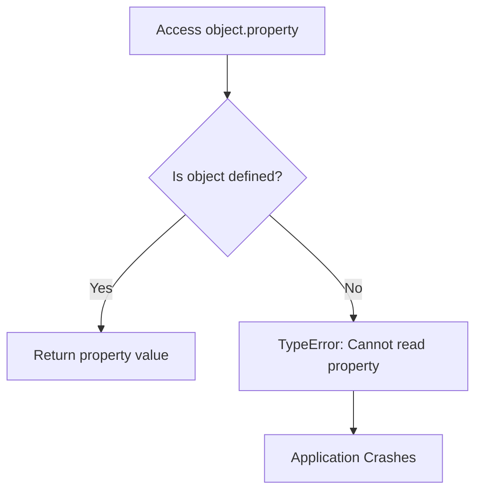
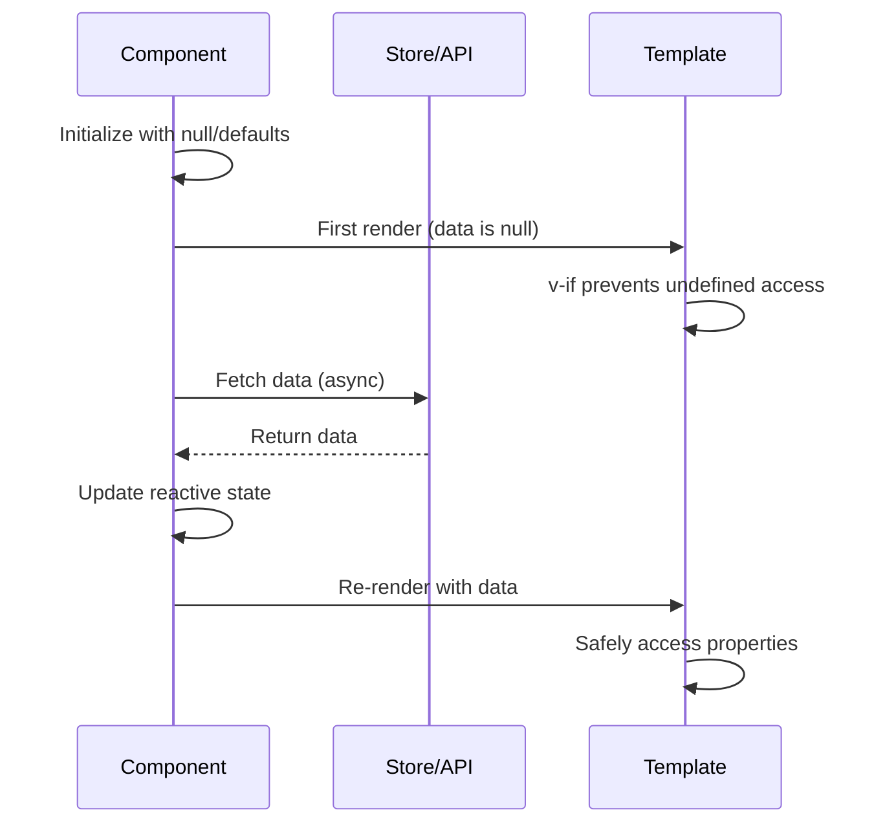
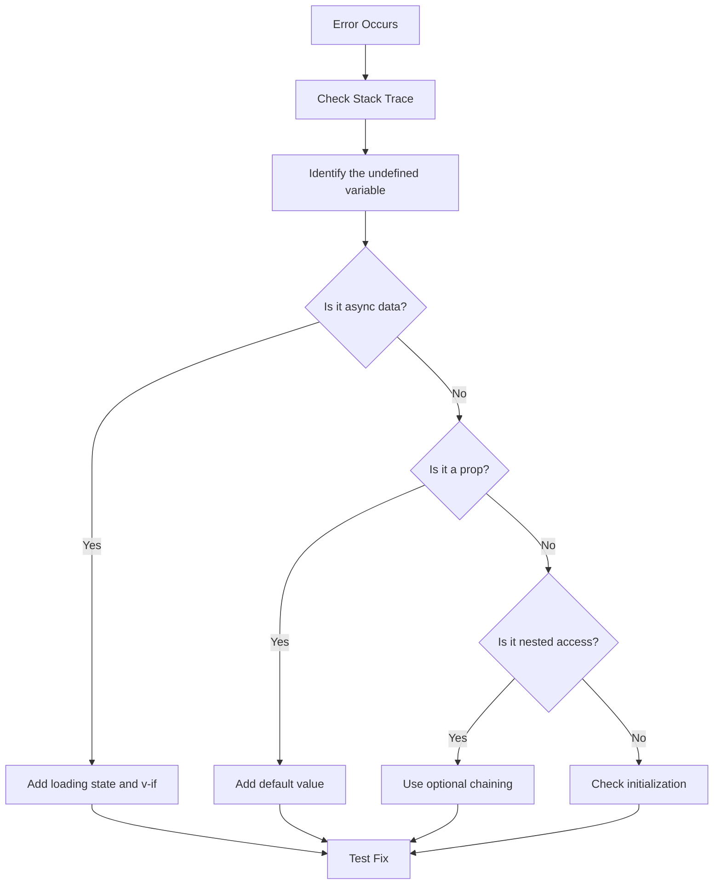

# How to Fix "Cannot Read Property of Undefined" in Vue

Author: [nawazdhandala](https://www.github.com/nawazdhandala)

Tags: Vue, JavaScript, Debugging, Frontend, Error Handling, Async Data, Reactivity, TypeScript

Description: Learn how to diagnose and fix the common "Cannot read property of undefined" error in Vue applications with practical solutions for async data, nested objects, and component communication.

---

> The "Cannot read property of undefined" error is a JavaScript runtime error that frequently appears in Vue applications when accessing properties on objects that do not exist yet. This typically happens with async data, nested objects, or improper component initialization.

Understanding the root causes and applying defensive programming techniques will help you build more robust Vue applications.

---

## Understanding the Error

This error occurs when you try to access a property on a value that is `undefined` or `null`:



Common scenarios in Vue:

```javascript
// Example scenarios that trigger this error

// 1. Accessing nested property before data loads
user.profile.name  // Error if user is undefined

// 2. Using array index on empty array
items[0].title  // Error if items is empty

// 3. Accessing props before parent passes them
props.config.theme  // Error if config is undefined
```

---

## Solution 1: Initialize Data Properly

Always initialize your data with appropriate default values:

```vue
<template>
  <div v-if="user">
    <h1>{{ user.name }}</h1>
    <p>{{ user.email }}</p>
    <p>Role: {{ user.profile.role }}</p>
  </div>
  <div v-else>
    <p>Loading user...</p>
  </div>
</template>

<script setup>
import { ref, onMounted } from 'vue'

// Wrong: initializing as undefined
// const user = ref()

// Correct: initialize with null for async data
// This clearly indicates "no data yet" vs "data loaded but empty"
const user = ref(null)

// Alternative: initialize with full structure
// const user = ref({
//   name: '',
//   email: '',
//   profile: { role: 'guest' }
// })

onMounted(async () => {
  const response = await fetch('/api/user')
  user.value = await response.json()
})
</script>
```

---

## Solution 2: Use Optional Chaining

Optional chaining (`?.`) safely accesses nested properties:

```vue
<template>
  <div class="user-card">
    <!-- Safe property access with optional chaining -->
    <h1>{{ user?.name }}</h1>
    <p>{{ user?.profile?.bio }}</p>

    <!-- Combine with nullish coalescing for defaults -->
    <p>Role: {{ user?.profile?.role ?? 'Guest' }}</p>

    <!-- Safe method calls -->
    <p>Joined: {{ user?.createdAt?.toLocaleDateString?.() }}</p>
  </div>
</template>

<script setup>
import { ref } from 'vue'

const user = ref(null)

// Optional chaining in script
function getUserRole() {
  // Returns undefined instead of throwing error
  return user.value?.profile?.role
}

function getFirstPost() {
  // Safe array access
  return user.value?.posts?.[0]?.title ?? 'No posts'
}
</script>
```

---

## Solution 3: Conditional Rendering with v-if

Use `v-if` to prevent rendering until data is available:

```vue
<template>
  <div class="dashboard">
    <!-- Loading state -->
    <div v-if="loading" class="spinner">
      Loading...
    </div>

    <!-- Error state -->
    <div v-else-if="error" class="error">
      Failed to load: {{ error.message }}
    </div>

    <!-- Success state - only renders when data exists -->
    <div v-else-if="data" class="content">
      <h1>{{ data.title }}</h1>

      <!-- Nested v-if for nested optional data -->
      <div v-if="data.author">
        <p>By: {{ data.author.name }}</p>
      </div>

      <!-- v-for with empty state handling -->
      <ul v-if="data.items && data.items.length">
        <li v-for="item in data.items" :key="item.id">
          {{ item.name }}
        </li>
      </ul>
      <p v-else>No items found</p>
    </div>

    <!-- Empty state -->
    <div v-else class="empty">
      No data available
    </div>
  </div>
</template>

<script setup>
import { ref, onMounted } from 'vue'

const data = ref(null)
const loading = ref(true)
const error = ref(null)

onMounted(async () => {
  try {
    const response = await fetch('/api/data')
    if (!response.ok) throw new Error('Failed to fetch')
    data.value = await response.json()
  } catch (e) {
    error.value = e
  } finally {
    loading.value = false
  }
})
</script>
```

---

## Solution 4: Computed Properties with Guards

Use computed properties to safely derive values:

```vue
<template>
  <div class="profile">
    <p>{{ fullName }}</p>
    <p>{{ formattedAddress }}</p>
    <ul>
      <li v-for="skill in topSkills" :key="skill">{{ skill }}</li>
    </ul>
  </div>
</template>

<script setup>
import { ref, computed } from 'vue'

const user = ref(null)

// Safe computed with guard clauses
const fullName = computed(() => {
  if (!user.value) return 'Loading...'
  const { firstName, lastName } = user.value
  return `${firstName || ''} ${lastName || ''}`.trim() || 'Anonymous'
})

const formattedAddress = computed(() => {
  const address = user.value?.address
  if (!address) return 'No address provided'

  // Safely build address string
  const parts = [
    address.street,
    address.city,
    address.state,
    address.zip
  ].filter(Boolean)

  return parts.join(', ') || 'Incomplete address'
})

const topSkills = computed(() => {
  // Return empty array if data is missing
  return user.value?.skills?.slice(0, 5) ?? []
})
</script>
```

---

## Solution 5: Props with Default Values

Define props with appropriate defaults to prevent undefined access:

```vue
<template>
  <div class="config-panel">
    <h2>{{ config.title }}</h2>
    <p>Theme: {{ config.theme }}</p>
    <ul>
      <li v-for="item in config.items" :key="item.id">
        {{ item.label }}
      </li>
    </ul>
  </div>
</template>

<script setup>
// Define props with comprehensive defaults
const props = defineProps({
  config: {
    type: Object,
    // Default function returns safe structure
    default: () => ({
      title: 'Default Title',
      theme: 'light',
      items: []
    }),
    // Optional: validate structure
    validator(value) {
      return value.title && typeof value.title === 'string'
    }
  },

  // Array prop with empty default
  items: {
    type: Array,
    default: () => []
  },

  // Object prop that might be null
  user: {
    type: Object,
    default: null
  }
})

// Safe access pattern for nullable props
const userName = computed(() => {
  return props.user?.name ?? 'Guest'
})
</script>
```

---

## Data Flow Debugging

When tracking down undefined errors, understand the data flow:



---

## Solution 6: Watchers with Guards

When using watchers, guard against undefined values:

```vue
<script setup>
import { ref, watch, watchEffect } from 'vue'

const userId = ref(null)
const user = ref(null)

// Wrong: no guard for undefined
// watch(userId, async (id) => {
//   const response = await fetch(`/api/users/${id}`)  // Error if id is null
// })

// Correct: guard clause in watcher
watch(userId, async (id) => {
  // Guard against null/undefined
  if (!id) {
    user.value = null
    return
  }

  try {
    const response = await fetch(`/api/users/${id}`)
    user.value = await response.json()
  } catch (error) {
    console.error('Failed to fetch user:', error)
    user.value = null
  }
})

// watchEffect with guards
watchEffect(() => {
  // Only run if user exists
  if (!user.value) return

  // Safe to access user properties here
  console.log('User updated:', user.value.name)
})
</script>
```

---

## Solution 7: TypeScript for Compile-Time Safety

TypeScript catches many undefined access errors at compile time:

```vue
<script setup lang="ts">
import { ref, computed } from 'vue'

// Define interfaces for type safety
interface Address {
  street: string
  city: string
  country: string
}

interface User {
  id: number
  name: string
  email: string
  address?: Address  // Optional property
  posts?: Post[]     // Optional array
}

interface Post {
  id: number
  title: string
}

// TypeScript knows user can be null
const user = ref<User | null>(null)

// TypeScript enforces null checks
const userCity = computed(() => {
  // TypeScript error without null check:
  // return user.value.address.city

  // Correct: TypeScript approves this
  return user.value?.address?.city ?? 'Unknown'
})

// Function with proper typing
function updateUser(updates: Partial<User>) {
  if (!user.value) return

  // TypeScript ensures updates match User structure
  user.value = { ...user.value, ...updates }
}
</script>
```

---

## Common Patterns and Fixes

### Pattern 1: Array Iteration Safety

```vue
<template>
  <!-- Wrong: may error if items is undefined -->
  <!-- <li v-for="item in items">{{ item.name }}</li> -->

  <!-- Correct: provide fallback empty array -->
  <ul>
    <li v-for="item in items || []" :key="item.id">
      {{ item.name }}
    </li>
  </ul>

  <!-- Alternative: guard with v-if -->
  <ul v-if="items?.length">
    <li v-for="item in items" :key="item.id">
      {{ item.name }}
    </li>
  </ul>
</template>
```

### Pattern 2: Event Handler Safety

```vue
<script setup>
const user = ref(null)

// Wrong: no null check
// const handleSubmit = () => {
//   saveUser(user.value.id)  // Error if user is null
// }

// Correct: guard in handler
const handleSubmit = () => {
  if (!user.value) {
    console.warn('Cannot submit: user not loaded')
    return
  }
  saveUser(user.value.id)
}
</script>
```

### Pattern 3: Nested Component Props

```vue
<!-- ParentComponent.vue -->
<template>
  <ChildComponent
    v-if="config"
    :config="config"
  />
</template>

<!-- ChildComponent.vue -->
<script setup>
const props = defineProps({
  config: {
    type: Object,
    required: true  // Parent ensures this is always passed
  }
})

// Safe to access without null checks because parent guards with v-if
const theme = computed(() => props.config.theme)
</script>
```

---

## Debugging Checklist

When you encounter "Cannot read property of undefined":



---

## Summary

To prevent "Cannot read property of undefined" errors in Vue:

1. **Initialize data properly** with null or default structures
2. **Use optional chaining** (`?.`) for safe nested access
3. **Guard with v-if** before rendering dependent content
4. **Provide prop defaults** for optional props
5. **Use computed properties** with guard clauses
6. **Add guards in watchers** for nullable watched values
7. **Leverage TypeScript** for compile-time safety

These defensive programming techniques will make your Vue applications more robust and provide better user experiences during loading states and edge cases.
