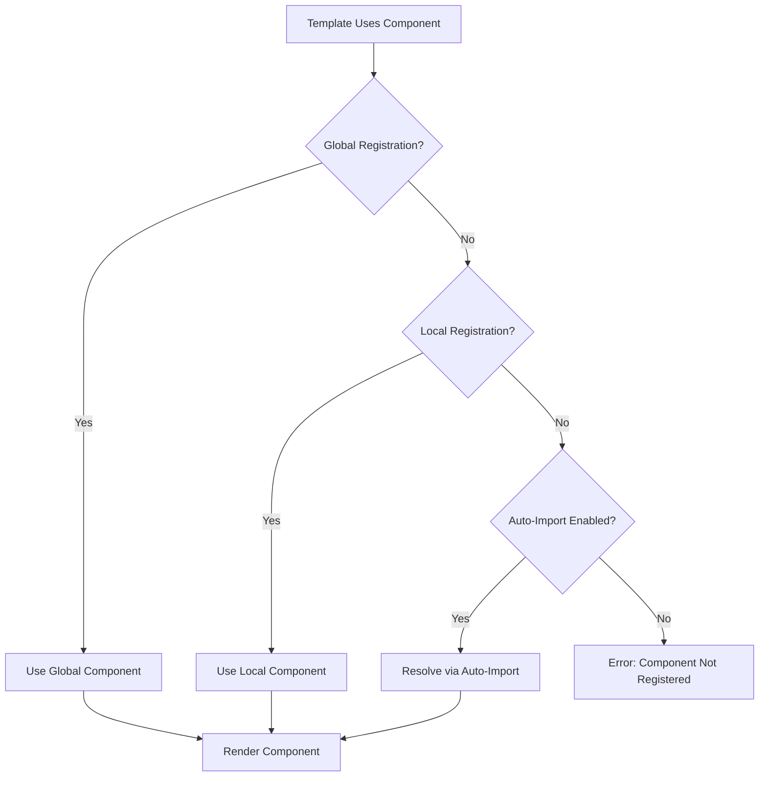
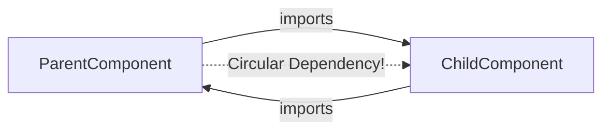
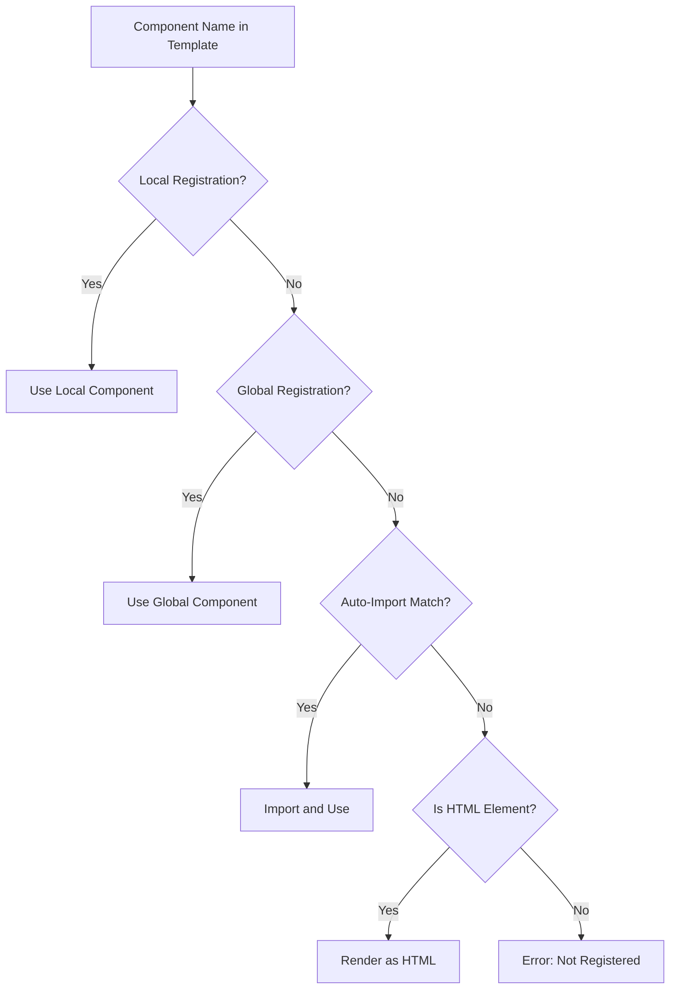

# How to Fix 'Component Not Registered' Errors in Vue

Author: [nawazdhandala](https://www.github.com/nawazdhandala)

Tags: Vue, Components, Troubleshooting, JavaScript, Frontend, Debugging

Description: Learn how to diagnose and resolve Vue component registration errors, including common causes, debugging techniques, and best practices for component organization.

---

> The "Component Not Registered" error is one of the most common issues Vue developers encounter. This guide covers all the causes and solutions to help you quickly resolve these errors and prevent them in the future.

Component registration errors occur when Vue cannot find a component you are trying to use in a template. Understanding how Vue resolves components is key to fixing these issues.

---

## Common Error Messages

| Error Message | Likely Cause |
|---------------|--------------|
| `Unknown custom element: <my-component>` | Component not registered |
| `Failed to resolve component: MyComponent` | Missing import or registration |
| `Component is missing template or render function` | Incomplete component definition |
| `Invalid component name` | Naming convention violation |

---

## Component Registration Flow



---

## Cause 1: Missing Component Import

The most common cause is forgetting to import the component.

```vue
<!-- BAD: Component not imported -->
<template>
  <div>
    <!-- This will fail - UserCard is not imported -->
    <UserCard :user="currentUser" />
  </div>
</template>

<script setup>
import { ref } from 'vue'

const currentUser = ref({ name: 'John', email: 'john@example.com' })
</script>
```

```vue
<!-- GOOD: Component properly imported -->
<template>
  <div>
    <UserCard :user="currentUser" />
  </div>
</template>

<script setup>
import { ref } from 'vue'
// Import the component
import UserCard from './components/UserCard.vue'

const currentUser = ref({ name: 'John', email: 'john@example.com' })
</script>
```

---

## Cause 2: Incorrect Component Registration (Options API)

With Options API, components must be registered in the `components` option.

```javascript
// BAD: Component imported but not registered
import UserCard from './components/UserCard.vue'

export default {
  data() {
    return {
      user: { name: 'John' }
    }
  }
  // Missing components registration!
}
```

```javascript
// GOOD: Component properly registered
import UserCard from './components/UserCard.vue'

export default {
  // Register the component
  components: {
    UserCard
  },
  data() {
    return {
      user: { name: 'John' }
    }
  }
}
```

---

## Cause 3: Case Sensitivity Issues

Vue component names are case-sensitive. Mismatched casing causes registration failures.

```vue
<!-- Component file: UserCard.vue -->
<script>
export default {
  name: 'UserCard'
}
</script>
```

```vue
<!-- BAD: Incorrect casing in template -->
<template>
  <!-- These will fail or cause warnings -->
  <usercard />
  <user-Card />
  <USERCARD />
</template>
```

```vue
<!-- GOOD: Correct casing options -->
<template>
  <!-- PascalCase (recommended for SFC) -->
  <UserCard />

  <!-- kebab-case (works in templates) -->
  <user-card />
</template>
```

---

## Cause 4: Circular Dependencies

Circular imports between components cause registration failures.



### Solution: Use Async Components

```javascript
// ParentComponent.vue
import { defineAsyncComponent } from 'vue'

export default {
  components: {
    // Lazy load to break circular dependency
    ChildComponent: defineAsyncComponent(() =>
      import('./ChildComponent.vue')
    )
  }
}
```

### Solution: Use provide/inject

```vue
<!-- ParentComponent.vue -->
<script setup>
import { provide } from 'vue'
import ChildComponent from './ChildComponent.vue'

// Provide parent reference instead of importing
provide('parentComponent', {
  doSomething: () => console.log('Parent action')
})
</script>

<template>
  <ChildComponent />
</template>
```

```vue
<!-- ChildComponent.vue -->
<script setup>
import { inject } from 'vue'

// Inject parent instead of importing
const parent = inject('parentComponent')
</script>
```

---

## Cause 5: Incorrect File Paths

Wrong import paths prevent component resolution.

```javascript
// BAD: Various path issues
import UserCard from './components/userCard.vue'    // Wrong case
import UserCard from './components/UserCard'        // Missing extension
import UserCard from 'components/UserCard.vue'      // Missing ./
import UserCard from '../components/UserCard.vue'   // Wrong relative path
```

```javascript
// GOOD: Correct path
import UserCard from './components/UserCard.vue'

// Using path aliases (configured in vite.config.js or tsconfig.json)
import UserCard from '@/components/UserCard.vue'
```

### Configure Path Aliases

```javascript
// vite.config.js
import { defineConfig } from 'vite'
import vue from '@vitejs/plugin-vue'
import path from 'path'

export default defineConfig({
  plugins: [vue()],
  resolve: {
    alias: {
      '@': path.resolve(__dirname, './src'),
      '@components': path.resolve(__dirname, './src/components')
    }
  }
})
```

```json
// tsconfig.json (for TypeScript support)
{
  "compilerOptions": {
    "baseUrl": ".",
    "paths": {
      "@/*": ["src/*"],
      "@components/*": ["src/components/*"]
    }
  }
}
```

---

## Cause 6: Missing Global Registration

Components intended for global use must be registered globally.

```javascript
// main.js - BAD: Forgetting to register globally
import { createApp } from 'vue'
import App from './App.vue'
import BaseButton from './components/BaseButton.vue'

const app = createApp(App)
// BaseButton is imported but not registered!
app.mount('#app')
```

```javascript
// main.js - GOOD: Proper global registration
import { createApp } from 'vue'
import App from './App.vue'
import BaseButton from './components/BaseButton.vue'
import BaseInput from './components/BaseInput.vue'
import BaseCard from './components/BaseCard.vue'

const app = createApp(App)

// Register components globally
app.component('BaseButton', BaseButton)
app.component('BaseInput', BaseInput)
app.component('BaseCard', BaseCard)

app.mount('#app')
```

### Auto-Register Global Components

```javascript
// main.js - Auto-register all Base components
import { createApp } from 'vue'
import App from './App.vue'

const app = createApp(App)

// Auto-register using Vite's glob import
const components = import.meta.glob('./components/Base*.vue', { eager: true })

for (const path in components) {
  const componentName = path.split('/').pop().replace('.vue', '')
  app.component(componentName, components[path].default)
}

app.mount('#app')
```

---

## Cause 7: Dynamic Components

Dynamic components require special handling.

```vue
<!-- BAD: Dynamic component not properly resolved -->
<template>
  <component :is="currentComponent" />
</template>

<script setup>
import { ref } from 'vue'

// This is just a string, not a component!
const currentComponent = ref('UserCard')
</script>
```

```vue
<!-- GOOD: Dynamic component with proper resolution -->
<template>
  <component :is="currentComponent" />
</template>

<script setup>
import { ref, shallowRef, markRaw } from 'vue'
import UserCard from './UserCard.vue'
import UserProfile from './UserProfile.vue'

// Use shallowRef for components to avoid reactivity overhead
const currentComponent = shallowRef(UserCard)

// Component map for string-based switching
const componentMap = {
  UserCard: markRaw(UserCard),
  UserProfile: markRaw(UserProfile)
}

const switchComponent = (name) => {
  currentComponent.value = componentMap[name]
}
</script>
```

### Async Dynamic Components

```vue
<template>
  <Suspense>
    <component :is="asyncComponent" />
    <template #fallback>
      <div>Loading...</div>
    </template>
  </Suspense>
</template>

<script setup>
import { defineAsyncComponent, shallowRef } from 'vue'

const asyncComponent = shallowRef(null)

const loadComponent = async (name) => {
  asyncComponent.value = defineAsyncComponent(() =>
    import(`./components/${name}.vue`)
  )
}
</script>
```

---

## Cause 8: Plugin Components Not Installed

Third-party component libraries require proper installation.

```javascript
// BAD: Using library component without installing plugin
import { createApp } from 'vue'
import App from './App.vue'

const app = createApp(App)
app.mount('#app')

// Template uses <el-button> but ElementPlus not installed
```

```javascript
// GOOD: Install the plugin first
import { createApp } from 'vue'
import App from './App.vue'
import ElementPlus from 'element-plus'
import 'element-plus/dist/index.css'

const app = createApp(App)
app.use(ElementPlus)  // Install the plugin
app.mount('#app')
```

### Tree-Shaking with On-Demand Import

```javascript
// vite.config.js
import { defineConfig } from 'vite'
import vue from '@vitejs/plugin-vue'
import AutoImport from 'unplugin-auto-import/vite'
import Components from 'unplugin-vue-components/vite'
import { ElementPlusResolver } from 'unplugin-vue-components/resolvers'

export default defineConfig({
  plugins: [
    vue(),
    AutoImport({
      resolvers: [ElementPlusResolver()]
    }),
    Components({
      resolvers: [ElementPlusResolver()]
    })
  ]
})
```

---

## Debugging Techniques

### 1. Check Vue DevTools

```javascript
// In browser console with Vue DevTools
// Check if component is registered
console.log(app._context.components)
```

### 2. Add Debug Logging

```vue
<script setup>
import { onMounted, getCurrentInstance } from 'vue'

onMounted(() => {
  const instance = getCurrentInstance()

  // Log available components
  console.log('Registered components:',
    Object.keys(instance.appContext.components)
  )

  // Log component resolution
  console.log('Component type:', instance.type)
})
</script>
```

### 3. Create a Debug Component

```vue
<!-- DebugComponents.vue -->
<script setup>
import { getCurrentInstance } from 'vue'

const instance = getCurrentInstance()
const globalComponents = Object.keys(instance.appContext.components)
const localComponents = Object.keys(instance.type.components || {})
</script>

<template>
  <div class="debug-panel">
    <h3>Global Components</h3>
    <ul>
      <li v-for="name in globalComponents" :key="name">{{ name }}</li>
    </ul>

    <h3>Local Components</h3>
    <ul>
      <li v-for="name in localComponents" :key="name">{{ name }}</li>
    </ul>
  </div>
</template>
```

---

## Auto-Import Configuration

Modern Vue projects can use auto-import to avoid manual registration.

### Vite Configuration

```javascript
// vite.config.js
import { defineConfig } from 'vite'
import vue from '@vitejs/plugin-vue'
import Components from 'unplugin-vue-components/vite'

export default defineConfig({
  plugins: [
    vue(),
    Components({
      // Specify directories to search for components
      dirs: ['src/components'],

      // File extensions to consider
      extensions: ['vue'],

      // Allow subdirectories as namespace prefix
      directoryAsNamespace: true,

      // Generate TypeScript declarations
      dts: true,

      // Custom resolvers for UI libraries
      resolvers: [
        // Auto-import from specific directories
        (componentName) => {
          if (componentName.startsWith('Base')) {
            return {
              name: 'default',
              from: `@/components/${componentName}.vue`
            }
          }
        }
      ]
    })
  ]
})
```

### Generated Type Declarations

```typescript
// components.d.ts (auto-generated)
declare module 'vue' {
  export interface GlobalComponents {
    BaseButton: typeof import('./src/components/BaseButton.vue')['default']
    BaseInput: typeof import('./src/components/BaseInput.vue')['default']
    UserCard: typeof import('./src/components/UserCard.vue')['default']
  }
}
```

---

## Component Resolution Priority



---

## Best Practices

### 1. Consistent Naming Convention

```javascript
// Component file: UserProfileCard.vue
export default {
  name: 'UserProfileCard'  // Match filename
}

// Usage in template
// <UserProfileCard /> or <user-profile-card />
```

### 2. Organize Components by Feature

```
src/
  components/
    common/           # Shared/base components
      BaseButton.vue
      BaseInput.vue
    user/             # User feature components
      UserCard.vue
      UserProfile.vue
    product/          # Product feature components
      ProductCard.vue
      ProductList.vue
```

### 3. Use Index Files for Exports

```javascript
// components/user/index.js
export { default as UserCard } from './UserCard.vue'
export { default as UserProfile } from './UserProfile.vue'
export { default as UserAvatar } from './UserAvatar.vue'

// Usage
import { UserCard, UserProfile } from '@/components/user'
```

### 4. TypeScript Component Props

```vue
<!-- UserCard.vue -->
<script setup lang="ts">
interface User {
  id: number
  name: string
  email: string
  avatar?: string
}

interface Props {
  user: User
  showEmail?: boolean
}

const props = withDefaults(defineProps<Props>(), {
  showEmail: true
})
</script>
```

---

## Quick Troubleshooting Checklist

| Check | Action |
|-------|--------|
| Is component imported? | Add import statement |
| Is component registered? | Add to components option (Options API) |
| Is casing correct? | Match filename and registration |
| Is path correct? | Verify relative/alias path |
| Is plugin installed? | Call app.use() for libraries |
| Is it a circular dependency? | Use async components |
| Is auto-import configured? | Check vite.config.js |

---

## Conclusion

Component registration errors are usually straightforward to fix once you understand Vue's component resolution system. Key takeaways:

- Always import components before using them
- Use consistent naming conventions (PascalCase)
- Configure path aliases for cleaner imports
- Consider auto-import plugins for larger projects
- Use Vue DevTools to debug registration issues

Following these practices will help you avoid component registration errors in your Vue applications.

---

*Building Vue applications that need monitoring? [OneUptime](https://oneuptime.com) provides comprehensive frontend monitoring with error tracking and performance metrics.*

**Related Reading:**
- [How to Configure Vue with TypeScript](https://oneuptime.com/blog/post/2026-01-24-vue-typescript-configuration/view)
- [How to Handle Vue Composition API Migration](https://oneuptime.com/blog/post/2026-01-24-vue-composition-api-migration/view)
