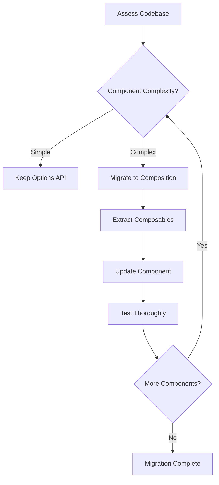
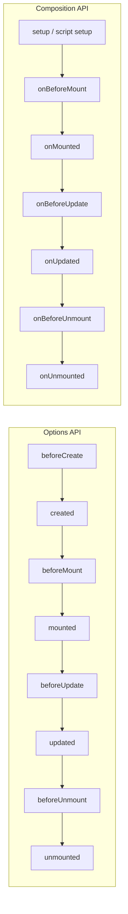

# How to Handle Vue Composition API Migration

Author: [nawazdhandala](https://www.github.com/nawazdhandala)

Tags: Vue, Composition API, Migration, Options API, JavaScript, Refactoring, Frontend

Description: A comprehensive guide to migrating Vue components from the Options API to the Composition API, including step-by-step patterns, common pitfalls, and strategies for gradual adoption.

---

> Migrating from the Options API to the Composition API improves code organization, reusability, and TypeScript support. This guide provides a systematic approach to migrating your Vue 2/3 Options API code to the modern Composition API.

The Composition API is not a replacement but an alternative to the Options API. You can use both in the same project, making gradual migration possible.

---

## Why Migrate?

| Options API | Composition API |
|-------------|-----------------|
| Code split by option type | Code grouped by feature |
| Limited reusability (mixins) | Easy reuse (composables) |
| `this` context confusion | No `this`, explicit imports |
| Basic TypeScript support | Full TypeScript inference |
| Simple components | Complex logic, large components |

---

## Migration Strategy Overview



---

## Basic Migration Pattern

### Options API Original

```javascript
// UserProfile.vue - Options API
export default {
  name: 'UserProfile',

  props: {
    userId: {
      type: Number,
      required: true
    }
  },

  emits: ['update', 'delete'],

  data() {
    return {
      user: null,
      loading: false,
      error: null,
      isEditing: false
    }
  },

  computed: {
    fullName() {
      if (!this.user) return ''
      return `${this.user.firstName} ${this.user.lastName}`
    },

    canEdit() {
      return this.user && !this.loading
    }
  },

  watch: {
    userId: {
      handler(newId) {
        this.fetchUser(newId)
      },
      immediate: true
    }
  },

  methods: {
    async fetchUser(id) {
      this.loading = true
      this.error = null

      try {
        const response = await fetch(`/api/users/${id}`)
        this.user = await response.json()
      } catch (e) {
        this.error = e.message
      } finally {
        this.loading = false
      }
    },

    handleUpdate() {
      this.$emit('update', this.user)
    },

    handleDelete() {
      this.$emit('delete', this.userId)
    },

    toggleEdit() {
      this.isEditing = !this.isEditing
    }
  },

  mounted() {
    console.log('Component mounted')
  },

  beforeUnmount() {
    console.log('Component will unmount')
  }
}
```

### Composition API Migration

```vue
<!-- UserProfile.vue - Composition API -->
<script setup>
import { ref, computed, watch, onMounted, onBeforeUnmount } from 'vue'

// Props
const props = defineProps({
  userId: {
    type: Number,
    required: true
  }
})

// Emits
const emit = defineEmits(['update', 'delete'])

// Reactive state (data)
const user = ref(null)
const loading = ref(false)
const error = ref(null)
const isEditing = ref(false)

// Computed properties
const fullName = computed(() => {
  if (!user.value) return ''
  return `${user.value.firstName} ${user.value.lastName}`
})

const canEdit = computed(() => {
  return user.value && !loading.value
})

// Methods
async function fetchUser(id) {
  loading.value = true
  error.value = null

  try {
    const response = await fetch(`/api/users/${id}`)
    user.value = await response.json()
  } catch (e) {
    error.value = e.message
  } finally {
    loading.value = false
  }
}

function handleUpdate() {
  emit('update', user.value)
}

function handleDelete() {
  emit('delete', props.userId)
}

function toggleEdit() {
  isEditing.value = !isEditing.value
}

// Watchers
watch(
  () => props.userId,
  (newId) => {
    fetchUser(newId)
  },
  { immediate: true }
)

// Lifecycle hooks
onMounted(() => {
  console.log('Component mounted')
})

onBeforeUnmount(() => {
  console.log('Component will unmount')
})
</script>
```

---

## Migration Reference Table

| Options API | Composition API |
|-------------|-----------------|
| `data()` | `ref()` / `reactive()` |
| `computed: {}` | `computed()` |
| `watch: {}` | `watch()` / `watchEffect()` |
| `methods: {}` | Regular functions |
| `props` | `defineProps()` |
| `emits` | `defineEmits()` |
| `this.$emit()` | `emit()` |
| `this.$refs` | `ref()` + template ref |
| `mounted()` | `onMounted()` |
| `created()` | `<script setup>` body |
| `beforeUnmount()` | `onBeforeUnmount()` |
| `mixins` | Composables |

---

## Migrating State

### Data to Refs

```javascript
// Options API
data() {
  return {
    count: 0,
    name: 'John',
    items: [],
    user: {
      firstName: 'John',
      lastName: 'Doe'
    }
  }
}

// Composition API
import { ref, reactive } from 'vue'

// Primitive values - use ref
const count = ref(0)
const name = ref('John')
const items = ref([])

// Objects - can use ref or reactive
const user = ref({
  firstName: 'John',
  lastName: 'Doe'
})

// Or with reactive (no .value needed for nested properties)
const user = reactive({
  firstName: 'John',
  lastName: 'Doe'
})
```

### Accessing Ref Values

```javascript
// Options API
this.count++
this.user.firstName = 'Jane'

// Composition API with ref
count.value++
user.value.firstName = 'Jane'

// Composition API with reactive
user.firstName = 'Jane'  // No .value needed
```

---

## Migrating Computed Properties

```javascript
// Options API
computed: {
  fullName() {
    return `${this.firstName} ${this.lastName}`
  },

  // Writable computed
  fullNameWritable: {
    get() {
      return `${this.firstName} ${this.lastName}`
    },
    set(value) {
      const [first, last] = value.split(' ')
      this.firstName = first
      this.lastName = last
    }
  }
}

// Composition API
import { computed } from 'vue'

const fullName = computed(() => {
  return `${firstName.value} ${lastName.value}`
})

// Writable computed
const fullNameWritable = computed({
  get() {
    return `${firstName.value} ${lastName.value}`
  },
  set(value) {
    const [first, last] = value.split(' ')
    firstName.value = first
    lastName.value = last
  }
})
```

---

## Migrating Watchers

```javascript
// Options API
watch: {
  // Simple watch
  searchQuery(newVal, oldVal) {
    this.search(newVal)
  },

  // Watch with options
  userId: {
    handler(newId) {
      this.fetchUser(newId)
    },
    immediate: true,
    deep: false
  },

  // Watch nested property
  'user.name'(newName) {
    console.log('Name changed:', newName)
  }
}

// Composition API
import { watch, watchEffect } from 'vue'

// Simple watch
watch(searchQuery, (newVal, oldVal) => {
  search(newVal)
})

// Watch with options
watch(
  () => props.userId,
  (newId) => {
    fetchUser(newId)
  },
  { immediate: true }
)

// Watch nested property
watch(
  () => user.value.name,
  (newName) => {
    console.log('Name changed:', newName)
  }
)

// Multiple sources
watch(
  [firstName, lastName],
  ([newFirst, newLast], [oldFirst, oldLast]) => {
    console.log('Name changed')
  }
)

// watchEffect - auto tracks dependencies
watchEffect(() => {
  console.log('User:', user.value?.name)
  // Automatically watches user
})
```

---

## Migrating Lifecycle Hooks



```javascript
// Options API
export default {
  beforeCreate() {
    console.log('beforeCreate')
  },
  created() {
    this.initialize()
  },
  beforeMount() {
    console.log('beforeMount')
  },
  mounted() {
    this.setupEventListeners()
  },
  beforeUpdate() {
    console.log('beforeUpdate')
  },
  updated() {
    console.log('updated')
  },
  beforeUnmount() {
    this.cleanup()
  },
  unmounted() {
    console.log('unmounted')
  }
}

// Composition API
import {
  onBeforeMount,
  onMounted,
  onBeforeUpdate,
  onUpdated,
  onBeforeUnmount,
  onUnmounted
} from 'vue'

// beforeCreate and created logic runs in setup / script setup body
initialize()

onBeforeMount(() => {
  console.log('beforeMount')
})

onMounted(() => {
  setupEventListeners()
})

onBeforeUpdate(() => {
  console.log('beforeUpdate')
})

onUpdated(() => {
  console.log('updated')
})

onBeforeUnmount(() => {
  cleanup()
})

onUnmounted(() => {
  console.log('unmounted')
})
```

---

## Migrating Mixins to Composables

### Options API Mixin

```javascript
// mixins/userMixin.js
export default {
  data() {
    return {
      user: null,
      userLoading: false,
      userError: null
    }
  },

  computed: {
    userFullName() {
      return this.user
        ? `${this.user.firstName} ${this.user.lastName}`
        : ''
    }
  },

  methods: {
    async fetchUser(id) {
      this.userLoading = true
      try {
        const res = await fetch(`/api/users/${id}`)
        this.user = await res.json()
      } catch (e) {
        this.userError = e.message
      } finally {
        this.userLoading = false
      }
    }
  }
}

// Using mixin
import userMixin from './mixins/userMixin'

export default {
  mixins: [userMixin],
  mounted() {
    this.fetchUser(1)
  }
}
```

### Composition API Composable

```javascript
// composables/useUser.js
import { ref, computed } from 'vue'

export function useUser() {
  const user = ref(null)
  const loading = ref(false)
  const error = ref(null)

  const fullName = computed(() => {
    return user.value
      ? `${user.value.firstName} ${user.value.lastName}`
      : ''
  })

  async function fetchUser(id) {
    loading.value = true
    error.value = null

    try {
      const res = await fetch(`/api/users/${id}`)
      user.value = await res.json()
    } catch (e) {
      error.value = e.message
    } finally {
      loading.value = false
    }
  }

  return {
    user,
    loading,
    error,
    fullName,
    fetchUser
  }
}

// Using composable
import { useUser } from './composables/useUser'
import { onMounted } from 'vue'

const { user, loading, error, fullName, fetchUser } = useUser()

onMounted(() => {
  fetchUser(1)
})
```

### Composable Advantages

```javascript
// Multiple instances possible (not shared state)
const userA = useUser()
const userB = useUser()

// Can compose multiple composables
function useUserWithAuth() {
  const { user, fetchUser } = useUser()
  const { isAuthenticated } = useAuth()

  async function fetchAuthenticatedUser(id) {
    if (!isAuthenticated.value) {
      throw new Error('Not authenticated')
    }
    return fetchUser(id)
  }

  return {
    user,
    isAuthenticated,
    fetchAuthenticatedUser
  }
}
```

---

## Migrating Template Refs

```javascript
// Options API
export default {
  mounted() {
    this.$refs.input.focus()
    this.$refs.items.forEach(item => {
      console.log(item.textContent)
    })
  }
}

// Template
// <input ref="input">
// <div v-for="item in items" ref="items">{{ item }}</div>

// Composition API
import { ref, onMounted } from 'vue'

// Template ref - same name as ref attribute
const input = ref(null)
const items = ref([])

onMounted(() => {
  input.value.focus()
  items.value.forEach(item => {
    console.log(item.textContent)
  })
})

// Template
// <input ref="input">
// <div v-for="item in list" ref="items">{{ item }}</div>
```

---

## Migrating Provide/Inject

```javascript
// Options API - Provider
export default {
  provide() {
    return {
      theme: this.theme,
      updateTheme: this.updateTheme
    }
  },
  data() {
    return {
      theme: 'light'
    }
  },
  methods: {
    updateTheme(newTheme) {
      this.theme = newTheme
    }
  }
}

// Options API - Consumer
export default {
  inject: ['theme', 'updateTheme']
}

// Composition API - Provider
import { provide, ref } from 'vue'

const theme = ref('light')

function updateTheme(newTheme) {
  theme.value = newTheme
}

provide('theme', theme)
provide('updateTheme', updateTheme)

// Or provide reactive object
provide('themeContext', {
  theme,
  updateTheme
})

// Composition API - Consumer
import { inject } from 'vue'

const theme = inject('theme')
const updateTheme = inject('updateTheme')

// With default value
const theme = inject('theme', ref('light'))

// Or inject object
const { theme, updateTheme } = inject('themeContext')
```

---

## Gradual Migration Strategy

### Phase 1: New Components

```javascript
// Use Composition API for all new components
// Keep existing components in Options API

// NewComponent.vue
<script setup>
// New code uses Composition API
</script>
```

### Phase 2: Extract Shared Logic

```javascript
// Convert mixins to composables
// Both APIs can use composables

// Options API component using composable
import { useUser } from './composables/useUser'

export default {
  setup() {
    return useUser()
  },
  // Rest of Options API
  computed: {
    displayName() {
      return this.fullName || 'Guest'
    }
  }
}
```

### Phase 3: Migrate Complex Components

```javascript
// Start with largest/most complex components
// These benefit most from Composition API organization

// Large component - group by feature
<script setup>
// Feature: User Management
const { user, fetchUser, updateUser } = useUser()

// Feature: Permissions
const { permissions, canEdit, canDelete } = usePermissions()

// Feature: UI State
const { isModalOpen, openModal, closeModal } = useModal()

// Feature: Form Handling
const { form, errors, validate, submit } = useForm()
</script>
```

---

## Common Migration Pitfalls

### 1. Forgetting .value

```javascript
// Wrong
const count = ref(0)
count++  // This doesn't work!

// Correct
count.value++
```

### 2. Destructuring Reactive Objects

```javascript
// Wrong - loses reactivity
const state = reactive({ count: 0 })
const { count } = state  // count is not reactive!

// Correct - use toRefs
import { toRefs } from 'vue'
const { count } = toRefs(state)  // count is now a ref
```

### 3. Returning from Setup

```javascript
// Options API setup() function - must return
export default {
  setup() {
    const count = ref(0)
    // Must return for template access
    return { count }
  }
}

// script setup - no return needed
<script setup>
const count = ref(0)
// Automatically available in template
</script>
```

### 4. This Context

```javascript
// Options API
methods: {
  handleClick() {
    this.count++  // 'this' works
    this.$emit('click')
  }
}

// Composition API - no 'this'
const emit = defineEmits(['click'])

function handleClick() {
  count.value++  // Use .value
  emit('click')   // Use emit directly
}
```

---

## Testing Migrated Components

```javascript
// Testing Composition API components
import { mount } from '@vue/test-utils'
import UserProfile from './UserProfile.vue'

describe('UserProfile', () => {
  it('displays user name', async () => {
    const wrapper = mount(UserProfile, {
      props: {
        userId: 1
      }
    })

    // Wait for async operations
    await wrapper.vm.$nextTick()

    expect(wrapper.text()).toContain('John Doe')
  })

  it('emits update event', async () => {
    const wrapper = mount(UserProfile, {
      props: { userId: 1 }
    })

    await wrapper.find('button.update').trigger('click')

    expect(wrapper.emitted('update')).toBeTruthy()
  })
})

// Testing composables
import { useUser } from './composables/useUser'

describe('useUser', () => {
  it('fetches user data', async () => {
    const { user, loading, fetchUser } = useUser()

    expect(loading.value).toBe(false)

    await fetchUser(1)

    expect(user.value).toEqual({
      id: 1,
      firstName: 'John',
      lastName: 'Doe'
    })
  })
})
```

---

## Migration Checklist

| Step | Action |
|------|--------|
| 1 | Identify component complexity |
| 2 | Extract mixins to composables |
| 3 | Convert data to refs/reactive |
| 4 | Convert computed properties |
| 5 | Convert watchers |
| 6 | Convert lifecycle hooks |
| 7 | Update template refs |
| 8 | Convert provide/inject |
| 9 | Update tests |
| 10 | Remove Options API code |

---

## Conclusion

Migrating to the Composition API improves code organization and reusability. Key takeaways:

- Migrate gradually - both APIs work together
- Start with composables for shared logic
- Use `<script setup>` for cleaner syntax
- Group code by feature, not by option type
- Test thoroughly after migration
- Extract reusable logic into composables

The Composition API shines in complex components with multiple features and when sharing logic across components.

---

*Building Vue applications that need monitoring? [OneUptime](https://oneuptime.com) provides comprehensive frontend and backend monitoring for production Vue applications.*

**Related Reading:**
- [How to Handle Computed Properties in Vue 3](https://oneuptime.com/blog/post/2026-01-24-vue3-computed-properties/view)
- [How to Configure Vue with TypeScript](https://oneuptime.com/blog/post/2026-01-24-vue-typescript-configuration/view)
