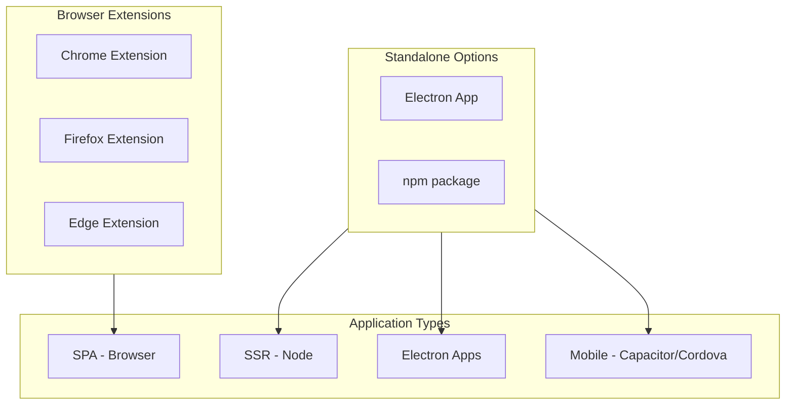
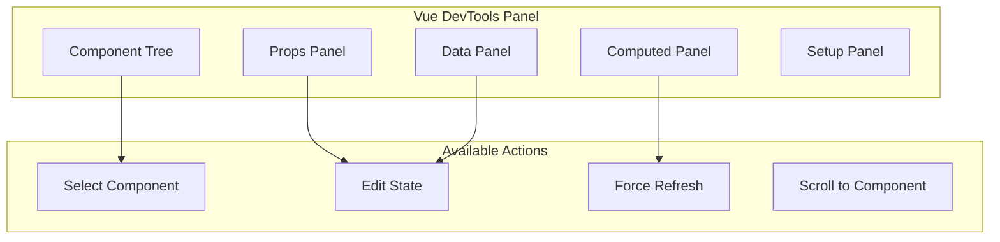
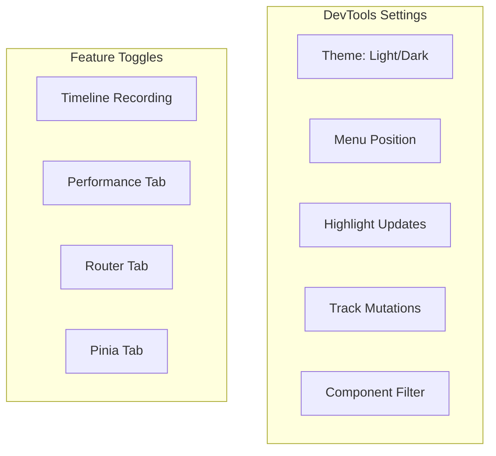

# How to Configure Vue DevTools

Author: [nawazdhandala](https://www.github.com/nawazdhandala)

Tags: Vue, DevTools, Debugging, Development, Browser Extension, Performance

Description: A complete guide to installing, configuring, and using Vue DevTools for debugging Vue 3 applications, including component inspection, state management, and performance profiling.

---

> Vue DevTools is an essential browser extension for Vue developers. This guide covers installation, configuration options, advanced features, and tips for effective debugging.

Vue DevTools provides deep insight into your Vue application's component tree, state, events, and performance. Proper configuration ensures you get the most out of this powerful debugging tool.

---

## Installation Options

Vue DevTools is available for multiple browsers and environments.



### Browser Extension Installation

```bash
# Chrome Web Store
# Search "Vue.js devtools" in Chrome Web Store
# Or visit: https://chrome.google.com/webstore/detail/vuejs-devtools

# Firefox Add-ons
# Search "Vue.js devtools" in Firefox Add-ons
# Or visit: https://addons.mozilla.org/en-US/firefox/addon/vue-js-devtools/

# Edge Add-ons
# Search "Vue.js devtools" in Edge Add-ons
# Or use Chrome extension compatibility
```

### Standalone Installation

```bash
# Install standalone DevTools for non-browser environments
npm install -g @vue/devtools

# Or as a project dependency
npm install --save-dev @vue/devtools

# Run standalone DevTools
vue-devtools
```

---

## Enabling DevTools in Your Application

DevTools must be enabled in your Vue application.

```javascript
// main.js
// Basic DevTools configuration for Vue 3

import { createApp } from 'vue'
import App from './App.vue'

const app = createApp(App)

// DevTools is enabled by default in development
// Vue automatically detects NODE_ENV

// Explicitly control DevTools
app.config.devtools = true  // Enable
app.config.devtools = false  // Disable

app.mount('#app')
```

```javascript
// main.js
// Environment-based DevTools configuration

import { createApp } from 'vue'
import App from './App.vue'

const app = createApp(App)

// Enable only in development
if (import.meta.env.DEV) {
  app.config.devtools = true

  // Enable performance tracking in DevTools
  app.config.performance = true
}

// Disable in production for security
if (import.meta.env.PROD) {
  app.config.devtools = false
  app.config.performance = false
}

app.mount('#app')
```

---

## Vite Configuration

Configure Vite for optimal DevTools integration.

```javascript
// vite.config.js
// Vite configuration for Vue DevTools

import { defineConfig } from 'vite'
import vue from '@vitejs/plugin-vue'

export default defineConfig({
  plugins: [vue()],

  // Enable source maps for better debugging
  build: {
    sourcemap: true
  },

  // Development server settings
  server: {
    // Enable HMR for component updates
    hmr: true
  },

  // Define environment variables
  define: {
    // Expose build info to DevTools
    __VUE_OPTIONS_API__: true,
    __VUE_PROD_DEVTOOLS__: false,  // Disable devtools in production build
    __VUE_PROD_HYDRATION_MISMATCH_DETAILS__: false
  }
})
```

```javascript
// vite.config.js
// Enable DevTools in production (for debugging only)

import { defineConfig } from 'vite'
import vue from '@vitejs/plugin-vue'

export default defineConfig(({ mode }) => ({
  plugins: [vue()],

  define: {
    // WARNING: Only enable for debugging production issues
    // Remove before deploying to real production
    __VUE_PROD_DEVTOOLS__: mode === 'staging'
  }
}))
```

---

## Standalone DevTools for SSR and Electron

Connect DevTools to non-browser environments.

```javascript
// server.js (Node/SSR application)
// Connect to standalone DevTools

// In your SSR application entry
import { createSSRApp } from 'vue'
import { devtools } from '@vue/devtools'

// Connect to standalone DevTools server
if (process.env.NODE_ENV === 'development') {
  devtools.connect('http://localhost', 8098)
}

const app = createSSRApp(App)
```

```javascript
// electron/main.js
// Electron application DevTools setup

const { app, BrowserWindow } = require('electron')
const path = require('path')

function createWindow() {
  const win = new BrowserWindow({
    width: 1200,
    height: 800,
    webPreferences: {
      nodeIntegration: true,
      contextIsolation: false,
      devTools: true  // Enable Chrome DevTools
    }
  })

  // Load Vue DevTools extension in Electron
  if (process.env.NODE_ENV === 'development') {
    const {
      default: installExtension,
      VUEJS_DEVTOOLS
    } = require('electron-devtools-installer')

    installExtension(VUEJS_DEVTOOLS)
      .then((name) => console.log(`Added Extension: ${name}`))
      .catch((err) => console.log('Extension Error:', err))
  }

  win.loadFile('index.html')
}

app.whenReady().then(createWindow)
```

---

## Component Inspector Features

The component inspector shows your component hierarchy.



```vue
<!-- ExampleComponent.vue -->
<!-- Component with various state types for DevTools inspection -->

<template>
  <div class="example">
    <h2>{{ title }}</h2>
    <p>Count: {{ count }}</p>
    <p>Double: {{ doubleCount }}</p>
    <button @click="increment">Increment</button>
  </div>
</template>

<script setup>
import { ref, computed, reactive, onMounted } from 'vue'

// Props - visible in Props panel
const props = defineProps({
  title: {
    type: String,
    default: 'Example'
  },
  initialCount: {
    type: Number,
    default: 0
  }
})

// Refs - visible in Setup panel
const count = ref(props.initialCount)
const message = ref('Hello')

// Reactive objects - visible in Setup panel
const user = reactive({
  name: 'John',
  preferences: {
    theme: 'dark',
    notifications: true
  }
})

// Computed - visible in Computed panel
const doubleCount = computed(() => count.value * 2)

// Functions - can be called from DevTools console
function increment() {
  count.value++
}

// DevTools can inspect all setup state
// Right-click component in tree for options:
// - Scroll to component
// - Show in Elements
// - Copy component state
// - Force refresh
</script>
```

---

## Custom Component Names

Ensure components have meaningful names in DevTools.

```vue
<!-- UserProfile.vue -->
<!-- Method 1: File name is used by default (UserProfile) -->

<script setup>
// Component name is automatically inferred from filename
const user = ref({ name: 'John' })
</script>
```

```vue
<!-- user-profile.vue -->
<!-- Method 2: Explicit name with defineOptions -->

<script setup>
import { defineOptions } from 'vue'

// Override the component name shown in DevTools
defineOptions({
  name: 'UserProfileComponent'
})

const user = ref({ name: 'John' })
</script>
```

```vue
<!-- GenericComponent.vue -->
<!-- Method 3: Options API name -->

<script>
export default {
  name: 'SpecificFeatureName',  // Shown in DevTools
  setup() {
    const data = ref(null)
    return { data }
  }
}
</script>
```

```javascript
// Functional components need explicit names
import { h } from 'vue'

const MyFunctionalComponent = (props) => {
  return h('div', props.message)
}

// Add name for DevTools
MyFunctionalComponent.displayName = 'MyFunctionalComponent'

export default MyFunctionalComponent
```

---

## Pinia Store Integration

DevTools provides excellent Pinia integration.

```javascript
// stores/userStore.js
// Pinia store with DevTools integration

import { defineStore } from 'pinia'

export const useUserStore = defineStore('user', {
  state: () => ({
    name: 'John',
    email: 'john@example.com',
    isAuthenticated: false,
    preferences: {
      theme: 'dark',
      language: 'en'
    }
  }),

  getters: {
    displayName: (state) => `${state.name} <${state.email}>`,
    isDarkMode: (state) => state.preferences.theme === 'dark'
  },

  actions: {
    async login(credentials) {
      // DevTools tracks this action
      const response = await fetch('/api/login', {
        method: 'POST',
        body: JSON.stringify(credentials)
      })
      const data = await response.json()

      this.name = data.name
      this.email = data.email
      this.isAuthenticated = true
    },

    logout() {
      this.$reset()  // DevTools shows reset
    },

    updatePreferences(prefs) {
      this.preferences = { ...this.preferences, ...prefs }
    }
  }
})
```

```javascript
// main.js
// Pinia setup with DevTools

import { createApp } from 'vue'
import { createPinia } from 'pinia'
import App from './App.vue'

const app = createApp(App)
const pinia = createPinia()

// Pinia automatically integrates with Vue DevTools
// No additional configuration needed
app.use(pinia)
app.mount('#app')
```

---

## Timeline and Events

Track component events and lifecycle in the Timeline.

```vue
<!-- EventTracker.vue -->
<!-- Component with events visible in DevTools Timeline -->

<template>
  <div class="event-tracker">
    <button @click="handleClick">Click Me</button>
    <input v-model="searchQuery" @input="handleSearch" />
    <select v-model="selectedOption" @change="handleChange">
      <option value="a">Option A</option>
      <option value="b">Option B</option>
    </select>
  </div>
</template>

<script setup>
import { ref, watch, onMounted, onUnmounted } from 'vue'

const emit = defineEmits(['click', 'search', 'change'])

const searchQuery = ref('')
const selectedOption = ref('a')

// These events appear in DevTools Timeline
function handleClick() {
  emit('click', { timestamp: Date.now() })
}

function handleSearch() {
  emit('search', searchQuery.value)
}

function handleChange() {
  emit('change', selectedOption.value)
}

// Lifecycle events appear in Timeline
onMounted(() => {
  console.log('EventTracker mounted')
})

onUnmounted(() => {
  console.log('EventTracker unmounted')
})

// Watch changes appear in Timeline
watch(searchQuery, (newQuery) => {
  console.log('Search query changed:', newQuery)
})
</script>
```

---

## Performance Profiling

Use DevTools to identify performance bottlenecks.

```javascript
// main.js
// Enable performance tracking

import { createApp } from 'vue'
import App from './App.vue'

const app = createApp(App)

// Enable performance tracking (development only)
if (import.meta.env.DEV) {
  app.config.performance = true
}

app.mount('#app')
```

```vue
<!-- HeavyComponent.vue -->
<!-- Component for performance testing -->

<template>
  <div class="heavy">
    <div v-for="item in processedItems" :key="item.id">
      {{ item.computed }}
    </div>
  </div>
</template>

<script setup>
import { ref, computed } from 'vue'

const items = ref(Array.from({ length: 1000 }, (_, i) => ({
  id: i,
  value: Math.random()
})))

// Performance panel shows computed recalculation time
const processedItems = computed(() => {
  console.time('processedItems')
  const result = items.value.map(item => ({
    ...item,
    computed: Math.sqrt(item.value) * 100
  }))
  console.timeEnd('processedItems')
  return result
})

// DevTools Performance tab shows:
// - Component render time
// - Computed recalculation time
// - Watch callback execution time
</script>
```

---

## Custom DevTools Plugins

Extend DevTools with custom functionality.

```javascript
// devtools-plugin.js
// Custom DevTools plugin

import { setupDevtoolsPlugin } from '@vue/devtools-api'

export function setupMyDevtoolsPlugin(app) {
  setupDevtoolsPlugin(
    {
      id: 'my-custom-plugin',
      label: 'My Custom Plugin',
      packageName: 'my-custom-plugin',
      homepage: 'https://example.com',
      componentStateTypes: ['my-custom-state'],
      app
    },
    (api) => {
      // Add custom inspector
      api.addInspector({
        id: 'my-inspector',
        label: 'My Inspector',
        icon: 'storage'
      })

      // Populate inspector tree
      api.on.getInspectorTree((payload) => {
        if (payload.inspectorId === 'my-inspector') {
          payload.rootNodes = [
            {
              id: 'root',
              label: 'Application State',
              children: [
                { id: 'config', label: 'Configuration' },
                { id: 'cache', label: 'Cache' }
              ]
            }
          ]
        }
      })

      // Populate inspector state
      api.on.getInspectorState((payload) => {
        if (payload.inspectorId === 'my-inspector') {
          if (payload.nodeId === 'config') {
            payload.state = {
              'Configuration': [
                { key: 'apiUrl', value: 'https://api.example.com' },
                { key: 'debug', value: true }
              ]
            }
          }
        }
      })

      // Add timeline event layer
      api.addTimelineLayer({
        id: 'my-events',
        label: 'My Events',
        color: 0x42b983
      })

      // Log events to timeline
      window.__myLogEvent = (event) => {
        api.addTimelineEvent({
          layerId: 'my-events',
          event: {
            time: Date.now(),
            title: event.title,
            data: event.data
          }
        })
      }
    }
  )
}
```

```javascript
// main.js
// Register custom DevTools plugin

import { createApp } from 'vue'
import App from './App.vue'
import { setupMyDevtoolsPlugin } from './devtools-plugin'

const app = createApp(App)

if (import.meta.env.DEV) {
  setupMyDevtoolsPlugin(app)
}

app.mount('#app')
```

---

## Router Integration

Vue Router integrates seamlessly with DevTools.

```javascript
// router/index.js
// Router with DevTools integration

import { createRouter, createWebHistory } from 'vue-router'

const router = createRouter({
  history: createWebHistory(),
  routes: [
    {
      path: '/',
      name: 'Home',
      component: () => import('../views/Home.vue'),
      meta: {
        title: 'Home Page',
        requiresAuth: false
      }
    },
    {
      path: '/dashboard',
      name: 'Dashboard',
      component: () => import('../views/Dashboard.vue'),
      meta: {
        title: 'Dashboard',
        requiresAuth: true
      }
    }
  ]
})

// Navigation events appear in DevTools Timeline
router.beforeEach((to, from) => {
  console.log(`Navigating: ${from.path} -> ${to.path}`)
})

export default router
```

---

## Troubleshooting DevTools Issues

Common problems and solutions.

```javascript
// Check if DevTools is detected
// Open browser console and run:
console.log('Vue detected:', !!window.__VUE__)
console.log('DevTools hook:', !!window.__VUE_DEVTOOLS_GLOBAL_HOOK__)

// Force DevTools detection
// Add to your main.js before app creation
if (typeof window !== 'undefined') {
  window.__VUE_DEVTOOLS_GLOBAL_HOOK__ =
    window.__VUE_DEVTOOLS_GLOBAL_HOOK__ || {
      Vue: null,
      enabled: true,
      _buffer: []
    }
}
```

```javascript
// main.js
// Debug DevTools connection issues

import { createApp } from 'vue'
import App from './App.vue'

const app = createApp(App)

// Verbose DevTools debugging
if (import.meta.env.DEV) {
  // Check DevTools availability
  const hook = window.__VUE_DEVTOOLS_GLOBAL_HOOK__

  if (!hook) {
    console.warn('Vue DevTools extension not detected')
    console.info('Install from: https://devtools.vuejs.org/guide/installation.html')
  } else {
    console.log('Vue DevTools detected, version:', hook.Vue?.version)
  }

  // Enable all debugging features
  app.config.devtools = true
  app.config.performance = true

  // Expose app instance globally for debugging
  window.__VUE_APP__ = app
}

app.mount('#app')
```

---

## DevTools Settings

Configure DevTools behavior through settings.



Key DevTools settings to configure:

1. **Component filtering** - Hide or show specific components
2. **Update highlighting** - Flash components when they re-render
3. **Timeline recording** - Control what events are captured
4. **Theme** - Match your IDE theme preference
5. **Notification** - Get alerts for errors and warnings

---

## Best Practices Summary

```javascript
// Recommended DevTools configuration for projects

// vite.config.js
import { defineConfig } from 'vite'
import vue from '@vitejs/plugin-vue'

export default defineConfig(({ mode }) => ({
  plugins: [vue()],

  define: {
    // Development: full DevTools support
    // Staging: DevTools enabled for debugging
    // Production: DevTools disabled
    __VUE_PROD_DEVTOOLS__: mode === 'staging',
    __VUE_OPTIONS_API__: true
  },

  build: {
    // Source maps for debugging
    sourcemap: mode !== 'production'
  }
}))
```

```javascript
// main.js - Recommended setup
import { createApp } from 'vue'
import { createPinia } from 'pinia'
import router from './router'
import App from './App.vue'

const app = createApp(App)

// Development configuration
if (import.meta.env.DEV) {
  app.config.devtools = true
  app.config.performance = true

  // Global error handler visible in DevTools
  app.config.errorHandler = (err, instance, info) => {
    console.error('Vue Error:', err)
    console.info('Component:', instance)
    console.info('Info:', info)
  }

  // Warning handler for development
  app.config.warnHandler = (msg, instance, trace) => {
    console.warn('Vue Warning:', msg)
    console.info('Trace:', trace)
  }
}

app.use(createPinia())
app.use(router)
app.mount('#app')
```

Key takeaways:

1. **Install the browser extension** for the best experience
2. **Enable performance tracking** in development
3. **Use meaningful component names** for easier debugging
4. **Configure Pinia** for state management visibility
5. **Disable DevTools in production** for security
6. **Use source maps** for accurate stack traces
7. **Leverage the Timeline** for event debugging
8. **Check the Settings panel** for customization options

Vue DevTools is an invaluable debugging tool that saves hours of development time when properly configured.
