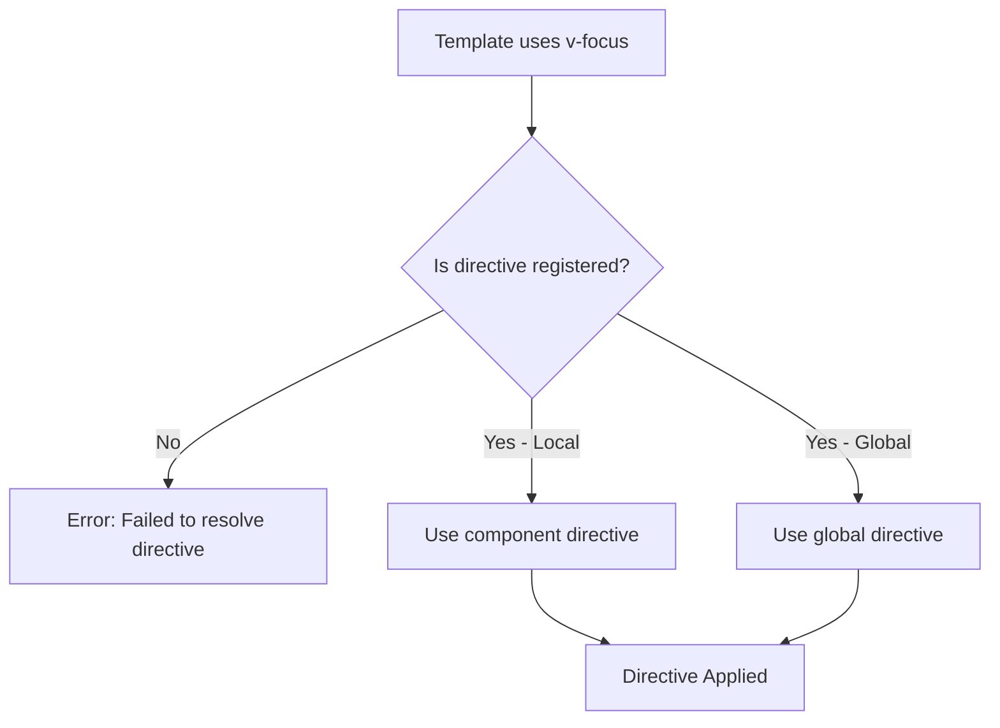
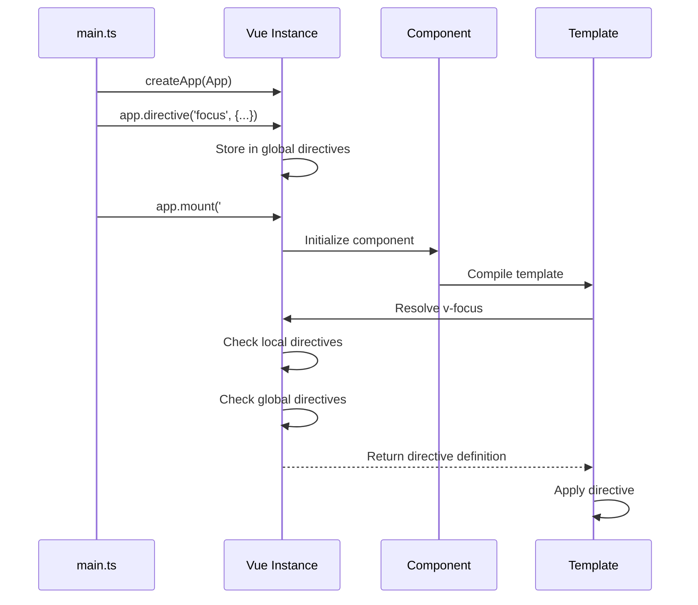
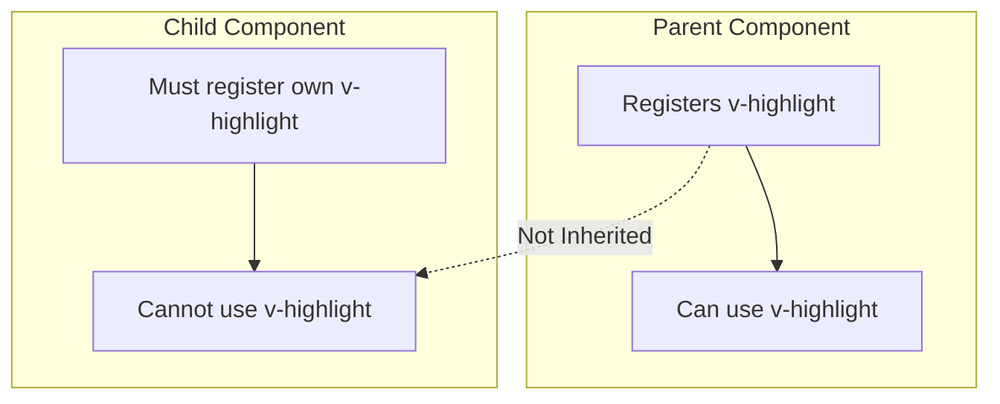
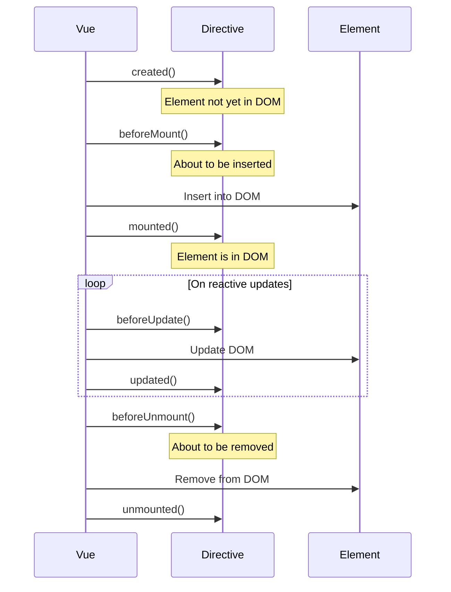
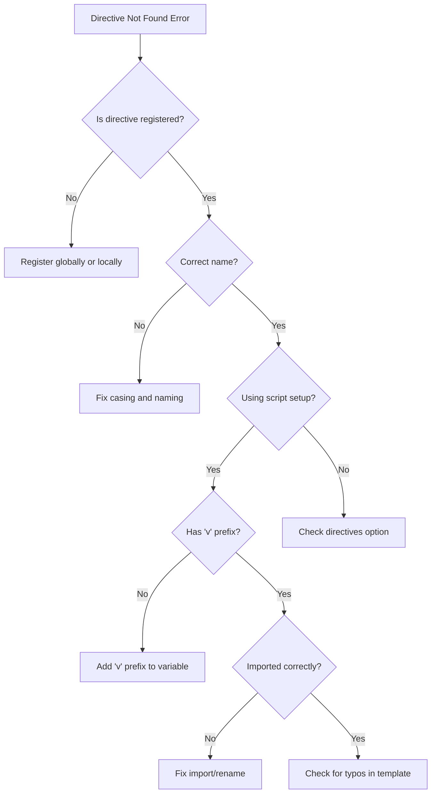

# How to Fix 'Directive Not Found' Errors in Vue

Author: [nawazdhandala](https://www.github.com/nawazdhandala)

Tags: Vue, Directives, Custom Directives, Error Handling, Vue 3, TypeScript

Description: A troubleshooting guide for resolving directive not found errors in Vue applications with examples of proper directive registration and usage.

---

The "Failed to resolve directive" error is a common issue in Vue applications that occurs when Vue cannot find a registered directive. In this guide, we will explore why this happens and how to fix it across different scenarios.

## Understanding the Error

When you see this warning in your console:

```
[Vue warn]: Failed to resolve directive: focus
```

It means Vue encountered a directive usage (`v-focus`) but could not find a corresponding directive definition.



## Common Cause 1: Directive Not Registered

The most common cause is simply forgetting to register the directive.

### Local Registration (Options API)

```javascript
// WRONG: Missing directive registration
export default {
    template: '<input v-focus />'
    // Directive not registered!
}
```

```javascript
// CORRECT: Register locally
export default {
    template: '<input v-focus />',
    directives: {
        focus: {
            mounted(el) {
                el.focus();
            }
        }
    }
}
```

### Local Registration (Composition API with script setup)

```vue
<!-- src/components/FocusInput.vue -->
<template>
    <input v-focus type="text" />
</template>

<script setup lang="ts">
// Define directive with 'v' prefix - Vue will auto-register it
const vFocus = {
    mounted: (el: HTMLElement) => {
        el.focus();
    }
};
</script>
```

### Global Registration

```typescript
// src/main.ts
import { createApp } from 'vue';
import App from './App.vue';

const app = createApp(App);

// Register directive globally
app.directive('focus', {
    mounted(el: HTMLElement) {
        el.focus();
    }
});

app.mount('#app');
```

## Directive Registration Flow



## Common Cause 2: Case Sensitivity Issues

Vue directives are case-sensitive. Ensure consistent casing:

```vue
<!-- WRONG: Mismatched casing -->
<template>
    <input v-Focus />
</template>

<script setup>
// Directive named 'focus' (lowercase)
const vFocus = {
    mounted: (el) => el.focus()
};
</script>
```

```vue
<!-- CORRECT: Consistent casing -->
<template>
    <input v-focus />
</template>

<script setup>
const vFocus = {
    mounted: (el) => el.focus()
};
</script>
```

## Common Cause 3: Wrong Directive Prefix

In `<script setup>`, local directives must start with lowercase 'v':

```vue
<!-- WRONG: Missing 'v' prefix -->
<script setup>
// This will NOT work
const focus = {
    mounted: (el) => el.focus()
};
</script>

<!-- CORRECT: Has 'v' prefix -->
<script setup>
// The 'v' prefix is required
const vFocus = {
    mounted: (el) => el.focus()
};
</script>
```

## Common Cause 4: Importing Directives Incorrectly

When importing directives from other files:

```typescript
// src/directives/focus.ts
export const focusDirective = {
    mounted(el: HTMLElement) {
        el.focus();
    }
};
```

```vue
<!-- WRONG: Import name does not have 'v' prefix -->
<template>
    <input v-focus />
</template>

<script setup>
import { focusDirective } from '@/directives/focus';
// Vue cannot find 'v-focus' because variable is 'focusDirective'
</script>

<!-- CORRECT: Rename on import or assign to v-prefixed variable -->
<template>
    <input v-focus />
</template>

<script setup>
import { focusDirective } from '@/directives/focus';
// Assign to v-prefixed variable
const vFocus = focusDirective;
</script>
```

## Common Cause 5: Directive in Wrong Scope

Directives registered in one component are not available in children:



### Solution: Use Global Registration or Plugin

```typescript
// src/directives/index.ts
import type { App } from 'vue';

// Focus directive
export const focusDirective = {
    mounted(el: HTMLElement) {
        el.focus();
    }
};

// Highlight directive
export const highlightDirective = {
    mounted(el: HTMLElement, binding: { value: string }) {
        el.style.backgroundColor = binding.value || 'yellow';
    },
    updated(el: HTMLElement, binding: { value: string }) {
        el.style.backgroundColor = binding.value || 'yellow';
    }
};

// Create plugin for all directives
export const directivesPlugin = {
    install(app: App) {
        app.directive('focus', focusDirective);
        app.directive('highlight', highlightDirective);
    }
};
```

```typescript
// src/main.ts
import { createApp } from 'vue';
import App from './App.vue';
import { directivesPlugin } from './directives';

const app = createApp(App);

// Register all directives at once
app.use(directivesPlugin);

app.mount('#app');
```

## Common Cause 6: Dynamic Directive Names

When using dynamic directive names, ensure the directive exists:

```vue
<template>
    <!-- Dynamic directive -->
    <div v-[directiveName]="value"></div>
</template>

<script setup>
import { ref } from 'vue';

// Directive name as reactive ref
const directiveName = ref('highlight');

// Must have all possible directives registered
const vHighlight = { /* ... */ };
const vTooltip = { /* ... */ };
</script>
```

## Common Cause 7: TypeScript Type Errors

When using TypeScript, you might encounter type-related issues:

```typescript
// src/directives/focus.ts

// Define directive types
import type { Directive, DirectiveBinding } from 'vue';

interface FocusBindingValue {
    delay?: number;
    select?: boolean;
}

export const focusDirective: Directive<HTMLElement, FocusBindingValue> = {
    mounted(el: HTMLElement, binding: DirectiveBinding<FocusBindingValue>) {
        const { delay = 0, select = false } = binding.value || {};

        setTimeout(() => {
            el.focus();
            if (select && el instanceof HTMLInputElement) {
                el.select();
            }
        }, delay);
    }
};
```

```vue
<!-- Usage with proper typing -->
<template>
    <input v-focus="{ delay: 100, select: true }" />
</template>

<script setup lang="ts">
import { focusDirective } from '@/directives/focus';
const vFocus = focusDirective;
</script>
```

## Debugging Directive Issues

Create a debugging utility to trace directive registration:

```typescript
// src/utils/debugDirectives.ts
import type { App, Directive } from 'vue';

export function debugDirective<T, V>(
    name: string,
    directive: Directive<T, V>
): Directive<T, V> {
    return {
        created(el, binding, vnode, prevVnode) {
            console.log(`[Directive ${name}] created`, { el, binding });
            if (typeof directive === 'object' && directive.created) {
                directive.created(el, binding, vnode, prevVnode);
            }
        },
        beforeMount(el, binding, vnode, prevVnode) {
            console.log(`[Directive ${name}] beforeMount`, { el, binding });
            if (typeof directive === 'object' && directive.beforeMount) {
                directive.beforeMount(el, binding, vnode, prevVnode);
            }
        },
        mounted(el, binding, vnode, prevVnode) {
            console.log(`[Directive ${name}] mounted`, { el, binding });
            if (typeof directive === 'object' && directive.mounted) {
                directive.mounted(el, binding, vnode, prevVnode);
            }
        },
        beforeUpdate(el, binding, vnode, prevVnode) {
            console.log(`[Directive ${name}] beforeUpdate`, { el, binding });
            if (typeof directive === 'object' && directive.beforeUpdate) {
                directive.beforeUpdate(el, binding, vnode, prevVnode);
            }
        },
        updated(el, binding, vnode, prevVnode) {
            console.log(`[Directive ${name}] updated`, { el, binding });
            if (typeof directive === 'object' && directive.updated) {
                directive.updated(el, binding, vnode, prevVnode);
            }
        },
        beforeUnmount(el, binding, vnode, prevVnode) {
            console.log(`[Directive ${name}] beforeUnmount`, { el, binding });
            if (typeof directive === 'object' && directive.beforeUnmount) {
                directive.beforeUnmount(el, binding, vnode, prevVnode);
            }
        },
        unmounted(el, binding, vnode, prevVnode) {
            console.log(`[Directive ${name}] unmounted`, { el, binding });
            if (typeof directive === 'object' && directive.unmounted) {
                directive.unmounted(el, binding, vnode, prevVnode);
            }
        }
    };
}

// Usage
import { focusDirective } from '@/directives/focus';

// Wrap in debug mode during development
const vFocus = import.meta.env.DEV
    ? debugDirective('focus', focusDirective)
    : focusDirective;
```

## Directive Lifecycle



## Complete Directive Example

Here is a comprehensive example of a tooltip directive:

```typescript
// src/directives/tooltip.ts
import type { Directive, DirectiveBinding } from 'vue';

interface TooltipOptions {
    text: string;
    position?: 'top' | 'bottom' | 'left' | 'right';
    delay?: number;
}

type TooltipValue = string | TooltipOptions;

// Store tooltip elements
const tooltipElements = new WeakMap<HTMLElement, HTMLElement>();

function createTooltip(el: HTMLElement, options: TooltipOptions): HTMLElement {
    const tooltip = document.createElement('div');
    tooltip.className = `tooltip tooltip-${options.position || 'top'}`;
    tooltip.textContent = options.text;
    tooltip.style.cssText = `
        position: absolute;
        background: #333;
        color: white;
        padding: 5px 10px;
        border-radius: 4px;
        font-size: 12px;
        z-index: 1000;
        opacity: 0;
        transition: opacity 0.2s;
        pointer-events: none;
    `;
    return tooltip;
}

function positionTooltip(
    el: HTMLElement,
    tooltip: HTMLElement,
    position: string
): void {
    const rect = el.getBoundingClientRect();
    const tooltipRect = tooltip.getBoundingClientRect();

    let top = 0;
    let left = 0;

    switch (position) {
        case 'top':
            top = rect.top - tooltipRect.height - 8;
            left = rect.left + (rect.width - tooltipRect.width) / 2;
            break;
        case 'bottom':
            top = rect.bottom + 8;
            left = rect.left + (rect.width - tooltipRect.width) / 2;
            break;
        case 'left':
            top = rect.top + (rect.height - tooltipRect.height) / 2;
            left = rect.left - tooltipRect.width - 8;
            break;
        case 'right':
            top = rect.top + (rect.height - tooltipRect.height) / 2;
            left = rect.right + 8;
            break;
    }

    tooltip.style.top = `${top + window.scrollY}px`;
    tooltip.style.left = `${left + window.scrollX}px`;
}

function showTooltip(el: HTMLElement, options: TooltipOptions): void {
    let tooltip = tooltipElements.get(el);

    if (!tooltip) {
        tooltip = createTooltip(el, options);
        document.body.appendChild(tooltip);
        tooltipElements.set(el, tooltip);
    }

    tooltip.textContent = options.text;

    // Position after adding to DOM
    requestAnimationFrame(() => {
        if (tooltip) {
            positionTooltip(el, tooltip, options.position || 'top');
            tooltip.style.opacity = '1';
        }
    });
}

function hideTooltip(el: HTMLElement): void {
    const tooltip = tooltipElements.get(el);
    if (tooltip) {
        tooltip.style.opacity = '0';
    }
}

function parseOptions(value: TooltipValue): TooltipOptions {
    if (typeof value === 'string') {
        return { text: value };
    }
    return value;
}

export const tooltipDirective: Directive<HTMLElement, TooltipValue> = {
    mounted(el: HTMLElement, binding: DirectiveBinding<TooltipValue>) {
        const options = parseOptions(binding.value);

        const showHandler = () => {
            setTimeout(() => showTooltip(el, options), options.delay || 0);
        };

        const hideHandler = () => hideTooltip(el);

        el.addEventListener('mouseenter', showHandler);
        el.addEventListener('mouseleave', hideHandler);
        el.addEventListener('focus', showHandler);
        el.addEventListener('blur', hideHandler);

        // Store handlers for cleanup
        (el as any)._tooltipHandlers = { showHandler, hideHandler };
    },

    updated(el: HTMLElement, binding: DirectiveBinding<TooltipValue>) {
        const options = parseOptions(binding.value);
        const tooltip = tooltipElements.get(el);

        if (tooltip) {
            tooltip.textContent = options.text;
        }
    },

    unmounted(el: HTMLElement) {
        const handlers = (el as any)._tooltipHandlers;

        if (handlers) {
            el.removeEventListener('mouseenter', handlers.showHandler);
            el.removeEventListener('mouseleave', handlers.hideHandler);
            el.removeEventListener('focus', handlers.showHandler);
            el.removeEventListener('blur', handlers.hideHandler);
        }

        const tooltip = tooltipElements.get(el);
        if (tooltip) {
            tooltip.remove();
            tooltipElements.delete(el);
        }
    }
};
```

```vue
<!-- Usage -->
<template>
    <button v-tooltip="'Click to save'">Save</button>

    <button v-tooltip="{ text: 'Delete item', position: 'bottom', delay: 500 }">
        Delete
    </button>
</template>

<script setup lang="ts">
import { tooltipDirective } from '@/directives/tooltip';
const vTooltip = tooltipDirective;
</script>
```

## Troubleshooting Checklist



## Best Practices

1. **Use global registration** for frequently used directives
2. **Name directives clearly** to indicate their purpose
3. **Add TypeScript types** for better development experience
4. **Clean up event listeners** in unmounted hook to prevent memory leaks
5. **Use WeakMap** to store element-specific data without causing memory leaks
6. **Test directives** in isolation before integrating

## Conclusion

The "Directive Not Found" error is usually straightforward to fix once you understand Vue's directive registration system. Whether you choose local or global registration, ensure consistent naming and proper cleanup. By following the patterns in this guide, you can create robust custom directives that enhance your Vue applications.
