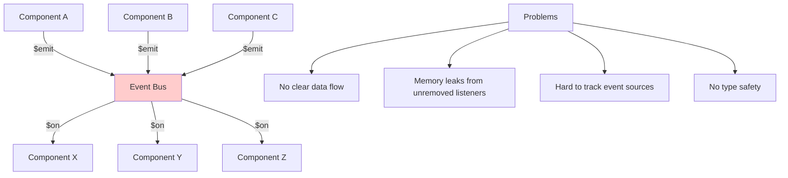
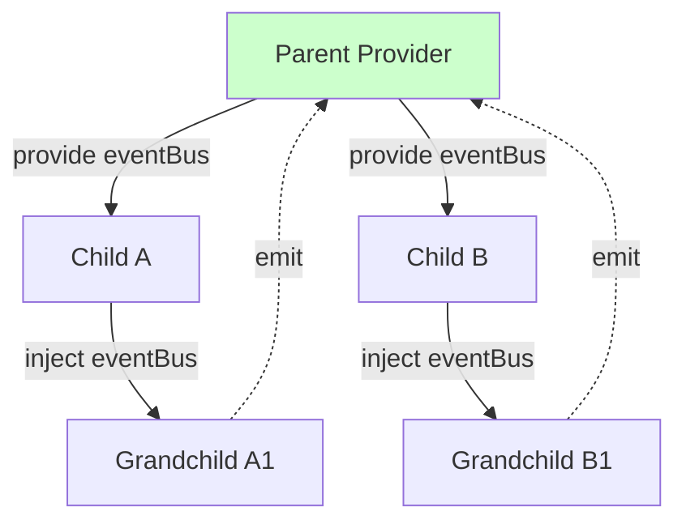
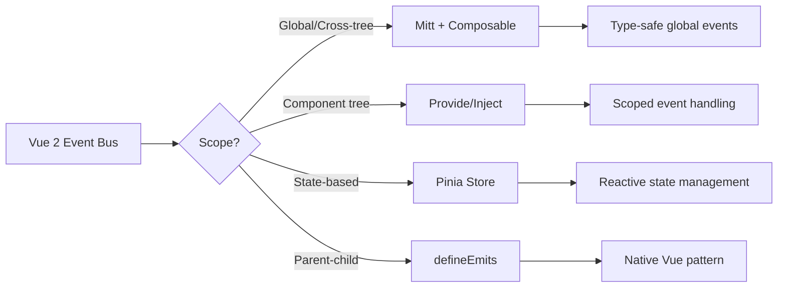

# How to Handle Vue Event Bus Replacement in Vue 3

Author: [nawazdhandala](https://www.github.com/nawazdhandala)

Tags: Vue, Vue3, Event Bus, Composition API, State Management, Migration, JavaScript

Description: Learn how to replace the deprecated Vue 2 event bus pattern with modern Vue 3 alternatives including mitt, provide/inject, and composables.

---

Vue 2 developers commonly used the event bus pattern for cross-component communication. In Vue 3, the `$on`, `$off`, and `$once` instance methods were removed, breaking this pattern. This guide covers modern alternatives that are more maintainable and type-safe.

## The Vue 2 Event Bus Pattern

In Vue 2, you could create a global event bus:

```javascript
// Vue 2 event bus (no longer works in Vue 3)
import Vue from 'vue';
export const EventBus = new Vue();

// Emit event
EventBus.$emit('user-logged-in', user);

// Listen to event
EventBus.$on('user-logged-in', (user) => {
  console.log('User logged in:', user);
});
```

This pattern is removed in Vue 3 because it led to maintenance issues:



## Solution 1: Mitt - Lightweight Event Emitter

Mitt is a tiny (200 bytes) event emitter library that provides the same functionality.

### Installation

```bash
npm install mitt
```

### Creating an Event Bus

```javascript
// eventBus.js
import mitt from 'mitt';

// Create a typed emitter for better IDE support
const emitter = mitt();

export default emitter;
```

### TypeScript Support

```typescript
// eventBus.ts
import mitt, { Emitter } from 'mitt';

// Define your event types
type Events = {
  'user-logged-in': { id: string; name: string };
  'user-logged-out': void;
  'notification': { message: string; type: 'success' | 'error' };
  'cart-updated': { itemCount: number };
};

const emitter: Emitter<Events> = mitt<Events>();

export default emitter;
```

### Using Mitt in Components

```vue
<!-- LoginComponent.vue -->
<script setup lang="ts">
import emitter from '@/eventBus';

async function login(credentials) {
  const user = await authService.login(credentials);

  // Emit event with typed payload
  emitter.emit('user-logged-in', {
    id: user.id,
    name: user.name
  });
}
</script>
```

```vue
<!-- HeaderComponent.vue -->
<script setup lang="ts">
import { onMounted, onUnmounted, ref } from 'vue';
import emitter from '@/eventBus';

const userName = ref('');

function handleLogin(user: { id: string; name: string }) {
  userName.value = user.name;
}

onMounted(() => {
  // Subscribe to events
  emitter.on('user-logged-in', handleLogin);
});

onUnmounted(() => {
  // Always clean up listeners
  emitter.off('user-logged-in', handleLogin);
});
</script>

<template>
  <header>
    <span v-if="userName">Welcome, {{ userName }}</span>
  </header>
</template>
```

### Creating a Composable for Cleaner Usage

```typescript
// useEventBus.ts
import { onUnmounted } from 'vue';
import emitter from '@/eventBus';
import type { Events } from '@/eventBus';

export function useEventBus() {
  const listeners: Array<{ event: keyof Events; handler: Function }> = [];

  function on<K extends keyof Events>(
    event: K,
    handler: (payload: Events[K]) => void
  ) {
    emitter.on(event, handler);
    listeners.push({ event, handler });
  }

  function emit<K extends keyof Events>(event: K, payload: Events[K]) {
    emitter.emit(event, payload);
  }

  // Auto-cleanup on component unmount
  onUnmounted(() => {
    listeners.forEach(({ event, handler }) => {
      emitter.off(event, handler as any);
    });
  });

  return { on, emit };
}
```

Usage:

```vue
<script setup lang="ts">
import { useEventBus } from '@/composables/useEventBus';

const { on, emit } = useEventBus();

// No manual cleanup needed
on('notification', (payload) => {
  showNotification(payload.message, payload.type);
});

function triggerNotification() {
  emit('notification', {
    message: 'Settings saved!',
    type: 'success'
  });
}
</script>
```

## Solution 2: Provide/Inject Pattern

For component trees that share events, use provide/inject:



### Implementation

```typescript
// useEventProvider.ts
import { provide, inject, reactive } from 'vue';
import type { InjectionKey } from 'vue';

type EventHandler = (...args: any[]) => void;

interface EventBus {
  emit: (event: string, ...args: any[]) => void;
  on: (event: string, handler: EventHandler) => void;
  off: (event: string, handler: EventHandler) => void;
}

export const EventBusKey: InjectionKey<EventBus> = Symbol('EventBus');

export function provideEventBus() {
  const listeners = reactive(new Map<string, Set<EventHandler>>());

  const bus: EventBus = {
    emit(event, ...args) {
      const handlers = listeners.get(event);
      if (handlers) {
        handlers.forEach(handler => handler(...args));
      }
    },

    on(event, handler) {
      if (!listeners.has(event)) {
        listeners.set(event, new Set());
      }
      listeners.get(event)!.add(handler);
    },

    off(event, handler) {
      const handlers = listeners.get(event);
      if (handlers) {
        handlers.delete(handler);
      }
    }
  };

  provide(EventBusKey, bus);
  return bus;
}

export function useEventBus() {
  const bus = inject(EventBusKey);
  if (!bus) {
    throw new Error('useEventBus must be used within a provider');
  }
  return bus;
}
```

### Usage in Components

```vue
<!-- App.vue - Provider -->
<script setup>
import { provideEventBus } from '@/composables/useEventProvider';

// Provide event bus to all descendants
const bus = provideEventBus();

// Parent can also listen
bus.on('child-action', (data) => {
  console.log('Child performed action:', data);
});
</script>

<template>
  <div id="app">
    <router-view />
  </div>
</template>
```

```vue
<!-- ChildComponent.vue - Consumer -->
<script setup>
import { onUnmounted } from 'vue';
import { useEventBus } from '@/composables/useEventProvider';

const bus = useEventBus();

function handleClick() {
  bus.emit('child-action', { action: 'button-click', timestamp: Date.now() });
}

// Listen to sibling events
function onSiblingUpdate(data) {
  console.log('Sibling updated:', data);
}

bus.on('sibling-update', onSiblingUpdate);

onUnmounted(() => {
  bus.off('sibling-update', onSiblingUpdate);
});
</script>
```

## Solution 3: Pinia Store for Shared State

For complex scenarios, use Pinia instead of events:

```typescript
// stores/notifications.ts
import { defineStore } from 'pinia';

interface Notification {
  id: string;
  message: string;
  type: 'success' | 'error' | 'warning';
}

export const useNotificationStore = defineStore('notifications', {
  state: () => ({
    notifications: [] as Notification[]
  }),

  actions: {
    show(message: string, type: Notification['type'] = 'success') {
      const id = crypto.randomUUID();
      this.notifications.push({ id, message, type });

      // Auto-dismiss after 5 seconds
      setTimeout(() => this.dismiss(id), 5000);
    },

    dismiss(id: string) {
      const index = this.notifications.findIndex(n => n.id === id);
      if (index !== -1) {
        this.notifications.splice(index, 1);
      }
    }
  }
});
```

```vue
<!-- Any component can trigger notifications -->
<script setup>
import { useNotificationStore } from '@/stores/notifications';

const notifications = useNotificationStore();

async function saveSettings() {
  try {
    await api.saveSettings(settings);
    notifications.show('Settings saved successfully!', 'success');
  } catch (error) {
    notifications.show('Failed to save settings', 'error');
  }
}
</script>
```

```vue
<!-- NotificationDisplay.vue - Reactive to store changes -->
<script setup>
import { useNotificationStore } from '@/stores/notifications';
import { storeToRefs } from 'pinia';

const store = useNotificationStore();
const { notifications } = storeToRefs(store);
</script>

<template>
  <div class="notification-container">
    <div
      v-for="notification in notifications"
      :key="notification.id"
      :class="['notification', notification.type]"
    >
      {{ notification.message }}
      <button @click="store.dismiss(notification.id)">Dismiss</button>
    </div>
  </div>
</template>
```

## Solution 4: Custom Events with defineEmits

For parent-child communication, use Vue's built-in emit:

```vue
<!-- ChildComponent.vue -->
<script setup>
const emit = defineEmits<{
  'update': [value: string];
  'submit': [data: { name: string; email: string }];
  'cancel': [];
}>();

function handleSubmit() {
  emit('submit', { name: 'John', email: 'john@example.com' });
}
</script>

<template>
  <form @submit.prevent="handleSubmit">
    <!-- form fields -->
    <button type="button" @click="emit('cancel')">Cancel</button>
    <button type="submit">Submit</button>
  </form>
</template>
```

```vue
<!-- ParentComponent.vue -->
<template>
  <ChildComponent
    @update="handleUpdate"
    @submit="handleSubmit"
    @cancel="showForm = false"
  />
</template>
```

## Migration Strategy



### Step-by-Step Migration

1. **Identify event bus usage** in your codebase:

```bash
# Find all event bus usages
grep -r "\$emit\|\$on\|\$off" --include="*.vue" --include="*.js" src/
```

2. **Categorize by use case**:
   - Global notifications: Use Mitt or Pinia
   - Form state: Use Pinia or composables
   - Parent-child: Use defineEmits
   - Sibling communication: Use provide/inject or shared store

3. **Replace incrementally**:

```javascript
// Before (Vue 2)
EventBus.$emit('user-updated', user);
EventBus.$on('user-updated', this.handleUserUpdate);

// After (Vue 3 with Mitt)
import emitter from '@/eventBus';
emitter.emit('user-updated', user);
emitter.on('user-updated', handleUserUpdate);
```

## Comparison Table

| Pattern | Best For | Type Safety | Cleanup | Scope |
|---------|----------|-------------|---------|-------|
| Mitt | Global events | With TypeScript | Manual | Global |
| Provide/Inject | Component trees | With InjectionKey | Manual | Tree |
| Pinia | Shared state | Built-in | Automatic | Global |
| defineEmits | Parent-child | Built-in | Automatic | Direct |

## Summary

Vue 3 removed the event bus pattern to encourage better architectural practices. Choose your replacement based on your needs:

- **Mitt**: Drop-in replacement for global events with minimal changes
- **Provide/Inject**: Scoped events within a component tree
- **Pinia**: When events are really state changes in disguise
- **defineEmits**: For direct parent-child communication

The key improvement in all these patterns is explicit event handling with proper cleanup, preventing memory leaks and making data flow easier to trace.
