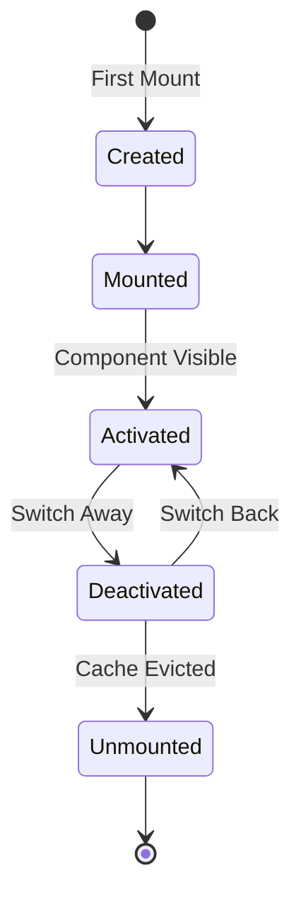
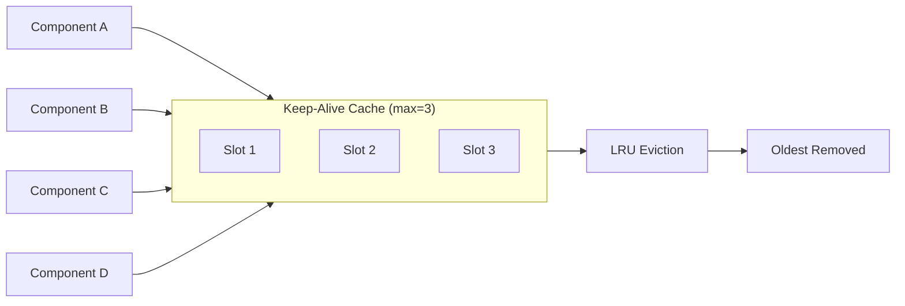
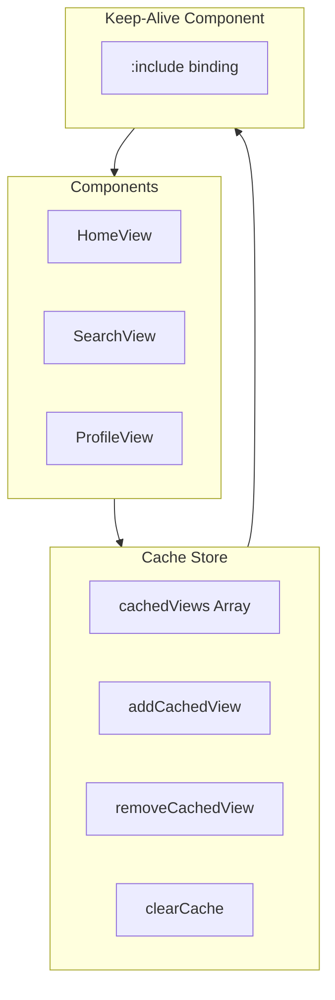
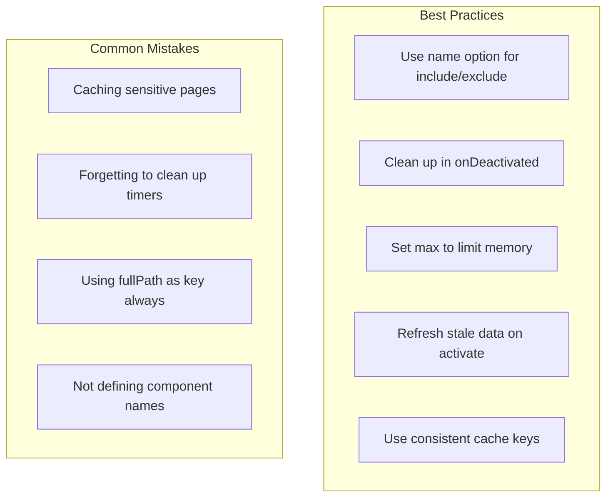

# How to Handle Vue Keep-Alive Component

Author: [nawazdhandala](https://www.github.com/nawazdhandala)

Tags: Vue, Keep-Alive, Caching, Performance, Component Lifecycle, Vue 3

Description: Learn how to use Vue's keep-alive component to cache component instances, preserve state, and optimize performance in your Vue applications.

---

> Vue's keep-alive component is a powerful built-in feature that caches component instances instead of destroying them. This guide covers when and how to use keep-alive effectively, including lifecycle hooks, cache management, and common patterns.

When users navigate between views or tabs in a Vue application, components are typically destroyed and recreated. This means losing form data, scroll positions, and any local state. The keep-alive component solves this by caching inactive component instances in memory.

---

## Understanding Keep-Alive Basics

The keep-alive component wraps dynamic components to cache their instances.

```vue
<!-- App.vue -->
<!-- Basic keep-alive usage with dynamic components -->

<template>
  <div class="app">
    <!-- Navigation buttons -->
    <nav>
      <button @click="currentView = 'Home'" :class="{ active: currentView === 'Home' }">
        Home
      </button>
      <button @click="currentView = 'Profile'" :class="{ active: currentView === 'Profile' }">
        Profile
      </button>
      <button @click="currentView = 'Settings'" :class="{ active: currentView === 'Settings' }">
        Settings
      </button>
    </nav>

    <!-- Wrap dynamic component in keep-alive to preserve state -->
    <keep-alive>
      <component :is="currentView" />
    </keep-alive>
  </div>
</template>

<script setup>
import { ref, shallowRef } from 'vue'
import Home from './components/Home.vue'
import Profile from './components/Profile.vue'
import Settings from './components/Settings.vue'

// Use shallowRef for component references
const components = {
  Home,
  Profile,
  Settings
}

const currentView = ref('Home')
</script>
```

---

## Keep-Alive Lifecycle Hooks

Components inside keep-alive receive two special lifecycle hooks.



```vue
<!-- ProfileView.vue -->
<!-- Component with keep-alive lifecycle hooks -->

<template>
  <div class="profile">
    <h2>User Profile</h2>
    <p>Time on page: {{ timeOnPage }} seconds</p>
    <form @submit.prevent="saveProfile">
      <input v-model="username" placeholder="Username" />
      <input v-model="email" placeholder="Email" />
      <button type="submit">Save</button>
    </form>
  </div>
</template>

<script setup>
import { ref, onMounted, onUnmounted, onActivated, onDeactivated } from 'vue'

const username = ref('')
const email = ref('')
const timeOnPage = ref(0)
let timer = null

// Called once when component is first created
onMounted(() => {
  console.log('Profile mounted - first time only')
  loadUserData()
})

// Called every time component becomes visible (including first mount)
onActivated(() => {
  console.log('Profile activated - resuming timer')
  // Start or resume tracking time
  timer = setInterval(() => {
    timeOnPage.value++
  }, 1000)
})

// Called when component is cached (switched away from)
onDeactivated(() => {
  console.log('Profile deactivated - pausing timer')
  // Pause timer but preserve timeOnPage value
  clearInterval(timer)
  timer = null
})

// Called if component is removed from cache
onUnmounted(() => {
  console.log('Profile unmounted - cleanup')
  clearInterval(timer)
})

async function loadUserData() {
  // Load data only on first mount
  const response = await fetch('/api/user')
  const data = await response.json()
  username.value = data.username
  email.value = data.email
}

function saveProfile() {
  // Form data persists between activations
  console.log('Saving:', username.value, email.value)
}
</script>
```

---

## Include and Exclude Patterns

Control which components are cached using include and exclude props.

```vue
<!-- App.vue -->
<!-- Selective caching with include/exclude -->

<template>
  <div class="app">
    <router-view v-slot="{ Component }">
      <!-- Only cache specific components by name -->
      <keep-alive :include="cachedViews" :exclude="neverCache">
        <component :is="Component" :key="$route.path" />
      </keep-alive>
    </router-view>
  </div>
</template>

<script setup>
import { ref, computed } from 'vue'

// Cache these components (by their name option)
const cachedViews = ref(['HomeView', 'ProfileView', 'DashboardView'])

// Never cache these components
const neverCache = ['LoginView', 'PaymentView']

// Dynamically add/remove from cache
function addToCache(viewName) {
  if (!cachedViews.value.includes(viewName)) {
    cachedViews.value.push(viewName)
  }
}

function removeFromCache(viewName) {
  const index = cachedViews.value.indexOf(viewName)
  if (index > -1) {
    cachedViews.value.splice(index, 1)
  }
}
</script>
```

```vue
<!-- HomeView.vue -->
<!-- Component must have a name to be included/excluded -->

<script>
// Options API - name is explicit
export default {
  name: 'HomeView',
  // ... component options
}
</script>

<!-- OR with script setup, define name separately -->
<script>
export default {
  name: 'HomeView'
}
</script>

<script setup>
// Component logic here
import { ref } from 'vue'
const count = ref(0)
</script>
```

---

## Using Max Cached Instances

Limit memory usage by setting a maximum cache size.



```vue
<!-- App.vue -->
<!-- Limit cache size with max prop -->

<template>
  <div class="app">
    <nav>
      <router-link v-for="route in routes" :key="route.path" :to="route.path">
        {{ route.name }}
      </router-link>
    </nav>

    <router-view v-slot="{ Component }">
      <!-- Cache at most 5 component instances -->
      <!-- Uses LRU (Least Recently Used) eviction -->
      <keep-alive :max="5">
        <component :is="Component" :key="$route.fullPath" />
      </keep-alive>
    </router-view>
  </div>
</template>

<script setup>
const routes = [
  { path: '/', name: 'Home' },
  { path: '/products', name: 'Products' },
  { path: '/cart', name: 'Cart' },
  { path: '/orders', name: 'Orders' },
  { path: '/profile', name: 'Profile' },
  { path: '/settings', name: 'Settings' },
  { path: '/help', name: 'Help' }
]
// With max=5, when 6th component is cached, the least recently used is evicted
</script>
```

---

## Keep-Alive with Vue Router

Common pattern for caching route components.

```javascript
// router/index.js
// Router configuration with meta for cache control

import { createRouter, createWebHistory } from 'vue-router'

const routes = [
  {
    path: '/',
    name: 'Home',
    component: () => import('../views/HomeView.vue'),
    meta: { keepAlive: true }
  },
  {
    path: '/search',
    name: 'Search',
    component: () => import('../views/SearchView.vue'),
    meta: { keepAlive: true } // Preserve search results and filters
  },
  {
    path: '/product/:id',
    name: 'Product',
    component: () => import('../views/ProductView.vue'),
    meta: { keepAlive: false } // Always fresh data for products
  },
  {
    path: '/checkout',
    name: 'Checkout',
    component: () => import('../views/CheckoutView.vue'),
    meta: { keepAlive: false } // Security - never cache checkout
  },
  {
    path: '/dashboard',
    name: 'Dashboard',
    component: () => import('../views/DashboardView.vue'),
    meta: {
      keepAlive: true,
      keepAliveKey: 'dashboard' // Custom cache key
    }
  }
]

export default createRouter({
  history: createWebHistory(),
  routes
})
```

```vue
<!-- App.vue -->
<!-- Conditional keep-alive based on route meta -->

<template>
  <div class="app">
    <router-view v-slot="{ Component, route }">
      <!-- Conditionally wrap in keep-alive based on route meta -->
      <keep-alive v-if="route.meta.keepAlive">
        <component
          :is="Component"
          :key="route.meta.keepAliveKey || route.path"
        />
      </keep-alive>
      <component v-else :is="Component" :key="route.fullPath" />
    </router-view>
  </div>
</template>
```

---

## Refreshing Cached Data

Sometimes cached components need fresh data when reactivated.

```vue
<!-- SearchView.vue -->
<!-- Refresh data conditionally on activation -->

<template>
  <div class="search">
    <input v-model="searchQuery" @input="debouncedSearch" placeholder="Search..." />
    <div class="filters">
      <select v-model="category">
        <option value="">All Categories</option>
        <option v-for="cat in categories" :key="cat" :value="cat">
          {{ cat }}
        </option>
      </select>
    </div>
    <div class="results">
      <div v-for="item in results" :key="item.id" class="result-item">
        {{ item.name }}
      </div>
    </div>
    <p v-if="lastFetched">Last updated: {{ lastFetched }}</p>
  </div>
</template>

<script setup>
import { ref, onActivated } from 'vue'
import { useDebounceFn } from '@vueuse/core'

const searchQuery = ref('')
const category = ref('')
const results = ref([])
const categories = ref([])
const lastFetched = ref(null)

// Track when data was last fetched
let lastFetchTime = 0
const STALE_TIME = 5 * 60 * 1000 // 5 minutes

onActivated(() => {
  // Check if data is stale
  const now = Date.now()
  if (now - lastFetchTime > STALE_TIME) {
    console.log('Data is stale, refreshing...')
    refreshData()
  } else {
    console.log('Using cached data')
  }
})

async function refreshData() {
  // Refresh categories (might have changed)
  const catResponse = await fetch('/api/categories')
  categories.value = await catResponse.json()

  // Re-run search with existing query
  if (searchQuery.value) {
    await performSearch()
  }

  lastFetchTime = Date.now()
  lastFetched.value = new Date().toLocaleTimeString()
}

async function performSearch() {
  const params = new URLSearchParams({
    q: searchQuery.value,
    category: category.value
  })
  const response = await fetch(`/api/search?${params}`)
  results.value = await response.json()
  lastFetchTime = Date.now()
  lastFetched.value = new Date().toLocaleTimeString()
}

const debouncedSearch = useDebounceFn(performSearch, 300)
</script>
```

---

## Cache Management Store

Centralized cache control with Pinia.



```javascript
// stores/cacheStore.js
// Pinia store for managing keep-alive cache

import { defineStore } from 'pinia'

export const useCacheStore = defineStore('cache', {
  state: () => ({
    // List of component names to cache
    cachedViews: new Set(['HomeView', 'DashboardView']),

    // Components that should never be cached
    excludedViews: new Set(['LoginView', 'CheckoutView']),

    // Maximum cache size
    maxCacheSize: 10
  }),

  getters: {
    // Convert Set to Array for keep-alive include prop
    cachedViewsList: (state) => Array.from(state.cachedViews),

    excludedViewsList: (state) => Array.from(state.excludedViews),

    cacheSize: (state) => state.cachedViews.size
  },

  actions: {
    // Add a view to cache
    addCachedView(viewName) {
      if (this.excludedViews.has(viewName)) {
        console.warn(`${viewName} is in excluded list, not caching`)
        return
      }
      this.cachedViews.add(viewName)
    },

    // Remove a view from cache (forces re-render next time)
    removeCachedView(viewName) {
      this.cachedViews.delete(viewName)
    },

    // Clear all cached views except essentials
    clearCache(keepEssential = true) {
      if (keepEssential) {
        const essential = ['HomeView', 'DashboardView']
        this.cachedViews = new Set(essential)
      } else {
        this.cachedViews.clear()
      }
    },

    // Remove oldest cached view (simple LRU)
    evictOldest() {
      const first = this.cachedViews.values().next().value
      if (first) {
        this.cachedViews.delete(first)
      }
    }
  }
})
```

```vue
<!-- App.vue -->
<!-- Using cache store with keep-alive -->

<template>
  <div class="app">
    <header>
      <nav>
        <router-link to="/">Home</router-link>
        <router-link to="/dashboard">Dashboard</router-link>
        <router-link to="/search">Search</router-link>
      </nav>
      <button @click="clearCache">Clear Cache</button>
    </header>

    <router-view v-slot="{ Component, route }">
      <keep-alive
        :include="cacheStore.cachedViewsList"
        :exclude="cacheStore.excludedViewsList"
        :max="cacheStore.maxCacheSize"
      >
        <component :is="Component" :key="route.path" />
      </keep-alive>
    </router-view>

    <footer>
      <small>Cached views: {{ cacheStore.cacheSize }}</small>
    </footer>
  </div>
</template>

<script setup>
import { useCacheStore } from './stores/cacheStore'
import { useRouter } from 'vue-router'

const cacheStore = useCacheStore()
const router = useRouter()

// Add view to cache on route enter
router.beforeEach((to, from) => {
  if (to.meta.keepAlive && to.name) {
    cacheStore.addCachedView(to.name)
  }
})

function clearCache() {
  cacheStore.clearCache()
  // Force reload current route
  router.go(0)
}
</script>
```

---

## Keep-Alive with Transitions

Animate component switches while preserving cache.

```vue
<!-- App.vue -->
<!-- Combining keep-alive with transitions -->

<template>
  <div class="app">
    <router-view v-slot="{ Component, route }">
      <!-- Transition wraps keep-alive -->
      <transition :name="transitionName" mode="out-in">
        <keep-alive :include="cachedViews">
          <component :is="Component" :key="route.path" />
        </keep-alive>
      </transition>
    </router-view>
  </div>
</template>

<script setup>
import { ref, watch } from 'vue'
import { useRouter } from 'vue-router'

const router = useRouter()
const transitionName = ref('fade')
const cachedViews = ['HomeView', 'SearchView', 'ProfileView']

// Dynamic transition based on navigation direction
watch(
  () => router.currentRoute.value,
  (to, from) => {
    // Determine slide direction based on route depth
    const toDepth = to.path.split('/').length
    const fromDepth = from?.path.split('/').length || 0

    if (toDepth > fromDepth) {
      transitionName.value = 'slide-left'
    } else if (toDepth < fromDepth) {
      transitionName.value = 'slide-right'
    } else {
      transitionName.value = 'fade'
    }
  }
)
</script>

<style>
/* Fade transition */
.fade-enter-active,
.fade-leave-active {
  transition: opacity 0.3s ease;
}

.fade-enter-from,
.fade-leave-to {
  opacity: 0;
}

/* Slide left transition */
.slide-left-enter-active,
.slide-left-leave-active {
  transition: transform 0.3s ease, opacity 0.3s ease;
}

.slide-left-enter-from {
  transform: translateX(100%);
  opacity: 0;
}

.slide-left-leave-to {
  transform: translateX(-100%);
  opacity: 0;
}

/* Slide right transition */
.slide-right-enter-active,
.slide-right-leave-active {
  transition: transform 0.3s ease, opacity 0.3s ease;
}

.slide-right-enter-from {
  transform: translateX(-100%);
  opacity: 0;
}

.slide-right-leave-to {
  transform: translateX(100%);
  opacity: 0;
}
</style>
```

---

## Scroll Position Restoration

Preserve scroll position in cached components.

```vue
<!-- ListView.vue -->
<!-- Preserve scroll position with keep-alive -->

<template>
  <div ref="scrollContainer" class="list-view" @scroll="saveScrollPosition">
    <div v-for="item in items" :key="item.id" class="list-item">
      <router-link :to="`/item/${item.id}`">
        {{ item.title }}
      </router-link>
    </div>
    <div v-if="loading" class="loading">Loading more...</div>
  </div>
</template>

<script setup>
import { ref, onActivated, onDeactivated, nextTick } from 'vue'

const scrollContainer = ref(null)
const items = ref([])
const loading = ref(false)

// Store scroll position
let savedScrollTop = 0

onActivated(async () => {
  // Wait for DOM update
  await nextTick()

  // Restore scroll position
  if (scrollContainer.value && savedScrollTop > 0) {
    scrollContainer.value.scrollTop = savedScrollTop
    console.log('Restored scroll position:', savedScrollTop)
  }
})

onDeactivated(() => {
  // Save current scroll position before deactivating
  if (scrollContainer.value) {
    savedScrollTop = scrollContainer.value.scrollTop
    console.log('Saved scroll position:', savedScrollTop)
  }
})

function saveScrollPosition(event) {
  // Update saved position on scroll (optional real-time saving)
  savedScrollTop = event.target.scrollTop
}
</script>

<style scoped>
.list-view {
  height: 100vh;
  overflow-y: auto;
}

.list-item {
  padding: 16px;
  border-bottom: 1px solid #eee;
}
</style>
```

---

## Debugging Keep-Alive Issues

Common problems and solutions.

```vue
<!-- DebugView.vue -->
<!-- Debugging keep-alive behavior -->

<template>
  <div class="debug-view">
    <h2>Keep-Alive Debug Info</h2>
    <pre>{{ debugInfo }}</pre>
  </div>
</template>

<script>
// Must use Options API name for include/exclude to work
export default {
  name: 'DebugView'
}
</script>

<script setup>
import { ref, onMounted, onUnmounted, onActivated, onDeactivated, computed } from 'vue'

const mountCount = ref(0)
const activateCount = ref(0)
const deactivateCount = ref(0)

const debugInfo = computed(() => ({
  componentName: 'DebugView',
  mounted: mountCount.value,
  activated: activateCount.value,
  deactivated: deactivateCount.value,
  // If mounted > 1, keep-alive is not working
  keepAliveWorking: mountCount.value === 1 && activateCount.value > 0
}))

onMounted(() => {
  mountCount.value++
  console.log('[DebugView] Mounted - count:', mountCount.value)
  // If this logs more than once, keep-alive is not caching this component
})

onUnmounted(() => {
  console.log('[DebugView] Unmounted - was NOT cached')
})

onActivated(() => {
  activateCount.value++
  console.log('[DebugView] Activated - count:', activateCount.value)
})

onDeactivated(() => {
  deactivateCount.value++
  console.log('[DebugView] Deactivated - count:', deactivateCount.value)
})
</script>
```

```javascript
// Common keep-alive issues and fixes

// Issue 1: Component not being cached
// - Check that component has a 'name' option
// - Check that name matches include pattern exactly
// - Check component is not in exclude list

// Issue 2: Using script setup without name
// WRONG - no name defined
// <script setup>
// const count = ref(0)
// </script>

// CORRECT - define name separately
// <script>
// export default { name: 'MyComponent' }
// </script>
// <script setup>
// const count = ref(0)
// </script>

// Issue 3: Key prop causing cache misses
// WRONG - fullPath changes, new cache entry each time
// <keep-alive>
//   <component :is="Component" :key="$route.fullPath" />
// </keep-alive>

// CORRECT - use path or name for consistent caching
// <keep-alive>
//   <component :is="Component" :key="$route.name" />
// </keep-alive>

// Issue 4: Memory leaks in cached components
// Always clean up in onDeactivated, not just onUnmounted
// onDeactivated(() => {
//   clearInterval(timer)
//   socket.disconnect()
//   observer.disconnect()
// })
```

---

## Best Practices Summary



Key takeaways for using keep-alive effectively:

1. **Define component names** - Required for include/exclude patterns
2. **Use onActivated/onDeactivated** - Handle resume/pause logic
3. **Set a max limit** - Prevent unbounded memory growth
4. **Clean up resources** - Stop timers and listeners in onDeactivated
5. **Refresh stale data** - Check data freshness on activation
6. **Never cache sensitive views** - Login, checkout, payment pages
7. **Test cache behavior** - Verify mounting only happens once

Keep-alive is a powerful optimization tool when used correctly. It preserves user state, reduces server load, and creates smoother navigation experiences.
