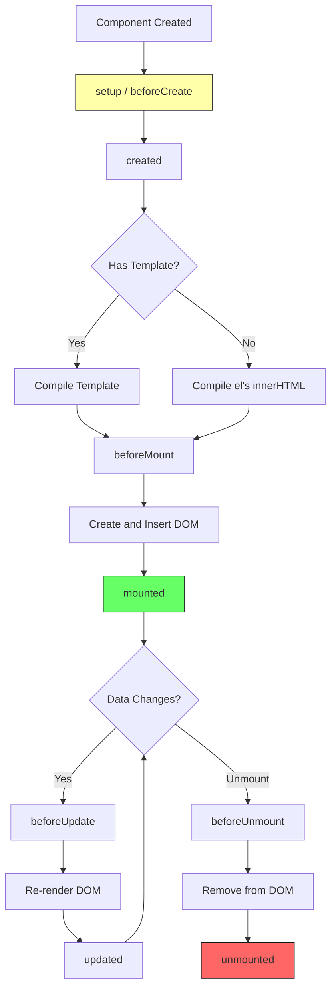
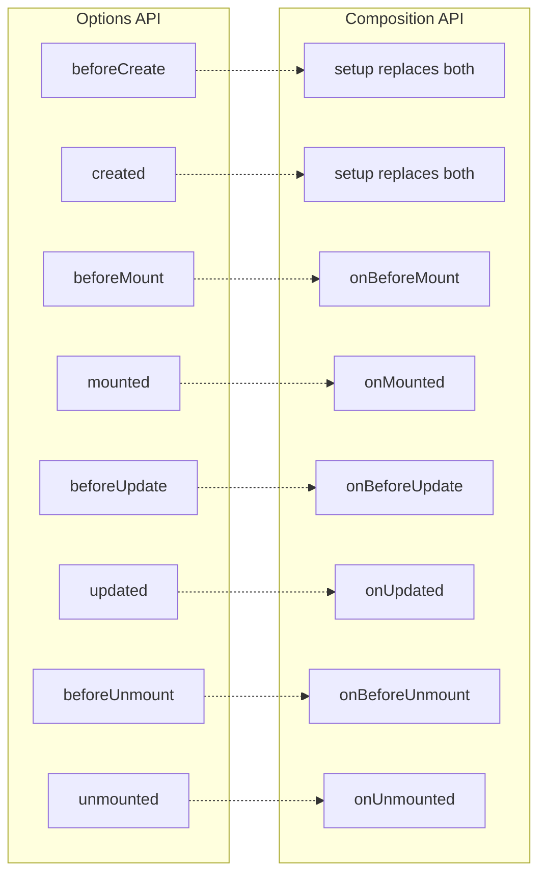

# How to Handle Vue Lifecycle Hooks

Author: [nawazdhandala](https://www.github.com/nawazdhandala)

Tags: Vue, Lifecycle Hooks, Components, Composition API, Options API, JavaScript

Description: A comprehensive guide to Vue lifecycle hooks, covering when to use each hook, common patterns, and differences between Options API and Composition API.

---

Vue lifecycle hooks allow you to execute code at specific stages of a component's life. Understanding when each hook fires and what operations are appropriate helps you write more reliable Vue applications.

---

## Vue 3 Lifecycle Overview



---

## Options API vs Composition API



---

## Setup and Creation Hooks

### Options API

```javascript
export default {
  // Called before instance is created
  // Data and methods are NOT available
  beforeCreate() {
    console.log('beforeCreate')
    console.log('data:', this.message)  // undefined
    console.log('methods:', this.greet) // undefined
  },

  // Called after instance is created
  // Data and methods ARE available
  // DOM is NOT available
  created() {
    console.log('created')
    console.log('data:', this.message)  // 'Hello'
    console.log('$el:', this.$el)       // undefined (no DOM yet)

    // Good for: API calls, initializing data
    this.fetchUserData()
  },

  data() {
    return {
      message: 'Hello',
      user: null
    }
  },

  methods: {
    greet() {
      return `${this.message} World`
    },
    async fetchUserData() {
      const response = await fetch('/api/user')
      this.user = await response.json()
    }
  }
}
```

### Composition API

```vue
<script setup>
import { ref, onMounted } from 'vue'

// setup() runs during beforeCreate and created
// All code in script setup is in the setup phase

const message = ref('Hello')
const user = ref(null)

// API calls during setup
async function fetchUserData() {
  const response = await fetch('/api/user')
  user.value = await response.json()
}

// Can call immediately in setup
fetchUserData()

// Or use onMounted if DOM access needed
onMounted(() => {
  console.log('Component is mounted')
})
</script>
```

---

## Mounting Hooks

### When to Use Each Hook

```javascript
export default {
  // Called before mounting begins
  // Template is compiled but not rendered
  // $el is not yet available
  beforeMount() {
    console.log('beforeMount')
    console.log('$el:', this.$el) // null

    // Rarely used - most logic goes in created or mounted
    // Good for: last-minute data changes before render
  },

  // Called after DOM is created and inserted
  // $el is available, refs are accessible
  mounted() {
    console.log('mounted')
    console.log('$el:', this.$el) // <div>...</div>

    // Good for:
    // - DOM manipulation
    // - Setting up event listeners
    // - Third-party library initialization
    // - Accessing refs

    this.initializeChart()
    this.setupEventListeners()
  },

  methods: {
    initializeChart() {
      // Chart library needs DOM element
      const chart = new Chart(this.$refs.chartCanvas, {
        type: 'bar',
        data: this.chartData
      })
      this.chart = chart
    },

    setupEventListeners() {
      // Window/document listeners
      window.addEventListener('resize', this.handleResize)
      document.addEventListener('keydown', this.handleKeydown)
    }
  }
}
```

### Composition API Mounting

```vue
<script setup>
import { ref, onBeforeMount, onMounted } from 'vue'

const chartRef = ref(null)
const chartInstance = ref(null)

onBeforeMount(() => {
  console.log('About to mount')
  // chartRef.value is still null
})

onMounted(() => {
  console.log('Mounted')
  // chartRef.value is now the DOM element

  // Initialize chart library
  chartInstance.value = new Chart(chartRef.value, {
    type: 'line',
    data: { /* ... */ }
  })

  // Set up event listeners
  window.addEventListener('resize', handleResize)
})

function handleResize() {
  chartInstance.value?.resize()
}
</script>

<template>
  <canvas ref="chartRef"></canvas>
</template>
```

---

## Update Hooks

### Reacting to Data Changes

```javascript
export default {
  data() {
    return {
      count: 0,
      items: []
    }
  },

  // Called before DOM re-render
  // Data is updated but DOM is old
  beforeUpdate() {
    console.log('beforeUpdate')
    console.log('count:', this.count)          // New value
    console.log('DOM:', this.$el.textContent)  // Old DOM content

    // Good for:
    // - Accessing pre-update DOM state
    // - Debugging reactivity issues
  },

  // Called after DOM re-render
  // Both data and DOM are updated
  updated() {
    console.log('updated')
    console.log('DOM:', this.$el.textContent) // New DOM content

    // CAUTION: Avoid changing data here (infinite loop)
    // this.count++ // BAD - triggers another update

    // Good for:
    // - Post-render DOM operations
    // - Scrolling to new content
    // - Third-party library updates

    this.scrollToBottom()
  },

  methods: {
    scrollToBottom() {
      const container = this.$refs.messageContainer
      if (container) {
        container.scrollTop = container.scrollHeight
      }
    }
  }
}
```

### Composition API Updates

```vue
<script setup>
import { ref, onBeforeUpdate, onUpdated, nextTick } from 'vue'

const messages = ref([])
const containerRef = ref(null)

onBeforeUpdate(() => {
  // Save scroll position before update
  if (containerRef.value) {
    // Store for comparison
  }
})

onUpdated(() => {
  // Scroll to bottom after new message
  scrollToBottom()
})

function scrollToBottom() {
  if (containerRef.value) {
    containerRef.value.scrollTop = containerRef.value.scrollHeight
  }
}

async function addMessage(text) {
  messages.value.push({ id: Date.now(), text })

  // Wait for DOM update then scroll
  await nextTick()
  scrollToBottom()
}
</script>
```

### Using nextTick for DOM Updates

```vue
<script setup>
import { ref, nextTick } from 'vue'

const isEditing = ref(false)
const inputRef = ref(null)

async function startEditing() {
  isEditing.value = true

  // DOM has not updated yet
  // inputRef.value is still null

  await nextTick()

  // Now DOM is updated and input exists
  inputRef.value?.focus()
}
</script>

<template>
  <div>
    <span v-if="!isEditing">Click to edit</span>
    <input v-else ref="inputRef" @blur="isEditing = false" />
    <button @click="startEditing">Edit</button>
  </div>
</template>
```

---

## Unmount Hooks

### Cleanup Operations

```javascript
export default {
  data() {
    return {
      timer: null,
      chart: null,
      abortController: null
    }
  },

  mounted() {
    // Set up things that need cleanup
    this.timer = setInterval(this.tick, 1000)
    this.chart = new Chart(this.$refs.canvas, this.chartConfig)

    window.addEventListener('resize', this.handleResize)
    document.addEventListener('visibilitychange', this.handleVisibility)

    // AbortController for fetch requests
    this.abortController = new AbortController()
    this.fetchData()
  },

  // Called right before unmounting
  // Component is still functional
  beforeUnmount() {
    console.log('beforeUnmount')
    // Good for: final data saving, analytics
    this.saveScrollPosition()
  },

  // Called after unmounting
  // Component is destroyed
  unmounted() {
    console.log('unmounted')

    // CRITICAL: Clean up to prevent memory leaks

    // Clear timers
    if (this.timer) {
      clearInterval(this.timer)
      this.timer = null
    }

    // Destroy third-party instances
    if (this.chart) {
      this.chart.destroy()
      this.chart = null
    }

    // Remove event listeners
    window.removeEventListener('resize', this.handleResize)
    document.removeEventListener('visibilitychange', this.handleVisibility)

    // Cancel pending requests
    if (this.abortController) {
      this.abortController.abort()
    }
  },

  methods: {
    async fetchData() {
      try {
        const response = await fetch('/api/data', {
          signal: this.abortController.signal
        })
        this.data = await response.json()
      } catch (error) {
        if (error.name !== 'AbortError') {
          console.error('Fetch failed:', error)
        }
      }
    },

    tick() { /* ... */ },
    handleResize() { /* ... */ },
    handleVisibility() { /* ... */ },
    saveScrollPosition() { /* ... */ }
  }
}
```

### Composition API Cleanup

```vue
<script setup>
import { ref, onMounted, onBeforeUnmount, onUnmounted } from 'vue'

const chartRef = ref(null)
let chart = null
let timer = null
let abortController = null

onMounted(() => {
  // Initialize chart
  chart = new Chart(chartRef.value, { /* config */ })

  // Start timer
  timer = setInterval(updateData, 5000)

  // Add event listeners
  window.addEventListener('resize', handleResize)

  // Setup abort controller for fetch
  abortController = new AbortController()
  fetchData()
})

onBeforeUnmount(() => {
  // Save state before unmount
  saveScrollPosition()
})

onUnmounted(() => {
  // Clean up everything

  // Destroy chart
  chart?.destroy()
  chart = null

  // Clear timer
  if (timer) {
    clearInterval(timer)
    timer = null
  }

  // Remove event listeners
  window.removeEventListener('resize', handleResize)

  // Cancel pending requests
  abortController?.abort()
})

async function fetchData() {
  try {
    const response = await fetch('/api/data', {
      signal: abortController.signal
    })
    // Process response
  } catch (error) {
    if (error.name !== 'AbortError') {
      console.error('Fetch error:', error)
    }
  }
}

function handleResize() { /* ... */ }
function updateData() { /* ... */ }
function saveScrollPosition() { /* ... */ }
</script>
```

---

## Special Hooks

### Error Handling

```vue
<script setup>
import { onErrorCaptured, ref } from 'vue'

const error = ref(null)

// Catches errors from child components
onErrorCaptured((err, instance, info) => {
  console.error('Error captured:', err)
  console.log('Component:', instance)
  console.log('Info:', info)

  error.value = err.message

  // Return false to stop error propagation
  // Return true or nothing to let it propagate
  return false
})
</script>

<template>
  <div>
    <div v-if="error" class="error-boundary">
      Something went wrong: {{ error }}
      <button @click="error = null">Try Again</button>
    </div>
    <slot v-else></slot>
  </div>
</template>
```

### Render Tracking (Debug)

```vue
<script setup>
import { onRenderTracked, onRenderTriggered } from 'vue'

// Called when reactive dependency is tracked during render
onRenderTracked((event) => {
  console.log('Render tracked:', event)
  // event.target - the reactive object
  // event.key - the property being accessed
  // event.type - 'get', 'has', 'iterate'
})

// Called when reactive dependency triggers re-render
onRenderTriggered((event) => {
  console.log('Render triggered:', event)
  // event.target - the reactive object
  // event.key - the property that triggered
  // event.type - 'set', 'add', 'delete', 'clear'
  // event.newValue, event.oldValue
})
</script>
```

### Activated/Deactivated (KeepAlive)

```vue
<!-- Parent using keep-alive -->
<template>
  <keep-alive>
    <component :is="currentTab" />
  </keep-alive>
</template>
```

```vue
<!-- Child component with activation hooks -->
<script setup>
import { ref, onActivated, onDeactivated } from 'vue'

const lastFetchTime = ref(null)

// Called when component is activated from keep-alive cache
onActivated(() => {
  console.log('Component activated')

  // Refresh data if stale
  const now = Date.now()
  if (!lastFetchTime.value || now - lastFetchTime.value > 60000) {
    fetchFreshData()
    lastFetchTime.value = now
  }
})

// Called when component is deactivated to keep-alive cache
onDeactivated(() => {
  console.log('Component deactivated')

  // Pause expensive operations
  pauseAnimations()
  pausePolling()
})

function fetchFreshData() { /* ... */ }
function pauseAnimations() { /* ... */ }
function pausePolling() { /* ... */ }
</script>
```

---

## Common Patterns

### Async Data Fetching

```vue
<script setup>
import { ref, onMounted, watch } from 'vue'

const props = defineProps(['userId'])

const user = ref(null)
const loading = ref(true)
const error = ref(null)

// Fetch on mount
onMounted(() => {
  fetchUser(props.userId)
})

// Refetch when prop changes
watch(() => props.userId, (newId) => {
  fetchUser(newId)
})

async function fetchUser(id) {
  loading.value = true
  error.value = null

  try {
    const response = await fetch(`/api/users/${id}`)
    if (!response.ok) throw new Error('Failed to fetch')
    user.value = await response.json()
  } catch (e) {
    error.value = e.message
  } finally {
    loading.value = false
  }
}
</script>
```

### Composable with Lifecycle

```javascript
// composables/useInterval.js
import { ref, onMounted, onUnmounted } from 'vue'

export function useInterval(callback, delay) {
  const isActive = ref(true)
  let timer = null

  function start() {
    if (timer) return
    isActive.value = true
    timer = setInterval(() => {
      if (isActive.value) callback()
    }, delay)
  }

  function stop() {
    isActive.value = false
    if (timer) {
      clearInterval(timer)
      timer = null
    }
  }

  // Auto-start on mount
  onMounted(start)

  // Auto-cleanup on unmount
  onUnmounted(stop)

  return { isActive, start, stop }
}
```

```vue
<!-- Usage -->
<script setup>
import { ref } from 'vue'
import { useInterval } from '@/composables/useInterval'

const count = ref(0)

const { isActive, stop, start } = useInterval(() => {
  count.value++
}, 1000)
</script>

<template>
  <div>
    <p>Count: {{ count }}</p>
    <button @click="isActive ? stop() : start()">
      {{ isActive ? 'Pause' : 'Resume' }}
    </button>
  </div>
</template>
```

---

## Summary

| Hook | Options API | Composition API | Use Case |
|------|-------------|-----------------|----------|
| Creation | beforeCreate/created | setup() | Data initialization, API calls |
| Mounting | beforeMount | onBeforeMount | Pre-render operations |
| Mounted | mounted | onMounted | DOM access, third-party init |
| Update | beforeUpdate | onBeforeUpdate | Pre-update DOM state |
| Updated | updated | onUpdated | Post-render operations |
| Unmount | beforeUnmount | onBeforeUnmount | Final data saving |
| Unmounted | unmounted | onUnmounted | Cleanup, remove listeners |
| Error | errorCaptured | onErrorCaptured | Error boundaries |
| KeepAlive | activated/deactivated | onActivated/onDeactivated | Cache management |

Understanding lifecycle hooks is essential for writing efficient Vue applications. Use mounting hooks for DOM-dependent operations, update hooks sparingly for post-render work, and always clean up in unmount hooks to prevent memory leaks.
