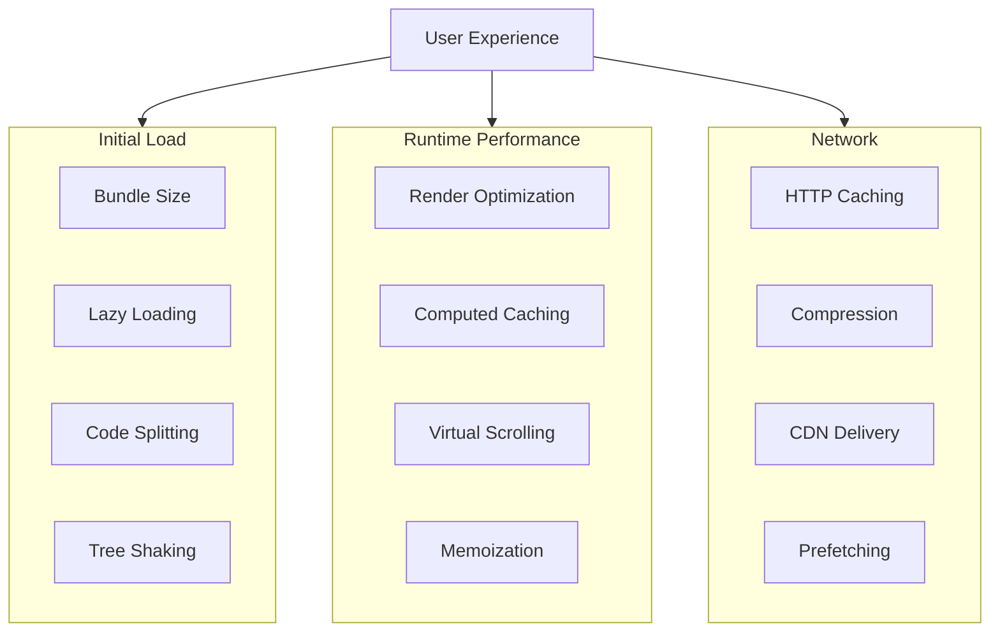
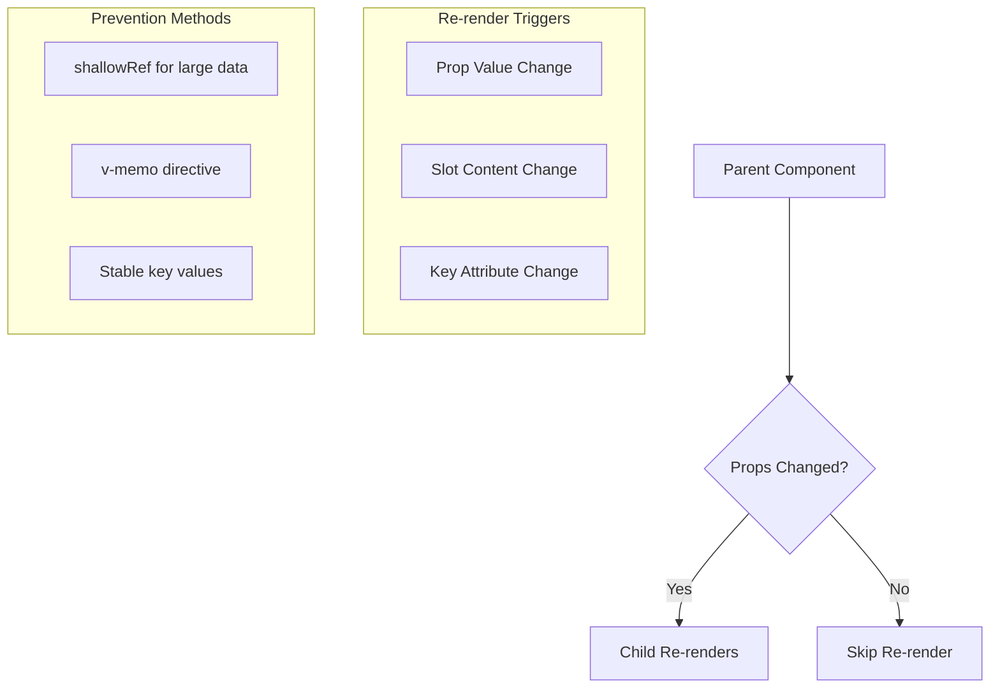
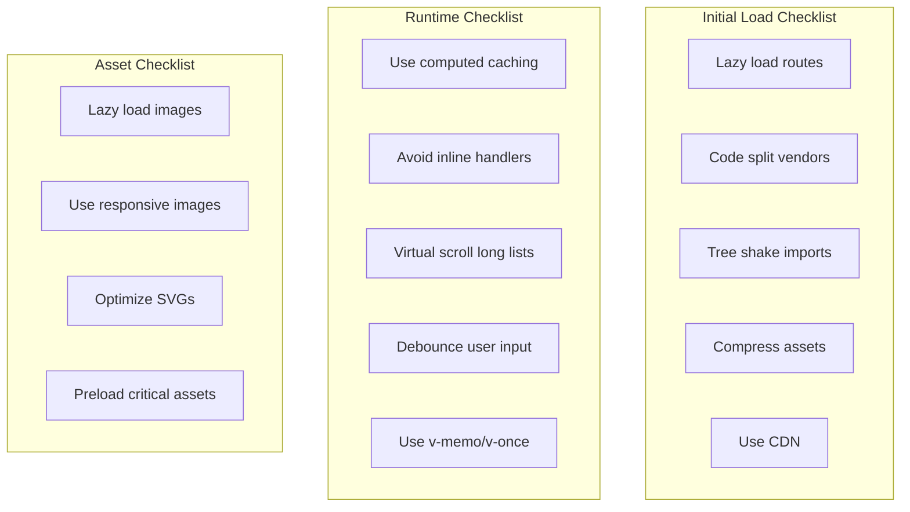

# How to Optimize Vue Application Performance

Author: [nawazdhandala](https://www.github.com/nawazdhandala)

Tags: Vue, Performance, Optimization, Lazy Loading, Virtual Scrolling, Memoization, Vue 3

Description: A comprehensive guide to optimizing Vue 3 application performance, covering component optimization, lazy loading, virtual scrolling, computed caching, and bundle size reduction.

---

> Performance is critical for user experience. Slow applications lead to frustrated users and lost engagement. This guide covers practical techniques to make your Vue applications fast and responsive.

Vue 3 is faster than Vue 2 out of the box, but there are many optimizations you can apply to make your applications even faster. From component-level improvements to bundle optimization, every millisecond counts.

---

## Performance Optimization Overview



---

## Component Lazy Loading

Load components only when needed to reduce initial bundle size.

```javascript
// router/index.js
// Route-based code splitting

import { createRouter, createWebHistory } from 'vue-router'

const routes = [
  {
    path: '/',
    name: 'Home',
    // Eager load - included in main bundle
    component: () => import('../views/Home.vue')
  },
  {
    path: '/dashboard',
    name: 'Dashboard',
    // Lazy load with webpackChunkName for named chunks
    component: () => import(
      /* webpackChunkName: "dashboard" */
      '../views/Dashboard.vue'
    )
  },
  {
    path: '/admin',
    name: 'Admin',
    // Lazy load admin section
    component: () => import(
      /* webpackChunkName: "admin" */
      '../views/Admin.vue'
    ),
    children: [
      {
        path: 'users',
        // Same chunk as parent
        component: () => import(
          /* webpackChunkName: "admin" */
          '../views/admin/Users.vue'
        )
      },
      {
        path: 'settings',
        component: () => import(
          /* webpackChunkName: "admin" */
          '../views/admin/Settings.vue'
        )
      }
    ]
  }
]

export default createRouter({
  history: createWebHistory(),
  routes
})
```

```vue
<!-- App.vue -->
<!-- Conditional component lazy loading -->

<template>
  <div class="app">
    <header>
      <button @click="showModal = true">Open Modal</button>
    </header>

    <!-- Lazy load modal only when needed -->
    <Suspense v-if="showModal">
      <template #default>
        <AsyncModal @close="showModal = false" />
      </template>
      <template #fallback>
        <div class="loading">Loading modal...</div>
      </template>
    </Suspense>
  </div>
</template>

<script setup>
import { ref, defineAsyncComponent } from 'vue'

const showModal = ref(false)

// Async component with loading and error states
const AsyncModal = defineAsyncComponent({
  loader: () => import('./components/HeavyModal.vue'),
  loadingComponent: () => import('./components/ModalSkeleton.vue'),
  errorComponent: () => import('./components/ModalError.vue'),
  delay: 200,  // Show loading after 200ms
  timeout: 10000  // Timeout after 10 seconds
})
</script>
```

---

## Virtual Scrolling for Large Lists

Render only visible items for large datasets.

```vue
<!-- VirtualList.vue -->
<!-- Custom virtual scrolling implementation -->

<template>
  <div
    ref="container"
    class="virtual-list"
    @scroll="onScroll"
    :style="{ height: containerHeight + 'px' }"
  >
    <!-- Spacer for total scroll height -->
    <div :style="{ height: totalHeight + 'px', position: 'relative' }">
      <!-- Only render visible items -->
      <div
        v-for="item in visibleItems"
        :key="item.id"
        class="virtual-item"
        :style="{
          position: 'absolute',
          top: item.offset + 'px',
          height: itemHeight + 'px',
          width: '100%'
        }"
      >
        <slot :item="item.data" :index="item.index" />
      </div>
    </div>
  </div>
</template>

<script setup>
import { ref, computed, onMounted, onUnmounted } from 'vue'

const props = defineProps({
  items: {
    type: Array,
    required: true
  },
  itemHeight: {
    type: Number,
    default: 50
  },
  containerHeight: {
    type: Number,
    default: 400
  },
  overscan: {
    type: Number,
    default: 5  // Extra items to render above/below viewport
  }
})

const container = ref(null)
const scrollTop = ref(0)

// Total scrollable height
const totalHeight = computed(() => props.items.length * props.itemHeight)

// Calculate visible range
const visibleRange = computed(() => {
  const start = Math.floor(scrollTop.value / props.itemHeight)
  const visibleCount = Math.ceil(props.containerHeight / props.itemHeight)

  return {
    start: Math.max(0, start - props.overscan),
    end: Math.min(props.items.length, start + visibleCount + props.overscan)
  }
})

// Items to render with their positions
const visibleItems = computed(() => {
  const { start, end } = visibleRange.value
  const items = []

  for (let i = start; i < end; i++) {
    items.push({
      id: props.items[i].id || i,
      index: i,
      data: props.items[i],
      offset: i * props.itemHeight
    })
  }

  return items
})

function onScroll(event) {
  scrollTop.value = event.target.scrollTop
}

// Expose scroll methods
defineExpose({
  scrollToIndex(index) {
    if (container.value) {
      container.value.scrollTop = index * props.itemHeight
    }
  }
})
</script>

<style scoped>
.virtual-list {
  overflow-y: auto;
  position: relative;
}

.virtual-item {
  box-sizing: border-box;
}
</style>
```

```vue
<!-- Usage -->
<template>
  <VirtualList
    :items="largeDataset"
    :item-height="60"
    :container-height="500"
  >
    <template #default="{ item, index }">
      <div class="user-row">
        
        <span>{{ index + 1 }}. {{ item.name }}</span>
      </div>
    </template>
  </VirtualList>
</template>

<script setup>
import { ref } from 'vue'
import VirtualList from './VirtualList.vue'

// 10,000 items - only ~20 rendered at once
const largeDataset = ref(
  Array.from({ length: 10000 }, (_, i) => ({
    id: i,
    name: `User ${i}`,
    avatar: `/avatars/${i % 100}.jpg`
  }))
)
</script>
```

---

## Computed Property Optimization

Leverage computed caching effectively.

```vue
<script setup>
import { ref, computed, shallowRef } from 'vue'

const users = ref([
  { id: 1, name: 'John', role: 'admin', active: true },
  { id: 2, name: 'Jane', role: 'user', active: false },
  // ... thousands of users
])

const searchQuery = ref('')
const roleFilter = ref('all')

// GOOD - computed caches result until dependencies change
const filteredUsers = computed(() => {
  console.log('Filtering users...')  // Only logs when dependencies change

  let result = users.value

  if (roleFilter.value !== 'all') {
    result = result.filter(u => u.role === roleFilter.value)
  }

  if (searchQuery.value) {
    const query = searchQuery.value.toLowerCase()
    result = result.filter(u =>
      u.name.toLowerCase().includes(query)
    )
  }

  return result
})

// GOOD - chain computed for multi-step processing
const activeFilteredUsers = computed(() => {
  return filteredUsers.value.filter(u => u.active)
})

const sortedUsers = computed(() => {
  return [...activeFilteredUsers.value].sort((a, b) =>
    a.name.localeCompare(b.name)
  )
})

// BAD - expensive calculation in template
// <div v-for="user in users.filter(u => u.role === 'admin')" />

// GOOD - use computed
// <div v-for="user in adminUsers" />
const adminUsers = computed(() =>
  users.value.filter(u => u.role === 'admin')
)
</script>
```

---

## v-once and v-memo Directives

Optimize static and conditional rendering.

```vue
<template>
  <div class="page">
    <!-- v-once - render once, never update -->
    <header v-once>
      <h1>{{ appTitle }}</h1>
      <p>{{ appDescription }}</p>
      <!-- This content never re-renders even if appTitle changes -->
    </header>

    <!-- v-memo - skip re-render if dependencies unchanged -->
    <div class="user-list">
      <div
        v-for="user in users"
        :key="user.id"
        v-memo="[user.id, user.name, user.selected]"
        class="user-card"
        :class="{ selected: user.selected }"
        @click="selectUser(user.id)"
      >
        
        <span>{{ user.name }}</span>
        <!-- Complex child content that is expensive to render -->
        <UserStats :user="user" />
      </div>
    </div>

    <!-- v-memo with empty array - same as v-once -->
    <footer v-memo="[]">
      <p>Copyright 2025</p>
    </footer>
  </div>
</template>

<script setup>
import { ref } from 'vue'

const appTitle = 'My App'
const appDescription = 'A fast Vue application'

const users = ref([
  { id: 1, name: 'John', avatar: '/john.jpg', selected: false },
  { id: 2, name: 'Jane', avatar: '/jane.jpg', selected: false },
  // ... many users
])

function selectUser(id) {
  // Only the changed user's DOM updates
  const user = users.value.find(u => u.id === id)
  if (user) user.selected = !user.selected
}
</script>
```

---

## Avoiding Unnecessary Re-renders

Prevent components from re-rendering unnecessarily.



```vue
<!-- ExpensiveChild.vue -->
<script setup>
import { onUpdated } from 'vue'

const props = defineProps({
  data: Object,
  config: Object
})

onUpdated(() => {
  console.log('ExpensiveChild updated')  // Track re-renders
})
</script>
```

```vue
<!-- Parent.vue -->
<template>
  <div>
    <input v-model="searchQuery" placeholder="Search..." />

    <!-- BAD - creates new object every render -->
    <ExpensiveChild
      :data="items"
      :config="{ theme: 'dark', limit: 10 }"
    />

    <!-- GOOD - use stable reference -->
    <ExpensiveChild
      :data="items"
      :config="childConfig"
    />

    <!-- Counter changes won't affect child -->
    <button @click="counter++">Count: {{ counter }}</button>
  </div>
</template>

<script setup>
import { ref, shallowRef, computed } from 'vue'
import ExpensiveChild from './ExpensiveChild.vue'

const searchQuery = ref('')
const counter = ref(0)

// Stable config reference
const childConfig = {
  theme: 'dark',
  limit: 10
}

// For large datasets, use shallowRef
const items = shallowRef([
  // ... large dataset
])

// Update shallowRef by replacing reference
function updateItems(newItems) {
  items.value = newItems  // Triggers reactivity
}
</script>
```

---

## Debouncing and Throttling

Limit expensive operations.

```vue
<template>
  <div class="search">
    <input
      v-model="searchQuery"
      @input="debouncedSearch"
      placeholder="Search products..."
    />
    <div v-if="isSearching" class="loading">Searching...</div>
    <div class="results">
      <div v-for="item in results" :key="item.id">
        {{ item.name }}
      </div>
    </div>
  </div>
</template>

<script setup>
import { ref, watch } from 'vue'

const searchQuery = ref('')
const results = ref([])
const isSearching = ref(false)

// Simple debounce function
function debounce(fn, delay) {
  let timeoutId = null
  return function(...args) {
    clearTimeout(timeoutId)
    timeoutId = setTimeout(() => fn.apply(this, args), delay)
  }
}

// Simple throttle function
function throttle(fn, limit) {
  let inThrottle = false
  return function(...args) {
    if (!inThrottle) {
      fn.apply(this, args)
      inThrottle = true
      setTimeout(() => inThrottle = false, limit)
    }
  }
}

// Debounced search - waits 300ms after user stops typing
const debouncedSearch = debounce(async () => {
  if (!searchQuery.value.trim()) {
    results.value = []
    return
  }

  isSearching.value = true
  try {
    const response = await fetch(`/api/search?q=${searchQuery.value}`)
    results.value = await response.json()
  } finally {
    isSearching.value = false
  }
}, 300)

// Throttled scroll handler - runs at most once per 100ms
const throttledScroll = throttle(() => {
  console.log('Scroll position:', window.scrollY)
}, 100)
</script>
```

```javascript
// composables/useDebounce.js
// Reusable debounce composable

import { ref, watch } from 'vue'

export function useDebouncedRef(initialValue, delay = 300) {
  const value = ref(initialValue)
  const debouncedValue = ref(initialValue)

  let timeoutId = null

  watch(value, (newValue) => {
    clearTimeout(timeoutId)
    timeoutId = setTimeout(() => {
      debouncedValue.value = newValue
    }, delay)
  })

  return { value, debouncedValue }
}

// Usage:
// const { value: search, debouncedValue: debouncedSearch } = useDebouncedRef('')
// Watch debouncedSearch for API calls
```

---

## Bundle Size Optimization

Reduce JavaScript bundle size.

```javascript
// vite.config.js
// Optimized Vite configuration

import { defineConfig } from 'vite'
import vue from '@vitejs/plugin-vue'
import { visualizer } from 'rollup-plugin-visualizer'

export default defineConfig({
  plugins: [
    vue(),
    // Analyze bundle size
    visualizer({
      filename: 'dist/stats.html',
      open: true,
      gzipSize: true
    })
  ],

  build: {
    // Enable minification
    minify: 'terser',
    terserOptions: {
      compress: {
        drop_console: true,  // Remove console.log in production
        drop_debugger: true
      }
    },

    // Code splitting configuration
    rollupOptions: {
      output: {
        manualChunks: {
          // Separate vendor chunks
          'vue-vendor': ['vue', 'vue-router', 'pinia'],
          'ui-vendor': ['element-plus'],
          'chart-vendor': ['chart.js', 'vue-chartjs']
        }
      }
    },

    // Chunk size warnings
    chunkSizeWarningLimit: 500  // KB
  }
})
```

```javascript
// Tree-shaking friendly imports
// BAD - imports entire library
import _ from 'lodash'
const result = _.debounce(fn, 300)

// GOOD - import only what you need
import debounce from 'lodash/debounce'
const result = debounce(fn, 300)

// BAD - imports all icons
import * as Icons from '@heroicons/vue/solid'

// GOOD - import specific icons
import { HomeIcon, UserIcon } from '@heroicons/vue/solid'
```

---

## Image Optimization

Load images efficiently.

```vue
<!-- LazyImage.vue -->
<!-- Lazy loading images with intersection observer -->

<template>
  <div ref="container" class="lazy-image-container">
    
    <div v-else class="placeholder">
      <slot name="placeholder">
        <div class="skeleton" />
      </slot>
    </div>
  </div>
</template>

<script setup>
import { ref, onMounted, onUnmounted } from 'vue'

const props = defineProps({
  src: {
    type: String,
    required: true
  },
  alt: {
    type: String,
    default: ''
  },
  threshold: {
    type: Number,
    default: 0.1
  }
})

const container = ref(null)
const isLoaded = ref(false)
const isVisible = ref(false)

let observer = null

onMounted(() => {
  observer = new IntersectionObserver(
    (entries) => {
      entries.forEach((entry) => {
        if (entry.isIntersecting) {
          isLoaded.value = true
          observer.unobserve(entry.target)
        }
      })
    },
    { threshold: props.threshold }
  )

  if (container.value) {
    observer.observe(container.value)
  }
})

onUnmounted(() => {
  if (observer) {
    observer.disconnect()
  }
})

function onImageLoad() {
  isVisible.value = true
}
</script>

<style scoped>
.lazy-image-container {
  position: relative;
  overflow: hidden;
}

.lazy-image {
  width: 100%;
  height: auto;
}

.skeleton {
  background: linear-gradient(90deg, #f0f0f0 25%, #e0e0e0 50%, #f0f0f0 75%);
  background-size: 200% 100%;
  animation: shimmer 1.5s infinite;
  width: 100%;
  height: 200px;
}

@keyframes shimmer {
  0% { background-position: 200% 0; }
  100% { background-position: -200% 0; }
}
</style>
```

```vue
<!-- Usage with native lazy loading -->
<template>
  <div class="gallery">
    <!-- Native lazy loading (modern browsers) -->
    

    <!-- With srcset for responsive images -->
    
  </div>
</template>
```

---

## Async Components with Suspense

Handle async loading states elegantly.

```vue
<!-- AsyncDashboard.vue -->
<!-- Async component that fetches data -->

<script setup>
// Top-level await makes this an async component
const response = await fetch('/api/dashboard')
const dashboardData = await response.json()
</script>

<template>
  <div class="dashboard">
    <h1>Dashboard</h1>
    <div class="stats">
      <div v-for="stat in dashboardData.stats" :key="stat.id">
        {{ stat.label }}: {{ stat.value }}
      </div>
    </div>
  </div>
</template>
```

```vue
<!-- Parent.vue -->
<!-- Using Suspense for loading states -->

<template>
  <div class="app">
    <Suspense>
      <template #default>
        <!-- Multiple async components -->
        <AsyncDashboard />
      </template>

      <template #fallback>
        <!-- Loading state -->
        <div class="loading-container">
          <div class="spinner" />
          <p>Loading dashboard...</p>
        </div>
      </template>
    </Suspense>

    <!-- Error boundary -->
    <Suspense @pending="onPending" @resolve="onResolve" @fallback="onFallback">
      <template #default>
        <AsyncUserProfile :user-id="userId" />
      </template>
      <template #fallback>
        <ProfileSkeleton />
      </template>
    </Suspense>
  </div>
</template>

<script setup>
import { ref } from 'vue'
import AsyncDashboard from './AsyncDashboard.vue'
import AsyncUserProfile from './AsyncUserProfile.vue'
import ProfileSkeleton from './ProfileSkeleton.vue'

const userId = ref(1)

function onPending() {
  console.log('Loading started')
}

function onResolve() {
  console.log('Loading complete')
}

function onFallback() {
  console.log('Showing fallback')
}
</script>
```

---

## Performance Monitoring

Track and measure performance.

```javascript
// plugins/performance.js
// Performance monitoring plugin

export const performancePlugin = {
  install(app) {
    // Enable Vue performance tracking
    if (import.meta.env.DEV) {
      app.config.performance = true
    }

    // Custom performance marks
    app.config.globalProperties.$perf = {
      mark(name) {
        performance.mark(name)
      },

      measure(name, startMark, endMark) {
        performance.measure(name, startMark, endMark)
        const entries = performance.getEntriesByName(name)
        const duration = entries[entries.length - 1]?.duration
        console.log(`${name}: ${duration?.toFixed(2)}ms`)
        return duration
      },

      trackComponent(componentName) {
        return {
          start: () => performance.mark(`${componentName}-start`),
          end: () => {
            performance.mark(`${componentName}-end`)
            return this.measure(
              componentName,
              `${componentName}-start`,
              `${componentName}-end`
            )
          }
        }
      }
    }

    // Track route navigation
    app.mixin({
      beforeRouteEnter(to, from, next) {
        performance.mark('route-start')
        next()
      },
      mounted() {
        if (performance.getEntriesByName('route-start').length) {
          performance.mark('route-end')
          performance.measure('route-navigation', 'route-start', 'route-end')
        }
      }
    })
  }
}
```

```vue
<!-- PerformanceTrackedComponent.vue -->
<script setup>
import { onMounted, onUpdated, getCurrentInstance } from 'vue'

const instance = getCurrentInstance()
const componentName = 'PerformanceTrackedComponent'

let renderCount = 0
let lastRenderTime = 0

onMounted(() => {
  const mountTime = performance.now()
  console.log(`[${componentName}] Mounted in ${mountTime.toFixed(2)}ms`)
})

onUpdated(() => {
  renderCount++
  const now = performance.now()
  const timeSinceLastRender = now - lastRenderTime
  lastRenderTime = now

  console.log(`[${componentName}] Render #${renderCount}`)
  console.log(`[${componentName}] Time since last render: ${timeSinceLastRender.toFixed(2)}ms`)
})
</script>
```

---

## Performance Checklist



Key performance optimizations:

1. **Lazy load routes and components** - Load code only when needed
2. **Use computed properties** - Cache expensive calculations
3. **Virtual scroll large lists** - Render only visible items
4. **Debounce user input** - Limit API calls and re-renders
5. **Optimize bundle size** - Tree shake and split code
6. **Lazy load images** - Use intersection observer
7. **Use v-memo** - Skip unnecessary re-renders
8. **Monitor performance** - Track metrics in development
9. **Use shallowRef** - For large objects that update as a whole
10. **Avoid inline object/function props** - Create stable references

Performance optimization is an ongoing process. Measure first, optimize second, and always test the impact of your changes.
