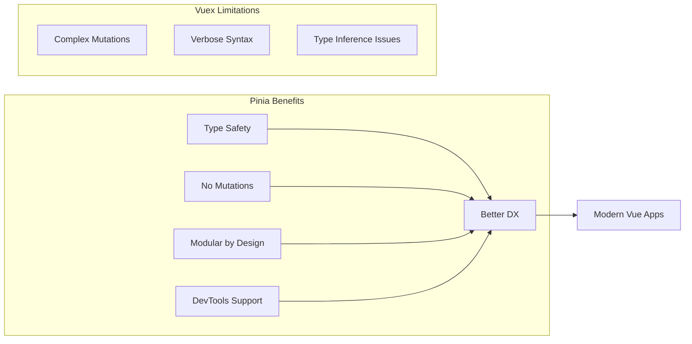
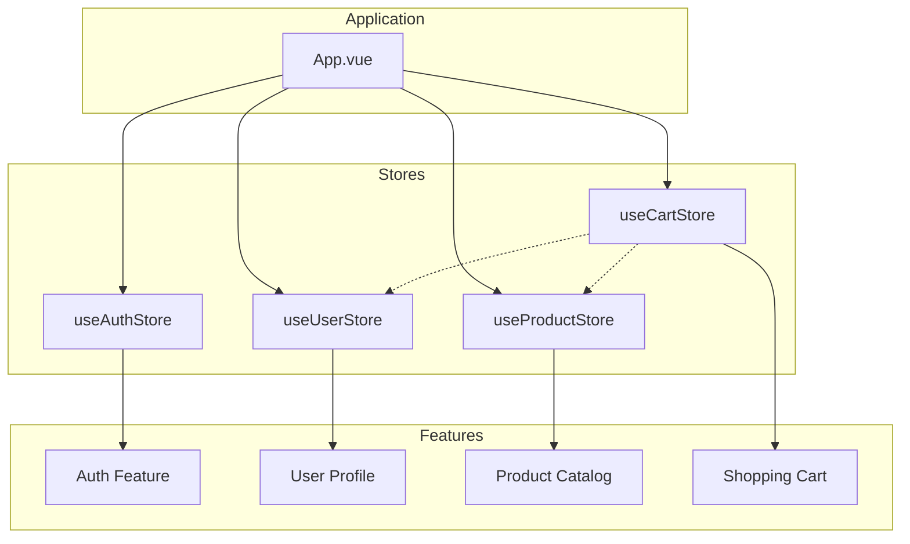
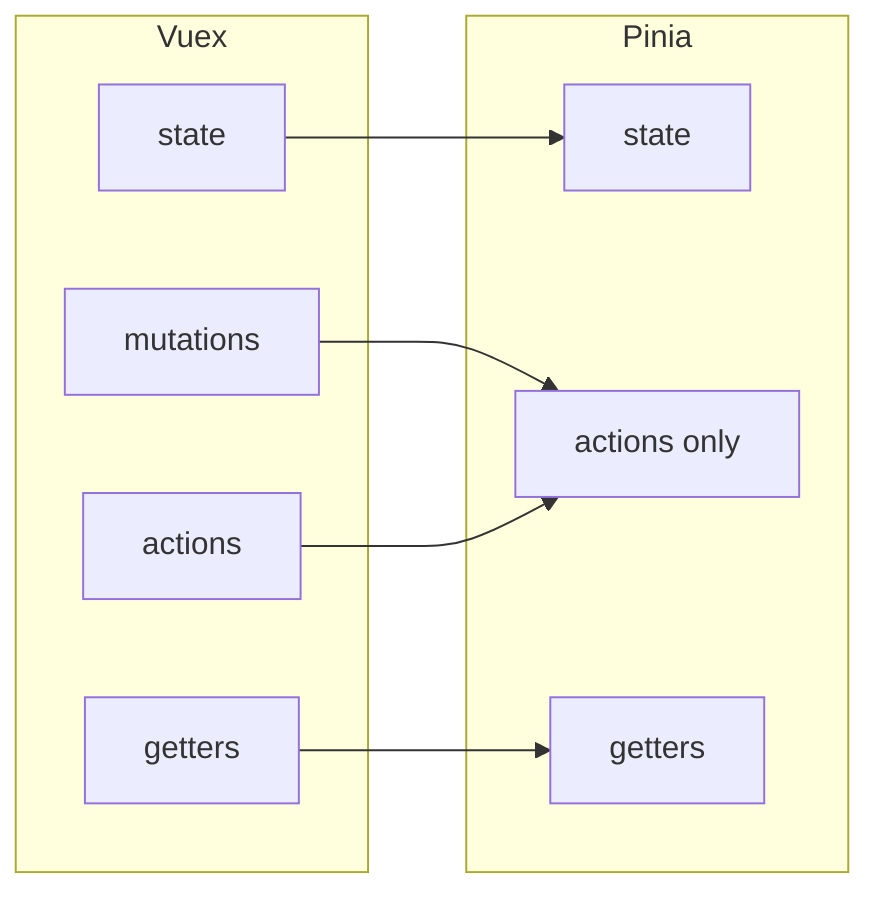

# How to Handle State Management with Pinia

Author: [nawazdhandala](https://www.github.com/nawazdhandala)

Tags: Vue, Pinia, State Management, JavaScript, Frontend, Vue 3, Composition API, Vuex Alternative

Description: A comprehensive guide to managing application state with Pinia, the official state management library for Vue 3, covering store creation, actions, getters, and advanced patterns.

---

> Pinia is the official state management library for Vue 3, designed to be intuitive, type-safe, and devtools-friendly. It replaces Vuex with a simpler API that leverages the Composition API while remaining compatible with the Options API.

Whether you are building a small application or a large-scale enterprise project, Pinia provides a flexible and maintainable approach to state management.

---

## Why Pinia?

Pinia offers several advantages over traditional state management solutions:



---

## Installation and Setup

### Installing Pinia

```bash
# Using npm
npm install pinia

# Using yarn
yarn add pinia

# Using pnpm
pnpm add pinia
```

### Registering Pinia with Vue

```javascript
// main.js
import { createApp } from 'vue'
import { createPinia } from 'pinia'
import App from './App.vue'

// Create the Vue application instance
const app = createApp(App)

// Create and register the Pinia instance
// This makes stores available throughout your application
const pinia = createPinia()
app.use(pinia)

app.mount('#app')
```

---

## Creating Your First Store

Pinia stores are created using the `defineStore` function. You can use either the Options syntax or the Setup syntax.

### Options Syntax

This syntax is familiar to Vuex users and works well with the Options API:

```javascript
// stores/counter.js
import { defineStore } from 'pinia'

// The first argument is a unique store ID
// It is used by devtools and for hydration
export const useCounterStore = defineStore('counter', {
  // State is a function that returns the initial state
  // Similar to data() in Vue components
  state: () => ({
    count: 0,
    history: []
  }),

  // Getters are computed properties for the store
  // They receive state as the first argument
  getters: {
    // Simple getter accessing state
    doubleCount: (state) => state.count * 2,

    // Getter using another getter via 'this'
    quadrupleCount() {
      return this.doubleCount * 2
    },

    // Getter with parameters (returns a function)
    getHistoryItem: (state) => {
      return (index) => state.history[index]
    }
  },

  // Actions are methods that can be async
  // They can modify state directly
  actions: {
    increment() {
      this.count++
      this.history.push({ action: 'increment', value: this.count })
    },

    decrement() {
      this.count--
      this.history.push({ action: 'decrement', value: this.count })
    },

    // Async actions work naturally
    async fetchInitialCount() {
      try {
        const response = await fetch('/api/counter')
        const data = await response.json()
        this.count = data.count
      } catch (error) {
        console.error('Failed to fetch count:', error)
      }
    }
  }
})
```

### Setup Syntax (Composition API)

This syntax uses the Composition API and is more flexible:

```javascript
// stores/counter.js
import { defineStore } from 'pinia'
import { ref, computed } from 'vue'

export const useCounterStore = defineStore('counter', () => {
  // State becomes refs
  const count = ref(0)
  const history = ref([])

  // Getters become computed properties
  const doubleCount = computed(() => count.value * 2)
  const quadrupleCount = computed(() => doubleCount.value * 2)

  // Actions become regular functions
  function increment() {
    count.value++
    history.value.push({ action: 'increment', value: count.value })
  }

  function decrement() {
    count.value--
    history.value.push({ action: 'decrement', value: count.value })
  }

  async function fetchInitialCount() {
    try {
      const response = await fetch('/api/counter')
      const data = await response.json()
      count.value = data.count
    } catch (error) {
      console.error('Failed to fetch count:', error)
    }
  }

  // Return everything that should be exposed
  return {
    count,
    history,
    doubleCount,
    quadrupleCount,
    increment,
    decrement,
    fetchInitialCount
  }
})
```

---

## Using Stores in Components

### With Composition API

```vue
<template>
  <div class="counter">
    <p>Count: {{ counter.count }}</p>
    <p>Double: {{ counter.doubleCount }}</p>

    <button @click="counter.increment">+</button>
    <button @click="counter.decrement">-</button>
    <button @click="counter.fetchInitialCount">Reset from Server</button>
  </div>
</template>

<script setup>
import { useCounterStore } from '@/stores/counter'

// Get the store instance
// The store is reactive - changes will update the component
const counter = useCounterStore()
</script>
```

### Destructuring with storeToRefs

When destructuring, use `storeToRefs` to maintain reactivity:

```vue
<template>
  <div class="counter">
    <p>Count: {{ count }}</p>
    <p>Double: {{ doubleCount }}</p>

    <button @click="increment">+</button>
    <button @click="decrement">-</button>
  </div>
</template>

<script setup>
import { storeToRefs } from 'pinia'
import { useCounterStore } from '@/stores/counter'

const counter = useCounterStore()

// Use storeToRefs for state and getters to keep reactivity
// Destructuring without storeToRefs loses reactivity!
const { count, doubleCount } = storeToRefs(counter)

// Actions can be destructured directly (they are just functions)
const { increment, decrement } = counter
</script>
```

---

## Store Architecture

For larger applications, organize stores by domain or feature:



---

## Advanced Patterns

### Store Composition

Stores can use other stores:

```javascript
// stores/cart.js
import { defineStore } from 'pinia'
import { useProductStore } from './products'
import { useUserStore } from './user'

export const useCartStore = defineStore('cart', {
  state: () => ({
    items: []  // Array of { productId, quantity }
  }),

  getters: {
    // Access other stores within getters
    cartWithDetails() {
      const productStore = useProductStore()
      return this.items.map(item => ({
        ...item,
        product: productStore.getProductById(item.productId),
        subtotal: productStore.getProductById(item.productId)?.price * item.quantity
      }))
    },

    totalPrice() {
      return this.cartWithDetails.reduce((sum, item) => sum + (item.subtotal || 0), 0)
    },

    // Check if user has discount
    finalPrice() {
      const userStore = useUserStore()
      const discount = userStore.isPremiumMember ? 0.9 : 1
      return this.totalPrice * discount
    }
  },

  actions: {
    addToCart(productId, quantity = 1) {
      const existingItem = this.items.find(item => item.productId === productId)

      if (existingItem) {
        existingItem.quantity += quantity
      } else {
        this.items.push({ productId, quantity })
      }
    },

    removeFromCart(productId) {
      const index = this.items.findIndex(item => item.productId === productId)
      if (index > -1) {
        this.items.splice(index, 1)
      }
    },

    async checkout() {
      const userStore = useUserStore()

      if (!userStore.isLoggedIn) {
        throw new Error('Must be logged in to checkout')
      }

      const response = await fetch('/api/checkout', {
        method: 'POST',
        body: JSON.stringify({
          items: this.items,
          userId: userStore.currentUser.id
        })
      })

      if (response.ok) {
        this.items = []  // Clear cart after successful checkout
      }
    }
  }
})
```

### Subscribing to State Changes

Watch for state changes to trigger side effects:

```javascript
// In a component or plugin
import { useCartStore } from '@/stores/cart'

const cartStore = useCartStore()

// Subscribe to all state changes
const unsubscribe = cartStore.$subscribe((mutation, state) => {
  // mutation.type: 'direct' | 'patch object' | 'patch function'
  // mutation.storeId: 'cart'
  // mutation.payload: patch object or undefined

  // Persist cart to localStorage
  localStorage.setItem('cart', JSON.stringify(state.items))
})

// Subscribe to specific actions
cartStore.$onAction(({ name, args, after, onError }) => {
  // Called before the action runs
  console.log(`Action ${name} called with args:`, args)

  after((result) => {
    // Called after the action resolves
    console.log(`Action ${name} completed with result:`, result)
  })

  onError((error) => {
    // Called if the action throws
    console.error(`Action ${name} failed:`, error)
  })
})
```

### State Persistence Plugin

Create a plugin to automatically persist state:

```javascript
// plugins/pinia-persist.js
export function piniaPersistedState({ store }) {
  // Load persisted state on store creation
  const savedState = localStorage.getItem(`pinia-${store.$id}`)
  if (savedState) {
    store.$patch(JSON.parse(savedState))
  }

  // Subscribe to changes and persist
  store.$subscribe((mutation, state) => {
    localStorage.setItem(`pinia-${store.$id}`, JSON.stringify(state))
  })
}

// main.js
import { createPinia } from 'pinia'
import { piniaPersistedState } from './plugins/pinia-persist'

const pinia = createPinia()
pinia.use(piniaPersistedState)
```

---

## Testing Stores

Pinia stores are easy to test:

```javascript
// stores/__tests__/counter.test.js
import { setActivePinia, createPinia } from 'pinia'
import { useCounterStore } from '../counter'
import { beforeEach, describe, expect, it, vi } from 'vitest'

describe('Counter Store', () => {
  beforeEach(() => {
    // Create a fresh Pinia instance for each test
    setActivePinia(createPinia())
  })

  it('initializes with count of 0', () => {
    const counter = useCounterStore()
    expect(counter.count).toBe(0)
  })

  it('increments the count', () => {
    const counter = useCounterStore()
    counter.increment()
    expect(counter.count).toBe(1)
  })

  it('computes double count correctly', () => {
    const counter = useCounterStore()
    counter.count = 5
    expect(counter.doubleCount).toBe(10)
  })

  it('fetches initial count from API', async () => {
    // Mock the fetch call
    global.fetch = vi.fn().mockResolvedValue({
      json: () => Promise.resolve({ count: 42 })
    })

    const counter = useCounterStore()
    await counter.fetchInitialCount()

    expect(counter.count).toBe(42)
    expect(fetch).toHaveBeenCalledWith('/api/counter')
  })
})
```

---

## Migration from Vuex

If migrating from Vuex, here are the key differences:



Key migration points:

1. **No mutations**: Pinia removes mutations entirely. State changes happen directly in actions.
2. **No modules**: Each store is a module. Use store composition for shared logic.
3. **TypeScript support**: Pinia has first-class TypeScript support without additional configuration.
4. **Simpler API**: No commit/dispatch - just call actions directly.

```javascript
// Vuex (old)
store.commit('increment')
store.dispatch('fetchData')

// Pinia (new)
store.increment()
store.fetchData()
```

---

## Summary

Pinia provides a modern, intuitive approach to state management in Vue 3:

1. **Simple API**: No mutations, just state, getters, and actions
2. **TypeScript Ready**: Full type inference without extra configuration
3. **Modular**: Each store is independent and can be composed with others
4. **DevTools Integration**: Full support for Vue DevTools
5. **Flexible Syntax**: Choose between Options and Setup syntax based on preference

Start with small, focused stores and compose them as your application grows. Pinia scales from simple counters to complex enterprise applications.
