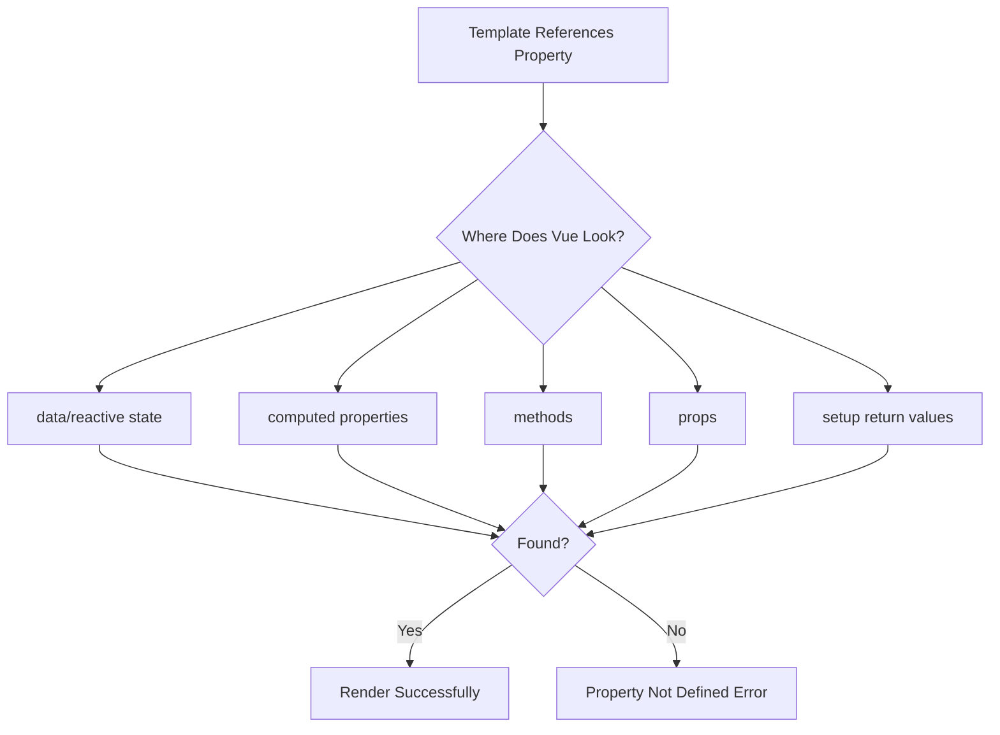
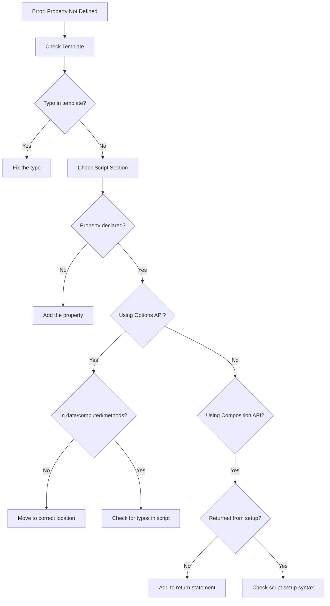

# How to Fix 'Property or Method Not Defined' in Vue

Author: [nawazdhandala](https://www.github.com/nawazdhandala)

Tags: Vue, JavaScript, Debugging, Frontend, Web Development, Vue 3, Composition API, Options API

Description: Learn how to diagnose and fix the common Vue error 'Property or method is not defined on the instance' with practical solutions for both Options API and Composition API.

---

> The "Property or method is not defined on the instance" error is one of the most common issues Vue developers encounter. This error occurs when you reference a property or method in your template that Vue cannot find in your component definition.

Understanding why this error occurs and how to systematically debug it will save you hours of frustration. This guide covers all the common causes and their solutions for both Vue 2 and Vue 3.

---

## Understanding the Error

When Vue compiles your template, it looks for properties and methods in specific locations within your component. If it cannot find what you are referencing, it throws this error.



---

## Common Causes and Solutions

### 1. Typos in Property Names

The most common cause is a simple typo. Vue is case-sensitive, so `userName` and `username` are different properties.

```vue
<template>
  <!-- Wrong: typo in property name -->
  <p>{{ userNmae }}</p>

  <!-- Correct: matches the data property -->
  <p>{{ userName }}</p>
</template>

<script>
export default {
  data() {
    return {
      // The property is defined as userName
      userName: 'John Doe'
    }
  }
}
</script>
```

### 2. Property Not Returned from data()

In Options API, every reactive property must be returned from the `data()` function.

```vue
<script>
export default {
  data() {
    // Wrong: declaring variable but not returning it
    const count = 0

    return {
      // count is missing here!
    }
  }
}
</script>

<!-- Fix: Return all properties from data() -->
<script>
export default {
  data() {
    return {
      // Correct: property is returned and will be reactive
      count: 0
    }
  }
}
</script>
```

### 3. Missing Return in Composition API setup()

When using the Composition API with `setup()`, you must explicitly return everything the template needs.

```vue
<template>
  <button @click="increment">Count: {{ count }}</button>
</template>

<script>
import { ref } from 'vue'

export default {
  setup() {
    const count = ref(0)

    const increment = () => {
      count.value++
    }

    // Wrong: forgetting to return properties and methods
    // return { count }  // increment is missing!

    // Correct: return everything the template uses
    return {
      count,
      increment
    }
  }
}
</script>
```

### 4. Using script setup Correctly

With `<script setup>`, all top-level bindings are automatically exposed. However, imports and declarations must be at the top level.

```vue
<template>
  <p>{{ message }}</p>
  <button @click="handleClick">Click me</button>
</template>

<script setup>
import { ref } from 'vue'

// Top-level declarations are automatically available in template
const message = ref('Hello World')

const handleClick = () => {
  message.value = 'Button clicked!'
}

// Wrong: nested declarations are not exposed
function someFunction() {
  // This variable is NOT available in template
  const nestedValue = 'hidden'
}
</script>
```

---

## Debugging Workflow

Follow this systematic approach to find the source of the error:



---

## Options API Checklist

When using Options API, ensure properties are in the correct location:

```vue
<template>
  <!-- All these need to be properly defined -->
  <p>{{ computedFullName }}</p>
  <p>{{ firstName }}</p>
  <button @click="greet">Greet</button>
</template>

<script>
export default {
  // Props come from parent component
  props: {
    initialName: {
      type: String,
      default: ''
    }
  },

  // Reactive data must be in data()
  data() {
    return {
      firstName: 'John',
      lastName: 'Doe'
    }
  },

  // Derived values go in computed
  computed: {
    computedFullName() {
      return `${this.firstName} ${this.lastName}`
    }
  },

  // Functions go in methods
  methods: {
    greet() {
      // Use 'this' to access other properties
      alert(`Hello, ${this.computedFullName}!`)
    }
  }
}
</script>
```

---

## Composition API Checklist

For Composition API, verify all template bindings are returned:

```vue
<template>
  <input v-model="searchQuery" placeholder="Search...">
  <ul>
    <li v-for="item in filteredItems" :key="item.id">
      {{ item.name }}
    </li>
  </ul>
  <button @click="clearSearch">Clear</button>
</template>

<script>
import { ref, computed } from 'vue'

export default {
  props: {
    items: {
      type: Array,
      default: () => []
    }
  },

  setup(props) {
    // Reactive state
    const searchQuery = ref('')

    // Computed property
    const filteredItems = computed(() => {
      if (!searchQuery.value) return props.items
      return props.items.filter(item =>
        item.name.toLowerCase().includes(searchQuery.value.toLowerCase())
      )
    })

    // Method
    const clearSearch = () => {
      searchQuery.value = ''
    }

    // Critical: Return everything used in template
    return {
      searchQuery,
      filteredItems,
      clearSearch
    }
  }
}
</script>
```

---

## Common Gotchas

### Async Data Not Initialized

When fetching data asynchronously, ensure you initialize the property first:

```vue
<template>
  <!-- This will error if user is undefined -->
  <p>{{ user.name }}</p>

  <!-- Safe: use optional chaining or v-if -->
  <p v-if="user">{{ user.name }}</p>
</template>

<script setup>
import { ref, onMounted } from 'vue'

// Initialize with null or empty object
const user = ref(null)

onMounted(async () => {
  // Fetch data and assign later
  const response = await fetch('/api/user')
  user.value = await response.json()
})
</script>
```

### Destructuring Props Loses Reactivity

Be careful when destructuring props in Composition API:

```vue
<script>
import { computed, toRefs } from 'vue'

export default {
  props: {
    count: Number
  },

  setup(props) {
    // Wrong: destructuring loses reactivity
    // const { count } = props

    // Correct: use toRefs to maintain reactivity
    const { count } = toRefs(props)

    const doubled = computed(() => count.value * 2)

    return { doubled }
  }
}
</script>
```

### Accessing this in Arrow Functions

In Options API, arrow functions do not have their own `this` binding:

```vue
<script>
export default {
  data() {
    return {
      items: []
    }
  },

  methods: {
    // Wrong: arrow function loses 'this' context
    // fetchItems: async () => {
    //   this.items = await fetch('/api/items')  // 'this' is undefined
    // }

    // Correct: use regular function
    async fetchItems() {
      const response = await fetch('/api/items')
      this.items = await response.json()
    }
  }
}
</script>
```

---

## IDE Integration Tips

Modern IDEs can catch these errors before runtime:

1. **VS Code with Volar**: Provides type checking and auto-completion for Vue 3
2. **WebStorm**: Has built-in Vue support with property detection
3. **TypeScript**: Adding types catches undefined properties at compile time

```vue
<script setup lang="ts">
import { ref } from 'vue'

// TypeScript will catch typos and undefined properties
interface User {
  id: number
  name: string
  email: string
}

const user = ref<User | null>(null)

// TypeScript error if you try to access user.nmae (typo)
</script>
```

---

## Summary

The "Property or method not defined" error usually comes from:

1. Typos in template or script
2. Missing return statements in `setup()` or `data()`
3. Properties declared in wrong location (data vs computed vs methods)
4. Uninitialized async data
5. Reactivity lost through destructuring

By following the debugging workflow and checklists in this guide, you can quickly identify and fix these issues in your Vue applications.
