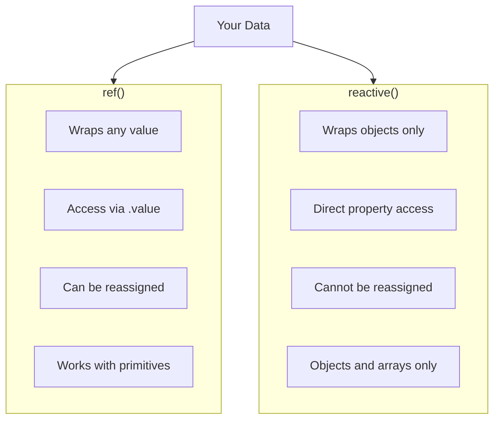
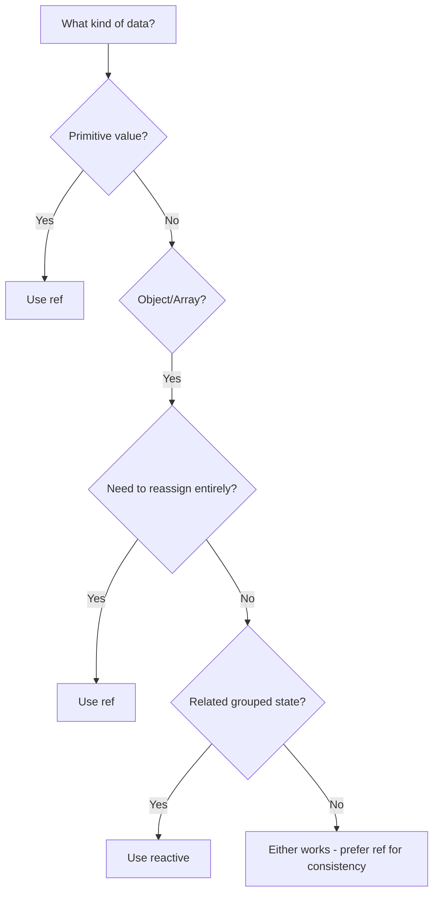
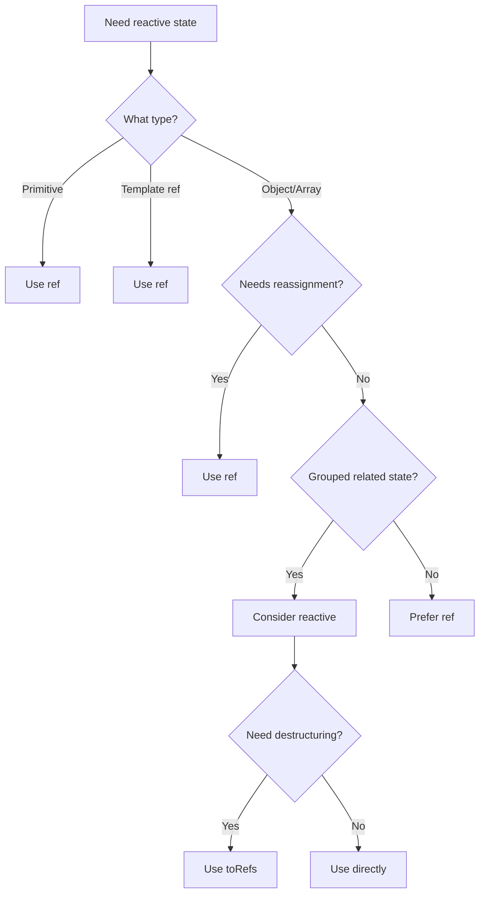

# How to Fix "Ref vs Reactive" Confusion in Vue 3

Author: [nawazdhandala](https://www.github.com/nawazdhandala)

Tags: Vue, Reactivity, ref, reactive, Composition API, Vue 3, State Management

Description: Understand the differences between ref and reactive in Vue 3, learn when to use each, and avoid common pitfalls that break reactivity.

---

> The Composition API introduces two ways to create reactive state: ref and reactive. Understanding their differences is crucial for building reliable Vue 3 applications. This guide clarifies when and how to use each.

Vue 3's reactivity system is more flexible than Vue 2's, but this flexibility can cause confusion. Both ref and reactive create reactive state, but they behave differently in subtle ways.

---

## Core Differences

Understanding the fundamental differences between ref and reactive.



```javascript
// Basic ref vs reactive comparison
import { ref, reactive } from 'vue'

// ref - wraps any value in an object with .value property
const count = ref(0)
const message = ref('hello')
const user = ref({ name: 'John' })
const items = ref([1, 2, 3])

// Access and modify via .value
console.log(count.value)  // 0
count.value++  // Reactive update
message.value = 'world'  // Reactive update
user.value = { name: 'Jane' }  // Reactive (full replacement)
user.value.name = 'Bob'  // Reactive (property change)

// reactive - creates reactive proxy of an object
const state = reactive({
  count: 0,
  message: 'hello'
})

// Direct access without .value
console.log(state.count)  // 0
state.count++  // Reactive update
state.message = 'world'  // Reactive update

// CANNOT reassign the whole object
// state = { count: 1, message: 'new' }  // WRONG - loses reactivity
```

---

## When to Use ref

ref is more versatile and works with any value type.

```vue
<script setup>
import { ref } from 'vue'

// Primitives - MUST use ref
const count = ref(0)
const isVisible = ref(true)
const username = ref('john')

// Objects and arrays - ref works fine
const user = ref({
  name: 'John',
  email: 'john@example.com'
})

const items = ref(['apple', 'banana', 'cherry'])

// Template refs - MUST use ref
const inputElement = ref(null)
const modalComponent = ref(null)

// Async data - ref allows full replacement
const apiData = ref(null)

async function fetchData() {
  const response = await fetch('/api/data')
  apiData.value = await response.json()  // Full replacement works
}

// Benefits of ref:
// 1. Works with all types (primitives, objects, arrays)
// 2. Can be fully reassigned
// 3. Clear when you're using reactive state (.value)
// 4. Required for template refs
</script>

<template>
  <div>
    <p>Count: {{ count }}</p>  <!-- No .value in template -->
    <p>User: {{ user.name }}</p>  <!-- Nested access without .value -->
    <input ref="inputElement" />  <!-- Template ref -->
  </div>
</template>
```

---

## When to Use reactive

reactive is ideal for related state grouped in an object.

```vue
<script setup>
import { reactive, toRefs } from 'vue'

// Group related state together
const form = reactive({
  username: '',
  email: '',
  password: '',
  confirmPassword: '',
  errors: {
    username: null,
    email: null,
    password: null
  }
})

// No .value needed
function validateForm() {
  form.errors.username = form.username.length < 3
    ? 'Username too short'
    : null

  form.errors.email = !form.email.includes('@')
    ? 'Invalid email'
    : null
}

// Complex nested state
const appState = reactive({
  user: {
    profile: {
      name: 'John',
      avatar: '/avatar.png'
    },
    settings: {
      theme: 'dark',
      notifications: true
    }
  },
  ui: {
    sidebar: {
      isOpen: true,
      width: 250
    },
    modal: {
      isVisible: false,
      content: null
    }
  }
})

// Benefits of reactive:
// 1. Cleaner syntax for objects (no .value)
// 2. Groups related state logically
// 3. Feels more natural for complex nested structures
// 4. Works well with destructuring using toRefs
</script>

<template>
  <form @submit.prevent="validateForm">
    <input v-model="form.username" />
    <span v-if="form.errors.username">{{ form.errors.username }}</span>

    <input v-model="form.email" type="email" />
    <span v-if="form.errors.email">{{ form.errors.email }}</span>
  </form>
</template>
```

---

## Common Pitfall: Losing Reactivity with Destructuring

Destructuring reactive objects breaks reactivity.

```vue
<script setup>
import { reactive, ref, toRefs } from 'vue'

const state = reactive({
  count: 0,
  message: 'hello'
})

// WRONG - destructuring loses reactivity
const { count, message } = state
// count and message are now plain values, not reactive

setTimeout(() => {
  state.count++  // This updates state.count
  console.log(count)  // Still 0! Not reactive
}, 1000)
</script>
```

```vue
<!-- CORRECT: Use toRefs to maintain reactivity -->
<script setup>
import { reactive, toRefs } from 'vue'

const state = reactive({
  count: 0,
  message: 'hello'
})

// CORRECT - toRefs converts each property to a ref
const { count, message } = toRefs(state)
// count and message are now refs

setTimeout(() => {
  state.count++  // Updates state.count
  console.log(count.value)  // 1 - Still reactive!
}, 1000)

// Can also use toRef for single property
import { toRef } from 'vue'
const countRef = toRef(state, 'count')
</script>

<template>
  <!-- In template, refs auto-unwrap -->
  <p>{{ count }}</p>  <!-- Works without .value -->
</template>
```

---

## Common Pitfall: Reassigning Reactive Objects

Reassigning a reactive object breaks reactivity.

```vue
<script setup>
import { reactive, ref } from 'vue'

// WRONG - reassignment breaks reactivity
let user = reactive({ name: 'John', age: 30 })

async function fetchUser() {
  const data = await fetch('/api/user').then(r => r.json())
  user = data  // WRONG - user is no longer reactive
  // Template won't update!
}
</script>
```

```vue
<!-- CORRECT: Modify properties or use ref -->
<script setup>
import { reactive, ref } from 'vue'

// Option 1: Use ref for data that needs full replacement
const user = ref({ name: 'John', age: 30 })

async function fetchUser() {
  const data = await fetch('/api/user').then(r => r.json())
  user.value = data  // CORRECT - ref can be reassigned
}

// Option 2: Update properties individually with reactive
const userReactive = reactive({ name: 'John', age: 30 })

async function fetchUserReactive() {
  const data = await fetch('/api/user').then(r => r.json())
  // Update properties individually
  Object.assign(userReactive, data)  // CORRECT
  // Or update each property
  userReactive.name = data.name
  userReactive.age = data.age
}
</script>
```

---

## Common Pitfall: Reactive with Primitives

reactive only works with objects.

```javascript
import { reactive, ref } from 'vue'

// WRONG - reactive does not work with primitives
const count = reactive(0)  // Returns 0, not reactive!
const message = reactive('hello')  // Returns 'hello', not reactive!

// Vue will warn: "value cannot be made reactive: 0"

// CORRECT - use ref for primitives
const countRef = ref(0)  // Reactive
const messageRef = ref('hello')  // Reactive
```

---

## Common Pitfall: Unwrapping Behavior

Refs auto-unwrap in templates and reactive objects.

```vue
<script setup>
import { ref, reactive } from 'vue'

const count = ref(0)

// In reactive objects, refs auto-unwrap
const state = reactive({
  count: count  // ref inside reactive
})

// Access without .value
console.log(state.count)  // 0, not the ref object
state.count++  // Updates the ref

// Arrays do NOT auto-unwrap
const list = reactive([ref(1), ref(2), ref(3)])
console.log(list[0])  // ref object, not 1
console.log(list[0].value)  // 1 - need .value
</script>

<template>
  <!-- Template auto-unwraps refs -->
  <p>{{ count }}</p>  <!-- 0, not { value: 0 } -->

  <!-- Reactive state with ref -->
  <p>{{ state.count }}</p>  <!-- 0, auto-unwrapped -->

  <!-- Array of refs - NO auto-unwrap -->
  <p>{{ list[0].value }}</p>  <!-- Need .value -->
</template>
```

---

## Comparison Chart



| Feature | ref | reactive |
|---------|-----|----------|
| Primitives | Yes | No |
| Objects | Yes | Yes |
| Arrays | Yes | Yes |
| Reassignable | Yes (.value) | No |
| Destructurable | N/A | With toRefs |
| Template syntax | Auto-unwrap | Direct |
| Nested reactivity | Yes | Yes |

---

## Best Practice Patterns

### Pattern 1: Prefer ref for Simplicity

```vue
<script setup>
import { ref, computed } from 'vue'

// Simple, consistent pattern - always use ref
const isLoading = ref(false)
const error = ref(null)
const data = ref(null)

const hasError = computed(() => error.value !== null)

async function fetchData() {
  isLoading.value = true
  error.value = null

  try {
    const response = await fetch('/api/data')
    data.value = await response.json()
  } catch (e) {
    error.value = e.message
  } finally {
    isLoading.value = false
  }
}
</script>
```

### Pattern 2: Use reactive for Complex Forms

```vue
<script setup>
import { reactive, computed } from 'vue'

// Form state with reactive - cleaner for many fields
const form = reactive({
  personal: {
    firstName: '',
    lastName: '',
    email: ''
  },
  address: {
    street: '',
    city: '',
    zip: ''
  },
  preferences: {
    newsletter: false,
    notifications: true
  }
})

// Computed on reactive - no .value needed
const fullName = computed(() =>
  `${form.personal.firstName} ${form.personal.lastName}`
)

const isValid = computed(() =>
  form.personal.email.includes('@') &&
  form.personal.firstName.length > 0
)

function resetForm() {
  // Reset with Object.assign
  Object.assign(form.personal, {
    firstName: '',
    lastName: '',
    email: ''
  })
}
</script>

<template>
  <input v-model="form.personal.firstName" />
  <input v-model="form.personal.lastName" />
  <input v-model="form.personal.email" type="email" />
</template>
```

### Pattern 3: Composables with ref

```javascript
// composables/useAsync.js
// Composable returning refs for flexibility

import { ref, computed } from 'vue'

export function useAsync(asyncFn) {
  const data = ref(null)
  const error = ref(null)
  const isLoading = ref(false)

  const hasError = computed(() => error.value !== null)
  const hasData = computed(() => data.value !== null)

  async function execute(...args) {
    isLoading.value = true
    error.value = null

    try {
      data.value = await asyncFn(...args)
    } catch (e) {
      error.value = e
    } finally {
      isLoading.value = false
    }
  }

  return {
    data,
    error,
    isLoading,
    hasError,
    hasData,
    execute
  }
}
```

```vue
<script setup>
import { useAsync } from './composables/useAsync'

// Using the composable
const { data: users, isLoading, error, execute } = useAsync(
  () => fetch('/api/users').then(r => r.json())
)

// Call execute to fetch
execute()
</script>

<template>
  <div v-if="isLoading">Loading...</div>
  <div v-else-if="error">Error: {{ error.message }}</div>
  <ul v-else>
    <li v-for="user in users" :key="user.id">{{ user.name }}</li>
  </ul>
</template>
```

---

## TypeScript Considerations

```typescript
// TypeScript with ref and reactive
import { ref, reactive, Ref } from 'vue'

// ref - type is inferred or explicit
const count = ref(0)  // Ref<number>
const message = ref<string | null>(null)  // Ref<string | null>

// Interface for complex types
interface User {
  id: number
  name: string
  email: string
}

const user = ref<User | null>(null)  // Ref<User | null>

// reactive - type is inferred from initial value
const state = reactive({
  count: 0,
  users: [] as User[]
})

// Type is inferred as:
// { count: number, users: User[] }

// For complex reactive state, define interface
interface AppState {
  user: User | null
  settings: {
    theme: 'light' | 'dark'
    language: string
  }
}

const appState: AppState = reactive({
  user: null,
  settings: {
    theme: 'dark',
    language: 'en'
  }
})
```

---

## Migration from Vue 2

```vue
<!-- Vue 2 Options API -->
<script>
export default {
  data() {
    return {
      count: 0,
      user: { name: 'John' },
      items: []
    }
  }
}
</script>
```

```vue
<!-- Vue 3 Composition API with ref -->
<script setup>
import { ref } from 'vue'

// Direct translation using ref
const count = ref(0)
const user = ref({ name: 'John' })
const items = ref([])
</script>
```

```vue
<!-- Vue 3 Composition API with reactive -->
<script setup>
import { reactive, toRefs } from 'vue'

// Group all state in one reactive object (similar to data())
const state = reactive({
  count: 0,
  user: { name: 'John' },
  items: []
})

// Expose as individual refs if needed
const { count, user, items } = toRefs(state)
</script>
```

---

## Decision Flowchart



---

## Summary

Key guidelines for choosing between ref and reactive:

1. **Default to ref** - It works with all types and is more predictable
2. **Use reactive for forms** - When you have many related fields
3. **Never destructure reactive** - Use toRefs if you need to
4. **Never reassign reactive** - Use Object.assign or ref instead
5. **Remember .value** - Required in script, not in template
6. **Watch unwrapping** - Arrays inside reactive do not auto-unwrap refs
7. **Use TypeScript** - Type inference helps catch reactivity issues

When in doubt, use ref. It is more flexible and avoids common reactivity pitfalls. The .value syntax makes it explicit when you are working with reactive state, which can help prevent bugs.
