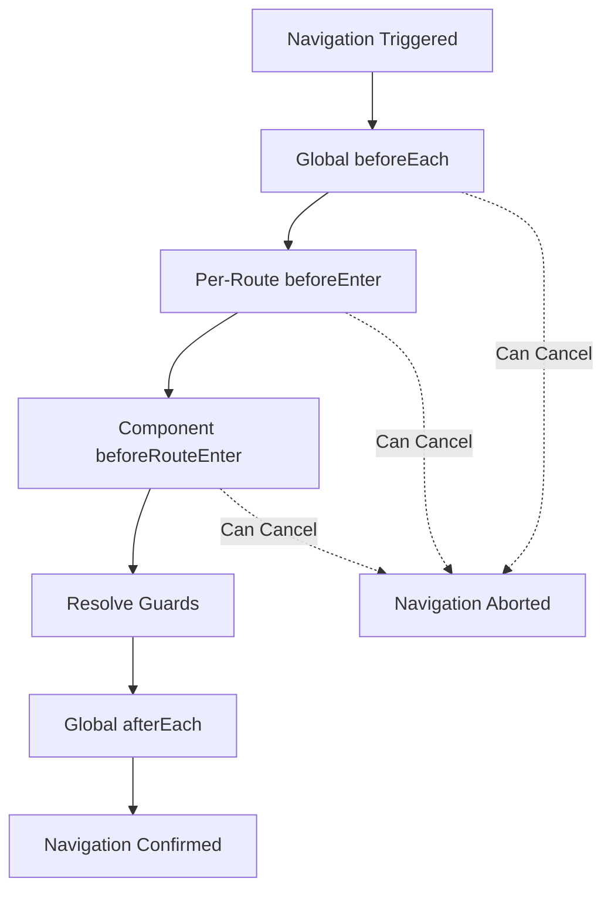
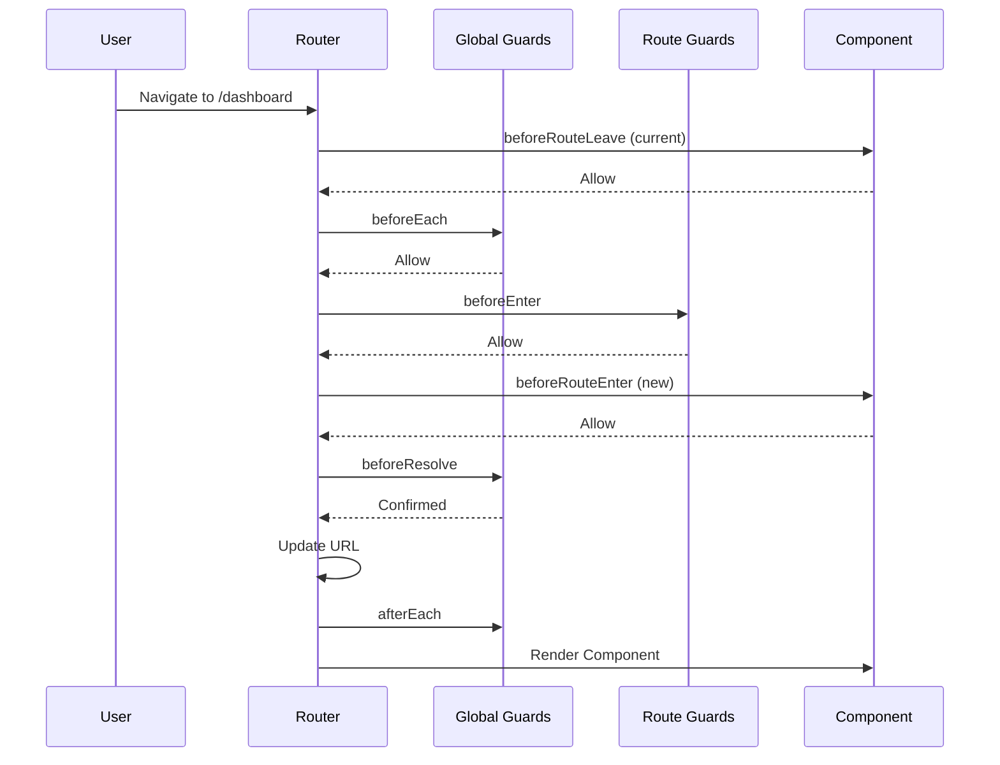

# How to Configure Vue Router Navigation Guards

Author: [nawazdhandala](https://www.github.com/nawazdhandala)

Tags: Vue, Vue Router, Navigation Guards, Authentication, JavaScript, Frontend, Security, Routing

Description: A comprehensive guide to configuring Vue Router navigation guards for authentication, authorization, data fetching, and route protection in Vue 3 applications.

---

> Navigation guards are hooks provided by Vue Router that allow you to control navigation flow. They are essential for implementing authentication, authorization, data prefetching, and analytics tracking in Vue applications.

This guide covers all types of navigation guards and shows practical patterns for common use cases like protecting routes, loading data, and handling unsaved changes.

---

## Types of Navigation Guards

Vue Router provides three levels of navigation guards:



---

## Global Guards

Global guards apply to every navigation in your application.

### Setting Up the Router

```javascript
// router/index.js
import { createRouter, createWebHistory } from 'vue-router'
import { useAuthStore } from '@/stores/auth'

const routes = [
  {
    path: '/',
    name: 'home',
    component: () => import('@/views/HomeView.vue')
  },
  {
    path: '/login',
    name: 'login',
    component: () => import('@/views/LoginView.vue'),
    meta: { requiresGuest: true }
  },
  {
    path: '/dashboard',
    name: 'dashboard',
    component: () => import('@/views/DashboardView.vue'),
    meta: { requiresAuth: true }
  },
  {
    path: '/admin',
    name: 'admin',
    component: () => import('@/views/AdminView.vue'),
    meta: { requiresAuth: true, requiresAdmin: true }
  }
]

const router = createRouter({
  history: createWebHistory(),
  routes
})

export default router
```

### beforeEach Guard

The `beforeEach` guard runs before every navigation:

```javascript
// router/index.js (continued)

// Global authentication guard
router.beforeEach(async (to, from, next) => {
  const authStore = useAuthStore()

  // Initialize auth state if needed (e.g., from localStorage/cookie)
  if (!authStore.initialized) {
    await authStore.initialize()
  }

  // Check if route requires authentication
  if (to.meta.requiresAuth && !authStore.isAuthenticated) {
    // Redirect to login with return URL
    return next({
      name: 'login',
      query: { redirect: to.fullPath }
    })
  }

  // Check if route requires admin role
  if (to.meta.requiresAdmin && !authStore.isAdmin) {
    // Redirect to dashboard with error message
    return next({
      name: 'dashboard',
      query: { error: 'unauthorized' }
    })
  }

  // Prevent authenticated users from accessing guest-only pages
  if (to.meta.requiresGuest && authStore.isAuthenticated) {
    return next({ name: 'dashboard' })
  }

  // Proceed with navigation
  next()
})
```

### Modern Syntax (Vue Router 4+)

Vue Router 4 supports returning values instead of calling `next()`:

```javascript
// Modern syntax without next()
router.beforeEach(async (to, from) => {
  const authStore = useAuthStore()

  if (!authStore.initialized) {
    await authStore.initialize()
  }

  if (to.meta.requiresAuth && !authStore.isAuthenticated) {
    // Return a route location to redirect
    return {
      name: 'login',
      query: { redirect: to.fullPath }
    }
  }

  if (to.meta.requiresAdmin && !authStore.isAdmin) {
    return { name: 'dashboard' }
  }

  if (to.meta.requiresGuest && authStore.isAuthenticated) {
    return { name: 'dashboard' }
  }

  // Return true or undefined to confirm navigation
  // Return false to cancel navigation
})
```

### afterEach Guard

The `afterEach` guard runs after navigation completes:

```javascript
// Analytics and page title updates
router.afterEach((to, from) => {
  // Update document title
  document.title = to.meta.title || 'My App'

  // Track page view for analytics
  if (typeof gtag !== 'undefined') {
    gtag('config', 'GA_TRACKING_ID', {
      page_path: to.fullPath
    })
  }

  // Scroll to top on navigation
  window.scrollTo(0, 0)
})
```

---

## Per-Route Guards

Define guards directly on route definitions:

```javascript
// router/index.js
const routes = [
  {
    path: '/checkout',
    name: 'checkout',
    component: () => import('@/views/CheckoutView.vue'),
    // Route-level guard
    beforeEnter: (to, from) => {
      const cartStore = useCartStore()

      // Prevent accessing checkout with empty cart
      if (cartStore.isEmpty) {
        return { name: 'cart', query: { error: 'empty' } }
      }
    }
  },
  {
    path: '/verify-email/:token',
    name: 'verify-email',
    component: () => import('@/views/VerifyEmailView.vue'),
    // Async guard for token validation
    beforeEnter: async (to) => {
      try {
        const response = await fetch(`/api/verify-token/${to.params.token}`)
        if (!response.ok) {
          return { name: 'login', query: { error: 'invalid-token' } }
        }
      } catch (error) {
        return { name: 'error', params: { code: '500' } }
      }
    }
  },
  {
    path: '/products/:category',
    name: 'products',
    component: () => import('@/views/ProductsView.vue'),
    // Multiple guards as an array
    beforeEnter: [validateCategory, loadCategoryData]
  }
]

// Reusable guard functions
function validateCategory(to) {
  const validCategories = ['electronics', 'clothing', 'home', 'sports']
  if (!validCategories.includes(to.params.category)) {
    return { name: 'products', params: { category: 'electronics' } }
  }
}

async function loadCategoryData(to) {
  const productStore = useProductStore()
  await productStore.loadCategory(to.params.category)
}
```

---

## Component Guards

Define guards within component definitions:

```vue
<!-- EditPostView.vue -->
<template>
  <div class="edit-post">
    <h1>Edit Post</h1>
    <form @submit.prevent="savePost">
      <input v-model="title" placeholder="Title" />
      <textarea v-model="content" placeholder="Content"></textarea>
      <button type="submit">Save</button>
    </form>
  </div>
</template>

<script>
export default {
  data() {
    return {
      title: '',
      content: '',
      originalTitle: '',
      originalContent: '',
      isSaving: false
    }
  },

  computed: {
    hasUnsavedChanges() {
      return this.title !== this.originalTitle ||
             this.content !== this.originalContent
    }
  },

  // Called before route enters this component
  // Does not have access to 'this' - component not created yet
  beforeRouteEnter(to, from, next) {
    // Fetch post data before entering
    fetch(`/api/posts/${to.params.id}`)
      .then(res => res.json())
      .then(post => {
        // Pass data to component via next callback
        next(vm => {
          vm.title = post.title
          vm.content = post.content
          vm.originalTitle = post.title
          vm.originalContent = post.content
        })
      })
      .catch(() => {
        next({ name: 'posts', query: { error: 'not-found' } })
      })
  },

  // Called when route changes but component is reused
  // Has access to 'this'
  beforeRouteUpdate(to, from) {
    // Reset form when navigating to different post
    return fetch(`/api/posts/${to.params.id}`)
      .then(res => res.json())
      .then(post => {
        this.title = post.title
        this.content = post.content
        this.originalTitle = post.title
        this.originalContent = post.content
      })
  },

  // Called when navigating away from this component
  // Has access to 'this'
  beforeRouteLeave(to, from) {
    if (this.hasUnsavedChanges && !this.isSaving) {
      const answer = window.confirm(
        'You have unsaved changes. Are you sure you want to leave?'
      )
      if (!answer) {
        // Cancel navigation
        return false
      }
    }
  },

  methods: {
    async savePost() {
      this.isSaving = true
      await fetch(`/api/posts/${this.$route.params.id}`, {
        method: 'PUT',
        body: JSON.stringify({ title: this.title, content: this.content })
      })
      this.originalTitle = this.title
      this.originalContent = this.content
      this.isSaving = false
    }
  }
}
</script>
```

### Component Guards with Composition API

```vue
<script setup>
import { ref, computed } from 'vue'
import { onBeforeRouteLeave, onBeforeRouteUpdate, useRoute } from 'vue-router'

const route = useRoute()
const title = ref('')
const content = ref('')
const originalTitle = ref('')
const originalContent = ref('')
const isSaving = ref(false)

const hasUnsavedChanges = computed(() => {
  return title.value !== originalTitle.value ||
         content.value !== originalContent.value
})

// Load initial data
async function loadPost(id) {
  const response = await fetch(`/api/posts/${id}`)
  const post = await response.json()
  title.value = post.title
  content.value = post.content
  originalTitle.value = post.title
  originalContent.value = post.content
}

// Initial load
loadPost(route.params.id)

// Called when route params change but component is reused
onBeforeRouteUpdate(async (to, from) => {
  await loadPost(to.params.id)
})

// Called when navigating away
onBeforeRouteLeave((to, from) => {
  if (hasUnsavedChanges.value && !isSaving.value) {
    const answer = window.confirm(
      'You have unsaved changes. Are you sure you want to leave?'
    )
    if (!answer) {
      return false
    }
  }
})
</script>
```

---

## Navigation Guard Flow

Complete flow of all navigation guards:



---

## Advanced Patterns

### Role-Based Access Control

```javascript
// router/guards/rbac.js
const roleHierarchy = {
  admin: ['admin', 'editor', 'user'],
  editor: ['editor', 'user'],
  user: ['user']
}

export function createRBACGuard(router) {
  router.beforeEach((to, from) => {
    const authStore = useAuthStore()
    const requiredRoles = to.meta.roles

    // No role requirement
    if (!requiredRoles || requiredRoles.length === 0) {
      return true
    }

    // Not authenticated
    if (!authStore.isAuthenticated) {
      return { name: 'login', query: { redirect: to.fullPath } }
    }

    const userRole = authStore.user.role
    const userPermissions = roleHierarchy[userRole] || []

    // Check if user has any of the required roles
    const hasPermission = requiredRoles.some(role =>
      userPermissions.includes(role)
    )

    if (!hasPermission) {
      return { name: 'forbidden' }
    }

    return true
  })
}

// Usage in routes
const routes = [
  {
    path: '/admin/users',
    component: AdminUsers,
    meta: { roles: ['admin'] }
  },
  {
    path: '/editor/posts',
    component: EditorPosts,
    meta: { roles: ['admin', 'editor'] }
  }
]
```

### Data Prefetching Guard

```javascript
// router/guards/prefetch.js
export function createPrefetchGuard(router) {
  router.beforeResolve(async (to) => {
    // Get all matched route components
    const matched = to.matched

    // Collect all prefetch functions
    const prefetchFunctions = matched
      .map(record => record.meta.prefetch)
      .filter(Boolean)

    if (prefetchFunctions.length === 0) {
      return true
    }

    try {
      // Execute all prefetch functions in parallel
      await Promise.all(
        prefetchFunctions.map(fn => fn(to))
      )
      return true
    } catch (error) {
      console.error('Prefetch failed:', error)
      return { name: 'error', params: { message: 'Failed to load data' } }
    }
  })
}

// Usage in routes
const routes = [
  {
    path: '/products/:id',
    component: ProductDetail,
    meta: {
      prefetch: async (to) => {
        const productStore = useProductStore()
        await productStore.fetchProduct(to.params.id)
      }
    }
  }
]
```

### Navigation Progress Indicator

```javascript
// router/guards/progress.js
import NProgress from 'nprogress'

export function createProgressGuard(router) {
  router.beforeEach(() => {
    NProgress.start()
  })

  router.afterEach(() => {
    NProgress.done()
  })

  // Handle errors
  router.onError(() => {
    NProgress.done()
  })
}
```

### Confirm Navigation with Modal

```javascript
// composables/useNavigationConfirm.js
import { ref } from 'vue'
import { onBeforeRouteLeave } from 'vue-router'

export function useNavigationConfirm(shouldConfirm) {
  const showModal = ref(false)
  const pendingNavigation = ref(null)

  onBeforeRouteLeave((to, from) => {
    if (shouldConfirm.value) {
      showModal.value = true
      pendingNavigation.value = to
      return false
    }
  })

  function confirmLeave() {
    showModal.value = false
    if (pendingNavigation.value) {
      // Temporarily disable confirmation
      shouldConfirm.value = false
      router.push(pendingNavigation.value)
    }
  }

  function cancelLeave() {
    showModal.value = false
    pendingNavigation.value = null
  }

  return {
    showModal,
    confirmLeave,
    cancelLeave
  }
}
```

---

## Testing Navigation Guards

```javascript
// router/__tests__/guards.test.js
import { describe, it, expect, vi, beforeEach } from 'vitest'
import { createRouter, createWebHistory } from 'vue-router'
import { setActivePinia, createPinia } from 'pinia'
import { useAuthStore } from '@/stores/auth'

describe('Navigation Guards', () => {
  let router

  beforeEach(() => {
    setActivePinia(createPinia())

    router = createRouter({
      history: createWebHistory(),
      routes: [
        { path: '/', name: 'home', component: {} },
        { path: '/login', name: 'login', component: {} },
        {
          path: '/dashboard',
          name: 'dashboard',
          component: {},
          meta: { requiresAuth: true }
        }
      ]
    })

    // Add your guards
    router.beforeEach((to) => {
      const authStore = useAuthStore()
      if (to.meta.requiresAuth && !authStore.isAuthenticated) {
        return { name: 'login' }
      }
    })
  })

  it('allows access to public routes', async () => {
    await router.push('/')
    expect(router.currentRoute.value.name).toBe('home')
  })

  it('redirects unauthenticated users from protected routes', async () => {
    await router.push('/dashboard')
    expect(router.currentRoute.value.name).toBe('login')
  })

  it('allows authenticated users to access protected routes', async () => {
    const authStore = useAuthStore()
    authStore.isAuthenticated = true

    await router.push('/dashboard')
    expect(router.currentRoute.value.name).toBe('dashboard')
  })
})
```

---

## Summary

Vue Router navigation guards provide powerful control over navigation flow:

1. **Global guards**: Apply to all routes for authentication and analytics
2. **Per-route guards**: Validate specific routes or prefetch data
3. **Component guards**: Handle unsaved changes and component-specific logic
4. **Modern syntax**: Return values instead of calling `next()` in Vue Router 4+

Use guards strategically to create secure, user-friendly navigation experiences while keeping your code organized and testable.
