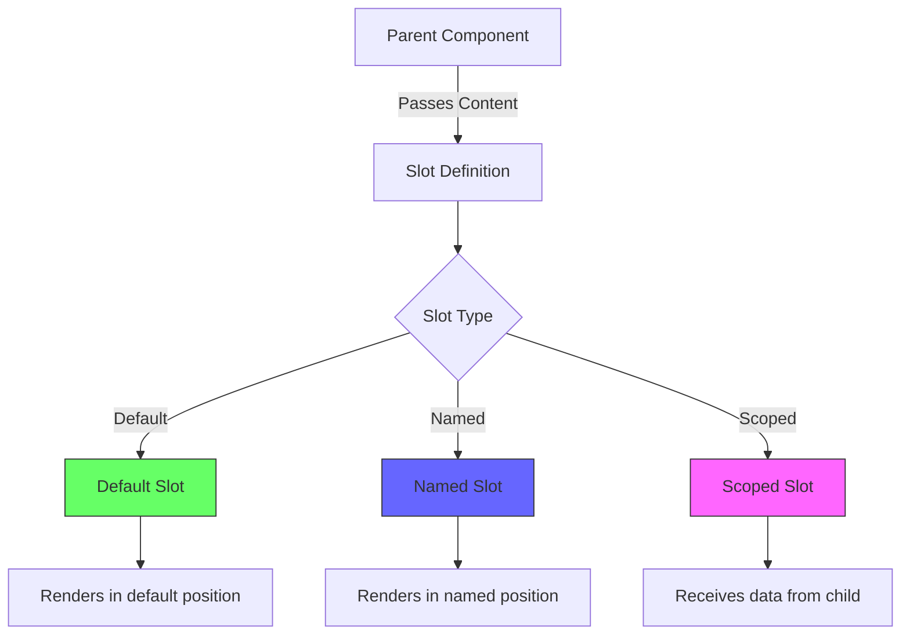
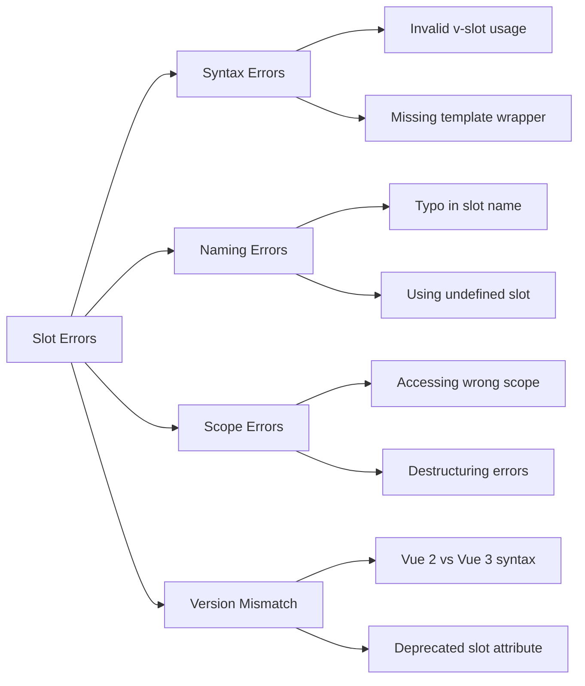
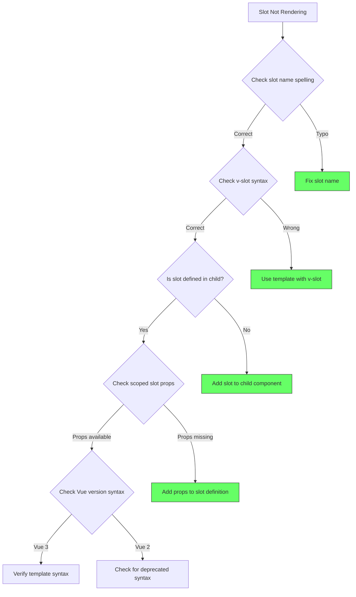

# How to Fix "Slot Content" Errors in Vue

Author: [nawazdhandala](https://www.github.com/nawazdhandala)

Tags: Vue, Slots, Components, Debugging, Frontend, JavaScript, TypeScript

Description: A practical guide to diagnosing and fixing slot content errors in Vue.js applications, covering named slots, scoped slots, and common anti-patterns.

---

Slot content errors in Vue are among the most confusing issues for developers. They often arise from mismatched slot names, incorrect scoped slot syntax, or attempting to use slots in unsupported ways. This guide covers systematic debugging approaches and solutions.

---

## Understanding Vue Slots



---

## Common Slot Content Errors



---

## Error 1: Invalid v-slot Directive Usage

The `v-slot` directive can only be used on `<template>` elements or component tags for default slots.

### The Error

```text
[Vue warn]: v-slot can only be used on components or <template> tags.
```

### Incorrect Usage

```vue
<template>
  <MyComponent>
    <!-- ERROR: v-slot on a regular div -->
    <div v-slot:header>
      <h1>Title</h1>
    </div>
  </MyComponent>
</template>
```

### Correct Solution

```vue
<template>
  <MyComponent>
    <!-- CORRECT: v-slot on template element -->
    <template v-slot:header>
      <h1>Title</h1>
    </template>

    <!-- CORRECT: Shorthand syntax -->
    <template #header>
      <h1>Title</h1>
    </template>
  </MyComponent>
</template>
```

### Default Slot Exception

The only exception is using `v-slot` directly on a component for the default slot:

```vue
<template>
  <!-- CORRECT: Default slot directly on component -->
  <MyComponent v-slot="{ user }">
    <p>{{ user.name }}</p>
  </MyComponent>

  <!-- Also CORRECT: Explicit default slot -->
  <MyComponent>
    <template v-slot:default="{ user }">
      <p>{{ user.name }}</p>
    </template>
  </MyComponent>
</template>
```

---

## Error 2: Slot Not Found

### The Error

```text
[Vue warn]: Slot "header" invoked outside of the render function: this will not track dependencies used in the slot.
```

Or the slot content simply does not render.

### Debugging Slot Names

```vue
<!-- ChildComponent.vue -->
<template>
  <div class="card">
    <!-- Define available slots -->
    <header v-if="$slots.header">
      <slot name="header"></slot>
    </header>

    <main>
      <slot></slot> <!-- default slot -->
    </main>

    <footer v-if="$slots.footer">
      <slot name="footer"></slot>
    </footer>
  </div>
</template>

<script setup>
import { useSlots } from 'vue'

// Debug: Log available slots
const slots = useSlots()
console.log('Available slots:', Object.keys(slots))
</script>
```

### Parent Component Usage

```vue
<template>
  <ChildComponent>
    <!-- WRONG: Typo in slot name -->
    <template #heaer>
      <h1>This will not render</h1>
    </template>

    <!-- CORRECT: Exact slot name match -->
    <template #header>
      <h1>This will render</h1>
    </template>

    <!-- Default slot content -->
    <p>Main content goes here</p>

    <template #footer>
      <p>Footer content</p>
    </template>
  </ChildComponent>
</template>
```

---

## Error 3: Scoped Slot Data Not Available

```mermaid
flowchart TD
    A[Child Component] -->|Exposes Data| B[slot :user="user"]
    B --> C[Parent Template]
    C -->|Receives via| D[v-slot="{ user }"]
    D --> E[Can use user in template]

    F[Common Error] --> G[Trying to access data<br>not passed by child]

    style E fill:#6f6,stroke:#333
    style G fill:#f66,stroke:#333
```

### The Error

```text
[Vue warn]: Property "user" was accessed during render but is not defined on instance.
```

### Child Component Exposing Data

```vue
<!-- UserList.vue -->
<template>
  <ul>
    <li v-for="user in users" :key="user.id">
      <!-- Expose user data to parent via slot props -->
      <slot name="user" :user="user" :index="index">
        <!-- Default content if no slot provided -->
        {{ user.name }}
      </slot>
    </li>
  </ul>
</template>

<script setup>
import { ref } from 'vue'

const users = ref([
  { id: 1, name: 'Alice', role: 'Admin' },
  { id: 2, name: 'Bob', role: 'User' },
])
</script>
```

### Parent Component Receiving Data

```vue
<template>
  <UserList>
    <!-- WRONG: Trying to access properties not passed -->
    <template #user="{ user }">
      <!-- ERROR: 'email' was not passed in slot props -->
      <span>{{ user.email }}</span>
    </template>

    <!-- CORRECT: Only access passed properties -->
    <template #user="{ user, index }">
      <span>{{ index + 1 }}. {{ user.name }} ({{ user.role }})</span>
    </template>

    <!-- CORRECT: With destructuring and defaults -->
    <template #user="{ user, index = 0 }">
      <span>{{ user.name }}</span>
    </template>
  </UserList>
</template>
```

---

## Error 4: Vue 2 to Vue 3 Migration Issues

### Deprecated Syntax

```vue
<!-- Vue 2 DEPRECATED syntax -->
<template>
  <MyComponent>
    <!-- OLD: slot attribute (deprecated in Vue 2.6, removed in Vue 3) -->
    <div slot="header">Header</div>

    <!-- OLD: slot-scope attribute -->
    <div slot="item" slot-scope="{ item }">
      {{ item.name }}
    </div>
  </MyComponent>
</template>
```

### Modern Vue 3 Syntax

```vue
<!-- Vue 3 CORRECT syntax -->
<template>
  <MyComponent>
    <!-- NEW: v-slot directive with # shorthand -->
    <template #header>
      <div>Header</div>
    </template>

    <!-- NEW: Scoped slot with v-slot -->
    <template #item="{ item }">
      <div>{{ item.name }}</div>
    </template>
  </MyComponent>
</template>
```

### Migration Helper Script

```javascript
// Script to find deprecated slot syntax in Vue files
// Run: node find-deprecated-slots.js src/

const fs = require('fs')
const path = require('path')

function findDeprecatedSlots(dir) {
  const issues = []

  function walkDir(currentPath) {
    const files = fs.readdirSync(currentPath)

    for (const file of files) {
      const filePath = path.join(currentPath, file)
      const stat = fs.statSync(filePath)

      if (stat.isDirectory()) {
        walkDir(filePath)
      } else if (file.endsWith('.vue')) {
        const content = fs.readFileSync(filePath, 'utf8')

        // Check for deprecated slot attribute
        if (content.match(/\sslot=["'][^"']+["']/)) {
          issues.push({
            file: filePath,
            issue: 'Deprecated slot attribute found',
            suggestion: 'Use <template #slotName> instead'
          })
        }

        // Check for deprecated slot-scope
        if (content.match(/slot-scope/)) {
          issues.push({
            file: filePath,
            issue: 'Deprecated slot-scope attribute found',
            suggestion: 'Use <template #slotName="props"> instead'
          })
        }
      }
    }
  }

  walkDir(dir)
  return issues
}

const issues = findDeprecatedSlots(process.argv[2] || './src')
console.log('Deprecated slot syntax found:')
issues.forEach(issue => {
  console.log(`\n${issue.file}`)
  console.log(`  Issue: ${issue.issue}`)
  console.log(`  Fix: ${issue.suggestion}`)
})
```

---

## Error 5: Dynamic Slot Names

### The Error

Dynamic slot names require proper bracket syntax.

```vue
<template>
  <!-- WRONG: String interpolation does not work -->
  <template #"item-{{ index }}">
    Content
  </template>

  <!-- CORRECT: Dynamic slot name syntax -->
  <template v-slot:[`item-${index}`]>
    Content
  </template>

  <!-- CORRECT: With shorthand -->
  <template #[dynamicSlotName]>
    Content
  </template>
</template>

<script setup>
import { computed } from 'vue'

const index = 1
const dynamicSlotName = computed(() => `item-${index}`)
</script>
```

### Dynamic Slots in Child Component

```vue
<!-- TabPanel.vue -->
<template>
  <div class="tabs">
    <div class="tab-headers">
      <button
        v-for="tab in tabs"
        :key="tab.id"
        @click="activeTab = tab.id"
      >
        {{ tab.label }}
      </button>
    </div>

    <div class="tab-content">
      <!-- Dynamic slot rendering -->
      <template v-for="tab in tabs" :key="tab.id">
        <div v-show="activeTab === tab.id">
          <slot :name="`tab-${tab.id}`" :tab="tab">
            Default content for {{ tab.label }}
          </slot>
        </div>
      </template>
    </div>
  </div>
</template>

<script setup>
import { ref } from 'vue'

const props = defineProps({
  tabs: {
    type: Array,
    required: true
  }
})

const activeTab = ref(props.tabs[0]?.id)
</script>
```

### Parent Usage with Dynamic Slots

```vue
<template>
  <TabPanel :tabs="tabs">
    <template v-for="tab in tabs" :key="tab.id" v-slot:[`tab-${tab.id}`]="{ tab }">
      <component :is="tab.component" v-bind="tab.props" />
    </template>
  </TabPanel>
</template>

<script setup>
import UserProfile from './UserProfile.vue'
import Settings from './Settings.vue'

const tabs = [
  { id: 'profile', label: 'Profile', component: UserProfile, props: { userId: 1 } },
  { id: 'settings', label: 'Settings', component: Settings, props: {} },
]
</script>
```

---

## Error 6: Render Function Slot Usage

When using render functions or JSX, slot syntax differs significantly.

### Render Function Slots

```javascript
// Composition API with render function
import { h, useSlots } from 'vue'

export default {
  setup() {
    const slots = useSlots()

    return () => h('div', { class: 'wrapper' }, [
      // Render header slot if provided
      slots.header ? h('header', slots.header()) : null,

      // Render default slot
      h('main', slots.default ? slots.default() : 'No content'),

      // Render footer slot with fallback
      h('footer', slots.footer?.() || 'Default footer')
    ])
  }
}
```

### JSX Slot Usage

```jsx
// Using JSX with Vue 3
import { defineComponent, useSlots } from 'vue'

export default defineComponent({
  setup() {
    const slots = useSlots()

    return () => (
      <div class="card">
        {slots.header && (
          <header class="card-header">
            {slots.header()}
          </header>
        )}

        <main class="card-body">
          {slots.default?.() ?? <p>No content provided</p>}
        </main>

        {slots.footer && (
          <footer class="card-footer">
            {slots.footer()}
          </footer>
        )}
      </div>
    )
  }
})
```

### Passing Scoped Slot Data in Render Functions

```javascript
import { h, useSlots } from 'vue'

export default {
  props: ['items'],
  setup(props) {
    const slots = useSlots()

    return () => h('ul',
      props.items.map((item, index) =>
        h('li', { key: item.id },
          // Pass data to scoped slot
          slots.item?.({ item, index }) ?? h('span', item.name)
        )
      )
    )
  }
}
```

---

## Debugging Checklist



### Quick Debug Component

```vue
<!-- SlotDebugger.vue - Wrap your component to debug slots -->
<template>
  <div class="slot-debugger">
    <details>
      <summary>Slot Debug Info</summary>
      <pre>{{ slotInfo }}</pre>
    </details>
    <slot></slot>
  </div>
</template>

<script setup>
import { useSlots, computed } from 'vue'

const slots = useSlots()

const slotInfo = computed(() => {
  const info = {}
  for (const [name, slotFn] of Object.entries(slots)) {
    info[name] = {
      exists: true,
      hasContent: typeof slotFn === 'function'
    }
  }
  return JSON.stringify(info, null, 2)
})
</script>
```

---

## Summary

| Error | Cause | Solution |
|-------|-------|----------|
| v-slot on wrong element | Using v-slot on non-template/component | Wrap with `<template v-slot:name>` |
| Slot not rendering | Name mismatch or undefined slot | Verify slot names match exactly |
| Scoped data undefined | Accessing unpassed props | Check slot prop definitions |
| Deprecated syntax | Using Vue 2 slot/slot-scope | Migrate to v-slot syntax |
| Dynamic slot issues | Wrong interpolation syntax | Use bracket notation `#[name]` |
| Render function errors | Wrong slot invocation | Use `slots.name?.()` pattern |

Proper slot usage enables powerful component composition in Vue. When encountering slot errors, systematically verify the slot name, syntax, and data flow between parent and child components.
