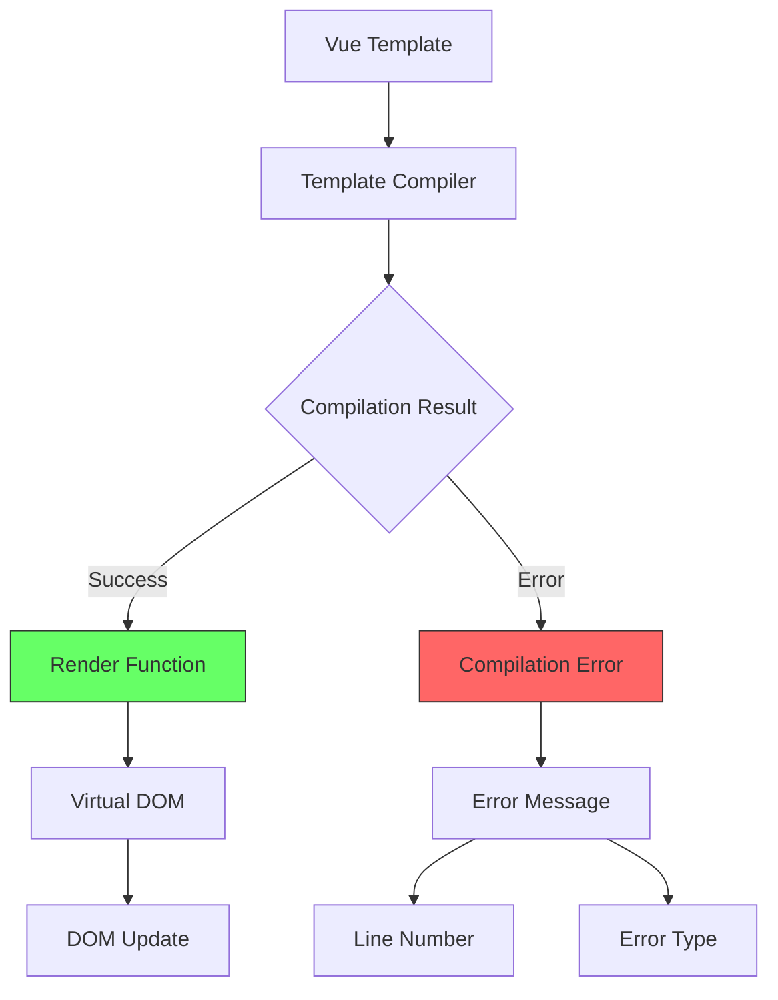
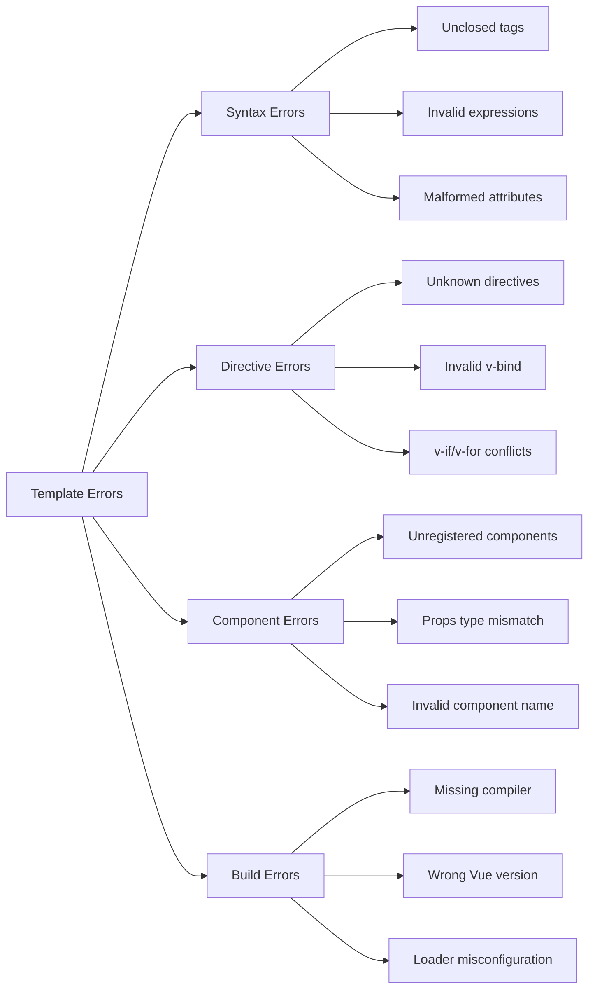
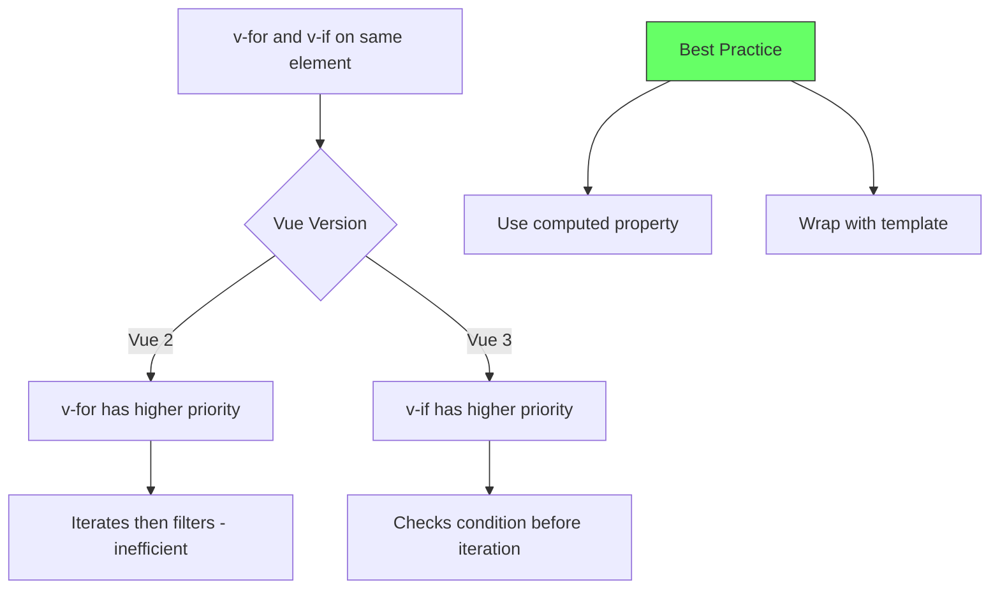
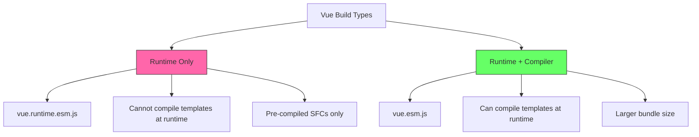

# How to Fix 'Template Compilation' Errors in Vue

Author: [nawazdhandala](https://www.github.com/nawazdhandala)

Tags: Vue, Template, Compilation, Debugging, Frontend, JavaScript, Syntax Errors

Description: A practical guide to diagnosing and fixing template compilation errors in Vue.js applications, covering syntax issues, directive problems, and build configuration.

---

Template compilation errors in Vue prevent your application from rendering and can be frustrating to debug. This guide covers common compilation errors, their causes, and systematic approaches to resolving them.

---

## Understanding Vue Template Compilation



---

## Error Categories



---

## Error 1: Unexpected Token in Expression

### The Error

```text
[Vue warn]: Error compiling template:
invalid expression: Unexpected token in

  {{ user.name + }}
```

### Incorrect Code

```vue
<template>
  <div>
    <!-- ERROR: Incomplete expression -->
    <p>{{ user.name + }}</p>

    <!-- ERROR: Invalid JavaScript syntax -->
    <p>{{ if (user) user.name }}</p>

    <!-- ERROR: Assignment in expression -->
    <p>{{ count = count + 1 }}</p>
  </div>
</template>
```

### Correct Solution

```vue
<template>
  <div>
    <!-- CORRECT: Complete expression -->
    <p>{{ user.name + ' ' + user.lastName }}</p>

    <!-- CORRECT: Use ternary for conditionals -->
    <p>{{ user ? user.name : 'Anonymous' }}</p>

    <!-- CORRECT: Use computed for complex logic -->
    <p>{{ formattedCount }}</p>
  </div>
</template>

<script setup>
import { ref, computed } from 'vue'

const user = ref({ name: 'John', lastName: 'Doe' })
const count = ref(0)

// Move logic to computed property
const formattedCount = computed(() => {
  return `Count: ${count.value}`
})
</script>
```

---

## Error 2: Component Not Found

### The Error

```text
[Vue warn]: Failed to resolve component: MyButton
If this is a native custom element, make sure to exclude it from component resolution.
```

### Debugging Component Registration

```vue
<!-- WRONG: Component not imported or registered -->
<template>
  <div>
    <MyButton>Click me</MyButton>
  </div>
</template>

<script setup>
// Missing import statement
</script>
```

### Correct Solutions

```vue
<!-- Solution 1: Import in script setup (auto-registered) -->
<template>
  <div>
    <MyButton>Click me</MyButton>
  </div>
</template>

<script setup>
// Components imported in script setup are automatically available
import MyButton from '@/components/MyButton.vue'
</script>
```

```vue
<!-- Solution 2: Options API with explicit registration -->
<template>
  <div>
    <MyButton>Click me</MyButton>
  </div>
</template>

<script>
import MyButton from '@/components/MyButton.vue'

export default {
  components: {
    MyButton  // Explicitly register component
  }
}
</script>
```

```javascript
// Solution 3: Global registration in main.js
import { createApp } from 'vue'
import App from './App.vue'
import MyButton from '@/components/MyButton.vue'

const app = createApp(App)

// Register globally - available in all components
app.component('MyButton', MyButton)

app.mount('#app')
```

### Custom Elements Warning

```javascript
// main.js - Configure custom elements
import { createApp } from 'vue'

const app = createApp(App)

// Tell Vue to ignore custom elements matching a pattern
app.config.compilerOptions.isCustomElement = (tag) => {
  return tag.startsWith('custom-') || tag.includes('-')
}

app.mount('#app')
```

---

## Error 3: v-if and v-for on Same Element

### The Error

```text
[Vue warn]: v-if and v-for should not be used on the same element.
```



### Incorrect Code

```vue
<template>
  <ul>
    <!-- WRONG: v-if and v-for on same element -->
    <li v-for="item in items" v-if="item.isActive" :key="item.id">
      {{ item.name }}
    </li>
  </ul>
</template>
```

### Correct Solutions

```vue
<!-- Solution 1: Use computed property (recommended) -->
<template>
  <ul>
    <li v-for="item in activeItems" :key="item.id">
      {{ item.name }}
    </li>
  </ul>
</template>

<script setup>
import { ref, computed } from 'vue'

const items = ref([
  { id: 1, name: 'Item 1', isActive: true },
  { id: 2, name: 'Item 2', isActive: false },
  { id: 3, name: 'Item 3', isActive: true }
])

// Filter in computed property
const activeItems = computed(() => {
  return items.value.filter(item => item.isActive)
})
</script>
```

```vue
<!-- Solution 2: Wrap with template for conditional rendering -->
<template>
  <ul>
    <template v-for="item in items" :key="item.id">
      <li v-if="item.isActive">
        {{ item.name }}
      </li>
    </template>
  </ul>
</template>
```

```vue
<!-- Solution 3: Move v-if to container when hiding entire list -->
<template>
  <ul v-if="shouldShowList">
    <li v-for="item in items" :key="item.id">
      {{ item.name }}
    </li>
  </ul>
</template>

<script setup>
import { ref, computed } from 'vue'

const items = ref([])
const shouldShowList = computed(() => items.value.length > 0)
</script>
```

---

## Error 4: Missing Root Element (Vue 2)

### The Error (Vue 2 only)

```text
Component template should contain exactly one root element.
```

### Vue 2 vs Vue 3 Comparison

```vue
<!-- Vue 2: WRONG - Multiple root elements -->
<template>
  <header>Header</header>
  <main>Content</main>
  <footer>Footer</footer>
</template>

<!-- Vue 2: CORRECT - Single root element -->
<template>
  <div class="page">
    <header>Header</header>
    <main>Content</main>
    <footer>Footer</footer>
  </div>
</template>

<!-- Vue 3: CORRECT - Multiple root elements allowed (Fragments) -->
<template>
  <header>Header</header>
  <main>Content</main>
  <footer>Footer</footer>
</template>
```

---

## Error 5: Invalid v-model Usage

### The Error

```text
[Vue warn]: v-model cannot be used on a prop, because local prop bindings are not writable.
```

### Incorrect Code

```vue
<!-- WRONG: v-model directly on prop -->
<template>
  <input v-model="title" />
</template>

<script setup>
defineProps(['title'])
</script>
```

### Correct Solutions

```vue
<!-- Solution 1: Use v-model with emit -->
<template>
  <input
    :value="title"
    @input="$emit('update:title', $event.target.value)"
  />
</template>

<script setup>
defineProps(['title'])
defineEmits(['update:title'])
</script>

<!-- Parent component -->
<template>
  <ChildComponent v-model:title="pageTitle" />
</template>
```

```vue
<!-- Solution 2: Use local ref with watcher -->
<template>
  <input v-model="localTitle" />
</template>

<script setup>
import { ref, watch } from 'vue'

const props = defineProps(['title'])
const emit = defineEmits(['update:title'])

const localTitle = ref(props.title)

// Sync prop changes to local
watch(() => props.title, (newVal) => {
  localTitle.value = newVal
})

// Emit local changes
watch(localTitle, (newVal) => {
  emit('update:title', newVal)
})
</script>
```

```vue
<!-- Solution 3: Use computed with getter/setter -->
<template>
  <input v-model="titleModel" />
</template>

<script setup>
import { computed } from 'vue'

const props = defineProps(['title'])
const emit = defineEmits(['update:title'])

const titleModel = computed({
  get: () => props.title,
  set: (value) => emit('update:title', value)
})
</script>
```

---

## Error 6: Invalid Attribute Name

### The Error

```text
[Vue warn]: Invalid prop name: "class" is a reserved attribute and cannot be used as component prop.
```

### Reserved Attribute Names

```vue
<!-- WRONG: Using reserved attribute names -->
<script setup>
// These will cause issues
defineProps({
  class: String,    // Reserved
  style: Object,    // Reserved
  key: String,      // Reserved
  ref: String       // Reserved
})
</script>

<!-- CORRECT: Use different names -->
<script setup>
defineProps({
  customClass: String,
  customStyle: Object,
  itemKey: String,
  inputRef: String
})
</script>
```

### Attribute Inheritance

```vue
<!-- ChildComponent.vue -->
<template>
  <!-- class and style from parent are automatically applied -->
  <div class="child-class">
    Content
  </div>
</template>

<script setup>
// Disable automatic attribute inheritance
defineOptions({
  inheritAttrs: false
})
</script>
```

```vue
<!-- Manual attribute binding -->
<template>
  <div>
    <input v-bind="$attrs" class="custom-input" />
  </div>
</template>

<script setup>
defineOptions({
  inheritAttrs: false
})
</script>
```

---

## Error 7: Template Syntax in Wrong Place

### The Error

```text
[Vue warn]: Template compilation error: Tags with side effect (<script> and <style>) are ignored in client component templates.
```

### Incorrect Code

```vue
<!-- WRONG: Script inside template -->
<template>
  <div>
    <script>
      console.log('This will not work')
    </script>
    <style>
      .class { color: red; }
    </style>
  </div>
</template>
```

### Correct Structure

```vue
<template>
  <div class="content">
    <!-- Only template content here -->
    <p>Hello World</p>
  </div>
</template>

<script setup>
// Script logic here
console.log('Component mounted')
</script>

<style scoped>
/* Styles here */
.content {
  color: red;
}
</style>
```

---

## Error 8: Build Configuration Issues

### Missing Template Compiler

```text
[Vue warn]: Component provided template option but runtime compilation is not supported in this build of Vue.
```



### Vite Configuration

```javascript
// vite.config.js
import { defineConfig } from 'vite'
import vue from '@vitejs/plugin-vue'

export default defineConfig({
  plugins: [vue()],
  resolve: {
    alias: {
      // Use full build with template compiler
      'vue': 'vue/dist/vue.esm-bundler.js'
    }
  }
})
```

### Webpack Configuration

```javascript
// vue.config.js (Vue CLI)
module.exports = {
  // Use full build with template compiler
  runtimeCompiler: true
}
```

```javascript
// webpack.config.js (manual webpack)
module.exports = {
  resolve: {
    alias: {
      'vue$': 'vue/dist/vue.esm-bundler.js'
    }
  }
}
```

### When You Need the Compiler

```javascript
// This requires the full build with compiler
import { createApp } from 'vue'

const app = createApp({
  // Template string requires runtime compilation
  template: '<div>{{ message }}</div>',
  data() {
    return { message: 'Hello' }
  }
})

// This works with runtime-only build
import { createApp, h } from 'vue'

const app = createApp({
  // Render function does not need compiler
  render() {
    return h('div', this.message)
  },
  data() {
    return { message: 'Hello' }
  }
})
```

---

## Error 9: Expression Expected

### The Error

```text
[Vue warn]: Error compiling template: invalid expression: Expected expression, got ')'
```

### Common Causes

```vue
<!-- WRONG: Empty event handler -->
<button @click="">Click</button>

<!-- WRONG: Incomplete method call -->
<button @click="handleClick(">Click</button>

<!-- WRONG: Invalid ternary -->
<p>{{ isActive ? 'Active' }}</p>

<!-- WRONG: Missing closing parenthesis -->
<button @click="doSomething(item">Click</button>
```

### Correct Code

```vue
<template>
  <div>
    <!-- CORRECT: Remove empty handlers or add logic -->
    <button @click="handleClick">Click</button>

    <!-- CORRECT: Complete method call -->
    <button @click="handleClick(item)">Click</button>

    <!-- CORRECT: Complete ternary -->
    <p>{{ isActive ? 'Active' : 'Inactive' }}</p>

    <!-- CORRECT: Balanced parentheses -->
    <button @click="doSomething(item)">Click</button>
  </div>
</template>

<script setup>
import { ref } from 'vue'

const isActive = ref(true)
const item = ref({ id: 1 })

function handleClick(item) {
  console.log('Clicked', item)
}

function doSomething(item) {
  console.log('Processing', item)
}
</script>
```

---

## Debugging Template Errors

### Enable Detailed Warnings

```javascript
// main.js
import { createApp } from 'vue'
import App from './App.vue'

const app = createApp(App)

// Enable detailed warnings in development
if (process.env.NODE_ENV === 'development') {
  app.config.warnHandler = (msg, vm, trace) => {
    console.warn('Vue Warning:', msg)
    console.log('Component:', vm)
    console.log('Trace:', trace)
  }

  app.config.errorHandler = (err, vm, info) => {
    console.error('Vue Error:', err)
    console.log('Component:', vm)
    console.log('Info:', info)
  }
}

app.mount('#app')
```

### ESLint Vue Plugin

```javascript
// .eslintrc.js
module.exports = {
  extends: [
    'plugin:vue/vue3-recommended'  // or 'plugin:vue/vue3-essential'
  ],
  rules: {
    // Catch template errors during development
    'vue/no-parsing-error': 'error',
    'vue/valid-template-root': 'error',
    'vue/valid-v-bind': 'error',
    'vue/valid-v-for': 'error',
    'vue/valid-v-if': 'error',
    'vue/valid-v-model': 'error',
    'vue/no-use-v-if-with-v-for': 'error',
    'vue/require-v-for-key': 'error'
  }
}
```

### VS Code Vue Extension Settings

```json
{
  "volar.validation.template": true,
  "volar.validation.script": true,
  "volar.validation.style": true
}
```

---

## Summary

| Error | Cause | Solution |
|-------|-------|----------|
| Invalid expression | Syntax error in mustache | Fix JavaScript syntax |
| Component not found | Missing import/registration | Import or register component |
| v-if with v-for | Both on same element | Use computed or template wrapper |
| Multiple roots (Vue 2) | Fragment not supported | Wrap in single element |
| v-model on prop | Props are read-only | Use emit pattern or computed |
| Reserved attribute | Using class/style/key as prop | Rename prop |
| Runtime compilation | Missing compiler in build | Use full Vue build |
| Expression expected | Incomplete expression | Complete the expression |

Template compilation errors are caught during build time, making them easier to fix than runtime errors. Use ESLint with Vue plugin and proper IDE extensions to catch these errors early in development.
