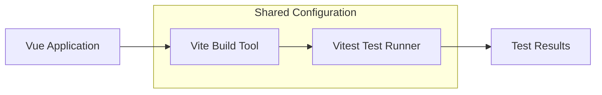
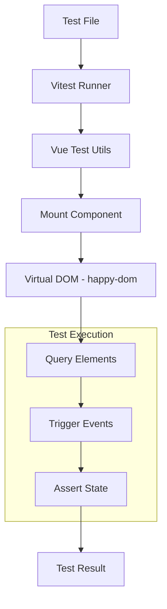
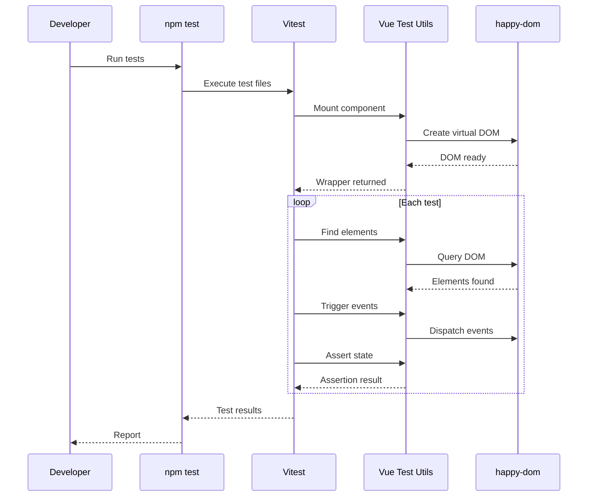

# How to Configure Vue Testing with Vitest

Author: [nawazdhandala](https://www.github.com/nawazdhandala)

Tags: Vue, Vitest, Testing, Unit Testing, Component Testing, JavaScript, TypeScript

Description: A comprehensive guide to setting up and configuring Vitest for testing Vue 3 applications with practical examples and best practices.

---

Vitest has emerged as the preferred testing framework for Vue applications, offering native ES modules support, TypeScript integration, and a familiar Jest-like API. In this guide, we will walk through setting up Vitest for Vue 3 projects and writing effective component tests.

## Why Vitest for Vue?

Vitest is built on top of Vite and shares its configuration, making it the natural choice for Vue projects using Vite as their build tool.



## Installation

First, install Vitest and the required testing utilities:

```bash
# Install Vitest and Vue Test Utils
npm install -D vitest @vue/test-utils happy-dom

# For TypeScript support
npm install -D @types/node
```

## Basic Configuration

Create or update your `vite.config.ts` to include Vitest configuration:

```typescript
// vite.config.ts
import { defineConfig } from 'vite';
import vue from '@vitejs/plugin-vue';

export default defineConfig({
    plugins: [vue()],
    test: {
        // Enable global test APIs (describe, it, expect)
        globals: true,

        // Use happy-dom for DOM simulation
        environment: 'happy-dom',

        // Setup files to run before each test file
        setupFiles: ['./src/test/setup.ts'],

        // Include patterns for test files
        include: ['**/*.{test,spec}.{js,mjs,cjs,ts,mts,cts,jsx,tsx}'],

        // Exclude patterns
        exclude: ['node_modules', 'dist', '.idea', '.git', '.cache'],

        // Coverage configuration
        coverage: {
            provider: 'v8',
            reporter: ['text', 'json', 'html'],
            exclude: [
                'node_modules/',
                'src/test/'
            ]
        }
    }
});
```

## TypeScript Configuration

If you are using TypeScript, update your `tsconfig.json` to include Vitest types:

```json
{
    "compilerOptions": {
        "types": ["vitest/globals"]
    }
}
```

## Setup File

Create a setup file to configure global test utilities:

```typescript
// src/test/setup.ts
import { config } from '@vue/test-utils';

// Configure global plugins, directives, or components
config.global.mocks = {
    // Mock $t for i18n
    $t: (key: string) => key
};

// Add global stubs
config.global.stubs = {
    // Stub router-link
    'router-link': true
};
```

## Component Testing Architecture

Understanding how component testing works with Vitest and Vue Test Utils:



## Writing Your First Component Test

Let us test a simple counter component:

```vue
<!-- src/components/Counter.vue -->
<template>
    <div class="counter">
        <span data-testid="count">{{ count }}</span>
        <button @click="increment" data-testid="increment-btn">
            Increment
        </button>
        <button @click="decrement" data-testid="decrement-btn">
            Decrement
        </button>
    </div>
</template>

<script setup lang="ts">
import { ref } from 'vue';

// Define props with defaults
const props = withDefaults(defineProps<{
    initialCount?: number;
}>(), {
    initialCount: 0
});

// Reactive state
const count = ref(props.initialCount);

// Methods
const increment = () => {
    count.value++;
};

const decrement = () => {
    count.value--;
};

// Expose for testing if needed
defineExpose({
    count,
    increment,
    decrement
});
</script>
```

Now write the test:

```typescript
// src/components/__tests__/Counter.spec.ts
import { describe, it, expect, beforeEach } from 'vitest';
import { mount, VueWrapper } from '@vue/test-utils';
import Counter from '../Counter.vue';

describe('Counter.vue', () => {
    let wrapper: VueWrapper;

    beforeEach(() => {
        // Create a fresh wrapper before each test
        wrapper = mount(Counter);
    });

    it('renders with initial count of 0', () => {
        // Find the count element using data-testid
        const countElement = wrapper.find('[data-testid="count"]');

        // Assert the text content
        expect(countElement.text()).toBe('0');
    });

    it('renders with custom initial count', () => {
        // Mount with props
        const customWrapper = mount(Counter, {
            props: {
                initialCount: 10
            }
        });

        const countElement = customWrapper.find('[data-testid="count"]');
        expect(countElement.text()).toBe('10');
    });

    it('increments count when increment button is clicked', async () => {
        const incrementBtn = wrapper.find('[data-testid="increment-btn"]');

        // Trigger click event
        await incrementBtn.trigger('click');

        // Assert the count increased
        const countElement = wrapper.find('[data-testid="count"]');
        expect(countElement.text()).toBe('1');
    });

    it('decrements count when decrement button is clicked', async () => {
        const decrementBtn = wrapper.find('[data-testid="decrement-btn"]');

        // Trigger click event
        await decrementBtn.trigger('click');

        // Assert the count decreased
        const countElement = wrapper.find('[data-testid="count"]');
        expect(countElement.text()).toBe('-1');
    });

    it('handles multiple clicks correctly', async () => {
        const incrementBtn = wrapper.find('[data-testid="increment-btn"]');

        // Click multiple times
        await incrementBtn.trigger('click');
        await incrementBtn.trigger('click');
        await incrementBtn.trigger('click');

        const countElement = wrapper.find('[data-testid="count"]');
        expect(countElement.text()).toBe('3');
    });
});
```

## Testing Components with Vuex/Pinia

When testing components that use a store, you need to provide the store to the component:

```typescript
// src/components/__tests__/UserProfile.spec.ts
import { describe, it, expect, beforeEach, vi } from 'vitest';
import { mount } from '@vue/test-utils';
import { createPinia, setActivePinia } from 'pinia';
import UserProfile from '../UserProfile.vue';
import { useUserStore } from '@/stores/user';

describe('UserProfile.vue with Pinia', () => {
    beforeEach(() => {
        // Create a fresh Pinia instance for each test
        setActivePinia(createPinia());
    });

    it('displays user name from store', async () => {
        // Set up the store state
        const userStore = useUserStore();
        userStore.user = {
            id: 1,
            name: 'John Doe',
            email: 'john@example.com'
        };

        const wrapper = mount(UserProfile, {
            global: {
                plugins: [createPinia()]
            }
        });

        // Assert the user name is displayed
        expect(wrapper.text()).toContain('John Doe');
    });

    it('calls logout action when button clicked', async () => {
        const userStore = useUserStore();

        // Spy on the logout action
        const logoutSpy = vi.spyOn(userStore, 'logout');

        const wrapper = mount(UserProfile, {
            global: {
                plugins: [createPinia()]
            }
        });

        // Find and click logout button
        await wrapper.find('[data-testid="logout-btn"]').trigger('click');

        // Assert logout was called
        expect(logoutSpy).toHaveBeenCalled();
    });
});
```

## Testing Async Components

Testing components with async operations requires careful handling:

```typescript
// src/components/__tests__/AsyncData.spec.ts
import { describe, it, expect, vi, beforeEach } from 'vitest';
import { mount, flushPromises } from '@vue/test-utils';
import AsyncData from '../AsyncData.vue';
import * as api from '@/api/users';

// Mock the API module
vi.mock('@/api/users');

describe('AsyncData.vue', () => {
    beforeEach(() => {
        // Clear all mocks before each test
        vi.clearAllMocks();
    });

    it('displays loading state initially', () => {
        // Mock the API to return a pending promise
        vi.mocked(api.fetchUsers).mockReturnValue(new Promise(() => {}));

        const wrapper = mount(AsyncData);

        // Assert loading state is shown
        expect(wrapper.find('[data-testid="loading"]').exists()).toBe(true);
    });

    it('displays data after successful fetch', async () => {
        // Mock successful API response
        vi.mocked(api.fetchUsers).mockResolvedValue([
            { id: 1, name: 'Alice' },
            { id: 2, name: 'Bob' }
        ]);

        const wrapper = mount(AsyncData);

        // Wait for all promises to resolve
        await flushPromises();

        // Assert data is displayed
        expect(wrapper.find('[data-testid="loading"]').exists()).toBe(false);
        expect(wrapper.text()).toContain('Alice');
        expect(wrapper.text()).toContain('Bob');
    });

    it('displays error message on fetch failure', async () => {
        // Mock failed API response
        vi.mocked(api.fetchUsers).mockRejectedValue(new Error('Network error'));

        const wrapper = mount(AsyncData);

        // Wait for promises to settle
        await flushPromises();

        // Assert error is displayed
        expect(wrapper.find('[data-testid="error"]').exists()).toBe(true);
        expect(wrapper.text()).toContain('Network error');
    });
});
```

## Testing Composables

Vitest makes it easy to test Vue composables:

```typescript
// src/composables/__tests__/useCounter.spec.ts
import { describe, it, expect } from 'vitest';
import { useCounter } from '../useCounter';

describe('useCounter', () => {
    it('initializes with default value', () => {
        const { count } = useCounter();

        expect(count.value).toBe(0);
    });

    it('initializes with custom value', () => {
        const { count } = useCounter(10);

        expect(count.value).toBe(10);
    });

    it('increments count', () => {
        const { count, increment } = useCounter();

        increment();

        expect(count.value).toBe(1);
    });

    it('decrements count', () => {
        const { count, decrement } = useCounter(5);

        decrement();

        expect(count.value).toBe(4);
    });

    it('resets count to initial value', () => {
        const { count, increment, reset } = useCounter(5);

        increment();
        increment();
        reset();

        expect(count.value).toBe(5);
    });
});
```

## Test Flow Overview



## Coverage Configuration

Configure comprehensive test coverage:

```typescript
// vite.config.ts - extended coverage configuration
export default defineConfig({
    test: {
        coverage: {
            provider: 'v8',
            reporter: ['text', 'json', 'html', 'lcov'],
            reportsDirectory: './coverage',

            // Coverage thresholds
            thresholds: {
                lines: 80,
                functions: 80,
                branches: 80,
                statements: 80
            },

            // Files to include in coverage
            include: ['src/**/*.{ts,vue}'],

            // Files to exclude from coverage
            exclude: [
                'src/**/*.d.ts',
                'src/**/*.spec.ts',
                'src/**/*.test.ts',
                'src/test/**',
                'src/main.ts'
            ]
        }
    }
});
```

## Running Tests

Add these scripts to your `package.json`:

```json
{
    "scripts": {
        "test": "vitest",
        "test:run": "vitest run",
        "test:coverage": "vitest run --coverage",
        "test:ui": "vitest --ui",
        "test:watch": "vitest --watch"
    }
}
```

Run your tests:

```bash
# Run tests in watch mode (default)
npm test

# Run tests once
npm run test:run

# Run with coverage report
npm run test:coverage

# Open the Vitest UI
npm run test:ui
```

## Best Practices

1. **Use data-testid attributes** for selecting elements to make tests resilient to markup changes
2. **Keep tests focused** on testing one behavior per test
3. **Avoid testing implementation details** like internal state or private methods
4. **Use beforeEach** to set up fresh state for each test
5. **Mock external dependencies** to isolate the component being tested
6. **Test user interactions** rather than programmatically setting state
7. **Use flushPromises** when testing async operations

## Conclusion

Vitest provides a fast and developer-friendly testing experience for Vue applications. By following the patterns in this guide, you can build a robust test suite that gives you confidence in your code while maintaining fast feedback loops during development.
