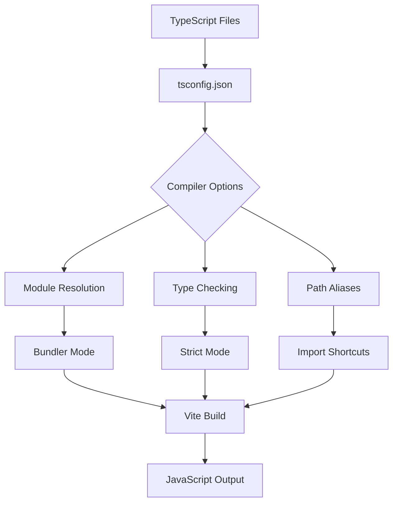
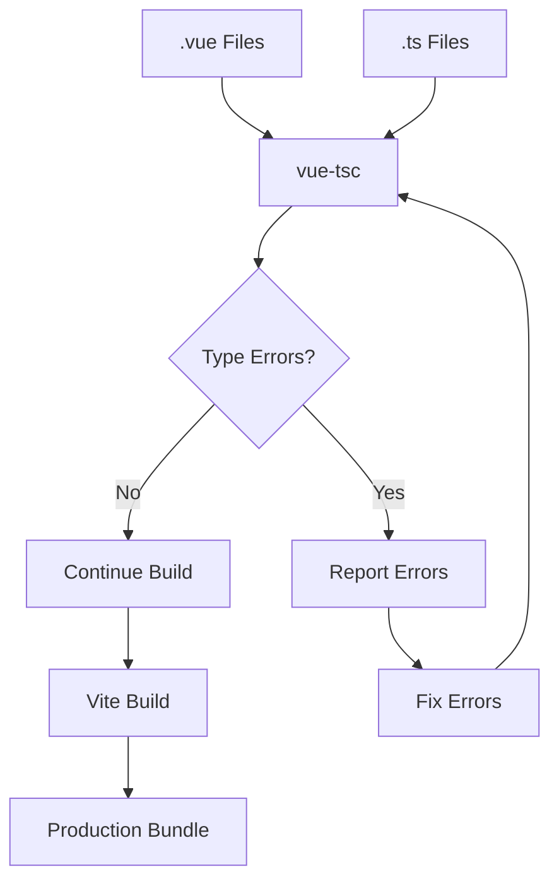

# How to Configure Vue with TypeScript

Author: [nawazdhandala](https://www.github.com/nawazdhandala)

Tags: Vue, TypeScript, Configuration, Vite, JavaScript, Frontend, Type Safety

Description: A comprehensive guide to setting up and configuring TypeScript in Vue 3 projects, including compiler options, component typing, and best practices for type-safe Vue development.

---

> TypeScript brings type safety and better developer experience to Vue applications. This guide covers complete setup, configuration, and best practices for using TypeScript with Vue 3 and the Composition API.

TypeScript integration with Vue 3 is first-class, with excellent IDE support and comprehensive type inference. Setting it up correctly from the start saves debugging time later.

---

## Project Setup Options

| Method | Best For | Command |
|--------|----------|---------|
| **create-vue** | New projects | `npm create vue@latest` |
| **Vite** | Custom setup | `npm create vite@latest` |
| **Vue CLI** | Legacy projects | `vue create` |
| **Manual** | Existing projects | Configure manually |

---

## Setting Up a New Vue TypeScript Project

### Using create-vue (Recommended)

```bash
# Create new project with TypeScript
npm create vue@latest my-vue-app

# Select options:
# - Add TypeScript? Yes
# - Add Vue Router? (optional)
# - Add Pinia? (optional)
# - Add ESLint? Yes
# - Add Prettier? Yes

cd my-vue-app
npm install
npm run dev
```

### Using Vite Directly

```bash
# Create Vite project with Vue + TypeScript template
npm create vite@latest my-vue-app -- --template vue-ts

cd my-vue-app
npm install
npm run dev
```

---

## Project Structure

```
my-vue-app/
  src/
    components/
      HelloWorld.vue
    types/
      index.ts           # Global type definitions
      api.ts             # API response types
    composables/
      useUser.ts         # Typed composables
    stores/
      user.ts            # Typed Pinia stores
    App.vue
    main.ts              # Entry point (not .js)
    vite-env.d.ts        # Vite type declarations
  tsconfig.json          # TypeScript configuration
  tsconfig.node.json     # Node-specific config
  vite.config.ts         # Vite config (TypeScript)
  package.json
```

---

## TypeScript Configuration

### tsconfig.json

```json
{
  "compilerOptions": {
    "target": "ES2020",
    "useDefineForClassFields": true,
    "module": "ESNext",
    "lib": ["ES2020", "DOM", "DOM.Iterable"],
    "skipLibCheck": true,

    "moduleResolution": "bundler",
    "allowImportingTsExtensions": true,
    "resolveJsonModule": true,
    "isolatedModules": true,
    "noEmit": true,
    "jsx": "preserve",

    "strict": true,
    "noUnusedLocals": true,
    "noUnusedParameters": true,
    "noFallthroughCasesInSwitch": true,

    "baseUrl": ".",
    "paths": {
      "@/*": ["src/*"],
      "@components/*": ["src/components/*"],
      "@composables/*": ["src/composables/*"],
      "@types/*": ["src/types/*"]
    },

    "types": ["vite/client"]
  },
  "include": ["src/**/*.ts", "src/**/*.tsx", "src/**/*.vue"],
  "references": [{ "path": "./tsconfig.node.json" }]
}
```

### tsconfig.node.json

```json
{
  "compilerOptions": {
    "composite": true,
    "skipLibCheck": true,
    "module": "ESNext",
    "moduleResolution": "bundler",
    "allowSyntheticDefaultImports": true,
    "strict": true
  },
  "include": ["vite.config.ts"]
}
```

---

## TypeScript Configuration Flow



---

## Vue Single File Component Types

### Basic Component with Script Setup

```vue
<!-- UserCard.vue -->
<script setup lang="ts">
// Importing types
import type { User } from '@/types'

// Define props with TypeScript interface
interface Props {
  user: User
  showEmail?: boolean
  maxLength?: number
}

// Props with defaults
const props = withDefaults(defineProps<Props>(), {
  showEmail: true,
  maxLength: 100
})

// Define emits with types
interface Emits {
  (e: 'select', user: User): void
  (e: 'delete', id: number): void
  (e: 'update:modelValue', value: string): void
}

const emit = defineEmits<Emits>()

// Alternative emit syntax (3.3+)
// const emit = defineEmits<{
//   select: [user: User]
//   delete: [id: number]
//   'update:modelValue': [value: string]
// }>()

// Typed refs
import { ref, computed } from 'vue'

const isExpanded = ref<boolean>(false)
const selectedItems = ref<number[]>([])

// Computed with inferred types
const displayName = computed(() => {
  return `${props.user.firstName} ${props.user.lastName}`
})

// Methods with types
const handleSelect = (): void => {
  emit('select', props.user)
}

const handleDelete = (id: number): void => {
  emit('delete', id)
}
</script>

<template>
  <div class="user-card">
    <h3>{{ displayName }}</h3>
    <p v-if="showEmail">{{ user.email }}</p>
    <button @click="handleSelect">Select</button>
    <button @click="handleDelete(user.id)">Delete</button>
  </div>
</template>
```

### Type Definitions

```typescript
// src/types/index.ts

// User types
export interface User {
  id: number
  firstName: string
  lastName: string
  email: string
  role: UserRole
  createdAt: Date
  profile?: UserProfile
}

export interface UserProfile {
  avatar?: string
  bio?: string
  location?: string
  website?: string
}

export type UserRole = 'admin' | 'user' | 'guest'

// API types
export interface ApiResponse<T> {
  data: T
  status: number
  message: string
}

export interface PaginatedResponse<T> {
  items: T[]
  total: number
  page: number
  pageSize: number
  totalPages: number
}

// Component prop types
export interface SelectOption<T = string> {
  label: string
  value: T
  disabled?: boolean
}

// Event payload types
export interface ClickEvent {
  x: number
  y: number
  target: HTMLElement
}
```

---

## Typed Composables

```typescript
// src/composables/useUser.ts
import { ref, computed, readonly } from 'vue'
import type { Ref, ComputedRef } from 'vue'
import type { User, ApiResponse } from '@/types'

interface UseUserReturn {
  user: Ref<User | null>
  loading: Ref<boolean>
  error: Ref<string | null>
  fullName: ComputedRef<string>
  fetchUser: (id: number) => Promise<void>
  updateUser: (data: Partial<User>) => Promise<void>
  clearUser: () => void
}

export function useUser(): UseUserReturn {
  const user = ref<User | null>(null)
  const loading = ref<boolean>(false)
  const error = ref<string | null>(null)

  const fullName = computed<string>(() => {
    if (!user.value) return ''
    return `${user.value.firstName} ${user.value.lastName}`
  })

  const fetchUser = async (id: number): Promise<void> => {
    loading.value = true
    error.value = null

    try {
      const response = await fetch(`/api/users/${id}`)
      const result: ApiResponse<User> = await response.json()
      user.value = result.data
    } catch (e) {
      error.value = e instanceof Error ? e.message : 'Unknown error'
    } finally {
      loading.value = false
    }
  }

  const updateUser = async (data: Partial<User>): Promise<void> => {
    if (!user.value) return

    loading.value = true
    error.value = null

    try {
      const response = await fetch(`/api/users/${user.value.id}`, {
        method: 'PATCH',
        headers: { 'Content-Type': 'application/json' },
        body: JSON.stringify(data)
      })
      const result: ApiResponse<User> = await response.json()
      user.value = result.data
    } catch (e) {
      error.value = e instanceof Error ? e.message : 'Unknown error'
    } finally {
      loading.value = false
    }
  }

  const clearUser = (): void => {
    user.value = null
    error.value = null
  }

  return {
    user: readonly(user) as Ref<User | null>,
    loading: readonly(loading),
    error: readonly(error),
    fullName,
    fetchUser,
    updateUser,
    clearUser
  }
}
```

### Using Typed Composables

```vue
<script setup lang="ts">
import { onMounted } from 'vue'
import { useUser } from '@/composables/useUser'

const { user, loading, error, fullName, fetchUser } = useUser()

onMounted(() => {
  fetchUser(1)
})
</script>

<template>
  <div>
    <p v-if="loading">Loading...</p>
    <p v-else-if="error">Error: {{ error }}</p>
    <div v-else-if="user">
      <h2>{{ fullName }}</h2>
      <p>{{ user.email }}</p>
    </div>
  </div>
</template>
```

---

## Typed Pinia Stores

```typescript
// src/stores/user.ts
import { defineStore } from 'pinia'
import { ref, computed } from 'vue'
import type { User } from '@/types'

export const useUserStore = defineStore('user', () => {
  // State
  const currentUser = ref<User | null>(null)
  const users = ref<User[]>([])
  const loading = ref<boolean>(false)

  // Getters
  const isAuthenticated = computed<boolean>(() => {
    return currentUser.value !== null
  })

  const userById = computed(() => {
    return (id: number): User | undefined => {
      return users.value.find(u => u.id === id)
    }
  })

  const adminUsers = computed<User[]>(() => {
    return users.value.filter(u => u.role === 'admin')
  })

  // Actions
  async function login(email: string, password: string): Promise<boolean> {
    loading.value = true

    try {
      const response = await fetch('/api/auth/login', {
        method: 'POST',
        headers: { 'Content-Type': 'application/json' },
        body: JSON.stringify({ email, password })
      })

      if (!response.ok) {
        return false
      }

      const data = await response.json()
      currentUser.value = data.user
      return true
    } catch {
      return false
    } finally {
      loading.value = false
    }
  }

  function logout(): void {
    currentUser.value = null
  }

  async function fetchUsers(): Promise<void> {
    loading.value = true

    try {
      const response = await fetch('/api/users')
      const data = await response.json()
      users.value = data.users
    } finally {
      loading.value = false
    }
  }

  return {
    // State
    currentUser,
    users,
    loading,
    // Getters
    isAuthenticated,
    userById,
    adminUsers,
    // Actions
    login,
    logout,
    fetchUsers
  }
})

// Type for store instance
export type UserStore = ReturnType<typeof useUserStore>
```

---

## Vue Router with TypeScript

```typescript
// src/router/index.ts
import { createRouter, createWebHistory } from 'vue-router'
import type { RouteRecordRaw, NavigationGuardNext, RouteLocationNormalized } from 'vue-router'

// Define route meta types
declare module 'vue-router' {
  interface RouteMeta {
    requiresAuth?: boolean
    roles?: string[]
    title?: string
  }
}

const routes: RouteRecordRaw[] = [
  {
    path: '/',
    name: 'Home',
    component: () => import('@/views/Home.vue'),
    meta: {
      title: 'Home'
    }
  },
  {
    path: '/dashboard',
    name: 'Dashboard',
    component: () => import('@/views/Dashboard.vue'),
    meta: {
      requiresAuth: true,
      roles: ['admin', 'user'],
      title: 'Dashboard'
    }
  },
  {
    path: '/users/:id',
    name: 'UserDetail',
    component: () => import('@/views/UserDetail.vue'),
    props: true,
    meta: {
      requiresAuth: true,
      title: 'User Details'
    }
  }
]

const router = createRouter({
  history: createWebHistory(import.meta.env.BASE_URL),
  routes
})

// Typed navigation guard
router.beforeEach((
  to: RouteLocationNormalized,
  from: RouteLocationNormalized,
  next: NavigationGuardNext
) => {
  // Update document title
  document.title = to.meta.title || 'My App'

  // Check authentication
  if (to.meta.requiresAuth) {
    const isAuthenticated = checkAuth()
    if (!isAuthenticated) {
      next({ name: 'Login', query: { redirect: to.fullPath } })
      return
    }
  }

  next()
})

function checkAuth(): boolean {
  // Implement auth check
  return true
}

export default router
```

### Typed Route Parameters

```vue
<!-- UserDetail.vue -->
<script setup lang="ts">
import { useRoute, useRouter } from 'vue-router'
import { computed } from 'vue'

const route = useRoute()
const router = useRouter()

// Type the route params
const userId = computed<number>(() => {
  return Number(route.params.id)
})

// Typed navigation
const goToUser = (id: number): void => {
  router.push({
    name: 'UserDetail',
    params: { id: id.toString() }
  })
}

// With query params
interface SearchQuery {
  q?: string
  page?: string
  sort?: 'asc' | 'desc'
}

const searchQuery = computed<SearchQuery>(() => {
  return route.query as SearchQuery
})
</script>
```

---

## Component Type Patterns

### Generic Components

```vue
<!-- GenericList.vue -->
<script setup lang="ts" generic="T extends { id: number }">
import { computed } from 'vue'

interface Props {
  items: T[]
  keyField?: keyof T
}

const props = withDefaults(defineProps<Props>(), {
  keyField: 'id' as keyof T
})

const emit = defineEmits<{
  select: [item: T]
  delete: [id: number]
}>()

const sortedItems = computed(() => {
  return [...props.items].sort((a, b) => a.id - b.id)
})
</script>

<template>
  <ul>
    <li
      v-for="item in sortedItems"
      :key="String(item[keyField])"
      @click="emit('select', item)"
    >
      <slot :item="item">
        {{ item }}
      </slot>
    </li>
  </ul>
</template>
```

### Expose with Types

```vue
<!-- FormInput.vue -->
<script setup lang="ts">
import { ref } from 'vue'

const inputRef = ref<HTMLInputElement | null>(null)
const internalValue = ref<string>('')

// Define what we expose
interface FormInputExpose {
  focus: () => void
  clear: () => void
  getValue: () => string
}

const focus = (): void => {
  inputRef.value?.focus()
}

const clear = (): void => {
  internalValue.value = ''
}

const getValue = (): string => {
  return internalValue.value
}

defineExpose<FormInputExpose>({
  focus,
  clear,
  getValue
})
</script>
```

### Using Exposed Methods

```vue
<script setup lang="ts">
import { ref } from 'vue'
import FormInput from './FormInput.vue'

// Type the component ref
const inputRef = ref<InstanceType<typeof FormInput> | null>(null)

const handleSubmit = (): void => {
  const value = inputRef.value?.getValue()
  console.log('Value:', value)
  inputRef.value?.clear()
}
</script>

<template>
  <FormInput ref="inputRef" />
  <button @click="handleSubmit">Submit</button>
</template>
```

---

## Vite Configuration

```typescript
// vite.config.ts
import { defineConfig } from 'vite'
import vue from '@vitejs/plugin-vue'
import { fileURLToPath, URL } from 'node:url'

export default defineConfig({
  plugins: [
    vue({
      script: {
        defineModel: true,
        propsDestructure: true
      }
    })
  ],
  resolve: {
    alias: {
      '@': fileURLToPath(new URL('./src', import.meta.url)),
      '@components': fileURLToPath(new URL('./src/components', import.meta.url)),
      '@composables': fileURLToPath(new URL('./src/composables', import.meta.url)),
      '@stores': fileURLToPath(new URL('./src/stores', import.meta.url)),
      '@types': fileURLToPath(new URL('./src/types', import.meta.url))
    }
  },
  server: {
    port: 3000
  },
  build: {
    target: 'ES2020'
  }
})
```

---

## Type Declarations for Vue

```typescript
// src/vite-env.d.ts
/// <reference types="vite/client" />

// Declare .vue files as modules
declare module '*.vue' {
  import type { DefineComponent } from 'vue'
  const component: DefineComponent<{}, {}, any>
  export default component
}

// Environment variables
interface ImportMetaEnv {
  readonly VITE_API_URL: string
  readonly VITE_APP_TITLE: string
  readonly VITE_ENABLE_ANALYTICS: string
}

interface ImportMeta {
  readonly env: ImportMetaEnv
}
```

```typescript
// src/types/global.d.ts

// Global component types (for auto-imported components)
declare module 'vue' {
  export interface GlobalComponents {
    BaseButton: typeof import('@/components/BaseButton.vue')['default']
    BaseInput: typeof import('@/components/BaseInput.vue')['default']
    BaseModal: typeof import('@/components/BaseModal.vue')['default']
  }
}

// Extend window object
declare global {
  interface Window {
    __APP_VERSION__: string
    analytics?: {
      track: (event: string, data?: Record<string, unknown>) => void
    }
  }
}

export {}
```

---

## Type Checking Flow



---

## ESLint Configuration

```javascript
// .eslintrc.cjs
module.exports = {
  root: true,
  env: {
    browser: true,
    es2021: true,
    node: true
  },
  extends: [
    'eslint:recommended',
    'plugin:vue/vue3-recommended',
    '@vue/eslint-config-typescript',
    '@vue/eslint-config-prettier'
  ],
  parserOptions: {
    ecmaVersion: 'latest',
    parser: '@typescript-eslint/parser',
    sourceType: 'module'
  },
  rules: {
    // TypeScript specific rules
    '@typescript-eslint/no-unused-vars': ['error', { argsIgnorePattern: '^_' }],
    '@typescript-eslint/explicit-function-return-type': 'warn',
    '@typescript-eslint/no-explicit-any': 'warn',

    // Vue specific rules
    'vue/multi-word-component-names': 'off',
    'vue/define-macros-order': ['error', {
      order: ['defineProps', 'defineEmits']
    }]
  }
}
```

---

## Best Practices

| Practice | Description |
|----------|-------------|
| **Use strict mode** | Enable all strict checks in tsconfig |
| **Define interfaces** | Create types for all props and emits |
| **Type composables** | Add return type annotations |
| **Use generics** | Create reusable typed components |
| **Avoid any** | Use unknown or proper types instead |
| **Type guards** | Use type narrowing for safety |

---

## Conclusion

TypeScript with Vue 3 provides excellent type safety and developer experience. Key takeaways:

- Use `create-vue` for new projects with TypeScript
- Configure strict mode in tsconfig.json for maximum type safety
- Define interfaces for all component props and emits
- Type your composables with explicit return types
- Use generic components for reusable typed patterns
- Configure proper IDE support with vue-tsc

These practices will help you build maintainable, type-safe Vue applications.

---

*Building Vue TypeScript applications that need monitoring? [OneUptime](https://oneuptime.com) provides comprehensive frontend and backend monitoring with full TypeScript support.*

**Related Reading:**
- [How to Fix "Component Not Registered" Errors in Vue](https://oneuptime.com/blog/post/2026-01-24-vue-component-not-registered-errors/view)
- [How to Handle Vue Composition API Migration](https://oneuptime.com/blog/post/2026-01-24-vue-composition-api-migration/view)
