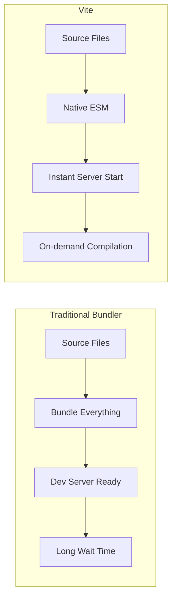
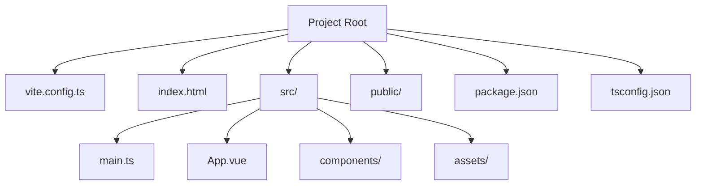
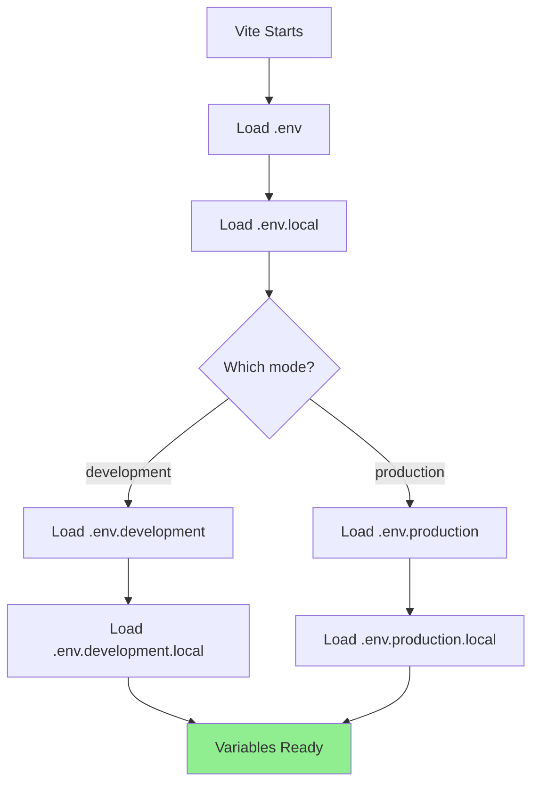
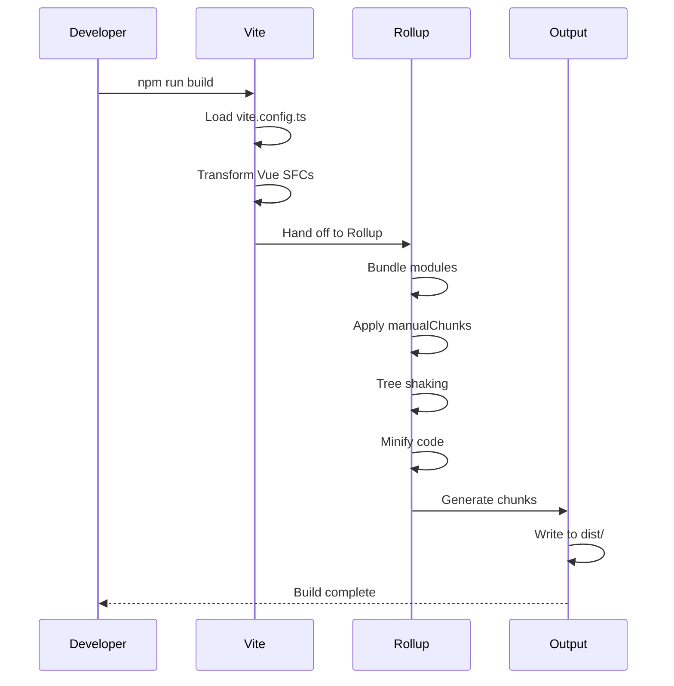
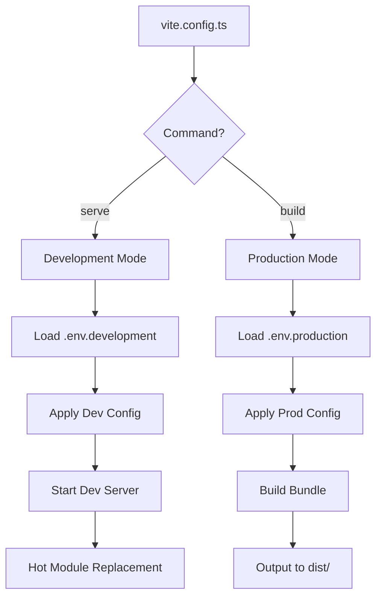

# How to Configure Vue with Vite

Author: [nawazdhandala](https://www.github.com/nawazdhandala)

Tags: Vue, Vite, Configuration, Build Tool, TypeScript, Development, HMR

Description: A comprehensive guide to configuring Vite for Vue 3 projects including plugins, aliases, environment variables, and production optimization.

---

Vite has become the standard build tool for Vue applications, offering lightning-fast development experience and optimized production builds. In this guide, we will explore how to configure Vite for Vue projects from basic setup to advanced optimizations.

## Why Vite for Vue?

Vite was created by Evan You, the creator of Vue, specifically to address the slow development server startup and hot module replacement (HMR) issues with traditional bundlers.



## Creating a New Vue + Vite Project

Start with the official scaffolding tool:

```bash
# Using npm
npm create vite@latest my-vue-app -- --template vue-ts

# Using yarn
yarn create vite my-vue-app --template vue-ts

# Using pnpm
pnpm create vite my-vue-app --template vue-ts

# Navigate to project
cd my-vue-app

# Install dependencies
npm install

# Start development server
npm run dev
```

## Basic Configuration

The main configuration file is `vite.config.ts`:

```typescript
// vite.config.ts
import { defineConfig } from 'vite';
import vue from '@vitejs/plugin-vue';

export default defineConfig({
    plugins: [vue()]
});
```

## Project Structure



## Path Aliases Configuration

Configure path aliases for cleaner imports:

```typescript
// vite.config.ts
import { defineConfig } from 'vite';
import vue from '@vitejs/plugin-vue';
import { fileURLToPath, URL } from 'node:url';

export default defineConfig({
    plugins: [vue()],
    resolve: {
        alias: {
            // @ points to src directory
            '@': fileURLToPath(new URL('./src', import.meta.url)),

            // Additional aliases
            '@components': fileURLToPath(new URL('./src/components', import.meta.url)),
            '@views': fileURLToPath(new URL('./src/views', import.meta.url)),
            '@stores': fileURLToPath(new URL('./src/stores', import.meta.url)),
            '@utils': fileURLToPath(new URL('./src/utils', import.meta.url)),
            '@assets': fileURLToPath(new URL('./src/assets', import.meta.url)),
            '@composables': fileURLToPath(new URL('./src/composables', import.meta.url))
        }
    }
});
```

Update TypeScript configuration to recognize aliases:

```json
{
    "compilerOptions": {
        "baseUrl": ".",
        "paths": {
            "@/*": ["src/*"],
            "@components/*": ["src/components/*"],
            "@views/*": ["src/views/*"],
            "@stores/*": ["src/stores/*"],
            "@utils/*": ["src/utils/*"],
            "@assets/*": ["src/assets/*"],
            "@composables/*": ["src/composables/*"]
        }
    }
}
```

## Environment Variables

Vite uses `.env` files for environment configuration:

```bash
# .env - loaded in all cases
VITE_APP_TITLE=My Vue App

# .env.local - loaded in all cases, ignored by git
VITE_API_SECRET=local_secret

# .env.development - only loaded in development
VITE_API_URL=http://localhost:3000/api

# .env.production - only loaded in production
VITE_API_URL=https://api.example.com
```

Access environment variables in your code:

```typescript
// src/config/index.ts
export const config = {
    apiUrl: import.meta.env.VITE_API_URL,
    appTitle: import.meta.env.VITE_APP_TITLE,
    isDev: import.meta.env.DEV,
    isProd: import.meta.env.PROD,
    mode: import.meta.env.MODE
};

// Usage in components
console.log(config.apiUrl);
```

Add TypeScript types for environment variables:

```typescript
// src/env.d.ts
/// <reference types="vite/client" />

interface ImportMetaEnv {
    readonly VITE_API_URL: string;
    readonly VITE_APP_TITLE: string;
    // Add more env variables here
}

interface ImportMeta {
    readonly env: ImportMetaEnv;
}
```

## Environment Loading Order



## Server Configuration

Configure the development server:

```typescript
// vite.config.ts
import { defineConfig } from 'vite';
import vue from '@vitejs/plugin-vue';

export default defineConfig({
    plugins: [vue()],
    server: {
        // Port to run dev server
        port: 3000,

        // Automatically open browser
        open: true,

        // Enable CORS
        cors: true,

        // Configure proxy for API requests
        proxy: {
            '/api': {
                target: 'http://localhost:8080',
                changeOrigin: true,
                rewrite: (path) => path.replace(/^\/api/, '')
            },
            '/socket.io': {
                target: 'ws://localhost:8080',
                ws: true
            }
        },

        // HTTPS configuration
        https: false,

        // Host configuration for network access
        host: true
    }
});
```

## Build Configuration

Optimize production builds:

```typescript
// vite.config.ts
import { defineConfig } from 'vite';
import vue from '@vitejs/plugin-vue';

export default defineConfig({
    plugins: [vue()],
    build: {
        // Output directory
        outDir: 'dist',

        // Assets directory inside outDir
        assetsDir: 'assets',

        // Generate sourcemaps for production
        sourcemap: true,

        // Minification options
        minify: 'terser',
        terserOptions: {
            compress: {
                // Remove console.log in production
                drop_console: true,
                drop_debugger: true
            }
        },

        // Rollup options
        rollupOptions: {
            output: {
                // Manual chunk splitting
                manualChunks: {
                    // Vendor chunks
                    'vue-vendor': ['vue', 'vue-router', 'pinia'],
                    'ui-vendor': ['element-plus'],
                    'utils': ['lodash-es', 'axios', 'dayjs']
                },

                // Asset file naming
                assetFileNames: (assetInfo) => {
                    const info = assetInfo.name?.split('.') || [];
                    const ext = info[info.length - 1];
                    if (/png|jpe?g|svg|gif|tiff|bmp|ico/i.test(ext)) {
                        return `assets/images/[name]-[hash][extname]`;
                    }
                    if (/woff2?|eot|ttf|otf/i.test(ext)) {
                        return `assets/fonts/[name]-[hash][extname]`;
                    }
                    return `assets/[name]-[hash][extname]`;
                },

                // Chunk file naming
                chunkFileNames: 'assets/js/[name]-[hash].js',

                // Entry file naming
                entryFileNames: 'assets/js/[name]-[hash].js'
            }
        },

        // Chunk size warning limit
        chunkSizeWarningLimit: 500,

        // CSS code splitting
        cssCodeSplit: true
    }
});
```

## Build Process Flow



## Essential Plugins

### Vue JSX Support

```bash
npm install -D @vitejs/plugin-vue-jsx
```

```typescript
// vite.config.ts
import { defineConfig } from 'vite';
import vue from '@vitejs/plugin-vue';
import vueJsx from '@vitejs/plugin-vue-jsx';

export default defineConfig({
    plugins: [
        vue(),
        vueJsx()
    ]
});
```

### Auto Import Components

```bash
npm install -D unplugin-vue-components unplugin-auto-import
```

```typescript
// vite.config.ts
import { defineConfig } from 'vite';
import vue from '@vitejs/plugin-vue';
import Components from 'unplugin-vue-components/vite';
import AutoImport from 'unplugin-auto-import/vite';
import { ElementPlusResolver } from 'unplugin-vue-components/resolvers';

export default defineConfig({
    plugins: [
        vue(),

        // Auto import Vue APIs
        AutoImport({
            imports: [
                'vue',
                'vue-router',
                'pinia',
                {
                    '@vueuse/core': [
                        'useMouse',
                        'useLocalStorage'
                    ]
                }
            ],
            dts: 'src/auto-imports.d.ts',
            resolvers: [ElementPlusResolver()],
            eslintrc: {
                enabled: true
            }
        }),

        // Auto import components
        Components({
            dirs: ['src/components'],
            extensions: ['vue'],
            deep: true,
            dts: 'src/components.d.ts',
            resolvers: [ElementPlusResolver()]
        })
    ]
});
```

### SVG Icons

```bash
npm install -D vite-plugin-svg-icons
```

```typescript
// vite.config.ts
import { defineConfig } from 'vite';
import vue from '@vitejs/plugin-vue';
import { createSvgIconsPlugin } from 'vite-plugin-svg-icons';
import path from 'path';

export default defineConfig({
    plugins: [
        vue(),
        createSvgIconsPlugin({
            iconDirs: [path.resolve(process.cwd(), 'src/assets/icons')],
            symbolId: 'icon-[dir]-[name]'
        })
    ]
});
```

## CSS Configuration

Configure CSS preprocessing and modules:

```typescript
// vite.config.ts
import { defineConfig } from 'vite';
import vue from '@vitejs/plugin-vue';

export default defineConfig({
    plugins: [vue()],
    css: {
        // CSS Modules configuration
        modules: {
            localsConvention: 'camelCase',
            scopeBehaviour: 'local',
            generateScopedName: '[name]__[local]___[hash:base64:5]'
        },

        // Preprocessor options
        preprocessorOptions: {
            scss: {
                // Global SCSS imports
                additionalData: `
                    @import "@/styles/variables.scss";
                    @import "@/styles/mixins.scss";
                `
            },
            less: {
                // Less options
                javascriptEnabled: true
            }
        },

        // PostCSS configuration
        postcss: {
            plugins: [
                require('autoprefixer'),
                require('postcss-preset-env')({
                    stage: 3,
                    features: {
                        'nesting-rules': true
                    }
                })
            ]
        },

        // Dev sourcemaps
        devSourcemap: true
    }
});
```

## Complete Configuration Example

Here is a comprehensive configuration combining all features:

```typescript
// vite.config.ts
import { defineConfig, loadEnv } from 'vite';
import vue from '@vitejs/plugin-vue';
import vueJsx from '@vitejs/plugin-vue-jsx';
import Components from 'unplugin-vue-components/vite';
import AutoImport from 'unplugin-auto-import/vite';
import { ElementPlusResolver } from 'unplugin-vue-components/resolvers';
import { createSvgIconsPlugin } from 'vite-plugin-svg-icons';
import { fileURLToPath, URL } from 'node:url';
import path from 'path';

export default defineConfig(({ command, mode }) => {
    // Load env file based on mode
    const env = loadEnv(mode, process.cwd(), '');

    const isDev = command === 'serve';
    const isProd = command === 'build';

    return {
        // Base public path
        base: env.VITE_BASE_URL || '/',

        plugins: [
            vue({
                script: {
                    defineModel: true,
                    propsDestructure: true
                }
            }),

            vueJsx(),

            AutoImport({
                imports: ['vue', 'vue-router', 'pinia'],
                dts: 'src/auto-imports.d.ts',
                resolvers: [ElementPlusResolver()],
                eslintrc: {
                    enabled: true
                }
            }),

            Components({
                dirs: ['src/components'],
                dts: 'src/components.d.ts',
                resolvers: [ElementPlusResolver()]
            }),

            createSvgIconsPlugin({
                iconDirs: [path.resolve(process.cwd(), 'src/assets/icons')],
                symbolId: 'icon-[dir]-[name]'
            })
        ],

        resolve: {
            alias: {
                '@': fileURLToPath(new URL('./src', import.meta.url)),
                '@components': fileURLToPath(new URL('./src/components', import.meta.url)),
                '@views': fileURLToPath(new URL('./src/views', import.meta.url)),
                '@stores': fileURLToPath(new URL('./src/stores', import.meta.url)),
                '@utils': fileURLToPath(new URL('./src/utils', import.meta.url)),
                '@assets': fileURLToPath(new URL('./src/assets', import.meta.url)),
                '@composables': fileURLToPath(new URL('./src/composables', import.meta.url))
            }
        },

        server: {
            port: 3000,
            open: true,
            cors: true,
            proxy: {
                '/api': {
                    target: env.VITE_API_TARGET || 'http://localhost:8080',
                    changeOrigin: true,
                    rewrite: (path) => path.replace(/^\/api/, '')
                }
            }
        },

        build: {
            outDir: 'dist',
            sourcemap: isDev,
            minify: 'terser',
            terserOptions: {
                compress: {
                    drop_console: isProd,
                    drop_debugger: isProd
                }
            },
            rollupOptions: {
                output: {
                    manualChunks: {
                        'vue-vendor': ['vue', 'vue-router', 'pinia'],
                        'element-plus': ['element-plus']
                    },
                    chunkFileNames: 'assets/js/[name]-[hash].js',
                    entryFileNames: 'assets/js/[name]-[hash].js',
                    assetFileNames: 'assets/[ext]/[name]-[hash][extname]'
                }
            },
            chunkSizeWarningLimit: 500
        },

        css: {
            modules: {
                localsConvention: 'camelCase'
            },
            preprocessorOptions: {
                scss: {
                    additionalData: `@import "@/styles/variables.scss";`
                }
            },
            devSourcemap: true
        },

        // Optimization
        optimizeDeps: {
            include: ['vue', 'vue-router', 'pinia', 'axios'],
            exclude: ['vue-demi']
        },

        // Define global constants
        define: {
            __APP_VERSION__: JSON.stringify(process.env.npm_package_version)
        }
    };
});
```

## Configuration Flow



## Debugging Configuration

Add these scripts to package.json for debugging:

```json
{
    "scripts": {
        "dev": "vite",
        "build": "vue-tsc && vite build",
        "preview": "vite preview",
        "build:analyze": "vite build --mode analyze",
        "build:report": "cross-env ANALYZE=true vite build"
    }
}
```

For bundle analysis:

```typescript
// vite.config.ts
import { defineConfig } from 'vite';
import vue from '@vitejs/plugin-vue';
import { visualizer } from 'rollup-plugin-visualizer';

export default defineConfig(({ mode }) => ({
    plugins: [
        vue(),
        mode === 'analyze' && visualizer({
            open: true,
            filename: 'dist/stats.html',
            gzipSize: true,
            brotliSize: true
        })
    ].filter(Boolean)
}));
```

## Performance Tips

1. **Use dynamic imports** for route-level code splitting
2. **Configure manualChunks** to separate vendor code
3. **Enable CSS code splitting** for better caching
4. **Use optimizeDeps.include** for heavy dependencies
5. **Remove console logs** in production builds
6. **Enable gzip/brotli compression** on your server

## Conclusion

Vite provides an excellent development experience for Vue applications with its fast startup times and intuitive configuration. By understanding and properly configuring the various options available, you can optimize both your development workflow and production builds. The configuration examples in this guide provide a solid foundation that you can customize based on your project requirements.
