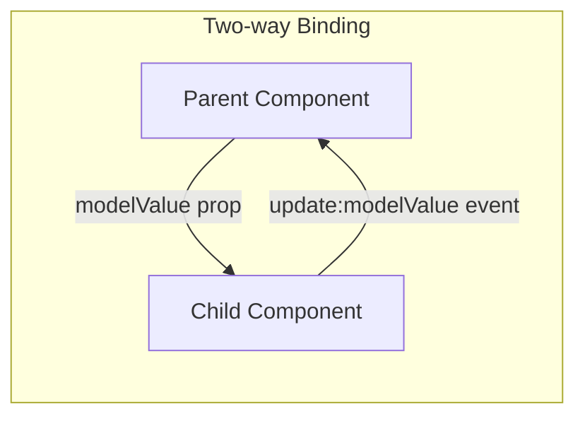
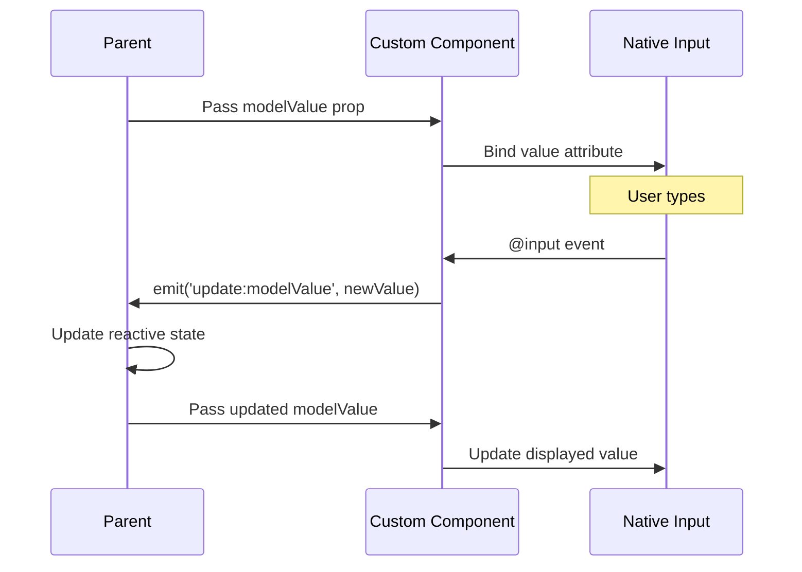
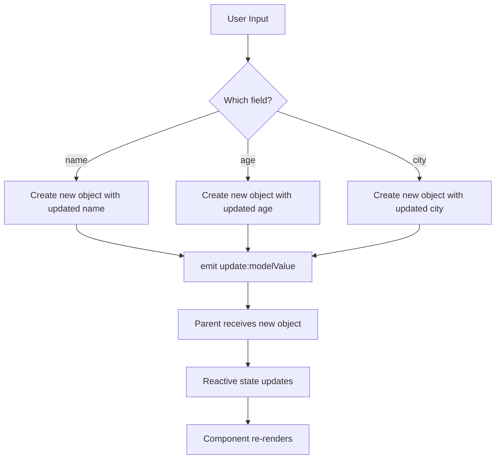
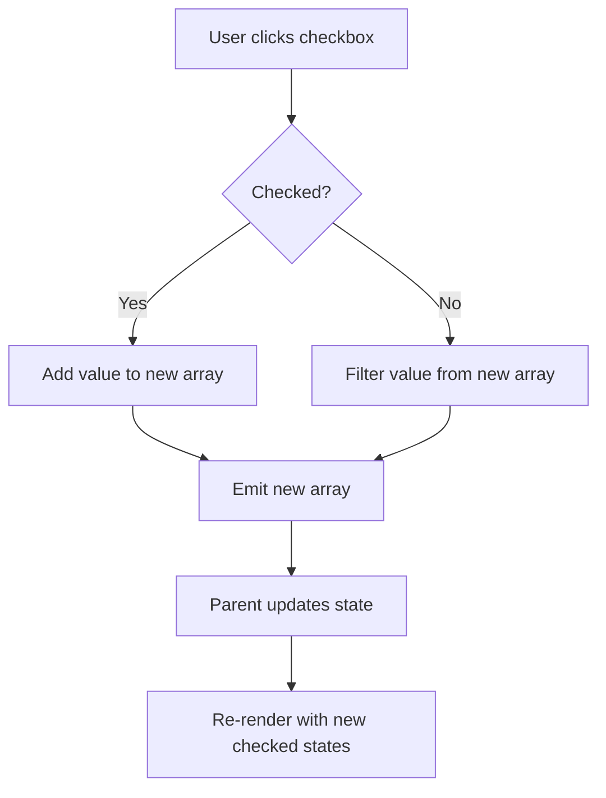
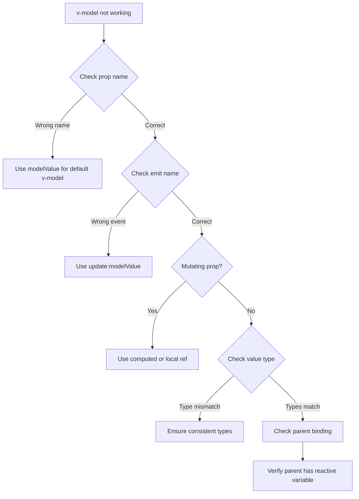

# How to Fix 'v-model' Issues with Custom Components

Author: [nawazdhandala](https://www.github.com/nawazdhandala)

Tags: Vue, v-model, Custom Components, Two-way Binding, Props, Events, TypeScript

Description: A practical guide to implementing and troubleshooting v-model in Vue 3 custom components with examples and common pitfalls.

---

The v-model directive provides two-way data binding in Vue, but implementing it correctly in custom components can be challenging. In this guide, we will explore how v-model works, common issues developers encounter, and how to fix them.

## Understanding v-model in Vue 3

In Vue 3, v-model underwent significant changes from Vue 2. Understanding the new syntax is crucial for proper implementation.



## Basic v-model Implementation

Here is how v-model translates to props and events:

```vue
<!-- Using v-model on a custom component -->
<CustomInput v-model="searchText" />

<!-- Is equivalent to -->
<CustomInput
    :modelValue="searchText"
    @update:modelValue="newValue => searchText = newValue"
/>
```

### Implementing v-model in a Custom Component

```vue
<!-- src/components/CustomInput.vue -->
<template>
    <input
        :value="modelValue"
        @input="$emit('update:modelValue', $event.target.value)"
        class="custom-input"
    />
</template>

<script setup lang="ts">
// Define props with the modelValue name
defineProps<{
    modelValue: string;
}>();

// Define emits for the update event
defineEmits<{
    (e: 'update:modelValue', value: string): void;
}>();
</script>
```

## Common Issue 1: Mutating Props Directly

One of the most common mistakes is trying to mutate the prop directly:

```vue
<!-- WRONG: Mutating props directly -->
<template>
    <input v-model="modelValue" />
</template>

<script setup>
// This will cause a Vue warning:
// "Avoid mutating a prop directly"
defineProps(['modelValue']);
</script>
```

### The Fix: Use a Computed Property with Getter/Setter

```vue
<!-- src/components/CustomInput.vue -->
<template>
    <input v-model="internalValue" class="custom-input" />
</template>

<script setup lang="ts">
import { computed } from 'vue';

const props = defineProps<{
    modelValue: string;
}>();

const emit = defineEmits<{
    (e: 'update:modelValue', value: string): void;
}>();

// Create a computed property with getter and setter
const internalValue = computed({
    get() {
        return props.modelValue;
    },
    set(value: string) {
        emit('update:modelValue', value);
    }
});
</script>
```

## v-model Data Flow



## Common Issue 2: Named v-model Arguments

Sometimes you need multiple v-model bindings on a single component. The syntax changed from Vue 2 to Vue 3.

```vue
<!-- Parent component using multiple v-models -->
<template>
    <UserForm
        v-model:firstName="user.firstName"
        v-model:lastName="user.lastName"
        v-model:email="user.email"
    />
</template>

<script setup lang="ts">
import { reactive } from 'vue';

const user = reactive({
    firstName: '',
    lastName: '',
    email: ''
});
</script>
```

### Implementing Multiple v-model Arguments

```vue
<!-- src/components/UserForm.vue -->
<template>
    <form class="user-form">
        <div class="form-group">
            <label>First Name</label>
            <input
                :value="firstName"
                @input="$emit('update:firstName', ($event.target as HTMLInputElement).value)"
            />
        </div>

        <div class="form-group">
            <label>Last Name</label>
            <input
                :value="lastName"
                @input="$emit('update:lastName', ($event.target as HTMLInputElement).value)"
            />
        </div>

        <div class="form-group">
            <label>Email</label>
            <input
                type="email"
                :value="email"
                @input="$emit('update:email', ($event.target as HTMLInputElement).value)"
            />
        </div>
    </form>
</template>

<script setup lang="ts">
// Each v-model argument becomes a separate prop
defineProps<{
    firstName: string;
    lastName: string;
    email: string;
}>();

// Each needs its own update event
defineEmits<{
    (e: 'update:firstName', value: string): void;
    (e: 'update:lastName', value: string): void;
    (e: 'update:email', value: string): void;
}>();
</script>
```

## Common Issue 3: v-model with Objects

When binding objects, you need to be careful about how you emit updates:

```vue
<!-- WRONG: Emitting mutated object reference -->
<template>
    <div>
        <input
            :value="modelValue.name"
            @input="modelValue.name = $event.target.value"
        />
    </div>
</template>

<script setup>
defineProps(['modelValue']);
</script>
```

### The Fix: Emit a New Object

```vue
<!-- src/components/PersonEditor.vue -->
<template>
    <div class="person-editor">
        <div class="form-group">
            <label>Name</label>
            <input
                :value="modelValue.name"
                @input="updateField('name', ($event.target as HTMLInputElement).value)"
            />
        </div>

        <div class="form-group">
            <label>Age</label>
            <input
                type="number"
                :value="modelValue.age"
                @input="updateField('age', parseInt(($event.target as HTMLInputElement).value))"
            />
        </div>

        <div class="form-group">
            <label>City</label>
            <input
                :value="modelValue.city"
                @input="updateField('city', ($event.target as HTMLInputElement).value)"
            />
        </div>
    </div>
</template>

<script setup lang="ts">
interface Person {
    name: string;
    age: number;
    city: string;
}

const props = defineProps<{
    modelValue: Person;
}>();

const emit = defineEmits<{
    (e: 'update:modelValue', value: Person): void;
}>();

// Emit a new object with the updated field
function updateField<K extends keyof Person>(field: K, value: Person[K]) {
    emit('update:modelValue', {
        ...props.modelValue,
        [field]: value
    });
}
</script>
```

## Object Binding Flow



## Common Issue 4: v-model Modifiers

Vue 3 allows custom modifiers on v-model. If not handled correctly, they will not work:

```vue
<!-- Using built-in and custom modifiers -->
<CustomInput v-model.trim.capitalize="text" />
```

### Implementing Custom Modifiers

```vue
<!-- src/components/CustomInput.vue -->
<template>
    <input
        :value="modelValue"
        @input="handleInput"
        class="custom-input"
    />
</template>

<script setup lang="ts">
const props = defineProps<{
    modelValue: string;
    modelModifiers?: {
        capitalize?: boolean;
        uppercase?: boolean;
        lowercase?: boolean;
    };
}>();

const emit = defineEmits<{
    (e: 'update:modelValue', value: string): void;
}>();

function handleInput(event: Event) {
    const target = event.target as HTMLInputElement;
    let value = target.value;

    // Apply modifiers
    if (props.modelModifiers?.capitalize) {
        value = value.charAt(0).toUpperCase() + value.slice(1);
    }

    if (props.modelModifiers?.uppercase) {
        value = value.toUpperCase();
    }

    if (props.modelModifiers?.lowercase) {
        value = value.toLowerCase();
    }

    emit('update:modelValue', value);
}
</script>
```

### Modifiers with Named v-model

```vue
<!-- Parent using named v-model with modifiers -->
<UserForm v-model:firstName.capitalize="user.firstName" />
```

```vue
<!-- src/components/UserForm.vue -->
<script setup lang="ts">
// For named v-model, modifier prop follows this pattern:
// v-model:firstName.capitalize -> firstNameModifiers
const props = defineProps<{
    firstName: string;
    firstNameModifiers?: {
        capitalize?: boolean;
    };
}>();
</script>
```

## Common Issue 5: v-model with Select Elements

Select elements require special handling:

```vue
<!-- src/components/CustomSelect.vue -->
<template>
    <select
        :value="modelValue"
        @change="$emit('update:modelValue', ($event.target as HTMLSelectElement).value)"
        class="custom-select"
    >
        <option
            v-for="option in options"
            :key="option.value"
            :value="option.value"
        >
            {{ option.label }}
        </option>
    </select>
</template>

<script setup lang="ts">
interface Option {
    value: string | number;
    label: string;
}

defineProps<{
    modelValue: string | number;
    options: Option[];
}>();

defineEmits<{
    (e: 'update:modelValue', value: string): void;
}>();
</script>
```

## Common Issue 6: v-model with Checkbox Groups

Checkboxes bound to arrays need careful implementation:

```vue
<!-- src/components/CheckboxGroup.vue -->
<template>
    <div class="checkbox-group">
        <label
            v-for="option in options"
            :key="option.value"
            class="checkbox-label"
        >
            <input
                type="checkbox"
                :value="option.value"
                :checked="modelValue.includes(option.value)"
                @change="handleChange(option.value, ($event.target as HTMLInputElement).checked)"
            />
            {{ option.label }}
        </label>
    </div>
</template>

<script setup lang="ts">
interface Option {
    value: string;
    label: string;
}

const props = defineProps<{
    modelValue: string[];
    options: Option[];
}>();

const emit = defineEmits<{
    (e: 'update:modelValue', value: string[]): void;
}>();

function handleChange(value: string, checked: boolean) {
    // Create a new array to avoid mutating the prop
    let newValue: string[];

    if (checked) {
        // Add the value if checked
        newValue = [...props.modelValue, value];
    } else {
        // Remove the value if unchecked
        newValue = props.modelValue.filter(v => v !== value);
    }

    emit('update:modelValue', newValue);
}
</script>
```

## Checkbox Array Flow



## Common Issue 7: Async Validation with v-model

When you need to validate before emitting:

```vue
<!-- src/components/ValidatedInput.vue -->
<template>
    <div class="validated-input">
        <input
            :value="displayValue"
            @input="handleInput"
            @blur="handleBlur"
            :class="{ 'is-invalid': error }"
        />
        <span v-if="error" class="error-message">{{ error }}</span>
    </div>
</template>

<script setup lang="ts">
import { ref, watch } from 'vue';

const props = defineProps<{
    modelValue: string;
    validator?: (value: string) => Promise<string | null>;
}>();

const emit = defineEmits<{
    (e: 'update:modelValue', value: string): void;
}>();

// Local display value for immediate feedback
const displayValue = ref(props.modelValue);
const error = ref<string | null>(null);

// Sync when parent changes the value
watch(() => props.modelValue, (newValue) => {
    displayValue.value = newValue;
});

async function handleInput(event: Event) {
    const target = event.target as HTMLInputElement;
    displayValue.value = target.value;

    // Clear error on input
    error.value = null;
}

async function handleBlur() {
    // Validate on blur
    if (props.validator) {
        error.value = await props.validator(displayValue.value);
    }

    // Only emit if valid
    if (!error.value) {
        emit('update:modelValue', displayValue.value);
    }
}
</script>
```

## Using defineModel (Vue 3.4+)

Vue 3.4 introduced `defineModel` macro which simplifies v-model implementation:

```vue
<!-- src/components/SimpleInput.vue -->
<template>
    <input v-model="model" class="simple-input" />
</template>

<script setup lang="ts">
// defineModel creates the prop and emit automatically
const model = defineModel<string>({ required: true });
</script>
```

### Multiple Models with defineModel

```vue
<!-- src/components/RangeSlider.vue -->
<template>
    <div class="range-slider">
        <input type="range" v-model.number="min" :max="max - 1" />
        <input type="range" v-model.number="max" :min="min + 1" />
        <span>{{ min }} - {{ max }}</span>
    </div>
</template>

<script setup lang="ts">
// Multiple named models
const min = defineModel<number>('min', { required: true });
const max = defineModel<number>('max', { required: true });
</script>
```

## Debugging v-model Issues



## Best Practices

1. **Always use computed properties** for internal v-model when using native inputs
2. **Never mutate props directly** as this violates Vue's one-way data flow
3. **Emit new object references** when working with object values
4. **Handle modifiers explicitly** if you need custom modifier behavior
5. **Type your props and emits** in TypeScript for better developer experience
6. **Use defineModel** in Vue 3.4+ for simpler implementation
7. **Consider debouncing** for expensive validation operations

## Conclusion

Proper v-model implementation requires understanding the underlying prop/event mechanism. By following the patterns in this guide and avoiding the common pitfalls, you can create intuitive and reliable custom form components that integrate seamlessly with Vue's reactivity system.
