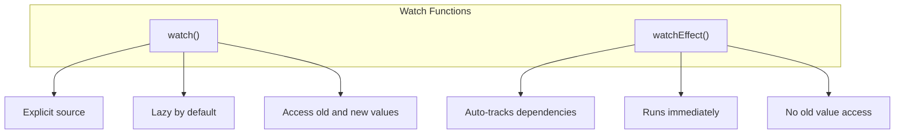
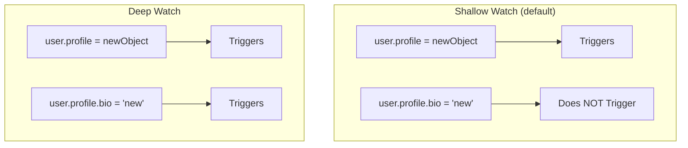
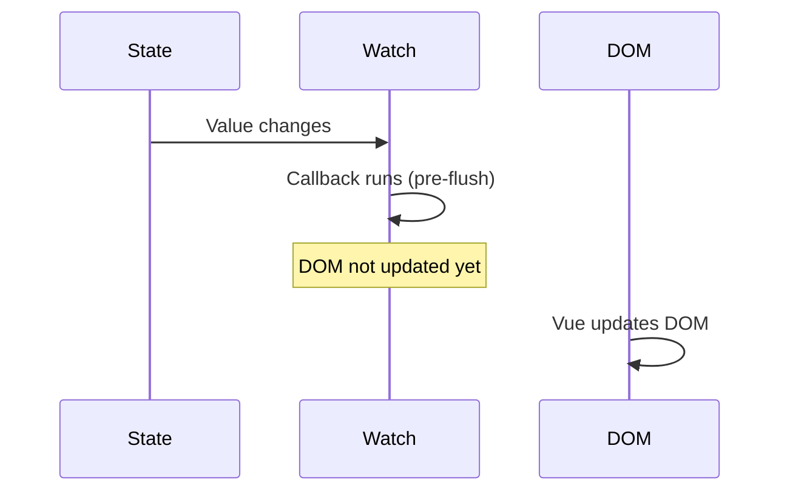
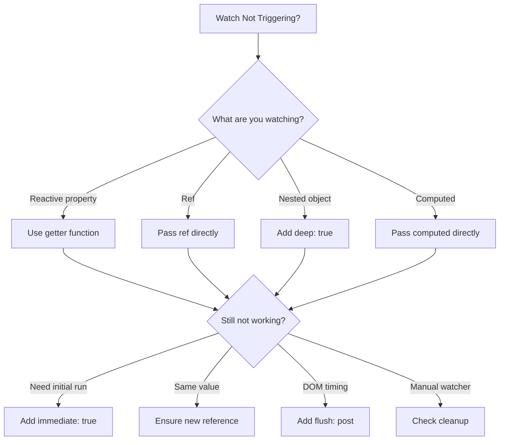

# How to Fix 'Watch' Not Triggering in Vue 3

Author: [nawazdhandala](https://www.github.com/nawazdhandala)

Tags: Vue, Watch, Reactivity, Debugging, Vue 3, Composition API

Description: Learn how to diagnose and fix common issues when Vue 3 watch does not trigger, including deep watching, reactive object pitfalls, and proper watcher syntax.

---

> Vue 3's watch API is powerful but has subtle behaviors that can cause watchers to not trigger as expected. This guide covers the most common reasons why watch fails to fire and how to fix each scenario.

The Composition API's watch function has different behavior than Vue 2's Options API watcher. Understanding these differences is key to debugging reactivity issues.

---

## Understanding Watch Basics

Vue 3 provides two watch functions with different use cases.



```javascript
// Basic watch syntax comparison
import { ref, reactive, watch, watchEffect } from 'vue'

const count = ref(0)
const user = reactive({ name: 'John', age: 30 })

// watch - explicit source, lazy execution
watch(count, (newValue, oldValue) => {
  console.log(`count changed: ${oldValue} -> ${newValue}`)
})

// watchEffect - automatic dependency tracking, immediate execution
watchEffect(() => {
  console.log(`count is now: ${count.value}`)
  // Automatically tracks count.value as dependency
})
```

---

## Issue 1: Watching Reactive Object Properties Incorrectly

The most common mistake is watching a reactive property directly.

```vue
<!-- WRONG: This will NOT trigger -->
<script setup>
import { reactive, watch } from 'vue'

const user = reactive({
  name: 'John',
  email: 'john@example.com'
})

// WRONG - watching a primitive value, not a reactive source
watch(user.name, (newName) => {
  console.log('Name changed:', newName)  // Never fires!
})

// This won't trigger the watcher
function updateName() {
  user.name = 'Jane'  // Watch doesn't fire
}
</script>
```

```vue
<!-- CORRECT: Use a getter function -->
<script setup>
import { reactive, watch } from 'vue'

const user = reactive({
  name: 'John',
  email: 'john@example.com'
})

// CORRECT - use a getter function to watch reactive property
watch(
  () => user.name,  // Getter function returns reactive value
  (newName, oldName) => {
    console.log(`Name changed: ${oldName} -> ${newName}`)  // This works!
  }
)

// Now this triggers the watcher
function updateName() {
  user.name = 'Jane'  // Watch fires correctly
}
</script>
```

---

## Issue 2: Nested Object Changes Not Detected

By default, watch only tracks shallow changes.



```vue
<script setup>
import { reactive, watch } from 'vue'

const user = reactive({
  name: 'John',
  profile: {
    bio: 'Developer',
    social: {
      twitter: '@john',
      github: 'john'
    }
  }
})

// WRONG - shallow watch won't detect nested changes
watch(
  () => user.profile,
  (newProfile) => {
    console.log('Profile changed')  // Only fires if profile is replaced entirely
  }
)

// This does NOT trigger the watcher
user.profile.bio = 'Senior Developer'  // No trigger
user.profile.social.twitter = '@johndoe'  // No trigger

// This DOES trigger the watcher
user.profile = { bio: 'New', social: { twitter: '@new' } }  // Triggers
</script>
```

```vue
<!-- CORRECT: Use deep option -->
<script setup>
import { reactive, watch } from 'vue'

const user = reactive({
  name: 'John',
  profile: {
    bio: 'Developer',
    social: {
      twitter: '@john',
      github: 'john'
    }
  }
})

// CORRECT - deep watch detects all nested changes
watch(
  () => user.profile,
  (newProfile) => {
    console.log('Profile changed:', newProfile)
  },
  { deep: true }  // Enable deep watching
)

// Now ALL these trigger the watcher
user.profile.bio = 'Senior Developer'  // Triggers
user.profile.social.twitter = '@johndoe'  // Triggers
user.profile = { bio: 'New', social: {} }  // Triggers
</script>
```

---

## Issue 3: Watching Entire Reactive Object

Watching a reactive object directly has special behavior.

```vue
<script setup>
import { reactive, watch } from 'vue'

const state = reactive({
  count: 0,
  message: 'hello'
})

// Watching reactive object directly - automatically deep
watch(state, (newState) => {
  // Note: newState === oldState (same reference)
  console.log('State changed:', newState)
})

// All changes trigger the watcher
state.count++  // Triggers
state.message = 'world'  // Triggers

// CAVEAT: You cannot get the old value
watch(state, (newState, oldState) => {
  // newState and oldState are the SAME object reference
  console.log(newState === oldState)  // true!
})
</script>
```

```vue
<!-- Solution: Clone for old value comparison -->
<script setup>
import { reactive, watch, toRaw } from 'vue'

const state = reactive({
  count: 0,
  message: 'hello'
})

// Track previous state manually
let previousState = JSON.parse(JSON.stringify(state))

watch(state, (newState) => {
  const current = JSON.parse(JSON.stringify(newState))

  // Now you can compare
  if (current.count !== previousState.count) {
    console.log(`count: ${previousState.count} -> ${current.count}`)
  }

  // Update previous state
  previousState = current
})
</script>
```

---

## Issue 4: Ref Not Triggering Due to Same Value

Watch does not trigger if the new value equals the old value.

```vue
<script setup>
import { ref, watch } from 'vue'

const items = ref([1, 2, 3])

// WRONG - mutating array without reassigning
watch(items, (newItems) => {
  console.log('Items changed')  // May not trigger!
})

// This does NOT trigger (same array reference)
items.value.push(4)  // No trigger

// This DOES trigger (new array reference)
items.value = [...items.value, 4]  // Triggers
</script>
```

```vue
<!-- CORRECT: Use deep watch or reassign -->
<script setup>
import { ref, watch } from 'vue'

const items = ref([1, 2, 3])

// Option 1: Enable deep watching
watch(
  items,
  (newItems) => {
    console.log('Items changed:', newItems)
  },
  { deep: true }
)

// Now mutation triggers the watcher
items.value.push(4)  // Triggers with deep: true

// Option 2: Always reassign with new reference
function addItem(item) {
  items.value = [...items.value, item]  // Creates new array
}
</script>
```

---

## Issue 5: Watch Source Type Mismatch

Different source types require different syntax.

```vue
<script setup>
import { ref, reactive, computed, watch } from 'vue'

const count = ref(0)
const user = reactive({ name: 'John' })
const double = computed(() => count.value * 2)

// Watching a ref - pass the ref directly (not .value)
watch(count, (val) => console.log('count:', val))  // CORRECT
// watch(count.value, ...) // WRONG - loses reactivity

// Watching a reactive property - use getter
watch(() => user.name, (val) => console.log('name:', val))  // CORRECT
// watch(user.name, ...) // WRONG - primitive value

// Watching a computed - pass it directly
watch(double, (val) => console.log('double:', val))  // CORRECT

// Watching multiple sources - use array
watch(
  [count, () => user.name, double],
  ([newCount, newName, newDouble]) => {
    console.log('Multiple changed:', newCount, newName, newDouble)
  }
)
</script>
```

---

## Issue 6: Immediate Execution Needed

Watch is lazy by default and does not run on initial setup.

```vue
<script setup>
import { ref, watch, onMounted } from 'vue'

const userId = ref(1)
const userData = ref(null)

// PROBLEM: Watcher doesn't run on mount
watch(userId, async (id) => {
  userData.value = await fetchUser(id)
})

// userData is null initially, must wait for userId to change
</script>
```

```vue
<!-- CORRECT: Use immediate option -->
<script setup>
import { ref, watch } from 'vue'

const userId = ref(1)
const userData = ref(null)

// CORRECT - immediate runs watcher on setup
watch(
  userId,
  async (id) => {
    userData.value = await fetchUser(id)
  },
  { immediate: true }  // Runs immediately with current value
)

// userData is fetched immediately on component mount
</script>
```

```vue
<!-- Alternative: Use watchEffect -->
<script setup>
import { ref, watchEffect } from 'vue'

const userId = ref(1)
const userData = ref(null)

// watchEffect runs immediately by default
watchEffect(async () => {
  userData.value = await fetchUser(userId.value)
})
</script>
```

---

## Issue 7: Async Watch Timing Problems

Watchers may fire before DOM updates.



```vue
<script setup>
import { ref, watch, nextTick } from 'vue'

const items = ref(['a', 'b', 'c'])
const listRef = ref(null)

// PROBLEM: DOM not updated when watcher runs
watch(items, (newItems) => {
  // listRef.value contains OLD DOM state
  console.log('List height:', listRef.value?.scrollHeight)  // Stale value
})

// Solution 1: Use nextTick
watch(items, async (newItems) => {
  await nextTick()
  // Now DOM is updated
  console.log('List height:', listRef.value?.scrollHeight)  // Correct value
})

// Solution 2: Use flush: 'post'
watch(
  items,
  (newItems) => {
    // Runs after DOM updates
    console.log('List height:', listRef.value?.scrollHeight)  // Correct
  },
  { flush: 'post' }
)
</script>

<template>
  <ul ref="listRef">
    <li v-for="item in items" :key="item">{{ item }}</li>
  </ul>
</template>
```

---

## Issue 8: Object Property Added After Setup

Vue cannot detect property additions on reactive objects (rare edge case).

```vue
<script setup>
import { reactive, watch, set } from 'vue'

const config = reactive({
  theme: 'dark'
})

watch(
  () => config.newProperty,  // Property doesn't exist yet
  (val) => {
    console.log('newProperty:', val)  // Never triggers
  }
)

// Adding new property - watch won't detect
config.newProperty = 'value'  // No trigger

// Solution: Initialize all properties upfront
const configFixed = reactive({
  theme: 'dark',
  newProperty: null  // Initialize with null
})

watch(
  () => configFixed.newProperty,
  (val) => {
    console.log('newProperty:', val)  // Now works
  }
)

configFixed.newProperty = 'value'  // Triggers
</script>
```

---

## Issue 9: Watcher Stopped Too Early

Watchers created in setup are auto-stopped, but manual watchers need cleanup.

```vue
<script setup>
import { ref, watch, onMounted, onUnmounted } from 'vue'

const count = ref(0)

// Auto-cleaned watcher - created synchronously in setup
watch(count, (val) => {
  console.log('count:', val)
})

// PROBLEM: Async watcher creation
let stopWatcher = null

onMounted(async () => {
  await someAsyncOperation()

  // Watcher created after async operation
  // Vue cannot auto-clean this!
  stopWatcher = watch(count, (val) => {
    console.log('async watcher:', val)
  })
})

// Must manually clean up
onUnmounted(() => {
  if (stopWatcher) {
    stopWatcher()  // Stop the watcher manually
  }
})
</script>
```

---

## Issue 10: Watching Props Correctly

Props require special handling in watchers.

```vue
<!-- ChildComponent.vue -->
<script setup>
import { watch, toRef, toRefs } from 'vue'

const props = defineProps({
  userId: Number,
  config: Object
})

// WRONG - watching props directly
// watch(props.userId, ...) // Loses reactivity

// CORRECT Option 1: Use getter
watch(
  () => props.userId,
  (newId) => {
    console.log('userId changed:', newId)
  }
)

// CORRECT Option 2: Use toRef
const userIdRef = toRef(props, 'userId')
watch(userIdRef, (newId) => {
  console.log('userId changed:', newId)
})

// CORRECT Option 3: Watch entire props
watch(
  () => props,
  (newProps) => {
    console.log('Props changed')
  },
  { deep: true }
)

// CORRECT Option 4: toRefs for multiple props
const { userId, config } = toRefs(props)
watch([userId, config], ([newUserId, newConfig]) => {
  console.log('Multiple props changed')
})
</script>
```

---

## Debugging Checklist

```javascript
// Debug helper function
function debugWatch(name, source, options = {}) {
  console.log(`[${name}] Setting up watcher`)
  console.log(`[${name}] Source type:`, typeof source)
  console.log(`[${name}] Options:`, options)

  const stop = watch(
    source,
    (newVal, oldVal) => {
      console.log(`[${name}] Triggered!`)
      console.log(`[${name}] New:`, JSON.stringify(newVal))
      console.log(`[${name}] Old:`, JSON.stringify(oldVal))
      console.log(`[${name}] Same reference:`, newVal === oldVal)
    },
    {
      ...options,
      onTrack(e) {
        console.log(`[${name}] Tracking:`, e)
      },
      onTrigger(e) {
        console.log(`[${name}] Trigger event:`, e)
      }
    }
  )

  return stop
}

// Usage
const user = reactive({ name: 'John' })
debugWatch('user.name', () => user.name)
```

---

## Quick Reference Table

| Scenario | Wrong | Correct |
|----------|-------|---------|
| Reactive property | `watch(obj.prop, ...)` | `watch(() => obj.prop, ...)` |
| Ref value | `watch(myRef.value, ...)` | `watch(myRef, ...)` |
| Nested changes | Default watch | `{ deep: true }` |
| Initial run | Default (lazy) | `{ immediate: true }` |
| After DOM update | Default (pre-flush) | `{ flush: 'post' }` |
| Multiple sources | Multiple watchers | `watch([a, b], ...)` |
| Props | `watch(props.x, ...)` | `watch(() => props.x, ...)` |

---

## Best Practices Summary



Key takeaways:

1. **Use getter functions** for reactive object properties
2. **Pass refs directly** without `.value`
3. **Enable deep watching** for nested object changes
4. **Use immediate** when initial execution is needed
5. **Use flush: post** when accessing updated DOM
6. **Manually stop** watchers created asynchronously
7. **Use onTrack/onTrigger** for debugging reactivity

When in doubt, use `watchEffect` for simpler cases where you do not need old values.
