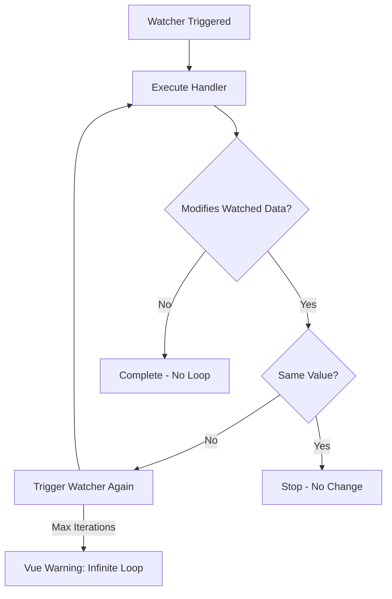
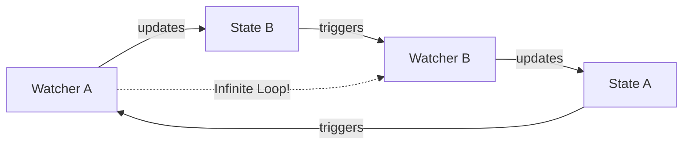
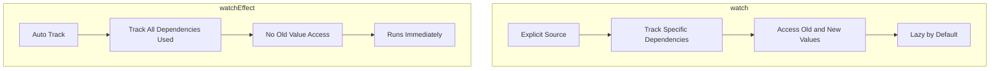

# How to Fix "Infinite Loop" in Vue Watchers

Author: [nawazdhandala](https://www.github.com/nawazdhandala)

Tags: Vue, Watchers, Debugging, JavaScript, Reactivity, Performance, Troubleshooting

Description: Learn how to identify and fix infinite loop issues in Vue watchers, including common causes, debugging techniques, and best practices for reactive data handling.

---

> Infinite loops in Vue watchers can freeze your application and crash browsers. This guide helps you understand why they occur and how to prevent them, with practical solutions for common scenarios.

Watcher infinite loops happen when a watcher modifies the same data it is watching, creating an endless cycle of updates. Understanding Vue's reactivity system is key to avoiding these issues.

---

## Common Causes of Infinite Loops

| Cause | Description | Solution |
|-------|-------------|----------|
| **Self-mutation** | Watcher modifies watched value | Use computed or separate state |
| **Circular watchers** | Watchers trigger each other | Restructure data flow |
| **Deep watching objects** | Mutating nested properties | Use immutable updates |
| **Missing guards** | No conditions to stop updates | Add conditional checks |

---

## Infinite Loop Detection Flow



---

## Cause 1: Direct Self-Mutation

The most common cause is modifying the watched value inside the watcher.

```javascript
// BAD: Infinite loop - watcher modifies what it watches
import { ref, watch } from 'vue'

const count = ref(0)

watch(count, (newValue) => {
  // This creates an infinite loop!
  count.value = newValue + 1
})
```

### Solution: Use Computed Property

```javascript
// GOOD: Use computed for derived values
import { ref, computed } from 'vue'

const count = ref(0)

// Computed automatically derives from count
const incrementedCount = computed(() => count.value + 1)
```

### Solution: Use Separate State

```javascript
// GOOD: Store derived value separately
import { ref, watch } from 'vue'

const inputValue = ref(0)
const processedValue = ref(0)

watch(inputValue, (newValue) => {
  // Modifies different state - no loop
  processedValue.value = newValue * 2
})
```

---

## Cause 2: Object Mutation with Deep Watch

Deep watching objects while mutating them causes loops.

```javascript
// BAD: Mutating watched object
import { ref, watch } from 'vue'

const user = ref({
  name: 'John',
  visits: 0
})

watch(
  user,
  (newUser) => {
    // Mutating the object triggers the watcher again!
    newUser.visits++
  },
  { deep: true }
)
```

### Solution: Use Immutable Updates

```javascript
// GOOD: Track visits separately
import { ref, watch } from 'vue'

const user = ref({
  name: 'John'
})

const visitCount = ref(0)

watch(
  () => user.value.name,
  () => {
    // Update separate state
    visitCount.value++
  }
)
```

### Solution: Watch Specific Properties

```javascript
// GOOD: Watch only specific properties
import { ref, watch } from 'vue'

const user = ref({
  name: 'John',
  email: 'john@example.com',
  lastUpdated: null
})

// Watch specific property, not entire object
watch(
  () => user.value.name,
  (newName) => {
    // Safe to update other properties
    user.value.lastUpdated = new Date()
  }
)
```

---

## Cause 3: Circular Watcher Dependencies

Multiple watchers triggering each other create loops.



```javascript
// BAD: Circular watcher dependencies
import { ref, watch } from 'vue'

const celsius = ref(0)
const fahrenheit = ref(32)

// Watcher A: celsius changes -> update fahrenheit
watch(celsius, (c) => {
  fahrenheit.value = (c * 9/5) + 32
})

// Watcher B: fahrenheit changes -> update celsius
// This creates a loop!
watch(fahrenheit, (f) => {
  celsius.value = (f - 32) * 5/9
})
```

### Solution: Use Writable Computed

```javascript
// GOOD: Use writable computed property
import { ref, computed } from 'vue'

const celsius = ref(0)

const fahrenheit = computed({
  get() {
    return (celsius.value * 9/5) + 32
  },
  set(f) {
    celsius.value = (f - 32) * 5/9
  }
})

// Now both can be used as v-model without loops
```

### Solution: Use Flags to Break Cycle

```javascript
// GOOD: Use flag to prevent circular updates
import { ref, watch } from 'vue'

const celsius = ref(0)
const fahrenheit = ref(32)
let isUpdating = false

watch(celsius, (c) => {
  if (isUpdating) return
  isUpdating = true
  fahrenheit.value = (c * 9/5) + 32
  isUpdating = false
})

watch(fahrenheit, (f) => {
  if (isUpdating) return
  isUpdating = true
  celsius.value = (f - 32) * 5/9
  isUpdating = false
})
```

---

## Cause 4: Array Mutations

Mutating arrays in watchers while deep watching causes issues.

```javascript
// BAD: Mutating array in watcher
import { ref, watch } from 'vue'

const items = ref([1, 2, 3])

watch(
  items,
  (newItems) => {
    // This triggers the watcher again!
    newItems.push(newItems.length + 1)
  },
  { deep: true }
)
```

### Solution: Use Conditional Guards

```javascript
// GOOD: Add conditions to prevent infinite updates
import { ref, watch } from 'vue'

const items = ref([1, 2, 3])
const maxItems = 10

watch(
  items,
  (newItems) => {
    // Guard condition prevents infinite loop
    if (newItems.length < maxItems && newItems.length > 0) {
      const lastItem = newItems[newItems.length - 1]
      // Only add if not already added
      if (lastItem < maxItems) {
        items.value = [...newItems, lastItem + 1]
      }
    }
  },
  { deep: true }
)
```

### Solution: Watch Array Length

```javascript
// GOOD: Watch specific aspect of array
import { ref, watch } from 'vue'

const items = ref([1, 2, 3])

watch(
  () => items.value.length,
  (newLength, oldLength) => {
    console.log(`Items changed from ${oldLength} to ${newLength}`)
    // Safe operations that don't change length
  }
)
```

---

## Cause 5: Immediate Watchers with Mutations

Immediate watchers can trigger loops on component mount.

```javascript
// BAD: Immediate watcher with mutation
import { ref, watch } from 'vue'

const data = ref(null)

watch(
  data,
  async (newData) => {
    if (!newData) {
      // This triggers immediately and loops!
      data.value = await fetchData()
    }
  },
  { immediate: true }
)
```

### Solution: Separate Initialization

```javascript
// GOOD: Separate initialization from watching
import { ref, watch, onMounted } from 'vue'

const data = ref(null)
const isInitialized = ref(false)

// Initialize once
onMounted(async () => {
  data.value = await fetchData()
  isInitialized.value = true
})

// Watch only after initialization
watch(data, async (newData) => {
  if (!isInitialized.value) return

  // Handle subsequent changes
  await processData(newData)
})
```

---

## Debugging Infinite Loops

### 1. Add Console Logging

```javascript
import { ref, watch } from 'vue'

const value = ref(0)
let watchCount = 0

watch(value, (newVal, oldVal) => {
  watchCount++
  console.log(`Watch triggered ${watchCount} times`)
  console.log(`Old: ${oldVal}, New: ${newVal}`)
  console.trace('Watcher call stack')

  // Safety limit
  if (watchCount > 100) {
    console.error('Possible infinite loop detected!')
    return
  }

  // Your logic here
})
```

### 2. Use Vue DevTools

```javascript
// Enable watcher debugging in development
import { ref, watch } from 'vue'

const value = ref(0)

watch(
  value,
  (newVal) => {
    // Set breakpoint here
    debugger
    // Inspect call stack
  },
  {
    // Label for DevTools
    onTrack(e) {
      console.log('Tracking:', e)
    },
    onTrigger(e) {
      console.log('Triggered:', e)
    }
  }
)
```

### 3. Create Debug Wrapper

```javascript
// composables/useDebugWatch.js
import { watch } from 'vue'

export function useDebugWatch(source, callback, options = {}) {
  let callCount = 0
  const maxCalls = options.maxCalls || 100
  const name = options.name || 'unnamed'

  return watch(
    source,
    (...args) => {
      callCount++

      if (callCount > maxCalls) {
        console.error(
          `[${name}] Watcher exceeded ${maxCalls} calls - possible infinite loop`
        )
        return
      }

      if (options.debug) {
        console.log(`[${name}] Watcher call #${callCount}`, args)
      }

      return callback(...args)
    },
    options
  )
}

// Usage
useDebugWatch(
  myValue,
  (newVal) => {
    // handler
  },
  { name: 'myValueWatcher', debug: true, maxCalls: 50 }
)
```

---

## Safe Watcher Patterns

### Pattern 1: Compare Before Update

```javascript
import { ref, watch } from 'vue'

const value = ref({ count: 0 })

watch(
  () => value.value.count,
  (newCount, oldCount) => {
    // Only act if actually changed
    if (newCount === oldCount) return

    // Safe to proceed
    console.log('Count changed:', newCount)
  }
)
```

### Pattern 2: Debounced Watchers

```javascript
import { ref, watch } from 'vue'
import { useDebounceFn } from '@vueuse/core'

const searchQuery = ref('')
const results = ref([])

// Debounce prevents rapid successive calls
const debouncedSearch = useDebounceFn(async (query) => {
  results.value = await searchAPI(query)
}, 300)

watch(searchQuery, (query) => {
  debouncedSearch(query)
})
```

### Pattern 3: One-Time Watch

```javascript
import { ref, watchEffect } from 'vue'

const data = ref(null)

// Watch that automatically stops
const stop = watchEffect(() => {
  if (data.value) {
    console.log('Data loaded:', data.value)
    // Stop watching after first load
    stop()
  }
})
```

### Pattern 4: Flush Timing

```javascript
import { ref, watch } from 'vue'

const value = ref(0)

// Pre-flush: runs before DOM updates
watch(value, handler, { flush: 'pre' })

// Post-flush: runs after DOM updates (default)
watch(value, handler, { flush: 'post' })

// Sync: runs immediately (use with caution)
watch(value, handler, { flush: 'sync' })
```

---

## WatchEffect vs Watch



### When to Use Each

```javascript
import { ref, watch, watchEffect } from 'vue'

const firstName = ref('John')
const lastName = ref('Doe')

// Use watch when:
// - You need old value
// - You want to watch specific sources
// - You want lazy execution
watch(
  [firstName, lastName],
  ([newFirst, newLast], [oldFirst, oldLast]) => {
    console.log(`Name changed from ${oldFirst} ${oldLast} to ${newFirst} ${newLast}`)
  }
)

// Use watchEffect when:
// - You don't need old value
// - Dependencies are complex/dynamic
// - You want immediate execution
watchEffect(() => {
  console.log(`Current name: ${firstName.value} ${lastName.value}`)
})
```

---

## Common Scenarios and Solutions

### Form Validation

```javascript
// BAD: Validation loop
const form = ref({ email: '', errors: {} })

watch(
  form,
  (f) => {
    // This modifies form, causing loop!
    f.errors.email = !f.email.includes('@') ? 'Invalid' : null
  },
  { deep: true }
)

// GOOD: Separate errors from form data
const formData = ref({ email: '' })
const errors = ref({})

watch(
  () => formData.value.email,
  (email) => {
    errors.value.email = !email.includes('@') ? 'Invalid email' : null
  }
)
```

### API Sync

```javascript
// BAD: Sync causes loop
const serverData = ref(null)

watch(serverData, async (data) => {
  // Updates serverData, triggers watcher again!
  serverData.value = await saveToServer(data)
})

// GOOD: Use flag and separate response handling
const localData = ref(null)
const isSaving = ref(false)

watch(localData, async (data) => {
  if (isSaving.value) return

  isSaving.value = true
  try {
    await saveToServer(data)
  } finally {
    isSaving.value = false
  }
})
```

---

## Best Practices Summary

| Practice | Description |
|----------|-------------|
| **Avoid self-mutation** | Never modify watched value in handler |
| **Use computed** | Prefer computed for derived state |
| **Watch specific props** | Avoid deep watch when possible |
| **Add guards** | Use conditions to prevent loops |
| **Separate state** | Store derived values separately |
| **Debug early** | Add logging during development |

---

## Conclusion

Infinite loops in Vue watchers are preventable with proper understanding of reactivity. Key takeaways:

- Never modify the watched value inside its watcher
- Use computed properties for derived state
- Watch specific properties instead of entire objects
- Use guards and flags to prevent circular updates
- Debug with console logging and Vue DevTools
- Consider flush timing for complex scenarios

Following these patterns ensures your Vue applications remain performant and bug-free.

---

*Building Vue applications that need monitoring? [OneUptime](https://oneuptime.com) provides frontend monitoring with performance tracking and error detection.*

**Related Reading:**
- [How to Handle Computed Properties in Vue 3](https://oneuptime.com/blog/post/2026-01-24-vue3-computed-properties/view)
- [How to Handle Vue Composition API Migration](https://oneuptime.com/blog/post/2026-01-24-vue-composition-api-migration/view)
