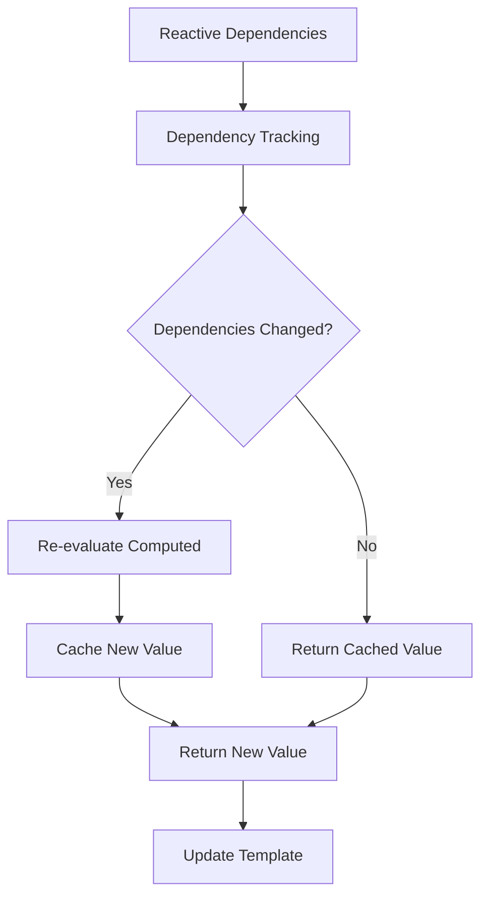
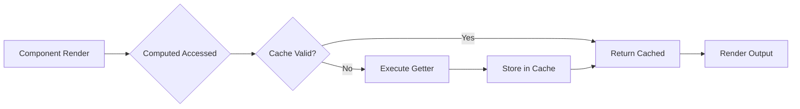

# How to Handle Computed Properties in Vue 3

Author: [nawazdhandala](https://www.github.com/nawazdhandala)

Tags: Vue 3, Computed Properties, Composition API, JavaScript, Reactivity, Frontend

Description: Learn how to effectively use computed properties in Vue 3, including the Composition API syntax, writable computed properties, and performance optimization strategies.

---

> Computed properties are one of Vue's most powerful features for deriving state. Vue 3 introduces new patterns through the Composition API that make computed properties more flexible and reusable. This guide covers everything from basic usage to advanced patterns.

Computed properties automatically track their reactive dependencies and only re-evaluate when those dependencies change. This makes them essential for building performant Vue applications.

---

## Options API vs Composition API

| Approach | Syntax | Best For |
|----------|--------|----------|
| **Options API** | `computed: {}` object | Simple components |
| **Composition API** | `computed()` function | Complex logic, reusability |
| **Script Setup** | `computed()` with `<script setup>` | Modern Vue 3 projects |

---

## Basic Computed Properties

### Options API Syntax

```javascript
// OptionsApiComponent.vue
export default {
  data() {
    return {
      firstName: 'John',
      lastName: 'Doe',
      items: [
        { name: 'Apple', price: 1.50, quantity: 3 },
        { name: 'Banana', price: 0.75, quantity: 5 },
        { name: 'Orange', price: 2.00, quantity: 2 }
      ]
    }
  },
  computed: {
    // Simple computed property
    fullName() {
      return `${this.firstName} ${this.lastName}`
    },

    // Computed property with complex logic
    totalPrice() {
      return this.items.reduce((sum, item) => {
        return sum + (item.price * item.quantity)
      }, 0)
    },

    // Computed property returning an object
    userInfo() {
      return {
        fullName: this.fullName,
        initials: `${this.firstName[0]}${this.lastName[0]}`
      }
    }
  }
}
```

### Composition API Syntax

```javascript
// CompositionApiComponent.vue
import { ref, computed } from 'vue'

export default {
  setup() {
    // Reactive state
    const firstName = ref('John')
    const lastName = ref('Doe')
    const items = ref([
      { name: 'Apple', price: 1.50, quantity: 3 },
      { name: 'Banana', price: 0.75, quantity: 5 },
      { name: 'Orange', price: 2.00, quantity: 2 }
    ])

    // Computed properties
    const fullName = computed(() => {
      return `${firstName.value} ${lastName.value}`
    })

    const totalPrice = computed(() => {
      return items.value.reduce((sum, item) => {
        return sum + (item.price * item.quantity)
      }, 0)
    })

    // Return for template use
    return {
      firstName,
      lastName,
      items,
      fullName,
      totalPrice
    }
  }
}
```

### Script Setup Syntax (Recommended)

```vue
<!-- ScriptSetupComponent.vue -->
<script setup>
import { ref, computed } from 'vue'

// Reactive state
const firstName = ref('John')
const lastName = ref('Doe')
const items = ref([
  { name: 'Apple', price: 1.50, quantity: 3 },
  { name: 'Banana', price: 0.75, quantity: 5 },
  { name: 'Orange', price: 2.00, quantity: 2 }
])

// Computed properties - automatically available in template
const fullName = computed(() => `${firstName.value} ${lastName.value}`)

const totalPrice = computed(() => {
  return items.value.reduce((sum, item) => {
    return sum + (item.price * item.quantity)
  }, 0)
})

const formattedTotal = computed(() => {
  return `$${totalPrice.value.toFixed(2)}`
})
</script>

<template>
  <div>
    <h2>{{ fullName }}</h2>
    <p>Total: {{ formattedTotal }}</p>
  </div>
</template>
```

---

## Writable Computed Properties

Sometimes you need computed properties that can be set. Vue 3 supports this with getter/setter syntax.

```vue
<!-- WritableComputed.vue -->
<script setup>
import { ref, computed } from 'vue'

const firstName = ref('John')
const lastName = ref('Doe')

// Writable computed property
const fullName = computed({
  get() {
    return `${firstName.value} ${lastName.value}`
  },
  set(newValue) {
    // Split the full name and update parts
    const parts = newValue.split(' ')
    firstName.value = parts[0] || ''
    lastName.value = parts.slice(1).join(' ') || ''
  }
})

// Example: Temperature conversion
const celsius = ref(25)

const fahrenheit = computed({
  get() {
    return (celsius.value * 9/5) + 32
  },
  set(newFahrenheit) {
    celsius.value = (newFahrenheit - 32) * 5/9
  }
})
</script>

<template>
  <div>
    <input v-model="fullName" placeholder="Full name">
    <p>First: {{ firstName }}, Last: {{ lastName }}</p>

    <div>
      <label>Celsius: <input v-model.number="celsius" type="number"></label>
      <label>Fahrenheit: <input v-model.number="fahrenheit" type="number"></label>
    </div>
  </div>
</template>
```

---

## Computed Property Flow



---

## Computed Properties with Arguments

Computed properties cannot directly accept arguments, but you can return a function.

```vue
<!-- ComputedWithArgs.vue -->
<script setup>
import { ref, computed } from 'vue'

const products = ref([
  { id: 1, name: 'Laptop', price: 999, category: 'electronics' },
  { id: 2, name: 'Shirt', price: 29, category: 'clothing' },
  { id: 3, name: 'Phone', price: 699, category: 'electronics' },
  { id: 4, name: 'Pants', price: 49, category: 'clothing' }
])

// Computed that returns a function (method-style)
const filteredProducts = computed(() => {
  return (category) => {
    if (!category) return products.value
    return products.value.filter(p => p.category === category)
  }
})

// Alternative: Create a composable function
const useProductFilter = (category) => {
  return computed(() => {
    return products.value.filter(p => p.category === category)
  })
}

// Usage
const electronics = useProductFilter('electronics')
const clothing = useProductFilter('clothing')

// Computed with multiple filters
const priceRange = ref({ min: 0, max: 1000 })

const filteredByPrice = computed(() => {
  return products.value.filter(p => {
    return p.price >= priceRange.value.min &&
           p.price <= priceRange.value.max
  })
})
</script>

<template>
  <div>
    <h3>Electronics</h3>
    <ul>
      <li v-for="product in electronics" :key="product.id">
        {{ product.name }} - ${{ product.price }}
      </li>
    </ul>

    <h3>Dynamic Filter</h3>
    <ul>
      <li v-for="product in filteredProducts('clothing')" :key="product.id">
        {{ product.name }} - ${{ product.price }}
      </li>
    </ul>
  </div>
</template>
```

---

## Async Computed Properties

Vue 3 computed properties are synchronous by default. For async operations, use `watchEffect` or libraries like VueUse.

```vue
<!-- AsyncComputed.vue -->
<script setup>
import { ref, computed, watchEffect } from 'vue'

const userId = ref(1)
const userData = ref(null)
const loading = ref(false)
const error = ref(null)

// Async data fetching with watchEffect
watchEffect(async () => {
  loading.value = true
  error.value = null

  try {
    const response = await fetch(
      `https://api.example.com/users/${userId.value}`
    )
    userData.value = await response.json()
  } catch (e) {
    error.value = e.message
  } finally {
    loading.value = false
  }
})

// Derived computed from async data
const userDisplayName = computed(() => {
  if (!userData.value) return 'Loading...'
  return `${userData.value.firstName} ${userData.value.lastName}`
})

// Using VueUse computedAsync (if available)
// import { computedAsync } from '@vueuse/core'
// const asyncData = computedAsync(async () => {
//   const response = await fetch(`/api/data/${userId.value}`)
//   return response.json()
// }, null)
</script>

<template>
  <div>
    <input v-model.number="userId" type="number" min="1">
    <p v-if="loading">Loading...</p>
    <p v-else-if="error">Error: {{ error }}</p>
    <p v-else>{{ userDisplayName }}</p>
  </div>
</template>
```

---

## Performance Optimization

### Avoiding Expensive Recalculations

```vue
<!-- OptimizedComputed.vue -->
<script setup>
import { ref, computed, shallowRef } from 'vue'

// Large dataset
const items = shallowRef([])

// Fetch large dataset
const loadItems = async () => {
  const response = await fetch('/api/items')
  items.value = await response.json()
}

// Search and filter state
const searchQuery = ref('')
const sortField = ref('name')
const sortOrder = ref('asc')

// Break down into smaller computed properties
const filteredItems = computed(() => {
  const query = searchQuery.value.toLowerCase()
  if (!query) return items.value

  return items.value.filter(item => {
    return item.name.toLowerCase().includes(query)
  })
})

const sortedItems = computed(() => {
  const sorted = [...filteredItems.value]

  sorted.sort((a, b) => {
    const aVal = a[sortField.value]
    const bVal = b[sortField.value]

    if (sortOrder.value === 'asc') {
      return aVal > bVal ? 1 : -1
    }
    return aVal < bVal ? 1 : -1
  })

  return sorted
})

// Pagination
const currentPage = ref(1)
const pageSize = ref(20)

const paginatedItems = computed(() => {
  const start = (currentPage.value - 1) * pageSize.value
  const end = start + pageSize.value
  return sortedItems.value.slice(start, end)
})

const totalPages = computed(() => {
  return Math.ceil(sortedItems.value.length / pageSize.value)
})
</script>
```

### Computed Property Caching



---

## Composable Patterns

Extract computed properties into reusable composables.

```javascript
// composables/useCart.js
import { ref, computed } from 'vue'

export function useCart() {
  const items = ref([])

  const addItem = (product, quantity = 1) => {
    const existing = items.value.find(i => i.product.id === product.id)
    if (existing) {
      existing.quantity += quantity
    } else {
      items.value.push({ product, quantity })
    }
  }

  const removeItem = (productId) => {
    const index = items.value.findIndex(i => i.product.id === productId)
    if (index > -1) {
      items.value.splice(index, 1)
    }
  }

  const updateQuantity = (productId, quantity) => {
    const item = items.value.find(i => i.product.id === productId)
    if (item) {
      item.quantity = Math.max(0, quantity)
      if (item.quantity === 0) {
        removeItem(productId)
      }
    }
  }

  // Computed properties
  const itemCount = computed(() => {
    return items.value.reduce((sum, item) => sum + item.quantity, 0)
  })

  const subtotal = computed(() => {
    return items.value.reduce((sum, item) => {
      return sum + (item.product.price * item.quantity)
    }, 0)
  })

  const tax = computed(() => subtotal.value * 0.08)

  const total = computed(() => subtotal.value + tax.value)

  const isEmpty = computed(() => items.value.length === 0)

  return {
    items,
    addItem,
    removeItem,
    updateQuantity,
    itemCount,
    subtotal,
    tax,
    total,
    isEmpty
  }
}
```

```vue
<!-- ShoppingCart.vue -->
<script setup>
import { useCart } from './composables/useCart'

const {
  items,
  removeItem,
  updateQuantity,
  itemCount,
  subtotal,
  tax,
  total,
  isEmpty
} = useCart()
</script>

<template>
  <div class="cart">
    <h2>Shopping Cart ({{ itemCount }} items)</h2>

    <div v-if="isEmpty">
      <p>Your cart is empty</p>
    </div>

    <div v-else>
      <div v-for="item in items" :key="item.product.id" class="cart-item">
        <span>{{ item.product.name }}</span>
        <input
          type="number"
          :value="item.quantity"
          @input="updateQuantity(item.product.id, +$event.target.value)"
          min="0"
        >
        <span>${{ (item.product.price * item.quantity).toFixed(2) }}</span>
        <button @click="removeItem(item.product.id)">Remove</button>
      </div>

      <div class="cart-summary">
        <p>Subtotal: ${{ subtotal.toFixed(2) }}</p>
        <p>Tax (8%): ${{ tax.toFixed(2) }}</p>
        <p><strong>Total: ${{ total.toFixed(2) }}</strong></p>
      </div>
    </div>
  </div>
</template>
```

---

## Common Pitfalls

### 1. Side Effects in Computed Properties

```javascript
// BAD: Side effects in computed
const badComputed = computed(() => {
  // Never do this - side effects belong in watchers
  localStorage.setItem('count', count.value)
  return count.value * 2
})

// GOOD: Use watch for side effects
import { watch } from 'vue'

const goodComputed = computed(() => count.value * 2)

watch(count, (newValue) => {
  localStorage.setItem('count', newValue)
})
```

### 2. Mutating Reactive State

```javascript
// BAD: Mutating inside computed
const sortedItems = computed(() => {
  // This mutates the original array!
  return items.value.sort((a, b) => a.name.localeCompare(b.name))
})

// GOOD: Create a new array
const sortedItems = computed(() => {
  return [...items.value].sort((a, b) => a.name.localeCompare(b.name))
})
```

### 3. Using Non-Reactive Dependencies

```javascript
// BAD: Non-reactive variable
let multiplier = 2

const result = computed(() => {
  // This won't update when multiplier changes
  return count.value * multiplier
})

// GOOD: Make it reactive
const multiplier = ref(2)

const result = computed(() => {
  return count.value * multiplier.value
})
```

---

## Debugging Computed Properties

```vue
<script setup>
import { ref, computed, onRenderTracked, onRenderTriggered } from 'vue'

const count = ref(0)
const doubled = computed(() => {
  console.log('Computing doubled...')
  return count.value * 2
})

// Debug reactivity
onRenderTracked((e) => {
  console.log('Tracked:', e)
})

onRenderTriggered((e) => {
  console.log('Triggered:', e)
})
</script>
```

---

## Best Practices Summary

| Practice | Description |
|----------|-------------|
| **Keep computed pure** | No side effects, only derive state |
| **Break down complex computed** | Chain smaller computed properties |
| **Use composables** | Extract reusable computed logic |
| **Avoid mutations** | Always return new references |
| **Name descriptively** | Use clear, intention-revealing names |
| **Consider async carefully** | Use watchEffect for async operations |

---

## Conclusion

Computed properties in Vue 3 are essential for building reactive, performant applications. Key takeaways:

- Use `<script setup>` with `computed()` for modern Vue 3 projects
- Writable computed properties enable two-way derived state
- Break down complex computations into smaller, chained computed properties
- Extract reusable computed logic into composables
- Avoid side effects and mutations inside computed properties

Master these patterns to write cleaner, more maintainable Vue applications.

---

*Building Vue applications that need monitoring? [OneUptime](https://oneuptime.com) provides comprehensive frontend and backend monitoring for production applications.*

**Related Reading:**
- [How to Fix "Infinite Loop" in Vue Watchers](https://oneuptime.com/blog/post/2026-01-24-vue-watcher-infinite-loop/view)
- [How to Handle Vue Composition API Migration](https://oneuptime.com/blog/post/2026-01-24-vue-composition-api-migration/view)
