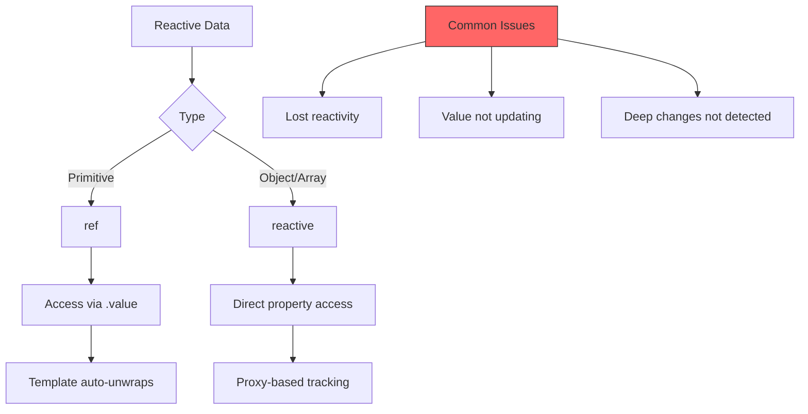
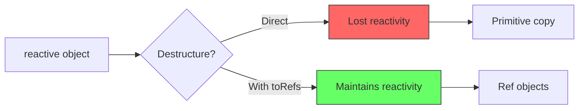

# How to Fix "Reactivity Not Working" Issues in Vue 3

Author: [nawazdhandala](https://www.github.com/nawazdhandala)

Tags: Vue, Vue 3, Reactivity, ref, reactive, Debugging, Composition API, JavaScript

Description: A comprehensive guide to diagnosing and fixing reactivity issues in Vue 3, covering common pitfalls with ref, reactive, and the Composition API.

---

Vue 3's reactivity system is powerful but has specific rules that, when violated, cause updates to silently fail. This guide covers the most common reactivity pitfalls and how to fix them.

---

## Understanding Vue 3 Reactivity



---

## Issue 1: Destructuring Reactive Objects

### The Problem

Destructuring a reactive object breaks reactivity because it extracts primitive values.

```vue
<script setup>
import { reactive } from 'vue'

const state = reactive({
  count: 0,
  user: { name: 'John' }
})

// BROKEN: Destructuring loses reactivity
const { count } = state

function increment() {
  count++  // This does NOT update the UI
}
</script>

<template>
  <!-- Shows initial value but never updates -->
  <p>Count: {{ count }}</p>
  <button @click="increment">+1</button>
</template>
```

### The Solution

```vue
<script setup>
import { reactive, toRefs } from 'vue'

const state = reactive({
  count: 0,
  user: { name: 'John' }
})

// Solution 1: Use toRefs to maintain reactivity
const { count, user } = toRefs(state)

function increment() {
  count.value++  // Now reactive (note: needs .value)
}

// Solution 2: Access properties directly from reactive object
function incrementDirect() {
  state.count++  // Also reactive
}
</script>

<template>
  <p>Count: {{ count }}</p>
  <button @click="increment">+1</button>
</template>
```



---

## Issue 2: Replacing Reactive Object Entirely

### The Problem

Reassigning a reactive variable breaks the reference.

```vue
<script setup>
import { reactive } from 'vue'

let state = reactive({ count: 0 })

async function fetchData() {
  const data = await fetch('/api/state').then(r => r.json())

  // BROKEN: Reassigning loses the reactive proxy
  state = data  // Template still points to old reactive object

  // ALSO BROKEN: Creating new reactive
  state = reactive(data)  // Still breaks template binding
}
</script>

<template>
  <!-- Bound to original object, not the reassigned one -->
  <p>{{ state.count }}</p>
</template>
```

### The Solution

```vue
<script setup>
import { reactive, ref } from 'vue'

// Solution 1: Use ref for objects you need to replace
const state = ref({ count: 0 })

async function fetchData() {
  const data = await fetch('/api/state').then(r => r.json())
  state.value = data  // Works! ref allows reassignment
}

// Solution 2: Use Object.assign to update reactive object
const state2 = reactive({ count: 0, name: '' })

async function fetchData2() {
  const data = await fetch('/api/state').then(r => r.json())
  Object.assign(state2, data)  // Mutates existing reactive object
}

// Solution 3: Wrap in nested object
const store = reactive({
  state: { count: 0 }
})

async function fetchData3() {
  const data = await fetch('/api/state').then(r => r.json())
  store.state = data  // Replacing property, not the reactive root
}
</script>

<template>
  <p>{{ state.count }}</p>
</template>
```

---

## Issue 3: Adding New Properties to Reactive Objects

### The Problem

In Vue 2, adding new properties required `Vue.set()`. Vue 3 handles this automatically for reactive objects, but there are still edge cases.

```vue
<script setup>
import { reactive } from 'vue'

const user = reactive({
  name: 'John'
})

function addEmail() {
  // This WORKS in Vue 3 (unlike Vue 2)
  user.email = 'john@example.com'
}

// BUT: This pattern can cause issues
const form = reactive({})

function setField(key, value) {
  form[key] = value  // Works, but be careful with TypeScript
}
</script>
```

### Best Practice

```vue
<script setup>
import { reactive, ref } from 'vue'

// Define all expected properties upfront
const user = reactive({
  name: '',
  email: '',
  age: null,
  preferences: {}
})

// For dynamic keys, consider using ref with Map
const dynamicData = ref(new Map())

function setDynamicField(key, value) {
  dynamicData.value.set(key, value)
  // Force reactivity by creating new Map if needed
  dynamicData.value = new Map(dynamicData.value)
}

// Or use a ref object for fully dynamic structures
const formData = ref({})

function updateFormData(key, value) {
  formData.value = {
    ...formData.value,
    [key]: value
  }
}
</script>
```

---

## Issue 4: Array Reactivity Pitfalls

### The Problem

Some array mutations do not trigger reactivity as expected.

```vue
<script setup>
import { reactive, ref } from 'vue'

const items = reactive([1, 2, 3])

function brokenUpdate() {
  // BROKEN: Direct index assignment (this actually works in Vue 3!)
  items[0] = 100  // Works in Vue 3, broken in Vue 2

  // BUT: Setting length does NOT trigger updates
  items.length = 0  // Does NOT clear reactively
}

// With ref
const list = ref([1, 2, 3])

function anotherPitfall() {
  // BROKEN: Modifying without .value
  list.push(4)  // Error: list.push is not a function

  // CORRECT
  list.value.push(4)
}
</script>
```

### The Solution

```vue
<script setup>
import { reactive, ref } from 'vue'

const items = reactive([1, 2, 3])
const list = ref([1, 2, 3])

// Reactive array methods that WORK
function correctMutations() {
  // These all trigger reactivity
  items.push(4)
  items.pop()
  items.shift()
  items.unshift(0)
  items.splice(1, 1, 'new')
  items.sort((a, b) => a - b)
  items.reverse()
}

// Clearing arrays reactively
function clearArray() {
  // Option 1: splice
  items.splice(0, items.length)

  // Option 2: reassign (for ref)
  list.value = []
}

// Replacing items at index
function replaceItem(index, newValue) {
  // Both work in Vue 3
  items[index] = newValue  // Works
  items.splice(index, 1, newValue)  // Also works, more explicit
}

// Filter/map operations (creates new array)
function filterItems() {
  // For reactive arrays, use splice to mutate in place
  const toRemove = items.filter(i => i > 2)
  toRemove.forEach(item => {
    const index = items.indexOf(item)
    if (index > -1) items.splice(index, 1)
  })

  // For ref, reassignment is cleaner
  list.value = list.value.filter(i => i <= 2)
}
</script>
```

---

## Issue 5: Losing Reactivity with ref in Templates

### The Problem

Misunderstanding auto-unwrapping in templates.

```vue
<script setup>
import { ref, reactive } from 'vue'

const count = ref(0)
const state = reactive({
  count: ref(10)  // ref nested in reactive
})

const items = ref([
  ref('item1'),  // refs in array
  ref('item2')
])
</script>

<template>
  <!-- Auto-unwrapped (correct) -->
  <p>{{ count }}</p>

  <!-- Nested ref in reactive: auto-unwrapped -->
  <p>{{ state.count }}</p>

  <!-- GOTCHA: refs in arrays are NOT auto-unwrapped -->
  <p>{{ items[0] }}</p>  <!-- Shows RefImpl object, not 'item1' -->
  <p>{{ items[0].value }}</p>  <!-- Correct -->
</template>
```

### The Solution

```vue
<script setup>
import { ref, reactive, computed } from 'vue'

// Avoid refs inside arrays
const items = ref(['item1', 'item2'])  // Simple values

// Or use computed for unwrapping
const refItems = ref([ref('item1'), ref('item2')])
const unwrappedItems = computed(() =>
  refItems.value.map(item => item.value)
)

// For complex items, use reactive objects in array
const users = reactive([
  { id: 1, name: 'John', active: true },
  { id: 2, name: 'Jane', active: false }
])

function toggleUser(index) {
  users[index].active = !users[index].active  // Reactive
}
</script>

<template>
  <div v-for="item in items" :key="item">
    {{ item }}
  </div>

  <div v-for="user in users" :key="user.id">
    {{ user.name }} - {{ user.active ? 'Active' : 'Inactive' }}
    <button @click="toggleUser(users.indexOf(user))">Toggle</button>
  </div>
</template>
```

---

## Issue 6: Async Operations Breaking Reactivity

### The Problem

```vue
<script setup>
import { ref } from 'vue'

const data = ref(null)

async function fetchData() {
  const response = await fetch('/api/data')
  const json = await response.json()

  // This works, but there is a timing issue
  data.value = json

  // PROBLEM: Accessing data.value immediately after
  console.log(data.value)  // Might not reflect in DOM yet

  // Component might unmount during async operation
}
</script>
```

### The Solution

```vue
<script setup>
import { ref, onMounted, onUnmounted, nextTick } from 'vue'

const data = ref(null)
const loading = ref(false)
const error = ref(null)
let isMounted = true

onMounted(() => {
  isMounted = true
  fetchData()
})

onUnmounted(() => {
  isMounted = false
})

async function fetchData() {
  loading.value = true
  error.value = null

  try {
    const response = await fetch('/api/data')
    const json = await response.json()

    // Check if component is still mounted
    if (isMounted) {
      data.value = json

      // Wait for DOM update if needed
      await nextTick()
      console.log('DOM updated with:', data.value)
    }
  } catch (e) {
    if (isMounted) {
      error.value = e.message
    }
  } finally {
    if (isMounted) {
      loading.value = false
    }
  }
}
</script>
```

### Using AbortController

```vue
<script setup>
import { ref, onMounted, onUnmounted } from 'vue'

const data = ref(null)
let abortController = null

onMounted(() => {
  abortController = new AbortController()
  fetchData()
})

onUnmounted(() => {
  abortController?.abort()
})

async function fetchData() {
  try {
    const response = await fetch('/api/data', {
      signal: abortController.signal
    })
    data.value = await response.json()
  } catch (e) {
    if (e.name !== 'AbortError') {
      console.error('Fetch failed:', e)
    }
  }
}
</script>
```

---

## Issue 7: Watch Not Triggering

### The Problem

```vue
<script setup>
import { ref, reactive, watch } from 'vue'

const user = reactive({
  profile: {
    name: 'John',
    settings: {
      theme: 'dark'
    }
  }
})

// PROBLEM: Shallow watch does not detect deep changes
watch(user, (newVal) => {
  console.log('User changed')  // Does NOT fire for deep changes
})

// PROBLEM: Watching wrong thing
const count = ref(0)
watch(count.value, () => {  // Watching primitive, not ref
  console.log('Count changed')  // Never fires
})
</script>
```

### The Solution

```vue
<script setup>
import { ref, reactive, watch, watchEffect } from 'vue'

const user = reactive({
  profile: {
    name: 'John',
    settings: {
      theme: 'dark'
    }
  }
})

// Solution 1: Deep watch
watch(user, (newVal) => {
  console.log('User changed (deep)')
}, { deep: true })

// Solution 2: Watch specific property
watch(
  () => user.profile.name,
  (newName, oldName) => {
    console.log(`Name changed from ${oldName} to ${newName}`)
  }
)

// Solution 3: Watch multiple sources
watch(
  [() => user.profile.name, () => user.profile.settings.theme],
  ([newName, newTheme], [oldName, oldTheme]) => {
    console.log('Name or theme changed')
  }
)

// For refs: watch the ref, not its value
const count = ref(0)

// CORRECT
watch(count, (newVal) => {
  console.log('Count:', newVal)
})

// Also correct: getter function
watch(
  () => count.value,
  (newVal) => {
    console.log('Count:', newVal)
  }
)

// Solution 4: watchEffect for automatic dependency tracking
watchEffect(() => {
  // Automatically tracks user.profile.name
  console.log('User name:', user.profile.name)
})
</script>
```

---

## Issue 8: Computed Not Updating

### The Problem

```vue
<script setup>
import { ref, reactive, computed } from 'vue'

const items = ref([1, 2, 3])

// PROBLEM: Computed caches incorrect value
const total = computed(() => {
  // If items array is mutated (not replaced), this might not update
  return items.value.reduce((a, b) => a + b, 0)
})

// PROBLEM: Side effects in computed
const fetchedData = computed(() => {
  fetch('/api/data')  // Side effect - bad practice
  return someValue
})
</script>
```

### The Solution

```vue
<script setup>
import { ref, computed, watch, watchEffect } from 'vue'

const items = ref([1, 2, 3])

// Computed works correctly with reactive dependencies
const total = computed(() => {
  // Accesses items.value, establishes dependency
  return items.value.reduce((a, b) => a + b, 0)
})

// Force recalculation by replacing array
function addItem(item) {
  items.value = [...items.value, item]  // New array triggers computed
}

// Or mutate (both work in Vue 3)
function addItemMutate(item) {
  items.value.push(item)  // Also triggers computed
}

// For side effects, use watchEffect instead
const data = ref(null)
watchEffect(async () => {
  // Side effects belong in watch/watchEffect
  const response = await fetch(`/api/items?count=${items.value.length}`)
  data.value = await response.json()
})

// Debugging computed
const debugTotal = computed(() => {
  console.log('Computing total...')  // See when it recalculates
  const result = items.value.reduce((a, b) => a + b, 0)
  console.log('Result:', result)
  return result
})
</script>
```

---

## Debugging Reactivity

### Vue DevTools

```javascript
// Enable production devtools for debugging
import { createApp } from 'vue'

const app = createApp(App)

// Enable in development
app.config.devtools = true
app.config.performance = true

app.mount('#app')
```

### Console Debugging

```vue
<script setup>
import { ref, reactive, watch, isRef, isReactive, isProxy, toRaw } from 'vue'

const count = ref(0)
const state = reactive({ name: 'test' })

// Check if value is reactive
console.log('count is ref:', isRef(count))         // true
console.log('state is reactive:', isReactive(state)) // true
console.log('state is proxy:', isProxy(state))       // true

// Get raw value (non-reactive) for debugging
console.log('Raw state:', toRaw(state))

// Watch for debugging
watch(count, (newVal, oldVal) => {
  console.log(`count changed: ${oldVal} -> ${newVal}`)
  console.trace()  // See what triggered the change
})
</script>
```

### Reactivity Debugging Composable

```javascript
// composables/useReactivityDebug.js
import { watch, isRef, isReactive, toRaw } from 'vue'

export function useReactivityDebug(source, name = 'unknown') {
  if (process.env.NODE_ENV !== 'development') return

  console.log(`[Debug] ${name}:`, {
    isRef: isRef(source),
    isReactive: isReactive(source),
    raw: toRaw(isRef(source) ? source.value : source)
  })

  watch(
    source,
    (newVal, oldVal) => {
      console.log(`[Debug] ${name} changed:`, {
        old: toRaw(oldVal),
        new: toRaw(newVal)
      })
    },
    { deep: true }
  )
}
```

```vue
<script setup>
import { ref, reactive } from 'vue'
import { useReactivityDebug } from '@/composables/useReactivityDebug'

const count = ref(0)
const state = reactive({ items: [] })

useReactivityDebug(count, 'count')
useReactivityDebug(state, 'state')
</script>
```

---

## Summary

| Issue | Cause | Solution |
|-------|-------|----------|
| Destructuring breaks reactivity | Extracts primitive values | Use `toRefs()` or access directly |
| Reassigning reactive | Loses proxy reference | Use `ref` or `Object.assign` |
| Array length = 0 | Not tracked | Use `splice(0)` or reassign |
| refs in arrays not unwrapped | Template limitation | Use plain values or `.value` |
| Watch not firing | Shallow by default | Add `{ deep: true }` |
| Computed not updating | Dependency not tracked | Ensure reactive access |
| Async timing issues | Component unmounted | Check mounted state |

Vue 3's reactivity system is more intuitive than Vue 2's, but understanding its Proxy-based implementation helps avoid common pitfalls. Use the debugging tools and patterns in this guide to quickly identify and fix reactivity issues.
