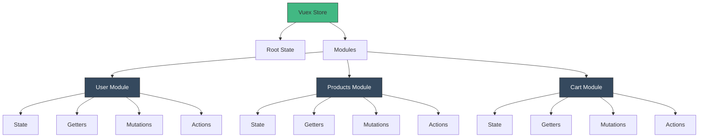
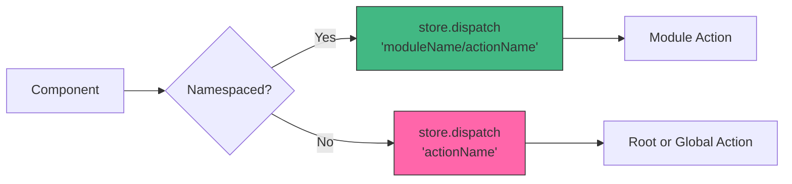
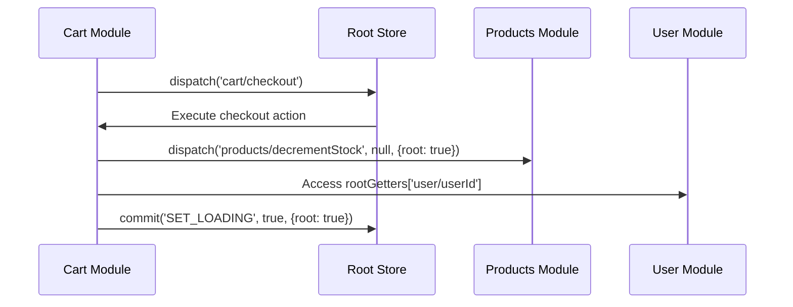
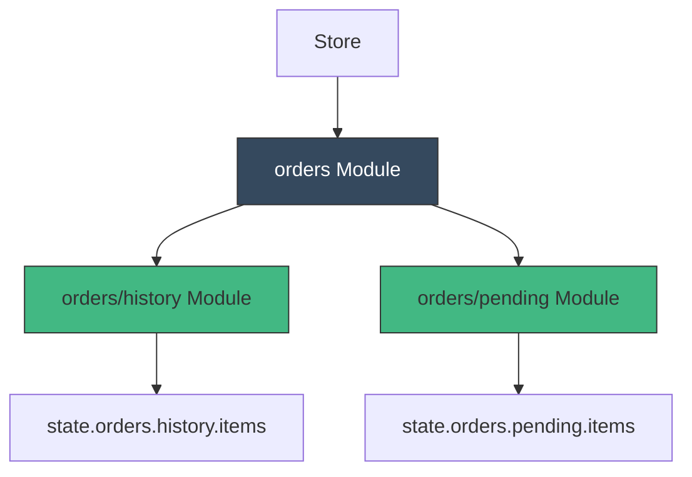

# How to Configure Vuex Store Modules

Author: [nawazdhandala](https://www.github.com/nawazdhandala)

Tags: Vue, Vuex, State Management, Modules, JavaScript, TypeScript, Architecture

Description: A comprehensive guide to configuring Vuex store modules for scalable Vue.js applications, covering namespacing, nested modules, and best practices.

---

Vuex modules help organize large state management systems by dividing the store into smaller, maintainable pieces. This guide covers module configuration, namespacing, and patterns for building scalable Vue applications.

---

## Understanding Vuex Modules



---

## Basic Module Structure

### Project Organization

```text
src/
  store/
    index.js           # Main store file
    modules/
      user.js          # User module
      products.js      # Products module
      cart.js          # Cart module
      orders/          # Nested module directory
        index.js
        actions.js
        mutations.js
```

### Creating a Basic Module

```javascript
// store/modules/user.js
const state = () => ({
  // Use a function to ensure fresh state for each module instance
  currentUser: null,
  isAuthenticated: false,
  token: null,
  preferences: {
    theme: 'light',
    notifications: true
  }
})

const getters = {
  // Getters receive state as first argument
  isLoggedIn: (state) => state.isAuthenticated,

  // Getters can access other getters via second argument
  userDisplayName: (state, getters) => {
    if (!state.currentUser) return 'Guest'
    return state.currentUser.displayName || state.currentUser.email
  },

  // Getters can return functions for parameterized access
  hasPermission: (state) => (permission) => {
    return state.currentUser?.permissions?.includes(permission) ?? false
  }
}

const mutations = {
  // Mutations must be synchronous
  SET_USER(state, user) {
    state.currentUser = user
    state.isAuthenticated = !!user
  },

  SET_TOKEN(state, token) {
    state.token = token
  },

  UPDATE_PREFERENCES(state, preferences) {
    state.preferences = { ...state.preferences, ...preferences }
  },

  LOGOUT(state) {
    state.currentUser = null
    state.isAuthenticated = false
    state.token = null
  }
}

const actions = {
  // Actions receive context object with state, commit, dispatch, getters, rootState, rootGetters
  async login({ commit }, credentials) {
    try {
      const response = await fetch('/api/auth/login', {
        method: 'POST',
        headers: { 'Content-Type': 'application/json' },
        body: JSON.stringify(credentials)
      })

      if (!response.ok) {
        throw new Error('Login failed')
      }

      const { user, token } = await response.json()

      commit('SET_USER', user)
      commit('SET_TOKEN', token)

      // Store token for persistence
      localStorage.setItem('auth_token', token)

      return user
    } catch (error) {
      commit('LOGOUT')
      throw error
    }
  },

  async logout({ commit }) {
    localStorage.removeItem('auth_token')
    commit('LOGOUT')
  },

  // Action that dispatches another action
  async refreshUser({ commit, state }) {
    if (!state.token) return null

    const response = await fetch('/api/auth/me', {
      headers: { 'Authorization': `Bearer ${state.token}` }
    })

    if (response.ok) {
      const user = await response.json()
      commit('SET_USER', user)
      return user
    }

    return null
  }
}

export default {
  namespaced: true,  // Enable namespacing
  state,
  getters,
  mutations,
  actions
}
```

---

## Registering Modules in the Store

```javascript
// store/index.js
import { createStore } from 'vuex'
import user from './modules/user'
import products from './modules/products'
import cart from './modules/cart'

export default createStore({
  // Root state (use sparingly)
  state: {
    appVersion: '1.0.0',
    isLoading: false
  },

  // Root mutations
  mutations: {
    SET_LOADING(state, isLoading) {
      state.isLoading = isLoading
    }
  },

  // Root actions
  actions: {
    async initializeApp({ dispatch }) {
      // Initialize all modules
      await Promise.all([
        dispatch('user/refreshUser'),
        dispatch('products/fetchCategories'),
        dispatch('cart/loadFromStorage')
      ])
    }
  },

  // Register modules
  modules: {
    user,
    products,
    cart
  }
})
```

---

## Namespaced Modules



### Accessing Namespaced Modules

```vue
<template>
  <div>
    <p v-if="isLoggedIn">Welcome, {{ userDisplayName }}</p>
    <button @click="handleLogout">Logout</button>
  </div>
</template>

<script>
import { mapState, mapGetters, mapMutations, mapActions } from 'vuex'

export default {
  computed: {
    // Map state from namespaced module
    ...mapState('user', ['currentUser', 'isAuthenticated']),

    // Map getters from namespaced module
    ...mapGetters('user', ['isLoggedIn', 'userDisplayName']),

    // Manual access
    token() {
      return this.$store.state.user.token
    }
  },

  methods: {
    // Map mutations from namespaced module
    ...mapMutations('user', ['SET_USER', 'LOGOUT']),

    // Map actions from namespaced module
    ...mapActions('user', ['login', 'logout']),

    async handleLogout() {
      await this.logout()
      this.$router.push('/login')
    }
  }
}
</script>
```

### Composition API Access

```vue
<script setup>
import { computed } from 'vue'
import { useStore } from 'vuex'

const store = useStore()

// Access namespaced state
const currentUser = computed(() => store.state.user.currentUser)
const isAuthenticated = computed(() => store.state.user.isAuthenticated)

// Access namespaced getters
const isLoggedIn = computed(() => store.getters['user/isLoggedIn'])
const userDisplayName = computed(() => store.getters['user/userDisplayName'])

// Dispatch namespaced actions
async function handleLogin(credentials) {
  try {
    await store.dispatch('user/login', credentials)
  } catch (error) {
    console.error('Login failed:', error)
  }
}

// Commit namespaced mutations
function updatePreferences(prefs) {
  store.commit('user/UPDATE_PREFERENCES', prefs)
}
</script>
```

---

## Cross-Module Communication



### Accessing Root State and Other Modules

```javascript
// store/modules/cart.js
const actions = {
  async checkout({ state, commit, dispatch, rootState, rootGetters }) {
    // Access root state
    const appVersion = rootState.appVersion

    // Access another module's state
    const userId = rootState.user.currentUser?.id

    // Access another module's getter
    const userEmail = rootGetters['user/userDisplayName']

    // Check if user is logged in before checkout
    if (!rootGetters['user/isLoggedIn']) {
      throw new Error('Must be logged in to checkout')
    }

    // Commit to root mutation
    commit('SET_LOADING', true, { root: true })

    try {
      const order = await fetch('/api/orders', {
        method: 'POST',
        headers: {
          'Content-Type': 'application/json',
          'Authorization': `Bearer ${rootState.user.token}`
        },
        body: JSON.stringify({
          items: state.items,
          userId
        })
      }).then(r => r.json())

      // Dispatch to another module
      await dispatch('user/addOrderToHistory', order, { root: true })

      // Dispatch to products module to update stock
      for (const item of state.items) {
        await dispatch('products/decrementStock', {
          productId: item.productId,
          quantity: item.quantity
        }, { root: true })
      }

      // Clear cart
      commit('CLEAR_CART')

      return order
    } finally {
      commit('SET_LOADING', false, { root: true })
    }
  }
}

export default {
  namespaced: true,
  state: () => ({
    items: [],
    total: 0
  }),
  mutations: {
    ADD_ITEM(state, item) {
      const existing = state.items.find(i => i.productId === item.productId)
      if (existing) {
        existing.quantity += item.quantity
      } else {
        state.items.push(item)
      }
    },
    CLEAR_CART(state) {
      state.items = []
      state.total = 0
    }
  },
  actions
}
```

---

## Dynamic Module Registration

```javascript
// Dynamically register a module at runtime
import store from '@/store'

// Register module when needed (e.g., when user navigates to admin section)
const adminModule = {
  namespaced: true,
  state: () => ({
    users: [],
    stats: null
  }),
  mutations: {
    SET_USERS(state, users) {
      state.users = users
    },
    SET_STATS(state, stats) {
      state.stats = stats
    }
  },
  actions: {
    async fetchUsers({ commit }) {
      const users = await fetch('/api/admin/users').then(r => r.json())
      commit('SET_USERS', users)
    },
    async fetchStats({ commit }) {
      const stats = await fetch('/api/admin/stats').then(r => r.json())
      commit('SET_STATS', stats)
    }
  }
}

// Register the module
store.registerModule('admin', adminModule)

// Check if module is registered
if (store.hasModule('admin')) {
  console.log('Admin module is registered')
}

// Unregister when no longer needed
store.unregisterModule('admin')
```

### Route-Based Dynamic Registration

```javascript
// router/index.js
import store from '@/store'

const routes = [
  {
    path: '/admin',
    component: () => import('@/views/AdminLayout.vue'),
    beforeEnter: async (to, from, next) => {
      // Dynamically import and register admin module
      if (!store.hasModule('admin')) {
        const adminModule = await import('@/store/modules/admin')
        store.registerModule('admin', adminModule.default)
      }
      next()
    },
    children: [
      // Admin child routes
    ]
  }
]
```

---

## Nested Modules



### Creating Nested Modules

```javascript
// store/modules/orders/index.js
import history from './history'
import pending from './pending'

export default {
  namespaced: true,

  state: () => ({
    currentOrder: null
  }),

  getters: {
    totalOrderCount(state, getters) {
      // Access nested module getters
      return getters['history/count'] + getters['pending/count']
    }
  },

  mutations: {
    SET_CURRENT_ORDER(state, order) {
      state.currentOrder = order
    }
  },

  actions: {
    async fetchOrder({ commit }, orderId) {
      const order = await fetch(`/api/orders/${orderId}`).then(r => r.json())
      commit('SET_CURRENT_ORDER', order)
      return order
    }
  },

  // Nested modules
  modules: {
    history,
    pending
  }
}
```

```javascript
// store/modules/orders/history.js
export default {
  namespaced: true,

  state: () => ({
    items: [],
    loaded: false
  }),

  getters: {
    count: (state) => state.items.length,

    byStatus: (state) => (status) => {
      return state.items.filter(order => order.status === status)
    }
  },

  mutations: {
    SET_ITEMS(state, items) {
      state.items = items
      state.loaded = true
    }
  },

  actions: {
    async fetch({ commit, rootState }) {
      const userId = rootState.user.currentUser?.id
      if (!userId) return

      const items = await fetch(`/api/users/${userId}/orders/history`)
        .then(r => r.json())

      commit('SET_ITEMS', items)
    }
  }
}
```

### Accessing Nested Modules

```vue
<script setup>
import { computed } from 'vue'
import { useStore } from 'vuex'

const store = useStore()

// Access nested module state
const historyItems = computed(() => store.state.orders.history.items)
const pendingItems = computed(() => store.state.orders.pending.items)

// Access nested module getters
const historyCount = computed(() => store.getters['orders/history/count'])
const totalOrders = computed(() => store.getters['orders/totalOrderCount'])

// Dispatch nested module actions
async function loadHistory() {
  await store.dispatch('orders/history/fetch')
}

// Commit nested module mutations
function clearHistory() {
  store.commit('orders/history/SET_ITEMS', [])
}
</script>
```

---

## TypeScript Support

```typescript
// store/modules/user.ts
import { Module, GetterTree, MutationTree, ActionTree } from 'vuex'
import { RootState } from '../types'

// Define state interface
export interface UserState {
  currentUser: User | null
  isAuthenticated: boolean
  token: string | null
}

export interface User {
  id: number
  email: string
  displayName: string
  permissions: string[]
}

// State factory
const state = (): UserState => ({
  currentUser: null,
  isAuthenticated: false,
  token: null
})

// Typed getters
const getters: GetterTree<UserState, RootState> = {
  isLoggedIn(state): boolean {
    return state.isAuthenticated
  },

  userDisplayName(state): string {
    return state.currentUser?.displayName ?? 'Guest'
  },

  hasPermission: (state) => (permission: string): boolean => {
    return state.currentUser?.permissions?.includes(permission) ?? false
  }
}

// Typed mutations
const mutations: MutationTree<UserState> = {
  SET_USER(state, user: User | null) {
    state.currentUser = user
    state.isAuthenticated = !!user
  },

  SET_TOKEN(state, token: string | null) {
    state.token = token
  },

  LOGOUT(state) {
    state.currentUser = null
    state.isAuthenticated = false
    state.token = null
  }
}

// Typed actions
const actions: ActionTree<UserState, RootState> = {
  async login({ commit }, credentials: { email: string; password: string }) {
    const response = await fetch('/api/auth/login', {
      method: 'POST',
      headers: { 'Content-Type': 'application/json' },
      body: JSON.stringify(credentials)
    })

    if (!response.ok) {
      throw new Error('Login failed')
    }

    const { user, token } = await response.json()
    commit('SET_USER', user)
    commit('SET_TOKEN', token)

    return user
  },

  logout({ commit }) {
    commit('LOGOUT')
  }
}

// Export typed module
const userModule: Module<UserState, RootState> = {
  namespaced: true,
  state,
  getters,
  mutations,
  actions
}

export default userModule
```

```typescript
// store/types.ts
import { UserState } from './modules/user'
import { ProductsState } from './modules/products'
import { CartState } from './modules/cart'

export interface RootState {
  appVersion: string
  isLoading: boolean
}

// Combined state type including modules
export interface State extends RootState {
  user: UserState
  products: ProductsState
  cart: CartState
}
```

---

## Module Reuse Pattern

```javascript
// store/modules/createCrudModule.js
// Factory function for creating similar CRUD modules

export function createCrudModule(resourceName, apiEndpoint) {
  return {
    namespaced: true,

    state: () => ({
      items: [],
      currentItem: null,
      loading: false,
      error: null
    }),

    getters: {
      all: (state) => state.items,
      byId: (state) => (id) => state.items.find(item => item.id === id),
      isLoading: (state) => state.loading,
      hasError: (state) => !!state.error
    },

    mutations: {
      SET_ITEMS(state, items) {
        state.items = items
      },
      SET_CURRENT(state, item) {
        state.currentItem = item
      },
      ADD_ITEM(state, item) {
        state.items.push(item)
      },
      UPDATE_ITEM(state, updatedItem) {
        const index = state.items.findIndex(i => i.id === updatedItem.id)
        if (index !== -1) {
          state.items.splice(index, 1, updatedItem)
        }
      },
      REMOVE_ITEM(state, id) {
        state.items = state.items.filter(item => item.id !== id)
      },
      SET_LOADING(state, loading) {
        state.loading = loading
      },
      SET_ERROR(state, error) {
        state.error = error
      }
    },

    actions: {
      async fetchAll({ commit }) {
        commit('SET_LOADING', true)
        commit('SET_ERROR', null)

        try {
          const response = await fetch(apiEndpoint)
          const items = await response.json()
          commit('SET_ITEMS', items)
          return items
        } catch (error) {
          commit('SET_ERROR', error.message)
          throw error
        } finally {
          commit('SET_LOADING', false)
        }
      },

      async fetchOne({ commit }, id) {
        commit('SET_LOADING', true)

        try {
          const response = await fetch(`${apiEndpoint}/${id}`)
          const item = await response.json()
          commit('SET_CURRENT', item)
          return item
        } catch (error) {
          commit('SET_ERROR', error.message)
          throw error
        } finally {
          commit('SET_LOADING', false)
        }
      },

      async create({ commit }, data) {
        const response = await fetch(apiEndpoint, {
          method: 'POST',
          headers: { 'Content-Type': 'application/json' },
          body: JSON.stringify(data)
        })
        const item = await response.json()
        commit('ADD_ITEM', item)
        return item
      },

      async update({ commit }, { id, data }) {
        const response = await fetch(`${apiEndpoint}/${id}`, {
          method: 'PUT',
          headers: { 'Content-Type': 'application/json' },
          body: JSON.stringify(data)
        })
        const item = await response.json()
        commit('UPDATE_ITEM', item)
        return item
      },

      async delete({ commit }, id) {
        await fetch(`${apiEndpoint}/${id}`, { method: 'DELETE' })
        commit('REMOVE_ITEM', id)
      }
    }
  }
}

// Usage
// store/modules/products.js
import { createCrudModule } from './createCrudModule'

export default createCrudModule('products', '/api/products')

// store/modules/categories.js
import { createCrudModule } from './createCrudModule'

export default createCrudModule('categories', '/api/categories')
```

---

## Summary

| Concept | Description | Usage |
|---------|-------------|-------|
| **Namespacing** | Isolates module getters, actions, mutations | `namespaced: true` |
| **State Factory** | Returns fresh state object per instance | `state: () => ({...})` |
| **Root Access** | Access root state/getters from modules | `rootState`, `rootGetters` |
| **Cross-Module** | Dispatch/commit to other modules | `{ root: true }` option |
| **Dynamic Registration** | Add/remove modules at runtime | `registerModule`, `unregisterModule` |
| **Nested Modules** | Modules within modules | `modules: { child }` |

Properly structured Vuex modules make large Vue applications maintainable by separating concerns and enabling independent module development and testing.
