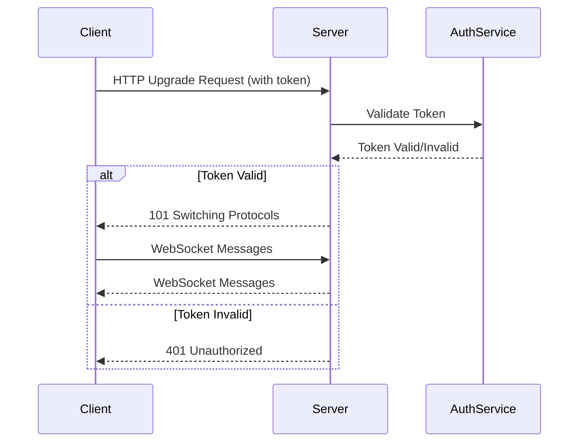
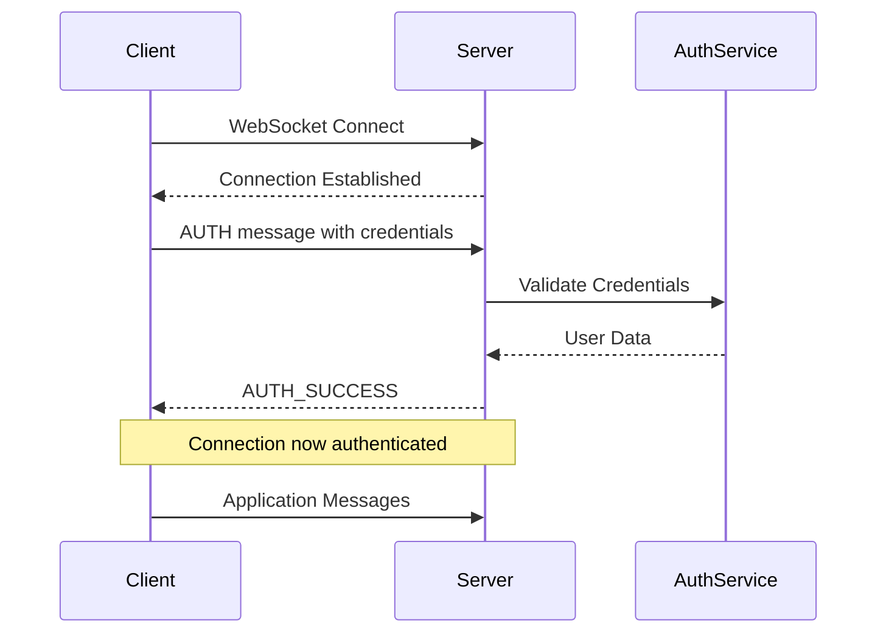
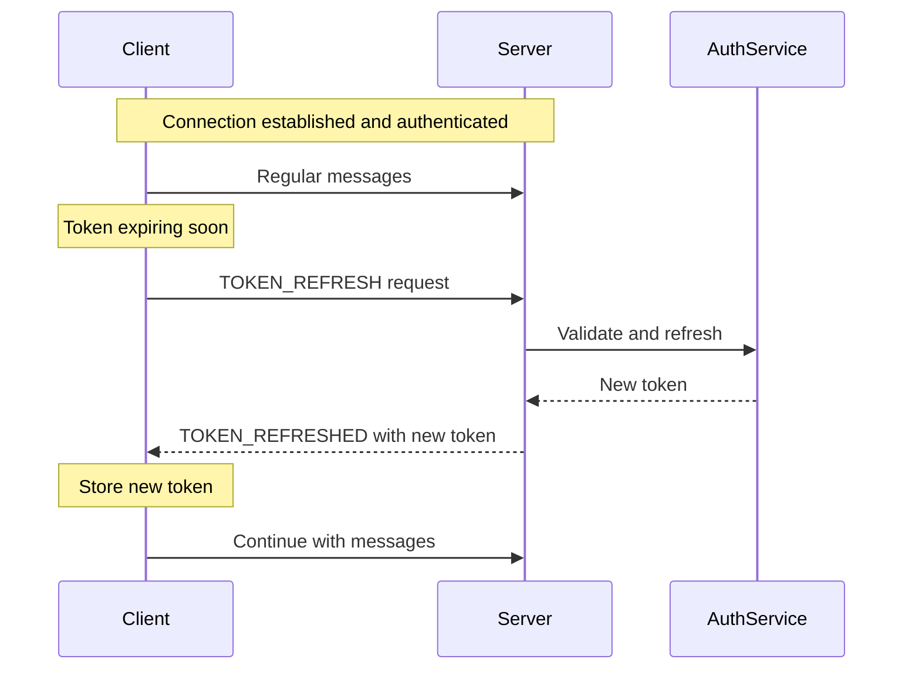
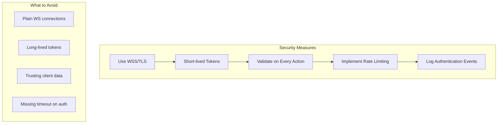

# How to Handle WebSocket Authentication

Author: [nawazdhandala](https://www.github.com/nawazdhandala)

Tags: WebSocket, Authentication, Security, JavaScript, Node.js, Real-time

Description: A practical guide to implementing secure authentication for WebSocket connections using tokens, cookies, and custom handshake protocols.

---

WebSocket connections present unique authentication challenges compared to traditional HTTP requests. Unlike REST APIs where you can include authentication headers in every request, WebSocket connections are long-lived and require authentication during the initial handshake or immediately after connection establishment. This guide covers practical approaches to securing your WebSocket connections.

## Understanding WebSocket Authentication Flow

The WebSocket protocol starts with an HTTP upgrade request, which means you have limited opportunities to authenticate the connection. Here is a typical authentication flow:



## Method 1: Query Parameter Authentication

The simplest approach is passing a token in the WebSocket URL query string. This works but has security implications since URLs may be logged.

```javascript
// Client-side: Connecting with token in query parameter
const token = localStorage.getItem('authToken');
const socket = new WebSocket(`wss://api.example.com/ws?token=${token}`);

socket.onopen = function() {
    console.log('Connected successfully');
};

socket.onerror = function(error) {
    console.error('Connection failed:', error);
};
```

```javascript
// Server-side: Node.js with ws library
const WebSocket = require('ws');
const url = require('url');
const jwt = require('jsonwebtoken');

const wss = new WebSocket.Server({ noServer: true });

// Handle upgrade request manually for authentication
const server = require('http').createServer();

server.on('upgrade', function(request, socket, head) {
    // Parse the URL to extract query parameters
    const parsedUrl = url.parse(request.url, true);
    const token = parsedUrl.query.token;

    if (!token) {
        // No token provided - reject connection
        socket.write('HTTP/1.1 401 Unauthorized\r\n\r\n');
        socket.destroy();
        return;
    }

    // Verify the JWT token
    jwt.verify(token, process.env.JWT_SECRET, function(err, decoded) {
        if (err) {
            // Invalid token - reject connection
            socket.write('HTTP/1.1 401 Unauthorized\r\n\r\n');
            socket.destroy();
            return;
        }

        // Token valid - complete the WebSocket upgrade
        wss.handleUpgrade(request, socket, head, function(ws) {
            // Attach user info to the socket for later use
            ws.userId = decoded.userId;
            ws.userRole = decoded.role;
            wss.emit('connection', ws, request);
        });
    });
});

wss.on('connection', function(ws, request) {
    console.log(`User ${ws.userId} connected`);

    ws.on('message', function(message) {
        // Handle messages with user context available
        console.log(`Message from user ${ws.userId}: ${message}`);
    });
});

server.listen(8080);
```

## Method 2: Cookie-Based Authentication

For web applications that already use cookie-based sessions, you can leverage existing cookies during the WebSocket handshake.

```javascript
// Server-side: Using cookies for authentication
const WebSocket = require('ws');
const cookie = require('cookie');
const sessionStore = require('./sessionStore');

const wss = new WebSocket.Server({ noServer: true });

server.on('upgrade', async function(request, socket, head) {
    // Parse cookies from the upgrade request
    const cookies = cookie.parse(request.headers.cookie || '');
    const sessionId = cookies.sessionId;

    if (!sessionId) {
        socket.write('HTTP/1.1 401 Unauthorized\r\n\r\n');
        socket.destroy();
        return;
    }

    try {
        // Validate session against your session store
        const session = await sessionStore.get(sessionId);

        if (!session || session.expired) {
            socket.write('HTTP/1.1 401 Unauthorized\r\n\r\n');
            socket.destroy();
            return;
        }

        // Session valid - proceed with upgrade
        wss.handleUpgrade(request, socket, head, function(ws) {
            ws.session = session;
            ws.userId = session.userId;
            wss.emit('connection', ws, request);
        });
    } catch (error) {
        console.error('Session validation error:', error);
        socket.write('HTTP/1.1 500 Internal Server Error\r\n\r\n');
        socket.destroy();
    }
});
```

## Method 3: Post-Connection Authentication

Sometimes you need to authenticate after the connection is established. This is useful when the authentication flow is complex or requires multiple steps.



```javascript
// Client-side: Post-connection authentication
class AuthenticatedWebSocket {
    constructor(url, token) {
        this.url = url;
        this.token = token;
        this.authenticated = false;
        this.messageQueue = [];
        this.connect();
    }

    connect() {
        this.socket = new WebSocket(this.url);

        this.socket.onopen = () => {
            // Send authentication message immediately after connection
            this.socket.send(JSON.stringify({
                type: 'AUTH',
                token: this.token
            }));
        };

        this.socket.onmessage = (event) => {
            const message = JSON.parse(event.data);

            if (message.type === 'AUTH_SUCCESS') {
                this.authenticated = true;
                console.log('Authentication successful');
                // Send any queued messages
                this.flushQueue();
            } else if (message.type === 'AUTH_FAILURE') {
                console.error('Authentication failed:', message.reason);
                this.socket.close();
            } else {
                // Handle regular messages
                this.onMessage(message);
            }
        };
    }

    send(data) {
        if (!this.authenticated) {
            // Queue messages until authenticated
            this.messageQueue.push(data);
            return;
        }
        this.socket.send(JSON.stringify(data));
    }

    flushQueue() {
        while (this.messageQueue.length > 0) {
            const message = this.messageQueue.shift();
            this.socket.send(JSON.stringify(message));
        }
    }

    onMessage(message) {
        // Override this method to handle messages
        console.log('Received:', message);
    }
}

// Usage
const ws = new AuthenticatedWebSocket('wss://api.example.com/ws', 'your-jwt-token');
```

```javascript
// Server-side: Handling post-connection authentication
const WebSocket = require('ws');
const jwt = require('jsonwebtoken');

const wss = new WebSocket.Server({ port: 8080 });

// Track unauthenticated connections with timeout
const AUTH_TIMEOUT = 10000; // 10 seconds to authenticate

wss.on('connection', function(ws) {
    ws.authenticated = false;
    ws.userId = null;

    // Set authentication timeout
    const authTimeout = setTimeout(() => {
        if (!ws.authenticated) {
            ws.send(JSON.stringify({
                type: 'AUTH_FAILURE',
                reason: 'Authentication timeout'
            }));
            ws.close(4001, 'Authentication timeout');
        }
    }, AUTH_TIMEOUT);

    ws.on('message', function(data) {
        const message = JSON.parse(data);

        if (message.type === 'AUTH') {
            // Handle authentication message
            jwt.verify(message.token, process.env.JWT_SECRET, function(err, decoded) {
                if (err) {
                    ws.send(JSON.stringify({
                        type: 'AUTH_FAILURE',
                        reason: 'Invalid token'
                    }));
                    ws.close(4002, 'Invalid token');
                    return;
                }

                // Authentication successful
                clearTimeout(authTimeout);
                ws.authenticated = true;
                ws.userId = decoded.userId;
                ws.userRole = decoded.role;

                ws.send(JSON.stringify({
                    type: 'AUTH_SUCCESS',
                    userId: ws.userId
                }));
            });
            return;
        }

        // Reject messages from unauthenticated connections
        if (!ws.authenticated) {
            ws.send(JSON.stringify({
                type: 'ERROR',
                message: 'Not authenticated'
            }));
            return;
        }

        // Handle authenticated messages
        handleMessage(ws, message);
    });
});

function handleMessage(ws, message) {
    // Process authenticated messages here
    console.log(`User ${ws.userId} sent: ${JSON.stringify(message)}`);
}
```

## Method 4: Subprotocol Authentication

You can use WebSocket subprotocols to pass authentication information during the handshake.

```javascript
// Client-side: Using subprotocol for auth
const token = 'your-jwt-token';
// Pass token as a subprotocol (base64 encoded to be safe)
const encodedToken = btoa(token);
const socket = new WebSocket('wss://api.example.com/ws', ['auth-' + encodedToken]);

socket.onopen = function() {
    console.log('Connected with protocol:', socket.protocol);
};
```

```javascript
// Server-side: Extracting auth from subprotocol
const WebSocket = require('ws');
const jwt = require('jsonwebtoken');

const wss = new WebSocket.Server({
    port: 8080,
    verifyClient: function(info, callback) {
        // Extract protocols from the upgrade request
        const protocols = info.req.headers['sec-websocket-protocol'];

        if (!protocols) {
            callback(false, 401, 'No authentication provided');
            return;
        }

        // Find the auth protocol
        const protocolList = protocols.split(',').map(p => p.trim());
        const authProtocol = protocolList.find(p => p.startsWith('auth-'));

        if (!authProtocol) {
            callback(false, 401, 'No auth protocol found');
            return;
        }

        // Extract and decode the token
        const encodedToken = authProtocol.substring(5); // Remove 'auth-' prefix
        const token = Buffer.from(encodedToken, 'base64').toString();

        jwt.verify(token, process.env.JWT_SECRET, function(err, decoded) {
            if (err) {
                callback(false, 401, 'Invalid token');
                return;
            }

            // Store decoded info for later use
            info.req.userId = decoded.userId;
            info.req.userRole = decoded.role;
            callback(true);
        });
    }
});

wss.on('connection', function(ws, request) {
    ws.userId = request.userId;
    ws.userRole = request.userRole;
    console.log(`User ${ws.userId} connected`);
});
```

## Token Refresh Handling

Long-lived WebSocket connections may outlive the authentication token. Implement token refresh to maintain the connection.



```javascript
// Client-side: Token refresh handling
class WebSocketWithTokenRefresh {
    constructor(url, token, refreshToken) {
        this.url = url;
        this.token = token;
        this.refreshToken = refreshToken;
        this.tokenExpiry = this.getTokenExpiry(token);
        this.connect();
        this.startRefreshTimer();
    }

    getTokenExpiry(token) {
        // Decode JWT to get expiry (without verification)
        const payload = JSON.parse(atob(token.split('.')[1]));
        return payload.exp * 1000; // Convert to milliseconds
    }

    startRefreshTimer() {
        // Refresh token 5 minutes before expiry
        const refreshTime = this.tokenExpiry - Date.now() - (5 * 60 * 1000);

        if (refreshTime > 0) {
            this.refreshTimer = setTimeout(() => {
                this.refreshTokenNow();
            }, refreshTime);
        }
    }

    refreshTokenNow() {
        this.socket.send(JSON.stringify({
            type: 'TOKEN_REFRESH',
            refreshToken: this.refreshToken
        }));
    }

    connect() {
        this.socket = new WebSocket(`${this.url}?token=${this.token}`);

        this.socket.onmessage = (event) => {
            const message = JSON.parse(event.data);

            if (message.type === 'TOKEN_REFRESHED') {
                // Update stored tokens
                this.token = message.token;
                this.refreshToken = message.refreshToken;
                this.tokenExpiry = this.getTokenExpiry(message.token);
                // Store new tokens
                localStorage.setItem('authToken', message.token);
                localStorage.setItem('refreshToken', message.refreshToken);
                // Schedule next refresh
                this.startRefreshTimer();
            } else if (message.type === 'TOKEN_REFRESH_FAILED') {
                console.error('Token refresh failed, need to re-authenticate');
                this.socket.close();
                // Redirect to login or trigger re-authentication
            } else {
                this.onMessage(message);
            }
        };
    }

    onMessage(message) {
        console.log('Received:', message);
    }
}
```

## Security Best Practices

Here is a summary of authentication security best practices for WebSocket connections:



```javascript
// Server-side: Complete security implementation
const WebSocket = require('ws');
const jwt = require('jsonwebtoken');
const rateLimit = require('./rateLimit');

const wss = new WebSocket.Server({ noServer: true });

// Connection tracking for rate limiting
const connectionCounts = new Map();

server.on('upgrade', async function(request, socket, head) {
    const clientIP = request.socket.remoteAddress;

    // Rate limit connections per IP
    const currentCount = connectionCounts.get(clientIP) || 0;
    if (currentCount >= 10) {
        socket.write('HTTP/1.1 429 Too Many Requests\r\n\r\n');
        socket.destroy();
        return;
    }

    // Extract and validate token
    const parsedUrl = new URL(request.url, 'wss://localhost');
    const token = parsedUrl.searchParams.get('token');

    if (!token) {
        socket.write('HTTP/1.1 401 Unauthorized\r\n\r\n');
        socket.destroy();
        logAuthEvent('MISSING_TOKEN', clientIP);
        return;
    }

    try {
        const decoded = jwt.verify(token, process.env.JWT_SECRET, {
            algorithms: ['HS256'], // Specify allowed algorithms
            maxAge: '1h' // Reject tokens older than 1 hour
        });

        // Check if token is in revocation list
        const isRevoked = await checkTokenRevocation(decoded.jti);
        if (isRevoked) {
            socket.write('HTTP/1.1 401 Unauthorized\r\n\r\n');
            socket.destroy();
            logAuthEvent('REVOKED_TOKEN', clientIP, decoded.userId);
            return;
        }

        // Upgrade connection
        wss.handleUpgrade(request, socket, head, function(ws) {
            ws.userId = decoded.userId;
            ws.userRole = decoded.role;
            ws.tokenId = decoded.jti;
            ws.clientIP = clientIP;

            // Update connection count
            connectionCounts.set(clientIP, currentCount + 1);

            logAuthEvent('CONNECTION_SUCCESS', clientIP, decoded.userId);
            wss.emit('connection', ws, request);
        });
    } catch (error) {
        socket.write('HTTP/1.1 401 Unauthorized\r\n\r\n');
        socket.destroy();
        logAuthEvent('INVALID_TOKEN', clientIP, null, error.message);
    }
});

wss.on('connection', function(ws) {
    ws.on('close', function() {
        // Update connection count on disconnect
        const currentCount = connectionCounts.get(ws.clientIP) || 1;
        connectionCounts.set(ws.clientIP, currentCount - 1);
    });

    ws.on('message', function(data) {
        // Validate permissions for each action
        const message = JSON.parse(data);

        if (!hasPermission(ws.userRole, message.action)) {
            ws.send(JSON.stringify({
                type: 'ERROR',
                message: 'Insufficient permissions'
            }));
            return;
        }

        handleMessage(ws, message);
    });
});

function logAuthEvent(event, ip, userId = null, details = null) {
    console.log(JSON.stringify({
        timestamp: new Date().toISOString(),
        event: event,
        ip: ip,
        userId: userId,
        details: details
    }));
}

function hasPermission(role, action) {
    const permissions = {
        admin: ['read', 'write', 'delete', 'admin'],
        user: ['read', 'write'],
        guest: ['read']
    };
    return permissions[role]?.includes(action) || false;
}

async function checkTokenRevocation(tokenId) {
    // Check against your token revocation store (Redis, database, etc.)
    // Return true if token is revoked
    return false;
}
```

## Summary

Securing WebSocket connections requires careful consideration of when and how to authenticate. The four main approaches are:

1. Query parameter authentication: Simple but tokens may be logged
2. Cookie-based authentication: Works well with existing session infrastructure
3. Post-connection authentication: Flexible but requires message queuing
4. Subprotocol authentication: Clean but less commonly used

Choose the method that best fits your application architecture, and always implement proper token refresh handling for long-lived connections. Remember to use WSS (WebSocket Secure) in production and implement rate limiting to prevent abuse.
