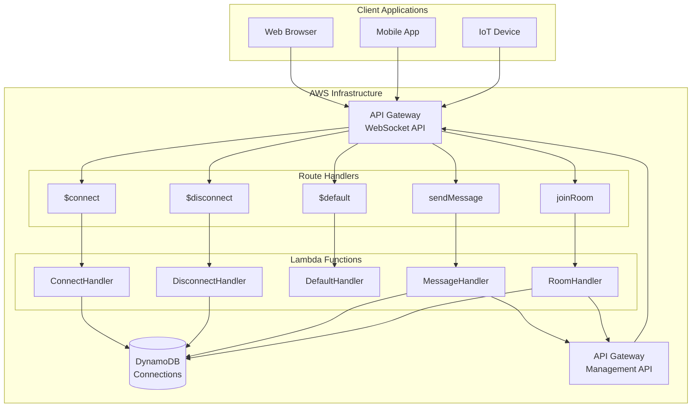
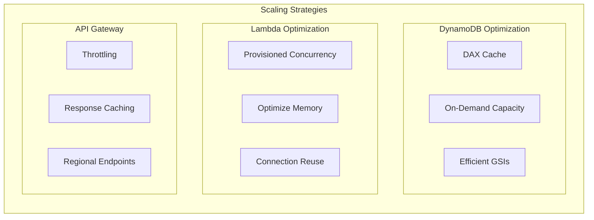

# How to Configure WebSocket with AWS API Gateway

Author: [nawazdhandala](https://www.github.com/nawazdhandala)

Tags: WebSocket, AWS, API Gateway, Lambda, Serverless, Cloud, Real-time

Description: Learn how to set up and configure WebSocket APIs with AWS API Gateway, including Lambda integrations, connection management, and scaling considerations.

---

AWS API Gateway WebSocket APIs enable you to build real-time, bidirectional communication applications without managing WebSocket servers. API Gateway handles connection management, routing, and scaling automatically, while Lambda functions process messages. This serverless approach eliminates the operational overhead of maintaining persistent connections across multiple servers.

WebSocket APIs on API Gateway work differently from REST APIs. Instead of request-response cycles, you define routes that handle different message types: $connect for new connections, $disconnect for closed connections, and custom routes for application messages. Each route can trigger a Lambda function or integrate with other AWS services.

In this guide, you will learn how to configure a WebSocket API from scratch, implement Lambda handlers for connection lifecycle events, broadcast messages to connected clients, and handle common production challenges like connection state management and scaling.

## WebSocket API Architecture

Understanding the architecture helps you design effective WebSocket applications on AWS.



## Creating the WebSocket API

Start by creating the WebSocket API using AWS CLI or CloudFormation. Here is the CloudFormation template.

```yaml
# websocket-api.yaml
# CloudFormation template for WebSocket API

AWSTemplateFormatVersion: '2010-09-09'
Description: WebSocket API with Lambda integrations

Parameters:
  Environment:
    Type: String
    Default: dev
    AllowedValues:
      - dev
      - staging
      - prod

Resources:
  # WebSocket API
  WebSocketApi:
    Type: AWS::ApiGatewayV2::Api
    Properties:
      Name: !Sub '${Environment}-websocket-api'
      ProtocolType: WEBSOCKET
      RouteSelectionExpression: '$request.body.action'
      Description: WebSocket API for real-time communication

  # API Stage
  WebSocketStage:
    Type: AWS::ApiGatewayV2::Stage
    Properties:
      ApiId: !Ref WebSocketApi
      StageName: !Ref Environment
      AutoDeploy: true
      DefaultRouteSettings:
        ThrottlingBurstLimit: 500
        ThrottlingRateLimit: 1000

  # DynamoDB table for connection tracking
  ConnectionsTable:
    Type: AWS::DynamoDB::Table
    Properties:
      TableName: !Sub '${Environment}-websocket-connections'
      BillingMode: PAY_PER_REQUEST
      AttributeDefinitions:
        - AttributeName: connectionId
          AttributeType: S
        - AttributeName: roomId
          AttributeType: S
      KeySchema:
        - AttributeName: connectionId
          KeyType: HASH
      GlobalSecondaryIndexes:
        - IndexName: roomId-index
          KeySchema:
            - AttributeName: roomId
              KeyType: HASH
          Projection:
            ProjectionType: ALL
      TimeToLiveSpecification:
        AttributeName: ttl
        Enabled: true

  # Lambda execution role
  LambdaExecutionRole:
    Type: AWS::IAM::Role
    Properties:
      RoleName: !Sub '${Environment}-websocket-lambda-role'
      AssumeRolePolicyDocument:
        Version: '2012-10-17'
        Statement:
          - Effect: Allow
            Principal:
              Service: lambda.amazonaws.com
            Action: sts:AssumeRole
      ManagedPolicyArns:
        - arn:aws:iam::aws:policy/service-role/AWSLambdaBasicExecutionRole
      Policies:
        - PolicyName: WebSocketPolicy
          PolicyDocument:
            Version: '2012-10-17'
            Statement:
              - Effect: Allow
                Action:
                  - dynamodb:PutItem
                  - dynamodb:GetItem
                  - dynamodb:DeleteItem
                  - dynamodb:Query
                  - dynamodb:Scan
                Resource:
                  - !GetAtt ConnectionsTable.Arn
                  - !Sub '${ConnectionsTable.Arn}/index/*'
              - Effect: Allow
                Action:
                  - execute-api:ManageConnections
                Resource:
                  - !Sub 'arn:aws:execute-api:${AWS::Region}:${AWS::AccountId}:${WebSocketApi}/*'

  # Connect Lambda
  ConnectFunction:
    Type: AWS::Lambda::Function
    Properties:
      FunctionName: !Sub '${Environment}-websocket-connect'
      Runtime: nodejs20.x
      Handler: index.handler
      Role: !GetAtt LambdaExecutionRole.Arn
      Environment:
        Variables:
          CONNECTIONS_TABLE: !Ref ConnectionsTable
      Code:
        ZipFile: |
          // Placeholder - deploy actual code separately
          exports.handler = async (event) => {
            return { statusCode: 200, body: 'Connected' };
          };

  # Disconnect Lambda
  DisconnectFunction:
    Type: AWS::Lambda::Function
    Properties:
      FunctionName: !Sub '${Environment}-websocket-disconnect'
      Runtime: nodejs20.x
      Handler: index.handler
      Role: !GetAtt LambdaExecutionRole.Arn
      Environment:
        Variables:
          CONNECTIONS_TABLE: !Ref ConnectionsTable
      Code:
        ZipFile: |
          exports.handler = async (event) => {
            return { statusCode: 200, body: 'Disconnected' };
          };

  # Message Lambda
  MessageFunction:
    Type: AWS::Lambda::Function
    Properties:
      FunctionName: !Sub '${Environment}-websocket-message'
      Runtime: nodejs20.x
      Handler: index.handler
      Role: !GetAtt LambdaExecutionRole.Arn
      Timeout: 30
      Environment:
        Variables:
          CONNECTIONS_TABLE: !Ref ConnectionsTable
          WEBSOCKET_ENDPOINT: !Sub 'https://${WebSocketApi}.execute-api.${AWS::Region}.amazonaws.com/${Environment}'
      Code:
        ZipFile: |
          exports.handler = async (event) => {
            return { statusCode: 200, body: 'Message received' };
          };

  # Route integrations
  ConnectIntegration:
    Type: AWS::ApiGatewayV2::Integration
    Properties:
      ApiId: !Ref WebSocketApi
      IntegrationType: AWS_PROXY
      IntegrationUri: !Sub 'arn:aws:apigateway:${AWS::Region}:lambda:path/2015-03-31/functions/${ConnectFunction.Arn}/invocations'

  DisconnectIntegration:
    Type: AWS::ApiGatewayV2::Integration
    Properties:
      ApiId: !Ref WebSocketApi
      IntegrationType: AWS_PROXY
      IntegrationUri: !Sub 'arn:aws:apigateway:${AWS::Region}:lambda:path/2015-03-31/functions/${DisconnectFunction.Arn}/invocations'

  MessageIntegration:
    Type: AWS::ApiGatewayV2::Integration
    Properties:
      ApiId: !Ref WebSocketApi
      IntegrationType: AWS_PROXY
      IntegrationUri: !Sub 'arn:aws:apigateway:${AWS::Region}:lambda:path/2015-03-31/functions/${MessageFunction.Arn}/invocations'

  # Routes
  ConnectRoute:
    Type: AWS::ApiGatewayV2::Route
    Properties:
      ApiId: !Ref WebSocketApi
      RouteKey: $connect
      AuthorizationType: NONE
      Target: !Sub 'integrations/${ConnectIntegration}'

  DisconnectRoute:
    Type: AWS::ApiGatewayV2::Route
    Properties:
      ApiId: !Ref WebSocketApi
      RouteKey: $disconnect
      Target: !Sub 'integrations/${DisconnectIntegration}'

  SendMessageRoute:
    Type: AWS::ApiGatewayV2::Route
    Properties:
      ApiId: !Ref WebSocketApi
      RouteKey: sendMessage
      Target: !Sub 'integrations/${MessageIntegration}'

  DefaultRoute:
    Type: AWS::ApiGatewayV2::Route
    Properties:
      ApiId: !Ref WebSocketApi
      RouteKey: $default
      Target: !Sub 'integrations/${MessageIntegration}'

  # Lambda permissions
  ConnectPermission:
    Type: AWS::Lambda::Permission
    Properties:
      Action: lambda:InvokeFunction
      FunctionName: !Ref ConnectFunction
      Principal: apigateway.amazonaws.com
      SourceArn: !Sub 'arn:aws:execute-api:${AWS::Region}:${AWS::AccountId}:${WebSocketApi}/*/$connect'

  DisconnectPermission:
    Type: AWS::Lambda::Permission
    Properties:
      Action: lambda:InvokeFunction
      FunctionName: !Ref DisconnectFunction
      Principal: apigateway.amazonaws.com
      SourceArn: !Sub 'arn:aws:execute-api:${AWS::Region}:${AWS::AccountId}:${WebSocketApi}/*/$disconnect'

  MessagePermission:
    Type: AWS::Lambda::Permission
    Properties:
      Action: lambda:InvokeFunction
      FunctionName: !Ref MessageFunction
      Principal: apigateway.amazonaws.com
      SourceArn: !Sub 'arn:aws:execute-api:${AWS::Region}:${AWS::AccountId}:${WebSocketApi}/*'

Outputs:
  WebSocketUrl:
    Description: WebSocket URL
    Value: !Sub 'wss://${WebSocketApi}.execute-api.${AWS::Region}.amazonaws.com/${Environment}'

  ConnectionsTableName:
    Description: DynamoDB table for connections
    Value: !Ref ConnectionsTable
```

## Lambda Handler Implementations

Now let us implement the Lambda functions that handle WebSocket events.

### Connect Handler

The connect handler runs when a client establishes a WebSocket connection. Store the connection ID for later use.

```javascript
// connect/index.js
// Lambda handler for $connect route

const { DynamoDBClient } = require('@aws-sdk/client-dynamodb');
const { DynamoDBDocumentClient, PutCommand } = require('@aws-sdk/lib-dynamodb');

const client = new DynamoDBClient({});
const docClient = DynamoDBDocumentClient.from(client);

const CONNECTIONS_TABLE = process.env.CONNECTIONS_TABLE;

exports.handler = async (event) => {
    console.log('Connect event:', JSON.stringify(event, null, 2));

    const connectionId = event.requestContext.connectionId;
    const timestamp = Date.now();

    // Extract query parameters for authentication
    const queryParams = event.queryStringParameters || {};
    const userId = queryParams.userId;
    const token = queryParams.token;

    // Validate authentication if required
    if (token) {
        try {
            // Validate token - replace with your auth logic
            const isValid = await validateToken(token);
            if (!isValid) {
                console.log('Invalid token for connection:', connectionId);
                return {
                    statusCode: 401,
                    body: 'Unauthorized'
                };
            }
        } catch (err) {
            console.error('Token validation error:', err);
            return {
                statusCode: 401,
                body: 'Unauthorized'
            };
        }
    }

    // Store connection in DynamoDB
    const connectionItem = {
        connectionId: connectionId,
        userId: userId || 'anonymous',
        connectedAt: timestamp,
        ttl: Math.floor(timestamp / 1000) + (24 * 60 * 60), // 24 hour TTL
        sourceIp: event.requestContext.identity?.sourceIp,
        userAgent: event.requestContext.identity?.userAgent
    };

    try {
        await docClient.send(new PutCommand({
            TableName: CONNECTIONS_TABLE,
            Item: connectionItem
        }));

        console.log('Connection stored:', connectionId);

        return {
            statusCode: 200,
            body: 'Connected'
        };
    } catch (err) {
        console.error('Failed to store connection:', err);
        return {
            statusCode: 500,
            body: 'Failed to connect'
        };
    }
};

async function validateToken(token) {
    // Implement your token validation logic
    // For example, verify JWT or check against auth service
    return true;
}
```

### Disconnect Handler

The disconnect handler cleans up when a connection closes.

```javascript
// disconnect/index.js
// Lambda handler for $disconnect route

const { DynamoDBClient } = require('@aws-sdk/client-dynamodb');
const { DynamoDBDocumentClient, DeleteCommand, GetCommand } = require('@aws-sdk/lib-dynamodb');

const client = new DynamoDBClient({});
const docClient = DynamoDBDocumentClient.from(client);

const CONNECTIONS_TABLE = process.env.CONNECTIONS_TABLE;

exports.handler = async (event) => {
    console.log('Disconnect event:', JSON.stringify(event, null, 2));

    const connectionId = event.requestContext.connectionId;

    try {
        // Get connection info before deleting (for logging or notifications)
        const getResult = await docClient.send(new GetCommand({
            TableName: CONNECTIONS_TABLE,
            Key: { connectionId }
        }));

        const connection = getResult.Item;

        if (connection) {
            console.log('Disconnecting user:', connection.userId);

            // Notify room members if user was in a room
            if (connection.roomId) {
                await notifyRoomOfDisconnect(connection);
            }
        }

        // Delete connection record
        await docClient.send(new DeleteCommand({
            TableName: CONNECTIONS_TABLE,
            Key: { connectionId }
        }));

        console.log('Connection removed:', connectionId);

        return {
            statusCode: 200,
            body: 'Disconnected'
        };
    } catch (err) {
        console.error('Disconnect error:', err);
        // Return success anyway - connection is gone
        return {
            statusCode: 200,
            body: 'Disconnected'
        };
    }
};

async function notifyRoomOfDisconnect(connection) {
    // Implement room notification logic
    console.log(`User ${connection.userId} left room ${connection.roomId}`);
}
```

### Message Handler

The message handler processes incoming messages and can broadcast to other connections.

```javascript
// message/index.js
// Lambda handler for message routes

const { DynamoDBClient } = require('@aws-sdk/client-dynamodb');
const { DynamoDBDocumentClient, QueryCommand, UpdateCommand, GetCommand } = require('@aws-sdk/lib-dynamodb');
const { ApiGatewayManagementApiClient, PostToConnectionCommand, DeleteConnectionCommand } = require('@aws-sdk/client-apigatewaymanagementapi');

const dynamoClient = new DynamoDBClient({});
const docClient = DynamoDBDocumentClient.from(dynamoClient);

const CONNECTIONS_TABLE = process.env.CONNECTIONS_TABLE;
const WEBSOCKET_ENDPOINT = process.env.WEBSOCKET_ENDPOINT;

// Create API Gateway management client
let apiGatewayClient;

function getApiGatewayClient(endpoint) {
    if (!apiGatewayClient) {
        apiGatewayClient = new ApiGatewayManagementApiClient({
            endpoint: endpoint.replace('wss://', 'https://')
        });
    }
    return apiGatewayClient;
}

exports.handler = async (event) => {
    console.log('Message event:', JSON.stringify(event, null, 2));

    const connectionId = event.requestContext.connectionId;
    const endpoint = WEBSOCKET_ENDPOINT ||
        `https://${event.requestContext.domainName}/${event.requestContext.stage}`;

    let body;
    try {
        body = JSON.parse(event.body);
    } catch (err) {
        return sendError(connectionId, endpoint, 'Invalid JSON');
    }

    const action = body.action || event.requestContext.routeKey;

    try {
        switch (action) {
            case 'sendMessage':
                return await handleSendMessage(connectionId, endpoint, body);

            case 'joinRoom':
                return await handleJoinRoom(connectionId, endpoint, body);

            case 'leaveRoom':
                return await handleLeaveRoom(connectionId, endpoint, body);

            case 'ping':
                return await handlePing(connectionId, endpoint);

            default:
                return sendError(connectionId, endpoint, `Unknown action: ${action}`);
        }
    } catch (err) {
        console.error('Handler error:', err);
        return sendError(connectionId, endpoint, 'Internal error');
    }
};

async function handleSendMessage(connectionId, endpoint, body) {
    const { roomId, message } = body;

    if (!roomId || !message) {
        return sendError(connectionId, endpoint, 'roomId and message required');
    }

    // Get sender info
    const senderResult = await docClient.send(new GetCommand({
        TableName: CONNECTIONS_TABLE,
        Key: { connectionId }
    }));

    const sender = senderResult.Item;
    if (!sender || sender.roomId !== roomId) {
        return sendError(connectionId, endpoint, 'Not in room');
    }

    // Get all connections in the room
    const roomConnections = await docClient.send(new QueryCommand({
        TableName: CONNECTIONS_TABLE,
        IndexName: 'roomId-index',
        KeyConditionExpression: 'roomId = :roomId',
        ExpressionAttributeValues: {
            ':roomId': roomId
        }
    }));

    // Broadcast message to all room members
    const messagePayload = {
        action: 'message',
        roomId,
        message,
        sender: sender.userId,
        timestamp: Date.now()
    };

    await broadcastToConnections(
        endpoint,
        roomConnections.Items,
        messagePayload
    );

    return { statusCode: 200, body: 'Message sent' };
}

async function handleJoinRoom(connectionId, endpoint, body) {
    const { roomId } = body;

    if (!roomId) {
        return sendError(connectionId, endpoint, 'roomId required');
    }

    // Update connection with room
    await docClient.send(new UpdateCommand({
        TableName: CONNECTIONS_TABLE,
        Key: { connectionId },
        UpdateExpression: 'SET roomId = :roomId',
        ExpressionAttributeValues: {
            ':roomId': roomId
        }
    }));

    // Notify room members
    const roomConnections = await docClient.send(new QueryCommand({
        TableName: CONNECTIONS_TABLE,
        IndexName: 'roomId-index',
        KeyConditionExpression: 'roomId = :roomId',
        ExpressionAttributeValues: {
            ':roomId': roomId
        }
    }));

    // Get user info
    const userResult = await docClient.send(new GetCommand({
        TableName: CONNECTIONS_TABLE,
        Key: { connectionId }
    }));

    const user = userResult.Item;

    // Broadcast join notification
    await broadcastToConnections(
        endpoint,
        roomConnections.Items,
        {
            action: 'userJoined',
            roomId,
            userId: user?.userId,
            timestamp: Date.now()
        },
        connectionId // exclude sender
    );

    // Send confirmation to joiner
    await sendToConnection(endpoint, connectionId, {
        action: 'joinedRoom',
        roomId,
        members: roomConnections.Items.map(c => c.userId)
    });

    return { statusCode: 200, body: 'Joined room' };
}

async function handleLeaveRoom(connectionId, endpoint, body) {
    const { roomId } = body;

    // Get current room before leaving
    const userResult = await docClient.send(new GetCommand({
        TableName: CONNECTIONS_TABLE,
        Key: { connectionId }
    }));

    const user = userResult.Item;
    const currentRoom = user?.roomId;

    // Remove from room
    await docClient.send(new UpdateCommand({
        TableName: CONNECTIONS_TABLE,
        Key: { connectionId },
        UpdateExpression: 'REMOVE roomId'
    }));

    // Notify room members
    if (currentRoom) {
        const roomConnections = await docClient.send(new QueryCommand({
            TableName: CONNECTIONS_TABLE,
            IndexName: 'roomId-index',
            KeyConditionExpression: 'roomId = :roomId',
            ExpressionAttributeValues: {
                ':roomId': currentRoom
            }
        }));

        await broadcastToConnections(
            endpoint,
            roomConnections.Items,
            {
                action: 'userLeft',
                roomId: currentRoom,
                userId: user?.userId,
                timestamp: Date.now()
            }
        );
    }

    return { statusCode: 200, body: 'Left room' };
}

async function handlePing(connectionId, endpoint) {
    await sendToConnection(endpoint, connectionId, {
        action: 'pong',
        timestamp: Date.now()
    });

    return { statusCode: 200, body: 'Pong' };
}

async function broadcastToConnections(endpoint, connections, payload, excludeConnectionId = null) {
    const client = getApiGatewayClient(endpoint);
    const message = JSON.stringify(payload);

    const sendPromises = connections
        .filter(conn => conn.connectionId !== excludeConnectionId)
        .map(async (conn) => {
            try {
                await client.send(new PostToConnectionCommand({
                    ConnectionId: conn.connectionId,
                    Data: message
                }));
            } catch (err) {
                if (err.statusCode === 410) {
                    // Connection is stale, remove it
                    console.log('Removing stale connection:', conn.connectionId);
                    await docClient.send(new DeleteCommand({
                        TableName: CONNECTIONS_TABLE,
                        Key: { connectionId: conn.connectionId }
                    }));
                } else {
                    console.error('Send error:', err);
                }
            }
        });

    await Promise.all(sendPromises);
}

async function sendToConnection(endpoint, connectionId, payload) {
    const client = getApiGatewayClient(endpoint);

    try {
        await client.send(new PostToConnectionCommand({
            ConnectionId: connectionId,
            Data: JSON.stringify(payload)
        }));
    } catch (err) {
        if (err.statusCode === 410) {
            // Connection is gone
            await docClient.send(new DeleteCommand({
                TableName: CONNECTIONS_TABLE,
                Key: { connectionId }
            }));
        }
        throw err;
    }
}

async function sendError(connectionId, endpoint, message) {
    try {
        await sendToConnection(endpoint, connectionId, {
            action: 'error',
            message,
            timestamp: Date.now()
        });
    } catch (err) {
        console.error('Failed to send error:', err);
    }

    return { statusCode: 400, body: message };
}
```

## Connection Management Patterns

Managing connections in a serverless environment requires careful consideration of stale connections and distributed state.

```javascript
// connection-manager.js
// Utilities for managing WebSocket connections

const { DynamoDBClient } = require('@aws-sdk/client-dynamodb');
const { DynamoDBDocumentClient, ScanCommand, DeleteCommand, BatchWriteCommand } = require('@aws-sdk/lib-dynamodb');
const { ApiGatewayManagementApiClient, GetConnectionCommand } = require('@aws-sdk/client-apigatewaymanagementapi');

const dynamoClient = new DynamoDBClient({});
const docClient = DynamoDBDocumentClient.from(dynamoClient);

class ConnectionManager {
    constructor(tableName, websocketEndpoint) {
        this.tableName = tableName;
        this.endpoint = websocketEndpoint;
        this.apiGatewayClient = new ApiGatewayManagementApiClient({
            endpoint: websocketEndpoint.replace('wss://', 'https://')
        });
    }

    // Verify if a connection is still active
    async isConnectionActive(connectionId) {
        try {
            await this.apiGatewayClient.send(new GetConnectionCommand({
                ConnectionId: connectionId
            }));
            return true;
        } catch (err) {
            if (err.statusCode === 410) {
                return false;
            }
            throw err;
        }
    }

    // Clean up stale connections
    async cleanupStaleConnections() {
        const scanResult = await docClient.send(new ScanCommand({
            TableName: this.tableName,
            ProjectionExpression: 'connectionId'
        }));

        const staleConnections = [];

        // Check each connection
        for (const item of scanResult.Items || []) {
            const isActive = await this.isConnectionActive(item.connectionId);
            if (!isActive) {
                staleConnections.push(item.connectionId);
            }
        }

        // Delete stale connections in batches
        if (staleConnections.length > 0) {
            await this.deleteConnections(staleConnections);
        }

        return {
            checked: scanResult.Items?.length || 0,
            removed: staleConnections.length
        };
    }

    // Delete multiple connections
    async deleteConnections(connectionIds) {
        // DynamoDB BatchWrite supports max 25 items
        const batches = [];
        for (let i = 0; i < connectionIds.length; i += 25) {
            batches.push(connectionIds.slice(i, i + 25));
        }

        for (const batch of batches) {
            await docClient.send(new BatchWriteCommand({
                RequestItems: {
                    [this.tableName]: batch.map(id => ({
                        DeleteRequest: {
                            Key: { connectionId: id }
                        }
                    }))
                }
            }));
        }
    }

    // Get connection statistics
    async getStats() {
        let totalConnections = 0;
        let roomCounts = {};
        let lastKey;

        do {
            const result = await docClient.send(new ScanCommand({
                TableName: this.tableName,
                ExclusiveStartKey: lastKey,
                ProjectionExpression: 'connectionId, roomId, connectedAt'
            }));

            totalConnections += result.Items?.length || 0;

            for (const item of result.Items || []) {
                if (item.roomId) {
                    roomCounts[item.roomId] = (roomCounts[item.roomId] || 0) + 1;
                }
            }

            lastKey = result.LastEvaluatedKey;
        } while (lastKey);

        return {
            totalConnections,
            roomCounts,
            timestamp: Date.now()
        };
    }
}

module.exports = { ConnectionManager };
```

## Scheduled Cleanup with EventBridge

Set up a scheduled Lambda to clean up stale connections.

```yaml
# cleanup-lambda.yaml
# Add to CloudFormation template

  CleanupFunction:
    Type: AWS::Lambda::Function
    Properties:
      FunctionName: !Sub '${Environment}-websocket-cleanup'
      Runtime: nodejs20.x
      Handler: index.handler
      Role: !GetAtt LambdaExecutionRole.Arn
      Timeout: 300
      Environment:
        Variables:
          CONNECTIONS_TABLE: !Ref ConnectionsTable
          WEBSOCKET_ENDPOINT: !Sub 'https://${WebSocketApi}.execute-api.${AWS::Region}.amazonaws.com/${Environment}'
      Code:
        ZipFile: |
          const { ConnectionManager } = require('./connection-manager');

          exports.handler = async (event) => {
            const manager = new ConnectionManager(
              process.env.CONNECTIONS_TABLE,
              process.env.WEBSOCKET_ENDPOINT
            );

            const result = await manager.cleanupStaleConnections();
            console.log('Cleanup result:', result);

            return result;
          };

  CleanupSchedule:
    Type: AWS::Events::Rule
    Properties:
      Name: !Sub '${Environment}-websocket-cleanup-schedule'
      Description: Clean up stale WebSocket connections
      ScheduleExpression: rate(5 minutes)
      State: ENABLED
      Targets:
        - Id: CleanupTarget
          Arn: !GetAtt CleanupFunction.Arn

  CleanupPermission:
    Type: AWS::Lambda::Permission
    Properties:
      Action: lambda:InvokeFunction
      FunctionName: !Ref CleanupFunction
      Principal: events.amazonaws.com
      SourceArn: !GetAtt CleanupSchedule.Arn
```

## Client Implementation

Here is a JavaScript client that connects to the AWS WebSocket API.

```javascript
// websocket-client.js
// Client for AWS API Gateway WebSocket

class AWSWebSocketClient {
    constructor(url, options = {}) {
        this.url = url;
        this.options = options;
        this.ws = null;
        this.reconnectAttempts = 0;
        this.maxReconnectAttempts = options.maxReconnectAttempts || 5;
        this.reconnectDelay = options.reconnectDelay || 1000;
        this.pingInterval = null;

        // Event handlers
        this.onOpen = options.onOpen || (() => {});
        this.onClose = options.onClose || (() => {});
        this.onMessage = options.onMessage || (() => {});
        this.onError = options.onError || (() => {});
    }

    connect(queryParams = {}) {
        // Build URL with query parameters
        const queryString = Object.entries(queryParams)
            .map(([key, value]) => `${key}=${encodeURIComponent(value)}`)
            .join('&');

        const fullUrl = queryString ? `${this.url}?${queryString}` : this.url;

        return new Promise((resolve, reject) => {
            try {
                this.ws = new WebSocket(fullUrl);
            } catch (err) {
                reject(err);
                return;
            }

            this.ws.onopen = () => {
                console.log('WebSocket connected');
                this.reconnectAttempts = 0;
                this.startPing();
                this.onOpen();
                resolve();
            };

            this.ws.onmessage = (event) => {
                try {
                    const data = JSON.parse(event.data);
                    this.handleMessage(data);
                } catch (err) {
                    console.error('Failed to parse message:', err);
                }
            };

            this.ws.onclose = (event) => {
                console.log('WebSocket closed:', event.code, event.reason);
                this.stopPing();
                this.onClose(event);

                if (this.shouldReconnect(event.code)) {
                    this.scheduleReconnect(queryParams);
                }
            };

            this.ws.onerror = (error) => {
                console.error('WebSocket error:', error);
                this.onError(error);
                reject(error);
            };
        });
    }

    handleMessage(data) {
        switch (data.action) {
            case 'pong':
                // Heartbeat response
                break;

            case 'error':
                console.error('Server error:', data.message);
                break;

            default:
                this.onMessage(data);
        }
    }

    send(action, payload = {}) {
        if (!this.ws || this.ws.readyState !== WebSocket.OPEN) {
            console.warn('WebSocket not connected');
            return false;
        }

        const message = JSON.stringify({
            action,
            ...payload
        });

        this.ws.send(message);
        return true;
    }

    // Application methods
    joinRoom(roomId) {
        return this.send('joinRoom', { roomId });
    }

    leaveRoom(roomId) {
        return this.send('leaveRoom', { roomId });
    }

    sendMessage(roomId, message) {
        return this.send('sendMessage', { roomId, message });
    }

    // Heartbeat
    startPing() {
        this.pingInterval = setInterval(() => {
            this.send('ping');
        }, 30000);
    }

    stopPing() {
        if (this.pingInterval) {
            clearInterval(this.pingInterval);
            this.pingInterval = null;
        }
    }

    // Reconnection
    shouldReconnect(code) {
        // Do not reconnect on intentional close
        if (code === 1000 || code === 1001) {
            return false;
        }
        return this.reconnectAttempts < this.maxReconnectAttempts;
    }

    scheduleReconnect(queryParams) {
        this.reconnectAttempts++;
        const delay = this.reconnectDelay * Math.pow(2, this.reconnectAttempts - 1);

        console.log(`Reconnecting in ${delay}ms (attempt ${this.reconnectAttempts})`);

        setTimeout(() => {
            this.connect(queryParams).catch(console.error);
        }, delay);
    }

    disconnect() {
        this.maxReconnectAttempts = 0;
        this.stopPing();

        if (this.ws) {
            this.ws.close(1000, 'Client disconnect');
        }
    }
}

// Usage example
const client = new AWSWebSocketClient(
    'wss://abc123.execute-api.us-east-1.amazonaws.com/dev',
    {
        onOpen: () => console.log('Connected!'),
        onClose: () => console.log('Disconnected'),
        onMessage: (data) => console.log('Received:', data),
        onError: (err) => console.error('Error:', err)
    }
);

// Connect with authentication
client.connect({
    userId: 'user123',
    token: 'auth-token'
}).then(() => {
    // Join a room
    client.joinRoom('general');

    // Send a message
    client.sendMessage('general', 'Hello, everyone!');
}).catch(console.error);
```

## Handling High Traffic

For high-traffic applications, consider these optimizations.



```javascript
// high-traffic-optimizations.js
// Optimizations for high-traffic WebSocket APIs

const { DynamoDBClient } = require('@aws-sdk/client-dynamodb');
const { DynamoDBDocumentClient, BatchGetCommand, TransactWriteCommand } = require('@aws-sdk/lib-dynamodb');

// Connection reuse for Lambda
const dynamoClient = new DynamoDBClient({
    maxAttempts: 3
});

const docClient = DynamoDBDocumentClient.from(dynamoClient, {
    marshallOptions: {
        removeUndefinedValues: true
    }
});

// Batch get connections for efficient broadcasts
async function batchGetConnections(tableName, connectionIds) {
    const batches = [];

    // DynamoDB BatchGet supports max 100 items
    for (let i = 0; i < connectionIds.length; i += 100) {
        batches.push(connectionIds.slice(i, i + 100));
    }

    const results = [];

    for (const batch of batches) {
        const result = await docClient.send(new BatchGetCommand({
            RequestItems: {
                [tableName]: {
                    Keys: batch.map(id => ({ connectionId: id }))
                }
            }
        }));

        results.push(...(result.Responses?.[tableName] || []));
    }

    return results;
}

// Parallel broadcast with concurrency limit
async function parallelBroadcast(apiGatewayClient, connections, message, concurrency = 50) {
    const results = {
        success: 0,
        failed: 0,
        stale: []
    };

    // Process in batches to limit concurrency
    for (let i = 0; i < connections.length; i += concurrency) {
        const batch = connections.slice(i, i + concurrency);

        const promises = batch.map(async (conn) => {
            try {
                await apiGatewayClient.send(new PostToConnectionCommand({
                    ConnectionId: conn.connectionId,
                    Data: message
                }));
                results.success++;
            } catch (err) {
                if (err.statusCode === 410) {
                    results.stale.push(conn.connectionId);
                }
                results.failed++;
            }
        });

        await Promise.all(promises);
    }

    return results;
}

// Use transactions for atomic operations
async function atomicRoomJoin(tableName, connectionId, roomId, userId) {
    await docClient.send(new TransactWriteCommand({
        TransactItems: [
            {
                Update: {
                    TableName: tableName,
                    Key: { connectionId },
                    UpdateExpression: 'SET roomId = :roomId, joinedAt = :now',
                    ExpressionAttributeValues: {
                        ':roomId': roomId,
                        ':now': Date.now()
                    }
                }
            }
        ]
    }));
}

module.exports = {
    batchGetConnections,
    parallelBroadcast,
    atomicRoomJoin
};
```

## Monitoring and Observability

Set up CloudWatch metrics and alarms for your WebSocket API.

```yaml
# monitoring.yaml
# CloudWatch monitoring for WebSocket API

Resources:
  # Custom metric filter for connection errors
  ConnectionErrorMetric:
    Type: AWS::Logs::MetricFilter
    Properties:
      LogGroupName: !Sub '/aws/lambda/${Environment}-websocket-connect'
      FilterPattern: 'ERROR'
      MetricTransformations:
        - MetricName: ConnectionErrors
          MetricNamespace: WebSocket
          MetricValue: '1'

  # Alarm for high error rate
  HighErrorRateAlarm:
    Type: AWS::CloudWatch::Alarm
    Properties:
      AlarmName: !Sub '${Environment}-websocket-high-error-rate'
      AlarmDescription: High WebSocket connection error rate
      MetricName: ConnectionErrors
      Namespace: WebSocket
      Statistic: Sum
      Period: 300
      EvaluationPeriods: 2
      Threshold: 10
      ComparisonOperator: GreaterThanThreshold
      AlarmActions:
        - !Ref AlertSNSTopic

  # Dashboard
  WebSocketDashboard:
    Type: AWS::CloudWatch::Dashboard
    Properties:
      DashboardName: !Sub '${Environment}-websocket-dashboard'
      DashboardBody: !Sub |
        {
          "widgets": [
            {
              "type": "metric",
              "properties": {
                "title": "Connection Count",
                "metrics": [
                  ["AWS/ApiGateway", "ConnectCount", "ApiId", "${WebSocketApi}"],
                  ["AWS/ApiGateway", "DisconnectCount", "ApiId", "${WebSocketApi}"]
                ],
                "period": 60,
                "stat": "Sum"
              }
            },
            {
              "type": "metric",
              "properties": {
                "title": "Message Count",
                "metrics": [
                  ["AWS/ApiGateway", "MessageCount", "ApiId", "${WebSocketApi}"]
                ],
                "period": 60,
                "stat": "Sum"
              }
            },
            {
              "type": "metric",
              "properties": {
                "title": "Lambda Duration",
                "metrics": [
                  ["AWS/Lambda", "Duration", "FunctionName", "${Environment}-websocket-message"]
                ],
                "period": 60,
                "stat": "Average"
              }
            }
          ]
        }
```

## Testing the WebSocket API

Use wscat or a custom script to test your WebSocket API.

```bash
#!/bin/bash
# test-websocket.sh
# Test script for WebSocket API

WEBSOCKET_URL="wss://abc123.execute-api.us-east-1.amazonaws.com/dev"

# Install wscat if not available
# npm install -g wscat

# Connect and send messages
wscat -c "$WEBSOCKET_URL?userId=testUser" -x '{"action": "joinRoom", "roomId": "test-room"}'
```

```javascript
// test-websocket.js
// Automated tests for WebSocket API

const WebSocket = require('ws');

async function runTests(url) {
    console.log('Testing WebSocket API:', url);

    // Test 1: Connection
    console.log('\nTest 1: Connection');
    const ws = await connectWebSocket(url);
    console.log('  Connected successfully');

    // Test 2: Join room
    console.log('\nTest 2: Join room');
    const joinResponse = await sendAndWait(ws, {
        action: 'joinRoom',
        roomId: 'test-room'
    });
    console.log('  Response:', joinResponse);

    // Test 3: Send message
    console.log('\nTest 3: Send message');
    const messageResponse = await sendAndWait(ws, {
        action: 'sendMessage',
        roomId: 'test-room',
        message: 'Hello, world!'
    });
    console.log('  Response:', messageResponse);

    // Test 4: Ping/Pong
    console.log('\nTest 4: Ping/Pong');
    const pingResponse = await sendAndWait(ws, {
        action: 'ping'
    });
    console.log('  Response:', pingResponse);

    // Cleanup
    ws.close();
    console.log('\nAll tests completed');
}

function connectWebSocket(url) {
    return new Promise((resolve, reject) => {
        const ws = new WebSocket(url);
        ws.on('open', () => resolve(ws));
        ws.on('error', reject);
    });
}

function sendAndWait(ws, message, timeout = 5000) {
    return new Promise((resolve, reject) => {
        const timer = setTimeout(() => {
            reject(new Error('Timeout waiting for response'));
        }, timeout);

        ws.once('message', (data) => {
            clearTimeout(timer);
            resolve(JSON.parse(data));
        });

        ws.send(JSON.stringify(message));
    });
}

// Run tests
const url = process.env.WEBSOCKET_URL || 'wss://abc123.execute-api.us-east-1.amazonaws.com/dev';
runTests(url).catch(console.error);
```

## Best Practices Summary

When configuring WebSocket APIs with AWS API Gateway, follow these best practices.

Use DynamoDB with TTL for connection tracking. This ensures stale connections are automatically cleaned up even if the disconnect handler fails.

Implement connection validation in the $connect handler. Reject invalid connections early to save resources.

Handle 410 GoneException when sending messages. Remove stale connections from your database when you detect them.

Use provisioned concurrency for Lambda functions handling high-traffic routes. This reduces cold start latency.

Implement client-side heartbeat to detect connection issues quickly. The API Gateway idle timeout is 10 minutes.

Set appropriate throttling limits at the API Gateway stage level. This protects your backend from traffic spikes.

Monitor connection counts and error rates. Set up CloudWatch alarms for anomalies.

## Conclusion

AWS API Gateway WebSocket APIs provide a powerful, serverless approach to building real-time applications. By properly configuring routes, implementing robust Lambda handlers, and following connection management best practices, you can build scalable WebSocket applications without managing infrastructure.

The key to success is understanding the serverless paradigm: connections are ephemeral, state must be externalized to DynamoDB, and proper cleanup ensures your system remains healthy under load. With the patterns and code examples in this guide, you have a solid foundation for building production-ready WebSocket applications on AWS.
