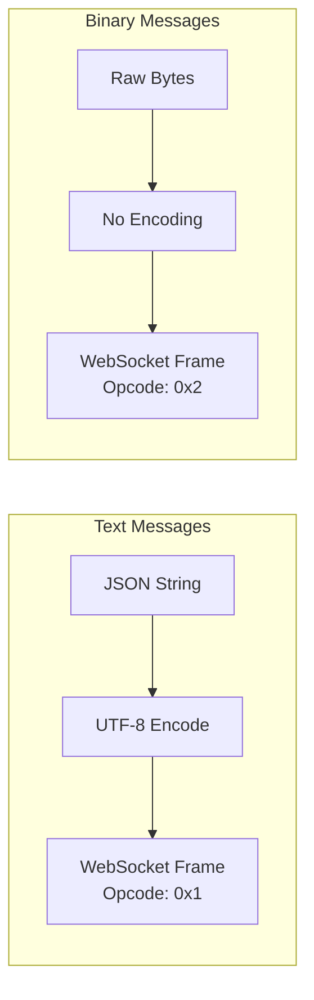

# How to Handle WebSocket Binary Messages

Author: [nawazdhandala](https://www.github.com/nawazdhandala)

Tags: WebSocket, Binary Data, Node.js, Python, JavaScript, ArrayBuffer, Protocol Buffers, MessagePack

Description: A comprehensive guide to sending, receiving, and processing binary data over WebSocket connections, including serialization formats and performance optimization.

---

> WebSocket supports two message types: text (UTF-8 encoded strings) and binary (raw bytes). Binary messages are essential for applications that need to transfer files, images, audio, video, or use efficient serialization formats like Protocol Buffers or MessagePack.

Binary messages offer significant advantages over text for certain use cases: smaller payload sizes, no encoding/decoding overhead, and direct compatibility with binary data formats.

---

## Binary vs Text Messages



| Aspect | Text Messages | Binary Messages |
|--------|--------------|-----------------|
| Opcode | 0x1 | 0x2 |
| Encoding | UTF-8 required | None |
| Use case | JSON, XML, plain text | Files, images, protobuf |
| Overhead | ~33% for binary data (Base64) | None |

---

## Browser Client Implementation

### Sending Binary Data

```javascript
// WebSocket binary message handling in browser

const ws = new WebSocket('wss://example.com/ws');

// Set binary type for receiving
// Options: 'blob' (default) or 'arraybuffer'
ws.binaryType = 'arraybuffer';

ws.onopen = () => {
    console.log('Connected');

    // Send binary data using ArrayBuffer
    sendBinaryMessage();

    // Send file as binary
    sendFile();
};

ws.onmessage = (event) => {
    if (event.data instanceof ArrayBuffer) {
        // Handle binary message
        handleBinaryMessage(event.data);
    } else {
        // Handle text message
        console.log('Text:', event.data);
    }
};

function sendBinaryMessage() {
    // Create an ArrayBuffer with typed data
    const buffer = new ArrayBuffer(12);
    const view = new DataView(buffer);

    // Write different data types
    view.setUint8(0, 1);           // Message type (1 byte)
    view.setUint8(1, 0);           // Flags (1 byte)
    view.setUint16(2, 1234, true); // ID (2 bytes, little-endian)
    view.setFloat32(4, 3.14159, true); // Value (4 bytes)
    view.setUint32(8, Date.now() / 1000, true); // Timestamp (4 bytes)

    // Send as binary
    ws.send(buffer);
}

function handleBinaryMessage(buffer) {
    const view = new DataView(buffer);

    // Parse the binary protocol
    const messageType = view.getUint8(0);
    const flags = view.getUint8(1);
    const id = view.getUint16(2, true);
    const value = view.getFloat32(4, true);
    const timestamp = view.getUint32(8, true);

    console.log('Binary message:', { messageType, flags, id, value, timestamp });
}

async function sendFile() {
    const fileInput = document.getElementById('fileInput');
    const file = fileInput.files[0];

    if (!file) return;

    // Read file as ArrayBuffer
    const buffer = await file.arrayBuffer();

    // Send file metadata first (as JSON)
    ws.send(JSON.stringify({
        type: 'file_start',
        name: file.name,
        size: file.size,
        mimeType: file.type
    }));

    // Send file content in chunks
    const chunkSize = 64 * 1024; // 64KB chunks

    for (let offset = 0; offset < buffer.byteLength; offset += chunkSize) {
        const chunk = buffer.slice(offset, offset + chunkSize);

        // Wait for buffer to drain before sending more
        while (ws.bufferedAmount > 1024 * 1024) {
            await new Promise(resolve => setTimeout(resolve, 100));
        }

        ws.send(chunk);
    }

    // Signal end of file
    ws.send(JSON.stringify({ type: 'file_end' }));
}
```

### Receiving Binary Data as Blob

```javascript
const ws = new WebSocket('wss://example.com/ws');

// Use blob for large binary data (more memory efficient)
ws.binaryType = 'blob';

ws.onmessage = async (event) => {
    if (event.data instanceof Blob) {
        // Handle blob data
        await handleBlobMessage(event.data);
    } else {
        console.log('Text:', event.data);
    }
};

async function handleBlobMessage(blob) {
    // Option 1: Convert to ArrayBuffer for processing
    const buffer = await blob.arrayBuffer();
    processBuffer(buffer);

    // Option 2: Create object URL for display
    const url = URL.createObjectURL(blob);

    // If it's an image
    const img = document.createElement('img');
    img.src = url;
    img.onload = () => URL.revokeObjectURL(url);
    document.body.appendChild(img);

    // Option 3: Read as text if needed
    const text = await blob.text();
    console.log('Blob as text:', text);

    // Option 4: Download as file
    const a = document.createElement('a');
    a.href = url;
    a.download = 'received_file.bin';
    a.click();
    URL.revokeObjectURL(url);
}
```

---

## Node.js Server Implementation

### Handling Binary Messages

```javascript
const WebSocket = require('ws');
const fs = require('fs');
const path = require('path');

const wss = new WebSocket.Server({ port: 8080 });

wss.on('connection', (ws) => {
    // Track file upload state per connection
    ws.fileUpload = null;

    ws.on('message', (data, isBinary) => {
        if (isBinary) {
            handleBinaryMessage(ws, data);
        } else {
            handleTextMessage(ws, data.toString());
        }
    });
});

function handleTextMessage(ws, text) {
    try {
        const message = JSON.parse(text);

        switch (message.type) {
            case 'file_start':
                // Initialize file upload
                ws.fileUpload = {
                    name: sanitizeFilename(message.name),
                    size: message.size,
                    mimeType: message.mimeType,
                    chunks: [],
                    received: 0
                };
                console.log(`Starting file upload: ${message.name} (${message.size} bytes)`);
                break;

            case 'file_end':
                // Complete file upload
                if (ws.fileUpload) {
                    saveFile(ws);
                }
                break;

            default:
                // Handle other text messages
                console.log('Text message:', message);
        }
    } catch (error) {
        console.error('Invalid JSON:', error);
    }
}

function handleBinaryMessage(ws, data) {
    if (ws.fileUpload) {
        // Accumulate file chunks
        ws.fileUpload.chunks.push(Buffer.from(data));
        ws.fileUpload.received += data.length;

        // Send progress update
        const progress = (ws.fileUpload.received / ws.fileUpload.size * 100).toFixed(1);
        ws.send(JSON.stringify({
            type: 'upload_progress',
            received: ws.fileUpload.received,
            total: ws.fileUpload.size,
            percent: progress
        }));
    } else {
        // Handle standalone binary message
        processBinaryProtocol(ws, data);
    }
}

function processBinaryProtocol(ws, data) {
    // Example: Custom binary protocol
    // Byte 0: Message type
    // Bytes 1-4: Payload length
    // Remaining: Payload

    const buffer = Buffer.from(data);
    const messageType = buffer.readUInt8(0);
    const payloadLength = buffer.readUInt32LE(1);
    const payload = buffer.slice(5, 5 + payloadLength);

    console.log(`Binary message type ${messageType}, payload ${payloadLength} bytes`);

    // Process based on message type
    switch (messageType) {
        case 1: // Sensor data
            processSensorData(ws, payload);
            break;
        case 2: // Command
            processCommand(ws, payload);
            break;
        default:
            console.log('Unknown message type:', messageType);
    }
}

function saveFile(ws) {
    const { name, chunks } = ws.fileUpload;
    const buffer = Buffer.concat(chunks);
    const filePath = path.join('/tmp/uploads', name);

    fs.writeFile(filePath, buffer, (error) => {
        if (error) {
            ws.send(JSON.stringify({ type: 'upload_error', message: error.message }));
        } else {
            ws.send(JSON.stringify({ type: 'upload_complete', path: filePath }));
        }
        ws.fileUpload = null;
    });
}

function sanitizeFilename(filename) {
    // Remove path components and dangerous characters
    return path.basename(filename).replace(/[^a-zA-Z0-9._-]/g, '_');
}

// Sending binary data from server
function sendBinaryResponse(ws, type, data) {
    // Create binary message with header
    const payload = Buffer.from(data);
    const header = Buffer.alloc(5);

    header.writeUInt8(type, 0);
    header.writeUInt32LE(payload.length, 1);

    const message = Buffer.concat([header, payload]);

    // Send as binary (second parameter)
    ws.send(message, { binary: true });
}
```

---

## Python Server Implementation

```python
import asyncio
import websockets
import struct
import json
from pathlib import Path

class BinaryMessageHandler:
    """Handle binary WebSocket messages"""

    def __init__(self):
        self.file_uploads = {}  # websocket -> upload state

    async def handle_connection(self, websocket, path):
        self.file_uploads[websocket] = None

        try:
            async for message in websocket:
                if isinstance(message, bytes):
                    await self.handle_binary(websocket, message)
                else:
                    await self.handle_text(websocket, message)
        finally:
            del self.file_uploads[websocket]

    async def handle_text(self, ws, text):
        """Handle text messages (JSON commands)"""
        try:
            data = json.loads(text)
            msg_type = data.get('type')

            if msg_type == 'file_start':
                self.file_uploads[ws] = {
                    'name': self.sanitize_filename(data['name']),
                    'size': data['size'],
                    'chunks': [],
                    'received': 0
                }
                print(f"Starting upload: {data['name']}")

            elif msg_type == 'file_end':
                if self.file_uploads[ws]:
                    await self.save_file(ws)

        except json.JSONDecodeError:
            print(f"Invalid JSON: {text[:100]}")

    async def handle_binary(self, ws, data):
        """Handle binary messages"""
        upload = self.file_uploads.get(ws)

        if upload:
            # File chunk
            upload['chunks'].append(data)
            upload['received'] += len(data)

            # Send progress
            progress = (upload['received'] / upload['size']) * 100
            await ws.send(json.dumps({
                'type': 'progress',
                'percent': round(progress, 1)
            }))
        else:
            # Standalone binary message
            await self.process_binary_protocol(ws, data)

    async def process_binary_protocol(self, ws, data):
        """Process custom binary protocol"""
        # Header: type (1 byte) + length (4 bytes)
        if len(data) < 5:
            return

        msg_type = data[0]
        payload_len = struct.unpack('<I', data[1:5])[0]
        payload = data[5:5 + payload_len]

        print(f"Binary message: type={msg_type}, payload={payload_len} bytes")

        if msg_type == 1:  # Echo
            response = self.create_binary_message(1, payload)
            await ws.send(response)
        elif msg_type == 2:  # Sensor data request
            sensor_data = self.get_sensor_data()
            response = self.create_binary_message(2, sensor_data)
            await ws.send(response)

    def create_binary_message(self, msg_type, payload):
        """Create a binary message with header"""
        header = struct.pack('<BI', msg_type, len(payload))
        return header + payload

    async def save_file(self, ws):
        """Save uploaded file"""
        upload = self.file_uploads[ws]
        data = b''.join(upload['chunks'])

        path = Path('/tmp/uploads') / upload['name']
        path.parent.mkdir(parents=True, exist_ok=True)

        path.write_bytes(data)

        await ws.send(json.dumps({
            'type': 'upload_complete',
            'path': str(path)
        }))

        self.file_uploads[ws] = None

    def sanitize_filename(self, filename):
        """Sanitize filename for safety"""
        return Path(filename).name.replace('..', '_')

    def get_sensor_data(self):
        """Generate sample sensor data"""
        import random
        import time

        # Pack sensor readings as binary
        # Format: timestamp (8 bytes) + 10 float values (40 bytes)
        timestamp = int(time.time() * 1000)
        values = [random.uniform(0, 100) for _ in range(10)]

        return struct.pack('<Q10f', timestamp, *values)

async def main():
    handler = BinaryMessageHandler()

    async with websockets.serve(
        handler.handle_connection,
        "0.0.0.0",
        8080,
        max_size=100 * 1024 * 1024  # 100MB max message
    ):
        print("WebSocket server started on port 8080")
        await asyncio.Future()

if __name__ == "__main__":
    asyncio.run(main())
```

---

## Efficient Serialization Formats

### Protocol Buffers


```javascript
// Using protobufjs for binary serialization
const protobuf = require('protobufjs');
const WebSocket = require('ws');

// Define schema
const schema = `
syntax = "proto3";

message SensorReading {
    uint64 timestamp = 1;
    string sensor_id = 2;
    float temperature = 3;
    float humidity = 4;
    repeated float values = 5;
}

message SensorBatch {
    repeated SensorReading readings = 1;
}
`;

async function main() {
    // Load schema
    const root = protobuf.parse(schema).root;
    const SensorReading = root.lookupType('SensorReading');
    const SensorBatch = root.lookupType('SensorBatch');

    const wss = new WebSocket.Server({ port: 8080 });

    wss.on('connection', (ws) => {
        ws.on('message', (data, isBinary) => {
            if (isBinary) {
                // Decode protobuf message
                try {
                    const batch = SensorBatch.decode(Buffer.from(data));
                    console.log('Received batch:', batch.readings.length, 'readings');

                    batch.readings.forEach((reading) => {
                        console.log(`  ${reading.sensorId}: ${reading.temperature}C`);
                    });
                } catch (error) {
                    console.error('Decode error:', error);
                }
            }
        });

        // Send sample data
        setInterval(() => {
            const batch = SensorBatch.create({
                readings: [
                    {
                        timestamp: Date.now(),
                        sensorId: 'temp-1',
                        temperature: 22.5,
                        humidity: 45.0,
                        values: [1.0, 2.0, 3.0]
                    },
                    {
                        timestamp: Date.now(),
                        sensorId: 'temp-2',
                        temperature: 23.1,
                        humidity: 42.0,
                        values: [4.0, 5.0, 6.0]
                    }
                ]
            });

            // Encode and send as binary
            const buffer = SensorBatch.encode(batch).finish();
            ws.send(buffer, { binary: true });
        }, 1000);
    });
}

main();
```

### MessagePack

```javascript
// Using msgpack for efficient binary serialization
const msgpack = require('@msgpack/msgpack');
const WebSocket = require('ws');

const wss = new WebSocket.Server({ port: 8080 });

wss.on('connection', (ws) => {
    ws.on('message', (data, isBinary) => {
        if (isBinary) {
            // Decode MessagePack
            const message = msgpack.decode(Buffer.from(data));
            console.log('Received:', message);

            // Process and respond
            const response = {
                type: 'response',
                id: message.id,
                result: processRequest(message),
                timestamp: Date.now()
            };

            // Encode and send as binary
            const encoded = msgpack.encode(response);
            ws.send(encoded, { binary: true });
        }
    });

    // Example: Send complex data structure
    const complexData = {
        users: [
            { id: 1, name: 'Alice', scores: [95, 87, 92] },
            { id: 2, name: 'Bob', scores: [88, 91, 85] }
        ],
        metadata: {
            version: '1.0',
            timestamp: Date.now(),
            flags: new Uint8Array([1, 0, 1, 1])
        }
    };

    // MessagePack is typically 50-80% smaller than JSON
    const jsonSize = JSON.stringify(complexData).length;
    const msgpackSize = msgpack.encode(complexData).length;

    console.log(`JSON: ${jsonSize} bytes, MessagePack: ${msgpackSize} bytes`);
    console.log(`Savings: ${((1 - msgpackSize/jsonSize) * 100).toFixed(1)}%`);
});
```

---

## Streaming Large Binary Data

### Chunked File Transfer

```javascript
const WebSocket = require('ws');
const fs = require('fs');
const crypto = require('crypto');

const wss = new WebSocket.Server({ port: 8080 });

const CHUNK_SIZE = 64 * 1024; // 64KB chunks

wss.on('connection', (ws) => {
    ws.on('message', async (data, isBinary) => {
        if (!isBinary) {
            const message = JSON.parse(data.toString());

            if (message.type === 'request_file') {
                await streamFile(ws, message.path);
            }
        }
    });
});

async function streamFile(ws, filePath) {
    const stats = fs.statSync(filePath);
    const fileSize = stats.size;
    const hash = crypto.createHash('sha256');

    // Send file metadata
    ws.send(JSON.stringify({
        type: 'file_start',
        name: filePath.split('/').pop(),
        size: fileSize,
        chunks: Math.ceil(fileSize / CHUNK_SIZE)
    }));

    // Stream file in chunks
    const stream = fs.createReadStream(filePath, {
        highWaterMark: CHUNK_SIZE
    });

    let chunkIndex = 0;

    for await (const chunk of stream) {
        // Update hash
        hash.update(chunk);

        // Create chunk header
        // Bytes 0-3: Chunk index
        // Bytes 4-7: Chunk size
        // Remaining: Chunk data
        const header = Buffer.alloc(8);
        header.writeUInt32LE(chunkIndex, 0);
        header.writeUInt32LE(chunk.length, 4);

        const message = Buffer.concat([header, chunk]);

        // Wait for buffer to drain (backpressure)
        while (ws.bufferedAmount > CHUNK_SIZE * 4) {
            await new Promise(resolve => setTimeout(resolve, 10));
        }

        ws.send(message, { binary: true });
        chunkIndex++;
    }

    // Send completion with checksum
    ws.send(JSON.stringify({
        type: 'file_end',
        checksum: hash.digest('hex')
    }));
}
```

### Client-Side Chunk Reassembly

```javascript
class FileReceiver {
    constructor(ws) {
        this.ws = ws;
        this.currentFile = null;
        this.chunks = new Map();

        ws.binaryType = 'arraybuffer';

        ws.onmessage = (event) => {
            if (event.data instanceof ArrayBuffer) {
                this.handleChunk(event.data);
            } else {
                this.handleControl(JSON.parse(event.data));
            }
        };
    }

    handleControl(message) {
        switch (message.type) {
            case 'file_start':
                this.currentFile = {
                    name: message.name,
                    size: message.size,
                    totalChunks: message.chunks,
                    receivedChunks: 0
                };
                this.chunks.clear();
                console.log(`Receiving: ${message.name} (${message.size} bytes)`);
                break;

            case 'file_end':
                this.assembleFile(message.checksum);
                break;
        }
    }

    handleChunk(buffer) {
        const view = new DataView(buffer);
        const chunkIndex = view.getUint32(0, true);
        const chunkSize = view.getUint32(4, true);
        const chunkData = buffer.slice(8, 8 + chunkSize);

        this.chunks.set(chunkIndex, chunkData);
        this.currentFile.receivedChunks++;

        // Update progress
        const progress = (this.currentFile.receivedChunks / this.currentFile.totalChunks * 100);
        console.log(`Progress: ${progress.toFixed(1)}%`);
    }

    async assembleFile(expectedChecksum) {
        // Sort chunks by index and concatenate
        const sortedChunks = Array.from(this.chunks.entries())
            .sort((a, b) => a[0] - b[0])
            .map(([_, data]) => data);

        const totalSize = sortedChunks.reduce((sum, chunk) => sum + chunk.byteLength, 0);
        const fileBuffer = new Uint8Array(totalSize);

        let offset = 0;
        for (const chunk of sortedChunks) {
            fileBuffer.set(new Uint8Array(chunk), offset);
            offset += chunk.byteLength;
        }

        // Verify checksum
        const hash = await crypto.subtle.digest('SHA-256', fileBuffer);
        const checksum = Array.from(new Uint8Array(hash))
            .map(b => b.toString(16).padStart(2, '0'))
            .join('');

        if (checksum === expectedChecksum) {
            console.log('Checksum verified!');
            this.downloadFile(fileBuffer, this.currentFile.name);
        } else {
            console.error('Checksum mismatch!');
        }
    }

    downloadFile(data, filename) {
        const blob = new Blob([data]);
        const url = URL.createObjectURL(blob);
        const a = document.createElement('a');
        a.href = url;
        a.download = filename;
        a.click();
        URL.revokeObjectURL(url);
    }
}
```

---

## Performance Comparison

```javascript
// Benchmark: JSON vs MessagePack vs Protocol Buffers
const msgpack = require('@msgpack/msgpack');
const protobuf = require('protobufjs');

async function benchmark() {
    // Sample data
    const data = {
        id: 12345,
        name: 'Test User',
        email: 'test@example.com',
        scores: [95, 87, 92, 88, 91],
        metadata: {
            created: Date.now(),
            active: true,
            tags: ['user', 'premium', 'verified']
        }
    };

    // JSON
    const jsonEncoded = JSON.stringify(data);
    const jsonSize = Buffer.byteLength(jsonEncoded);

    // MessagePack
    const msgpackEncoded = msgpack.encode(data);
    const msgpackSize = msgpackEncoded.length;

    console.log('Size comparison:');
    console.log(`  JSON:        ${jsonSize} bytes`);
    console.log(`  MessagePack: ${msgpackSize} bytes (${((1 - msgpackSize/jsonSize) * 100).toFixed(1)}% smaller)`);

    // Speed comparison
    const iterations = 100000;

    console.log('\nSpeed comparison (100k iterations):');

    // JSON encode
    let start = Date.now();
    for (let i = 0; i < iterations; i++) {
        JSON.stringify(data);
    }
    console.log(`  JSON encode:        ${Date.now() - start}ms`);

    // JSON decode
    start = Date.now();
    for (let i = 0; i < iterations; i++) {
        JSON.parse(jsonEncoded);
    }
    console.log(`  JSON decode:        ${Date.now() - start}ms`);

    // MessagePack encode
    start = Date.now();
    for (let i = 0; i < iterations; i++) {
        msgpack.encode(data);
    }
    console.log(`  MessagePack encode: ${Date.now() - start}ms`);

    // MessagePack decode
    start = Date.now();
    for (let i = 0; i < iterations; i++) {
        msgpack.decode(msgpackEncoded);
    }
    console.log(`  MessagePack decode: ${Date.now() - start}ms`);
}

benchmark();
```

---

## Summary

| Format | Size | Speed | Use Case |
|--------|------|-------|----------|
| JSON (text) | Largest | Fast | General purpose, human-readable |
| MessagePack | ~30% smaller | Faster | Drop-in JSON replacement |
| Protocol Buffers | ~50% smaller | Fastest | Schema-defined data, high performance |
| Raw Binary | Smallest | Fastest | Custom protocols, files |

Best practices for WebSocket binary messages:
1. **Use binary for large data** - Files, images, and high-frequency data
2. **Choose the right format** - MessagePack for flexibility, Protobuf for performance
3. **Implement chunking** - For data larger than a few KB
4. **Handle backpressure** - Check bufferedAmount before sending
5. **Verify integrity** - Use checksums for critical data

---

*Building real-time applications with binary WebSocket messages? [OneUptime](https://oneuptime.com) provides monitoring for WebSocket applications including message throughput, binary transfer rates, and connection health.*
