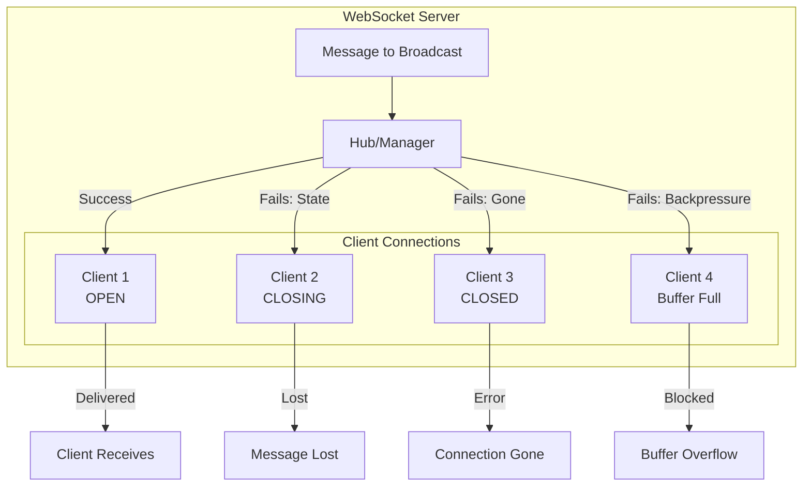
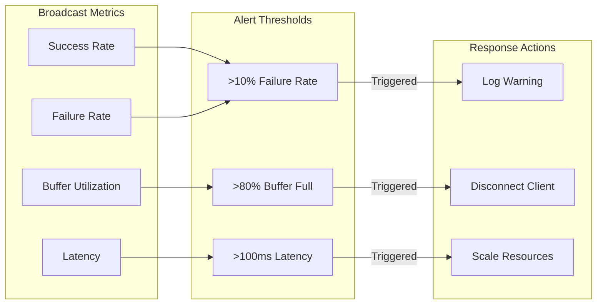

# How to Fix 'Broadcast Failed' WebSocket Errors

Author: [nawazdhandala](https://www.github.com/nawazdhandala)

Tags: WebSocket, Troubleshooting, Node.js, Broadcasting, Real-time, Debugging

Description: Diagnose and resolve common WebSocket broadcast failures including connection state issues, buffer overflows, and handling stale connections gracefully.

---

WebSocket broadcast failures occur when your server attempts to send messages to connected clients but the send operation fails silently or throws errors. These failures can result in missing messages, inconsistent application state, and degraded user experience. Unlike HTTP where each request is independent, WebSocket broadcasts must handle the reality that connections can be in various states of health at any moment.

Common causes of broadcast failures include sending to closed connections, buffer overflows on slow clients, network interruptions that have not yet triggered disconnect events, and race conditions between broadcast operations and connection cleanup. Understanding these failure modes is essential for building reliable real-time applications.

In this guide, you will learn how to identify the root causes of broadcast failures, implement robust error handling, manage slow clients, and build resilient broadcasting patterns that gracefully handle connection issues without affecting other clients.

## Understanding Broadcast Failures

Broadcast operations can fail at multiple points in the delivery chain. Here is how messages flow through a typical WebSocket server.



## Common Error Types and Causes

Let us examine the most frequent broadcast failure scenarios.

### Connection State Errors

The WebSocket connection can be in four states: CONNECTING (0), OPEN (1), CLOSING (2), or CLOSED (3). Sending to non-OPEN connections will fail.

```javascript
// connection-state-errors.js
// Demonstrating connection state issues

const WebSocket = require('ws');

// BAD: Not checking connection state before sending
function badBroadcast(clients, message) {
    clients.forEach(client => {
        // This will throw if client is not OPEN
        client.send(message);
    });
}

// GOOD: Check state before sending
function safeBroadcast(clients, message) {
    const results = {
        sent: 0,
        skipped: 0,
        failed: 0
    };

    clients.forEach(client => {
        if (client.readyState === WebSocket.OPEN) {
            try {
                client.send(message);
                results.sent++;
            } catch (err) {
                console.error('Send failed:', err.message);
                results.failed++;
            }
        } else {
            console.log('Skipping client in state:', client.readyState);
            results.skipped++;
        }
    });

    return results;
}
```

### Buffer Overflow and Backpressure

When clients cannot receive messages fast enough, the send buffer fills up. This creates backpressure that can block your server or cause message loss.

```javascript
// buffer-overflow-handling.js
// Handling slow clients and buffer issues

const WebSocket = require('ws');

class BroadcastManager {
    constructor() {
        this.clients = new Map();

        // Per-client buffer settings
        this.maxBufferSize = 1024 * 1024; // 1MB
        this.warningThreshold = 512 * 1024; // 512KB warning
    }

    addClient(ws, id) {
        this.clients.set(id, {
            ws,
            id,
            droppedMessages: 0,
            lastWarning: 0
        });
    }

    removeClient(id) {
        this.clients.delete(id);
    }

    broadcast(message) {
        const data = typeof message === 'string' ? message : JSON.stringify(message);
        const results = {
            sent: 0,
            dropped: 0,
            errors: []
        };

        for (const [id, client] of this.clients) {
            const result = this.sendToClient(client, data);

            if (result.success) {
                results.sent++;
            } else {
                results.dropped++;
                results.errors.push({ id, error: result.error });
            }
        }

        return results;
    }

    sendToClient(client, data) {
        const ws = client.ws;

        // Check connection state
        if (ws.readyState !== WebSocket.OPEN) {
            return {
                success: false,
                error: 'Connection not open'
            };
        }

        // Check buffer size (bufferedAmount is bytes waiting to be sent)
        if (ws.bufferedAmount > this.maxBufferSize) {
            client.droppedMessages++;

            // Log warning periodically
            const now = Date.now();
            if (now - client.lastWarning > 5000) {
                console.warn(`Client ${client.id} buffer full, dropping messages. Total dropped: ${client.droppedMessages}`);
                client.lastWarning = now;
            }

            return {
                success: false,
                error: 'Buffer full'
            };
        }

        // Warn if buffer is getting full
        if (ws.bufferedAmount > this.warningThreshold) {
            console.log(`Client ${client.id} buffer warning: ${ws.bufferedAmount} bytes`);
        }

        try {
            ws.send(data);
            return { success: true };
        } catch (err) {
            return {
                success: false,
                error: err.message
            };
        }
    }
}

module.exports = { BroadcastManager };
```

### Stale Connection Detection

Connections can become stale without triggering close events, especially during network failures. These stale connections cause silent broadcast failures.

```javascript
// stale-connection-detection.js
// Detecting and handling stale connections

const WebSocket = require('ws');

class StaleConnectionDetector {
    constructor(options = {}) {
        this.pingInterval = options.pingInterval || 30000;
        this.pongTimeout = options.pongTimeout || 10000;
        this.connections = new Map();
    }

    track(ws, id) {
        const connection = {
            ws,
            id,
            isAlive: true,
            lastPong: Date.now(),
            missedPongs: 0,
            pingTimer: null,
            pongTimer: null
        };

        this.connections.set(id, connection);

        // Set up pong handler
        ws.on('pong', () => {
            connection.isAlive = true;
            connection.lastPong = Date.now();
            connection.missedPongs = 0;

            if (connection.pongTimer) {
                clearTimeout(connection.pongTimer);
                connection.pongTimer = null;
            }
        });

        // Start ping cycle
        this.startPinging(connection);

        return connection;
    }

    startPinging(connection) {
        connection.pingTimer = setInterval(() => {
            if (connection.ws.readyState !== WebSocket.OPEN) {
                this.handleStaleConnection(connection, 'Connection not open');
                return;
            }

            // Reset alive flag before ping
            connection.isAlive = false;

            try {
                connection.ws.ping();
            } catch (err) {
                this.handleStaleConnection(connection, 'Ping failed: ' + err.message);
                return;
            }

            // Set timeout for pong response
            connection.pongTimer = setTimeout(() => {
                connection.missedPongs++;

                if (connection.missedPongs >= 2) {
                    this.handleStaleConnection(connection, 'Multiple missed pongs');
                } else {
                    console.warn(`Client ${connection.id} missed pong (${connection.missedPongs})`);
                }
            }, this.pongTimeout);

        }, this.pingInterval);
    }

    handleStaleConnection(connection, reason) {
        console.log(`Stale connection detected: ${connection.id}, reason: ${reason}`);

        // Clean up timers
        if (connection.pingTimer) {
            clearInterval(connection.pingTimer);
        }
        if (connection.pongTimer) {
            clearTimeout(connection.pongTimer);
        }

        // Remove from tracking
        this.connections.delete(connection.id);

        // Terminate the connection
        try {
            connection.ws.terminate();
        } catch (err) {
            // Ignore termination errors
        }

        // Emit event for cleanup
        if (this.onStaleConnection) {
            this.onStaleConnection(connection.id, reason);
        }
    }

    untrack(id) {
        const connection = this.connections.get(id);
        if (connection) {
            if (connection.pingTimer) {
                clearInterval(connection.pingTimer);
            }
            if (connection.pongTimer) {
                clearTimeout(connection.pongTimer);
            }
            this.connections.delete(id);
        }
    }

    isHealthy(id) {
        const connection = this.connections.get(id);
        if (!connection) return false;

        return connection.isAlive &&
               connection.ws.readyState === WebSocket.OPEN &&
               connection.missedPongs === 0;
    }
}

module.exports = { StaleConnectionDetector };
```

## Robust Broadcast Implementation

Here is a complete broadcast implementation that handles all common failure modes.

```javascript
// robust-broadcaster.js
// Production-ready broadcast implementation

const WebSocket = require('ws');
const EventEmitter = require('events');

class RobustBroadcaster extends EventEmitter {
    constructor(options = {}) {
        super();

        this.clients = new Map();

        // Configuration
        this.config = {
            maxBufferSize: options.maxBufferSize || 1024 * 1024,
            messageTimeout: options.messageTimeout || 5000,
            retryAttempts: options.retryAttempts || 2,
            retryDelay: options.retryDelay || 100,
            batchSize: options.batchSize || 100,
            batchDelay: options.batchDelay || 10
        };

        // Statistics
        this.stats = {
            totalBroadcasts: 0,
            successfulSends: 0,
            failedSends: 0,
            droppedMessages: 0,
            retriedMessages: 0
        };
    }

    addClient(ws, id, metadata = {}) {
        const client = {
            ws,
            id,
            metadata,
            isAlive: true,
            sendQueue: [],
            isSending: false,
            consecutiveFailures: 0,
            addedAt: Date.now()
        };

        this.clients.set(id, client);

        // Handle connection events
        ws.on('close', () => this.handleClientClose(id));
        ws.on('error', (err) => this.handleClientError(id, err));
        ws.on('pong', () => this.handleClientPong(id));

        this.emit('clientAdded', id, metadata);

        return client;
    }

    removeClient(id) {
        const client = this.clients.get(id);
        if (client) {
            // Clear any pending sends
            client.sendQueue = [];
            this.clients.delete(id);
            this.emit('clientRemoved', id);
        }
    }

    handleClientClose(id) {
        console.log(`Client ${id} closed`);
        this.removeClient(id);
    }

    handleClientError(id, err) {
        console.error(`Client ${id} error:`, err.message);
        // Let close event handle cleanup
    }

    handleClientPong(id) {
        const client = this.clients.get(id);
        if (client) {
            client.isAlive = true;
            client.consecutiveFailures = 0;
        }
    }

    // Broadcast to all clients
    async broadcast(message, options = {}) {
        this.stats.totalBroadcasts++;

        const data = this.serializeMessage(message);
        const filter = options.filter || (() => true);
        const excludeIds = new Set(options.exclude || []);

        const results = {
            total: 0,
            sent: 0,
            failed: 0,
            skipped: 0,
            errors: []
        };

        // Get eligible clients
        const eligibleClients = [];
        for (const [id, client] of this.clients) {
            results.total++;

            if (excludeIds.has(id)) {
                results.skipped++;
                continue;
            }

            if (!filter(client)) {
                results.skipped++;
                continue;
            }

            eligibleClients.push(client);
        }

        // Send in batches to avoid blocking
        const batches = this.createBatches(eligibleClients, this.config.batchSize);

        for (const batch of batches) {
            const batchResults = await this.sendBatch(batch, data, options);

            results.sent += batchResults.sent;
            results.failed += batchResults.failed;
            results.errors.push(...batchResults.errors);

            // Small delay between batches
            if (batches.length > 1) {
                await this.delay(this.config.batchDelay);
            }
        }

        return results;
    }

    // Send to a specific client
    async sendToClient(id, message, options = {}) {
        const client = this.clients.get(id);
        if (!client) {
            return {
                success: false,
                error: 'Client not found'
            };
        }

        const data = this.serializeMessage(message);
        return await this.sendWithRetry(client, data, options);
    }

    // Send to a batch of clients
    async sendBatch(clients, data, options) {
        const results = {
            sent: 0,
            failed: 0,
            errors: []
        };

        const promises = clients.map(async (client) => {
            const result = await this.sendWithRetry(client, data, options);

            if (result.success) {
                results.sent++;
                this.stats.successfulSends++;
            } else {
                results.failed++;
                this.stats.failedSends++;
                results.errors.push({
                    clientId: client.id,
                    error: result.error
                });
            }
        });

        await Promise.all(promises);

        return results;
    }

    // Send with retry logic
    async sendWithRetry(client, data, options) {
        const maxAttempts = options.retryAttempts ?? this.config.retryAttempts;

        for (let attempt = 0; attempt <= maxAttempts; attempt++) {
            const result = this.trySend(client, data);

            if (result.success) {
                if (attempt > 0) {
                    this.stats.retriedMessages++;
                }
                return result;
            }

            // Check if error is retryable
            if (!this.isRetryableError(result.error)) {
                return result;
            }

            // Wait before retry
            if (attempt < maxAttempts) {
                await this.delay(this.config.retryDelay * (attempt + 1));
            }
        }

        return {
            success: false,
            error: 'Max retries exceeded'
        };
    }

    // Attempt to send message
    trySend(client, data) {
        const ws = client.ws;

        // Check connection state
        if (ws.readyState !== WebSocket.OPEN) {
            return {
                success: false,
                error: `Invalid state: ${ws.readyState}`,
                code: 'INVALID_STATE'
            };
        }

        // Check buffer capacity
        if (ws.bufferedAmount > this.config.maxBufferSize) {
            this.stats.droppedMessages++;
            return {
                success: false,
                error: 'Buffer full',
                code: 'BUFFER_FULL'
            };
        }

        // Check client health
        if (!client.isAlive && client.consecutiveFailures > 2) {
            return {
                success: false,
                error: 'Client unhealthy',
                code: 'UNHEALTHY'
            };
        }

        try {
            ws.send(data, (err) => {
                if (err) {
                    client.consecutiveFailures++;
                    console.error(`Send callback error for ${client.id}:`, err.message);
                } else {
                    client.consecutiveFailures = 0;
                }
            });

            return { success: true };
        } catch (err) {
            client.consecutiveFailures++;

            return {
                success: false,
                error: err.message,
                code: 'SEND_EXCEPTION'
            };
        }
    }

    isRetryableError(error) {
        // Buffer full is not retryable immediately
        if (error.code === 'BUFFER_FULL') {
            return false;
        }

        // Invalid state is not retryable
        if (error.code === 'INVALID_STATE') {
            return false;
        }

        // Unhealthy clients are not retryable
        if (error.code === 'UNHEALTHY') {
            return false;
        }

        // Other errors might be transient
        return true;
    }

    serializeMessage(message) {
        if (typeof message === 'string') {
            return message;
        }
        return JSON.stringify(message);
    }

    createBatches(items, batchSize) {
        const batches = [];
        for (let i = 0; i < items.length; i += batchSize) {
            batches.push(items.slice(i, i + batchSize));
        }
        return batches;
    }

    delay(ms) {
        return new Promise(resolve => setTimeout(resolve, ms));
    }

    getStats() {
        return {
            ...this.stats,
            activeClients: this.clients.size,
            healthyClients: Array.from(this.clients.values())
                .filter(c => c.isAlive && c.consecutiveFailures === 0).length
        };
    }
}

module.exports = { RobustBroadcaster };
```

## Room-Based Broadcasting with Error Handling

When broadcasting to rooms, handle failures for individual rooms without affecting others.

```javascript
// room-broadcaster.js
// Room-based broadcasting with error isolation

const { RobustBroadcaster } = require('./robust-broadcaster');

class RoomBroadcaster extends RobustBroadcaster {
    constructor(options) {
        super(options);
        this.rooms = new Map();
    }

    joinRoom(clientId, roomId) {
        // Get or create room
        if (!this.rooms.has(roomId)) {
            this.rooms.set(roomId, new Set());
        }

        const room = this.rooms.get(roomId);
        room.add(clientId);

        // Update client metadata
        const client = this.clients.get(clientId);
        if (client) {
            if (!client.metadata.rooms) {
                client.metadata.rooms = new Set();
            }
            client.metadata.rooms.add(roomId);
        }

        this.emit('roomJoined', clientId, roomId);

        return {
            success: true,
            roomSize: room.size
        };
    }

    leaveRoom(clientId, roomId) {
        const room = this.rooms.get(roomId);
        if (room) {
            room.delete(clientId);

            // Clean up empty rooms
            if (room.size === 0) {
                this.rooms.delete(roomId);
            }
        }

        // Update client metadata
        const client = this.clients.get(clientId);
        if (client && client.metadata.rooms) {
            client.metadata.rooms.delete(roomId);
        }

        this.emit('roomLeft', clientId, roomId);
    }

    leaveAllRooms(clientId) {
        const client = this.clients.get(clientId);
        if (client && client.metadata.rooms) {
            for (const roomId of client.metadata.rooms) {
                this.leaveRoom(clientId, roomId);
            }
        }
    }

    // Override removeClient to handle room cleanup
    removeClient(id) {
        this.leaveAllRooms(id);
        super.removeClient(id);
    }

    async broadcastToRoom(roomId, message, options = {}) {
        const room = this.rooms.get(roomId);

        if (!room || room.size === 0) {
            return {
                success: false,
                error: 'Room empty or not found',
                roomId
            };
        }

        const excludeIds = new Set(options.exclude || []);

        // Filter to room members only
        const roomFilter = (client) => {
            return room.has(client.id) && !excludeIds.has(client.id);
        };

        const results = await this.broadcast(message, {
            ...options,
            filter: (client) => {
                // Combine with any existing filter
                if (options.filter && !options.filter(client)) {
                    return false;
                }
                return roomFilter(client);
            }
        });

        return {
            ...results,
            roomId,
            roomSize: room.size
        };
    }

    // Broadcast to multiple rooms
    async broadcastToRooms(roomIds, message, options = {}) {
        const results = {
            rooms: {},
            totalSent: 0,
            totalFailed: 0
        };

        // Process rooms in parallel with error isolation
        const promises = roomIds.map(async (roomId) => {
            try {
                const result = await this.broadcastToRoom(roomId, message, options);
                results.rooms[roomId] = result;
                results.totalSent += result.sent;
                results.totalFailed += result.failed;
            } catch (err) {
                results.rooms[roomId] = {
                    success: false,
                    error: err.message
                };
            }
        });

        await Promise.all(promises);

        return results;
    }

    getRoomInfo(roomId) {
        const room = this.rooms.get(roomId);
        if (!room) {
            return null;
        }

        const members = [];
        for (const clientId of room) {
            const client = this.clients.get(clientId);
            if (client) {
                members.push({
                    id: clientId,
                    isAlive: client.isAlive,
                    consecutiveFailures: client.consecutiveFailures
                });
            }
        }

        return {
            roomId,
            size: room.size,
            members,
            healthyCount: members.filter(m => m.isAlive && m.consecutiveFailures === 0).length
        };
    }
}

module.exports = { RoomBroadcaster };
```

## Handling Broadcast Failures Gracefully

When broadcasts fail, implement strategies to minimize impact on users.

```javascript
// failure-handling.js
// Strategies for handling broadcast failures

class BroadcastFailureHandler {
    constructor(broadcaster) {
        this.broadcaster = broadcaster;
        this.failureHistory = new Map();
        this.maxHistorySize = 1000;

        // Failure thresholds
        this.clientFailureThreshold = 5;
        this.globalFailureRateThreshold = 0.1; // 10%
    }

    async safeBroadcast(message, options = {}) {
        const results = await this.broadcaster.broadcast(message, options);

        // Record failures
        this.recordFailures(results);

        // Analyze and act on failures
        await this.handleFailures(results, message, options);

        return results;
    }

    recordFailures(results) {
        const timestamp = Date.now();

        for (const error of results.errors) {
            const clientId = error.clientId;

            if (!this.failureHistory.has(clientId)) {
                this.failureHistory.set(clientId, []);
            }

            const history = this.failureHistory.get(clientId);
            history.push({
                timestamp,
                error: error.error
            });

            // Limit history size
            if (history.length > 100) {
                history.shift();
            }
        }

        // Cleanup old entries
        this.cleanupHistory();
    }

    cleanupHistory() {
        const cutoff = Date.now() - 300000; // 5 minutes

        for (const [clientId, history] of this.failureHistory) {
            const filtered = history.filter(f => f.timestamp > cutoff);

            if (filtered.length === 0) {
                this.failureHistory.delete(clientId);
            } else {
                this.failureHistory.set(clientId, filtered);
            }
        }
    }

    async handleFailures(results, message, options) {
        // Check global failure rate
        if (results.total > 0) {
            const failureRate = results.failed / results.total;

            if (failureRate > this.globalFailureRateThreshold) {
                console.warn(`High broadcast failure rate: ${(failureRate * 100).toFixed(1)}%`);
                this.emit('highFailureRate', {
                    rate: failureRate,
                    failed: results.failed,
                    total: results.total
                });
            }
        }

        // Check for problematic clients
        for (const error of results.errors) {
            const history = this.failureHistory.get(error.clientId) || [];
            const recentFailures = history.filter(
                f => f.timestamp > Date.now() - 60000
            ).length;

            if (recentFailures >= this.clientFailureThreshold) {
                await this.handleProblematicClient(error.clientId, history);
            }
        }
    }

    async handleProblematicClient(clientId, history) {
        console.warn(`Problematic client detected: ${clientId}, failures: ${history.length}`);

        // Option 1: Disconnect the client
        // this.broadcaster.removeClient(clientId);

        // Option 2: Reduce message rate for this client
        // this.broadcaster.setClientThrottle(clientId, true);

        // Option 3: Move to degraded service mode
        const client = this.broadcaster.clients.get(clientId);
        if (client) {
            client.metadata.degraded = true;
        }

        // Emit event for application handling
        this.emit('problematicClient', {
            clientId,
            failures: history.length,
            recentErrors: history.slice(-5)
        });
    }

    // Get failure statistics
    getFailureStats() {
        const stats = {
            clientsWithFailures: this.failureHistory.size,
            totalRecentFailures: 0,
            byClient: {}
        };

        const cutoff = Date.now() - 300000;

        for (const [clientId, history] of this.failureHistory) {
            const recentCount = history.filter(f => f.timestamp > cutoff).length;
            stats.totalRecentFailures += recentCount;
            stats.byClient[clientId] = recentCount;
        }

        return stats;
    }

    emit(event, data) {
        // Override to implement event emission
        console.log(`Event: ${event}`, data);
    }
}

module.exports = { BroadcastFailureHandler };
```

## Message Queue for Reliability

For critical messages, implement a message queue that retries failed deliveries.

```javascript
// message-queue.js
// Queued message delivery with persistence

class MessageQueue {
    constructor(broadcaster, options = {}) {
        this.broadcaster = broadcaster;
        this.queue = [];
        this.processing = false;

        this.config = {
            maxQueueSize: options.maxQueueSize || 10000,
            maxRetries: options.maxRetries || 3,
            retryDelay: options.retryDelay || 1000,
            processInterval: options.processInterval || 100
        };

        // Start processing loop
        this.startProcessing();
    }

    // Queue a message for delivery
    enqueue(message, options = {}) {
        if (this.queue.length >= this.config.maxQueueSize) {
            console.warn('Message queue full, dropping oldest message');
            this.queue.shift();
        }

        const queuedMessage = {
            id: this.generateId(),
            message,
            options,
            attempts: 0,
            createdAt: Date.now(),
            status: 'pending'
        };

        this.queue.push(queuedMessage);

        return queuedMessage.id;
    }

    startProcessing() {
        setInterval(async () => {
            if (this.processing || this.queue.length === 0) {
                return;
            }

            this.processing = true;

            try {
                await this.processNext();
            } catch (err) {
                console.error('Queue processing error:', err);
            } finally {
                this.processing = false;
            }
        }, this.config.processInterval);
    }

    async processNext() {
        // Find next pending message
        const message = this.queue.find(m => m.status === 'pending');
        if (!message) {
            return;
        }

        message.status = 'processing';
        message.attempts++;

        try {
            const results = await this.broadcaster.broadcast(
                message.message,
                message.options
            );

            if (results.failed === 0) {
                // Complete success
                message.status = 'completed';
                this.removeFromQueue(message.id);
            } else if (results.sent > 0) {
                // Partial success
                if (message.attempts >= this.config.maxRetries) {
                    message.status = 'partial';
                    console.warn(`Message ${message.id} partially delivered after ${message.attempts} attempts`);
                    this.removeFromQueue(message.id);
                } else {
                    // Retry for failed recipients
                    message.status = 'pending';
                    message.options.onlyFailed = results.errors.map(e => e.clientId);
                }
            } else {
                // Complete failure
                if (message.attempts >= this.config.maxRetries) {
                    message.status = 'failed';
                    console.error(`Message ${message.id} failed after ${message.attempts} attempts`);
                    this.removeFromQueue(message.id);
                } else {
                    // Schedule retry
                    message.status = 'pending';
                    await this.delay(this.config.retryDelay * message.attempts);
                }
            }
        } catch (err) {
            console.error(`Error processing message ${message.id}:`, err);
            message.status = 'pending';

            if (message.attempts >= this.config.maxRetries) {
                message.status = 'failed';
                this.removeFromQueue(message.id);
            }
        }
    }

    removeFromQueue(id) {
        const index = this.queue.findIndex(m => m.id === id);
        if (index !== -1) {
            this.queue.splice(index, 1);
        }
    }

    getQueueStatus() {
        const status = {
            pending: 0,
            processing: 0,
            completed: 0,
            failed: 0,
            total: this.queue.length
        };

        for (const message of this.queue) {
            status[message.status]++;
        }

        return status;
    }

    generateId() {
        return Math.random().toString(36).substring(2, 15);
    }

    delay(ms) {
        return new Promise(resolve => setTimeout(resolve, ms));
    }
}

module.exports = { MessageQueue };
```

## Complete WebSocket Server with Robust Broadcasting

Here is a complete server implementation that incorporates all the error handling patterns.

```javascript
// server.js
// Complete WebSocket server with robust broadcasting

const WebSocket = require('ws');
const { RoomBroadcaster } = require('./room-broadcaster');
const { BroadcastFailureHandler } = require('./failure-handling');

class WebSocketServer {
    constructor(port) {
        this.port = port;
        this.wss = new WebSocket.Server({ port });
        this.broadcaster = new RoomBroadcaster({
            maxBufferSize: 512 * 1024,
            retryAttempts: 2,
            batchSize: 50
        });
        this.failureHandler = new BroadcastFailureHandler(this.broadcaster);

        this.setupServer();
        this.setupHealthCheck();
    }

    setupServer() {
        this.wss.on('connection', (ws, req) => {
            const clientId = this.generateClientId();

            console.log(`Client connected: ${clientId}`);

            // Add to broadcaster
            this.broadcaster.addClient(ws, clientId, {
                ip: req.socket.remoteAddress,
                userAgent: req.headers['user-agent']
            });

            // Handle messages
            ws.on('message', (data) => {
                this.handleMessage(clientId, data);
            });

            // Handle close
            ws.on('close', () => {
                console.log(`Client disconnected: ${clientId}`);
                this.broadcaster.removeClient(clientId);
            });

            // Send welcome message
            this.broadcaster.sendToClient(clientId, {
                type: 'welcome',
                clientId
            });
        });

        console.log(`WebSocket server running on port ${this.port}`);
    }

    setupHealthCheck() {
        // Periodic health check and stats logging
        setInterval(() => {
            const stats = this.broadcaster.getStats();
            const failureStats = this.failureHandler.getFailureStats();

            console.log('Server stats:', {
                clients: stats.activeClients,
                healthy: stats.healthyClients,
                broadcasts: stats.totalBroadcasts,
                failures: stats.failedSends,
                recentFailures: failureStats.totalRecentFailures
            });
        }, 60000);
    }

    async handleMessage(clientId, data) {
        let message;
        try {
            message = JSON.parse(data);
        } catch (err) {
            await this.broadcaster.sendToClient(clientId, {
                type: 'error',
                message: 'Invalid JSON'
            });
            return;
        }

        switch (message.action) {
            case 'join':
                await this.handleJoin(clientId, message.room);
                break;

            case 'leave':
                await this.handleLeave(clientId, message.room);
                break;

            case 'message':
                await this.handleBroadcast(clientId, message.room, message.content);
                break;

            case 'ping':
                await this.broadcaster.sendToClient(clientId, {
                    type: 'pong',
                    timestamp: Date.now()
                });
                break;

            default:
                await this.broadcaster.sendToClient(clientId, {
                    type: 'error',
                    message: `Unknown action: ${message.action}`
                });
        }
    }

    async handleJoin(clientId, roomId) {
        const result = this.broadcaster.joinRoom(clientId, roomId);

        // Notify client
        await this.broadcaster.sendToClient(clientId, {
            type: 'joined',
            room: roomId,
            roomSize: result.roomSize
        });

        // Notify room
        await this.broadcaster.broadcastToRoom(roomId, {
            type: 'userJoined',
            userId: clientId,
            room: roomId
        }, { exclude: [clientId] });
    }

    async handleLeave(clientId, roomId) {
        this.broadcaster.leaveRoom(clientId, roomId);

        // Notify client
        await this.broadcaster.sendToClient(clientId, {
            type: 'left',
            room: roomId
        });

        // Notify room
        await this.broadcaster.broadcastToRoom(roomId, {
            type: 'userLeft',
            userId: clientId,
            room: roomId
        });
    }

    async handleBroadcast(clientId, roomId, content) {
        const results = await this.failureHandler.safeBroadcast({
            type: 'message',
            from: clientId,
            room: roomId,
            content,
            timestamp: Date.now()
        }, {
            filter: (client) => {
                const rooms = client.metadata.rooms || new Set();
                return rooms.has(roomId);
            }
        });

        // Log broadcast results
        if (results.failed > 0) {
            console.warn(`Broadcast to ${roomId} had ${results.failed} failures`);
        }
    }

    generateClientId() {
        return Math.random().toString(36).substring(2, 15);
    }

    close() {
        this.wss.close();
    }
}

// Start server
const server = new WebSocketServer(8080);
```

## Monitoring Broadcast Health

Track broadcast success rates and identify issues early.



```javascript
// metrics.js
// Broadcast metrics collection

class BroadcastMetrics {
    constructor() {
        this.metrics = {
            broadcasts: [],
            errors: [],
            latencies: []
        };

        this.window = 300000; // 5 minute window
    }

    recordBroadcast(results, duration) {
        const timestamp = Date.now();

        this.metrics.broadcasts.push({
            timestamp,
            sent: results.sent,
            failed: results.failed,
            total: results.total
        });

        this.metrics.latencies.push({
            timestamp,
            duration
        });

        for (const error of results.errors) {
            this.metrics.errors.push({
                timestamp,
                clientId: error.clientId,
                error: error.error
            });
        }

        this.cleanup();
    }

    cleanup() {
        const cutoff = Date.now() - this.window;

        this.metrics.broadcasts = this.metrics.broadcasts.filter(m => m.timestamp > cutoff);
        this.metrics.latencies = this.metrics.latencies.filter(m => m.timestamp > cutoff);
        this.metrics.errors = this.metrics.errors.filter(m => m.timestamp > cutoff);
    }

    getSuccessRate() {
        let totalSent = 0;
        let totalFailed = 0;

        for (const b of this.metrics.broadcasts) {
            totalSent += b.sent;
            totalFailed += b.failed;
        }

        const total = totalSent + totalFailed;
        return total > 0 ? totalSent / total : 1;
    }

    getAverageLatency() {
        if (this.metrics.latencies.length === 0) {
            return 0;
        }

        const sum = this.metrics.latencies.reduce((acc, l) => acc + l.duration, 0);
        return sum / this.metrics.latencies.length;
    }

    getErrorsByType() {
        const counts = {};

        for (const error of this.metrics.errors) {
            const type = error.error || 'unknown';
            counts[type] = (counts[type] || 0) + 1;
        }

        return counts;
    }

    getSummary() {
        return {
            window: this.window,
            successRate: (this.getSuccessRate() * 100).toFixed(2) + '%',
            averageLatency: this.getAverageLatency().toFixed(2) + 'ms',
            totalBroadcasts: this.metrics.broadcasts.length,
            totalErrors: this.metrics.errors.length,
            errorsByType: this.getErrorsByType()
        };
    }
}

module.exports = { BroadcastMetrics };
```

## Best Practices Summary

When handling WebSocket broadcast failures, follow these guidelines.

Always check connection state before sending. The readyState must be OPEN (1) for successful sends.

Monitor buffer levels to detect slow clients. Consider disconnecting clients that consistently have full buffers.

Implement heartbeat to detect stale connections before broadcasts fail. Terminate unresponsive connections proactively.

Use batched sending for large broadcasts. This prevents blocking and allows better error handling per batch.

Track failure patterns per client. Repeated failures from the same client indicate problems that need attention.

Implement graceful degradation for high failure rates. Consider reducing message frequency or moving to polling for problematic clients.

Log all broadcast failures with enough context to debug. Include client ID, error type, and message metadata.

Test failure scenarios explicitly. Simulate network failures, slow clients, and sudden disconnections.

## Conclusion

WebSocket broadcast failures are inevitable in production systems. The key to reliability is implementing multiple layers of defense: state checking before sends, buffer monitoring for backpressure, heartbeat for stale detection, and comprehensive error handling that isolates failures and enables graceful degradation.

By following the patterns in this guide, you can build broadcast systems that handle failures gracefully, provide visibility into problems through metrics and logging, and maintain good user experience even when individual connections have issues. The goal is not to prevent all failures but to ensure they are detected quickly, handled appropriately, and do not cascade to affect healthy connections.
