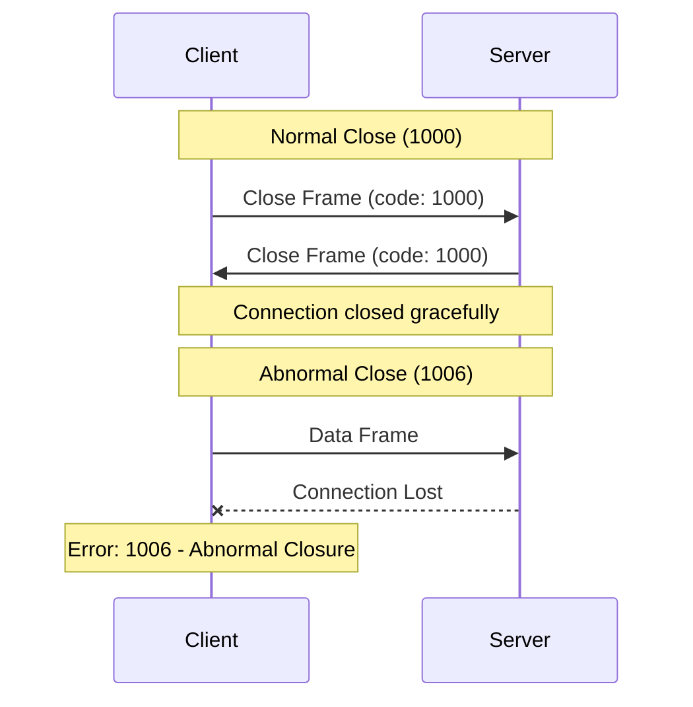
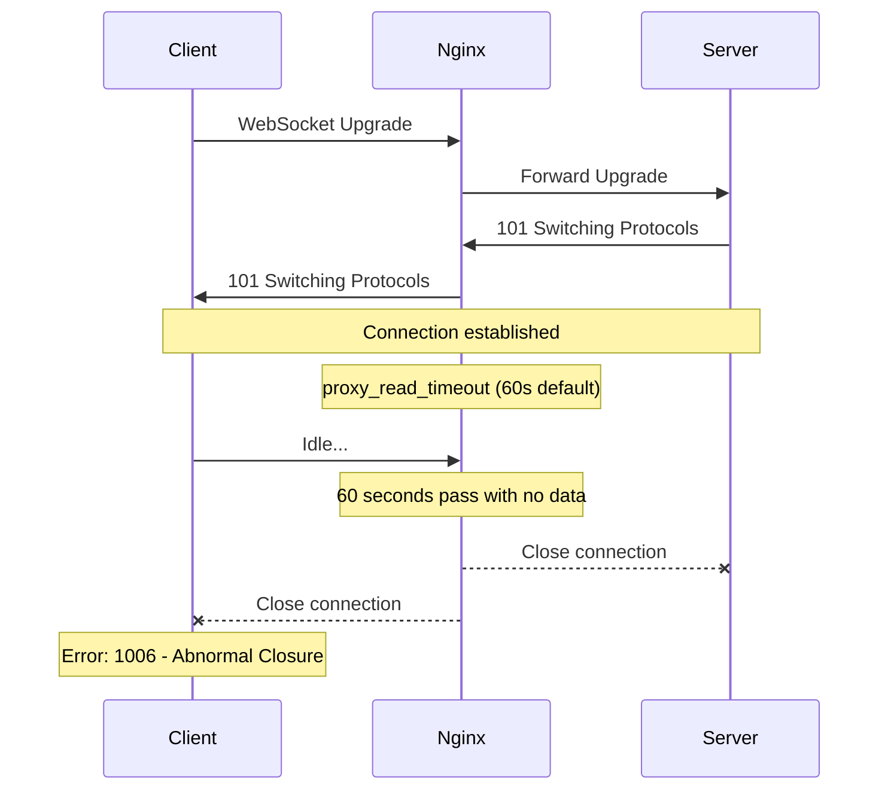

# How to Fix "Connection Closed Abnormally" WebSocket Errors

Author: [nawazdhandala](https://www.github.com/nawazdhandala)

Tags: WebSocket, Debugging, Networking, JavaScript, DevOps

Description: Learn how to diagnose and fix WebSocket "Connection Closed Abnormally" errors caused by network issues, server timeouts, and proxy misconfigurations.

---

The "Connection Closed Abnormally" error (close code 1006) indicates that a WebSocket connection was terminated without a proper close handshake. Unlike normal closures where both sides exchange close frames, this error means the connection dropped unexpectedly. This guide covers the common causes and solutions.

## Understanding Close Code 1006

WebSocket connections have specific close codes defined by RFC 6455. Code 1006 is special because it is never sent over the wire. Instead, it is generated locally when the connection terminates without a close frame.



## Common Causes

### 1. Network Interruption

The most common cause is network connectivity loss. Mobile networks, WiFi handoffs, or ISP issues can drop connections without warning.

```javascript
// websocket-client.js
// Monitor connection health and detect network issues

const socket = new WebSocket('wss://api.example.com/ws');

// Track connection state
let isConnecting = false;
let lastPongTime = Date.now();

socket.onopen = () => {
  console.log('WebSocket connected');
  isConnecting = false;
  // Start heartbeat to detect silent failures
  startHeartbeat();
};

socket.onclose = (event) => {
  console.log(`WebSocket closed: code=${event.code}, reason=${event.reason}`);

  if (event.code === 1006) {
    // Abnormal closure - connection dropped without close handshake
    console.error('Connection closed abnormally - likely network issue');

    // Check if we were in the middle of connecting
    if (isConnecting) {
      console.error('Failed during connection attempt');
    }

    // Attempt reconnection with exponential backoff
    scheduleReconnect();
  }
};

socket.onerror = (error) => {
  // Note: The error event provides limited information in browsers
  // The close event that follows has the actual close code
  console.error('WebSocket error occurred');
};

// Heartbeat mechanism to detect dead connections
function startHeartbeat() {
  const HEARTBEAT_INTERVAL = 30000; // 30 seconds
  const PONG_TIMEOUT = 10000;       // 10 seconds to receive pong

  setInterval(() => {
    if (socket.readyState === WebSocket.OPEN) {
      // Send ping message (application-level, not WebSocket ping frame)
      socket.send(JSON.stringify({ type: 'ping', timestamp: Date.now() }));

      // Check if previous pong was received
      const timeSinceLastPong = Date.now() - lastPongTime;
      if (timeSinceLastPong > HEARTBEAT_INTERVAL + PONG_TIMEOUT) {
        console.error('No pong received - connection may be dead');
        socket.close(); // Force close to trigger reconnection
      }
    }
  }, HEARTBEAT_INTERVAL);
}

socket.onmessage = (event) => {
  const data = JSON.parse(event.data);
  if (data.type === 'pong') {
    lastPongTime = Date.now();
  }
};
```

### 2. Server-Side Timeout

Servers often close idle connections to free resources. If your client does not send data frequently, the server may terminate the connection.

```javascript
// server.js
// Node.js WebSocket server with proper timeout handling

const WebSocket = require('ws');

const wss = new WebSocket.Server({
  port: 8080,
  // Verify client origin to prevent CSRF
  verifyClient: (info) => {
    const origin = info.origin;
    return allowedOrigins.includes(origin);
  }
});

// Connection timeout configuration
const CONNECTION_TIMEOUT = 60000;  // 60 seconds idle timeout
const PING_INTERVAL = 30000;       // Send ping every 30 seconds

wss.on('connection', (ws, request) => {
  console.log('Client connected from:', request.socket.remoteAddress);

  // Mark connection as alive
  ws.isAlive = true;
  ws.lastActivity = Date.now();

  // Handle pong responses from client
  ws.on('pong', () => {
    ws.isAlive = true;
    ws.lastActivity = Date.now();
  });

  // Handle incoming messages
  ws.on('message', (message) => {
    ws.lastActivity = Date.now();

    try {
      const data = JSON.parse(message);

      // Respond to application-level pings
      if (data.type === 'ping') {
        ws.send(JSON.stringify({ type: 'pong', timestamp: Date.now() }));
        return;
      }

      // Handle other messages
      handleMessage(ws, data);
    } catch (error) {
      console.error('Failed to parse message:', error);
    }
  });

  ws.on('close', (code, reason) => {
    console.log(`Client disconnected: code=${code}, reason=${reason}`);
  });

  ws.on('error', (error) => {
    console.error('WebSocket error:', error.message);
  });
});

// Heartbeat interval to detect dead connections
const heartbeatInterval = setInterval(() => {
  wss.clients.forEach((ws) => {
    // Check if connection is still alive
    if (ws.isAlive === false) {
      console.log('Terminating inactive connection');
      return ws.terminate(); // Force close without close handshake
    }

    // Check for idle timeout
    const idleTime = Date.now() - ws.lastActivity;
    if (idleTime > CONNECTION_TIMEOUT) {
      console.log('Closing idle connection');
      ws.close(1000, 'Idle timeout'); // Graceful close with reason
      return;
    }

    // Send ping to check if client is responsive
    ws.isAlive = false;
    ws.ping(); // WebSocket-level ping frame
  });
}, PING_INTERVAL);

// Clean up on server shutdown
wss.on('close', () => {
  clearInterval(heartbeatInterval);
});
```

### 3. Proxy or Load Balancer Timeout

Reverse proxies like Nginx, HAProxy, or cloud load balancers have their own connection timeouts. They may close connections before your application does.



```nginx
# nginx.conf
# Configure Nginx for long-lived WebSocket connections

upstream websocket_backend {
    server app1:8080;
    server app2:8080;
    # Use IP hash for sticky sessions (same client always goes to same server)
    ip_hash;
}

server {
    listen 443 ssl;
    server_name api.example.com;

    ssl_certificate /etc/ssl/certs/api.example.com.crt;
    ssl_certificate_key /etc/ssl/private/api.example.com.key;

    location /ws {
        proxy_pass http://websocket_backend;

        # Required for WebSocket upgrade
        proxy_http_version 1.1;
        proxy_set_header Upgrade $http_upgrade;
        proxy_set_header Connection "upgrade";

        # Forward client information
        proxy_set_header Host $host;
        proxy_set_header X-Real-IP $remote_addr;
        proxy_set_header X-Forwarded-For $proxy_add_x_forwarded_for;
        proxy_set_header X-Forwarded-Proto $scheme;

        # Increase timeouts for WebSocket connections
        # These should be longer than your application heartbeat interval
        proxy_connect_timeout 10s;      # Time to establish connection to backend
        proxy_send_timeout 86400s;      # Time to send data to backend (24 hours)
        proxy_read_timeout 86400s;      # Time to receive data from backend (24 hours)

        # Disable buffering for real-time communication
        proxy_buffering off;

        # Increase buffer sizes for WebSocket frames
        proxy_buffer_size 8k;
        proxy_buffers 8 8k;
    }
}
```

### 4. TLS/SSL Handshake Failure

When connecting to `wss://` endpoints, TLS issues can cause abnormal closures before the WebSocket handshake completes.

```javascript
// Check for TLS-related connection issues
const socket = new WebSocket('wss://api.example.com/ws');

socket.onclose = (event) => {
  if (event.code === 1006 && !socket.wasEverOpen) {
    // Connection failed before establishing
    console.error('Connection failed - possible causes:');
    console.error('- Invalid SSL certificate');
    console.error('- Certificate hostname mismatch');
    console.error('- TLS version incompatibility');
    console.error('- Network blocking WebSocket traffic');
  }
};

// Track if connection was ever successfully established
let wasEverOpen = false;
socket.onopen = () => {
  wasEverOpen = true;
};

// For Node.js, you can inspect TLS errors more directly
const WebSocket = require('ws');
const https = require('https');

// Create custom agent with certificate validation options
const agent = new https.Agent({
  rejectUnauthorized: true, // Set to false only for testing
  // Optionally specify CA certificates
  // ca: fs.readFileSync('/path/to/ca-cert.pem')
});

const ws = new WebSocket('wss://api.example.com/ws', {
  agent: agent,
  handshakeTimeout: 10000, // 10 second timeout for handshake
});

ws.on('error', (error) => {
  if (error.code === 'UNABLE_TO_VERIFY_LEAF_SIGNATURE') {
    console.error('SSL certificate verification failed');
  } else if (error.code === 'CERT_HAS_EXPIRED') {
    console.error('SSL certificate has expired');
  } else if (error.code === 'ERR_TLS_CERT_ALTNAME_INVALID') {
    console.error('SSL certificate hostname mismatch');
  }
});
```

### 5. Server Crash or Restart

When the server process crashes or restarts, existing connections are terminated without close frames.

```javascript
// server.js
// Graceful shutdown to prevent abnormal closures during restart

const WebSocket = require('ws');
const http = require('http');

const server = http.createServer();
const wss = new WebSocket.Server({ server });

// Track all active connections
const connections = new Set();

wss.on('connection', (ws) => {
  connections.add(ws);

  ws.on('close', () => {
    connections.delete(ws);
  });
});

// Graceful shutdown handler
function gracefulShutdown(signal) {
  console.log(`Received ${signal}, starting graceful shutdown...`);

  // Stop accepting new connections
  server.close(() => {
    console.log('HTTP server closed');
  });

  // Close all WebSocket connections gracefully
  const closePromises = [];

  connections.forEach((ws) => {
    closePromises.push(new Promise((resolve) => {
      // Send close frame with reason
      ws.close(1001, 'Server shutting down');

      // Set timeout in case client does not respond
      const timeout = setTimeout(() => {
        ws.terminate(); // Force close after timeout
        resolve();
      }, 5000);

      ws.on('close', () => {
        clearTimeout(timeout);
        resolve();
      });
    }));
  });

  // Wait for all connections to close
  Promise.all(closePromises).then(() => {
    console.log('All WebSocket connections closed');
    process.exit(0);
  });

  // Force exit after 10 seconds if graceful shutdown fails
  setTimeout(() => {
    console.error('Graceful shutdown timed out, forcing exit');
    process.exit(1);
  }, 10000);
}

// Handle termination signals
process.on('SIGTERM', () => gracefulShutdown('SIGTERM'));
process.on('SIGINT', () => gracefulShutdown('SIGINT'));

server.listen(8080, () => {
  console.log('Server listening on port 8080');
});
```

## Debugging Connection Closures

### Browser DevTools

Use the Network tab in browser DevTools to inspect WebSocket connections:

1. Open DevTools (F12)
2. Go to Network tab
3. Filter by "WS" to show only WebSocket connections
4. Click on the WebSocket connection to see frames and timing

### Logging Close Events

```javascript
// Comprehensive close event logging
socket.onclose = (event) => {
  const closeInfo = {
    code: event.code,
    reason: event.reason || '(no reason provided)',
    wasClean: event.wasClean,
    timestamp: new Date().toISOString(),
  };

  // Map close codes to human-readable descriptions
  const closeCodeDescriptions = {
    1000: 'Normal closure',
    1001: 'Going away (browser navigating or server shutting down)',
    1002: 'Protocol error',
    1003: 'Unsupported data type',
    1005: 'No status received (reserved)',
    1006: 'Abnormal closure (no close frame received)',
    1007: 'Invalid frame payload data',
    1008: 'Policy violation',
    1009: 'Message too big',
    1010: 'Missing extension',
    1011: 'Internal server error',
    1012: 'Service restart',
    1013: 'Try again later',
    1014: 'Bad gateway',
    1015: 'TLS handshake failure (reserved)',
  };

  closeInfo.description = closeCodeDescriptions[event.code] || 'Unknown close code';

  console.log('WebSocket closed:', JSON.stringify(closeInfo, null, 2));

  // Send to monitoring system
  if (event.code === 1006) {
    reportError('websocket_abnormal_closure', closeInfo);
  }
};
```

## Complete Robust Client Implementation

```javascript
// robust-websocket.js
// Production-ready WebSocket client with automatic reconnection

class RobustWebSocket {
  constructor(url, options = {}) {
    this.url = url;
    this.options = {
      reconnectInterval: 1000,      // Start with 1 second
      maxReconnectInterval: 30000,  // Max 30 seconds
      reconnectDecay: 1.5,          // Exponential backoff multiplier
      maxReconnectAttempts: null,   // Unlimited by default
      heartbeatInterval: 30000,     // 30 second heartbeat
      heartbeatTimeout: 10000,      // 10 second pong timeout
      ...options
    };

    this.reconnectAttempts = 0;
    this.reconnectInterval = this.options.reconnectInterval;
    this.heartbeatTimer = null;
    this.pongTimer = null;
    this.socket = null;
    this.isClosing = false;

    // Event handlers (to be set by user)
    this.onopen = null;
    this.onclose = null;
    this.onmessage = null;
    this.onerror = null;

    this.connect();
  }

  connect() {
    if (this.isClosing) return;

    console.log(`Connecting to ${this.url}...`);
    this.socket = new WebSocket(this.url);

    this.socket.onopen = (event) => {
      console.log('Connection established');
      this.reconnectAttempts = 0;
      this.reconnectInterval = this.options.reconnectInterval;
      this.startHeartbeat();

      if (this.onopen) this.onopen(event);
    };

    this.socket.onclose = (event) => {
      console.log(`Connection closed: code=${event.code}`);
      this.stopHeartbeat();

      if (this.onclose) this.onclose(event);

      // Attempt reconnection for abnormal closures
      if (!this.isClosing && event.code === 1006) {
        this.scheduleReconnect();
      }
    };

    this.socket.onmessage = (event) => {
      // Reset pong timer on any message
      this.resetPongTimer();

      const data = JSON.parse(event.data);
      if (data.type === 'pong') {
        // Heartbeat response received
        return;
      }

      if (this.onmessage) this.onmessage(event);
    };

    this.socket.onerror = (event) => {
      console.error('WebSocket error');
      if (this.onerror) this.onerror(event);
    };
  }

  startHeartbeat() {
    this.heartbeatTimer = setInterval(() => {
      if (this.socket.readyState === WebSocket.OPEN) {
        this.socket.send(JSON.stringify({ type: 'ping' }));
        this.startPongTimer();
      }
    }, this.options.heartbeatInterval);
  }

  stopHeartbeat() {
    if (this.heartbeatTimer) {
      clearInterval(this.heartbeatTimer);
      this.heartbeatTimer = null;
    }
    this.stopPongTimer();
  }

  startPongTimer() {
    this.pongTimer = setTimeout(() => {
      console.error('Pong timeout - connection appears dead');
      this.socket.close(); // This will trigger reconnection
    }, this.options.heartbeatTimeout);
  }

  stopPongTimer() {
    if (this.pongTimer) {
      clearTimeout(this.pongTimer);
      this.pongTimer = null;
    }
  }

  resetPongTimer() {
    this.stopPongTimer();
  }

  scheduleReconnect() {
    if (this.options.maxReconnectAttempts !== null &&
        this.reconnectAttempts >= this.options.maxReconnectAttempts) {
      console.error('Max reconnection attempts reached');
      return;
    }

    this.reconnectAttempts++;
    console.log(`Reconnecting in ${this.reconnectInterval}ms (attempt ${this.reconnectAttempts})`);

    setTimeout(() => {
      this.connect();
    }, this.reconnectInterval);

    // Exponential backoff
    this.reconnectInterval = Math.min(
      this.reconnectInterval * this.options.reconnectDecay,
      this.options.maxReconnectInterval
    );
  }

  send(data) {
    if (this.socket.readyState === WebSocket.OPEN) {
      this.socket.send(typeof data === 'string' ? data : JSON.stringify(data));
    } else {
      console.error('Cannot send - socket not open');
    }
  }

  close() {
    this.isClosing = true;
    this.stopHeartbeat();
    if (this.socket) {
      this.socket.close(1000, 'Client closing');
    }
  }
}

// Usage
const ws = new RobustWebSocket('wss://api.example.com/ws');

ws.onmessage = (event) => {
  const data = JSON.parse(event.data);
  console.log('Received:', data);
};

ws.onclose = (event) => {
  if (event.code === 1006) {
    console.log('Connection lost - will auto-reconnect');
  }
};
```

## Summary

| Cause | Solution |
|-------|----------|
| Network interruption | Implement heartbeat and automatic reconnection |
| Server timeout | Configure keep-alive messages below timeout threshold |
| Proxy timeout | Increase proxy_read_timeout and proxy_send_timeout |
| TLS failure | Verify certificates and TLS configuration |
| Server restart | Implement graceful shutdown with close frames |

The key to handling abnormal closures is detecting them quickly through heartbeats and recovering gracefully through automatic reconnection with exponential backoff. Always send close frames when intentionally closing connections to help distinguish between intentional and unintentional disconnections.
