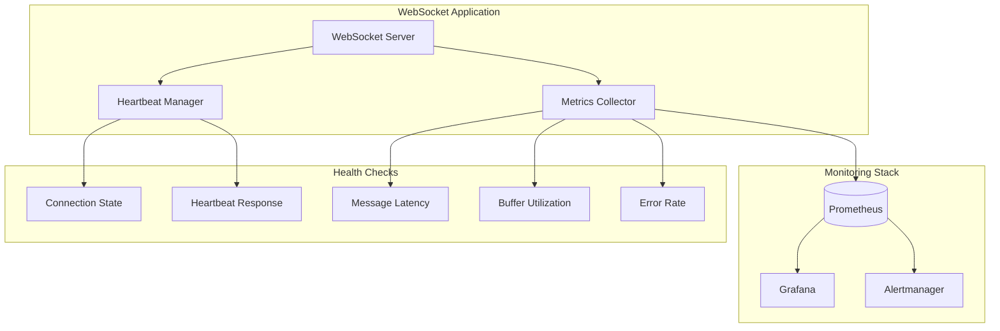

# How to Monitor WebSocket Connection Health

Author: [nawazdhandala](https://www.github.com/nawazdhandala)

Tags: WebSocket, Monitoring, Observability, Node.js, Real-time, Performance, Metrics

Description: Learn how to implement comprehensive health monitoring for WebSocket connections, including heartbeat mechanisms, latency tracking, and alerting on connection anomalies.

---

Monitoring WebSocket connection health is essential for maintaining reliable real-time applications. Unlike HTTP requests that complete quickly, WebSocket connections persist for extended periods, making it crucial to continuously verify their health, detect degradation early, and respond to issues before users are affected.

Effective WebSocket monitoring encompasses several dimensions: connection lifecycle events, message throughput, latency measurements, error rates, and resource utilization. Together, these metrics provide a complete picture of your WebSocket infrastructure health and help identify problems ranging from individual client issues to system-wide degradation.

In this guide, you will learn how to implement comprehensive health monitoring for WebSocket connections. We will cover heartbeat mechanisms, connection state tracking, metrics collection with Prometheus, latency measurement, and setting up alerts for anomalies.

## Health Monitoring Architecture

A robust monitoring system tracks health at multiple levels.



## Heartbeat Implementation

The heartbeat mechanism is the foundation of connection health monitoring. It detects dead connections that have not properly closed.

```javascript
// heartbeat-manager.js
// Comprehensive heartbeat management for WebSocket connections

const WebSocket = require('ws');
const EventEmitter = require('events');

class HeartbeatManager extends EventEmitter {
    constructor(options = {}) {
        super();

        // Configuration
        this.pingInterval = options.pingInterval || 30000;
        this.pongTimeout = options.pongTimeout || 10000;
        this.maxMissedPongs = options.maxMissedPongs || 2;

        // Connection tracking
        this.connections = new Map();

        // Metrics
        this.metrics = {
            totalPingsSent: 0,
            totalPongsReceived: 0,
            totalTimeouts: 0,
            totalTerminations: 0
        };
    }

    // Register a connection for heartbeat monitoring
    register(ws, connectionId, metadata = {}) {
        const connection = {
            ws,
            id: connectionId,
            metadata,
            state: 'healthy',
            isAlive: true,
            lastPing: null,
            lastPong: null,
            latency: null,
            missedPongs: 0,
            pingTimer: null,
            pongTimer: null,
            registeredAt: Date.now()
        };

        this.connections.set(connectionId, connection);

        // Set up pong handler
        ws.on('pong', () => this.handlePong(connectionId));

        // Start heartbeat
        this.startHeartbeat(connectionId);

        this.emit('registered', connectionId);

        return connection;
    }

    // Unregister a connection
    unregister(connectionId) {
        const connection = this.connections.get(connectionId);
        if (!connection) return;

        // Clear timers
        this.clearTimers(connection);

        this.connections.delete(connectionId);
        this.emit('unregistered', connectionId);
    }

    // Start heartbeat cycle for a connection
    startHeartbeat(connectionId) {
        const connection = this.connections.get(connectionId);
        if (!connection) return;

        connection.pingTimer = setInterval(() => {
            this.sendPing(connectionId);
        }, this.pingInterval);

        // Send initial ping
        this.sendPing(connectionId);
    }

    // Send ping to a connection
    sendPing(connectionId) {
        const connection = this.connections.get(connectionId);
        if (!connection) return;

        const ws = connection.ws;

        // Check if connection is still open
        if (ws.readyState !== WebSocket.OPEN) {
            this.handleUnhealthy(connectionId, 'Connection not open');
            return;
        }

        try {
            connection.lastPing = Date.now();
            connection.isAlive = false;
            ws.ping();
            this.metrics.totalPingsSent++;
        } catch (err) {
            this.handleUnhealthy(connectionId, `Ping failed: ${err.message}`);
            return;
        }

        // Set timeout for pong response
        connection.pongTimer = setTimeout(() => {
            this.handlePongTimeout(connectionId);
        }, this.pongTimeout);
    }

    // Handle pong response
    handlePong(connectionId) {
        const connection = this.connections.get(connectionId);
        if (!connection) return;

        const now = Date.now();

        // Clear pong timeout
        if (connection.pongTimer) {
            clearTimeout(connection.pongTimer);
            connection.pongTimer = null;
        }

        // Update connection state
        connection.isAlive = true;
        connection.lastPong = now;
        connection.missedPongs = 0;

        // Calculate latency
        if (connection.lastPing) {
            connection.latency = now - connection.lastPing;
        }

        // Update state if recovering
        if (connection.state !== 'healthy') {
            connection.state = 'healthy';
            this.emit('recovered', connectionId, connection.latency);
        }

        this.metrics.totalPongsReceived++;
        this.emit('pong', connectionId, connection.latency);
    }

    // Handle pong timeout
    handlePongTimeout(connectionId) {
        const connection = this.connections.get(connectionId);
        if (!connection) return;

        connection.missedPongs++;
        this.metrics.totalTimeouts++;

        this.emit('timeout', connectionId, connection.missedPongs);

        if (connection.missedPongs >= this.maxMissedPongs) {
            this.handleUnhealthy(connectionId, 'Max missed pongs exceeded');
        } else {
            connection.state = 'degraded';
            this.emit('degraded', connectionId, connection.missedPongs);
        }
    }

    // Handle unhealthy connection
    handleUnhealthy(connectionId, reason) {
        const connection = this.connections.get(connectionId);
        if (!connection) return;

        connection.state = 'unhealthy';

        this.emit('unhealthy', connectionId, reason);

        // Terminate the connection
        this.terminate(connectionId, reason);
    }

    // Terminate a connection
    terminate(connectionId, reason) {
        const connection = this.connections.get(connectionId);
        if (!connection) return;

        this.clearTimers(connection);

        try {
            connection.ws.terminate();
        } catch (err) {
            // Ignore termination errors
        }

        this.connections.delete(connectionId);
        this.metrics.totalTerminations++;

        this.emit('terminated', connectionId, reason);
    }

    // Clear all timers for a connection
    clearTimers(connection) {
        if (connection.pingTimer) {
            clearInterval(connection.pingTimer);
            connection.pingTimer = null;
        }
        if (connection.pongTimer) {
            clearTimeout(connection.pongTimer);
            connection.pongTimer = null;
        }
    }

    // Get connection health status
    getConnectionHealth(connectionId) {
        const connection = this.connections.get(connectionId);
        if (!connection) return null;

        return {
            id: connectionId,
            state: connection.state,
            isAlive: connection.isAlive,
            latency: connection.latency,
            missedPongs: connection.missedPongs,
            lastPing: connection.lastPing,
            lastPong: connection.lastPong,
            uptime: Date.now() - connection.registeredAt
        };
    }

    // Get overall health summary
    getHealthSummary() {
        const summary = {
            total: this.connections.size,
            healthy: 0,
            degraded: 0,
            unhealthy: 0,
            averageLatency: 0,
            maxLatency: 0,
            connections: []
        };

        let totalLatency = 0;
        let latencyCount = 0;

        for (const [id, conn] of this.connections) {
            switch (conn.state) {
                case 'healthy':
                    summary.healthy++;
                    break;
                case 'degraded':
                    summary.degraded++;
                    break;
                case 'unhealthy':
                    summary.unhealthy++;
                    break;
            }

            if (conn.latency !== null) {
                totalLatency += conn.latency;
                latencyCount++;
                summary.maxLatency = Math.max(summary.maxLatency, conn.latency);
            }

            summary.connections.push(this.getConnectionHealth(id));
        }

        if (latencyCount > 0) {
            summary.averageLatency = totalLatency / latencyCount;
        }

        return summary;
    }

    // Get metrics
    getMetrics() {
        return {
            ...this.metrics,
            activeConnections: this.connections.size,
            healthySummary: this.getHealthSummary()
        };
    }
}

module.exports = { HeartbeatManager };
```

## Connection State Tracking

Track the full lifecycle of connections for comprehensive monitoring.

```javascript
// connection-tracker.js
// Track connection lifecycle and state changes

const EventEmitter = require('events');

class ConnectionTracker extends EventEmitter {
    constructor() {
        super();

        this.connections = new Map();
        this.history = [];
        this.maxHistorySize = 1000;

        // Aggregate stats
        this.stats = {
            totalConnections: 0,
            totalDisconnections: 0,
            currentConnections: 0,
            peakConnections: 0,
            averageLifetime: 0,
            connectionsByState: {
                connecting: 0,
                open: 0,
                closing: 0,
                closed: 0
            }
        };
    }

    // Track new connection
    connect(connectionId, metadata = {}) {
        const connection = {
            id: connectionId,
            state: 'connecting',
            metadata,
            connectedAt: Date.now(),
            disconnectedAt: null,
            stateHistory: [
                { state: 'connecting', timestamp: Date.now() }
            ],
            messagesSent: 0,
            messagesReceived: 0,
            bytesSent: 0,
            bytesReceived: 0,
            errors: []
        };

        this.connections.set(connectionId, connection);

        this.stats.totalConnections++;
        this.stats.currentConnections++;
        this.stats.connectionsByState.connecting++;

        if (this.stats.currentConnections > this.stats.peakConnections) {
            this.stats.peakConnections = this.stats.currentConnections;
        }

        this.emit('connect', connectionId, metadata);

        return connection;
    }

    // Update connection state
    setState(connectionId, newState) {
        const connection = this.connections.get(connectionId);
        if (!connection) return;

        const oldState = connection.state;

        if (oldState === newState) return;

        // Update state counts
        this.stats.connectionsByState[oldState]--;
        this.stats.connectionsByState[newState]++;

        // Update connection
        connection.state = newState;
        connection.stateHistory.push({
            state: newState,
            timestamp: Date.now()
        });

        this.emit('stateChange', connectionId, oldState, newState);
    }

    // Track disconnection
    disconnect(connectionId, reason = 'unknown') {
        const connection = this.connections.get(connectionId);
        if (!connection) return;

        connection.disconnectedAt = Date.now();
        connection.disconnectReason = reason;

        const lifetime = connection.disconnectedAt - connection.connectedAt;

        // Update stats
        this.stats.totalDisconnections++;
        this.stats.currentConnections--;
        this.stats.connectionsByState[connection.state]--;

        // Update average lifetime
        this.stats.averageLifetime =
            ((this.stats.averageLifetime * (this.stats.totalDisconnections - 1)) + lifetime)
            / this.stats.totalDisconnections;

        // Add to history
        this.history.push({
            ...connection,
            lifetime
        });

        // Trim history
        if (this.history.length > this.maxHistorySize) {
            this.history.shift();
        }

        this.connections.delete(connectionId);

        this.emit('disconnect', connectionId, reason, lifetime);
    }

    // Track message
    trackMessage(connectionId, direction, bytes) {
        const connection = this.connections.get(connectionId);
        if (!connection) return;

        if (direction === 'sent') {
            connection.messagesSent++;
            connection.bytesSent += bytes;
        } else {
            connection.messagesReceived++;
            connection.bytesReceived += bytes;
        }
    }

    // Track error
    trackError(connectionId, error) {
        const connection = this.connections.get(connectionId);
        if (!connection) return;

        connection.errors.push({
            error: error.message || error,
            timestamp: Date.now()
        });

        this.emit('error', connectionId, error);
    }

    // Get connection info
    getConnection(connectionId) {
        return this.connections.get(connectionId);
    }

    // Get all connections
    getAllConnections() {
        return Array.from(this.connections.values());
    }

    // Get stats
    getStats() {
        return {
            ...this.stats,
            uptime: process.uptime(),
            timestamp: Date.now()
        };
    }

    // Get recent disconnections
    getRecentDisconnections(limit = 10) {
        return this.history.slice(-limit);
    }
}

module.exports = { ConnectionTracker };
```

## Prometheus Metrics Integration

Export WebSocket metrics for Prometheus scraping.

```javascript
// prometheus-metrics.js
// Prometheus metrics for WebSocket monitoring

const client = require('prom-client');

class WebSocketMetrics {
    constructor(prefix = 'websocket') {
        this.prefix = prefix;

        // Initialize metrics registry
        this.registry = new client.Registry();

        // Add default metrics
        client.collectDefaultMetrics({ register: this.registry });

        // Define WebSocket-specific metrics
        this.defineMetrics();
    }

    defineMetrics() {
        // Connection metrics
        this.connectionsTotal = new client.Counter({
            name: `${this.prefix}_connections_total`,
            help: 'Total number of WebSocket connections',
            labelNames: ['status'],
            registers: [this.registry]
        });

        this.connectionsActive = new client.Gauge({
            name: `${this.prefix}_connections_active`,
            help: 'Number of active WebSocket connections',
            registers: [this.registry]
        });

        this.connectionDuration = new client.Histogram({
            name: `${this.prefix}_connection_duration_seconds`,
            help: 'Duration of WebSocket connections in seconds',
            buckets: [1, 5, 15, 30, 60, 120, 300, 600, 1800, 3600],
            registers: [this.registry]
        });

        // Message metrics
        this.messagesTotal = new client.Counter({
            name: `${this.prefix}_messages_total`,
            help: 'Total number of WebSocket messages',
            labelNames: ['direction', 'type'],
            registers: [this.registry]
        });

        this.messageBytes = new client.Counter({
            name: `${this.prefix}_message_bytes_total`,
            help: 'Total bytes transferred via WebSocket',
            labelNames: ['direction'],
            registers: [this.registry]
        });

        this.messageSizeHistogram = new client.Histogram({
            name: `${this.prefix}_message_size_bytes`,
            help: 'Size of WebSocket messages in bytes',
            labelNames: ['direction'],
            buckets: [64, 256, 1024, 4096, 16384, 65536, 262144],
            registers: [this.registry]
        });

        // Latency metrics
        this.pingLatency = new client.Histogram({
            name: `${this.prefix}_ping_latency_seconds`,
            help: 'WebSocket ping-pong latency in seconds',
            buckets: [0.001, 0.005, 0.01, 0.025, 0.05, 0.1, 0.25, 0.5, 1],
            registers: [this.registry]
        });

        // Health metrics
        this.healthStatus = new client.Gauge({
            name: `${this.prefix}_health_status`,
            help: 'WebSocket connection health status (1=healthy, 0.5=degraded, 0=unhealthy)',
            labelNames: ['connection_id'],
            registers: [this.registry]
        });

        this.heartbeatTimeouts = new client.Counter({
            name: `${this.prefix}_heartbeat_timeouts_total`,
            help: 'Total number of heartbeat timeouts',
            registers: [this.registry]
        });

        // Error metrics
        this.errorsTotal = new client.Counter({
            name: `${this.prefix}_errors_total`,
            help: 'Total number of WebSocket errors',
            labelNames: ['type'],
            registers: [this.registry]
        });

        // Broadcast metrics
        this.broadcastsTotal = new client.Counter({
            name: `${this.prefix}_broadcasts_total`,
            help: 'Total number of broadcast operations',
            labelNames: ['status'],
            registers: [this.registry]
        });

        this.broadcastDuration = new client.Histogram({
            name: `${this.prefix}_broadcast_duration_seconds`,
            help: 'Duration of broadcast operations in seconds',
            buckets: [0.001, 0.005, 0.01, 0.05, 0.1, 0.5, 1, 5],
            registers: [this.registry]
        });

        this.broadcastRecipients = new client.Histogram({
            name: `${this.prefix}_broadcast_recipients`,
            help: 'Number of recipients per broadcast',
            buckets: [1, 10, 50, 100, 500, 1000, 5000, 10000],
            registers: [this.registry]
        });

        // Buffer metrics
        this.bufferUtilization = new client.Gauge({
            name: `${this.prefix}_buffer_utilization_bytes`,
            help: 'WebSocket send buffer utilization in bytes',
            labelNames: ['connection_id'],
            registers: [this.registry]
        });
    }

    // Record connection
    recordConnection(status = 'success') {
        this.connectionsTotal.inc({ status });
        if (status === 'success') {
            this.connectionsActive.inc();
        }
    }

    // Record disconnection
    recordDisconnection(durationSeconds) {
        this.connectionsActive.dec();
        this.connectionDuration.observe(durationSeconds);
    }

    // Record message
    recordMessage(direction, type, bytes) {
        this.messagesTotal.inc({ direction, type });
        this.messageBytes.inc({ direction }, bytes);
        this.messageSizeHistogram.observe({ direction }, bytes);
    }

    // Record ping latency
    recordPingLatency(latencyMs) {
        this.pingLatency.observe(latencyMs / 1000);
    }

    // Record health status
    recordHealthStatus(connectionId, status) {
        const value = status === 'healthy' ? 1 : status === 'degraded' ? 0.5 : 0;
        this.healthStatus.set({ connection_id: connectionId }, value);
    }

    // Record heartbeat timeout
    recordHeartbeatTimeout() {
        this.heartbeatTimeouts.inc();
    }

    // Record error
    recordError(type) {
        this.errorsTotal.inc({ type });
    }

    // Record broadcast
    recordBroadcast(status, durationMs, recipientCount) {
        this.broadcastsTotal.inc({ status });
        this.broadcastDuration.observe(durationMs / 1000);
        this.broadcastRecipients.observe(recipientCount);
    }

    // Record buffer utilization
    recordBufferUtilization(connectionId, bytes) {
        this.bufferUtilization.set({ connection_id: connectionId }, bytes);
    }

    // Remove connection-specific metrics
    removeConnectionMetrics(connectionId) {
        this.healthStatus.remove({ connection_id: connectionId });
        this.bufferUtilization.remove({ connection_id: connectionId });
    }

    // Get metrics for Prometheus
    async getMetrics() {
        return await this.registry.metrics();
    }

    // Get metrics content type
    getContentType() {
        return this.registry.contentType;
    }
}

module.exports = { WebSocketMetrics };
```

## Complete Monitoring Server

Here is a complete WebSocket server with integrated monitoring.

```javascript
// monitoring-server.js
// WebSocket server with comprehensive monitoring

const WebSocket = require('ws');
const http = require('http');
const { HeartbeatManager } = require('./heartbeat-manager');
const { ConnectionTracker } = require('./connection-tracker');
const { WebSocketMetrics } = require('./prometheus-metrics');

class MonitoredWebSocketServer {
    constructor(port) {
        this.port = port;

        // Initialize components
        this.heartbeat = new HeartbeatManager({
            pingInterval: 30000,
            pongTimeout: 10000,
            maxMissedPongs: 2
        });

        this.tracker = new ConnectionTracker();
        this.metrics = new WebSocketMetrics();

        // Set up event handlers
        this.setupEventHandlers();

        // Create HTTP server for metrics endpoint
        this.httpServer = http.createServer((req, res) => {
            this.handleHttpRequest(req, res);
        });

        // Create WebSocket server
        this.wss = new WebSocket.Server({ server: this.httpServer });

        this.setupWebSocketServer();
    }

    setupEventHandlers() {
        // Heartbeat events
        this.heartbeat.on('pong', (connectionId, latency) => {
            this.metrics.recordPingLatency(latency);
        });

        this.heartbeat.on('timeout', (connectionId, missedPongs) => {
            this.metrics.recordHeartbeatTimeout();
        });

        this.heartbeat.on('unhealthy', (connectionId, reason) => {
            this.metrics.recordHealthStatus(connectionId, 'unhealthy');
            this.tracker.trackError(connectionId, { message: reason });
        });

        this.heartbeat.on('degraded', (connectionId) => {
            this.metrics.recordHealthStatus(connectionId, 'degraded');
        });

        this.heartbeat.on('recovered', (connectionId) => {
            this.metrics.recordHealthStatus(connectionId, 'healthy');
        });

        this.heartbeat.on('terminated', (connectionId, reason) => {
            console.log(`Connection terminated: ${connectionId}, reason: ${reason}`);
        });

        // Tracker events
        this.tracker.on('disconnect', (connectionId, reason, lifetime) => {
            this.metrics.recordDisconnection(lifetime / 1000);
            this.metrics.removeConnectionMetrics(connectionId);
        });
    }

    setupWebSocketServer() {
        this.wss.on('connection', (ws, req) => {
            const connectionId = this.generateConnectionId();
            const metadata = {
                ip: req.socket.remoteAddress,
                userAgent: req.headers['user-agent']
            };

            console.log(`Connection opened: ${connectionId}`);

            // Track connection
            this.tracker.connect(connectionId, metadata);
            this.tracker.setState(connectionId, 'open');
            this.metrics.recordConnection('success');
            this.metrics.recordHealthStatus(connectionId, 'healthy');

            // Register for heartbeat
            this.heartbeat.register(ws, connectionId, metadata);

            // Store connection ID on websocket
            ws.connectionId = connectionId;

            // Handle messages
            ws.on('message', (data) => {
                this.handleMessage(ws, connectionId, data);
            });

            // Handle close
            ws.on('close', (code, reason) => {
                console.log(`Connection closed: ${connectionId}, code: ${code}`);
                this.handleClose(connectionId, code, reason);
            });

            // Handle error
            ws.on('error', (err) => {
                console.error(`Connection error: ${connectionId}:`, err.message);
                this.tracker.trackError(connectionId, err);
                this.metrics.recordError(err.code || 'unknown');
            });
        });

        this.wss.on('error', (err) => {
            console.error('WebSocket server error:', err);
            this.metrics.recordError('server_error');
        });
    }

    handleMessage(ws, connectionId, data) {
        const bytes = Buffer.byteLength(data);
        this.tracker.trackMessage(connectionId, 'received', bytes);
        this.metrics.recordMessage('received', 'message', bytes);

        // Process message
        try {
            const message = JSON.parse(data);
            this.processMessage(ws, connectionId, message);
        } catch (err) {
            this.sendError(ws, 'Invalid JSON');
        }
    }

    processMessage(ws, connectionId, message) {
        switch (message.action) {
            case 'ping':
                this.send(ws, connectionId, {
                    action: 'pong',
                    timestamp: Date.now()
                });
                break;

            case 'echo':
                this.send(ws, connectionId, {
                    action: 'echo',
                    data: message.data,
                    timestamp: Date.now()
                });
                break;

            default:
                this.send(ws, connectionId, {
                    action: 'ack',
                    originalAction: message.action
                });
        }
    }

    send(ws, connectionId, message) {
        if (ws.readyState !== WebSocket.OPEN) {
            return;
        }

        const data = JSON.stringify(message);
        const bytes = Buffer.byteLength(data);

        ws.send(data);

        this.tracker.trackMessage(connectionId, 'sent', bytes);
        this.metrics.recordMessage('sent', message.action || 'unknown', bytes);
    }

    sendError(ws, message) {
        this.send(ws, ws.connectionId, {
            action: 'error',
            message
        });
    }

    handleClose(connectionId, code, reason) {
        this.heartbeat.unregister(connectionId);
        this.tracker.disconnect(connectionId, reason || `code: ${code}`);
    }

    // Broadcast to all connections
    async broadcast(message) {
        const startTime = Date.now();
        let successCount = 0;
        let failCount = 0;

        const data = JSON.stringify(message);
        const bytes = Buffer.byteLength(data);

        for (const ws of this.wss.clients) {
            if (ws.readyState === WebSocket.OPEN) {
                try {
                    ws.send(data);
                    successCount++;
                    this.tracker.trackMessage(ws.connectionId, 'sent', bytes);
                } catch (err) {
                    failCount++;
                    this.metrics.recordError('broadcast_send');
                }
            }
        }

        const duration = Date.now() - startTime;
        const status = failCount === 0 ? 'success' : successCount > 0 ? 'partial' : 'failure';

        this.metrics.recordBroadcast(status, duration, successCount);

        return {
            sent: successCount,
            failed: failCount,
            duration
        };
    }

    // HTTP request handler for metrics and health endpoints
    async handleHttpRequest(req, res) {
        const url = new URL(req.url, `http://${req.headers.host}`);

        switch (url.pathname) {
            case '/metrics':
                const metrics = await this.metrics.getMetrics();
                res.writeHead(200, { 'Content-Type': this.metrics.getContentType() });
                res.end(metrics);
                break;

            case '/health':
                const health = this.getHealth();
                const statusCode = health.status === 'healthy' ? 200 : 503;
                res.writeHead(statusCode, { 'Content-Type': 'application/json' });
                res.end(JSON.stringify(health, null, 2));
                break;

            case '/stats':
                const stats = this.getStats();
                res.writeHead(200, { 'Content-Type': 'application/json' });
                res.end(JSON.stringify(stats, null, 2));
                break;

            default:
                res.writeHead(404);
                res.end('Not Found');
        }
    }

    // Get health status
    getHealth() {
        const heartbeatSummary = this.heartbeat.getHealthSummary();
        const trackerStats = this.tracker.getStats();

        const isHealthy =
            heartbeatSummary.unhealthy === 0 &&
            heartbeatSummary.averageLatency < 1000;

        return {
            status: isHealthy ? 'healthy' : 'degraded',
            timestamp: Date.now(),
            connections: {
                active: trackerStats.currentConnections,
                healthy: heartbeatSummary.healthy,
                degraded: heartbeatSummary.degraded,
                unhealthy: heartbeatSummary.unhealthy
            },
            latency: {
                average: heartbeatSummary.averageLatency,
                max: heartbeatSummary.maxLatency
            }
        };
    }

    // Get detailed stats
    getStats() {
        return {
            tracker: this.tracker.getStats(),
            heartbeat: this.heartbeat.getMetrics(),
            connections: this.heartbeat.getHealthSummary()
        };
    }

    // Start the server
    start() {
        this.httpServer.listen(this.port, () => {
            console.log(`WebSocket server running on port ${this.port}`);
            console.log(`Metrics available at http://localhost:${this.port}/metrics`);
            console.log(`Health check at http://localhost:${this.port}/health`);
        });
    }

    // Stop the server
    stop() {
        this.wss.close();
        this.httpServer.close();
    }

    generateConnectionId() {
        return Math.random().toString(36).substring(2, 15);
    }
}

// Start server
const server = new MonitoredWebSocketServer(8080);
server.start();

module.exports = { MonitoredWebSocketServer };
```

## Grafana Dashboard Configuration

Create a Grafana dashboard for visualizing WebSocket metrics.

```json
{
  "dashboard": {
    "title": "WebSocket Monitoring",
    "panels": [
      {
        "title": "Active Connections",
        "type": "stat",
        "targets": [
          {
            "expr": "websocket_connections_active",
            "legendFormat": "Active"
          }
        ]
      },
      {
        "title": "Connection Rate",
        "type": "graph",
        "targets": [
          {
            "expr": "rate(websocket_connections_total{status=\"success\"}[5m])",
            "legendFormat": "New connections/s"
          },
          {
            "expr": "rate(websocket_connections_total{status=\"failed\"}[5m])",
            "legendFormat": "Failed connections/s"
          }
        ]
      },
      {
        "title": "Ping Latency",
        "type": "graph",
        "targets": [
          {
            "expr": "histogram_quantile(0.5, rate(websocket_ping_latency_seconds_bucket[5m]))",
            "legendFormat": "p50"
          },
          {
            "expr": "histogram_quantile(0.95, rate(websocket_ping_latency_seconds_bucket[5m]))",
            "legendFormat": "p95"
          },
          {
            "expr": "histogram_quantile(0.99, rate(websocket_ping_latency_seconds_bucket[5m]))",
            "legendFormat": "p99"
          }
        ]
      },
      {
        "title": "Message Throughput",
        "type": "graph",
        "targets": [
          {
            "expr": "rate(websocket_messages_total{direction=\"received\"}[5m])",
            "legendFormat": "Received/s"
          },
          {
            "expr": "rate(websocket_messages_total{direction=\"sent\"}[5m])",
            "legendFormat": "Sent/s"
          }
        ]
      },
      {
        "title": "Errors",
        "type": "graph",
        "targets": [
          {
            "expr": "rate(websocket_errors_total[5m])",
            "legendFormat": "{{type}}"
          }
        ]
      },
      {
        "title": "Heartbeat Timeouts",
        "type": "graph",
        "targets": [
          {
            "expr": "rate(websocket_heartbeat_timeouts_total[5m])",
            "legendFormat": "Timeouts/s"
          }
        ]
      }
    ]
  }
}
```

## Alerting Rules

Configure Prometheus alerting rules for WebSocket anomalies.

```yaml
# websocket-alerts.yaml
# Prometheus alerting rules for WebSocket monitoring

groups:
  - name: websocket
    rules:
      # High latency alert
      - alert: WebSocketHighLatency
        expr: histogram_quantile(0.95, rate(websocket_ping_latency_seconds_bucket[5m])) > 0.5
        for: 5m
        labels:
          severity: warning
        annotations:
          summary: "WebSocket latency is high"
          description: "95th percentile ping latency is {{ $value }}s"

      # Connection drop rate
      - alert: WebSocketHighDisconnectRate
        expr: rate(websocket_connections_total{status="success"}[5m]) > 0 and rate(websocket_connections_total{status="success"}[5m]) - rate(websocket_connections_active[5m]) > 10
        for: 5m
        labels:
          severity: warning
        annotations:
          summary: "High WebSocket disconnect rate"
          description: "Connections are being dropped faster than normal"

      # Heartbeat timeout spike
      - alert: WebSocketHeartbeatTimeouts
        expr: rate(websocket_heartbeat_timeouts_total[5m]) > 1
        for: 2m
        labels:
          severity: warning
        annotations:
          summary: "WebSocket heartbeat timeouts increasing"
          description: "Heartbeat timeout rate: {{ $value }}/s"

      # Error rate
      - alert: WebSocketErrorRate
        expr: sum(rate(websocket_errors_total[5m])) > 5
        for: 5m
        labels:
          severity: critical
        annotations:
          summary: "High WebSocket error rate"
          description: "Error rate: {{ $value }}/s"

      # No active connections
      - alert: WebSocketNoConnections
        expr: websocket_connections_active == 0
        for: 10m
        labels:
          severity: warning
        annotations:
          summary: "No active WebSocket connections"
          description: "There have been no WebSocket connections for 10 minutes"

      # Connection capacity warning
      - alert: WebSocketCapacityWarning
        expr: websocket_connections_active > 8000
        for: 5m
        labels:
          severity: warning
        annotations:
          summary: "WebSocket connections approaching capacity"
          description: "Active connections: {{ $value }}"
```

## Client-Side Health Reporting

Implement client-side health monitoring that reports to the server.

```javascript
// client-health-reporter.js
// Client-side WebSocket health monitoring

class WebSocketHealthReporter {
    constructor(ws, options = {}) {
        this.ws = ws;
        this.reportInterval = options.reportInterval || 60000;
        this.latencyHistory = [];
        this.maxLatencyHistory = 100;

        this.stats = {
            messagesSent: 0,
            messagesReceived: 0,
            errors: 0,
            reconnects: 0,
            latencies: []
        };

        this.setupMonitoring();
    }

    setupMonitoring() {
        // Track outgoing messages
        const originalSend = this.ws.send.bind(this.ws);
        this.ws.send = (data) => {
            this.stats.messagesSent++;
            return originalSend(data);
        };

        // Track incoming messages
        this.ws.addEventListener('message', () => {
            this.stats.messagesReceived++;
        });

        // Track errors
        this.ws.addEventListener('error', () => {
            this.stats.errors++;
        });

        // Start periodic reporting
        this.startReporting();
    }

    // Measure round-trip latency
    async measureLatency() {
        return new Promise((resolve) => {
            const start = performance.now();
            const pingId = Math.random().toString(36).substring(7);

            const handler = (event) => {
                try {
                    const data = JSON.parse(event.data);
                    if (data.action === 'pong' && data.pingId === pingId) {
                        const latency = performance.now() - start;
                        this.recordLatency(latency);
                        this.ws.removeEventListener('message', handler);
                        resolve(latency);
                    }
                } catch {
                    // Not our response
                }
            };

            this.ws.addEventListener('message', handler);

            this.ws.send(JSON.stringify({
                action: 'ping',
                pingId,
                timestamp: Date.now()
            }));

            // Timeout after 10 seconds
            setTimeout(() => {
                this.ws.removeEventListener('message', handler);
                resolve(null);
            }, 10000);
        });
    }

    recordLatency(latency) {
        this.latencyHistory.push({
            value: latency,
            timestamp: Date.now()
        });

        if (this.latencyHistory.length > this.maxLatencyHistory) {
            this.latencyHistory.shift();
        }
    }

    getLatencyStats() {
        if (this.latencyHistory.length === 0) {
            return { avg: 0, min: 0, max: 0, p95: 0 };
        }

        const values = this.latencyHistory.map(l => l.value);
        const sorted = [...values].sort((a, b) => a - b);

        return {
            avg: values.reduce((a, b) => a + b, 0) / values.length,
            min: sorted[0],
            max: sorted[sorted.length - 1],
            p95: sorted[Math.floor(sorted.length * 0.95)]
        };
    }

    startReporting() {
        setInterval(async () => {
            await this.sendHealthReport();
        }, this.reportInterval);
    }

    async sendHealthReport() {
        const latency = await this.measureLatency();
        const latencyStats = this.getLatencyStats();

        const report = {
            action: 'healthReport',
            stats: {
                ...this.stats,
                currentLatency: latency,
                latencyStats,
                connectionAge: Date.now() - this.connectedAt,
                userAgent: navigator.userAgent,
                timestamp: Date.now()
            }
        };

        if (this.ws.readyState === WebSocket.OPEN) {
            this.ws.send(JSON.stringify(report));
        }
    }

    // Get current health status
    getHealth() {
        const latencyStats = this.getLatencyStats();

        let status = 'healthy';
        if (latencyStats.avg > 500) {
            status = 'degraded';
        }
        if (latencyStats.avg > 1000 || this.stats.errors > 5) {
            status = 'unhealthy';
        }

        return {
            status,
            stats: this.stats,
            latency: latencyStats
        };
    }
}

// Usage
const ws = new WebSocket('ws://localhost:8080');
ws.onopen = () => {
    const healthReporter = new WebSocketHealthReporter(ws);

    // Check health periodically
    setInterval(() => {
        const health = healthReporter.getHealth();
        console.log('Connection health:', health);
    }, 30000);
};
```

## Health Check Integration

Implement health checks for Kubernetes and load balancers.

```javascript
// health-check.js
// Health check endpoints for WebSocket server

const http = require('http');

class HealthCheckServer {
    constructor(wsServer, port = 8081) {
        this.wsServer = wsServer;
        this.port = port;

        this.server = http.createServer((req, res) => {
            this.handleRequest(req, res);
        });
    }

    handleRequest(req, res) {
        switch (req.url) {
            case '/health':
            case '/healthz':
                this.handleHealthCheck(res);
                break;

            case '/ready':
            case '/readyz':
                this.handleReadinessCheck(res);
                break;

            case '/live':
            case '/livez':
                this.handleLivenessCheck(res);
                break;

            default:
                res.writeHead(404);
                res.end('Not Found');
        }
    }

    handleHealthCheck(res) {
        const health = this.wsServer.getHealth();
        const statusCode = health.status === 'healthy' ? 200 : 503;

        res.writeHead(statusCode, { 'Content-Type': 'application/json' });
        res.end(JSON.stringify(health));
    }

    handleReadinessCheck(res) {
        const health = this.wsServer.getHealth();
        const isReady = health.status !== 'unhealthy';

        res.writeHead(isReady ? 200 : 503, { 'Content-Type': 'application/json' });
        res.end(JSON.stringify({
            ready: isReady,
            connections: health.connections.active
        }));
    }

    handleLivenessCheck(res) {
        // Basic liveness - just check if server is responding
        res.writeHead(200, { 'Content-Type': 'application/json' });
        res.end(JSON.stringify({
            alive: true,
            uptime: process.uptime()
        }));
    }

    start() {
        this.server.listen(this.port, () => {
            console.log(`Health check server running on port ${this.port}`);
        });
    }

    stop() {
        this.server.close();
    }
}

module.exports = { HealthCheckServer };
```

## Best Practices Summary

When implementing WebSocket health monitoring, follow these guidelines.

Implement heartbeat for all connections. Without heartbeat, you cannot detect connections that have silently failed.

Track multiple health dimensions. Connection state, latency, error rate, and throughput together provide a complete picture.

Use percentiles for latency metrics. Average latency hides outliers that affect user experience.

Set up alerting for anomalies. Detect problems before users report them.

Include client-side monitoring. Server metrics alone do not capture the full user experience.

Implement graceful degradation. When connections become unhealthy, handle them appropriately rather than crashing.

Expose health endpoints for orchestrators. Kubernetes and load balancers need health checks to route traffic correctly.

Retain historical data. Trends over time help identify gradual degradation and capacity planning needs.

## Conclusion

Comprehensive WebSocket monitoring requires tracking health at multiple levels: individual connections through heartbeat, aggregate metrics through Prometheus, and system health through structured endpoints. By implementing the patterns in this guide, you gain visibility into your WebSocket infrastructure that enables proactive issue detection and resolution.

The key is treating WebSocket connections as long-lived resources that need continuous monitoring, not fire-and-forget connections like HTTP requests. With proper heartbeat mechanisms, metrics collection, and alerting, you can maintain high availability and catch problems before they impact users.
