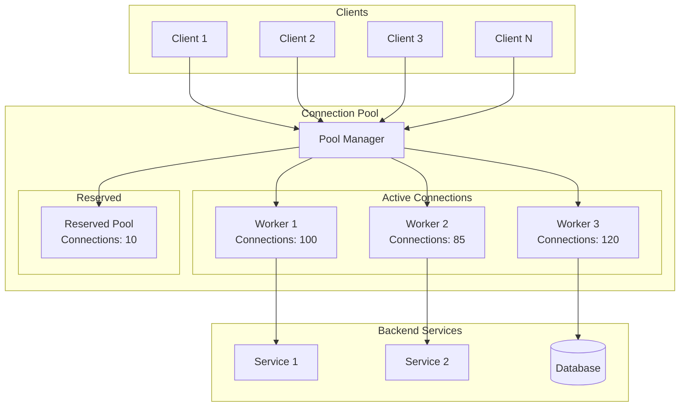
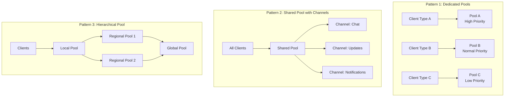

# How to Handle WebSocket Connection Pooling

Author: [nawazdhandala](https://www.github.com/nawazdhandala)

Tags: WebSocket, Connection Pooling, Node.js, Performance, Scalability, Architecture

Description: Learn how to implement efficient WebSocket connection pooling for improved performance, resource management, and scalability in real-time applications.

---

Connection pooling is a critical technique for managing WebSocket connections efficiently in high-traffic applications. Unlike HTTP connection pools, WebSocket pools must handle persistent, bidirectional connections while managing resources effectively. This guide covers implementation strategies, best practices, and common patterns.

## Understanding WebSocket Connection Pooling

WebSocket connection pooling differs from traditional HTTP pooling because connections are long-lived and stateful. The goal is to efficiently manage these connections, distribute load, and handle connection lifecycle events.



## Basic Connection Pool Implementation

```javascript
// connection-pool.js - Basic WebSocket connection pool

class WebSocketPool {
    constructor(options = {}) {
        this.maxConnections = options.maxConnections || 1000;
        this.minConnections = options.minConnections || 10;
        this.idleTimeout = options.idleTimeout || 300000; // 5 minutes
        this.connections = new Map();
        this.availableConnections = [];
        this.waitingQueue = [];
        this.stats = {
            totalCreated: 0,
            totalClosed: 0,
            currentActive: 0,
            currentIdle: 0,
            peakConnections: 0
        };
    }

    // Get a connection from the pool
    async acquire(clientId) {
        // Check for existing connection for this client
        if (this.connections.has(clientId)) {
            const conn = this.connections.get(clientId);
            conn.lastUsed = Date.now();
            return conn;
        }

        // Try to get an available connection
        if (this.availableConnections.length > 0) {
            const conn = this.availableConnections.pop();
            conn.clientId = clientId;
            conn.lastUsed = Date.now();
            this.connections.set(clientId, conn);
            this.stats.currentIdle--;
            this.stats.currentActive++;
            return conn;
        }

        // Create new connection if under limit
        if (this.connections.size < this.maxConnections) {
            const conn = await this.createConnection(clientId);
            return conn;
        }

        // Wait for available connection
        return this.waitForConnection(clientId);
    }

    // Create a new connection
    async createConnection(clientId) {
        const connection = {
            id: this.generateId(),
            clientId: clientId,
            createdAt: Date.now(),
            lastUsed: Date.now(),
            messageCount: 0,
            socket: null,
            state: 'connecting'
        };

        this.connections.set(clientId, connection);
        this.stats.totalCreated++;
        this.stats.currentActive++;

        if (this.stats.currentActive > this.stats.peakConnections) {
            this.stats.peakConnections = this.stats.currentActive;
        }

        return connection;
    }

    // Release connection back to pool
    release(clientId) {
        const conn = this.connections.get(clientId);
        if (!conn) return;

        this.connections.delete(clientId);
        conn.clientId = null;
        conn.lastUsed = Date.now();
        this.stats.currentActive--;

        // Check waiting queue first
        if (this.waitingQueue.length > 0) {
            const waiting = this.waitingQueue.shift();
            conn.clientId = waiting.clientId;
            this.connections.set(waiting.clientId, conn);
            this.stats.currentActive++;
            waiting.resolve(conn);
            return;
        }

        // Add to available pool
        this.availableConnections.push(conn);
        this.stats.currentIdle++;
    }

    // Wait for a connection to become available
    waitForConnection(clientId, timeout = 30000) {
        return new Promise((resolve, reject) => {
            const timeoutId = setTimeout(() => {
                const index = this.waitingQueue.findIndex(w => w.clientId === clientId);
                if (index !== -1) {
                    this.waitingQueue.splice(index, 1);
                }
                reject(new Error('Connection pool timeout'));
            }, timeout);

            this.waitingQueue.push({
                clientId,
                resolve: (conn) => {
                    clearTimeout(timeoutId);
                    resolve(conn);
                },
                timestamp: Date.now()
            });
        });
    }

    // Close a connection permanently
    close(clientId) {
        const conn = this.connections.get(clientId);
        if (!conn) return;

        if (conn.socket) {
            conn.socket.close();
        }

        this.connections.delete(clientId);
        this.stats.totalClosed++;
        this.stats.currentActive--;
    }

    // Clean up idle connections
    cleanup() {
        const now = Date.now();
        const toRemove = [];

        // Check idle connections
        for (const conn of this.availableConnections) {
            if (now - conn.lastUsed > this.idleTimeout) {
                toRemove.push(conn);
            }
        }

        // Remove excess idle connections
        const excess = this.availableConnections.length - this.minConnections;
        if (excess > 0) {
            const sorted = this.availableConnections.sort((a, b) => a.lastUsed - b.lastUsed);
            for (let i = 0; i < Math.min(excess, sorted.length); i++) {
                if (!toRemove.includes(sorted[i])) {
                    toRemove.push(sorted[i]);
                }
            }
        }

        // Perform cleanup
        for (const conn of toRemove) {
            const index = this.availableConnections.indexOf(conn);
            if (index !== -1) {
                this.availableConnections.splice(index, 1);
                if (conn.socket) {
                    conn.socket.close();
                }
                this.stats.currentIdle--;
                this.stats.totalClosed++;
            }
        }
    }

    generateId() {
        return `conn_${Date.now()}_${Math.random().toString(36).substr(2, 9)}`;
    }

    getStats() {
        return {
            ...this.stats,
            queueLength: this.waitingQueue.length,
            poolUtilization: (this.stats.currentActive / this.maxConnections * 100).toFixed(2) + '%'
        };
    }
}

module.exports = WebSocketPool;
```

## Server-Side Connection Pool with Load Balancing

```javascript
// server-pool.js - Production WebSocket server with connection pooling

const WebSocket = require('ws');
const http = require('http');
const cluster = require('cluster');
const os = require('os');

class WebSocketServerPool {
    constructor(options = {}) {
        this.port = options.port || 8080;
        this.maxConnectionsPerWorker = options.maxConnectionsPerWorker || 10000;
        this.workerCount = options.workers || os.cpus().length;
        this.healthCheckInterval = options.healthCheckInterval || 30000;

        this.workers = new Map();
        this.connectionCount = new Map();
    }

    start() {
        if (cluster.isMaster) {
            this.startMaster();
        } else {
            this.startWorker();
        }
    }

    startMaster() {
        console.log(`Master process ${process.pid} starting ${this.workerCount} workers`);

        // Fork workers
        for (let i = 0; i < this.workerCount; i++) {
            this.forkWorker();
        }

        // Handle worker messages
        cluster.on('message', (worker, message) => {
            this.handleWorkerMessage(worker, message);
        });

        // Replace dead workers
        cluster.on('exit', (worker, code, signal) => {
            console.log(`Worker ${worker.process.pid} died. Spawning replacement.`);
            this.workers.delete(worker.id);
            this.connectionCount.delete(worker.id);
            this.forkWorker();
        });

        // Start health checks
        setInterval(() => this.healthCheck(), this.healthCheckInterval);
    }

    forkWorker() {
        const worker = cluster.fork();
        this.workers.set(worker.id, worker);
        this.connectionCount.set(worker.id, 0);

        worker.on('message', (message) => {
            this.handleWorkerMessage(worker, message);
        });
    }

    handleWorkerMessage(worker, message) {
        switch (message.type) {
            case 'connection_count':
                this.connectionCount.set(worker.id, message.count);
                break;
            case 'worker_stats':
                // Store stats for monitoring
                break;
        }
    }

    healthCheck() {
        const stats = {
            workers: this.workers.size,
            connections: 0,
            distribution: []
        };

        for (const [id, count] of this.connectionCount) {
            stats.connections += count;
            stats.distribution.push({ workerId: id, connections: count });
        }

        console.log('Pool Health:', JSON.stringify(stats));

        // Rebalance if needed
        this.checkRebalance(stats.distribution);
    }

    checkRebalance(distribution) {
        if (distribution.length < 2) return;

        const avg = distribution.reduce((sum, w) => sum + w.connections, 0) / distribution.length;
        const threshold = avg * 0.3; // 30% deviation threshold

        for (const worker of distribution) {
            if (Math.abs(worker.connections - avg) > threshold) {
                console.log(`Worker ${worker.workerId} needs rebalancing: ${worker.connections} vs avg ${avg}`);
                // Signal worker to shed or accept connections
            }
        }
    }

    startWorker() {
        const pool = new WorkerConnectionPool({
            maxConnections: this.maxConnectionsPerWorker
        });

        const server = http.createServer();
        const wss = new WebSocket.Server({ server });

        wss.on('connection', (ws, req) => {
            const clientId = this.extractClientId(req);
            pool.addConnection(clientId, ws);

            ws.on('close', () => {
                pool.removeConnection(clientId);
            });

            ws.on('message', (message) => {
                pool.handleMessage(clientId, message);
            });
        });

        // Report stats to master
        setInterval(() => {
            process.send({
                type: 'connection_count',
                count: pool.getConnectionCount()
            });
        }, 5000);

        server.listen(this.port, () => {
            console.log(`Worker ${process.pid} listening on port ${this.port}`);
        });
    }

    extractClientId(req) {
        // Extract from query string or headers
        const url = new URL(req.url, `http://${req.headers.host}`);
        return url.searchParams.get('clientId') ||
               req.headers['x-client-id'] ||
               `anon_${Date.now()}`;
    }
}

class WorkerConnectionPool {
    constructor(options = {}) {
        this.maxConnections = options.maxConnections || 10000;
        this.connections = new Map();
        this.groups = new Map(); // For room/channel support
    }

    addConnection(clientId, socket) {
        if (this.connections.size >= this.maxConnections) {
            socket.close(1013, 'Server at capacity');
            return false;
        }

        this.connections.set(clientId, {
            socket,
            joinedAt: Date.now(),
            lastActivity: Date.now(),
            groups: new Set()
        });

        return true;
    }

    removeConnection(clientId) {
        const conn = this.connections.get(clientId);
        if (!conn) return;

        // Remove from all groups
        for (const group of conn.groups) {
            this.leaveGroup(clientId, group);
        }

        this.connections.delete(clientId);
    }

    handleMessage(clientId, message) {
        const conn = this.connections.get(clientId);
        if (!conn) return;

        conn.lastActivity = Date.now();

        try {
            const data = JSON.parse(message);
            this.routeMessage(clientId, data);
        } catch (e) {
            // Handle non-JSON messages
            conn.socket.send(JSON.stringify({ error: 'Invalid message format' }));
        }
    }

    routeMessage(clientId, data) {
        const conn = this.connections.get(clientId);
        if (!conn) return;

        switch (data.type) {
            case 'join':
                this.joinGroup(clientId, data.group);
                break;
            case 'leave':
                this.leaveGroup(clientId, data.group);
                break;
            case 'broadcast':
                this.broadcastToGroup(data.group, data.payload, clientId);
                break;
            case 'direct':
                this.sendDirect(data.targetId, data.payload);
                break;
            default:
                conn.socket.send(JSON.stringify({ type: 'echo', payload: data }));
        }
    }

    joinGroup(clientId, groupName) {
        const conn = this.connections.get(clientId);
        if (!conn) return;

        if (!this.groups.has(groupName)) {
            this.groups.set(groupName, new Set());
        }

        this.groups.get(groupName).add(clientId);
        conn.groups.add(groupName);
    }

    leaveGroup(clientId, groupName) {
        const conn = this.connections.get(clientId);
        if (!conn) return;

        const group = this.groups.get(groupName);
        if (group) {
            group.delete(clientId);
            if (group.size === 0) {
                this.groups.delete(groupName);
            }
        }

        conn.groups.delete(groupName);
    }

    broadcastToGroup(groupName, payload, excludeClient = null) {
        const group = this.groups.get(groupName);
        if (!group) return;

        const message = JSON.stringify({ type: 'broadcast', group: groupName, payload });

        for (const clientId of group) {
            if (clientId === excludeClient) continue;

            const conn = this.connections.get(clientId);
            if (conn && conn.socket.readyState === WebSocket.OPEN) {
                conn.socket.send(message);
            }
        }
    }

    sendDirect(targetId, payload) {
        const conn = this.connections.get(targetId);
        if (conn && conn.socket.readyState === WebSocket.OPEN) {
            conn.socket.send(JSON.stringify({ type: 'direct', payload }));
        }
    }

    getConnectionCount() {
        return this.connections.size;
    }
}

module.exports = { WebSocketServerPool, WorkerConnectionPool };
```

## Client-Side Connection Pool

```javascript
// client-pool.js - Client-side WebSocket connection pool for multiple endpoints

class ClientConnectionPool {
    constructor(options = {}) {
        this.maxConnectionsPerHost = options.maxConnectionsPerHost || 6;
        this.connectionTimeout = options.connectionTimeout || 10000;
        this.reconnectDelay = options.reconnectDelay || 1000;
        this.maxReconnectAttempts = options.maxReconnectAttempts || 5;

        this.pools = new Map(); // host -> connections
        this.pendingRequests = new Map(); // host -> queue
    }

    // Get or create connection to a host
    async getConnection(url) {
        const parsedUrl = new URL(url);
        const host = parsedUrl.host;

        // Initialize pool for host if needed
        if (!this.pools.has(host)) {
            this.pools.set(host, []);
            this.pendingRequests.set(host, []);
        }

        const pool = this.pools.get(host);

        // Find available connection
        const available = pool.find(conn =>
            conn.socket.readyState === WebSocket.OPEN &&
            !conn.inUse
        );

        if (available) {
            available.inUse = true;
            available.lastUsed = Date.now();
            return available;
        }

        // Create new connection if under limit
        if (pool.length < this.maxConnectionsPerHost) {
            return this.createConnection(url, host);
        }

        // Wait for available connection
        return this.waitForConnection(host);
    }

    async createConnection(url, host) {
        return new Promise((resolve, reject) => {
            const socket = new WebSocket(url);
            const connection = {
                socket,
                url,
                host,
                inUse: true,
                createdAt: Date.now(),
                lastUsed: Date.now(),
                reconnectAttempts: 0
            };

            const timeout = setTimeout(() => {
                socket.close();
                reject(new Error('Connection timeout'));
            }, this.connectionTimeout);

            socket.onopen = () => {
                clearTimeout(timeout);
                this.pools.get(host).push(connection);
                resolve(connection);
            };

            socket.onerror = (error) => {
                clearTimeout(timeout);
                reject(error);
            };

            socket.onclose = () => {
                this.handleDisconnect(connection);
            };
        });
    }

    waitForConnection(host) {
        return new Promise((resolve, reject) => {
            const timeout = setTimeout(() => {
                const queue = this.pendingRequests.get(host);
                const index = queue.findIndex(r => r.resolve === resolve);
                if (index !== -1) queue.splice(index, 1);
                reject(new Error('Pool exhausted'));
            }, this.connectionTimeout);

            this.pendingRequests.get(host).push({
                resolve: (conn) => {
                    clearTimeout(timeout);
                    resolve(conn);
                },
                reject
            });
        });
    }

    // Release connection back to pool
    release(connection) {
        connection.inUse = false;
        connection.lastUsed = Date.now();

        // Check if anyone is waiting
        const queue = this.pendingRequests.get(connection.host);
        if (queue && queue.length > 0) {
            const pending = queue.shift();
            connection.inUse = true;
            pending.resolve(connection);
        }
    }

    handleDisconnect(connection) {
        const pool = this.pools.get(connection.host);
        if (!pool) return;

        const index = pool.indexOf(connection);
        if (index !== -1) {
            pool.splice(index, 1);
        }

        // Attempt reconnection if was in use
        if (connection.inUse && connection.reconnectAttempts < this.maxReconnectAttempts) {
            this.reconnect(connection);
        }
    }

    async reconnect(connection) {
        connection.reconnectAttempts++;
        const delay = this.reconnectDelay * Math.pow(2, connection.reconnectAttempts - 1);

        await new Promise(resolve => setTimeout(resolve, delay));

        try {
            const newConn = await this.createConnection(connection.url, connection.host);
            console.log(`Reconnected to ${connection.host}`);
            return newConn;
        } catch (error) {
            console.error(`Reconnection failed for ${connection.host}:`, error);
            if (connection.reconnectAttempts < this.maxReconnectAttempts) {
                return this.reconnect(connection);
            }
        }
    }

    // Send message using pooled connection
    async send(url, message) {
        const connection = await this.getConnection(url);

        return new Promise((resolve, reject) => {
            try {
                connection.socket.send(JSON.stringify(message));
                resolve();
            } catch (error) {
                reject(error);
            } finally {
                this.release(connection);
            }
        });
    }

    // Get pool statistics
    getStats() {
        const stats = {};
        for (const [host, pool] of this.pools) {
            stats[host] = {
                total: pool.length,
                active: pool.filter(c => c.inUse).length,
                idle: pool.filter(c => !c.inUse).length,
                pending: this.pendingRequests.get(host)?.length || 0
            };
        }
        return stats;
    }

    // Close all connections
    closeAll() {
        for (const [host, pool] of this.pools) {
            for (const conn of pool) {
                conn.socket.close();
            }
        }
        this.pools.clear();
        this.pendingRequests.clear();
    }
}

// Usage example
const pool = new ClientConnectionPool({
    maxConnectionsPerHost: 4,
    connectionTimeout: 5000
});

// Send messages through pool
async function sendMessages() {
    try {
        await pool.send('wss://api.example.com/socket', { type: 'ping' });
        await pool.send('wss://api.example.com/socket', { type: 'subscribe', channel: 'updates' });
        console.log('Pool stats:', pool.getStats());
    } catch (error) {
        console.error('Send failed:', error);
    }
}
```

## Connection Pool Architecture Patterns



## Advanced Pool with Priority Queuing

```javascript
// priority-pool.js - Connection pool with priority queue

class PriorityConnectionPool {
    constructor(options = {}) {
        this.maxConnections = options.maxConnections || 1000;
        this.priorities = ['critical', 'high', 'normal', 'low'];
        this.reservedByPriority = {
            critical: Math.floor(this.maxConnections * 0.1),  // 10% reserved
            high: Math.floor(this.maxConnections * 0.2),      // 20% reserved
            normal: Math.floor(this.maxConnections * 0.4),    // 40% available
            low: Math.floor(this.maxConnections * 0.3)        // 30% available
        };

        this.connections = new Map();
        this.connectionsByPriority = {
            critical: new Set(),
            high: new Set(),
            normal: new Set(),
            low: new Set()
        };
        this.waitingQueues = {
            critical: [],
            high: [],
            normal: [],
            low: []
        };
    }

    async acquire(clientId, priority = 'normal') {
        // Validate priority
        if (!this.priorities.includes(priority)) {
            priority = 'normal';
        }

        // Check if client already has connection
        if (this.connections.has(clientId)) {
            return this.connections.get(clientId);
        }

        // Check capacity for this priority level
        if (this.canAcceptConnection(priority)) {
            return this.createConnection(clientId, priority);
        }

        // Check if we can preempt lower priority connection
        if (this.canPreempt(priority)) {
            await this.preemptConnection(priority);
            return this.createConnection(clientId, priority);
        }

        // Wait in priority queue
        return this.waitForConnection(clientId, priority);
    }

    canAcceptConnection(priority) {
        const totalConnections = this.connections.size;

        if (totalConnections >= this.maxConnections) {
            return false;
        }

        // Higher priorities can use any available capacity
        const priorityIndex = this.priorities.indexOf(priority);
        let availableCapacity = this.maxConnections - totalConnections;

        // Reserve capacity for higher priorities
        for (let i = 0; i < priorityIndex; i++) {
            const higherPriority = this.priorities[i];
            const reserved = this.reservedByPriority[higherPriority];
            const used = this.connectionsByPriority[higherPriority].size;
            availableCapacity -= Math.max(0, reserved - used);
        }

        return availableCapacity > 0;
    }

    canPreempt(priority) {
        const priorityIndex = this.priorities.indexOf(priority);

        // Check for lower priority connections to preempt
        for (let i = this.priorities.length - 1; i > priorityIndex; i--) {
            const lowerPriority = this.priorities[i];
            if (this.connectionsByPriority[lowerPriority].size > 0) {
                return true;
            }
        }

        return false;
    }

    async preemptConnection(forPriority) {
        const priorityIndex = this.priorities.indexOf(forPriority);

        // Find lowest priority connection to preempt
        for (let i = this.priorities.length - 1; i > priorityIndex; i--) {
            const lowerPriority = this.priorities[i];
            const connections = this.connectionsByPriority[lowerPriority];

            if (connections.size > 0) {
                const clientId = connections.values().next().value;
                const conn = this.connections.get(clientId);

                // Notify client of preemption
                if (conn.socket && conn.socket.readyState === 1) {
                    conn.socket.send(JSON.stringify({
                        type: 'preempted',
                        reason: 'Higher priority connection needed',
                        reconnectDelay: 5000
                    }));
                    conn.socket.close(1000, 'Preempted');
                }

                this.connections.delete(clientId);
                connections.delete(clientId);

                // Re-queue preempted client
                this.waitingQueues[lowerPriority].push({
                    clientId,
                    timestamp: Date.now()
                });

                return true;
            }
        }

        return false;
    }

    createConnection(clientId, priority) {
        const connection = {
            id: clientId,
            priority,
            socket: null,
            createdAt: Date.now(),
            lastActivity: Date.now()
        };

        this.connections.set(clientId, connection);
        this.connectionsByPriority[priority].add(clientId);

        return connection;
    }

    waitForConnection(clientId, priority) {
        return new Promise((resolve, reject) => {
            this.waitingQueues[priority].push({
                clientId,
                resolve,
                reject,
                timestamp: Date.now()
            });

            // Set timeout based on priority
            const timeouts = {
                critical: 5000,
                high: 15000,
                normal: 30000,
                low: 60000
            };

            setTimeout(() => {
                const queue = this.waitingQueues[priority];
                const index = queue.findIndex(w => w.clientId === clientId);
                if (index !== -1) {
                    queue.splice(index, 1);
                    reject(new Error(`Connection timeout for priority: ${priority}`));
                }
            }, timeouts[priority]);
        });
    }

    release(clientId) {
        const conn = this.connections.get(clientId);
        if (!conn) return;

        this.connections.delete(clientId);
        this.connectionsByPriority[conn.priority].delete(clientId);

        // Process waiting queue starting from highest priority
        for (const priority of this.priorities) {
            const queue = this.waitingQueues[priority];
            if (queue.length > 0 && this.canAcceptConnection(priority)) {
                const waiting = queue.shift();
                const newConn = this.createConnection(waiting.clientId, priority);
                waiting.resolve(newConn);
                return;
            }
        }
    }

    getStats() {
        return {
            total: this.connections.size,
            max: this.maxConnections,
            byPriority: {
                critical: this.connectionsByPriority.critical.size,
                high: this.connectionsByPriority.high.size,
                normal: this.connectionsByPriority.normal.size,
                low: this.connectionsByPriority.low.size
            },
            waiting: {
                critical: this.waitingQueues.critical.length,
                high: this.waitingQueues.high.length,
                normal: this.waitingQueues.normal.length,
                low: this.waitingQueues.low.length
            }
        };
    }
}

module.exports = PriorityConnectionPool;
```

## Monitoring and Metrics

```javascript
// pool-metrics.js - Connection pool monitoring

class PoolMetrics {
    constructor(pool) {
        this.pool = pool;
        this.metrics = {
            connections: {
                created: 0,
                closed: 0,
                rejected: 0,
                current: 0,
                peak: 0
            },
            latency: {
                acquire: [],
                release: []
            },
            errors: {
                timeout: 0,
                capacity: 0,
                other: 0
            },
            throughput: {
                messagesIn: 0,
                messagesOut: 0,
                bytesIn: 0,
                bytesOut: 0
            }
        };

        this.startTime = Date.now();
    }

    recordConnectionCreated() {
        this.metrics.connections.created++;
        this.metrics.connections.current++;
        if (this.metrics.connections.current > this.metrics.connections.peak) {
            this.metrics.connections.peak = this.metrics.connections.current;
        }
    }

    recordConnectionClosed() {
        this.metrics.connections.closed++;
        this.metrics.connections.current--;
    }

    recordAcquireLatency(startTime) {
        const latency = Date.now() - startTime;
        this.metrics.latency.acquire.push(latency);
        // Keep last 1000 samples
        if (this.metrics.latency.acquire.length > 1000) {
            this.metrics.latency.acquire.shift();
        }
    }

    recordError(type) {
        if (this.metrics.errors[type] !== undefined) {
            this.metrics.errors[type]++;
        } else {
            this.metrics.errors.other++;
        }
    }

    recordMessage(direction, bytes) {
        if (direction === 'in') {
            this.metrics.throughput.messagesIn++;
            this.metrics.throughput.bytesIn += bytes;
        } else {
            this.metrics.throughput.messagesOut++;
            this.metrics.throughput.bytesOut += bytes;
        }
    }

    getReport() {
        const uptime = Date.now() - this.startTime;
        const acquireLatencies = this.metrics.latency.acquire;

        return {
            uptime: Math.floor(uptime / 1000),
            connections: {
                ...this.metrics.connections,
                utilization: `${((this.metrics.connections.current / this.pool.maxConnections) * 100).toFixed(2)}%`
            },
            latency: {
                acquire: {
                    avg: this.calculateAverage(acquireLatencies),
                    p50: this.calculatePercentile(acquireLatencies, 50),
                    p95: this.calculatePercentile(acquireLatencies, 95),
                    p99: this.calculatePercentile(acquireLatencies, 99)
                }
            },
            errors: this.metrics.errors,
            throughput: {
                messagesPerSecond: (this.metrics.throughput.messagesIn / (uptime / 1000)).toFixed(2),
                bytesPerSecond: (this.metrics.throughput.bytesIn / (uptime / 1000)).toFixed(2)
            }
        };
    }

    calculateAverage(arr) {
        if (arr.length === 0) return 0;
        return Math.round(arr.reduce((a, b) => a + b, 0) / arr.length);
    }

    calculatePercentile(arr, percentile) {
        if (arr.length === 0) return 0;
        const sorted = [...arr].sort((a, b) => a - b);
        const index = Math.ceil((percentile / 100) * sorted.length) - 1;
        return sorted[index];
    }
}

module.exports = PoolMetrics;
```

## Conclusion

Effective WebSocket connection pooling requires careful consideration of your application's specific needs. Key takeaways include: implement proper connection lifecycle management with creation, usage tracking, and cleanup; use priority queuing for applications with different client tiers; monitor pool metrics to identify bottlenecks and optimize configuration; consider using worker processes or clusters for horizontal scaling; and implement graceful degradation when pool capacity is reached. By following these patterns, you can build WebSocket applications that efficiently handle thousands of concurrent connections while maintaining responsiveness and reliability.
