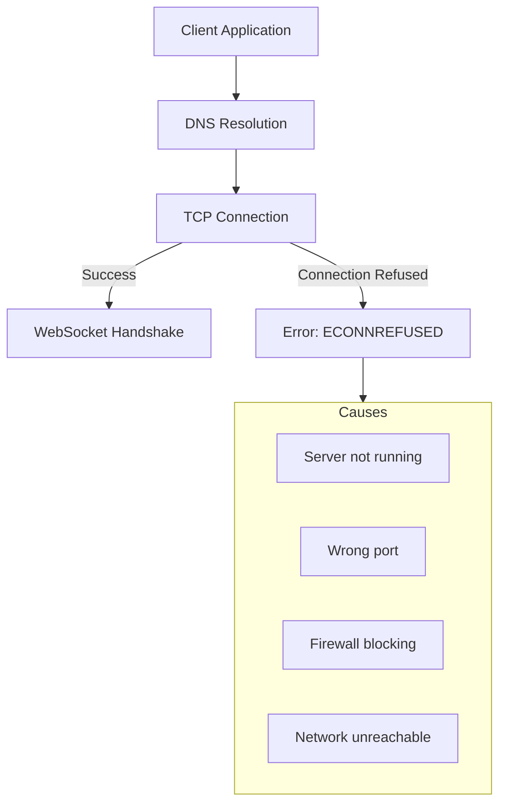
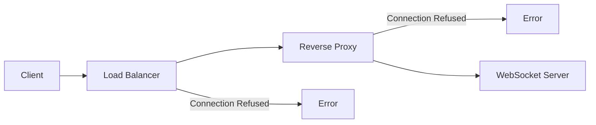

# How to Fix "Connection Refused" WebSocket Errors

Author: [nawazdhandala](https://www.github.com/nawazdhandala)

Tags: WebSocket, Troubleshooting, Networking, Node.js, Python, DevOps

Description: A practical guide to diagnosing and fixing WebSocket connection refused errors, covering server configuration, firewall issues, proxy settings, and common programming mistakes.

---

The "Connection Refused" error in WebSocket connections indicates that the server actively rejected the connection attempt. This error occurs at the TCP level before the WebSocket handshake can begin. Understanding the root causes helps you fix these issues quickly.

## Understanding Connection Refused Errors

When a WebSocket client receives a connection refused error, the TCP connection could not be established. This differs from other WebSocket errors that occur during the handshake or after the connection is open.



## Common Causes and Solutions

### 1. Server Not Running

The most common cause is that the WebSocket server is not running or crashed.

```javascript
// Node.js WebSocket server with proper error handling
const WebSocket = require('ws');

const PORT = process.env.WS_PORT || 8080;
const HOST = process.env.WS_HOST || '0.0.0.0';

const wss = new WebSocket.Server({
  host: HOST,
  port: PORT
}, () => {
  console.log(`WebSocket server running on ws://${HOST}:${PORT}`);
});

// Handle server errors
wss.on('error', (error) => {
  console.error('WebSocket Server Error:', error.message);

  if (error.code === 'EADDRINUSE') {
    console.error(`Port ${PORT} is already in use`);
    process.exit(1);
  }
});

// Handle connection errors
wss.on('connection', (ws, req) => {
  const clientIP = req.socket.remoteAddress;
  console.log(`Client connected from ${clientIP}`);

  ws.on('error', (error) => {
    console.error('Client connection error:', error.message);
  });

  ws.on('close', (code, reason) => {
    console.log(`Client disconnected: ${code} - ${reason}`);
  });
});

// Graceful shutdown
process.on('SIGTERM', () => {
  console.log('Shutting down WebSocket server...');
  wss.close(() => {
    console.log('Server closed');
    process.exit(0);
  });
});
```

Check if the server is running.

```bash
# Check if process is running
ps aux | grep node

# Check if port is listening
netstat -tlnp | grep 8080
# or
ss -tlnp | grep 8080
# or on macOS
lsof -i :8080

# Test TCP connection
nc -zv localhost 8080
```

### 2. Binding to Wrong Interface

Servers bound to localhost (127.0.0.1) reject external connections.

```javascript
// Wrong: Only accepts local connections
const wss = new WebSocket.Server({
  host: '127.0.0.1',  // localhost only
  port: 8080
});

// Correct: Accepts connections from any interface
const wss = new WebSocket.Server({
  host: '0.0.0.0',  // all interfaces
  port: 8080
});
```

Python example with correct binding.

```python
import asyncio
import websockets

async def handler(websocket, path):
    async for message in websocket:
        print(f"Received: {message}")
        await websocket.send(f"Echo: {message}")

async def main():
    # Bind to all interfaces
    async with websockets.serve(
        handler,
        "0.0.0.0",  # Accept connections from any IP
        8080
    ):
        print("WebSocket server started on ws://0.0.0.0:8080")
        await asyncio.Future()  # Run forever

if __name__ == "__main__":
    asyncio.run(main())
```

### 3. Firewall Blocking Connections

Firewalls may block WebSocket traffic. Configure firewall rules to allow the port.

```bash
# Linux iptables - allow incoming WebSocket traffic
sudo iptables -A INPUT -p tcp --dport 8080 -j ACCEPT

# UFW (Ubuntu)
sudo ufw allow 8080/tcp

# firewalld (CentOS/RHEL)
sudo firewall-cmd --permanent --add-port=8080/tcp
sudo firewall-cmd --reload

# Windows Firewall (PowerShell)
New-NetFirewallRule -DisplayName "WebSocket Server" `
  -Direction Inbound -Protocol TCP -LocalPort 8080 -Action Allow
```

### 4. Port Already in Use

Another process may be using the port.

```bash
# Find process using the port
lsof -i :8080

# Kill process if needed (use with caution)
kill -9 $(lsof -t -i:8080)

# Or use fuser
fuser -k 8080/tcp
```

Implement port conflict handling in your server.

```javascript
const WebSocket = require('ws');
const net = require('net');

async function findAvailablePort(startPort) {
  return new Promise((resolve, reject) => {
    const server = net.createServer();

    server.once('error', (err) => {
      if (err.code === 'EADDRINUSE') {
        // Try next port
        findAvailablePort(startPort + 1).then(resolve).catch(reject);
      } else {
        reject(err);
      }
    });

    server.once('listening', () => {
      const port = server.address().port;
      server.close(() => resolve(port));
    });

    server.listen(startPort);
  });
}

async function startServer() {
  const preferredPort = 8080;

  try {
    const port = await findAvailablePort(preferredPort);

    if (port !== preferredPort) {
      console.log(`Port ${preferredPort} in use, using port ${port}`);
    }

    const wss = new WebSocket.Server({ port });
    console.log(`WebSocket server running on port ${port}`);

    return wss;
  } catch (error) {
    console.error('Failed to start server:', error.message);
    process.exit(1);
  }
}

startServer();
```

### 5. Docker Container Networking Issues

When running WebSocket servers in Docker, networking configuration matters.

```dockerfile
FROM node:18-alpine

WORKDIR /app
COPY package*.json ./
RUN npm ci --only=production
COPY . .

# Expose the WebSocket port
EXPOSE 8080

# Run server bound to all interfaces
CMD ["node", "server.js"]
```

```yaml
# docker-compose.yml
version: '3.8'
services:
  websocket-server:
    build: .
    ports:
      - "8080:8080"  # Map host port to container port
    environment:
      - WS_HOST=0.0.0.0
      - WS_PORT=8080
    networks:
      - app-network
    restart: unless-stopped

networks:
  app-network:
    driver: bridge
```

```bash
# Run container with port mapping
docker run -p 8080:8080 websocket-server

# Verify container is running
docker ps

# Check container logs
docker logs websocket-server

# Test from host
nc -zv localhost 8080
```

### 6. Proxy or Load Balancer Misconfiguration



NGINX reverse proxy configuration for WebSocket.

```nginx
# /etc/nginx/conf.d/websocket.conf

upstream websocket_backend {
    # WebSocket backend servers
    server 127.0.0.1:8080;
    server 127.0.0.1:8081;

    # Keep connections alive
    keepalive 64;
}

server {
    listen 80;
    server_name ws.example.com;

    location / {
        proxy_pass http://websocket_backend;

        # WebSocket specific headers
        proxy_http_version 1.1;
        proxy_set_header Upgrade $http_upgrade;
        proxy_set_header Connection "upgrade";
        proxy_set_header Host $host;
        proxy_set_header X-Real-IP $remote_addr;
        proxy_set_header X-Forwarded-For $proxy_add_x_forwarded_for;

        # Timeouts for long-lived connections
        proxy_connect_timeout 7d;
        proxy_send_timeout 7d;
        proxy_read_timeout 7d;
    }
}
```

### 7. Client-Side Connection Issues

Implement robust client connection with retry logic.

```javascript
class WebSocketClient {
  constructor(url, options = {}) {
    this.url = url;
    this.reconnectInterval = options.reconnectInterval || 1000;
    this.maxReconnectInterval = options.maxReconnectInterval || 30000;
    this.reconnectAttempts = 0;
    this.maxReconnectAttempts = options.maxReconnectAttempts || 10;
    this.ws = null;
  }

  connect() {
    return new Promise((resolve, reject) => {
      console.log(`Connecting to ${this.url}...`);

      try {
        this.ws = new WebSocket(this.url);
      } catch (error) {
        // Handle invalid URL or other immediate errors
        reject(new Error(`Failed to create WebSocket: ${error.message}`));
        return;
      }

      this.ws.onopen = () => {
        console.log('WebSocket connected');
        this.reconnectAttempts = 0;
        resolve(this.ws);
      };

      this.ws.onerror = (error) => {
        console.error('WebSocket error:', error);
      };

      this.ws.onclose = (event) => {
        console.log(`WebSocket closed: ${event.code} - ${event.reason}`);

        // Connection refused typically shows as code 1006
        if (event.code === 1006) {
          console.log('Connection refused or server unreachable');
          this.attemptReconnect();
        }
      };
    });
  }

  attemptReconnect() {
    if (this.reconnectAttempts >= this.maxReconnectAttempts) {
      console.error('Max reconnection attempts reached');
      return;
    }

    this.reconnectAttempts++;

    // Exponential backoff
    const delay = Math.min(
      this.reconnectInterval * Math.pow(2, this.reconnectAttempts - 1),
      this.maxReconnectInterval
    );

    console.log(`Reconnecting in ${delay}ms (attempt ${this.reconnectAttempts})`);

    setTimeout(() => {
      this.connect().catch(() => {
        // Connection failed, will retry via onclose handler
      });
    }, delay);
  }

  send(data) {
    if (this.ws && this.ws.readyState === WebSocket.OPEN) {
      this.ws.send(JSON.stringify(data));
    } else {
      console.error('WebSocket not connected');
    }
  }

  close() {
    if (this.ws) {
      this.maxReconnectAttempts = 0;  // Prevent reconnection
      this.ws.close(1000, 'Client closing connection');
    }
  }
}

// Usage
const client = new WebSocketClient('ws://localhost:8080');
client.connect()
  .then((ws) => {
    ws.onmessage = (event) => {
      console.log('Received:', event.data);
    };
    client.send({ type: 'hello', message: 'Hello server!' });
  })
  .catch((error) => {
    console.error('Failed to connect:', error.message);
  });
```

## Diagnostic Script

Create a diagnostic script to troubleshoot connection issues.

```bash
#!/bin/bash
# websocket-diagnose.sh

HOST="${1:-localhost}"
PORT="${2:-8080}"

echo "Diagnosing WebSocket connection to ${HOST}:${PORT}"
echo "================================================"

# DNS resolution
echo -e "\n1. DNS Resolution:"
if host "${HOST}" > /dev/null 2>&1; then
    echo "   DNS lookup successful"
    host "${HOST}"
else
    echo "   DNS lookup failed or HOST is an IP address"
fi

# TCP connectivity
echo -e "\n2. TCP Connection Test:"
if nc -zw5 "${HOST}" "${PORT}" 2>/dev/null; then
    echo "   TCP connection successful"
else
    echo "   TCP connection FAILED - port may be closed or blocked"
fi

# Port status (local)
echo -e "\n3. Local Port Status:"
if command -v ss > /dev/null; then
    ss -tlnp | grep ":${PORT}" || echo "   Port ${PORT} not listening locally"
elif command -v netstat > /dev/null; then
    netstat -tlnp 2>/dev/null | grep ":${PORT}" || echo "   Port ${PORT} not listening locally"
fi

# Firewall status
echo -e "\n4. Firewall Status:"
if command -v ufw > /dev/null; then
    sudo ufw status | grep "${PORT}" || echo "   No UFW rule for port ${PORT}"
elif command -v firewall-cmd > /dev/null; then
    firewall-cmd --list-ports | grep "${PORT}" || echo "   No firewalld rule for port ${PORT}"
fi

# HTTP upgrade test
echo -e "\n5. HTTP Upgrade Request:"
curl -sI -m 5 \
    -H "Connection: Upgrade" \
    -H "Upgrade: websocket" \
    -H "Sec-WebSocket-Key: dGhlIHNhbXBsZSBub25jZQ==" \
    -H "Sec-WebSocket-Version: 13" \
    "http://${HOST}:${PORT}/" 2>/dev/null || echo "   HTTP request failed"

echo -e "\n================================================"
echo "Diagnosis complete"
```

## Checklist for Troubleshooting

Use this checklist when debugging connection refused errors:

1. **Server Status**
   - Is the WebSocket server process running?
   - Check process list and server logs

2. **Port Configuration**
   - Is the server listening on the correct port?
   - Is the server bound to the correct interface (0.0.0.0 vs 127.0.0.1)?

3. **Network Path**
   - Can you ping the server?
   - Can you establish a TCP connection to the port?

4. **Firewall Rules**
   - Is the port allowed in local firewall?
   - Is the port allowed in cloud security groups?

5. **Proxy/Load Balancer**
   - Is the proxy configured for WebSocket upgrade?
   - Are backend health checks passing?

6. **Container Networking**
   - Is the port exposed in Dockerfile?
   - Is port mapping correct in docker-compose or run command?

Connection refused errors are almost always infrastructure-related rather than application code issues. Work through the network stack systematically from server to client to identify the blocking point.
