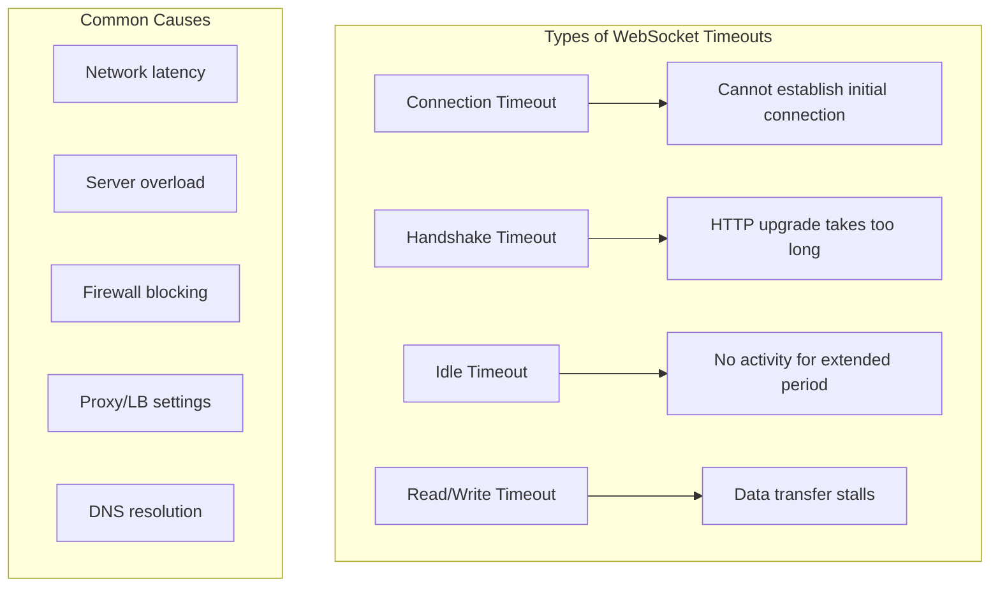
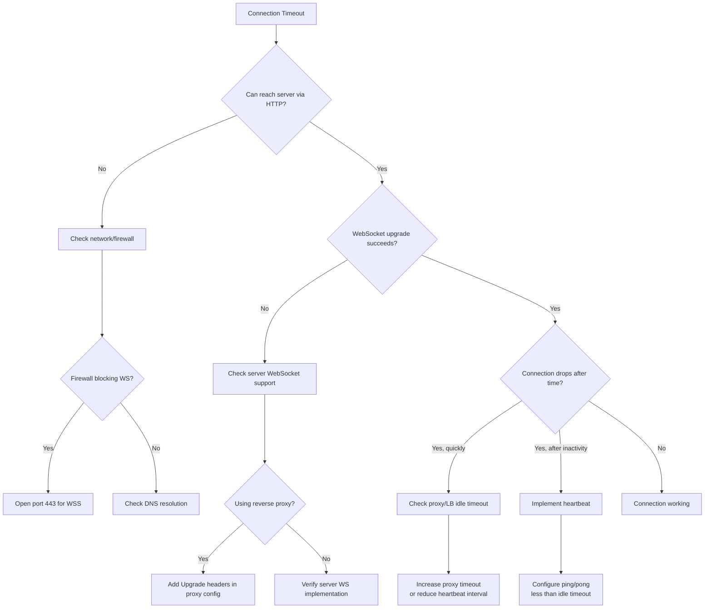

# How to Fix 'Connection Timeout' WebSocket Errors

Author: [nawazdhandala](https://www.github.com/nawazdhandala)

Tags: WebSocket, Connection Timeout, Troubleshooting, JavaScript, Node.js, Network, DevOps

Description: A practical guide to diagnosing and fixing WebSocket connection timeout errors caused by network issues, server configuration, proxies, and load balancers.

---

WebSocket connection timeout errors occur when a connection cannot be established or is dropped due to time limits being exceeded. These errors can happen during the initial handshake, during idle periods, or when sending/receiving messages. This guide covers the common causes and solutions for WebSocket timeout issues.

## Understanding WebSocket Timeout Types



## Diagnosing Connection Timeouts

Start by identifying where the timeout occurs:

```javascript
// Client-side: Comprehensive timeout diagnostics
class WebSocketDiagnostics {
    constructor(url) {
        this.url = url;
        this.timings = {};
    }

    async runDiagnostics() {
        console.log('Starting WebSocket diagnostics for:', this.url);

        // Test 1: DNS and basic connectivity
        await this.testConnectivity();

        // Test 2: WebSocket connection with timing
        await this.testWebSocket();

        // Test 3: Identify timeout source
        this.analyzeResults();

        return this.getReport();
    }

    async testConnectivity() {
        const urlObj = new URL(this.url);
        const httpUrl = `${urlObj.protocol === 'wss:' ? 'https:' : 'http:'}//${urlObj.host}`;

        this.timings.connectivityStart = performance.now();

        try {
            const response = await fetch(httpUrl, {
                method: 'HEAD',
                mode: 'no-cors'
            });
            this.timings.connectivityEnd = performance.now();
            this.timings.connectivityDuration =
                this.timings.connectivityEnd - this.timings.connectivityStart;
            console.log(`HTTP connectivity: ${this.timings.connectivityDuration.toFixed(0)}ms`);
        } catch (error) {
            this.timings.connectivityError = error.message;
            console.error('Connectivity test failed:', error);
        }
    }

    testWebSocket() {
        return new Promise((resolve) => {
            this.timings.wsStart = performance.now();

            const timeout = setTimeout(() => {
                this.timings.wsTimeout = true;
                this.timings.wsError = 'Connection timeout after 30 seconds';
                resolve();
            }, 30000);

            try {
                const ws = new WebSocket(this.url);

                ws.onopen = () => {
                    clearTimeout(timeout);
                    this.timings.wsConnected = performance.now();
                    this.timings.wsConnectionDuration =
                        this.timings.wsConnected - this.timings.wsStart;
                    console.log(`WebSocket connected: ${this.timings.wsConnectionDuration.toFixed(0)}ms`);

                    // Test message round-trip
                    const pingStart = performance.now();
                    ws.send(JSON.stringify({ type: 'ping', timestamp: pingStart }));

                    ws.onmessage = (event) => {
                        this.timings.wsRoundTrip = performance.now() - pingStart;
                        console.log(`Message round-trip: ${this.timings.wsRoundTrip.toFixed(0)}ms`);
                        ws.close();
                        resolve();
                    };
                };

                ws.onerror = (error) => {
                    clearTimeout(timeout);
                    this.timings.wsError = 'Connection error';
                    this.timings.wsErrorTime = performance.now() - this.timings.wsStart;
                    resolve();
                };

                ws.onclose = (event) => {
                    clearTimeout(timeout);
                    if (!this.timings.wsConnected) {
                        this.timings.wsError = `Connection closed: ${event.code} ${event.reason}`;
                    }
                    resolve();
                };
            } catch (error) {
                clearTimeout(timeout);
                this.timings.wsError = error.message;
                resolve();
            }
        });
    }

    analyzeResults() {
        this.analysis = [];

        if (this.timings.connectivityError) {
            this.analysis.push({
                issue: 'Basic connectivity failed',
                suggestion: 'Check network connection and server availability'
            });
        }

        if (this.timings.connectivityDuration > 5000) {
            this.analysis.push({
                issue: 'High network latency',
                suggestion: 'Server may be geographically distant or network congested'
            });
        }

        if (this.timings.wsTimeout) {
            this.analysis.push({
                issue: 'WebSocket connection timed out',
                suggestion: 'Check firewall rules, proxy settings, and server WebSocket support'
            });
        }

        if (this.timings.wsConnectionDuration > 10000) {
            this.analysis.push({
                issue: 'Slow WebSocket handshake',
                suggestion: 'Server may be overloaded or SSL handshake is slow'
            });
        }

        if (this.timings.wsRoundTrip > 1000) {
            this.analysis.push({
                issue: 'High message latency',
                suggestion: 'Network path has high latency or server processing is slow'
            });
        }
    }

    getReport() {
        return {
            url: this.url,
            timings: this.timings,
            analysis: this.analysis,
            timestamp: new Date().toISOString()
        };
    }
}

// Usage
const diagnostics = new WebSocketDiagnostics('wss://api.example.com/ws');
diagnostics.runDiagnostics().then(report => {
    console.log('Diagnostic Report:', JSON.stringify(report, null, 2));
});
```

## Fix 1: Client-Side Connection Timeout Handling

Implement proper timeout handling on the client:

```javascript
// Client-side: Robust connection with timeout handling
class TimeoutSafeWebSocket {
    constructor(url, options = {}) {
        this.url = url;
        this.connectionTimeout = options.connectionTimeout || 10000;
        this.messageTimeout = options.messageTimeout || 30000;
        this.maxRetries = options.maxRetries || 5;
        this.retryDelay = options.retryDelay || 1000;

        this.retryCount = 0;
        this.pendingRequests = new Map();
        this.requestId = 0;

        this.connect();
    }

    connect() {
        return new Promise((resolve, reject) => {
            console.log(`Connecting to ${this.url} (attempt ${this.retryCount + 1})`);

            // Set connection timeout
            const connectionTimer = setTimeout(() => {
                if (this.socket) {
                    this.socket.close();
                }
                this.handleConnectionTimeout();
            }, this.connectionTimeout);

            try {
                this.socket = new WebSocket(this.url);

                this.socket.onopen = () => {
                    clearTimeout(connectionTimer);
                    console.log('Connection established');
                    this.retryCount = 0;
                    this.startHeartbeat();
                    resolve();
                };

                this.socket.onerror = (error) => {
                    clearTimeout(connectionTimer);
                    console.error('Connection error');
                };

                this.socket.onclose = (event) => {
                    clearTimeout(connectionTimer);
                    this.stopHeartbeat();
                    this.handleClose(event);
                };

                this.socket.onmessage = (event) => {
                    this.handleMessage(event);
                };
            } catch (error) {
                clearTimeout(connectionTimer);
                console.error('Failed to create WebSocket:', error);
                this.scheduleRetry();
            }
        });
    }

    handleConnectionTimeout() {
        console.error(`Connection timeout after ${this.connectionTimeout}ms`);
        this.scheduleRetry();
    }

    handleClose(event) {
        console.log(`Connection closed: ${event.code}`);

        // Reject all pending requests
        this.pendingRequests.forEach((request, id) => {
            clearTimeout(request.timer);
            request.reject(new Error('Connection closed'));
        });
        this.pendingRequests.clear();

        // Attempt reconnect for abnormal closures
        if (event.code !== 1000) {
            this.scheduleRetry();
        }
    }

    scheduleRetry() {
        if (this.retryCount >= this.maxRetries) {
            console.error('Max retries reached');
            return;
        }

        this.retryCount++;
        const delay = this.retryDelay * Math.pow(2, this.retryCount - 1);

        console.log(`Retrying in ${delay}ms`);
        setTimeout(() => this.connect(), delay);
    }

    startHeartbeat() {
        this.heartbeatTimer = setInterval(() => {
            if (this.socket.readyState === WebSocket.OPEN) {
                this.socket.send(JSON.stringify({ type: 'ping' }));
            }
        }, 30000);
    }

    stopHeartbeat() {
        if (this.heartbeatTimer) {
            clearInterval(this.heartbeatTimer);
        }
    }

    // Send with timeout
    sendWithTimeout(data, timeout = this.messageTimeout) {
        return new Promise((resolve, reject) => {
            if (this.socket.readyState !== WebSocket.OPEN) {
                reject(new Error('Socket not open'));
                return;
            }

            const id = ++this.requestId;
            const message = { id, ...data };

            // Set message timeout
            const timer = setTimeout(() => {
                this.pendingRequests.delete(id);
                reject(new Error(`Request timeout after ${timeout}ms`));
            }, timeout);

            this.pendingRequests.set(id, { resolve, reject, timer });
            this.socket.send(JSON.stringify(message));
        });
    }

    handleMessage(event) {
        const message = JSON.parse(event.data);

        if (message.type === 'pong') {
            return;
        }

        // Handle response to pending request
        if (message.id && this.pendingRequests.has(message.id)) {
            const request = this.pendingRequests.get(message.id);
            clearTimeout(request.timer);
            this.pendingRequests.delete(message.id);
            request.resolve(message);
            return;
        }

        // Handle push messages
        if (this.onMessage) {
            this.onMessage(message);
        }
    }
}

// Usage
const ws = new TimeoutSafeWebSocket('wss://api.example.com/ws', {
    connectionTimeout: 10000,  // 10 seconds to connect
    messageTimeout: 30000,     // 30 seconds for message response
    maxRetries: 5,
    retryDelay: 1000
});

// Send with timeout
ws.sendWithTimeout({ action: 'getData' })
    .then(response => console.log('Response:', response))
    .catch(error => console.error('Request failed:', error.message));
```

## Fix 2: Server-Side Timeout Configuration

Configure appropriate timeouts on the server:

```javascript
// Server-side: Node.js WebSocket server with timeout configuration
const WebSocket = require('ws');
const http = require('http');

// Create HTTP server with timeout settings
const server = http.createServer();

// Set HTTP server timeouts
server.timeout = 120000; // 2 minutes
server.keepAliveTimeout = 65000; // Slightly higher than typical LB timeout

const wss = new WebSocket.Server({
    server: server,
    // Client tracking for cleanup
    clientTracking: true,
    // Verify client on connection
    verifyClient: function(info, callback) {
        // Add custom verification with timeout
        const verifyTimeout = setTimeout(function() {
            callback(false, 408, 'Verification timeout');
        }, 5000);

        // Your verification logic
        verifyClientAsync(info)
            .then(function() {
                clearTimeout(verifyTimeout);
                callback(true);
            })
            .catch(function(error) {
                clearTimeout(verifyTimeout);
                callback(false, 401, error.message);
            });
    }
});

// Handle upgrade with timeout
server.on('upgrade', function(request, socket, head) {
    // Set socket timeout during upgrade
    socket.setTimeout(10000); // 10 seconds for upgrade

    socket.on('timeout', function() {
        console.log('Upgrade timeout');
        socket.destroy();
    });

    wss.handleUpgrade(request, socket, head, function(ws) {
        // Clear upgrade timeout after successful connection
        socket.setTimeout(0);
        wss.emit('connection', ws, request);
    });
});

wss.on('connection', function(ws, request) {
    console.log('Client connected');

    // Set connection-level timeout for inactivity
    ws.isAlive = true;
    ws.lastActivity = Date.now();

    ws.on('pong', function() {
        ws.isAlive = true;
        ws.lastActivity = Date.now();
    });

    ws.on('message', function(data) {
        ws.lastActivity = Date.now();

        const message = JSON.parse(data);

        if (message.type === 'ping') {
            ws.send(JSON.stringify({ type: 'pong' }));
            return;
        }

        // Process message with timeout
        processMessageWithTimeout(ws, message, 30000);
    });
});

// Heartbeat to detect stale connections
const heartbeatInterval = setInterval(function() {
    const now = Date.now();
    const inactivityLimit = 60000; // 1 minute of inactivity

    wss.clients.forEach(function(ws) {
        // Check for ping/pong failure
        if (ws.isAlive === false) {
            console.log('Terminating unresponsive connection');
            return ws.terminate();
        }

        // Check for inactivity
        if (now - ws.lastActivity > inactivityLimit) {
            console.log('Terminating inactive connection');
            return ws.terminate();
        }

        ws.isAlive = false;
        ws.ping();
    });
}, 30000);

wss.on('close', function() {
    clearInterval(heartbeatInterval);
});

async function processMessageWithTimeout(ws, message, timeout) {
    const timeoutPromise = new Promise(function(resolve, reject) {
        setTimeout(function() {
            reject(new Error('Processing timeout'));
        }, timeout);
    });

    try {
        const result = await Promise.race([
            handleMessage(message),
            timeoutPromise
        ]);

        ws.send(JSON.stringify({
            id: message.id,
            result: result
        }));
    } catch (error) {
        ws.send(JSON.stringify({
            id: message.id,
            error: error.message
        }));
    }
}

async function handleMessage(message) {
    // Your message handling logic
    return { success: true };
}

async function verifyClientAsync(info) {
    // Your verification logic
    return true;
}

server.listen(8080);
```

## Fix 3: Proxy and Load Balancer Configuration

Proxies and load balancers are common sources of timeout issues:

```nginx
# Nginx configuration to prevent WebSocket timeouts

upstream websocket_servers {
    server 127.0.0.1:8080;
    server 127.0.0.1:8081;

    # Keepalive connections to upstream
    keepalive 100;
}

server {
    listen 443 ssl http2;
    server_name api.example.com;

    # SSL configuration
    ssl_certificate /etc/ssl/certs/server.crt;
    ssl_certificate_key /etc/ssl/private/server.key;

    location /ws {
        proxy_pass http://websocket_servers;

        # WebSocket upgrade headers
        proxy_http_version 1.1;
        proxy_set_header Upgrade $http_upgrade;
        proxy_set_header Connection "upgrade";

        # Preserve client info
        proxy_set_header Host $host;
        proxy_set_header X-Real-IP $remote_addr;
        proxy_set_header X-Forwarded-For $proxy_add_x_forwarded_for;
        proxy_set_header X-Forwarded-Proto $scheme;

        # CRITICAL: Timeout settings for WebSocket
        # Set higher than your heartbeat interval
        proxy_connect_timeout 10s;
        proxy_send_timeout 86400s;    # 24 hours
        proxy_read_timeout 86400s;     # 24 hours

        # Disable buffering for real-time
        proxy_buffering off;
        proxy_cache off;

        # Handle connection upgrade failures gracefully
        proxy_intercept_errors on;
        error_page 502 503 504 /ws_error.html;
    }
}
```

```yaml
# AWS Application Load Balancer - CloudFormation example
Resources:
  WebSocketTargetGroup:
    Type: AWS::ElasticLoadBalancingV2::TargetGroup
    Properties:
      Name: websocket-targets
      Port: 8080
      Protocol: HTTP
      VpcId: !Ref VPC
      TargetType: instance
      # Health check settings
      HealthCheckEnabled: true
      HealthCheckPath: /health
      HealthCheckIntervalSeconds: 30
      HealthyThresholdCount: 2
      UnhealthyThresholdCount: 3
      # IMPORTANT: Stickiness for WebSocket
      TargetGroupAttributes:
        - Key: stickiness.enabled
          Value: "true"
        - Key: stickiness.type
          Value: lb_cookie
        - Key: stickiness.lb_cookie.duration_seconds
          Value: "86400"
        # Deregistration delay
        - Key: deregistration_delay.timeout_seconds
          Value: "300"

  WebSocketListener:
    Type: AWS::ElasticLoadBalancingV2::Listener
    Properties:
      LoadBalancerArn: !Ref ApplicationLoadBalancer
      Port: 443
      Protocol: HTTPS
      DefaultActions:
        - Type: forward
          TargetGroupArn: !Ref WebSocketTargetGroup
```

## Fix 4: Handling Network Interruptions

Network interruptions cause timeouts. Implement resilient reconnection:

```javascript
// Client-side: Network-aware WebSocket with visibility API
class NetworkAwareWebSocket {
    constructor(url, options = {}) {
        this.url = url;
        this.options = options;
        this.state = 'disconnected';
        this.reconnectAttempts = 0;
        this.maxReconnectAttempts = options.maxReconnectAttempts || 10;

        // Track network state
        this.isOnline = navigator.onLine;
        this.isVisible = !document.hidden;

        this.setupNetworkListeners();
        this.setupVisibilityListener();

        if (this.isOnline && this.isVisible) {
            this.connect();
        }
    }

    setupNetworkListeners() {
        window.addEventListener('online', () => {
            console.log('Network: online');
            this.isOnline = true;
            if (this.state === 'disconnected' && this.isVisible) {
                this.connect();
            }
        });

        window.addEventListener('offline', () => {
            console.log('Network: offline');
            this.isOnline = false;
            // Do not try to reconnect while offline
        });
    }

    setupVisibilityListener() {
        document.addEventListener('visibilitychange', () => {
            this.isVisible = !document.hidden;

            if (this.isVisible) {
                console.log('Page: visible');
                // Page became visible - check connection
                if (this.state === 'disconnected' && this.isOnline) {
                    this.connect();
                } else if (this.state === 'connected') {
                    // Verify connection is still alive
                    this.verifyConnection();
                }
            } else {
                console.log('Page: hidden');
                // Optionally reduce activity when hidden
            }
        });
    }

    connect() {
        if (this.state === 'connecting') {
            return;
        }

        this.state = 'connecting';
        console.log('Connecting...');

        const connectTimeout = setTimeout(() => {
            if (this.state === 'connecting') {
                console.log('Connection timeout');
                if (this.socket) {
                    this.socket.close();
                }
                this.handleDisconnect();
            }
        }, this.options.connectionTimeout || 10000);

        this.socket = new WebSocket(this.url);

        this.socket.onopen = () => {
            clearTimeout(connectTimeout);
            this.state = 'connected';
            this.reconnectAttempts = 0;
            console.log('Connected');
            this.startHeartbeat();

            if (this.options.onConnect) {
                this.options.onConnect();
            }
        };

        this.socket.onclose = (event) => {
            clearTimeout(connectTimeout);
            this.handleDisconnect(event);
        };

        this.socket.onerror = () => {
            // Error will be followed by close
        };

        this.socket.onmessage = (event) => {
            this.handleMessage(event);
        };
    }

    handleDisconnect(event) {
        this.state = 'disconnected';
        this.stopHeartbeat();

        if (this.options.onDisconnect) {
            this.options.onDisconnect(event);
        }

        // Only attempt reconnect if online and visible
        if (this.isOnline && this.isVisible) {
            this.scheduleReconnect();
        }
    }

    scheduleReconnect() {
        if (this.reconnectAttempts >= this.maxReconnectAttempts) {
            console.log('Max reconnection attempts reached');
            if (this.options.onMaxRetriesReached) {
                this.options.onMaxRetriesReached();
            }
            return;
        }

        this.reconnectAttempts++;

        // Exponential backoff with jitter
        const baseDelay = Math.min(30000, 1000 * Math.pow(2, this.reconnectAttempts - 1));
        const jitter = Math.random() * 1000;
        const delay = baseDelay + jitter;

        console.log(`Reconnecting in ${Math.round(delay)}ms (attempt ${this.reconnectAttempts})`);

        this.reconnectTimer = setTimeout(() => {
            if (this.isOnline && this.isVisible) {
                this.connect();
            }
        }, delay);
    }

    startHeartbeat() {
        this.heartbeatTimer = setInterval(() => {
            if (this.socket && this.socket.readyState === WebSocket.OPEN) {
                this.lastPingTime = Date.now();
                this.socket.send(JSON.stringify({ type: 'ping' }));

                // Set pong timeout
                this.pongTimeout = setTimeout(() => {
                    console.log('Pong timeout - connection may be dead');
                    this.socket.close(4000, 'Pong timeout');
                }, 5000);
            }
        }, 30000);
    }

    stopHeartbeat() {
        if (this.heartbeatTimer) {
            clearInterval(this.heartbeatTimer);
        }
        if (this.pongTimeout) {
            clearTimeout(this.pongTimeout);
        }
        if (this.reconnectTimer) {
            clearTimeout(this.reconnectTimer);
        }
    }

    handleMessage(event) {
        const message = JSON.parse(event.data);

        if (message.type === 'pong') {
            if (this.pongTimeout) {
                clearTimeout(this.pongTimeout);
            }
            const latency = Date.now() - this.lastPingTime;
            console.log(`Heartbeat latency: ${latency}ms`);
            return;
        }

        if (this.options.onMessage) {
            this.options.onMessage(message);
        }
    }

    verifyConnection() {
        if (this.socket && this.socket.readyState === WebSocket.OPEN) {
            // Send a verification ping
            this.socket.send(JSON.stringify({ type: 'ping' }));

            const verifyTimeout = setTimeout(() => {
                console.log('Connection verification failed');
                this.socket.close(4000, 'Verification timeout');
            }, 5000);

            // Will be cleared by normal pong handling
            this.pongTimeout = verifyTimeout;
        }
    }

    send(data) {
        if (this.socket && this.socket.readyState === WebSocket.OPEN) {
            this.socket.send(JSON.stringify(data));
            return true;
        }
        return false;
    }

    close() {
        this.stopHeartbeat();
        this.maxReconnectAttempts = 0; // Prevent reconnect
        if (this.socket) {
            this.socket.close(1000, 'Client closing');
        }
    }
}
```

## Fix 5: DNS and TLS Optimization

Slow DNS resolution and TLS handshakes contribute to timeouts:

```javascript
// Server-side: Optimized server setup
const https = require('https');
const fs = require('fs');
const WebSocket = require('ws');

// Optimized TLS configuration
const serverOptions = {
    key: fs.readFileSync('/etc/ssl/private/server.key'),
    cert: fs.readFileSync('/etc/ssl/certs/server.crt'),

    // Session resumption for faster reconnects
    sessionTimeout: 300,

    // OCSP stapling for faster certificate validation
    // (requires additional setup)

    // Modern cipher suites (faster than legacy)
    ciphers: [
        'TLS_AES_128_GCM_SHA256',
        'TLS_AES_256_GCM_SHA384',
        'TLS_CHACHA20_POLY1305_SHA256',
        'ECDHE-RSA-AES128-GCM-SHA256',
        'ECDHE-RSA-AES256-GCM-SHA384'
    ].join(':'),

    // Prefer server cipher order
    honorCipherOrder: true,

    // Enable TLS 1.3 (fastest)
    minVersion: 'TLSv1.2',
    maxVersion: 'TLSv1.3'
};

const server = https.createServer(serverOptions);

const wss = new WebSocket.Server({ server });

// Connection handling
wss.on('connection', function(ws, request) {
    console.log('Secure connection established');
    // Handle connection...
});

server.listen(443);
```

```javascript
// Client-side: Connection timing analysis
async function analyzeConnectionTiming(url) {
    const timings = {
        dnsStart: 0,
        dnsEnd: 0,
        connectStart: 0,
        connectEnd: 0,
        tlsStart: 0,
        tlsEnd: 0
    };

    // Use Resource Timing API if available
    if (window.PerformanceObserver) {
        const observer = new PerformanceObserver(function(list) {
            const entries = list.getEntries();
            entries.forEach(function(entry) {
                if (entry.initiatorType === 'websocket') {
                    console.log('WebSocket Timing:', {
                        dns: entry.domainLookupEnd - entry.domainLookupStart,
                        tcp: entry.connectEnd - entry.connectStart,
                        tls: entry.secureConnectionStart > 0
                            ? entry.connectEnd - entry.secureConnectionStart
                            : 0,
                        total: entry.responseStart - entry.startTime
                    });
                }
            });
        });

        observer.observe({ entryTypes: ['resource'] });
    }

    // Create connection
    const ws = new WebSocket(url);

    return new Promise(function(resolve) {
        ws.onopen = function() {
            ws.close();
            resolve('Connection successful');
        };

        ws.onerror = function() {
            resolve('Connection failed');
        };
    });
}
```

## Timeout Troubleshooting Flowchart



## Summary

WebSocket connection timeouts can occur at multiple levels. Key fixes include:

1. Client-side timeout handling with proper retry logic and exponential backoff
2. Server-side timeout configuration with appropriate keepalive settings
3. Proxy and load balancer configuration with WebSocket-specific timeouts
4. Network-aware reconnection that respects online/offline state
5. TLS optimization for faster initial connections
6. Heartbeat implementation to prevent idle timeouts

Always diagnose first to identify where the timeout occurs, then apply the appropriate fix. Monitoring connection health metrics helps catch timeout issues before they affect users.
