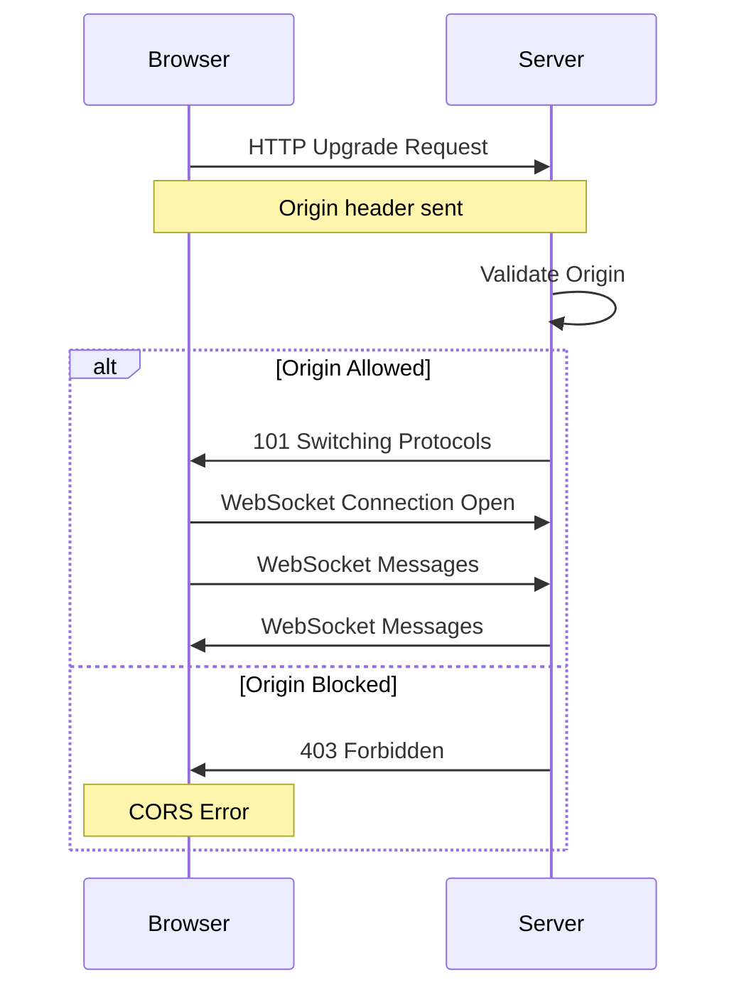
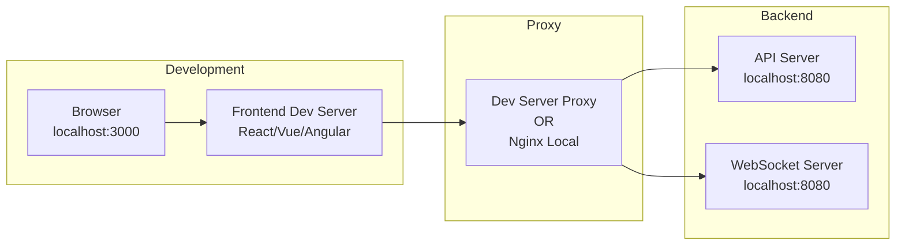
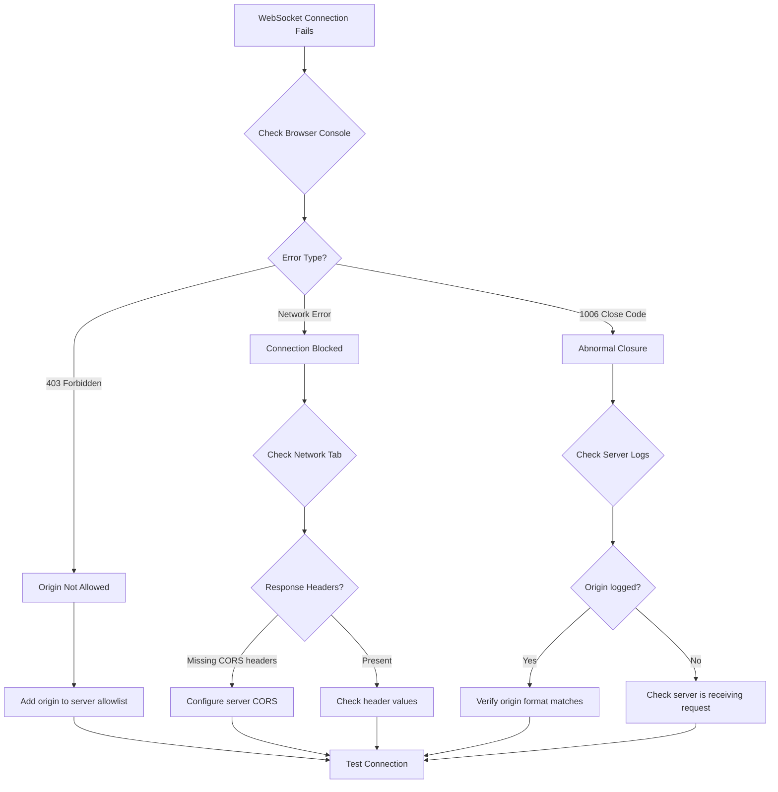

# How to Fix "CORS Policy" WebSocket Errors

Author: [nawazdhandala](https://www.github.com/nawazdhandala)

Tags: WebSocket, CORS, JavaScript, Node.js, Security, Debugging

Description: Learn how to diagnose and fix CORS policy errors in WebSocket connections including server configuration, proxy setups, and browser security requirements.

---

Cross-Origin Resource Sharing (CORS) errors are among the most common issues when working with WebSockets in web applications. These errors occur when a browser blocks WebSocket connections due to security policies. This guide covers the causes, solutions, and best practices for handling CORS with WebSockets.

## Understanding CORS and WebSockets

WebSockets have a unique relationship with CORS. While the initial HTTP handshake is subject to CORS rules, the WebSocket protocol itself operates differently from standard HTTP requests.



## Common CORS Error Messages

You might encounter these error messages in your browser console:

```javascript
// Common CORS errors with WebSockets
// Error 1: Origin blocked
// "WebSocket connection to 'wss://api.example.com/socket' failed:
//  Error during WebSocket handshake: Unexpected response code: 403"

// Error 2: Missing headers
// "Access to XMLHttpRequest at 'https://api.example.com' from origin
//  'https://myapp.com' has been blocked by CORS policy"

// Error 3: Socket.io specific
// "No 'Access-Control-Allow-Origin' header is present on the requested resource"
```

## Solution 1: Configure Server-Side CORS

### Node.js with ws Library

```javascript
// server.js - Basic WebSocket server with CORS handling
const WebSocket = require('ws');
const http = require('http');

// Define allowed origins
const allowedOrigins = [
    'https://myapp.com',
    'https://www.myapp.com',
    'http://localhost:3000'  // Development
];

// Create HTTP server to handle upgrade requests
const server = http.createServer((req, res) => {
    // Handle CORS preflight for polling fallback
    if (req.method === 'OPTIONS') {
        const origin = req.headers.origin;
        if (allowedOrigins.includes(origin)) {
            res.setHeader('Access-Control-Allow-Origin', origin);
            res.setHeader('Access-Control-Allow-Methods', 'GET, POST, OPTIONS');
            res.setHeader('Access-Control-Allow-Headers', 'Content-Type');
            res.setHeader('Access-Control-Allow-Credentials', 'true');
        }
        res.writeHead(204);
        res.end();
        return;
    }
    res.writeHead(404);
    res.end();
});

// Create WebSocket server with origin verification
const wss = new WebSocket.Server({
    server,
    verifyClient: (info, callback) => {
        const origin = info.origin || info.req.headers.origin;

        // Check if origin is allowed
        if (allowedOrigins.includes(origin)) {
            callback(true);
        } else {
            console.log(`Blocked connection from origin: ${origin}`);
            callback(false, 403, 'Origin not allowed');
        }
    }
});

wss.on('connection', (ws, req) => {
    console.log(`Client connected from: ${req.headers.origin}`);

    ws.on('message', (message) => {
        console.log(`Received: ${message}`);
        ws.send(`Echo: ${message}`);
    });
});

server.listen(8080, () => {
    console.log('WebSocket server running on port 8080');
});
```

### Express.js with Socket.io

```javascript
// server.js - Socket.io with CORS configuration
const express = require('express');
const http = require('http');
const { Server } = require('socket.io');

const app = express();
const server = http.createServer(app);

// Configure Socket.io with CORS
const io = new Server(server, {
    cors: {
        // Allow specific origins
        origin: [
            'https://myapp.com',
            'https://www.myapp.com',
            'http://localhost:3000'
        ],
        // Or use a function for dynamic validation
        // origin: (origin, callback) => {
        //     if (!origin || allowedOrigins.includes(origin)) {
        //         callback(null, true);
        //     } else {
        //         callback(new Error('Not allowed by CORS'));
        //     }
        // },
        methods: ['GET', 'POST'],
        allowedHeaders: ['Content-Type', 'Authorization'],
        credentials: true
    },
    // Allow all transports
    transports: ['websocket', 'polling']
});

io.on('connection', (socket) => {
    console.log('Client connected:', socket.id);

    socket.on('message', (data) => {
        socket.emit('response', { received: data });
    });

    socket.on('disconnect', () => {
        console.log('Client disconnected:', socket.id);
    });
});

server.listen(3001, () => {
    console.log('Server running on port 3001');
});
```

## Solution 2: Nginx Reverse Proxy Configuration

Using a reverse proxy can simplify CORS handling by serving everything from the same origin.

```nginx
# /etc/nginx/sites-available/myapp.conf

upstream websocket_backend {
    server 127.0.0.1:8080;
    # Enable sticky sessions for Socket.io
    ip_hash;
}

server {
    listen 443 ssl;
    server_name myapp.com;

    ssl_certificate /etc/ssl/certs/myapp.crt;
    ssl_certificate_key /etc/ssl/private/myapp.key;

    # Serve static files
    location / {
        root /var/www/myapp;
        index index.html;
    }

    # WebSocket proxy
    location /socket.io/ {
        proxy_pass http://websocket_backend;
        proxy_http_version 1.1;

        # Required headers for WebSocket upgrade
        proxy_set_header Upgrade $http_upgrade;
        proxy_set_header Connection "upgrade";

        # Preserve original headers
        proxy_set_header Host $host;
        proxy_set_header X-Real-IP $remote_addr;
        proxy_set_header X-Forwarded-For $proxy_add_x_forwarded_for;
        proxy_set_header X-Forwarded-Proto $scheme;

        # CORS headers for polling fallback
        add_header Access-Control-Allow-Origin $http_origin always;
        add_header Access-Control-Allow-Credentials true always;
        add_header Access-Control-Allow-Methods "GET, POST, OPTIONS" always;
        add_header Access-Control-Allow-Headers "Content-Type, Authorization" always;

        # Handle preflight requests
        if ($request_method = OPTIONS) {
            add_header Access-Control-Allow-Origin $http_origin;
            add_header Access-Control-Allow-Credentials true;
            add_header Access-Control-Allow-Methods "GET, POST, OPTIONS";
            add_header Access-Control-Allow-Headers "Content-Type, Authorization";
            add_header Content-Length 0;
            add_header Content-Type text/plain;
            return 204;
        }

        # Timeout settings
        proxy_connect_timeout 60s;
        proxy_send_timeout 60s;
        proxy_read_timeout 60s;
    }
}
```

## Solution 3: Client-Side Configuration

### Browser Client with Proper CORS Handling

```javascript
// client.js - WebSocket client with CORS considerations

class WebSocketClient {
    constructor(url, options = {}) {
        this.url = url;
        this.options = options;
        this.socket = null;
        this.reconnectAttempts = 0;
        this.maxReconnectAttempts = 5;
    }

    connect() {
        return new Promise((resolve, reject) => {
            try {
                // WebSocket constructor automatically sends Origin header
                this.socket = new WebSocket(this.url);

                this.socket.onopen = () => {
                    console.log('WebSocket connected');
                    this.reconnectAttempts = 0;
                    resolve(this.socket);
                };

                this.socket.onerror = (error) => {
                    console.error('WebSocket error:', error);
                    // CORS errors often appear as generic errors
                    // Check network tab for actual response code
                    reject(error);
                };

                this.socket.onclose = (event) => {
                    console.log('WebSocket closed:', event.code, event.reason);

                    // Handle specific close codes
                    if (event.code === 1006) {
                        // Abnormal closure - often CORS related
                        console.error('Connection failed - possibly CORS issue');
                        this.handleCorsError();
                    }
                };

            } catch (error) {
                reject(error);
            }
        });
    }

    handleCorsError() {
        // Log helpful debugging information
        console.log('CORS Debugging Information:');
        console.log('- Current origin:', window.location.origin);
        console.log('- WebSocket URL:', this.url);
        console.log('- Check server allows origin:', window.location.origin);
        console.log('- Check browser network tab for response headers');
    }
}

// Usage
const client = new WebSocketClient('wss://api.myapp.com/socket');
client.connect()
    .then(() => {
        console.log('Connected successfully');
    })
    .catch((error) => {
        console.error('Connection failed:', error);
    });
```

### Socket.io Client Configuration

```javascript
// client-socketio.js - Socket.io client with CORS settings

import { io } from 'socket.io-client';

// Configure Socket.io client
const socket = io('https://api.myapp.com', {
    // Enable credentials for CORS
    withCredentials: true,

    // Custom headers (not all will work due to browser restrictions)
    extraHeaders: {
        'Authorization': 'Bearer your-token'
    },

    // Transport options
    transports: ['websocket', 'polling'],

    // Timeout settings
    timeout: 20000,

    // Reconnection settings
    reconnection: true,
    reconnectionAttempts: 5,
    reconnectionDelay: 1000
});

socket.on('connect', () => {
    console.log('Connected to server');
});

socket.on('connect_error', (error) => {
    console.error('Connection error:', error.message);

    // Check for CORS-related errors
    if (error.message.includes('CORS') || error.message.includes('cors')) {
        console.error('CORS policy error detected');
        console.log('Ensure server has correct CORS configuration');
    }
});
```

## Solution 4: Development Environment Setup



### Vite Proxy Configuration

```javascript
// vite.config.js
import { defineConfig } from 'vite';

export default defineConfig({
    server: {
        port: 3000,
        proxy: {
            // Proxy WebSocket connections
            '/socket.io': {
                target: 'http://localhost:8080',
                ws: true,  // Enable WebSocket proxy
                changeOrigin: true
            },
            // Proxy API requests
            '/api': {
                target: 'http://localhost:8080',
                changeOrigin: true
            }
        }
    }
});
```

### Create React App Proxy

```javascript
// src/setupProxy.js
const { createProxyMiddleware } = require('http-proxy-middleware');

module.exports = function(app) {
    // Proxy WebSocket connections
    app.use(
        '/socket.io',
        createProxyMiddleware({
            target: 'http://localhost:8080',
            ws: true,
            changeOrigin: true
        })
    );
};
```

## Solution 5: Dynamic Origin Validation

```javascript
// server-dynamic-cors.js - Production-ready CORS validation
const WebSocket = require('ws');
const http = require('http');

// Configuration
const config = {
    // Allowed origin patterns
    allowedPatterns: [
        /^https:\/\/.*\.myapp\.com$/,  // Any subdomain
        /^https:\/\/myapp\.com$/,       // Main domain
    ],
    // Explicitly allowed origins
    allowedOrigins: new Set([
        'https://partner-site.com',
        'https://trusted-client.com'
    ]),
    // Development origins (disable in production)
    developmentOrigins: process.env.NODE_ENV === 'development'
        ? new Set(['http://localhost:3000', 'http://127.0.0.1:3000'])
        : new Set()
};

function isOriginAllowed(origin) {
    // No origin (same-origin request or non-browser client)
    if (!origin) {
        return true;
    }

    // Check explicit allowlist
    if (config.allowedOrigins.has(origin)) {
        return true;
    }

    // Check development origins
    if (config.developmentOrigins.has(origin)) {
        return true;
    }

    // Check patterns
    for (const pattern of config.allowedPatterns) {
        if (pattern.test(origin)) {
            return true;
        }
    }

    return false;
}

const server = http.createServer();
const wss = new WebSocket.Server({
    server,
    verifyClient: (info, callback) => {
        const origin = info.origin || info.req.headers.origin;

        if (isOriginAllowed(origin)) {
            callback(true);
        } else {
            console.warn(`Rejected connection from unauthorized origin: ${origin}`);
            callback(false, 403, 'Origin not allowed');
        }
    }
});

wss.on('connection', (ws, req) => {
    const origin = req.headers.origin;
    console.log(`Connection established from: ${origin}`);

    ws.on('message', (message) => {
        ws.send(`Received: ${message}`);
    });
});

server.listen(8080);
```

## Debugging CORS Issues



### Debug Logging Implementation

```javascript
// debug-cors.js - Comprehensive CORS debugging

// Server-side debugging
const WebSocket = require('ws');
const http = require('http');

const server = http.createServer((req, res) => {
    // Log all incoming requests
    console.log('--- Incoming Request ---');
    console.log('Method:', req.method);
    console.log('URL:', req.url);
    console.log('Origin:', req.headers.origin);
    console.log('Headers:', JSON.stringify(req.headers, null, 2));
    console.log('------------------------');

    res.writeHead(200);
    res.end();
});

const wss = new WebSocket.Server({
    server,
    verifyClient: (info, callback) => {
        const origin = info.origin;
        const secWebSocketKey = info.req.headers['sec-websocket-key'];

        console.log('--- WebSocket Verification ---');
        console.log('Origin:', origin);
        console.log('Sec-WebSocket-Key:', secWebSocketKey);
        console.log('Remote Address:', info.req.socket.remoteAddress);

        // Temporarily allow all origins for debugging
        // Remove this in production!
        if (process.env.DEBUG_CORS === 'true') {
            console.log('DEBUG MODE: Allowing all origins');
            callback(true);
            return;
        }

        // Normal validation
        const allowed = checkOrigin(origin);
        console.log('Origin allowed:', allowed);
        console.log('------------------------------');

        callback(allowed, allowed ? undefined : 403, allowed ? undefined : 'Forbidden');
    }
});

function checkOrigin(origin) {
    const allowedOrigins = ['https://myapp.com'];
    return allowedOrigins.includes(origin);
}

server.listen(8080);
```

## Common Mistakes and Solutions

| Mistake | Solution |
|---------|----------|
| Using `*` for credentials | Specify exact origins when using credentials |
| HTTP origin with HTTPS WebSocket | Use consistent protocols |
| Missing `wss://` in production | Always use secure WebSockets in production |
| Not handling preflight for polling | Configure OPTIONS handler for Socket.io |
| Wrong port in origin check | Include port in allowed origins list |

```javascript
// common-mistakes.js - Examples of mistakes and fixes

// Mistake 1: Wildcard with credentials
// Bad - browsers reject this combination
const badConfig = {
    cors: {
        origin: '*',
        credentials: true  // Cannot use with wildcard!
    }
};

// Good - specific origins with credentials
const goodConfig = {
    cors: {
        origin: ['https://myapp.com'],
        credentials: true
    }
};

// Mistake 2: Forgetting port in origin
// Bad - origin includes port, this will not match
const allowedOrigins = ['https://myapp.com'];
// Actual origin: 'https://myapp.com:3000'

// Good - include all possible origins with ports
const correctOrigins = [
    'https://myapp.com',
    'https://myapp.com:3000',
    'https://myapp.com:443'
];

// Mistake 3: Protocol mismatch
// Bad - mixing HTTP and WSS
// Frontend: http://myapp.com
// WebSocket: wss://api.myapp.com

// Good - consistent protocols
// Frontend: https://myapp.com
// WebSocket: wss://api.myapp.com
```

## Conclusion

CORS errors with WebSockets typically stem from misconfigured server-side origin validation or missing headers during the HTTP handshake phase. The key points to remember are: always validate origins on the server side, use a reverse proxy to simplify CORS in production, ensure consistent protocols between your frontend and WebSocket server, and enable detailed logging during development to quickly identify issues. With proper configuration and understanding of how browsers enforce CORS policies, you can build secure WebSocket applications that work seamlessly across different origins.
