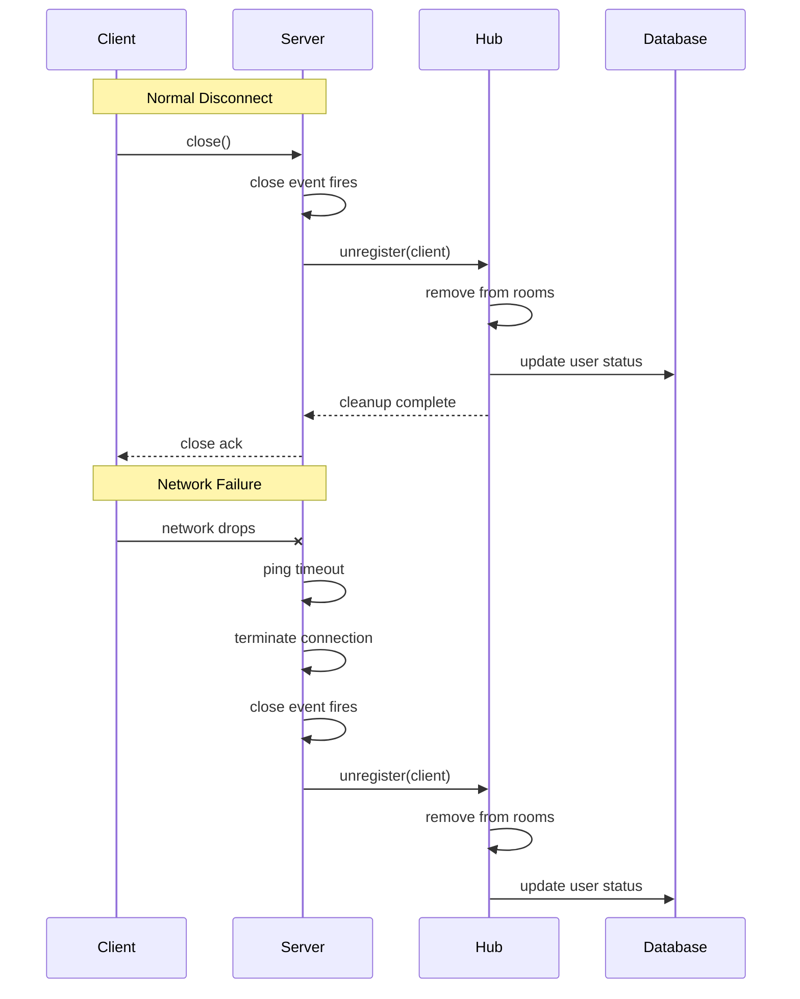

# How to Fix "Disconnect" Event Not Firing Issues

Author: [nawazdhandala](https://www.github.com/nawazdhandala)

Tags: WebSocket, Debugging, Node.js, Socket.IO, Real-time, Troubleshooting

Description: Diagnose and fix common issues where WebSocket disconnect events fail to trigger, including network failures, improper cleanup, and missing heartbeat configurations.

---

WebSocket disconnect events are critical for maintaining accurate connection state, cleaning up resources, and notifying other clients when a user leaves. When disconnect events fail to fire, you end up with ghost connections, memory leaks, and inconsistent application state. Users might appear online when they have already left, or resources allocated to their session remain locked indefinitely.

Several factors can prevent disconnect events from firing properly. Network failures might not close connections cleanly, heartbeat mechanisms might be misconfigured, server-side cleanup code might have bugs, or the client might crash without sending a proper close frame. Understanding these failure modes is essential for building reliable real-time applications.

In this guide, you will learn how to diagnose why disconnect events are not firing and implement robust solutions that ensure proper cleanup regardless of how connections end. We will cover heartbeat configuration, network failure detection, debugging techniques, and patterns for reliable disconnect handling.

## Understanding WebSocket Disconnection

WebSocket connections can end in several ways, and not all of them trigger disconnect events reliably.

```mermaid
flowchart TD
    subgraph CleanClose["Clean Close"]
        A[Client calls close] --> B[Close frame sent]
        B --> C[Server receives close]
        C --> D[Server sends close ack]
        D --> E[Disconnect event fires]
    end

    subgraph NetworkFailure["Network Failure"]
        F[Network drops] --> G[No close frame]
        G --> H{Heartbeat configured?}
        H -->|Yes| I[Timeout detected]
        H -->|No| J[Connection hangs]
        I --> K[Disconnect event fires]
        J --> L[No disconnect event]
    end

    subgraph ProcessCrash["Process Crash"]
        M[Client crashes] --> N[TCP connection orphaned]
        N --> O{TCP keepalive?}
        O -->|Yes| P[Eventually detected]
        O -->|No| Q[Connection hangs]
        P --> R[Disconnect event fires]
    end
```



## Common Causes of Missing Disconnect Events

Let us examine the most frequent reasons disconnect events fail to fire.

### Missing Heartbeat Configuration

Without heartbeats, the server has no way to detect when a client has silently disconnected. The TCP connection remains open on the server side even though the client is gone.

```javascript
// bad-config.js
// This configuration will miss disconnects during network failures

const WebSocket = require('ws');

const wss = new WebSocket.Server({ port: 8080 });

wss.on('connection', (ws) => {
    console.log('Client connected');

    // This disconnect event will NOT fire if the client loses network
    // because there is no heartbeat mechanism to detect dead connections
    ws.on('close', () => {
        console.log('Client disconnected');
    });
});
```

### Improper Error Handling

If error handlers throw exceptions or do not properly close connections, disconnect events might not fire.

```javascript
// error-handling-issue.js
// Errors in handlers can prevent proper cleanup

const WebSocket = require('ws');
const wss = new WebSocket.Server({ port: 8080 });

wss.on('connection', (ws) => {
    ws.on('message', (data) => {
        // If this throws, the connection might be left in an inconsistent state
        const parsed = JSON.parse(data); // Throws on invalid JSON
        processMessage(parsed);
    });

    // The close event might not fire if the error handler crashes
    ws.on('error', (err) => {
        // If this throws, cleanup does not happen
        logError(err); // What if logError is undefined?
    });

    ws.on('close', () => {
        cleanup(ws); // Might never be called
    });
});
```

### Socket.IO Specific Issues

Socket.IO has its own disconnect behavior that differs from raw WebSockets. Understanding these differences is crucial.

```javascript
// socketio-issues.js
// Common Socket.IO disconnect problems

const io = require('socket.io')(3000);

io.on('connection', (socket) => {
    console.log('Connected:', socket.id);

    // Issue 1: Using 'close' instead of 'disconnect'
    // This is WRONG for Socket.IO
    socket.on('close', () => {
        console.log('This will never fire');
    });

    // Issue 2: Disconnect without proper transport configuration
    // Default pingTimeout and pingInterval might be too long
    socket.on('disconnect', (reason) => {
        // Might take up to 5 minutes with default settings
        console.log('Disconnected:', reason);
    });
});

// Better configuration
const betterIo = require('socket.io')(3001, {
    pingTimeout: 10000,     // How long to wait for pong
    pingInterval: 5000,     // How often to send ping
    transports: ['websocket'], // Avoid polling fallback issues
});
```

## Implementing Proper Heartbeat Mechanism

A robust heartbeat mechanism is essential for detecting dead connections. Here is a complete implementation.

```javascript
// heartbeat-server.js
// WebSocket server with proper heartbeat mechanism

const WebSocket = require('ws');

// Configuration
const HEARTBEAT_INTERVAL = 30000;  // Send ping every 30 seconds
const HEARTBEAT_TIMEOUT = 35000;   // Terminate if no pong within 35 seconds

const wss = new WebSocket.Server({ port: 8080 });

// Track all connections with their state
const connections = new Map();

function heartbeat(ws) {
    const conn = connections.get(ws);
    if (conn) {
        conn.isAlive = true;
        conn.lastPong = Date.now();
    }
}

wss.on('connection', (ws, req) => {
    const clientId = req.headers['x-client-id'] || generateId();

    // Initialize connection tracking
    connections.set(ws, {
        id: clientId,
        isAlive: true,
        connectedAt: Date.now(),
        lastPong: Date.now(),
        ip: req.socket.remoteAddress
    });

    console.log(`Client connected: ${clientId}`);

    // Set up pong handler
    ws.on('pong', () => {
        heartbeat(ws);
    });

    ws.on('message', (data) => {
        // Any message also counts as activity
        heartbeat(ws);
        handleMessage(ws, data);
    });

    ws.on('close', (code, reason) => {
        const conn = connections.get(ws);
        console.log(`Client disconnected: ${conn?.id} (code: ${code}, reason: ${reason})`);
        connections.delete(ws);
        onDisconnect(conn);
    });

    ws.on('error', (err) => {
        console.error(`WebSocket error for ${connections.get(ws)?.id}:`, err);
        // Error handler should not throw
        // Connection will be cleaned up by close event
    });
});

// Heartbeat interval - check all connections
const heartbeatInterval = setInterval(() => {
    wss.clients.forEach((ws) => {
        const conn = connections.get(ws);

        if (!conn) {
            // Unknown connection, terminate it
            ws.terminate();
            return;
        }

        if (!conn.isAlive) {
            // No pong received since last ping
            console.log(`Terminating dead connection: ${conn.id}`);
            connections.delete(ws);
            ws.terminate();
            onDisconnect(conn);
            return;
        }

        // Reset alive flag and send ping
        conn.isAlive = false;

        try {
            ws.ping();
        } catch (err) {
            console.error(`Ping failed for ${conn.id}:`, err);
            connections.delete(ws);
            ws.terminate();
            onDisconnect(conn);
        }
    });
}, HEARTBEAT_INTERVAL);

// Cleanup on server shutdown
wss.on('close', () => {
    clearInterval(heartbeatInterval);
});

function onDisconnect(conn) {
    if (!conn) return;

    // Perform cleanup actions
    console.log(`Cleaning up resources for ${conn.id}`);
    // Remove from rooms, notify other users, etc.
}

function handleMessage(ws, data) {
    // Process incoming messages
}

function generateId() {
    return Math.random().toString(36).substring(2, 15);
}

console.log('WebSocket server with heartbeat running on port 8080');
```

## Debugging Disconnect Issues

When disconnect events are not firing, use these debugging techniques to identify the problem.

```javascript
// debug-server.js
// WebSocket server with comprehensive debugging

const WebSocket = require('ws');

// Enable detailed logging
const DEBUG = true;

function debug(...args) {
    if (DEBUG) {
        console.log(new Date().toISOString(), ...args);
    }
}

const wss = new WebSocket.Server({
    port: 8080,
    clientTracking: true // Enable client tracking
});

// Track connection states
const connectionStates = new Map();

wss.on('connection', (ws, req) => {
    const id = generateId();

    const state = {
        id,
        ip: req.socket.remoteAddress,
        connectedAt: Date.now(),
        readyState: ws.readyState,
        events: [],
        messageCount: 0,
        lastActivity: Date.now()
    };

    connectionStates.set(ws, state);

    debug(`[${id}] Connection opened from ${state.ip}`);
    debug(`[${id}] Initial readyState: ${ws.readyState}`);

    // Log all events
    ws.on('open', () => {
        state.events.push({ type: 'open', time: Date.now() });
        debug(`[${id}] Open event`);
    });

    ws.on('message', (data) => {
        state.messageCount++;
        state.lastActivity = Date.now();
        state.events.push({ type: 'message', time: Date.now() });
        debug(`[${id}] Message received (total: ${state.messageCount})`);
    });

    ws.on('ping', (data) => {
        state.events.push({ type: 'ping', time: Date.now() });
        debug(`[${id}] Ping received`);
    });

    ws.on('pong', (data) => {
        state.events.push({ type: 'pong', time: Date.now() });
        debug(`[${id}] Pong received`);
    });

    ws.on('error', (err) => {
        state.events.push({ type: 'error', time: Date.now(), error: err.message });
        debug(`[${id}] Error:`, err.message);
    });

    ws.on('close', (code, reason) => {
        state.events.push({ type: 'close', time: Date.now(), code, reason: reason.toString() });
        debug(`[${id}] Close event - code: ${code}, reason: ${reason}`);
        debug(`[${id}] Connection duration: ${Date.now() - state.connectedAt}ms`);
        debug(`[${id}] Total messages: ${state.messageCount}`);
        debug(`[${id}] Event history:`, state.events);

        connectionStates.delete(ws);
    });

    // Monitor readyState changes
    const stateCheckInterval = setInterval(() => {
        if (ws.readyState !== state.readyState) {
            debug(`[${id}] ReadyState changed: ${state.readyState} -> ${ws.readyState}`);
            state.readyState = ws.readyState;
        }

        // Check for stuck connections
        if (ws.readyState === WebSocket.OPEN) {
            const inactive = Date.now() - state.lastActivity;
            if (inactive > 60000) {
                debug(`[${id}] Warning: No activity for ${inactive}ms`);
            }
        }
    }, 5000);

    ws.on('close', () => {
        clearInterval(stateCheckInterval);
    });
});

// Periodic status report
setInterval(() => {
    debug('=== Connection Status Report ===');
    debug(`Active connections: ${connectionStates.size}`);

    for (const [ws, state] of connectionStates) {
        debug(`  [${state.id}] readyState: ${ws.readyState}, messages: ${state.messageCount}`);
    }
}, 30000);

function generateId() {
    return Math.random().toString(36).substring(2, 10);
}
```

## Socket.IO Disconnect Handling

Socket.IO has specific patterns for handling disconnects reliably.

```javascript
// socketio-disconnect-fix.js
// Proper Socket.IO disconnect handling

const { Server } = require('socket.io');

const io = new Server(3000, {
    // Critical settings for disconnect detection
    pingTimeout: 10000,        // Time to wait for pong before considering disconnected
    pingInterval: 5000,        // How often to ping clients
    connectTimeout: 10000,     // Timeout for initial connection

    // Use WebSocket only to avoid polling issues
    transports: ['websocket'],

    // Allow upgrades if you need polling fallback
    allowUpgrades: true,
    upgradeTimeout: 10000
});

// Connection state tracking
const userSessions = new Map();

io.on('connection', (socket) => {
    const userId = socket.handshake.auth.userId || socket.id;

    console.log(`User connected: ${userId}`);

    // Track session
    userSessions.set(userId, {
        socketId: socket.id,
        connectedAt: Date.now(),
        lastActivity: Date.now()
    });

    // Handle disconnection with reason
    socket.on('disconnect', (reason) => {
        console.log(`User disconnected: ${userId}, reason: ${reason}`);

        // Analyze disconnect reason
        switch (reason) {
            case 'io server disconnect':
                // Server forcefully disconnected the socket
                console.log('Server initiated disconnect');
                break;

            case 'io client disconnect':
                // Client called socket.disconnect()
                console.log('Clean client disconnect');
                break;

            case 'ping timeout':
                // Client did not respond to ping within pingTimeout
                console.log('Client stopped responding');
                break;

            case 'transport close':
                // Connection was closed (network issue, tab close, etc)
                console.log('Transport closed');
                break;

            case 'transport error':
                // Connection encountered an error
                console.log('Transport error');
                break;

            default:
                console.log('Unknown disconnect reason:', reason);
        }

        // Clean up session
        userSessions.delete(userId);

        // Notify other users
        socket.broadcast.emit('user:offline', { userId });
    });

    // Handle disconnecting (before actual disconnect)
    socket.on('disconnecting', (reason) => {
        console.log(`User disconnecting: ${userId}, rooms: ${[...socket.rooms]}`);

        // Perform cleanup while still in rooms
        for (const room of socket.rooms) {
            if (room !== socket.id) {
                socket.to(room).emit('user:leaving', { userId, room });
            }
        }
    });

    // Track activity
    socket.onAny((event, ...args) => {
        const session = userSessions.get(userId);
        if (session) {
            session.lastActivity = Date.now();
        }
    });
});

// Middleware to handle connection errors
io.use((socket, next) => {
    // Validate connection
    const token = socket.handshake.auth.token;
    if (!token) {
        return next(new Error('Authentication required'));
    }

    // Additional validation
    try {
        // Validate token, check user, etc.
        next();
    } catch (err) {
        next(err);
    }
});

// Handle middleware errors
io.on('connect_error', (err) => {
    console.error('Connection error:', err.message);
});
```

## Handling Network Failures

Network failures require special handling because no close frame is sent. Implement multiple detection mechanisms.

```javascript
// network-failure-handling.js
// Robust network failure detection

const WebSocket = require('ws');

class RobustWebSocketServer {
    constructor(port) {
        this.wss = new WebSocket.Server({ port });
        this.connections = new Map();

        // Multiple detection mechanisms
        this.PING_INTERVAL = 15000;     // Ping every 15 seconds
        this.PONG_TIMEOUT = 20000;      // Expect pong within 20 seconds
        this.ACTIVITY_TIMEOUT = 60000;  // No activity for 60 seconds

        this.setupServer();
        this.startHealthCheck();
    }

    setupServer() {
        this.wss.on('connection', (ws, req) => {
            const conn = this.createConnection(ws, req);

            ws.on('pong', () => this.handlePong(conn));
            ws.on('message', (data) => this.handleMessage(conn, data));
            ws.on('close', (code, reason) => this.handleClose(conn, code, reason));
            ws.on('error', (err) => this.handleError(conn, err));

            // Start pinging this connection
            this.startPinging(conn);
        });
    }

    createConnection(ws, req) {
        const conn = {
            id: this.generateId(),
            ws,
            ip: req.socket.remoteAddress,
            isAlive: true,
            lastPong: Date.now(),
            lastActivity: Date.now(),
            pingInterval: null,
            pongTimeout: null
        };

        this.connections.set(conn.id, conn);
        console.log(`Connection created: ${conn.id}`);

        return conn;
    }

    startPinging(conn) {
        conn.pingInterval = setInterval(() => {
            if (conn.ws.readyState !== WebSocket.OPEN) {
                this.terminateConnection(conn, 'readyState not OPEN');
                return;
            }

            // Send ping
            try {
                conn.ws.ping();
            } catch (err) {
                this.terminateConnection(conn, 'ping failed');
                return;
            }

            // Set timeout for pong response
            conn.pongTimeout = setTimeout(() => {
                this.terminateConnection(conn, 'pong timeout');
            }, this.PONG_TIMEOUT);

        }, this.PING_INTERVAL);
    }

    handlePong(conn) {
        conn.isAlive = true;
        conn.lastPong = Date.now();
        conn.lastActivity = Date.now();

        // Clear pong timeout
        if (conn.pongTimeout) {
            clearTimeout(conn.pongTimeout);
            conn.pongTimeout = null;
        }
    }

    handleMessage(conn, data) {
        conn.lastActivity = Date.now();
        // Process message
    }

    handleClose(conn, code, reason) {
        console.log(`Connection closed: ${conn.id}, code: ${code}`);
        this.cleanupConnection(conn);
        this.onDisconnect(conn, 'close event');
    }

    handleError(conn, err) {
        console.error(`Connection error: ${conn.id}:`, err.message);
        // Error handler should not throw
        // Let close event handle cleanup
    }

    terminateConnection(conn, reason) {
        console.log(`Terminating connection: ${conn.id}, reason: ${reason}`);

        try {
            conn.ws.terminate();
        } catch (err) {
            // Ignore errors during termination
        }

        this.cleanupConnection(conn);
        this.onDisconnect(conn, reason);
    }

    cleanupConnection(conn) {
        // Clear intervals and timeouts
        if (conn.pingInterval) {
            clearInterval(conn.pingInterval);
            conn.pingInterval = null;
        }

        if (conn.pongTimeout) {
            clearTimeout(conn.pongTimeout);
            conn.pongTimeout = null;
        }

        // Remove from tracking
        this.connections.delete(conn.id);
    }

    // Secondary health check for stuck connections
    startHealthCheck() {
        setInterval(() => {
            const now = Date.now();

            for (const [id, conn] of this.connections) {
                // Check for stuck connections
                const inactiveTime = now - conn.lastActivity;

                if (inactiveTime > this.ACTIVITY_TIMEOUT) {
                    console.log(`Stale connection detected: ${id}, inactive: ${inactiveTime}ms`);
                    this.terminateConnection(conn, 'activity timeout');
                    continue;
                }

                // Verify WebSocket state
                if (conn.ws.readyState !== WebSocket.OPEN) {
                    console.log(`Invalid readyState for ${id}: ${conn.ws.readyState}`);
                    this.terminateConnection(conn, 'invalid readyState');
                }
            }
        }, 30000);
    }

    onDisconnect(conn, reason) {
        // Override this method for custom disconnect handling
        console.log(`Disconnect callback: ${conn.id}, reason: ${reason}`);
    }

    generateId() {
        return Math.random().toString(36).substring(2, 15);
    }
}

// Usage
const server = new RobustWebSocketServer(8080);

server.onDisconnect = (conn, reason) => {
    console.log(`Custom disconnect handler: ${conn.id}`);
    // Notify other users, clean up rooms, etc.
};
```

## Client-Side Disconnect Detection

The client should also monitor connection health and handle disconnects gracefully.

```javascript
// client-disconnect-handling.js
// Client-side disconnect detection and recovery

class RobustWebSocketClient {
    constructor(url, options = {}) {
        this.url = url;
        this.ws = null;

        // Configuration
        this.reconnectDelay = options.reconnectDelay || 1000;
        this.maxReconnectDelay = options.maxReconnectDelay || 30000;
        this.reconnectAttempts = 0;
        this.maxReconnectAttempts = options.maxReconnectAttempts || Infinity;

        // Heartbeat settings
        this.pingInterval = options.pingInterval || 25000;
        this.pongTimeout = options.pongTimeout || 10000;

        // State
        this.isConnected = false;
        this.isReconnecting = false;
        this.pingIntervalId = null;
        this.pongTimeoutId = null;

        // Callbacks
        this.onConnect = options.onConnect || (() => {});
        this.onDisconnect = options.onDisconnect || (() => {});
        this.onMessage = options.onMessage || (() => {});
        this.onReconnecting = options.onReconnecting || (() => {});
    }

    connect() {
        if (this.ws && this.ws.readyState === WebSocket.OPEN) {
            return;
        }

        try {
            this.ws = new WebSocket(this.url);
        } catch (err) {
            console.error('Failed to create WebSocket:', err);
            this.scheduleReconnect();
            return;
        }

        this.ws.onopen = () => {
            console.log('WebSocket connected');
            this.isConnected = true;
            this.isReconnecting = false;
            this.reconnectAttempts = 0;

            this.startHeartbeat();
            this.onConnect();
        };

        this.ws.onmessage = (event) => {
            // Any message resets pong timeout
            this.resetPongTimeout();

            // Handle pong messages if using application-level ping/pong
            try {
                const data = JSON.parse(event.data);
                if (data.type === 'pong') {
                    return;
                }
                this.onMessage(data);
            } catch {
                this.onMessage(event.data);
            }
        };

        this.ws.onclose = (event) => {
            console.log('WebSocket closed:', event.code, event.reason);
            this.handleDisconnect('close', event.code);
        };

        this.ws.onerror = (error) => {
            console.error('WebSocket error:', error);
            // Error is usually followed by close event
        };
    }

    startHeartbeat() {
        this.stopHeartbeat();

        this.pingIntervalId = setInterval(() => {
            if (this.ws && this.ws.readyState === WebSocket.OPEN) {
                this.sendPing();
            }
        }, this.pingInterval);
    }

    stopHeartbeat() {
        if (this.pingIntervalId) {
            clearInterval(this.pingIntervalId);
            this.pingIntervalId = null;
        }

        if (this.pongTimeoutId) {
            clearTimeout(this.pongTimeoutId);
            this.pongTimeoutId = null;
        }
    }

    sendPing() {
        try {
            this.ws.send(JSON.stringify({ type: 'ping', timestamp: Date.now() }));
        } catch (err) {
            console.error('Failed to send ping:', err);
            this.handleDisconnect('ping failed');
            return;
        }

        // Set timeout for pong
        this.pongTimeoutId = setTimeout(() => {
            console.warn('Pong timeout - connection appears dead');
            this.handleDisconnect('pong timeout');
        }, this.pongTimeout);
    }

    resetPongTimeout() {
        if (this.pongTimeoutId) {
            clearTimeout(this.pongTimeoutId);
            this.pongTimeoutId = null;
        }
    }

    handleDisconnect(reason, code) {
        if (!this.isConnected && !this.isReconnecting) {
            return;
        }

        const wasConnected = this.isConnected;
        this.isConnected = false;
        this.stopHeartbeat();

        if (wasConnected) {
            this.onDisconnect(reason, code);
        }

        // Check if we should reconnect
        if (this.shouldReconnect(code)) {
            this.scheduleReconnect();
        }
    }

    shouldReconnect(code) {
        // Do not reconnect on intentional close
        if (code === 1000 || code === 1001) {
            return false;
        }

        // Check max attempts
        if (this.reconnectAttempts >= this.maxReconnectAttempts) {
            console.log('Max reconnect attempts reached');
            return false;
        }

        return true;
    }

    scheduleReconnect() {
        if (this.isReconnecting) {
            return;
        }

        this.isReconnecting = true;
        this.reconnectAttempts++;

        // Exponential backoff
        const delay = Math.min(
            this.reconnectDelay * Math.pow(2, this.reconnectAttempts - 1),
            this.maxReconnectDelay
        );

        console.log(`Reconnecting in ${delay}ms (attempt ${this.reconnectAttempts})`);
        this.onReconnecting(this.reconnectAttempts, delay);

        setTimeout(() => {
            this.connect();
        }, delay);
    }

    send(data) {
        if (!this.ws || this.ws.readyState !== WebSocket.OPEN) {
            console.warn('Cannot send - WebSocket not connected');
            return false;
        }

        try {
            const message = typeof data === 'string' ? data : JSON.stringify(data);
            this.ws.send(message);
            return true;
        } catch (err) {
            console.error('Failed to send:', err);
            return false;
        }
    }

    disconnect() {
        this.maxReconnectAttempts = 0; // Prevent reconnection
        this.stopHeartbeat();

        if (this.ws) {
            this.ws.close(1000, 'Client disconnect');
            this.ws = null;
        }

        this.isConnected = false;
    }
}

// Usage
const client = new RobustWebSocketClient('ws://localhost:8080', {
    pingInterval: 25000,
    pongTimeout: 10000,
    reconnectDelay: 1000,
    maxReconnectAttempts: 10,

    onConnect: () => {
        console.log('Connected to server');
    },

    onDisconnect: (reason, code) => {
        console.log(`Disconnected: ${reason} (code: ${code})`);
    },

    onMessage: (data) => {
        console.log('Received:', data);
    },

    onReconnecting: (attempt, delay) => {
        console.log(`Reconnecting attempt ${attempt} in ${delay}ms`);
    }
});

client.connect();
```

## Disconnect Event Flow

Here is the complete flow of how disconnect events should propagate through your system.



## Testing Disconnect Handling

Create tests to verify disconnect events fire correctly under various conditions.

```javascript
// disconnect-tests.js
// Tests for disconnect handling

const WebSocket = require('ws');
const assert = require('assert');

async function testCleanDisconnect(serverUrl) {
    return new Promise((resolve, reject) => {
        const ws = new WebSocket(serverUrl);
        let disconnectReceived = false;

        ws.on('open', () => {
            console.log('Test: Clean disconnect - connected');

            // Wait a bit then disconnect cleanly
            setTimeout(() => {
                ws.close(1000, 'test complete');
            }, 100);
        });

        ws.on('close', (code, reason) => {
            disconnectReceived = true;
            console.log('Test: Clean disconnect - close event received');
            assert.strictEqual(code, 1000);
            resolve();
        });

        setTimeout(() => {
            if (!disconnectReceived) {
                reject(new Error('Disconnect event not received'));
            }
        }, 5000);
    });
}

async function testAbruptDisconnect(serverUrl) {
    return new Promise((resolve, reject) => {
        const ws = new WebSocket(serverUrl);

        ws.on('open', () => {
            console.log('Test: Abrupt disconnect - connected');

            // Terminate without close frame
            setTimeout(() => {
                ws.terminate();
            }, 100);
        });

        ws.on('close', () => {
            console.log('Test: Abrupt disconnect - close event received');
            resolve();
        });

        setTimeout(() => {
            reject(new Error('Timeout waiting for close event'));
        }, 5000);
    });
}

async function testNetworkFailure(serverUrl) {
    // This test simulates network failure by not responding to pings
    // Requires server-side heartbeat with short timeout for quick testing

    return new Promise((resolve, reject) => {
        const ws = new WebSocket(serverUrl);

        ws.on('open', () => {
            console.log('Test: Network failure - connected');

            // Override ping handler to not respond
            ws.on('ping', () => {
                console.log('Test: Ignoring server ping');
                // Do not send pong
            });
        });

        ws.on('close', () => {
            console.log('Test: Network failure - connection terminated by server');
            resolve();
        });

        // Timeout based on expected server ping timeout
        setTimeout(() => {
            reject(new Error('Server did not terminate connection'));
        }, 60000);
    });
}

async function runTests() {
    const serverUrl = 'ws://localhost:8080';

    console.log('Running disconnect tests...\n');

    try {
        await testCleanDisconnect(serverUrl);
        console.log('Clean disconnect test: PASSED\n');
    } catch (err) {
        console.error('Clean disconnect test: FAILED -', err.message, '\n');
    }

    try {
        await testAbruptDisconnect(serverUrl);
        console.log('Abrupt disconnect test: PASSED\n');
    } catch (err) {
        console.error('Abrupt disconnect test: FAILED -', err.message, '\n');
    }

    try {
        await testNetworkFailure(serverUrl);
        console.log('Network failure test: PASSED\n');
    } catch (err) {
        console.error('Network failure test: FAILED -', err.message, '\n');
    }

    console.log('Tests complete');
}

runTests().catch(console.error);
```

## Best Practices Checklist

Use this checklist to ensure your disconnect handling is robust.

1. Always configure heartbeat with appropriate ping interval and pong timeout
2. Handle both close and error events on WebSocket connections
3. Ensure error handlers never throw exceptions
4. Use terminate() for unresponsive connections instead of close()
5. Track connection state independently of WebSocket readyState
6. Implement secondary health checks for stuck connections
7. Clean up resources (intervals, timeouts) when connections close
8. Log disconnect reasons for debugging
9. Test disconnect handling under various failure conditions
10. Monitor and alert on abnormal disconnect patterns

## Conclusion

Missing disconnect events are a common source of bugs in WebSocket applications. The key to reliable disconnect handling is implementing multiple detection mechanisms: heartbeat with ping/pong for detecting dead connections, activity timeouts for stuck connections, and proper cleanup in all event handlers.

Always test your disconnect handling under realistic failure conditions, including network outages, client crashes, and server restarts. With proper implementation, you can ensure that your application maintains accurate connection state and cleans up resources promptly regardless of how connections end.
