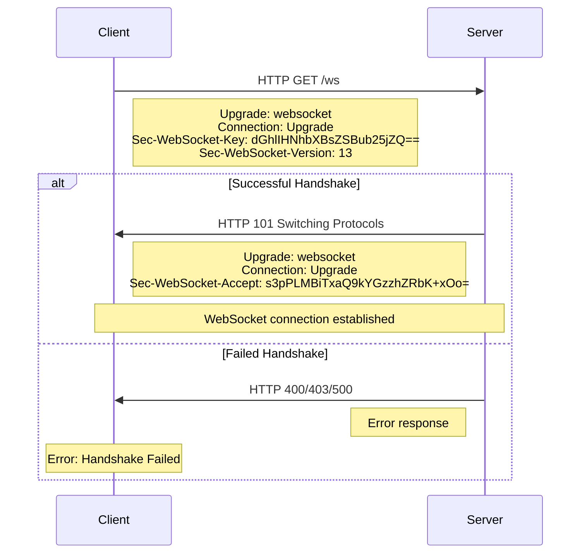
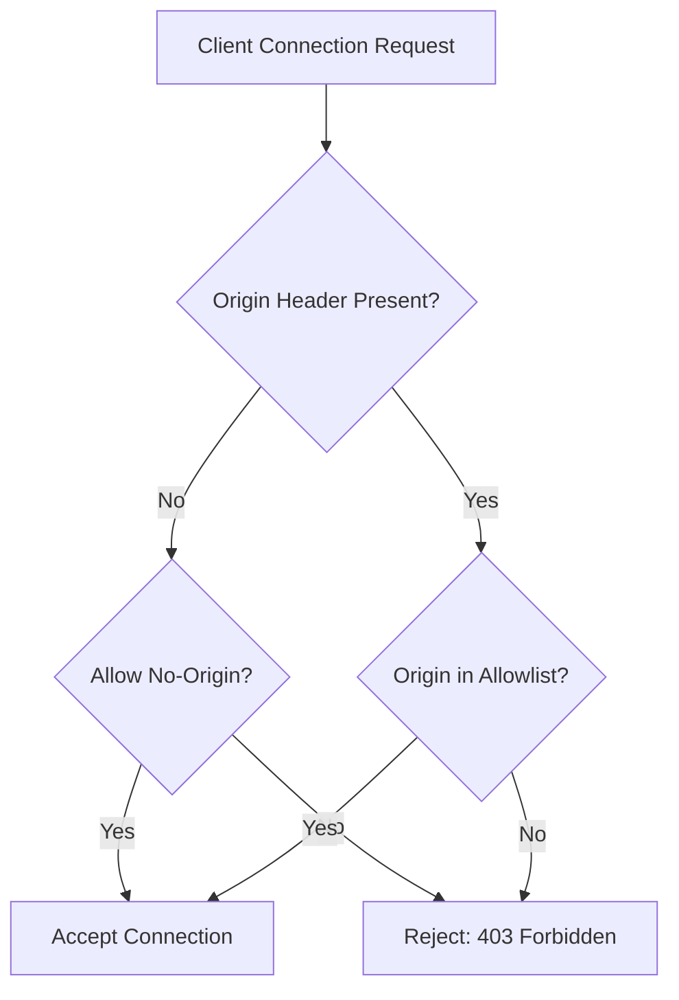

# How to Fix 'Handshake Failed' WebSocket Errors

Author: [nawazdhandala](https://www.github.com/nawazdhandala)

Tags: WebSocket, Debugging, HTTP, Networking, Troubleshooting

Description: Learn how to diagnose and fix WebSocket handshake failures caused by missing headers, protocol mismatches, proxy issues, and authentication problems.

---

The WebSocket handshake is an HTTP upgrade request that transitions a connection from HTTP to the WebSocket protocol. When this handshake fails, the connection cannot be established. This guide covers the common causes of handshake failures and how to fix them.

## Understanding the WebSocket Handshake

The WebSocket handshake uses HTTP to negotiate the protocol upgrade. The client sends an upgrade request, and the server must respond with specific headers to accept the upgrade.



## Common Causes and Solutions

### 1. Missing or Incorrect Response Headers

The server must return specific headers for the handshake to succeed.

```javascript
// server.js
// Incorrect - missing required headers

const http = require('http');

const server = http.createServer((req, res) => {
  if (req.headers.upgrade === 'websocket') {
    // Wrong: Just sending 101 without proper headers
    res.writeHead(101);
    res.end();
  }
});
```

```javascript
// server.js
// Correct - proper WebSocket handshake response

const http = require('http');
const crypto = require('crypto');

const WEBSOCKET_MAGIC_STRING = '258EAFA5-E914-47DA-95CA-C5AB0DC85B11';

const server = http.createServer((req, res) => {
  // Handle regular HTTP requests
  res.writeHead(200);
  res.end('HTTP Server');
});

server.on('upgrade', (req, socket, head) => {
  // Verify this is a WebSocket upgrade request
  if (req.headers.upgrade?.toLowerCase() !== 'websocket') {
    socket.destroy();
    return;
  }

  // Get the client's key
  const clientKey = req.headers['sec-websocket-key'];
  if (!clientKey) {
    socket.write('HTTP/1.1 400 Bad Request\r\n\r\n');
    socket.destroy();
    return;
  }

  // Generate accept key (SHA-1 hash of client key + magic string, base64 encoded)
  const acceptKey = crypto
    .createHash('sha1')
    .update(clientKey + WEBSOCKET_MAGIC_STRING)
    .digest('base64');

  // Send handshake response with all required headers
  const responseHeaders = [
    'HTTP/1.1 101 Switching Protocols',
    'Upgrade: websocket',
    'Connection: Upgrade',
    `Sec-WebSocket-Accept: ${acceptKey}`,
    '', // Empty line to end headers
    '',
  ].join('\r\n');

  socket.write(responseHeaders);

  // Connection is now a WebSocket - handle frames
  handleWebSocket(socket);
});

server.listen(8080);
```

### 2. Protocol Version Mismatch

The client and server must agree on the WebSocket protocol version.

```javascript
// server.js
// Check and validate WebSocket version

server.on('upgrade', (req, socket, head) => {
  const version = req.headers['sec-websocket-version'];

  // Only version 13 is standard (RFC 6455)
  if (version !== '13') {
    // Tell client which versions we support
    socket.write(
      'HTTP/1.1 426 Upgrade Required\r\n' +
      'Sec-WebSocket-Version: 13\r\n' +
      '\r\n'
    );
    socket.destroy();
    return;
  }

  // Continue with handshake...
});
```

### 3. Subprotocol Negotiation Failure

When the client requests specific subprotocols, the server must acknowledge at least one.

```javascript
// client.js
// Client requesting specific subprotocols

const socket = new WebSocket('wss://api.example.com/ws', ['graphql-ws', 'json']);

socket.onopen = () => {
  console.log('Connected with protocol:', socket.protocol);
};

socket.onerror = () => {
  console.error('Connection failed - possible subprotocol mismatch');
};
```

```javascript
// server.js
// Server handling subprotocol negotiation

const WebSocket = require('ws');

const wss = new WebSocket.Server({
  port: 8080,
  handleProtocols: (protocols, request) => {
    // protocols is a Set of requested protocols
    console.log('Client requested protocols:', [...protocols]);

    // Define supported protocols in order of preference
    const supportedProtocols = ['graphql-ws', 'json'];

    // Return the first matching protocol
    for (const protocol of supportedProtocols) {
      if (protocols.has(protocol)) {
        return protocol; // This will be sent in Sec-WebSocket-Protocol header
      }
    }

    // Return false to reject all protocols (connection will fail)
    // Or return a supported protocol even if not requested
    return false;
  },
});

wss.on('connection', (ws, request) => {
  console.log('Client connected with protocol:', ws.protocol);
});
```

### 4. Origin Validation Failure

Servers often validate the Origin header to prevent cross-origin attacks.

```javascript
// server.js
// Origin validation in WebSocket server

const WebSocket = require('ws');

const ALLOWED_ORIGINS = [
  'https://app.example.com',
  'https://www.example.com',
];

// Development origins
if (process.env.NODE_ENV === 'development') {
  ALLOWED_ORIGINS.push('http://localhost:3000');
  ALLOWED_ORIGINS.push('http://127.0.0.1:3000');
}

const wss = new WebSocket.Server({
  port: 8080,
  verifyClient: (info, callback) => {
    const origin = info.origin || info.req.headers.origin;

    console.log('Connection attempt from origin:', origin);

    if (!origin) {
      // Allow connections without origin (e.g., from server-side code)
      callback(true);
      return;
    }

    if (ALLOWED_ORIGINS.includes(origin)) {
      callback(true);
    } else {
      console.warn('Rejected connection from unauthorized origin:', origin);
      // Second parameter is HTTP status code, third is reason
      callback(false, 403, 'Origin not allowed');
    }
  },
});
```



### 5. Authentication Failure During Handshake

When authentication is required before the WebSocket connection.

```javascript
// server.js
// Authentication during WebSocket handshake

const WebSocket = require('ws');
const jwt = require('jsonwebtoken');
const url = require('url');

const wss = new WebSocket.Server({
  port: 8080,
  verifyClient: async (info, callback) => {
    try {
      // Method 1: Token in query string
      const parsedUrl = url.parse(info.req.url, true);
      const token = parsedUrl.query.token;

      // Method 2: Token in Authorization header
      // const token = info.req.headers.authorization?.split(' ')[1];

      // Method 3: Token in cookie
      // const cookies = parseCookies(info.req.headers.cookie);
      // const token = cookies.accessToken;

      if (!token) {
        callback(false, 401, 'Authentication required');
        return;
      }

      // Verify token
      const decoded = jwt.verify(token, process.env.JWT_SECRET);

      // Attach user to request for later use
      info.req.user = decoded;

      callback(true);
    } catch (error) {
      if (error.name === 'TokenExpiredError') {
        callback(false, 401, 'Token expired');
      } else if (error.name === 'JsonWebTokenError') {
        callback(false, 401, 'Invalid token');
      } else {
        callback(false, 500, 'Authentication error');
      }
    }
  },
});

wss.on('connection', (ws, req) => {
  // Access authenticated user
  console.log('User connected:', req.user.id);
  ws.userId = req.user.id;
});
```

```javascript
// client.js
// Sending authentication token with WebSocket connection

async function connectWebSocket() {
  const token = await getAccessToken();

  // Method 1: Token in query string (simple but visible in logs)
  const ws = new WebSocket(`wss://api.example.com/ws?token=${token}`);

  // Note: Browsers do not allow custom headers on WebSocket connections
  // So you cannot use Authorization header directly

  ws.onopen = () => {
    console.log('Authenticated connection established');
  };

  ws.onerror = () => {
    console.error('Connection failed - check authentication');
  };

  return ws;
}
```

### 6. Proxy Not Forwarding Upgrade Headers

Reverse proxies must be configured to forward WebSocket upgrade headers.

```nginx
# nginx.conf
# Incorrect - missing upgrade headers

location /ws {
    proxy_pass http://backend;
    # WebSocket will fail without upgrade headers
}
```

```nginx
# nginx.conf
# Correct - forwarding upgrade headers for WebSocket

upstream websocket_backend {
    server app:8080;
}

server {
    listen 80;
    server_name api.example.com;

    location /ws {
        proxy_pass http://websocket_backend;

        # Required: Forward upgrade headers
        proxy_http_version 1.1;
        proxy_set_header Upgrade $http_upgrade;
        proxy_set_header Connection "upgrade";

        # Forward client information
        proxy_set_header Host $host;
        proxy_set_header X-Real-IP $remote_addr;
        proxy_set_header X-Forwarded-For $proxy_add_x_forwarded_for;
        proxy_set_header X-Forwarded-Proto $scheme;

        # Timeouts for WebSocket
        proxy_read_timeout 86400;
        proxy_send_timeout 86400;
    }
}
```

### 7. TLS Certificate Issues

When connecting to wss:// endpoints, certificate problems can cause handshake failures.

```javascript
// Debug TLS issues in Node.js
const WebSocket = require('ws');
const https = require('https');

// Create agent with specific TLS options
const agent = new https.Agent({
  rejectUnauthorized: true, // Set false only for testing
  // For self-signed certificates in development:
  // ca: fs.readFileSync('/path/to/ca-cert.pem'),
});

const ws = new WebSocket('wss://api.example.com/ws', {
  agent: agent,
  headers: {
    'User-Agent': 'MyApp/1.0',
  },
});

ws.on('error', (error) => {
  console.error('WebSocket error:', error.message);

  // Common TLS error codes
  if (error.code === 'UNABLE_TO_VERIFY_LEAF_SIGNATURE') {
    console.error('Solution: Add CA certificate or set rejectUnauthorized: false');
  } else if (error.code === 'CERT_HAS_EXPIRED') {
    console.error('Solution: Renew the server certificate');
  } else if (error.code === 'DEPTH_ZERO_SELF_SIGNED_CERT') {
    console.error('Solution: Add self-signed certificate to trusted CAs');
  }
});

ws.on('open', () => {
  console.log('Connected successfully');
});
```

### 8. HTTP/2 Incompatibility

WebSocket requires HTTP/1.1. HTTP/2 connections cannot be upgraded to WebSocket in the traditional way.

```nginx
# nginx.conf
# Handle HTTP/2 for regular requests but HTTP/1.1 for WebSocket

server {
    listen 443 ssl;
    listen [::]:443 ssl;
    http2 on;

    server_name api.example.com;

    ssl_certificate /etc/ssl/certs/api.example.com.crt;
    ssl_certificate_key /etc/ssl/private/api.example.com.key;

    # Regular HTTP/2 traffic
    location / {
        proxy_pass http://backend;
    }

    # WebSocket - forces HTTP/1.1
    location /ws {
        proxy_pass http://websocket_backend;

        # This forces HTTP/1.1 for the upstream connection
        proxy_http_version 1.1;
        proxy_set_header Upgrade $http_upgrade;
        proxy_set_header Connection "upgrade";
    }
}
```

## Debugging Handshake Failures

### Using Browser DevTools

1. Open DevTools (F12)
2. Go to Network tab
3. Filter by "WS"
4. Look at the failed request's Headers and Response tabs

### Using curl to Test Handshake

```bash
# Test WebSocket handshake manually
curl -v \
  -H "Upgrade: websocket" \
  -H "Connection: Upgrade" \
  -H "Sec-WebSocket-Key: dGVzdGluZzEyMw==" \
  -H "Sec-WebSocket-Version: 13" \
  -H "Origin: https://app.example.com" \
  https://api.example.com/ws

# Expected successful response:
# HTTP/1.1 101 Switching Protocols
# Upgrade: websocket
# Connection: Upgrade
# Sec-WebSocket-Accept: ...
```

### Server-Side Logging

```javascript
// server.js
// Detailed logging for handshake debugging

const WebSocket = require('ws');
const http = require('http');

const server = http.createServer();

// Log all upgrade requests
server.on('upgrade', (request, socket, head) => {
  console.log('=== WebSocket Upgrade Request ===');
  console.log('URL:', request.url);
  console.log('Headers:');
  Object.entries(request.headers).forEach(([key, value]) => {
    console.log(`  ${key}: ${value}`);
  });
  console.log('================================');
});

const wss = new WebSocket.Server({
  server,
  verifyClient: (info, callback) => {
    console.log('verifyClient called');
    console.log('  Origin:', info.origin);
    console.log('  Secure:', info.secure);
    console.log('  URL:', info.req.url);

    // Your validation logic here
    const isValid = true;

    if (isValid) {
      console.log('  Result: ACCEPTED');
      callback(true);
    } else {
      console.log('  Result: REJECTED');
      callback(false, 403, 'Validation failed');
    }
  },
});

wss.on('connection', (ws, request) => {
  console.log('Connection established');
});

wss.on('error', (error) => {
  console.error('WebSocket server error:', error);
});

server.listen(8080);
```

## Error Handling on Client

```javascript
// client.js
// Comprehensive handshake error handling

function connectWithRetry(url, maxAttempts = 3) {
  let attempts = 0;

  function attempt() {
    attempts++;
    console.log(`Connection attempt ${attempts}/${maxAttempts}`);

    const ws = new WebSocket(url);

    // Set connection timeout
    const connectionTimeout = setTimeout(() => {
      if (ws.readyState === WebSocket.CONNECTING) {
        console.error('Connection timeout');
        ws.close();
      }
    }, 10000);

    ws.onopen = () => {
      clearTimeout(connectionTimeout);
      console.log('Connected successfully');
    };

    ws.onerror = (event) => {
      clearTimeout(connectionTimeout);
      console.error('WebSocket error during handshake');

      // Note: Browser WebSocket error events do not contain details
      // The close event that follows has more information
    };

    ws.onclose = (event) => {
      clearTimeout(connectionTimeout);

      if (event.code === 1006 && !ws.wasOpen) {
        // Connection never established
        console.error('Handshake failed - connection could not be established');

        if (attempts < maxAttempts) {
          const delay = Math.pow(2, attempts) * 1000;
          console.log(`Retrying in ${delay}ms...`);
          setTimeout(attempt, delay);
        } else {
          console.error('Max attempts reached');
        }
      }
    };

    let wasOpen = false;
    const origOnOpen = ws.onopen;
    ws.onopen = (event) => {
      wasOpen = true;
      ws.wasOpen = true;
      if (origOnOpen) origOnOpen.call(ws, event);
    };

    return ws;
  }

  return attempt();
}
```

## Summary

| Issue | Cause | Solution |
|-------|-------|----------|
| Missing headers | Server not sending required response headers | Include Upgrade, Connection, Sec-WebSocket-Accept |
| Version mismatch | Client/server using different WebSocket versions | Use version 13 (RFC 6455) |
| Subprotocol mismatch | Server not acknowledging client's requested protocols | Server must return one of the requested protocols |
| Origin rejected | Origin not in server's allowlist | Add origin to allowed list or disable check |
| Auth failure | Invalid or missing authentication token | Verify token handling in handshake |
| Proxy misconfiguration | Proxy not forwarding upgrade headers | Configure proxy_http_version 1.1 and upgrade headers |
| TLS issues | Certificate validation failures | Fix certificates or configure CA trust |
| HTTP/2 | WebSocket incompatible with HTTP/2 upgrade | Force HTTP/1.1 for WebSocket endpoints |

Understanding the handshake process is essential for debugging connection issues. Always check both client and server logs, and use network inspection tools to see the actual HTTP request and response during the handshake.
