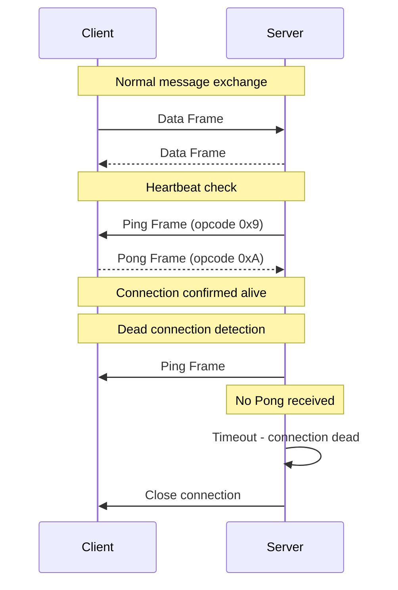
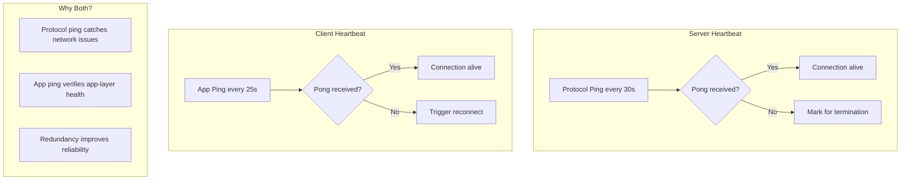

# How to Configure WebSocket Heartbeat/Ping-Pong

Author: [nawazdhandala](https://www.github.com/nawazdhandala)

Tags: WebSocket, Heartbeat, Ping-Pong, Connection Management, JavaScript, Node.js, Keep-Alive

Description: A practical guide to implementing WebSocket heartbeat mechanisms using ping-pong frames to detect dead connections and maintain reliable real-time communication.

---

WebSocket connections can silently die due to network issues, firewalls, or load balancers dropping idle connections. Implementing a heartbeat mechanism using ping-pong frames ensures you can detect dead connections and maintain reliable real-time communication. This guide covers both protocol-level and application-level heartbeat implementations.

## Understanding WebSocket Ping-Pong

The WebSocket protocol includes built-in control frames for connection health checking:



## Server-Side Heartbeat Implementation

Most WebSocket servers should initiate heartbeats since they need to manage many connections efficiently.

```javascript
// Server-side: Node.js with ws library - Basic heartbeat
const WebSocket = require('ws');

const wss = new WebSocket.Server({ port: 8080 });

// Heartbeat interval in milliseconds
const HEARTBEAT_INTERVAL = 30000; // 30 seconds
const CLIENT_TIMEOUT = 35000; // 35 seconds (slightly more than interval)

function heartbeat() {
    // Mark connection as alive when pong received
    this.isAlive = true;
}

wss.on('connection', function(ws) {
    // Initialize connection state
    ws.isAlive = true;

    // Listen for pong responses
    ws.on('pong', heartbeat);

    ws.on('close', function() {
        console.log('Client disconnected');
    });

    ws.on('error', function(error) {
        console.error('WebSocket error:', error);
    });
});

// Heartbeat interval - ping all connections
const heartbeatInterval = setInterval(function() {
    wss.clients.forEach(function(ws) {
        if (ws.isAlive === false) {
            // Connection did not respond to last ping
            console.log('Terminating dead connection');
            return ws.terminate();
        }

        // Mark as potentially dead until pong received
        ws.isAlive = false;

        // Send ping frame
        ws.ping();
    });
}, HEARTBEAT_INTERVAL);

// Clean up interval on server close
wss.on('close', function() {
    clearInterval(heartbeatInterval);
});
```

## Advanced Server Heartbeat with Metrics

Track connection health metrics for monitoring and debugging:

```javascript
// Server-side: Advanced heartbeat with metrics
const WebSocket = require('ws');

class HeartbeatManager {
    constructor(wss, options = {}) {
        this.wss = wss;
        this.interval = options.interval || 30000;
        this.timeout = options.timeout || 35000;
        this.maxMissedPings = options.maxMissedPings || 2;

        // Metrics
        this.metrics = {
            totalPingsSent: 0,
            totalPongsReceived: 0,
            deadConnectionsDetected: 0,
            averageLatency: 0,
            latencySum: 0,
            latencyCount: 0
        };

        this.setupHeartbeat();
    }

    setupHeartbeat() {
        this.wss.on('connection', (ws, request) => {
            // Initialize connection metadata
            ws.heartbeat = {
                isAlive: true,
                missedPings: 0,
                lastPingTime: null,
                lastPongTime: null,
                latency: null,
                connectedAt: Date.now()
            };

            // Handle pong response
            ws.on('pong', (data) => {
                this.handlePong(ws, data);
            });

            ws.on('close', () => {
                this.logConnectionStats(ws);
            });
        });

        // Start heartbeat interval
        this.heartbeatTimer = setInterval(() => {
            this.sendHeartbeats();
        }, this.interval);
    }

    sendHeartbeats() {
        const timestamp = Date.now();

        this.wss.clients.forEach((ws) => {
            if (ws.readyState !== WebSocket.OPEN) {
                return;
            }

            if (!ws.heartbeat.isAlive) {
                ws.heartbeat.missedPings++;

                if (ws.heartbeat.missedPings >= this.maxMissedPings) {
                    console.log(`Connection dead after ${ws.heartbeat.missedPings} missed pings`);
                    this.metrics.deadConnectionsDetected++;
                    ws.terminate();
                    return;
                }
            }

            // Reset alive flag
            ws.heartbeat.isAlive = false;
            ws.heartbeat.lastPingTime = timestamp;

            // Send ping with timestamp for latency calculation
            ws.ping(Buffer.from(timestamp.toString()));
            this.metrics.totalPingsSent++;
        });
    }

    handlePong(ws, data) {
        ws.heartbeat.isAlive = true;
        ws.heartbeat.missedPings = 0;
        ws.heartbeat.lastPongTime = Date.now();

        // Calculate latency if timestamp was included
        if (data && data.length > 0) {
            const pingTime = parseInt(data.toString(), 10);
            if (!isNaN(pingTime)) {
                ws.heartbeat.latency = Date.now() - pingTime;
                this.updateLatencyMetrics(ws.heartbeat.latency);
            }
        }

        this.metrics.totalPongsReceived++;
    }

    updateLatencyMetrics(latency) {
        this.metrics.latencySum += latency;
        this.metrics.latencyCount++;
        this.metrics.averageLatency = Math.round(
            this.metrics.latencySum / this.metrics.latencyCount
        );
    }

    logConnectionStats(ws) {
        const stats = {
            duration: Date.now() - ws.heartbeat.connectedAt,
            lastLatency: ws.heartbeat.latency,
            missedPings: ws.heartbeat.missedPings
        };
        console.log('Connection closed:', stats);
    }

    getMetrics() {
        return {
            ...this.metrics,
            activeConnections: this.wss.clients.size,
            pongRate: this.metrics.totalPingsSent > 0
                ? (this.metrics.totalPongsReceived / this.metrics.totalPingsSent * 100).toFixed(2) + '%'
                : 'N/A'
        };
    }

    stop() {
        if (this.heartbeatTimer) {
            clearInterval(this.heartbeatTimer);
        }
    }
}

// Usage
const wss = new WebSocket.Server({ port: 8080 });

const heartbeatManager = new HeartbeatManager(wss, {
    interval: 30000,      // Send ping every 30 seconds
    timeout: 35000,       // Wait 35 seconds for pong
    maxMissedPings: 2     // Terminate after 2 missed pings
});

// Expose metrics endpoint
setInterval(function() {
    console.log('Heartbeat Metrics:', heartbeatManager.getMetrics());
}, 60000);
```

## Client-Side Heartbeat Implementation

Browsers automatically respond to server ping frames with pong frames. However, you may need application-level heartbeat for environments that do not support WebSocket ping-pong or for additional reliability.

```javascript
// Client-side: Application-level heartbeat
class HeartbeatWebSocket {
    constructor(url, options = {}) {
        this.url = url;
        this.pingInterval = options.pingInterval || 30000;
        this.pongTimeout = options.pongTimeout || 5000;
        this.reconnectDelay = options.reconnectDelay || 3000;
        this.maxReconnectAttempts = options.maxReconnectAttempts || 5;

        this.reconnectAttempts = 0;
        this.pingTimer = null;
        this.pongTimer = null;
        this.isConnected = false;

        this.onMessage = options.onMessage || function() {};
        this.onConnect = options.onConnect || function() {};
        this.onDisconnect = options.onDisconnect || function() {};

        this.connect();
    }

    connect() {
        console.log('Connecting to WebSocket...');
        this.socket = new WebSocket(this.url);

        this.socket.onopen = () => {
            console.log('WebSocket connected');
            this.isConnected = true;
            this.reconnectAttempts = 0;
            this.startHeartbeat();
            this.onConnect();
        };

        this.socket.onmessage = (event) => {
            const message = JSON.parse(event.data);

            if (message.type === 'PONG') {
                // Application-level pong received
                this.handlePong(message);
            } else {
                this.onMessage(message);
            }
        };

        this.socket.onclose = (event) => {
            console.log('WebSocket closed:', event.code, event.reason);
            this.isConnected = false;
            this.stopHeartbeat();
            this.onDisconnect(event);
            this.attemptReconnect();
        };

        this.socket.onerror = (error) => {
            console.error('WebSocket error:', error);
        };
    }

    startHeartbeat() {
        this.pingTimer = setInterval(() => {
            this.sendPing();
        }, this.pingInterval);
    }

    stopHeartbeat() {
        if (this.pingTimer) {
            clearInterval(this.pingTimer);
            this.pingTimer = null;
        }
        if (this.pongTimer) {
            clearTimeout(this.pongTimer);
            this.pongTimer = null;
        }
    }

    sendPing() {
        if (this.socket.readyState !== WebSocket.OPEN) {
            return;
        }

        const pingMessage = {
            type: 'PING',
            timestamp: Date.now()
        };

        this.socket.send(JSON.stringify(pingMessage));

        // Set timeout for pong response
        this.pongTimer = setTimeout(() => {
            console.log('Pong timeout - connection may be dead');
            this.socket.close(4000, 'Pong timeout');
        }, this.pongTimeout);
    }

    handlePong(message) {
        // Clear pong timeout
        if (this.pongTimer) {
            clearTimeout(this.pongTimer);
            this.pongTimer = null;
        }

        // Calculate latency
        if (message.timestamp) {
            const latency = Date.now() - message.timestamp;
            console.log(`Heartbeat latency: ${latency}ms`);
        }
    }

    attemptReconnect() {
        if (this.reconnectAttempts >= this.maxReconnectAttempts) {
            console.log('Max reconnect attempts reached');
            return;
        }

        this.reconnectAttempts++;
        const delay = this.reconnectDelay * Math.pow(2, this.reconnectAttempts - 1);

        console.log(`Reconnecting in ${delay}ms (attempt ${this.reconnectAttempts})`);

        setTimeout(() => {
            this.connect();
        }, delay);
    }

    send(data) {
        if (this.socket.readyState === WebSocket.OPEN) {
            this.socket.send(JSON.stringify(data));
        } else {
            console.warn('Cannot send - socket not open');
        }
    }

    close() {
        this.stopHeartbeat();
        this.maxReconnectAttempts = 0; // Prevent reconnect
        this.socket.close(1000, 'Client closing');
    }
}

// Usage
const ws = new HeartbeatWebSocket('wss://api.example.com/ws', {
    pingInterval: 30000,
    pongTimeout: 5000,
    onMessage: function(message) {
        console.log('Received:', message);
    },
    onConnect: function() {
        console.log('Connected and ready');
    },
    onDisconnect: function(event) {
        console.log('Disconnected');
    }
});
```

## Server Handling Application-Level Pings

When using application-level heartbeats, the server must respond to ping messages:

```javascript
// Server-side: Handle both protocol and application-level pings
const WebSocket = require('ws');

const wss = new WebSocket.Server({ port: 8080 });

wss.on('connection', function(ws) {
    ws.isAlive = true;

    // Protocol-level pong handler
    ws.on('pong', function() {
        ws.isAlive = true;
    });

    // Application-level message handler
    ws.on('message', function(data) {
        let message;
        try {
            message = JSON.parse(data);
        } catch (error) {
            console.error('Invalid JSON:', error);
            return;
        }

        // Handle application-level ping
        if (message.type === 'PING') {
            ws.send(JSON.stringify({
                type: 'PONG',
                timestamp: message.timestamp // Echo back for latency calculation
            }));
            return;
        }

        // Handle other messages
        handleMessage(ws, message);
    });
});

function handleMessage(ws, message) {
    console.log('Received message:', message);
}
```

## Hybrid Heartbeat Strategy

For maximum reliability, use both protocol-level and application-level heartbeats:



```javascript
// Server-side: Hybrid heartbeat implementation
const WebSocket = require('ws');

const wss = new WebSocket.Server({ port: 8080 });

const PROTOCOL_PING_INTERVAL = 30000;
const APP_PING_TIMEOUT = 60000; // Expect app ping within this time

wss.on('connection', function(ws) {
    ws.isAlive = true;
    ws.lastAppPing = Date.now();

    // Protocol-level pong
    ws.on('pong', function() {
        ws.isAlive = true;
    });

    ws.on('message', function(data) {
        const message = JSON.parse(data);

        if (message.type === 'PING') {
            ws.lastAppPing = Date.now();
            ws.send(JSON.stringify({
                type: 'PONG',
                timestamp: message.timestamp,
                serverTime: Date.now()
            }));
            return;
        }

        // Handle other messages...
    });
});

// Protocol-level heartbeat
setInterval(function() {
    const now = Date.now();

    wss.clients.forEach(function(ws) {
        // Check protocol-level health
        if (ws.isAlive === false) {
            console.log('Protocol heartbeat failed');
            return ws.terminate();
        }

        // Check application-level health (if expected)
        if (now - ws.lastAppPing > APP_PING_TIMEOUT) {
            console.log('Application heartbeat timeout');
            return ws.terminate();
        }

        ws.isAlive = false;
        ws.ping();
    });
}, PROTOCOL_PING_INTERVAL);
```

## Configuring Heartbeat for Different Environments

Different deployment scenarios require different heartbeat configurations:

```javascript
// Configuration for different environments
const environments = {
    development: {
        pingInterval: 60000,      // Less aggressive in dev
        pongTimeout: 10000,
        maxMissedPings: 3
    },

    production: {
        pingInterval: 30000,      // Standard for most cases
        pongTimeout: 5000,
        maxMissedPings: 2
    },

    mobile: {
        pingInterval: 45000,      // Account for spotty connections
        pongTimeout: 15000,       // Longer timeout for high latency
        maxMissedPings: 3
    },

    highFrequency: {
        pingInterval: 10000,      // Financial/gaming applications
        pongTimeout: 3000,
        maxMissedPings: 1
    },

    behindLoadBalancer: {
        pingInterval: 25000,      // Less than typical LB timeout (30-60s)
        pongTimeout: 5000,
        maxMissedPings: 2
    }
};

function getHeartbeatConfig(environment) {
    return environments[environment] || environments.production;
}
```

## Handling Connection Recovery

When heartbeat detects a dead connection, implement graceful recovery:

```javascript
// Client-side: Connection recovery with state preservation
class ResilientWebSocket {
    constructor(url, options = {}) {
        this.url = url;
        this.options = options;

        // State to preserve across reconnections
        this.subscriptions = new Set();
        this.pendingMessages = [];
        this.messageId = 0;

        this.connect();
    }

    connect() {
        this.socket = new WebSocket(this.url);
        this.setupHeartbeat();

        this.socket.onopen = () => {
            console.log('Connected');
            this.resubscribe();
            this.flushPendingMessages();
        };

        this.socket.onclose = (event) => {
            this.stopHeartbeat();

            if (event.code !== 1000) {
                // Abnormal close - attempt reconnect
                this.scheduleReconnect();
            }
        };

        this.socket.onmessage = (event) => {
            this.handleMessage(JSON.parse(event.data));
        };
    }

    setupHeartbeat() {
        this.pingTimer = setInterval(() => {
            if (this.socket.readyState === WebSocket.OPEN) {
                this.socket.send(JSON.stringify({ type: 'PING' }));

                this.pongTimer = setTimeout(() => {
                    console.log('Heartbeat failed');
                    this.socket.close(4000, 'Heartbeat timeout');
                }, 5000);
            }
        }, 30000);
    }

    stopHeartbeat() {
        clearInterval(this.pingTimer);
        clearTimeout(this.pongTimer);
    }

    handleMessage(message) {
        if (message.type === 'PONG') {
            clearTimeout(this.pongTimer);
            return;
        }

        if (message.type === 'ACK') {
            // Remove from pending messages
            this.pendingMessages = this.pendingMessages.filter(
                m => m.id !== message.id
            );
            return;
        }

        // Handle other messages
        if (this.options.onMessage) {
            this.options.onMessage(message);
        }
    }

    subscribe(channel) {
        this.subscriptions.add(channel);

        if (this.socket.readyState === WebSocket.OPEN) {
            this.socket.send(JSON.stringify({
                type: 'SUBSCRIBE',
                channel: channel
            }));
        }
    }

    resubscribe() {
        // Restore subscriptions after reconnect
        this.subscriptions.forEach(channel => {
            this.socket.send(JSON.stringify({
                type: 'SUBSCRIBE',
                channel: channel
            }));
        });
        console.log(`Resubscribed to ${this.subscriptions.size} channels`);
    }

    send(data) {
        const message = {
            id: ++this.messageId,
            ...data
        };

        if (this.socket.readyState === WebSocket.OPEN) {
            this.socket.send(JSON.stringify(message));
        }

        // Keep in pending until acknowledged
        this.pendingMessages.push(message);
    }

    flushPendingMessages() {
        // Resend unacknowledged messages
        this.pendingMessages.forEach(message => {
            this.socket.send(JSON.stringify(message));
        });
        console.log(`Resent ${this.pendingMessages.length} pending messages`);
    }

    scheduleReconnect() {
        setTimeout(() => {
            console.log('Attempting reconnect...');
            this.connect();
        }, 3000);
    }
}
```

## Monitoring Heartbeat Health

Set up monitoring to track heartbeat effectiveness:

```javascript
// Server-side: Heartbeat monitoring and alerting
class HeartbeatMonitor {
    constructor(heartbeatManager) {
        this.manager = heartbeatManager;
        this.history = [];
        this.alerts = [];

        this.startMonitoring();
    }

    startMonitoring() {
        // Collect metrics every minute
        setInterval(() => {
            this.collectMetrics();
        }, 60000);

        // Check for anomalies every 5 minutes
        setInterval(() => {
            this.checkAnomalies();
        }, 300000);
    }

    collectMetrics() {
        const metrics = this.manager.getMetrics();

        this.history.push({
            timestamp: Date.now(),
            ...metrics
        });

        // Keep last 24 hours
        const dayAgo = Date.now() - 86400000;
        this.history = this.history.filter(m => m.timestamp > dayAgo);
    }

    checkAnomalies() {
        const recentMetrics = this.history.slice(-5);

        if (recentMetrics.length < 5) return;

        // Check for high dead connection rate
        const avgDeadConnections = recentMetrics.reduce(
            (sum, m) => sum + m.deadConnectionsDetected, 0
        ) / recentMetrics.length;

        if (avgDeadConnections > 10) {
            this.alert('HIGH_DEAD_CONNECTIONS', {
                average: avgDeadConnections,
                message: 'Unusually high number of dead connections detected'
            });
        }

        // Check for high latency
        const avgLatency = recentMetrics.reduce(
            (sum, m) => sum + m.averageLatency, 0
        ) / recentMetrics.length;

        if (avgLatency > 1000) {
            this.alert('HIGH_LATENCY', {
                average: avgLatency,
                message: 'WebSocket heartbeat latency is high'
            });
        }

        // Check pong rate
        const latestMetrics = recentMetrics[recentMetrics.length - 1];
        const pongRate = parseFloat(latestMetrics.pongRate);

        if (pongRate < 95) {
            this.alert('LOW_PONG_RATE', {
                rate: pongRate,
                message: 'Pong response rate is below threshold'
            });
        }
    }

    alert(type, data) {
        const alert = {
            timestamp: Date.now(),
            type: type,
            data: data
        };

        this.alerts.push(alert);
        console.error('HEARTBEAT ALERT:', alert);

        // Send to monitoring system
        // sendToMonitoringService(alert);
    }

    getHealthReport() {
        return {
            status: this.alerts.length === 0 ? 'healthy' : 'degraded',
            currentMetrics: this.manager.getMetrics(),
            recentAlerts: this.alerts.slice(-10),
            history: this.history.slice(-60)
        };
    }
}
```

## Summary

Implementing WebSocket heartbeat/ping-pong is essential for maintaining reliable real-time connections. Key takeaways:

1. Use protocol-level ping-pong when possible (automatic pong response in browsers)
2. Implement application-level heartbeat for additional reliability or when protocol ping is not available
3. Configure heartbeat intervals based on your environment (mobile, behind load balancer, high-frequency)
4. Track latency metrics to detect connection quality issues
5. Implement graceful reconnection with state preservation
6. Monitor heartbeat health to catch systemic issues early

A well-implemented heartbeat mechanism is the foundation of a robust WebSocket application.
