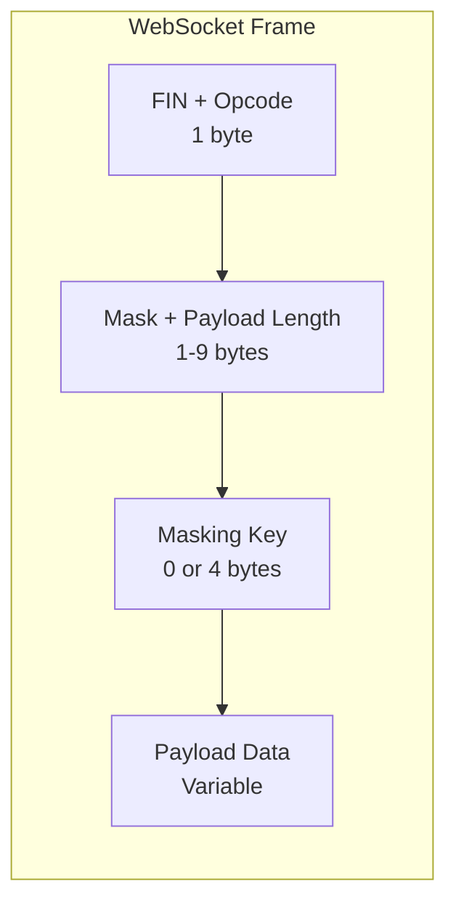
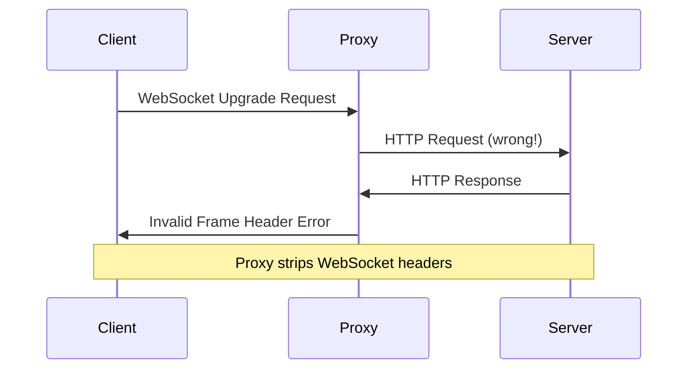
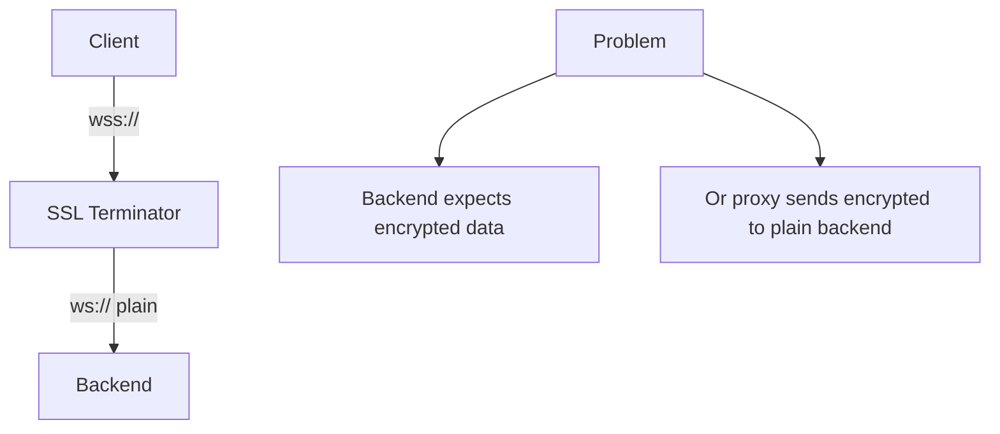

# How to Fix 'Invalid Frame Header' WebSocket Errors

Author: [nawazdhandala](https://www.github.com/nawazdhandala)

Tags: WebSocket, Debugging, Node.js, Python, Frame Protocol, Error Handling, Real-time

Description: A practical guide to diagnosing and fixing 'Invalid Frame Header' WebSocket errors caused by protocol violations, proxy misconfiguration, and data corruption.

---

> The "Invalid Frame Header" error occurs when a WebSocket implementation receives a frame that does not conform to the WebSocket protocol specification (RFC 6455). This typically indicates protocol-level issues rather than application logic problems, making them particularly challenging to debug.

Understanding WebSocket frame structure is essential for diagnosing these errors. Every WebSocket message is wrapped in a frame with specific header bytes that define the message type, length, and masking.

---

## WebSocket Frame Structure



The frame header consists of:
- **FIN bit**: Indicates if this is the final fragment
- **Opcode**: Message type (text, binary, close, ping, pong)
- **Mask bit**: Must be set for client-to-server messages
- **Payload length**: 7 bits, 7+16 bits, or 7+64 bits

---

## Common Causes and Solutions

### 1. Proxy Not Configured for WebSocket

The most common cause is a proxy or load balancer treating WebSocket traffic as HTTP.



**Nginx Configuration Fix:**

```nginx
# WRONG: Missing WebSocket configuration
# This causes the proxy to treat WebSocket as regular HTTP
location /ws {
    proxy_pass http://backend;
}

# CORRECT: Proper WebSocket proxy configuration
location /ws {
    proxy_pass http://backend;

    # Required: Upgrade connection to WebSocket
    proxy_http_version 1.1;
    proxy_set_header Upgrade $http_upgrade;
    proxy_set_header Connection "upgrade";

    # Preserve original headers
    proxy_set_header Host $host;
    proxy_set_header X-Real-IP $remote_addr;
    proxy_set_header X-Forwarded-For $proxy_add_x_forwarded_for;
    proxy_set_header X-Forwarded-Proto $scheme;

    # Timeouts for long-lived connections
    proxy_read_timeout 86400s;
    proxy_send_timeout 86400s;
}
```

**Apache Configuration Fix:**

```apache
# Enable required modules
# a2enmod proxy proxy_http proxy_wstunnel

<VirtualHost *:80>
    ServerName example.com

    # WebSocket proxy configuration
    RewriteEngine On
    RewriteCond %{HTTP:Upgrade} websocket [NC]
    RewriteCond %{HTTP:Connection} upgrade [NC]
    RewriteRule ^/ws(.*)$ ws://localhost:8080/ws$1 [P,L]

    # Regular HTTP proxy
    ProxyPass /api http://localhost:8080/api
    ProxyPassReverse /api http://localhost:8080/api
</VirtualHost>
```

---

### 2. Mixed HTTP and WebSocket on Same Connection

Sending HTTP data over an established WebSocket connection corrupts the frame structure.

```javascript
// BAD: Mixing protocols causes invalid frame headers
const WebSocket = require('ws');

const wss = new WebSocket.Server({ port: 8080 });

wss.on('connection', (ws, req) => {
    // This is WRONG - trying to send HTTP over WebSocket
    // The HTTP response format is not valid WebSocket frames
    ws._socket.write('HTTP/1.1 200 OK\r\nContent-Type: text/plain\r\n\r\nHello');
});

// GOOD: Use proper WebSocket message sending
const WebSocket = require('ws');

const wss = new WebSocket.Server({ port: 8080 });

wss.on('connection', (ws, req) => {
    // Send data using WebSocket protocol
    // The ws library handles frame encoding automatically
    ws.send('Hello');

    // For JSON data
    ws.send(JSON.stringify({ type: 'greeting', message: 'Hello' }));
});
```

---

### 3. Client Masking Issues

Per RFC 6455, client-to-server messages must be masked, but server-to-client messages must not be.

```javascript
// Debug masking issues in Node.js
const WebSocket = require('ws');

const wss = new WebSocket.Server({
    port: 8080,
    // Enable frame verification for debugging
    verifyClient: (info, callback) => {
        console.log('Connection attempt from:', info.origin);
        callback(true);
    }
});

wss.on('connection', (ws) => {
    // Log raw frame events for debugging
    ws._receiver.on('conclude', (code, reason) => {
        console.log('Frame conclude:', code, reason);
    });

    ws.on('message', (data, isBinary) => {
        console.log('Received:', isBinary ? 'binary' : 'text', data.length, 'bytes');
    });

    ws.on('error', (error) => {
        // Check for masking-related errors
        if (error.message.includes('MASK')) {
            console.error('Masking error - client may not be masking frames');
        }
        console.error('WebSocket error:', error);
    });
});
```

**Python Server with Frame Debugging:**

```python
import asyncio
import websockets
import logging

# Enable protocol-level logging
logging.basicConfig(level=logging.DEBUG)
logger = logging.getLogger('websockets')
logger.setLevel(logging.DEBUG)

async def handler(websocket, path):
    """Handle WebSocket connections with detailed logging"""
    try:
        async for message in websocket:
            # Log frame details
            logger.debug(f"Received message: {len(message)} bytes")
            await websocket.send(f"Echo: {message}")
    except websockets.exceptions.ProtocolError as e:
        # Catch and log protocol errors including invalid frames
        logger.error(f"Protocol error: {e}")
        logger.error(f"This usually indicates:")
        logger.error("  - Proxy not forwarding WebSocket properly")
        logger.error("  - Client sending malformed frames")
        logger.error("  - Mixed HTTP/WebSocket traffic")
    except Exception as e:
        logger.error(f"Connection error: {e}")

async def main():
    async with websockets.serve(
        handler,
        "0.0.0.0",
        8080,
        # Increase logging verbosity
        logger=logger
    ):
        await asyncio.Future()

if __name__ == "__main__":
    asyncio.run(main())
```

---

### 4. SSL/TLS Termination Issues

When SSL is terminated at a proxy, the backend may receive encrypted data it cannot parse.



**HAProxy Configuration for SSL Termination:**

```haproxy
# HAProxy configuration for WebSocket with SSL termination
frontend https_frontend
    bind *:443 ssl crt /etc/ssl/certs/server.pem

    # Detect WebSocket upgrade requests
    acl is_websocket hdr(Upgrade) -i websocket
    acl is_websocket hdr_beg(Host) -i ws

    # Route WebSocket to dedicated backend
    use_backend websocket_backend if is_websocket
    default_backend http_backend

backend websocket_backend
    # Use HTTP/1.1 for WebSocket
    option http-server-close
    option forwardfor

    # Long timeout for persistent connections
    timeout server 1h
    timeout tunnel 1h

    # Send plain HTTP to backend after SSL termination
    server ws1 127.0.0.1:8080 check
```

---

### 5. Frame Size Exceeds Maximum

Large messages may exceed configured limits, causing frame parsing failures.

```javascript
const WebSocket = require('ws');

// Server with frame size limits
const wss = new WebSocket.Server({
    port: 8080,
    // Maximum message size (default is 100MB, set lower for safety)
    maxPayload: 16 * 1024 * 1024, // 16MB limit

    // Per-message deflate settings
    perMessageDeflate: {
        zlibDeflateOptions: {
            chunkSize: 1024,
            memLevel: 7,
            level: 3
        },
        // Only compress messages larger than 1KB
        threshold: 1024
    }
});

wss.on('connection', (ws) => {
    ws.on('error', (error) => {
        if (error.message.includes('Max payload size exceeded')) {
            console.error('Message too large - consider chunking');
        }
        if (error.message.includes('Invalid frame header')) {
            console.error('Frame header invalid - check proxy config');
        }
    });

    ws.on('message', (data) => {
        console.log(`Received ${data.length} bytes`);
    });
});

// Client-side chunking for large messages
function sendLargeData(ws, data, chunkSize = 64 * 1024) {
    const totalChunks = Math.ceil(data.length / chunkSize);

    for (let i = 0; i < totalChunks; i++) {
        const start = i * chunkSize;
        const end = Math.min(start + chunkSize, data.length);
        const chunk = data.slice(start, end);

        // Send chunk with metadata
        ws.send(JSON.stringify({
            type: 'chunk',
            index: i,
            total: totalChunks,
            data: chunk.toString('base64')
        }));
    }
}
```

---

### 6. Binary vs Text Frame Mismatch

Sending binary data as text or vice versa can cause frame parsing issues.

```javascript
const WebSocket = require('ws');

const wss = new WebSocket.Server({ port: 8080 });

wss.on('connection', (ws) => {
    ws.on('message', (data, isBinary) => {
        if (isBinary) {
            // Handle binary data properly
            console.log('Binary message:', data.length, 'bytes');
            // Process as Buffer
            processBinaryData(data);
        } else {
            // Handle text data
            console.log('Text message:', data.toString());
            // Parse as string/JSON
            processTextData(data.toString());
        }
    });

    // Send binary data with correct frame type
    function sendBinary(buffer) {
        // Second parameter indicates binary
        ws.send(buffer, { binary: true });
    }

    // Send text data with correct frame type
    function sendText(message) {
        ws.send(message, { binary: false });
    }
});

// Client-side proper binary handling
const ws = new WebSocket('ws://localhost:8080');

// Set binary type for incoming messages
ws.binaryType = 'arraybuffer'; // or 'blob'

ws.onmessage = (event) => {
    if (event.data instanceof ArrayBuffer) {
        // Binary data received
        const bytes = new Uint8Array(event.data);
        console.log('Binary:', bytes.length, 'bytes');
    } else {
        // Text data received
        console.log('Text:', event.data);
    }
};

// Send binary data correctly
function sendBinaryData(data) {
    const buffer = new ArrayBuffer(data.length);
    const view = new Uint8Array(buffer);
    for (let i = 0; i < data.length; i++) {
        view[i] = data[i];
    }
    ws.send(buffer);
}
```

---

## Debugging Invalid Frame Headers

### Network-Level Analysis

Use Wireshark or tcpdump to capture WebSocket traffic:

```bash
# Capture WebSocket traffic on port 8080
# Filter for WebSocket frames after HTTP upgrade
sudo tcpdump -i any port 8080 -w websocket_capture.pcap

# Analyze with tshark
tshark -r websocket_capture.pcap -Y "websocket" -T fields \
    -e frame.number \
    -e websocket.opcode \
    -e websocket.payload_length
```

### Application-Level Debugging

```javascript
const WebSocket = require('ws');
const util = require('util');

// Create server with maximum debugging
const wss = new WebSocket.Server({
    port: 8080,
    clientTracking: true
});

// Monkey-patch for frame-level debugging
const originalHandleFrame = WebSocket.Receiver.prototype.consume;
WebSocket.Receiver.prototype.consume = function(n) {
    console.log('Consuming', n, 'bytes from buffer');
    console.log('Buffer state:', this._bufferedBytes, 'bytes buffered');
    return originalHandleFrame.call(this, n);
};

wss.on('connection', (ws, req) => {
    console.log('New connection from:', req.socket.remoteAddress);

    // Access internal receiver for debugging
    const receiver = ws._receiver;

    // Log when frames start processing
    receiver.on('drain', () => {
        console.log('Receiver drained');
    });

    ws.on('message', (data, isBinary) => {
        console.log('Message received:');
        console.log('  Type:', isBinary ? 'binary' : 'text');
        console.log('  Size:', data.length, 'bytes');
        if (!isBinary && data.length < 1000) {
            console.log('  Content:', data.toString());
        }
    });

    ws.on('error', (error) => {
        console.error('WebSocket error:');
        console.error('  Message:', error.message);
        console.error('  Stack:', error.stack);

        // Detailed error analysis
        if (error.message.includes('Invalid frame header')) {
            console.error('Diagnosis: Frame header bytes do not match WebSocket protocol');
            console.error('Common causes:');
            console.error('  1. Proxy not configured for WebSocket');
            console.error('  2. Mixed HTTP/WebSocket traffic');
            console.error('  3. Corrupted data in transit');
        }
    });

    ws.on('close', (code, reason) => {
        console.log('Connection closed:', code, reason.toString());
    });
});
```

---

## Prevention Strategies

### 1. Validate Proxy Configuration

```bash
#!/bin/bash
# Test script to verify WebSocket proxy configuration

WSURL="ws://your-server.com/ws"

# Test with wscat (install: npm install -g wscat)
echo "Testing WebSocket connection..."
timeout 5 wscat -c "$WSURL" -x '{"type":"ping"}' 2>&1

# Check response headers
echo ""
echo "Checking upgrade headers..."
curl -i -N \
    -H "Connection: Upgrade" \
    -H "Upgrade: websocket" \
    -H "Sec-WebSocket-Key: dGhlIHNhbXBsZSBub25jZQ==" \
    -H "Sec-WebSocket-Version: 13" \
    "http://your-server.com/ws" 2>&1 | head -20

# Expected: HTTP/1.1 101 Switching Protocols
# Expected: Upgrade: websocket
# Expected: Connection: Upgrade
```

### 2. Health Check Endpoint

```javascript
const WebSocket = require('ws');
const http = require('http');

const server = http.createServer((req, res) => {
    if (req.url === '/health') {
        // Health check endpoint for load balancers
        res.writeHead(200, { 'Content-Type': 'application/json' });
        res.end(JSON.stringify({
            status: 'healthy',
            websocket: {
                connections: wss.clients.size,
                maxConnections: 10000
            }
        }));
    }
});

const wss = new WebSocket.Server({ server });

wss.on('connection', (ws) => {
    // Connection handling
});

server.listen(8080);
```

---

## Summary

Invalid frame header errors typically indicate infrastructure issues rather than application bugs:

| Cause | Solution |
|-------|----------|
| Proxy misconfiguration | Add Upgrade and Connection headers |
| SSL termination | Ensure plain WebSocket to backend |
| Mixed protocols | Never write raw HTTP over WebSocket |
| Frame size limits | Configure maxPayload appropriately |
| Binary/text mismatch | Use correct frame types |

The key to fixing these errors is understanding that WebSocket is a framed protocol with specific header requirements. When frames arrive malformed, the connection must be terminated because there is no way to recover synchronization.

---

*Experiencing WebSocket connection issues in production? [OneUptime](https://oneuptime.com) provides real-time monitoring for WebSocket applications, helping you detect and diagnose connection failures before they impact users.*
