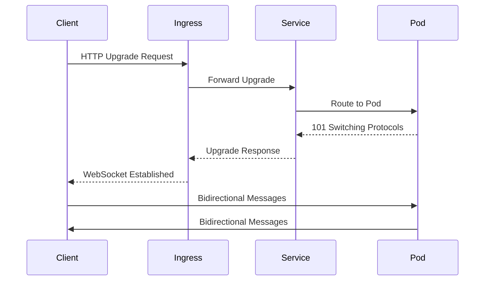

# How to Configure WebSocket with Kubernetes Ingress

Author: [nawazdhandala](https://www.github.com/nawazdhandala)

Tags: WebSocket, Kubernetes, Ingress, NGINX, Networking, DevOps

Description: A practical guide to configuring WebSocket connections through Kubernetes Ingress controllers, including timeout settings, sticky sessions, and troubleshooting common issues.

---

WebSocket connections through Kubernetes Ingress require specific configuration that differs from standard HTTP traffic. Without proper settings, WebSocket connections may fail to establish or disconnect unexpectedly. This guide covers the essential configuration for reliable WebSocket support.

## Understanding WebSocket in Kubernetes

WebSocket is a protocol that provides full-duplex communication channels over a single TCP connection. Unlike HTTP, WebSocket connections are long-lived and require special handling at the ingress layer.



The key difference from HTTP is that the connection must persist and both parties can send data at any time.

## NGINX Ingress Controller Configuration

The NGINX Ingress Controller is the most common choice and requires specific annotations for WebSocket support.

### Basic WebSocket Configuration

```yaml
apiVersion: networking.k8s.io/v1
kind: Ingress
metadata:
  name: websocket-ingress
  namespace: default
  annotations:
    # Enable WebSocket support
    nginx.ingress.kubernetes.io/proxy-http-version: "1.1"
    nginx.ingress.kubernetes.io/upstream-hash-by: "$request_uri"
    # Required for WebSocket upgrade
    nginx.ingress.kubernetes.io/proxy-set-headers: "default/websocket-headers"
spec:
  ingressClassName: nginx
  rules:
    - host: ws.example.com
      http:
        paths:
          - path: /
            pathType: Prefix
            backend:
              service:
                name: websocket-service
                port:
                  number: 8080
```

Create a ConfigMap for the WebSocket headers.

```yaml
apiVersion: v1
kind: ConfigMap
metadata:
  name: websocket-headers
  namespace: default
data:
  Upgrade: "$http_upgrade"
  Connection: "upgrade"
```

### Timeout Configuration

WebSocket connections are long-lived, so default timeouts will cause premature disconnections.

```yaml
apiVersion: networking.k8s.io/v1
kind: Ingress
metadata:
  name: websocket-ingress
  annotations:
    # Increase timeouts for long-lived connections
    nginx.ingress.kubernetes.io/proxy-connect-timeout: "3600"
    nginx.ingress.kubernetes.io/proxy-send-timeout: "3600"
    nginx.ingress.kubernetes.io/proxy-read-timeout: "3600"
    # WebSocket specific
    nginx.ingress.kubernetes.io/proxy-http-version: "1.1"
    nginx.ingress.kubernetes.io/upstream-hash-by: "$request_uri"
spec:
  ingressClassName: nginx
  rules:
    - host: ws.example.com
      http:
        paths:
          - path: /socket.io
            pathType: Prefix
            backend:
              service:
                name: socketio-service
                port:
                  number: 3000
```

### Sticky Sessions for Scaled Deployments

When running multiple WebSocket server replicas, sticky sessions ensure clients always connect to the same pod.

```yaml
apiVersion: networking.k8s.io/v1
kind: Ingress
metadata:
  name: websocket-sticky
  annotations:
    nginx.ingress.kubernetes.io/proxy-http-version: "1.1"
    nginx.ingress.kubernetes.io/proxy-read-timeout: "3600"
    nginx.ingress.kubernetes.io/proxy-send-timeout: "3600"
    # Enable sticky sessions
    nginx.ingress.kubernetes.io/affinity: "cookie"
    nginx.ingress.kubernetes.io/affinity-mode: "persistent"
    nginx.ingress.kubernetes.io/session-cookie-name: "WSSERVERID"
    nginx.ingress.kubernetes.io/session-cookie-max-age: "172800"
    nginx.ingress.kubernetes.io/session-cookie-path: "/"
spec:
  ingressClassName: nginx
  rules:
    - host: ws.example.com
      http:
        paths:
          - path: /
            pathType: Prefix
            backend:
              service:
                name: websocket-service
                port:
                  number: 8080
```

## Traefik Ingress Configuration

If you use Traefik as your ingress controller, the configuration differs.

```yaml
apiVersion: networking.k8s.io/v1
kind: Ingress
metadata:
  name: websocket-traefik
  annotations:
    traefik.ingress.kubernetes.io/router.middlewares: default-websocket-middleware@kubernetescrd
spec:
  ingressClassName: traefik
  rules:
    - host: ws.example.com
      http:
        paths:
          - path: /
            pathType: Prefix
            backend:
              service:
                name: websocket-service
                port:
                  number: 8080
---
apiVersion: traefik.containo.us/v1alpha1
kind: Middleware
metadata:
  name: websocket-middleware
spec:
  headers:
    customRequestHeaders:
      Connection: "upgrade"
      Upgrade: "websocket"
```

For Traefik IngressRoute with explicit WebSocket configuration.

```yaml
apiVersion: traefik.containo.us/v1alpha1
kind: IngressRoute
metadata:
  name: websocket-route
spec:
  entryPoints:
    - web
    - websecure
  routes:
    - match: Host(`ws.example.com`)
      kind: Rule
      services:
        - name: websocket-service
          port: 8080
          sticky:
            cookie:
              name: srv_id
              secure: true
```

## TLS Configuration for Secure WebSocket (WSS)

Production WebSocket connections should use TLS.

```yaml
apiVersion: networking.k8s.io/v1
kind: Ingress
metadata:
  name: websocket-tls
  annotations:
    nginx.ingress.kubernetes.io/proxy-http-version: "1.1"
    nginx.ingress.kubernetes.io/proxy-read-timeout: "3600"
    nginx.ingress.kubernetes.io/proxy-send-timeout: "3600"
    # SSL settings
    nginx.ingress.kubernetes.io/ssl-redirect: "true"
    nginx.ingress.kubernetes.io/force-ssl-redirect: "true"
spec:
  ingressClassName: nginx
  tls:
    - hosts:
        - ws.example.com
      secretName: websocket-tls-secret
  rules:
    - host: ws.example.com
      http:
        paths:
          - path: /
            pathType: Prefix
            backend:
              service:
                name: websocket-service
                port:
                  number: 8080
```

Create the TLS secret from your certificates.

```bash
# Create TLS secret from certificate files
kubectl create secret tls websocket-tls-secret \
  --cert=path/to/cert.pem \
  --key=path/to/key.pem \
  -n default
```

## Backend Service Configuration

Your Kubernetes Service must be configured correctly for WebSocket traffic.

```yaml
apiVersion: v1
kind: Service
metadata:
  name: websocket-service
spec:
  selector:
    app: websocket-app
  ports:
    - port: 8080
      targetPort: 8080
      protocol: TCP
  # Use ClusterIP for internal routing
  type: ClusterIP
---
apiVersion: apps/v1
kind: Deployment
metadata:
  name: websocket-app
spec:
  replicas: 3
  selector:
    matchLabels:
      app: websocket-app
  template:
    metadata:
      labels:
        app: websocket-app
    spec:
      containers:
        - name: websocket
          image: your-websocket-app:latest
          ports:
            - containerPort: 8080
          # Readiness probe for WebSocket
          readinessProbe:
            httpGet:
              path: /health
              port: 8080
            initialDelaySeconds: 5
            periodSeconds: 10
          # Keep container alive
          livenessProbe:
            httpGet:
              path: /health
              port: 8080
            initialDelaySeconds: 15
            periodSeconds: 20
```

## Handling Multiple Paths

Many applications serve both REST API and WebSocket from the same domain.

```yaml
apiVersion: networking.k8s.io/v1
kind: Ingress
metadata:
  name: mixed-traffic
  annotations:
    nginx.ingress.kubernetes.io/proxy-http-version: "1.1"
spec:
  ingressClassName: nginx
  rules:
    - host: api.example.com
      http:
        paths:
          # WebSocket path with extended timeouts
          - path: /ws
            pathType: Prefix
            backend:
              service:
                name: websocket-service
                port:
                  number: 8080
          # Socket.IO path
          - path: /socket.io
            pathType: Prefix
            backend:
              service:
                name: socketio-service
                port:
                  number: 3000
          # REST API path with standard timeouts
          - path: /api
            pathType: Prefix
            backend:
              service:
                name: api-service
                port:
                  number: 8000
```

To apply different timeout settings per path, use separate Ingress resources.

```yaml
apiVersion: networking.k8s.io/v1
kind: Ingress
metadata:
  name: websocket-paths
  annotations:
    nginx.ingress.kubernetes.io/proxy-http-version: "1.1"
    nginx.ingress.kubernetes.io/proxy-read-timeout: "3600"
    nginx.ingress.kubernetes.io/proxy-send-timeout: "3600"
spec:
  ingressClassName: nginx
  rules:
    - host: api.example.com
      http:
        paths:
          - path: /ws
            pathType: Prefix
            backend:
              service:
                name: websocket-service
                port:
                  number: 8080
---
apiVersion: networking.k8s.io/v1
kind: Ingress
metadata:
  name: api-paths
  annotations:
    nginx.ingress.kubernetes.io/proxy-read-timeout: "60"
    nginx.ingress.kubernetes.io/proxy-send-timeout: "60"
spec:
  ingressClassName: nginx
  rules:
    - host: api.example.com
      http:
        paths:
          - path: /api
            pathType: Prefix
            backend:
              service:
                name: api-service
                port:
                  number: 8000
```

## Testing WebSocket Connectivity

Test your WebSocket configuration using command line tools.

```bash
# Test WebSocket connection using websocat
websocat wss://ws.example.com/

# Test with wscat
wscat -c wss://ws.example.com/

# Test with curl (upgrade request)
curl -i -N \
  -H "Connection: Upgrade" \
  -H "Upgrade: websocket" \
  -H "Host: ws.example.com" \
  -H "Sec-WebSocket-Key: dGhlIHNhbXBsZSBub25jZQ==" \
  -H "Sec-WebSocket-Version: 13" \
  https://ws.example.com/
```

## Troubleshooting

### Check Ingress Controller Logs

```bash
# NGINX Ingress Controller logs
kubectl logs -l app.kubernetes.io/name=ingress-nginx \
  -n ingress-nginx -f

# Check for WebSocket upgrade errors
kubectl logs -l app.kubernetes.io/name=ingress-nginx \
  -n ingress-nginx | grep -i upgrade
```

### Verify Configuration

```bash
# Check Ingress resource
kubectl describe ingress websocket-ingress

# Verify annotations are applied
kubectl get ingress websocket-ingress -o yaml

# Test connectivity to service directly
kubectl port-forward svc/websocket-service 8080:8080 &
wscat -c ws://localhost:8080/
```

### Common Issues

**Connection drops after 60 seconds:** Increase proxy-read-timeout and proxy-send-timeout annotations.

**101 Switching Protocols not received:** Ensure proxy-http-version is set to 1.1 and upgrade headers are configured.

**Load balancing issues with multiple replicas:** Enable sticky sessions using affinity annotations.

**SSL handshake failures:** Verify TLS secret exists and certificate chain is complete.

Proper WebSocket configuration in Kubernetes requires attention to timeouts, upgrade headers, and session affinity. Start with the basic configuration and add sticky sessions if running multiple replicas.
