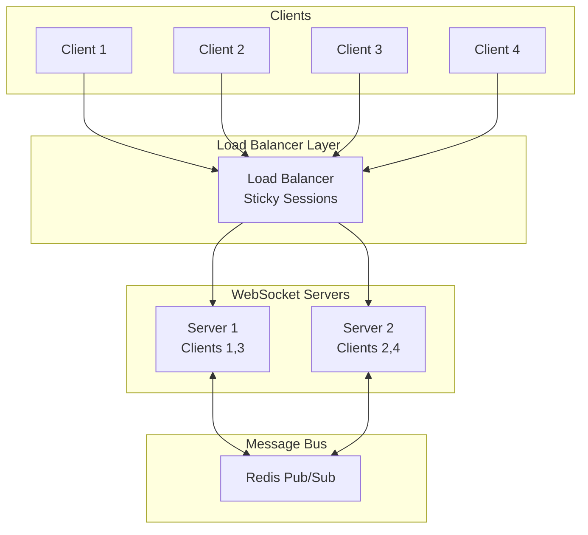
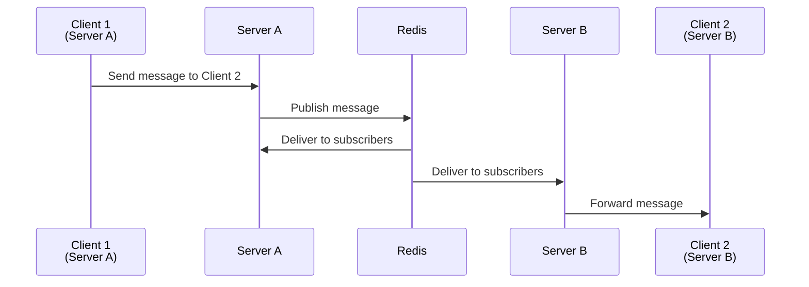

# How to Configure WebSocket with Load Balancers

Author: [nawazdhandala](https://www.github.com/nawazdhandala)

Tags: WebSocket, Load Balancer, Nginx, HAProxy, AWS ALB, Scaling, DevOps, Infrastructure

Description: A comprehensive guide to configuring load balancers for WebSocket applications, covering Nginx, HAProxy, AWS ALB, and sticky session strategies.

---

> WebSocket connections are persistent and stateful, which creates unique challenges for load balancing. Unlike HTTP requests that can be distributed freely across servers, WebSocket connections must maintain affinity with a specific backend server for the duration of the connection.

This guide covers the configuration required for popular load balancers to properly handle WebSocket traffic, including connection upgrades, timeout settings, and session affinity.

---

## WebSocket Load Balancing Architecture



---

## Key Requirements for WebSocket Load Balancing

1. **Connection Upgrade Support**: The load balancer must forward HTTP Upgrade headers
2. **Long Timeouts**: WebSocket connections can last hours or days
3. **Sticky Sessions**: Connections must stay with the same backend server
4. **Health Checks**: Detect failed backends without disrupting connections

---

## Nginx Configuration

### Basic WebSocket Proxy

```nginx
# /etc/nginx/nginx.conf

http {
    # Upstream definition for WebSocket servers
    upstream websocket_backend {
        # IP hash ensures same client goes to same server
        ip_hash;

        server ws1.internal:8080 weight=1;
        server ws2.internal:8080 weight=1;
        server ws3.internal:8080 weight=1;

        # Keepalive connections to backend
        keepalive 64;
    }

    # Map to handle connection upgrade
    map $http_upgrade $connection_upgrade {
        default upgrade;
        '' close;
    }

    server {
        listen 80;
        listen 443 ssl;
        server_name ws.example.com;

        # SSL configuration
        ssl_certificate /etc/nginx/ssl/server.crt;
        ssl_certificate_key /etc/nginx/ssl/server.key;

        location /ws {
            proxy_pass http://websocket_backend;

            # WebSocket upgrade headers - REQUIRED
            proxy_http_version 1.1;
            proxy_set_header Upgrade $http_upgrade;
            proxy_set_header Connection $connection_upgrade;

            # Pass client information to backend
            proxy_set_header Host $host;
            proxy_set_header X-Real-IP $remote_addr;
            proxy_set_header X-Forwarded-For $proxy_add_x_forwarded_for;
            proxy_set_header X-Forwarded-Proto $scheme;

            # Long timeouts for persistent connections
            # These are critical for WebSocket stability
            proxy_connect_timeout 7d;
            proxy_send_timeout 7d;
            proxy_read_timeout 7d;

            # Disable buffering for real-time data
            proxy_buffering off;
            proxy_request_buffering off;

            # Increase buffer sizes for WebSocket frames
            proxy_buffer_size 8k;
            proxy_buffers 8 8k;
        }

        # Health check endpoint (non-WebSocket)
        location /health {
            proxy_pass http://websocket_backend/health;
            proxy_http_version 1.1;
            proxy_set_header Host $host;
        }
    }
}
```

### Advanced Nginx Configuration with Multiple Paths

```nginx
http {
    # Separate upstreams for different WebSocket paths
    upstream chat_backend {
        ip_hash;
        server chat1.internal:8080;
        server chat2.internal:8080;
        keepalive 32;
    }

    upstream notifications_backend {
        ip_hash;
        server notify1.internal:8080;
        server notify2.internal:8080;
        keepalive 32;
    }

    map $http_upgrade $connection_upgrade {
        default upgrade;
        '' close;
    }

    server {
        listen 443 ssl http2;
        server_name api.example.com;

        ssl_certificate /etc/nginx/ssl/server.crt;
        ssl_certificate_key /etc/nginx/ssl/server.key;

        # Chat WebSocket endpoint
        location /ws/chat {
            proxy_pass http://chat_backend;
            proxy_http_version 1.1;
            proxy_set_header Upgrade $http_upgrade;
            proxy_set_header Connection $connection_upgrade;
            proxy_set_header Host $host;
            proxy_set_header X-Real-IP $remote_addr;

            # Chat connections can be very long-lived
            proxy_read_timeout 24h;
            proxy_send_timeout 24h;

            proxy_buffering off;
        }

        # Notifications WebSocket endpoint
        location /ws/notifications {
            proxy_pass http://notifications_backend;
            proxy_http_version 1.1;
            proxy_set_header Upgrade $http_upgrade;
            proxy_set_header Connection $connection_upgrade;
            proxy_set_header Host $host;
            proxy_set_header X-Real-IP $remote_addr;

            # Shorter timeout for notification connections
            proxy_read_timeout 1h;
            proxy_send_timeout 1h;

            proxy_buffering off;
        }

        # Regular API endpoints
        location /api {
            proxy_pass http://api_backend;
            proxy_http_version 1.1;
            proxy_set_header Host $host;
        }
    }
}
```

---

## HAProxy Configuration

### Basic WebSocket Configuration

```haproxy
# /etc/haproxy/haproxy.cfg

global
    maxconn 50000
    log stdout format raw local0

defaults
    mode http
    log global
    option httplog
    option dontlognull
    timeout connect 5s
    timeout client 1h
    timeout server 1h
    # Critical: tunnel timeout for WebSocket
    timeout tunnel 1h

# Frontend for incoming connections
frontend websocket_frontend
    bind *:80
    bind *:443 ssl crt /etc/haproxy/certs/server.pem

    # Detect WebSocket upgrade requests
    acl is_websocket hdr(Upgrade) -i websocket
    acl is_websocket_path path_beg /ws

    # Route WebSocket traffic to dedicated backend
    use_backend websocket_servers if is_websocket OR is_websocket_path

    # Default backend for regular HTTP
    default_backend http_servers

# Backend for WebSocket servers
backend websocket_servers
    # Sticky sessions based on source IP
    balance source
    hash-type consistent

    # HTTP/1.1 required for WebSocket upgrade
    option http-server-close
    option forwardfor

    # Health checks - use HTTP endpoint
    option httpchk GET /health
    http-check expect status 200

    # WebSocket servers
    server ws1 192.168.1.10:8080 check inter 5s fall 3 rise 2
    server ws2 192.168.1.11:8080 check inter 5s fall 3 rise 2
    server ws3 192.168.1.12:8080 check inter 5s fall 3 rise 2

# Regular HTTP backend
backend http_servers
    balance roundrobin
    option httpchk GET /health

    server app1 192.168.1.20:8080 check
    server app2 192.168.1.21:8080 check
```

### HAProxy with Cookie-Based Sticky Sessions

```haproxy
global
    maxconn 50000

defaults
    mode http
    timeout connect 5s
    timeout client 1h
    timeout server 1h
    timeout tunnel 1h

frontend https_frontend
    bind *:443 ssl crt /etc/haproxy/certs/server.pem

    # Detect WebSocket
    acl is_websocket hdr(Upgrade) -i websocket

    use_backend websocket_backend if is_websocket
    default_backend api_backend

backend websocket_backend
    # Cookie-based sticky sessions
    # More reliable than IP hash when clients share IPs
    cookie SERVERID insert indirect nocache

    option http-server-close
    option forwardfor

    # Extended timeouts for WebSocket
    timeout server 24h
    timeout tunnel 24h

    # Health check configuration
    option httpchk GET /ws/health
    http-check expect status 200

    # Servers with cookie identifiers
    server ws1 10.0.0.1:8080 cookie ws1 check inter 10s
    server ws2 10.0.0.2:8080 cookie ws2 check inter 10s
    server ws3 10.0.0.3:8080 cookie ws3 check inter 10s
```

---

## AWS Application Load Balancer (ALB)

### Terraform Configuration

```hcl
# AWS ALB configuration for WebSocket
resource "aws_lb" "websocket" {
  name               = "websocket-alb"
  internal           = false
  load_balancer_type = "application"
  security_groups    = [aws_security_group.alb.id]
  subnets            = var.public_subnet_ids

  # Enable deletion protection in production
  enable_deletion_protection = true

  tags = {
    Name = "websocket-alb"
  }
}

# Target group with sticky sessions
resource "aws_lb_target_group" "websocket" {
  name     = "websocket-targets"
  port     = 8080
  protocol = "HTTP"
  vpc_id   = var.vpc_id

  # Health check configuration
  health_check {
    enabled             = true
    healthy_threshold   = 2
    unhealthy_threshold = 3
    timeout             = 5
    interval            = 30
    path                = "/health"
    port                = "traffic-port"
    protocol            = "HTTP"
    matcher             = "200"
  }

  # Sticky sessions for WebSocket affinity
  stickiness {
    type            = "lb_cookie"
    cookie_duration = 86400  # 24 hours
    enabled         = true
  }

  # Deregistration delay - allow connections to drain
  deregistration_delay = 300
}

# HTTPS listener
resource "aws_lb_listener" "https" {
  load_balancer_arn = aws_lb.websocket.arn
  port              = 443
  protocol          = "HTTPS"
  ssl_policy        = "ELBSecurityPolicy-TLS-1-2-2017-01"
  certificate_arn   = var.certificate_arn

  default_action {
    type             = "forward"
    target_group_arn = aws_lb_target_group.websocket.arn
  }
}

# ALB attributes for WebSocket
resource "aws_lb_listener" "websocket_listener" {
  load_balancer_arn = aws_lb.websocket.arn
  port              = 443
  protocol          = "HTTPS"
  certificate_arn   = var.certificate_arn

  default_action {
    type             = "forward"
    target_group_arn = aws_lb_target_group.websocket.arn
  }
}

# Increase idle timeout for WebSocket connections
resource "aws_lb" "websocket_with_timeout" {
  name               = "websocket-alb"
  load_balancer_type = "application"
  subnets            = var.public_subnet_ids

  # Critical: Increase idle timeout for WebSocket
  # Default is 60 seconds, WebSocket needs much more
  idle_timeout = 3600  # 1 hour

  tags = {
    Name = "websocket-alb"
  }
}
```

### AWS CLI Commands

```bash
#!/bin/bash
# Create ALB with WebSocket-appropriate settings

# Create the load balancer
aws elbv2 create-load-balancer \
    --name websocket-alb \
    --subnets subnet-12345 subnet-67890 \
    --security-groups sg-12345 \
    --scheme internet-facing \
    --type application \
    --ip-address-type ipv4

# Set idle timeout to 1 hour for WebSocket connections
aws elbv2 modify-load-balancer-attributes \
    --load-balancer-arn arn:aws:elasticloadbalancing:... \
    --attributes Key=idle_timeout.timeout_seconds,Value=3600

# Create target group with stickiness
aws elbv2 create-target-group \
    --name websocket-targets \
    --protocol HTTP \
    --port 8080 \
    --vpc-id vpc-12345 \
    --health-check-path /health \
    --health-check-interval-seconds 30 \
    --healthy-threshold-count 2 \
    --unhealthy-threshold-count 3

# Enable sticky sessions
aws elbv2 modify-target-group-attributes \
    --target-group-arn arn:aws:elasticloadbalancing:... \
    --attributes \
        Key=stickiness.enabled,Value=true \
        Key=stickiness.type,Value=lb_cookie \
        Key=stickiness.lb_cookie.duration_seconds,Value=86400
```

---

## Kubernetes Ingress Configuration

### Nginx Ingress Controller

```yaml
# kubernetes/websocket-ingress.yaml
apiVersion: networking.k8s.io/v1
kind: Ingress
metadata:
  name: websocket-ingress
  annotations:
    # Nginx Ingress specific annotations
    nginx.ingress.kubernetes.io/proxy-read-timeout: "3600"
    nginx.ingress.kubernetes.io/proxy-send-timeout: "3600"
    nginx.ingress.kubernetes.io/proxy-connect-timeout: "7"

    # WebSocket support
    nginx.ingress.kubernetes.io/websocket-services: "websocket-service"

    # Sticky sessions
    nginx.ingress.kubernetes.io/affinity: "cookie"
    nginx.ingress.kubernetes.io/affinity-mode: "persistent"
    nginx.ingress.kubernetes.io/session-cookie-name: "WSSERVERID"
    nginx.ingress.kubernetes.io/session-cookie-expires: "86400"
    nginx.ingress.kubernetes.io/session-cookie-max-age: "86400"
    nginx.ingress.kubernetes.io/session-cookie-path: "/ws"

    # Disable buffering for real-time
    nginx.ingress.kubernetes.io/proxy-buffering: "off"

spec:
  ingressClassName: nginx
  tls:
  - hosts:
    - ws.example.com
    secretName: websocket-tls
  rules:
  - host: ws.example.com
    http:
      paths:
      - path: /ws
        pathType: Prefix
        backend:
          service:
            name: websocket-service
            port:
              number: 8080
---
apiVersion: v1
kind: Service
metadata:
  name: websocket-service
spec:
  # Use ClusterIP, Ingress handles external traffic
  type: ClusterIP
  selector:
    app: websocket-server
  ports:
  - port: 8080
    targetPort: 8080
---
apiVersion: apps/v1
kind: Deployment
metadata:
  name: websocket-server
spec:
  replicas: 3
  selector:
    matchLabels:
      app: websocket-server
  template:
    metadata:
      labels:
        app: websocket-server
    spec:
      containers:
      - name: websocket
        image: myapp/websocket-server:latest
        ports:
        - containerPort: 8080
        readinessProbe:
          httpGet:
            path: /health
            port: 8080
          initialDelaySeconds: 5
          periodSeconds: 10
        livenessProbe:
          httpGet:
            path: /health
            port: 8080
          initialDelaySeconds: 15
          periodSeconds: 20
```

### Traefik Ingress

```yaml
# kubernetes/websocket-traefik.yaml
apiVersion: traefik.containo.us/v1alpha1
kind: IngressRoute
metadata:
  name: websocket-ingress
spec:
  entryPoints:
    - websecure
  routes:
    - match: Host(`ws.example.com`) && PathPrefix(`/ws`)
      kind: Rule
      services:
        - name: websocket-service
          port: 8080
          sticky:
            cookie:
              name: ws_affinity
              secure: true
              httpOnly: true
      middlewares:
        - name: websocket-headers
  tls:
    secretName: websocket-tls
---
apiVersion: traefik.containo.us/v1alpha1
kind: Middleware
metadata:
  name: websocket-headers
spec:
  headers:
    customRequestHeaders:
      X-Forwarded-Proto: "https"
---
apiVersion: traefik.containo.us/v1alpha1
kind: ServersTransport
metadata:
  name: websocket-transport
spec:
  # Disable HTTP/2 for WebSocket
  disableHTTP2: true
```

---

## Cross-Server Communication with Redis

When scaling WebSocket servers behind a load balancer, servers need to communicate:



```javascript
// websocket-server.js - Scaled WebSocket server with Redis
const WebSocket = require('ws');
const Redis = require('ioredis');
const http = require('http');

// Redis clients
const publisher = new Redis(process.env.REDIS_URL);
const subscriber = new Redis(process.env.REDIS_URL);

// Server identification
const SERVER_ID = process.env.HOSTNAME || `server-${process.pid}`;

// HTTP server for health checks
const server = http.createServer((req, res) => {
    if (req.url === '/health') {
        res.writeHead(200, { 'Content-Type': 'application/json' });
        res.end(JSON.stringify({
            status: 'healthy',
            serverId: SERVER_ID,
            connections: wss.clients.size
        }));
    } else {
        res.writeHead(404);
        res.end();
    }
});

// WebSocket server
const wss = new WebSocket.Server({ server });

// Local client tracking
const clients = new Map();
const userToClient = new Map();

// Subscribe to Redis channels
subscriber.subscribe('broadcast', 'direct');

subscriber.on('message', (channel, message) => {
    const data = JSON.parse(message);

    if (channel === 'broadcast') {
        // Broadcast to all local clients
        broadcastLocal(data.payload);
    } else if (channel === 'direct') {
        // Send to specific user if connected locally
        const ws = userToClient.get(data.userId);
        if (ws && ws.readyState === WebSocket.OPEN) {
            ws.send(JSON.stringify(data.payload));
        }
    }
});

wss.on('connection', (ws, req) => {
    const clientId = generateId();

    // Store connection
    clients.set(clientId, { ws, userId: null });

    ws.on('message', async (data) => {
        const message = JSON.parse(data);

        switch (message.type) {
            case 'auth':
                // Associate user ID with connection
                const { userId } = message;
                clients.get(clientId).userId = userId;
                userToClient.set(userId, ws);

                // Register user location in Redis
                await publisher.hset('user:locations', userId, SERVER_ID);
                break;

            case 'broadcast':
                // Publish to all servers via Redis
                await publisher.publish('broadcast', JSON.stringify({
                    payload: message.payload
                }));
                break;

            case 'direct':
                // Send to specific user (may be on different server)
                await publisher.publish('direct', JSON.stringify({
                    userId: message.targetUserId,
                    payload: message.payload
                }));
                break;
        }
    });

    ws.on('close', async () => {
        const client = clients.get(clientId);
        if (client && client.userId) {
            userToClient.delete(client.userId);
            await publisher.hdel('user:locations', client.userId);
        }
        clients.delete(clientId);
    });
});

function broadcastLocal(payload) {
    const message = JSON.stringify(payload);
    wss.clients.forEach((client) => {
        if (client.readyState === WebSocket.OPEN) {
            client.send(message);
        }
    });
}

function generateId() {
    return Math.random().toString(36).substring(2, 15);
}

server.listen(8080, () => {
    console.log(`WebSocket server ${SERVER_ID} listening on port 8080`);
});
```

---

## Testing Load Balancer Configuration

```bash
#!/bin/bash
# test-websocket-lb.sh - Test WebSocket load balancer configuration

WSURL="wss://ws.example.com/ws"

echo "=== Testing WebSocket Load Balancer ==="

# Test 1: Basic connection
echo ""
echo "Test 1: Basic WebSocket connection"
wscat -c "$WSURL" -x '{"type":"ping"}' --execute-timeout 5000 2>&1

# Test 2: Check upgrade headers
echo ""
echo "Test 2: HTTP Upgrade headers"
curl -si \
    -H "Connection: Upgrade" \
    -H "Upgrade: websocket" \
    -H "Sec-WebSocket-Key: dGhlIHNhbXBsZSBub25jZQ==" \
    -H "Sec-WebSocket-Version: 13" \
    "https://ws.example.com/ws" 2>&1 | head -15

# Test 3: Sticky session verification
echo ""
echo "Test 3: Sticky session verification"
for i in {1..5}; do
    # Make requests and check which server responds
    curl -s -c cookies.txt -b cookies.txt \
        "https://ws.example.com/health" | jq -r '.serverId'
done

# Test 4: Connection persistence
echo ""
echo "Test 4: Long connection test (30 seconds)"
timeout 30 wscat -c "$WSURL" -w 30 2>&1 &
WS_PID=$!
sleep 30
kill $WS_PID 2>/dev/null
echo "Connection maintained for 30 seconds: SUCCESS"

echo ""
echo "=== Tests Complete ==="
```

---

## Summary

| Load Balancer | Key Settings | Sticky Session Method |
|---------------|--------------|----------------------|
| Nginx | proxy_http_version 1.1, Upgrade headers, long timeouts | ip_hash or sticky cookie |
| HAProxy | timeout tunnel, option http-server-close | balance source or cookie |
| AWS ALB | idle_timeout 3600, stickiness enabled | lb_cookie |
| Kubernetes Nginx | websocket-services annotation, affinity cookie | Session cookie |

The most critical settings for WebSocket load balancing are:
1. **Connection upgrade headers** - Without these, WebSocket handshake fails
2. **Long timeouts** - Default timeouts will kill persistent connections
3. **Sticky sessions** - Connections must stay with the same backend

---

*Need to monitor your load-balanced WebSocket infrastructure? [OneUptime](https://oneuptime.com) provides comprehensive monitoring for distributed WebSocket deployments, including per-server connection counts and cross-server message latencies.*
