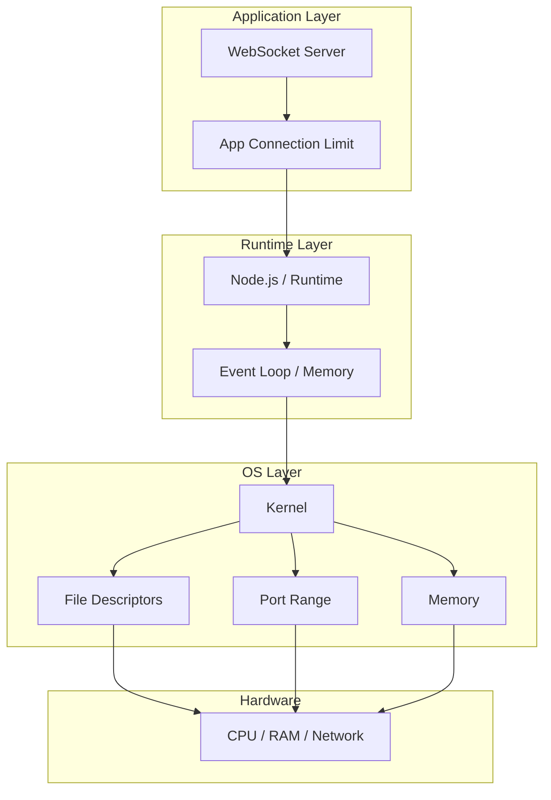
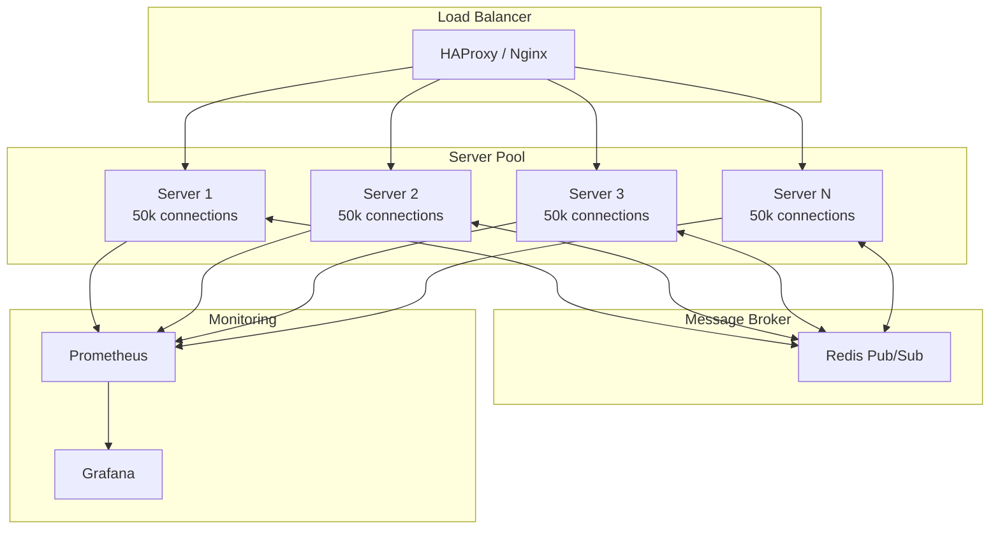

# How to Fix "Max Connections" WebSocket Limits

Author: [nawazdhandala](https://www.github.com/nawazdhandala)

Tags: WebSocket, Performance, Scaling, Linux, Node.js, System Administration

Description: Learn how to diagnose and fix WebSocket maximum connection limits including OS-level tuning, application configuration, and scaling strategies.

---

Hitting WebSocket connection limits is a common scaling challenge. When your server starts rejecting new connections or crashes under load, you need to understand the multiple layers where limits exist: operating system, runtime, and application. This guide covers how to identify and resolve connection limits at each level.

## Understanding Connection Limits

Connection limits exist at multiple levels of the stack. Each layer can become a bottleneck.



## Identifying the Bottleneck

### Check Current Limits

```bash
#!/bin/bash
# check-limits.sh - Diagnose connection limits

echo "=== System Connection Limits ==="

# File descriptor limits
echo -e "\n--- File Descriptor Limits ---"
echo "Soft limit: $(ulimit -Sn)"
echo "Hard limit: $(ulimit -Hn)"

# System-wide file descriptor limit
echo "System max: $(cat /proc/sys/fs/file-max)"
echo "Currently open: $(cat /proc/sys/fs/file-nr | awk '{print $1}')"

# Socket buffer sizes
echo -e "\n--- Socket Buffer Sizes ---"
echo "Read buffer max: $(cat /proc/sys/net/core/rmem_max)"
echo "Write buffer max: $(cat /proc/sys/net/core/wmem_max)"

# Port range
echo -e "\n--- Ephemeral Port Range ---"
cat /proc/sys/net/ipv4/ip_local_port_range

# Connection tracking
echo -e "\n--- Connection Tracking ---"
echo "Max tracked: $(cat /proc/sys/net/netfilter/nf_conntrack_max 2>/dev/null || echo 'N/A')"
echo "Current tracked: $(cat /proc/sys/net/netfilter/nf_conntrack_count 2>/dev/null || echo 'N/A')"

# TCP settings
echo -e "\n--- TCP Settings ---"
echo "Max backlog: $(cat /proc/sys/net/core/somaxconn)"
echo "TCP max orphans: $(cat /proc/sys/net/ipv4/tcp_max_orphans)"
echo "TCP TIME_WAIT buckets: $(cat /proc/sys/net/ipv4/tcp_max_tw_buckets)"

# Memory
echo -e "\n--- Memory Usage ---"
free -h
```

### Monitor Active Connections

```bash
#!/bin/bash
# monitor-connections.sh - Real-time connection monitoring

# Count WebSocket connections by state
echo "=== WebSocket Connections ==="

# Total established connections on common WebSocket ports
echo "Port 80: $(ss -tn state established '( dport = :80 or sport = :80 )' | wc -l)"
echo "Port 443: $(ss -tn state established '( dport = :443 or sport = :443 )' | wc -l)"
echo "Port 8080: $(ss -tn state established '( dport = :8080 or sport = :8080 )' | wc -l)"

# Connection states
echo -e "\n=== Connection States ==="
ss -tan | awk 'NR>1 {print $1}' | sort | uniq -c | sort -rn

# Top connections by IP
echo -e "\n=== Top 10 IPs by Connection Count ==="
ss -tn | awk 'NR>1 {print $5}' | cut -d: -f1 | sort | uniq -c | sort -rn | head -10

# File descriptors for node process
if pgrep -x "node" > /dev/null; then
    NODE_PID=$(pgrep -x "node" | head -1)
    echo -e "\n=== Node.js Process ($NODE_PID) ==="
    echo "Open file descriptors: $(ls /proc/$NODE_PID/fd 2>/dev/null | wc -l)"
    echo "FD limit: $(cat /proc/$NODE_PID/limits | grep 'Max open files' | awk '{print $4}')"
fi
```

## Solution 1: Operating System Tuning

### Linux Kernel Parameters

```bash
# /etc/sysctl.conf - Add these settings for high connection counts

# Increase maximum file descriptors
fs.file-max = 2097152
fs.nr_open = 2097152

# Increase socket buffer sizes
net.core.rmem_max = 16777216
net.core.wmem_max = 16777216
net.core.rmem_default = 1048576
net.core.wmem_default = 1048576

# Increase connection backlog
net.core.somaxconn = 65535
net.core.netdev_max_backlog = 65535

# Expand port range for outbound connections
net.ipv4.ip_local_port_range = 1024 65535

# TCP optimizations
net.ipv4.tcp_max_syn_backlog = 65535
net.ipv4.tcp_max_tw_buckets = 2000000
net.ipv4.tcp_tw_reuse = 1
net.ipv4.tcp_fin_timeout = 15

# Enable TCP keepalive
net.ipv4.tcp_keepalive_time = 300
net.ipv4.tcp_keepalive_probes = 5
net.ipv4.tcp_keepalive_intvl = 15

# Connection tracking (for NAT/firewall)
net.netfilter.nf_conntrack_max = 1048576
net.nf_conntrack_max = 1048576

# Memory settings for high connection counts
net.ipv4.tcp_mem = 786432 1048576 1572864
net.ipv4.tcp_rmem = 4096 87380 16777216
net.ipv4.tcp_wmem = 4096 65536 16777216
```

Apply settings:

```bash
# Apply immediately
sudo sysctl -p

# Or apply specific setting
sudo sysctl -w fs.file-max=2097152
```

### File Descriptor Limits

```bash
# /etc/security/limits.conf - Per-user limits

# For specific user running WebSocket server
websocket-user soft nofile 1048576
websocket-user hard nofile 1048576

# For all users
* soft nofile 1048576
* hard nofile 1048576

# /etc/security/limits.d/99-websocket.conf - Dedicated limits file
websocket-user soft nofile 1048576
websocket-user hard nofile 1048576
websocket-user soft nproc 65535
websocket-user hard nproc 65535
```

### Systemd Service Configuration

```ini
# /etc/systemd/system/websocket-server.service

[Unit]
Description=WebSocket Server
After=network.target

[Service]
Type=simple
User=websocket-user
Group=websocket-user
WorkingDirectory=/opt/websocket-server

# Increase limits for this service
LimitNOFILE=1048576
LimitNPROC=65535
LimitCORE=infinity

# Environment
Environment=NODE_ENV=production
Environment=UV_THREADPOOL_SIZE=128

# Command
ExecStart=/usr/bin/node /opt/websocket-server/server.js
Restart=always
RestartSec=10

[Install]
WantedBy=multi-user.target
```

## Solution 2: Application-Level Configuration

### Node.js WebSocket Server

```javascript
// server.js - Optimized WebSocket server for high connections

const WebSocket = require('ws');
const http = require('http');
const cluster = require('cluster');
const os = require('os');

// Configuration
const config = {
    port: process.env.PORT || 8080,
    maxConnections: parseInt(process.env.MAX_CONNECTIONS) || 100000,
    maxConnectionsPerIP: parseInt(process.env.MAX_PER_IP) || 100,
    backlog: parseInt(process.env.BACKLOG) || 65535,
    workers: parseInt(process.env.WORKERS) || os.cpus().length,
    keepAliveInterval: 30000,
    connectionTimeout: 60000
};

if (cluster.isMaster) {
    console.log(`Master ${process.pid} starting ${config.workers} workers`);

    // Fork workers
    for (let i = 0; i < config.workers; i++) {
        cluster.fork();
    }

    cluster.on('exit', (worker, code, signal) => {
        console.log(`Worker ${worker.process.pid} died, restarting...`);
        cluster.fork();
    });

    // Monitor total connections across workers
    let totalConnections = 0;
    setInterval(() => {
        totalConnections = 0;
        for (const id in cluster.workers) {
            cluster.workers[id].send({ type: 'getConnections' });
        }
    }, 5000);

    cluster.on('message', (worker, message) => {
        if (message.type === 'connectionCount') {
            totalConnections += message.count;
        }
    });

} else {
    startWorker();
}

function startWorker() {
    const connections = new Map();
    const connectionsByIP = new Map();

    // Create HTTP server with high backlog
    const server = http.createServer();
    server.maxConnections = config.maxConnections / config.workers;

    // Configure WebSocket server
    const wss = new WebSocket.Server({
        server,
        maxPayload: 1024 * 1024,  // 1MB max message
        perMessageDeflate: false, // Disable compression to save CPU
        clientTracking: false     // Manual tracking for efficiency
    });

    // Connection rate limiting by IP
    function checkIPLimit(ip) {
        const count = connectionsByIP.get(ip) || 0;
        return count < config.maxConnectionsPerIP;
    }

    function incrementIPCount(ip) {
        const count = connectionsByIP.get(ip) || 0;
        connectionsByIP.set(ip, count + 1);
    }

    function decrementIPCount(ip) {
        const count = connectionsByIP.get(ip) || 0;
        if (count <= 1) {
            connectionsByIP.delete(ip);
        } else {
            connectionsByIP.set(ip, count - 1);
        }
    }

    // Handle upgrade manually for better control
    server.on('upgrade', (request, socket, head) => {
        const ip = request.headers['x-forwarded-for']?.split(',')[0].trim() ||
                   request.socket.remoteAddress;

        // Check connection limits
        if (connections.size >= server.maxConnections) {
            socket.write('HTTP/1.1 503 Service Unavailable\r\n\r\n');
            socket.destroy();
            return;
        }

        if (!checkIPLimit(ip)) {
            socket.write('HTTP/1.1 429 Too Many Requests\r\n\r\n');
            socket.destroy();
            return;
        }

        wss.handleUpgrade(request, socket, head, (ws) => {
            wss.emit('connection', ws, request, ip);
        });
    });

    wss.on('connection', (ws, request, ip) => {
        const connectionId = generateId();

        connections.set(connectionId, {
            ws,
            ip,
            connectedAt: Date.now(),
            lastActivity: Date.now(),
            messageCount: 0
        });
        incrementIPCount(ip);

        // Set connection timeout
        ws.isAlive = true;
        ws.connectionId = connectionId;

        ws.on('pong', () => {
            ws.isAlive = true;
            const conn = connections.get(connectionId);
            if (conn) conn.lastActivity = Date.now();
        });

        ws.on('message', (message) => {
            const conn = connections.get(connectionId);
            if (conn) {
                conn.lastActivity = Date.now();
                conn.messageCount++;
            }
            // Handle message
            handleMessage(ws, message);
        });

        ws.on('close', () => {
            connections.delete(connectionId);
            decrementIPCount(ip);
        });

        ws.on('error', (error) => {
            console.error(`Connection ${connectionId} error:`, error.message);
            connections.delete(connectionId);
            decrementIPCount(ip);
        });
    });

    // Keepalive and cleanup interval
    const interval = setInterval(() => {
        const now = Date.now();

        for (const [id, conn] of connections) {
            // Check for dead connections
            if (!conn.ws.isAlive) {
                conn.ws.terminate();
                connections.delete(id);
                decrementIPCount(conn.ip);
                continue;
            }

            // Check for idle timeout
            if (now - conn.lastActivity > config.connectionTimeout) {
                conn.ws.close(1000, 'Idle timeout');
                connections.delete(id);
                decrementIPCount(conn.ip);
                continue;
            }

            // Send ping
            conn.ws.isAlive = false;
            conn.ws.ping();
        }
    }, config.keepAliveInterval);

    wss.on('close', () => {
        clearInterval(interval);
    });

    // Respond to master process
    process.on('message', (message) => {
        if (message.type === 'getConnections') {
            process.send({ type: 'connectionCount', count: connections.size });
        }
    });

    // Start server with high backlog
    server.listen(config.port, { backlog: config.backlog }, () => {
        console.log(`Worker ${process.pid} listening on port ${config.port}`);
    });

    function handleMessage(ws, message) {
        // Echo for demo
        ws.send(message);
    }

    function generateId() {
        return `${Date.now()}-${Math.random().toString(36).substr(2, 9)}`;
    }
}
```

### Socket.io Configuration

```javascript
// socket-io-server.js - Socket.io optimized for high connections

const http = require('http');
const { Server } = require('socket.io');
const cluster = require('cluster');
const { createAdapter } = require('@socket.io/cluster-adapter');
const { setupMaster, setupWorker } = require('@socket.io/sticky');

const config = {
    port: 8080,
    workers: require('os').cpus().length,
    maxConnections: 100000
};

if (cluster.isMaster) {
    const httpServer = http.createServer();

    // Setup sticky sessions
    setupMaster(httpServer, {
        loadBalancingMethod: 'least-connection'
    });

    httpServer.listen(config.port, () => {
        console.log(`Master listening on port ${config.port}`);
    });

    for (let i = 0; i < config.workers; i++) {
        cluster.fork();
    }

    cluster.on('exit', (worker) => {
        console.log(`Worker ${worker.process.pid} died, restarting`);
        cluster.fork();
    });

} else {
    const httpServer = http.createServer();
    const io = new Server(httpServer, {
        // Transport settings
        transports: ['websocket'], // WebSocket only for efficiency
        allowUpgrades: false,

        // Connection settings
        pingInterval: 25000,
        pingTimeout: 20000,
        connectTimeout: 45000,

        // Disable features to reduce overhead
        serveClient: false,
        cookie: false,

        // Per-message settings
        maxHttpBufferSize: 1e6, // 1MB

        // Connection limits
        connectionStateRecovery: {
            maxDisconnectionDuration: 2 * 60 * 1000, // 2 minutes
            skipMiddlewares: true
        }
    });

    io.adapter(createAdapter());
    setupWorker(io);

    // Connection tracking
    const connectionsByIP = new Map();

    io.use((socket, next) => {
        const ip = socket.handshake.headers['x-forwarded-for']?.split(',')[0].trim() ||
                   socket.handshake.address;

        const count = connectionsByIP.get(ip) || 0;
        if (count >= 100) {
            return next(new Error('Too many connections from this IP'));
        }

        connectionsByIP.set(ip, count + 1);
        socket.clientIP = ip;
        next();
    });

    io.on('connection', (socket) => {
        socket.on('disconnect', () => {
            const count = connectionsByIP.get(socket.clientIP) || 0;
            if (count <= 1) {
                connectionsByIP.delete(socket.clientIP);
            } else {
                connectionsByIP.set(socket.clientIP, count - 1);
            }
        });

        // Handle events
        socket.on('message', (data) => {
            socket.emit('message', data);
        });
    });

    httpServer.listen(0, 'localhost');
    console.log(`Worker ${process.pid} started`);
}
```

## Solution 3: Scaling Architecture



### HAProxy Configuration

```
# /etc/haproxy/haproxy.cfg - Load balancing WebSocket connections

global
    maxconn 1000000
    nbthread 4
    tune.ssl.default-dh-param 2048

defaults
    mode http
    timeout connect 5s
    timeout client 60s
    timeout server 60s
    timeout tunnel 1h
    timeout http-keep-alive 1s
    timeout http-request 15s

frontend websocket_front
    bind *:80
    bind *:443 ssl crt /etc/ssl/certs/server.pem

    # WebSocket detection
    acl is_websocket hdr(Upgrade) -i WebSocket
    acl is_websocket hdr(Connection) -i upgrade

    # Route WebSocket to dedicated backend
    use_backend websocket_servers if is_websocket
    default_backend http_servers

backend websocket_servers
    balance leastconn
    option httpchk GET /health

    # Enable WebSocket
    option http-server-close
    option forwardfor

    # Sticky sessions by IP
    stick-table type ip size 200k expire 30m
    stick on src

    # Server pool
    server ws1 192.168.1.10:8080 check maxconn 50000
    server ws2 192.168.1.11:8080 check maxconn 50000
    server ws3 192.168.1.12:8080 check maxconn 50000
    server ws4 192.168.1.13:8080 check maxconn 50000

backend http_servers
    balance roundrobin
    server http1 192.168.1.10:3000 check
    server http2 192.168.1.11:3000 check

# Stats page
listen stats
    bind *:8404
    stats enable
    stats uri /stats
    stats refresh 10s
```

## Solution 4: Graceful Degradation

```javascript
// graceful-limits.js - Handle connection limits gracefully

class ConnectionLimiter {
    constructor(options = {}) {
        this.hardLimit = options.hardLimit || 100000;
        this.softLimit = options.softLimit || 80000;
        this.warningThreshold = options.warningThreshold || 70000;
        this.connections = 0;
        this.queue = [];
        this.degradationMode = false;
    }

    canAccept() {
        if (this.connections >= this.hardLimit) {
            return { allowed: false, reason: 'hard_limit' };
        }

        if (this.connections >= this.softLimit) {
            // Enable degradation mode
            this.degradationMode = true;
            return { allowed: true, degraded: true };
        }

        if (this.connections >= this.warningThreshold) {
            // Log warning but allow
            console.warn(`Connection count ${this.connections} approaching limit`);
        }

        this.degradationMode = false;
        return { allowed: true, degraded: false };
    }

    onConnect() {
        this.connections++;
        return this.canAccept();
    }

    onDisconnect() {
        this.connections--;
        if (this.connections < this.softLimit && this.degradationMode) {
            this.degradationMode = false;
            console.log('Exiting degradation mode');
        }
    }

    getDegradationSettings() {
        if (!this.degradationMode) {
            return {
                pingInterval: 30000,
                allowBroadcast: true,
                maxMessageSize: 1048576,
                rateLimit: 100  // messages per second
            };
        }

        // Reduced functionality in degradation mode
        return {
            pingInterval: 60000,       // Less frequent pings
            allowBroadcast: false,     // Disable broadcasts
            maxMessageSize: 65536,     // Smaller messages
            rateLimit: 10              // Stricter rate limit
        };
    }

    getStatus() {
        return {
            connections: this.connections,
            hardLimit: this.hardLimit,
            softLimit: this.softLimit,
            utilization: ((this.connections / this.hardLimit) * 100).toFixed(2) + '%',
            degradationMode: this.degradationMode
        };
    }
}

// Usage with WebSocket server
const WebSocket = require('ws');
const limiter = new ConnectionLimiter({
    hardLimit: 100000,
    softLimit: 80000
});

const wss = new WebSocket.Server({ noServer: true });

function handleUpgrade(request, socket, head) {
    const status = limiter.canAccept();

    if (!status.allowed) {
        // Reject connection with appropriate status
        socket.write('HTTP/1.1 503 Service Unavailable\r\n');
        socket.write('Retry-After: 30\r\n');
        socket.write('\r\n');
        socket.destroy();
        return;
    }

    wss.handleUpgrade(request, socket, head, (ws) => {
        limiter.onConnect();

        if (status.degraded) {
            // Notify client of degraded service
            ws.send(JSON.stringify({
                type: 'system',
                message: 'Service is operating in degraded mode',
                limitations: limiter.getDegradationSettings()
            }));
        }

        ws.on('close', () => {
            limiter.onDisconnect();
        });
    });
}

module.exports = { ConnectionLimiter, handleUpgrade };
```

## Monitoring Dashboard Metrics

```javascript
// metrics.js - Export metrics for monitoring

const prometheus = require('prom-client');

// Create metrics
const connectionGauge = new prometheus.Gauge({
    name: 'websocket_connections_current',
    help: 'Current number of WebSocket connections',
    labelNames: ['worker']
});

const connectionCounter = new prometheus.Counter({
    name: 'websocket_connections_total',
    help: 'Total WebSocket connections',
    labelNames: ['worker', 'status']
});

const rejectedCounter = new prometheus.Counter({
    name: 'websocket_connections_rejected_total',
    help: 'Total rejected connections',
    labelNames: ['reason']
});

const connectionDuration = new prometheus.Histogram({
    name: 'websocket_connection_duration_seconds',
    help: 'Duration of WebSocket connections',
    buckets: [1, 5, 15, 30, 60, 120, 300, 600, 1800, 3600]
});

// Export metrics endpoint
function metricsEndpoint(req, res) {
    res.set('Content-Type', prometheus.register.contentType);
    prometheus.register.metrics().then(metrics => {
        res.end(metrics);
    });
}

module.exports = {
    connectionGauge,
    connectionCounter,
    rejectedCounter,
    connectionDuration,
    metricsEndpoint
};
```

## Quick Reference: Common Limits

| Component | Default | Recommended for 100k+ |
|-----------|---------|----------------------|
| Linux file descriptors | 1024 | 1048576 |
| somaxconn | 128 | 65535 |
| tcp_max_syn_backlog | 128 | 65535 |
| Node.js default | Unlimited | Configure per worker |
| Socket.io | Unlimited | Set explicit limits |
| Nginx worker_connections | 1024 | 65535 |
| HAProxy maxconn | 2000 | 1000000 |

## Conclusion

Fixing WebSocket max connection limits requires a systematic approach across all layers of your stack. Start by identifying the actual bottleneck using the diagnostic scripts provided. Then apply OS-level tuning to increase file descriptor limits, socket buffer sizes, and TCP parameters. Configure your application to handle connection limits gracefully with proper rejection responses and degradation modes. Finally, implement horizontal scaling with load balancers and message brokers for true high availability. Regular monitoring of connection metrics will help you stay ahead of capacity issues before they impact users.
