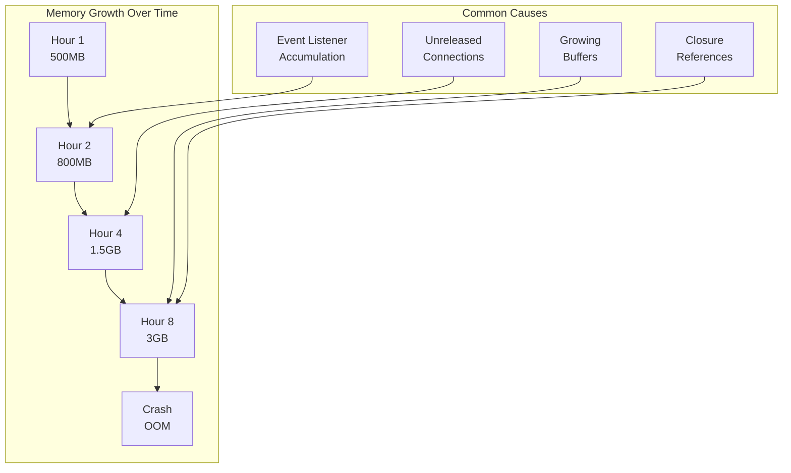
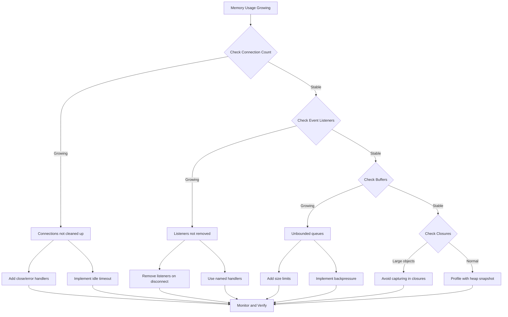

# How to Fix 'Memory Leak' Issues in WebSocket Servers

Author: [nawazdhandala](https://www.github.com/nawazdhandala)

Tags: WebSocket, Memory Leak, Node.js, Performance, Debugging, Monitoring

Description: Learn how to identify, diagnose, and fix memory leaks in WebSocket servers including event listener accumulation, connection tracking issues, and buffer management.

---

Memory leaks in WebSocket servers can silently degrade performance until your application crashes. Unlike traditional HTTP servers, WebSocket connections are long-lived, making memory management more critical. This guide covers common causes of memory leaks and practical solutions to fix them.

## Understanding WebSocket Memory Leaks

WebSocket servers are particularly susceptible to memory leaks because connections persist for extended periods, event listeners accumulate over time, message buffers can grow unbounded, and connection state may not be properly cleaned up.



## Identifying Memory Leaks

### Memory Monitoring Script

```javascript
// memory-monitor.js - Track memory usage over time

const v8 = require('v8');
const process = require('process');

class MemoryMonitor {
    constructor(options = {}) {
        this.interval = options.interval || 30000; // 30 seconds
        this.alertThreshold = options.alertThreshold || 0.8; // 80% of max
        this.history = [];
        this.maxHistory = options.maxHistory || 100;
        this.maxMemory = options.maxMemory || this.getMaxMemory();
    }

    getMaxMemory() {
        const heapStats = v8.getHeapStatistics();
        return heapStats.heap_size_limit;
    }

    getMemoryStats() {
        const heapStats = v8.getHeapStatistics();
        const memUsage = process.memoryUsage();

        return {
            timestamp: Date.now(),
            heapUsed: memUsage.heapUsed,
            heapTotal: memUsage.heapTotal,
            external: memUsage.external,
            arrayBuffers: memUsage.arrayBuffers,
            rss: memUsage.rss,
            heapSizeLimit: heapStats.heap_size_limit,
            mallocedMemory: heapStats.malloced_memory,
            peakMallocedMemory: heapStats.peak_malloced_memory
        };
    }

    formatBytes(bytes) {
        const units = ['B', 'KB', 'MB', 'GB'];
        let unitIndex = 0;
        let size = bytes;

        while (size >= 1024 && unitIndex < units.length - 1) {
            size /= 1024;
            unitIndex++;
        }

        return `${size.toFixed(2)} ${units[unitIndex]}`;
    }

    checkForLeak() {
        if (this.history.length < 10) return null;

        // Calculate growth rate over recent samples
        const recent = this.history.slice(-10);
        const first = recent[0].heapUsed;
        const last = recent[recent.length - 1].heapUsed;
        const timeDiff = recent[recent.length - 1].timestamp - recent[0].timestamp;

        const growthRate = (last - first) / timeDiff; // bytes per ms
        const hourlyGrowth = growthRate * 3600000; // bytes per hour

        if (hourlyGrowth > 100 * 1024 * 1024) { // Growing > 100MB/hour
            return {
                detected: true,
                hourlyGrowth: this.formatBytes(hourlyGrowth),
                estimatedTimeToOOM: Math.floor((this.maxMemory - last) / growthRate / 60000)
            };
        }

        return { detected: false };
    }

    start() {
        console.log('Memory monitoring started');
        console.log(`Max heap size: ${this.formatBytes(this.maxMemory)}`);

        this.intervalId = setInterval(() => {
            const stats = this.getMemoryStats();
            this.history.push(stats);

            // Trim history
            if (this.history.length > this.maxHistory) {
                this.history.shift();
            }

            // Log current stats
            console.log(`Memory: Heap ${this.formatBytes(stats.heapUsed)}/${this.formatBytes(stats.heapTotal)} | RSS ${this.formatBytes(stats.rss)} | External ${this.formatBytes(stats.external)}`);

            // Check for leaks
            const leakCheck = this.checkForLeak();
            if (leakCheck && leakCheck.detected) {
                console.warn(`MEMORY LEAK DETECTED: Growing ${leakCheck.hourlyGrowth}/hour. Estimated OOM in ${leakCheck.estimatedTimeToOOM} minutes.`);
            }

            // Check threshold
            const usageRatio = stats.heapUsed / this.maxMemory;
            if (usageRatio > this.alertThreshold) {
                console.error(`MEMORY ALERT: Usage at ${(usageRatio * 100).toFixed(1)}% of limit`);
            }
        }, this.interval);
    }

    stop() {
        clearInterval(this.intervalId);
    }

    getReport() {
        const current = this.getMemoryStats();
        const leakCheck = this.checkForLeak();

        return {
            current: {
                heapUsed: this.formatBytes(current.heapUsed),
                heapTotal: this.formatBytes(current.heapTotal),
                rss: this.formatBytes(current.rss),
                external: this.formatBytes(current.external)
            },
            limit: this.formatBytes(this.maxMemory),
            usage: ((current.heapUsed / this.maxMemory) * 100).toFixed(2) + '%',
            leakDetection: leakCheck,
            samplesCollected: this.history.length
        };
    }
}

module.exports = MemoryMonitor;
```

### Heap Snapshot Analysis

```javascript
// heap-snapshot.js - Take and analyze heap snapshots

const v8 = require('v8');
const fs = require('fs');
const path = require('path');

class HeapAnalyzer {
    constructor(snapshotDir = './heap-snapshots') {
        this.snapshotDir = snapshotDir;
        this.snapshotCount = 0;

        if (!fs.existsSync(snapshotDir)) {
            fs.mkdirSync(snapshotDir, { recursive: true });
        }
    }

    takeSnapshot(label = '') {
        const timestamp = Date.now();
        const filename = `heap-${timestamp}${label ? '-' + label : ''}.heapsnapshot`;
        const filepath = path.join(this.snapshotDir, filename);

        // Write heap snapshot
        const snapshotStream = v8.writeHeapSnapshot(filepath);

        console.log(`Heap snapshot written to: ${snapshotStream}`);
        this.snapshotCount++;

        return snapshotStream;
    }

    // Schedule periodic snapshots
    scheduleSnapshots(intervalMs = 3600000) { // Default: 1 hour
        setInterval(() => {
            this.takeSnapshot(`periodic-${this.snapshotCount}`);
        }, intervalMs);
    }

    // Take snapshot on memory threshold
    watchMemory(thresholdPercent = 70) {
        const heapStats = v8.getHeapStatistics();
        const threshold = heapStats.heap_size_limit * (thresholdPercent / 100);

        setInterval(() => {
            const current = process.memoryUsage().heapUsed;
            if (current > threshold) {
                console.warn(`Memory threshold exceeded: ${(current / 1024 / 1024).toFixed(2)}MB`);
                this.takeSnapshot('threshold-exceeded');
            }
        }, 60000); // Check every minute
    }
}

module.exports = HeapAnalyzer;
```

## Common Memory Leak Patterns and Fixes

### Leak Pattern 1: Event Listener Accumulation

```javascript
// BAD: Event listeners accumulate on every connection
const WebSocket = require('ws');
const EventEmitter = require('events');

const globalEmitter = new EventEmitter();

// Leaky server
const wss = new WebSocket.Server({ port: 8080 });

wss.on('connection', (ws) => {
    // BAD: This listener is never removed!
    globalEmitter.on('broadcast', (message) => {
        ws.send(message);
    });

    ws.on('close', () => {
        // Listener on globalEmitter is still there!
        console.log('Connection closed');
    });
});
```

```javascript
// GOOD: Properly remove event listeners
const WebSocket = require('ws');
const EventEmitter = require('events');

const globalEmitter = new EventEmitter();
globalEmitter.setMaxListeners(0); // Allow unlimited, but track them

const wss = new WebSocket.Server({ port: 8080 });

wss.on('connection', (ws) => {
    // Create named handler for removal
    const broadcastHandler = (message) => {
        if (ws.readyState === WebSocket.OPEN) {
            ws.send(message);
        }
    };

    globalEmitter.on('broadcast', broadcastHandler);

    ws.on('close', () => {
        // GOOD: Remove the listener on close
        globalEmitter.removeListener('broadcast', broadcastHandler);
        console.log('Connection closed, listener removed');
    });

    ws.on('error', () => {
        // GOOD: Also remove on error
        globalEmitter.removeListener('broadcast', broadcastHandler);
    });
});

// Monitor listener count
setInterval(() => {
    console.log('Broadcast listeners:', globalEmitter.listenerCount('broadcast'));
}, 10000);
```

### Leak Pattern 2: Connection Tracking Map

```javascript
// BAD: Connections never removed from tracking map
class LeakyConnectionManager {
    constructor() {
        this.connections = new Map();
    }

    addConnection(id, socket) {
        this.connections.set(id, {
            socket,
            data: new Array(1000).fill('x'), // Some associated data
            connectedAt: Date.now()
        });
    }

    // Missing removeConnection - connections accumulate!
}
```

```javascript
// GOOD: Proper connection lifecycle management
class ConnectionManager {
    constructor() {
        this.connections = new Map();
        this.cleanupInterval = null;
    }

    addConnection(id, socket) {
        // Clean up any existing connection with same ID
        this.removeConnection(id);

        const connection = {
            socket,
            data: new Array(1000).fill('x'),
            connectedAt: Date.now(),
            lastActivity: Date.now()
        };

        this.connections.set(id, connection);

        // Set up automatic cleanup on socket close
        socket.on('close', () => this.removeConnection(id));
        socket.on('error', () => this.removeConnection(id));

        return connection;
    }

    removeConnection(id) {
        const conn = this.connections.get(id);
        if (conn) {
            // Clear any associated data
            conn.data = null;
            conn.socket = null;

            this.connections.delete(id);
            console.log(`Connection ${id} removed. Active: ${this.connections.size}`);
        }
    }

    // Periodic cleanup of stale connections
    startCleanup(idleTimeout = 300000) {
        this.cleanupInterval = setInterval(() => {
            const now = Date.now();
            let cleaned = 0;

            for (const [id, conn] of this.connections) {
                // Remove if socket is not open
                if (!conn.socket || conn.socket.readyState !== 1) {
                    this.removeConnection(id);
                    cleaned++;
                    continue;
                }

                // Remove if idle too long
                if (now - conn.lastActivity > idleTimeout) {
                    conn.socket.close(1000, 'Idle timeout');
                    this.removeConnection(id);
                    cleaned++;
                }
            }

            if (cleaned > 0) {
                console.log(`Cleanup: removed ${cleaned} stale connections`);
            }
        }, 60000);
    }

    stopCleanup() {
        if (this.cleanupInterval) {
            clearInterval(this.cleanupInterval);
        }
    }

    getStats() {
        return {
            active: this.connections.size,
            memoryEstimate: this.connections.size * 8200 // Rough estimate per connection
        };
    }
}

module.exports = ConnectionManager;
```

### Leak Pattern 3: Message Buffer Growth

```javascript
// BAD: Unbounded message buffer
class LeakyMessageQueue {
    constructor() {
        this.pending = [];
    }

    queue(message) {
        // Messages keep accumulating if not processed
        this.pending.push({
            data: message,
            timestamp: Date.now()
        });
    }
}
```

```javascript
// GOOD: Bounded buffer with backpressure
class BoundedMessageQueue {
    constructor(options = {}) {
        this.maxSize = options.maxSize || 1000;
        this.maxAge = options.maxAge || 60000; // 1 minute
        this.pending = [];
        this.dropped = 0;
    }

    queue(message) {
        // Enforce size limit
        if (this.pending.length >= this.maxSize) {
            // Drop oldest message
            this.pending.shift();
            this.dropped++;
        }

        this.pending.push({
            data: message,
            timestamp: Date.now()
        });
    }

    dequeue() {
        return this.pending.shift();
    }

    // Clean up old messages
    cleanup() {
        const now = Date.now();
        const before = this.pending.length;

        this.pending = this.pending.filter(msg => now - msg.timestamp < this.maxAge);

        const cleaned = before - this.pending.length;
        if (cleaned > 0) {
            this.dropped += cleaned;
            console.log(`Cleaned ${cleaned} expired messages`);
        }
    }

    getStats() {
        return {
            queued: this.pending.length,
            maxSize: this.maxSize,
            totalDropped: this.dropped
        };
    }
}

module.exports = BoundedMessageQueue;
```

### Leak Pattern 4: Closure References

```javascript
// BAD: Closures holding large objects
function createHandler(ws, largeData) {
    // largeData is captured in closure and never released
    return function handleMessage(message) {
        console.log(message, largeData.length);
        ws.send('received');
    };
}

const largeObject = new Array(100000).fill({ data: 'x'.repeat(1000) });

wss.on('connection', (ws) => {
    // Each connection captures a reference to largeObject
    ws.on('message', createHandler(ws, largeObject));
});
```

```javascript
// GOOD: Avoid capturing large objects in closures
function createHandler(ws, dataGetter) {
    return function handleMessage(message) {
        // Get data when needed, don't hold reference
        const data = dataGetter();
        console.log(message, data.length);
        ws.send('received');
    };
}

// Shared data accessed through getter
let sharedData = new Array(100000).fill({ data: 'x'.repeat(1000) });

function getSharedData() {
    return sharedData;
}

wss.on('connection', (ws) => {
    // No large object captured in closure
    const handler = createHandler(ws, getSharedData);
    ws.on('message', handler);

    ws.on('close', () => {
        // Clean up handler reference
        ws.removeAllListeners('message');
    });
});

// Allow data to be garbage collected when needed
function clearSharedData() {
    sharedData = null;
}
```

## Complete Memory-Safe WebSocket Server

```javascript
// server-memory-safe.js - Production WebSocket server with memory leak prevention

const WebSocket = require('ws');
const http = require('http');
const MemoryMonitor = require('./memory-monitor');
const HeapAnalyzer = require('./heap-snapshot');

class MemorySafeWebSocketServer {
    constructor(options = {}) {
        this.port = options.port || 8080;
        this.maxConnections = options.maxConnections || 10000;
        this.idleTimeout = options.idleTimeout || 300000;
        this.messageBufferLimit = options.messageBufferLimit || 100;

        this.connections = new Map();
        this.rooms = new Map();
        this.memoryMonitor = new MemoryMonitor({ interval: 30000 });
        this.heapAnalyzer = new HeapAnalyzer();

        this.server = null;
        this.wss = null;
    }

    start() {
        this.server = http.createServer();
        this.wss = new WebSocket.Server({
            server: this.server,
            maxPayload: 1024 * 1024, // 1MB max message
            perMessageDeflate: false,
            clientTracking: false // We do our own tracking
        });

        this.setupHandlers();
        this.startCleanupTasks();
        this.memoryMonitor.start();

        this.server.listen(this.port, () => {
            console.log(`Memory-safe WebSocket server running on port ${this.port}`);
        });
    }

    setupHandlers() {
        this.wss.on('connection', (ws, req) => {
            this.handleConnection(ws, req);
        });

        this.wss.on('error', (error) => {
            console.error('WebSocket server error:', error);
        });
    }

    handleConnection(ws, req) {
        // Check connection limit
        if (this.connections.size >= this.maxConnections) {
            ws.close(1013, 'Server at capacity');
            return;
        }

        const connectionId = this.generateId();
        const connection = {
            id: connectionId,
            ws: ws,
            ip: req.headers['x-forwarded-for']?.split(',')[0] || req.socket.remoteAddress,
            connectedAt: Date.now(),
            lastActivity: Date.now(),
            messageCount: 0,
            rooms: new Set(),
            pendingMessages: []
        };

        this.connections.set(connectionId, connection);
        ws._connectionId = connectionId;

        // Set up ping/pong for connection health
        ws.isAlive = true;
        ws.on('pong', () => {
            ws.isAlive = true;
            const conn = this.connections.get(connectionId);
            if (conn) conn.lastActivity = Date.now();
        });

        // Message handler
        ws.on('message', (data) => {
            this.handleMessage(connectionId, data);
        });

        // Clean up on close - CRITICAL for preventing leaks
        ws.on('close', () => {
            this.cleanupConnection(connectionId);
        });

        // Clean up on error
        ws.on('error', (error) => {
            console.error(`Connection ${connectionId} error:`, error.message);
            this.cleanupConnection(connectionId);
        });

        console.log(`Connection ${connectionId} established. Total: ${this.connections.size}`);
    }

    handleMessage(connectionId, data) {
        const connection = this.connections.get(connectionId);
        if (!connection) return;

        connection.lastActivity = Date.now();
        connection.messageCount++;

        try {
            const message = JSON.parse(data);
            this.routeMessage(connectionId, message);
        } catch (e) {
            connection.ws.send(JSON.stringify({ error: 'Invalid JSON' }));
        }
    }

    routeMessage(connectionId, message) {
        const connection = this.connections.get(connectionId);
        if (!connection) return;

        switch (message.type) {
            case 'join':
                this.joinRoom(connectionId, message.room);
                break;

            case 'leave':
                this.leaveRoom(connectionId, message.room);
                break;

            case 'room-message':
                this.sendToRoom(message.room, {
                    type: 'message',
                    from: connectionId,
                    content: message.content
                }, connectionId);
                break;

            case 'ping':
                connection.ws.send(JSON.stringify({ type: 'pong' }));
                break;

            default:
                connection.ws.send(JSON.stringify({ type: 'echo', data: message }));
        }
    }

    joinRoom(connectionId, roomName) {
        const connection = this.connections.get(connectionId);
        if (!connection) return;

        if (!this.rooms.has(roomName)) {
            this.rooms.set(roomName, new Set());
        }

        this.rooms.get(roomName).add(connectionId);
        connection.rooms.add(roomName);
    }

    leaveRoom(connectionId, roomName) {
        const connection = this.connections.get(connectionId);
        if (connection) {
            connection.rooms.delete(roomName);
        }

        const room = this.rooms.get(roomName);
        if (room) {
            room.delete(connectionId);
            // Clean up empty rooms
            if (room.size === 0) {
                this.rooms.delete(roomName);
            }
        }
    }

    sendToRoom(roomName, message, excludeConnection = null) {
        const room = this.rooms.get(roomName);
        if (!room) return;

        const messageStr = JSON.stringify(message);

        for (const connectionId of room) {
            if (connectionId === excludeConnection) continue;

            const connection = this.connections.get(connectionId);
            if (connection && connection.ws.readyState === WebSocket.OPEN) {
                connection.ws.send(messageStr);
            }
        }
    }

    cleanupConnection(connectionId) {
        const connection = this.connections.get(connectionId);
        if (!connection) return;

        // Leave all rooms
        for (const roomName of connection.rooms) {
            this.leaveRoom(connectionId, roomName);
        }

        // Clear references
        connection.rooms.clear();
        connection.pendingMessages = [];
        connection.ws = null;

        // Remove from connections map
        this.connections.delete(connectionId);

        console.log(`Connection ${connectionId} cleaned up. Remaining: ${this.connections.size}`);
    }

    startCleanupTasks() {
        // Ping/pong health check
        setInterval(() => {
            for (const [id, connection] of this.connections) {
                if (!connection.ws.isAlive) {
                    console.log(`Connection ${id} failed health check`);
                    connection.ws.terminate();
                    this.cleanupConnection(id);
                    continue;
                }

                connection.ws.isAlive = false;
                connection.ws.ping();
            }
        }, 30000);

        // Idle timeout check
        setInterval(() => {
            const now = Date.now();
            for (const [id, connection] of this.connections) {
                if (now - connection.lastActivity > this.idleTimeout) {
                    console.log(`Connection ${id} idle timeout`);
                    connection.ws.close(1000, 'Idle timeout');
                    this.cleanupConnection(id);
                }
            }
        }, 60000);

        // Memory pressure check
        setInterval(() => {
            const memUsage = process.memoryUsage();
            const heapUsedMB = memUsage.heapUsed / 1024 / 1024;

            if (heapUsedMB > 1000) { // Over 1GB
                console.warn('High memory pressure, taking heap snapshot');
                this.heapAnalyzer.takeSnapshot('high-memory');

                // Force GC if available
                if (global.gc) {
                    global.gc();
                }
            }
        }, 60000);
    }

    generateId() {
        return `${Date.now()}-${Math.random().toString(36).substr(2, 9)}`;
    }

    getStats() {
        return {
            connections: this.connections.size,
            rooms: this.rooms.size,
            memory: this.memoryMonitor.getReport()
        };
    }

    shutdown() {
        console.log('Shutting down server...');

        // Close all connections
        for (const [id, connection] of this.connections) {
            if (connection.ws) {
                connection.ws.close(1001, 'Server shutdown');
            }
            this.cleanupConnection(id);
        }

        this.memoryMonitor.stop();
        this.wss.close();
        this.server.close();
    }
}

// Start server
const server = new MemorySafeWebSocketServer({
    port: process.env.PORT || 8080,
    maxConnections: 10000,
    idleTimeout: 300000
});

server.start();

// Expose stats endpoint
const express = require('express');
const statsApp = express();
statsApp.get('/stats', (req, res) => {
    res.json(server.getStats());
});
statsApp.listen(8081);

// Graceful shutdown
process.on('SIGTERM', () => server.shutdown());
process.on('SIGINT', () => server.shutdown());

// Enable manual GC for memory debugging
// Run node with --expose-gc flag
```

## Memory Leak Detection Flow



## Monitoring Checklist

| Metric | Warning Threshold | Critical Threshold |
|--------|------------------|-------------------|
| Heap Used | 70% of limit | 85% of limit |
| Growth Rate | 50MB/hour | 100MB/hour |
| Event Listeners | 2x connections | 5x connections |
| Connection Count | 80% of max | 95% of max |
| GC Frequency | >10/minute | >30/minute |

## Conclusion

Memory leaks in WebSocket servers are preventable with proper patterns and monitoring. The key practices include always removing event listeners when connections close, properly cleaning up connection state and associated data, using bounded buffers with backpressure, avoiding capturing large objects in closures, implementing idle timeouts to clean up stale connections, and monitoring memory usage continuously with automated alerting. By following these patterns and using the monitoring tools provided, you can build WebSocket servers that run reliably for extended periods without memory degradation.
