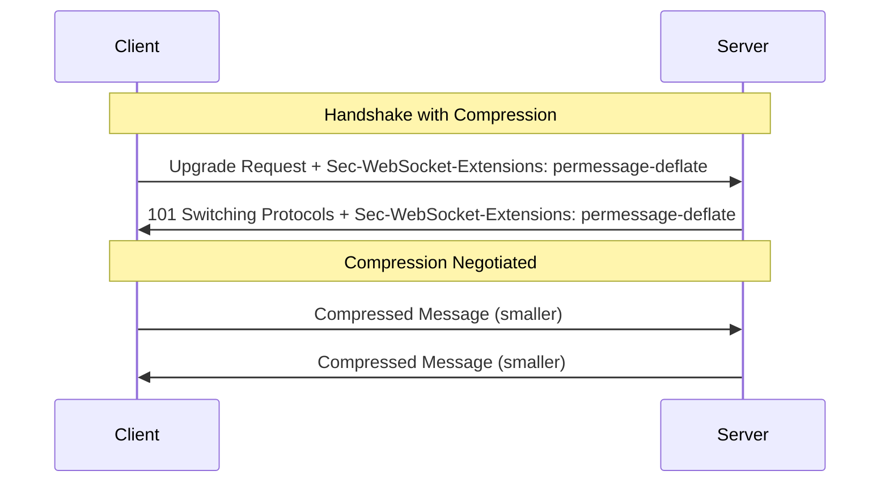

# How to Configure WebSocket Message Compression

Author: [nawazdhandala](https://www.github.com/nawazdhandala)

Tags: WebSocket, Compression, Performance, Node.js, Networking, Optimization

Description: A practical guide to configuring WebSocket message compression using permessage-deflate extension, including server and client setup, performance tuning, and troubleshooting compression issues.

---

WebSocket message compression reduces bandwidth usage by compressing messages before transmission. The permessage-deflate extension is the standard compression method for WebSocket connections. Proper configuration can significantly reduce data transfer, especially for text-heavy applications.

## Understanding WebSocket Compression

The permessage-deflate extension compresses each WebSocket message using the DEFLATE algorithm. Compression is negotiated during the WebSocket handshake.



## Server-Side Configuration

### Node.js with ws Library

The ws library supports permessage-deflate out of the box.

```javascript
// server-compression.js
const WebSocket = require('ws');

const wss = new WebSocket.Server({
  port: 8080,
  // Enable compression
  perMessageDeflate: {
    // Compression level (1-9, higher = more compression but slower)
    zlibDeflateOptions: {
      level: 6
    },
    zlibInflateOptions: {
      chunkSize: 10 * 1024
    },
    // Threshold for message size to compress (bytes)
    threshold: 1024,
    // Maximum server window bits
    serverMaxWindowBits: 15,
    // Maximum client window bits
    clientMaxWindowBits: 15,
    // Do not compress if adding compression header makes message larger
    serverNoContextTakeover: false,
    clientNoContextTakeover: false,
    // Concurrent compression limit to prevent memory issues
    concurrencyLimit: 10
  }
});

wss.on('connection', (ws, req) => {
  // Check if compression was negotiated
  const extensions = req.headers['sec-websocket-extensions'];
  console.log('Negotiated extensions:', extensions);

  ws.on('message', (data, isBinary) => {
    console.log(`Received ${data.length} bytes`);

    // Echo back with same binary flag
    ws.send(data, { binary: isBinary });
  });
});

console.log('WebSocket server with compression running on port 8080');
```

### Compression Options Explained

```javascript
// compression-options.js
const compressionOptions = {
  // zlibDeflateOptions: Options passed to zlib.createDeflateRaw()
  zlibDeflateOptions: {
    // Compression level: 1 (fastest) to 9 (best compression)
    level: 6,
    // Memory usage: 1-9, higher uses more memory for better compression
    memLevel: 8,
    // Compression strategy
    // Z_DEFAULT_STRATEGY, Z_FILTERED, Z_HUFFMAN_ONLY, Z_RLE, Z_FIXED
    strategy: 0
  },

  // zlibInflateOptions: Options passed to zlib.createInflateRaw()
  zlibInflateOptions: {
    // Size of internal buffer for decompression
    chunkSize: 16 * 1024
  },

  // Only compress messages larger than this size (bytes)
  threshold: 1024,

  // Window bits control compression dictionary size
  // Higher = better compression but more memory
  // Range: 8-15, default 15
  serverMaxWindowBits: 15,
  clientMaxWindowBits: 15,

  // Context takeover: reuse compression context between messages
  // false = reset context for each message (less memory, worse compression)
  // true = maintain context (more memory, better compression for similar messages)
  serverNoContextTakeover: false,
  clientNoContextTakeover: false,

  // Limit concurrent compression operations
  // Prevents memory exhaustion under high load
  concurrencyLimit: 10
};
```

### Adaptive Compression Based on Message Type

```javascript
// adaptive-compression.js
const WebSocket = require('ws');
const zlib = require('zlib');

// Custom compression for different message types
class AdaptiveCompressionServer {
  constructor(port) {
    this.wss = new WebSocket.Server({
      port,
      // Disable built-in compression
      perMessageDeflate: false
    });

    this.setupServer();
  }

  setupServer() {
    this.wss.on('connection', (ws) => {
      ws.on('message', (data) => {
        this.handleMessage(ws, data);
      });
    });
  }

  handleMessage(ws, data) {
    try {
      const message = JSON.parse(data);
      // Process message
      this.sendMessage(ws, { type: 'response', data: message });
    } catch (error) {
      ws.send(data);  // Echo raw if not JSON
    }
  }

  sendMessage(ws, message) {
    const data = JSON.stringify(message);

    // Only compress large messages
    if (data.length > 1024) {
      this.sendCompressed(ws, data);
    } else {
      ws.send(data);
    }
  }

  sendCompressed(ws, data) {
    zlib.deflate(data, { level: 6 }, (err, compressed) => {
      if (err) {
        ws.send(data);  // Send uncompressed on error
        return;
      }

      // Add compression indicator
      const header = Buffer.from([0x01]);  // 0x01 = compressed
      const message = Buffer.concat([header, compressed]);

      ws.send(message, { binary: true });
    });
  }
}
```

## Client-Side Configuration

### Browser Client

Browsers automatically negotiate compression when the server supports it.

```javascript
// browser-client.js
class CompressedWebSocketClient {
  constructor(url) {
    this.url = url;
    this.ws = null;
    this.compressionSupported = false;
  }

  connect() {
    return new Promise((resolve, reject) => {
      // Browsers automatically negotiate permessage-deflate
      this.ws = new WebSocket(this.url);

      this.ws.onopen = () => {
        // Check if compression is active (not directly accessible in browsers)
        console.log('WebSocket connected');
        resolve(this.ws);
      };

      this.ws.onerror = (error) => {
        reject(error);
      };

      this.ws.onmessage = (event) => {
        // Messages are automatically decompressed
        this.handleMessage(event.data);
      };
    });
  }

  handleMessage(data) {
    // Process received message
    console.log('Received:', typeof data === 'string' ? data.length : data.byteLength, 'bytes');
  }

  // Manual compression for additional savings
  async sendCompressed(data) {
    const encoder = new TextEncoder();
    const stream = new CompressionStream('deflate');
    const writer = stream.writable.getWriter();

    writer.write(encoder.encode(JSON.stringify(data)));
    writer.close();

    const reader = stream.readable.getReader();
    const chunks = [];

    while (true) {
      const { done, value } = await reader.read();
      if (done) break;
      chunks.push(value);
    }

    const compressed = new Blob(chunks);
    const buffer = await compressed.arrayBuffer();

    this.ws.send(buffer);
  }

  send(data) {
    this.ws.send(JSON.stringify(data));
  }
}
```

### Node.js Client with Compression

```javascript
// node-client-compression.js
const WebSocket = require('ws');

function createCompressedClient(url) {
  const ws = new WebSocket(url, {
    // Enable compression on client side
    perMessageDeflate: {
      zlibDeflateOptions: {
        level: 6
      },
      clientMaxWindowBits: 15,
      serverMaxWindowBits: 15,
      clientNoContextTakeover: false,
      serverNoContextTakeover: false,
      threshold: 1024
    }
  });

  ws.on('open', () => {
    console.log('Connected with compression enabled');

    // Send test message
    const largeMessage = {
      type: 'test',
      data: 'A'.repeat(10000)  // Large message will be compressed
    };

    ws.send(JSON.stringify(largeMessage));
  });

  ws.on('message', (data) => {
    console.log(`Received ${data.length} bytes (already decompressed)`);
  });

  return ws;
}

const client = createCompressedClient('ws://localhost:8080');
```

## Compression Performance Tuning

### Measuring Compression Effectiveness

```javascript
// compression-metrics.js
const WebSocket = require('ws');
const zlib = require('zlib');

class CompressionMetrics {
  constructor() {
    this.stats = {
      messagesSent: 0,
      messagesReceived: 0,
      bytesSentUncompressed: 0,
      bytesSentCompressed: 0,
      bytesReceivedUncompressed: 0,
      bytesReceivedCompressed: 0
    };
  }

  measureCompression(data) {
    const uncompressedSize = Buffer.byteLength(data);

    return new Promise((resolve, reject) => {
      zlib.deflate(data, { level: 6 }, (err, compressed) => {
        if (err) {
          reject(err);
          return;
        }

        const compressedSize = compressed.length;
        const ratio = (1 - compressedSize / uncompressedSize) * 100;

        resolve({
          uncompressedSize,
          compressedSize,
          ratio: ratio.toFixed(2) + '%',
          worthCompressing: compressedSize < uncompressedSize
        });
      });
    });
  }

  logStats() {
    const sentRatio = this.stats.bytesSentUncompressed > 0
      ? (1 - this.stats.bytesSentCompressed / this.stats.bytesSentUncompressed) * 100
      : 0;

    const receivedRatio = this.stats.bytesReceivedUncompressed > 0
      ? (1 - this.stats.bytesReceivedCompressed / this.stats.bytesReceivedUncompressed) * 100
      : 0;

    console.log('Compression Statistics:');
    console.log(`  Messages sent: ${this.stats.messagesSent}`);
    console.log(`  Messages received: ${this.stats.messagesReceived}`);
    console.log(`  Sent: ${this.stats.bytesSentUncompressed} -> ${this.stats.bytesSentCompressed} (${sentRatio.toFixed(2)}% reduction)`);
    console.log(`  Received: ${this.stats.bytesReceivedUncompressed} -> ${this.stats.bytesReceivedCompressed} (${receivedRatio.toFixed(2)}% reduction)`);
  }
}

// Usage
const metrics = new CompressionMetrics();

// Test different data types
async function testCompression() {
  const testData = {
    json: JSON.stringify({ users: Array(100).fill({ name: 'Test User', email: 'test@example.com' }) }),
    text: 'Lorem ipsum '.repeat(500),
    binary: Buffer.from(Array(5000).fill(0).map(() => Math.floor(Math.random() * 256))),
    alreadyCompressed: await compressData('Test data')
  };

  for (const [type, data] of Object.entries(testData)) {
    const result = await metrics.measureCompression(data);
    console.log(`${type}: ${result.uncompressedSize} -> ${result.compressedSize} (${result.ratio})`);
  }
}

async function compressData(data) {
  return new Promise((resolve, reject) => {
    zlib.deflate(data, (err, result) => {
      if (err) reject(err);
      else resolve(result);
    });
  });
}

testCompression();
```

### Compression Level Benchmarks

```javascript
// compression-benchmark.js
const zlib = require('zlib');
const { performance } = require('perf_hooks');

async function benchmarkCompressionLevels(data) {
  console.log(`Benchmarking compression for ${Buffer.byteLength(data)} bytes`);
  console.log('Level | Compressed Size | Ratio    | Time (ms)');
  console.log('------|-----------------|----------|----------');

  for (let level = 1; level <= 9; level++) {
    const start = performance.now();

    const compressed = await new Promise((resolve, reject) => {
      zlib.deflate(data, { level }, (err, result) => {
        if (err) reject(err);
        else resolve(result);
      });
    });

    const time = performance.now() - start;
    const ratio = ((1 - compressed.length / Buffer.byteLength(data)) * 100).toFixed(2);

    console.log(`  ${level}   | ${String(compressed.length).padEnd(15)} | ${ratio.padEnd(8)}% | ${time.toFixed(2)}`);
  }
}

// Test with realistic data
const testMessage = JSON.stringify({
  type: 'update',
  timestamp: Date.now(),
  payload: {
    users: Array(50).fill(null).map((_, i) => ({
      id: i,
      name: `User ${i}`,
      email: `user${i}@example.com`,
      status: 'active',
      lastSeen: new Date().toISOString()
    }))
  }
});

benchmarkCompressionLevels(testMessage);
```

## Handling Compression Issues

### Proxy Configuration

Some proxies interfere with WebSocket compression.

```nginx
# NGINX configuration for WebSocket with compression passthrough
upstream websocket_backend {
    server 127.0.0.1:8080;
}

server {
    listen 80;
    server_name ws.example.com;

    location /ws {
        proxy_pass http://websocket_backend;
        proxy_http_version 1.1;
        proxy_set_header Upgrade $http_upgrade;
        proxy_set_header Connection "upgrade";
        proxy_set_header Host $host;

        # Pass through Sec-WebSocket-Extensions header for compression negotiation
        proxy_set_header Sec-WebSocket-Extensions $http_sec_websocket_extensions;

        # Disable NGINX compression for WebSocket (already handled by protocol)
        proxy_buffering off;
    }
}
```

### Fallback for Compression Failures

```javascript
// compression-fallback.js
const WebSocket = require('ws');

function createServerWithFallback(port) {
  // Try to create server with compression
  try {
    const wss = new WebSocket.Server({
      port,
      perMessageDeflate: {
        zlibDeflateOptions: { level: 6 },
        threshold: 1024
      }
    });

    wss.on('connection', (ws, req) => {
      const extensions = req.headers['sec-websocket-extensions'] || '';
      const hasCompression = extensions.includes('permessage-deflate');

      console.log(`Client connected, compression: ${hasCompression}`);

      ws.compressionEnabled = hasCompression;

      ws.on('message', (data) => {
        // Handle message
      });
    });

    return wss;
  } catch (error) {
    console.warn('Compression not available, starting without compression');

    return new WebSocket.Server({ port });
  }
}
```

### Memory Management

Compression uses memory. Configure limits for high-traffic servers.

```javascript
// memory-safe-compression.js
const WebSocket = require('ws');
const v8 = require('v8');

function createMemorySafeServer(port) {
  const wss = new WebSocket.Server({
    port,
    perMessageDeflate: {
      // Lower memory settings
      zlibDeflateOptions: {
        level: 4,  // Lower compression level
        memLevel: 4  // Lower memory usage
      },
      // Disable context takeover to reduce memory per connection
      serverNoContextTakeover: true,
      clientNoContextTakeover: true,
      // Lower window bits
      serverMaxWindowBits: 12,
      clientMaxWindowBits: 12,
      // Limit concurrent compression operations
      concurrencyLimit: 5,
      // Higher threshold to compress fewer messages
      threshold: 2048
    },
    // Connection limits
    maxPayload: 1024 * 1024,  // 1MB max message size
    clientTracking: true
  });

  // Monitor memory usage
  setInterval(() => {
    const heapStats = v8.getHeapStatistics();
    const usedMB = heapStats.used_heap_size / 1024 / 1024;
    const totalMB = heapStats.total_heap_size / 1024 / 1024;

    console.log(`Memory: ${usedMB.toFixed(2)}MB / ${totalMB.toFixed(2)}MB | Connections: ${wss.clients.size}`);

    // Disable compression if memory is high
    if (usedMB > 500) {
      console.warn('High memory usage, consider reducing connections');
    }
  }, 30000);

  return wss;
}
```

## Best Practices

1. **Set appropriate threshold**: Only compress messages larger than 1KB to avoid overhead for small messages

2. **Choose compression level wisely**: Level 6 offers good balance between speed and compression ratio

3. **Consider context takeover**: Enable for similar repeated messages, disable for diverse message content

4. **Monitor memory usage**: Compression uses memory, especially with many concurrent connections

5. **Test with real data**: Compression effectiveness varies greatly by data type

6. **Handle fallback gracefully**: Some clients or proxies may not support compression

7. **Measure actual savings**: Use metrics to verify compression is providing benefits

WebSocket compression can reduce bandwidth by 50-90% for text data. Configure it based on your message characteristics and monitor the impact on both bandwidth and server resources.
