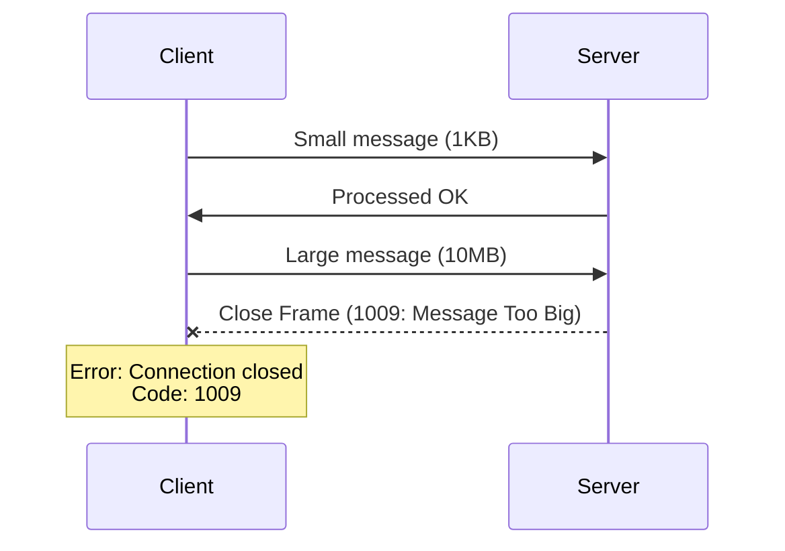
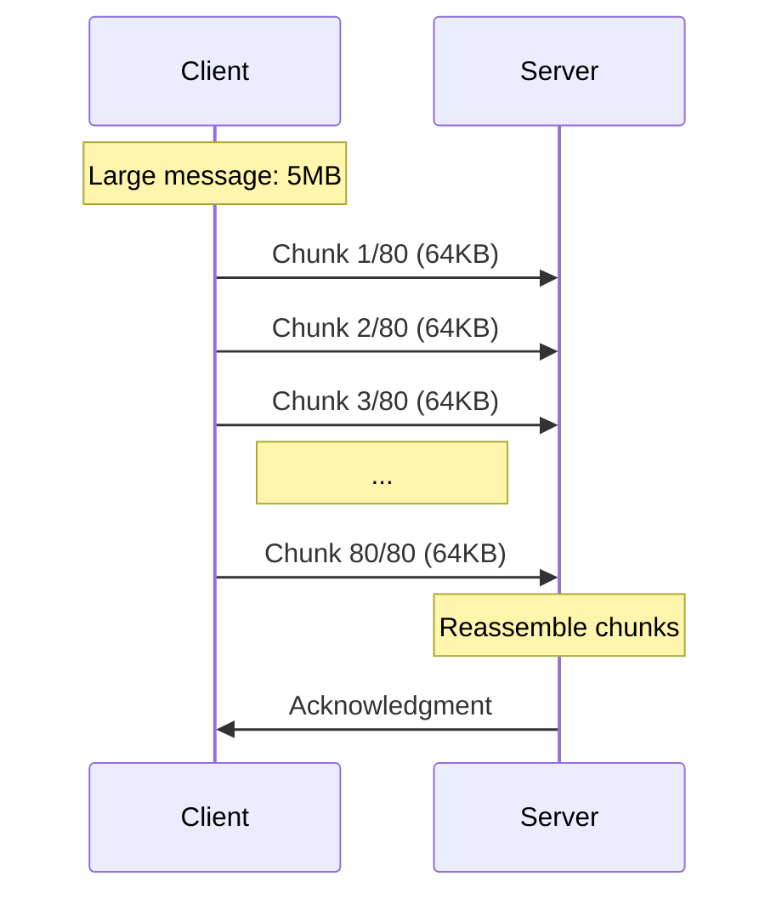

# How to Fix 'Message Too Big' WebSocket Errors

Author: [nawazdhandala](https://www.github.com/nawazdhandala)

Tags: WebSocket, Debugging, Performance, JavaScript, Networking

Description: Learn how to diagnose and fix WebSocket 'Message Too Big' errors by configuring message size limits, implementing chunking, and optimizing payload size.

---

The "Message Too Big" error (close code 1009) occurs when a WebSocket message exceeds the maximum allowed size configured on the server or proxy. This is a deliberate protection against memory exhaustion attacks. This guide covers diagnosing the issue and implementing solutions.

## Understanding the Message Size Limit

WebSocket servers impose message size limits to prevent denial-of-service attacks where a malicious client sends extremely large messages to exhaust server memory.



## Common Size Limits

| Component | Default Limit | Configuration |
|-----------|---------------|---------------|
| ws (Node.js) | 100 MB | maxPayload option |
| Socket.io | 1 MB | maxHttpBufferSize |
| Nginx | 1 MB | client_max_body_size |
| Apache | No default | ProxyTimeout |
| Cloudflare | 100 MB | Enterprise only |

## Server-Side Configuration

### Node.js ws Library

```javascript
// server.js
// Configure message size limit in ws library

const WebSocket = require('ws');

const wss = new WebSocket.Server({
  port: 8080,
  // Maximum message size in bytes
  maxPayload: 10 * 1024 * 1024, // 10 MB (default is 100 MB)
});

wss.on('connection', (ws) => {
  ws.on('message', (message) => {
    console.log(`Received message of ${message.length} bytes`);
    // Process message
  });

  ws.on('error', (error) => {
    if (error.message.includes('Max payload size exceeded')) {
      console.error('Client sent message exceeding size limit');
    }
  });
});
```

### Socket.io

```javascript
// server.js
// Configure message size limit in Socket.io

const { Server } = require('socket.io');

const io = new Server(httpServer, {
  // Maximum HTTP buffer size (affects initial handshake and polling fallback)
  maxHttpBufferSize: 5 * 1024 * 1024, // 5 MB

  // Per-message options
  perMessageDeflate: {
    // Enable compression to reduce message size
    threshold: 1024, // Compress messages larger than 1KB
  },
});

io.on('connection', (socket) => {
  socket.on('large-data', (data) => {
    console.log(`Received ${JSON.stringify(data).length} bytes`);
  });
});
```

### Express with express-ws

```javascript
// server.js
// Configure with express-ws

const express = require('express');
const expressWs = require('express-ws');

const app = express();
const wsInstance = expressWs(app, null, {
  wsOptions: {
    maxPayload: 10 * 1024 * 1024, // 10 MB
  },
});

app.ws('/ws', (ws, req) => {
  ws.on('message', (msg) => {
    console.log('Received:', msg.length, 'bytes');
  });
});

app.listen(8080);
```

## Proxy Configuration

### Nginx

```nginx
# nginx.conf
# Configure message size limits for WebSocket proxy

http {
    # Maximum size of request body (affects WebSocket messages)
    client_max_body_size 10m;

    # Buffer sizes for proxied content
    proxy_buffer_size 16k;
    proxy_buffers 4 32k;
    proxy_busy_buffers_size 64k;

    server {
        listen 443 ssl;
        server_name ws.example.com;

        location /ws {
            proxy_pass http://websocket_backend;

            proxy_http_version 1.1;
            proxy_set_header Upgrade $http_upgrade;
            proxy_set_header Connection "upgrade";

            # Increase buffer sizes for large WebSocket messages
            proxy_buffer_size 64k;
            proxy_buffers 8 64k;

            # Disable buffering for real-time WebSocket
            proxy_buffering off;
        }
    }
}
```

### HAProxy

```haproxy
# haproxy.cfg
# Configure WebSocket message handling

frontend websocket_frontend
    bind *:443 ssl crt /etc/ssl/certs/cert.pem

    # Increase maximum message size
    tune.bufsize 65536

    default_backend websocket_backend

backend websocket_backend
    # Increase timeouts for WebSocket
    timeout client 86400s
    timeout server 86400s
    timeout tunnel 86400s

    server ws1 10.0.0.1:8080 check
```

## Client-Side Handling

### Detecting Message Size Errors

```javascript
// client.js
// Handle message size errors on the client

const socket = new WebSocket('wss://api.example.com/ws');

socket.onclose = (event) => {
  if (event.code === 1009) {
    console.error('Message too big - server rejected the message');
    console.error('Reason:', event.reason);

    // Notify user
    showError('The data you tried to send is too large. Please reduce the size.');
  }
};

// Check message size before sending
function safeSend(data) {
  const message = typeof data === 'string' ? data : JSON.stringify(data);
  const sizeInBytes = new Blob([message]).size;

  // Check against known server limit (5 MB in this example)
  const MAX_SIZE = 5 * 1024 * 1024;

  if (sizeInBytes > MAX_SIZE) {
    console.error(`Message size (${sizeInBytes} bytes) exceeds limit (${MAX_SIZE} bytes)`);
    throw new Error('Message too large to send');
  }

  socket.send(message);
}
```

## Implementing Message Chunking

For large data that must be transferred, split it into smaller chunks.

```javascript
// chunked-sender.js
// Client-side chunking for large messages

class ChunkedWebSocket {
  constructor(url) {
    this.socket = new WebSocket(url);
    this.chunkSize = 64 * 1024; // 64 KB chunks
    this.pendingChunks = new Map();

    this.socket.onmessage = (event) => {
      this.handleMessage(JSON.parse(event.data));
    };
  }

  // Send large data as chunks
  sendLarge(data) {
    const messageId = this.generateId();
    const json = JSON.stringify(data);
    const totalChunks = Math.ceil(json.length / this.chunkSize);

    console.log(`Sending ${json.length} bytes in ${totalChunks} chunks`);

    for (let i = 0; i < totalChunks; i++) {
      const start = i * this.chunkSize;
      const end = Math.min(start + this.chunkSize, json.length);
      const chunk = json.slice(start, end);

      this.socket.send(JSON.stringify({
        type: 'chunk',
        messageId: messageId,
        chunkIndex: i,
        totalChunks: totalChunks,
        data: chunk,
      }));
    }

    return messageId;
  }

  // Handle incoming chunked messages
  handleMessage(message) {
    if (message.type !== 'chunk') {
      // Regular message
      if (this.onmessage) {
        this.onmessage(message);
      }
      return;
    }

    // Chunked message
    const { messageId, chunkIndex, totalChunks, data } = message;

    if (!this.pendingChunks.has(messageId)) {
      this.pendingChunks.set(messageId, {
        chunks: new Array(totalChunks),
        received: 0,
        totalChunks: totalChunks,
      });
    }

    const pending = this.pendingChunks.get(messageId);
    pending.chunks[chunkIndex] = data;
    pending.received++;

    console.log(`Chunk ${chunkIndex + 1}/${totalChunks} for message ${messageId}`);

    // Check if all chunks received
    if (pending.received === pending.totalChunks) {
      const fullData = pending.chunks.join('');
      this.pendingChunks.delete(messageId);

      try {
        const parsed = JSON.parse(fullData);
        if (this.onmessage) {
          this.onmessage(parsed);
        }
      } catch (error) {
        console.error('Failed to parse reassembled message:', error);
      }
    }
  }

  generateId() {
    return Math.random().toString(36).substring(2) + Date.now().toString(36);
  }
}

// Usage
const ws = new ChunkedWebSocket('wss://api.example.com/ws');

ws.onmessage = (data) => {
  console.log('Received complete message:', data);
};

// Send large data
const largeData = { items: new Array(100000).fill({ name: 'item', value: 123 }) };
ws.sendLarge(largeData);
```

```javascript
// chunked-receiver.js
// Server-side chunk handling

const WebSocket = require('ws');

const wss = new WebSocket.Server({
  port: 8080,
  maxPayload: 256 * 1024, // 256 KB per chunk
});

// Store pending chunked messages per client
const pendingMessages = new Map();

wss.on('connection', (ws) => {
  const clientChunks = new Map();
  pendingMessages.set(ws, clientChunks);

  ws.on('message', (raw) => {
    const message = JSON.parse(raw);

    if (message.type === 'chunk') {
      handleChunk(ws, clientChunks, message);
    } else {
      // Regular message
      handleMessage(ws, message);
    }
  });

  ws.on('close', () => {
    pendingMessages.delete(ws);
  });
});

function handleChunk(ws, clientChunks, chunk) {
  const { messageId, chunkIndex, totalChunks, data } = chunk;

  if (!clientChunks.has(messageId)) {
    clientChunks.set(messageId, {
      chunks: new Array(totalChunks),
      received: 0,
      totalChunks: totalChunks,
      startTime: Date.now(),
    });

    // Set timeout to clean up incomplete messages
    setTimeout(() => {
      if (clientChunks.has(messageId)) {
        console.log(`Cleaning up incomplete message ${messageId}`);
        clientChunks.delete(messageId);
      }
    }, 60000); // 1 minute timeout
  }

  const pending = clientChunks.get(messageId);

  // Validate chunk
  if (chunkIndex >= totalChunks || chunkIndex < 0) {
    console.error('Invalid chunk index');
    return;
  }

  pending.chunks[chunkIndex] = data;
  pending.received++;

  // Check if complete
  if (pending.received === pending.totalChunks) {
    const fullData = pending.chunks.join('');
    clientChunks.delete(messageId);

    const duration = Date.now() - pending.startTime;
    console.log(`Reassembled ${fullData.length} bytes in ${duration}ms`);

    try {
      const parsed = JSON.parse(fullData);
      handleMessage(ws, parsed);
    } catch (error) {
      console.error('Failed to parse reassembled message:', error);
    }
  }
}

function handleMessage(ws, message) {
  console.log('Processing complete message');
  // Your message handling logic
}
```



## Using Compression

Enable WebSocket compression to reduce message sizes.

```javascript
// server.js
// Enable per-message deflate compression

const WebSocket = require('ws');

const wss = new WebSocket.Server({
  port: 8080,
  perMessageDeflate: {
    // Enable compression for messages larger than 1KB
    threshold: 1024,

    // Compression level (1-9, higher = more compression but slower)
    zlibDeflateOptions: {
      level: 6,
    },

    // Server can compress messages
    serverNoContextTakeover: true,

    // Client can compress messages
    clientNoContextTakeover: true,

    // Maximum window bits (memory usage)
    serverMaxWindowBits: 15,
    clientMaxWindowBits: 15,
  },
});

wss.on('connection', (ws) => {
  console.log('Client connected, compression:', ws._receiver._extensions);

  ws.on('message', (message, isBinary) => {
    console.log(`Received: ${message.length} bytes (binary: ${isBinary})`);
  });
});
```

```javascript
// client.js
// Browser WebSocket automatically negotiates compression
// No special client-side code needed

const socket = new WebSocket('wss://api.example.com/ws');

socket.onopen = () => {
  // Browser automatically uses compression if server supports it
  const largeData = JSON.stringify({ items: generateLargeArray() });
  socket.send(largeData); // Will be compressed automatically
};
```

## Binary Data for Efficiency

Use binary formats instead of JSON for large data.

```javascript
// binary-protocol.js
// Using binary data to reduce message size

// Server
const WebSocket = require('ws');

const wss = new WebSocket.Server({ port: 8080 });

wss.on('connection', (ws) => {
  ws.on('message', (message, isBinary) => {
    if (isBinary) {
      // Parse binary data
      const view = new DataView(message.buffer);
      const messageType = view.getUint8(0);
      const count = view.getUint32(1, true); // little-endian

      console.log(`Binary message type ${messageType} with ${count} items`);

      // Read float array
      const items = [];
      for (let i = 0; i < count; i++) {
        items.push(view.getFloat32(5 + i * 4, true));
      }

      // Process items...
    } else {
      // JSON message
      const data = JSON.parse(message);
      console.log('JSON message:', data);
    }
  });

  // Send binary response
  function sendBinaryData(items) {
    // Header: 1 byte type + 4 bytes count + items
    const buffer = new ArrayBuffer(5 + items.length * 4);
    const view = new DataView(buffer);

    view.setUint8(0, 1); // message type
    view.setUint32(1, items.length, true);

    items.forEach((value, index) => {
      view.setFloat32(5 + index * 4, value, true);
    });

    ws.send(buffer);
  }
});
```

```javascript
// binary-client.js
// Client sending binary data

const socket = new WebSocket('wss://api.example.com/ws');
socket.binaryType = 'arraybuffer';

socket.onopen = () => {
  // Create binary message
  const items = new Float32Array(10000);
  items.forEach((_, i) => items[i] = Math.random() * 100);

  // Header + data
  const headerSize = 5;
  const buffer = new ArrayBuffer(headerSize + items.byteLength);
  const view = new DataView(buffer);

  view.setUint8(0, 1); // message type
  view.setUint32(1, items.length, true);

  // Copy float array
  new Float32Array(buffer, headerSize).set(items);

  // Binary is much smaller than JSON representation
  console.log('Binary size:', buffer.byteLength);
  console.log('JSON size:', JSON.stringify(Array.from(items)).length);

  socket.send(buffer);
};

socket.onmessage = (event) => {
  if (event.data instanceof ArrayBuffer) {
    const view = new DataView(event.data);
    const type = view.getUint8(0);
    const count = view.getUint32(1, true);
    console.log(`Received binary: type=${type}, count=${count}`);
  }
};
```

## Streaming Large Files

For very large files, stream the data instead of loading it all into memory.

```javascript
// stream-upload.js
// Stream file upload over WebSocket

class FileStreamer {
  constructor(socket, chunkSize = 64 * 1024) {
    this.socket = socket;
    this.chunkSize = chunkSize;
  }

  async uploadFile(file) {
    const fileId = this.generateId();
    const totalChunks = Math.ceil(file.size / this.chunkSize);

    // Send file metadata
    this.socket.send(JSON.stringify({
      type: 'file-start',
      fileId: fileId,
      fileName: file.name,
      fileSize: file.size,
      totalChunks: totalChunks,
      mimeType: file.type,
    }));

    // Stream chunks
    for (let i = 0; i < totalChunks; i++) {
      const start = i * this.chunkSize;
      const end = Math.min(start + this.chunkSize, file.size);
      const blob = file.slice(start, end);

      // Read chunk as ArrayBuffer
      const buffer = await blob.arrayBuffer();

      // Send chunk with header
      const header = new Uint8Array([
        ...this.encodeFileId(fileId),
        ...this.encodeUint32(i),
      ]);

      const combined = new Uint8Array(header.length + buffer.byteLength);
      combined.set(header);
      combined.set(new Uint8Array(buffer), header.length);

      this.socket.send(combined);

      // Report progress
      const progress = ((i + 1) / totalChunks) * 100;
      console.log(`Upload progress: ${progress.toFixed(1)}%`);

      // Optional: Add delay to prevent overwhelming the connection
      await this.sleep(10);
    }

    // Send completion signal
    this.socket.send(JSON.stringify({
      type: 'file-end',
      fileId: fileId,
    }));

    return fileId;
  }

  generateId() {
    return Math.random().toString(36).substring(2, 10);
  }

  encodeFileId(id) {
    const encoder = new TextEncoder();
    const bytes = encoder.encode(id);
    return [bytes.length, ...bytes];
  }

  encodeUint32(num) {
    const buffer = new ArrayBuffer(4);
    new DataView(buffer).setUint32(0, num, true);
    return new Uint8Array(buffer);
  }

  sleep(ms) {
    return new Promise(resolve => setTimeout(resolve, ms));
  }
}

// Usage
const ws = new WebSocket('wss://api.example.com/ws');
ws.binaryType = 'arraybuffer';

ws.onopen = async () => {
  const fileInput = document.getElementById('file-input');
  const file = fileInput.files[0];

  if (file) {
    const streamer = new FileStreamer(ws);
    const fileId = await streamer.uploadFile(file);
    console.log('Upload complete, file ID:', fileId);
  }
};
```

## Monitoring Message Sizes

```javascript
// monitor.js
// Monitor and log WebSocket message sizes

const WebSocket = require('ws');

const wss = new WebSocket.Server({ port: 8080 });

// Track message size statistics
const stats = {
  totalMessages: 0,
  totalBytes: 0,
  maxSize: 0,
  oversizedMessages: 0,
};

const SIZE_WARNING_THRESHOLD = 1 * 1024 * 1024; // 1 MB

wss.on('connection', (ws) => {
  ws.on('message', (message) => {
    const size = message.length;

    stats.totalMessages++;
    stats.totalBytes += size;
    stats.maxSize = Math.max(stats.maxSize, size);

    if (size > SIZE_WARNING_THRESHOLD) {
      stats.oversizedMessages++;
      console.warn(`Large message received: ${(size / 1024 / 1024).toFixed(2)} MB`);
    }

    // Log stats periodically
    if (stats.totalMessages % 1000 === 0) {
      console.log('Message stats:', {
        total: stats.totalMessages,
        avgSize: Math.round(stats.totalBytes / stats.totalMessages),
        maxSize: stats.maxSize,
        oversized: stats.oversizedMessages,
      });
    }
  });
});
```

## Summary

| Solution | Use Case |
|----------|----------|
| Increase server limit | When large messages are expected and server has memory |
| Message chunking | Transfer large data while respecting limits |
| Compression | Reduce size of compressible data (JSON, text) |
| Binary format | Numeric or structured data with predictable schema |
| File streaming | Very large files that cannot fit in memory |
| Data pagination | When full dataset is not needed at once |

The "Message Too Big" error is a protection mechanism. Before simply increasing limits, consider whether the data can be optimized, chunked, or streamed. This leads to more robust and scalable applications.
