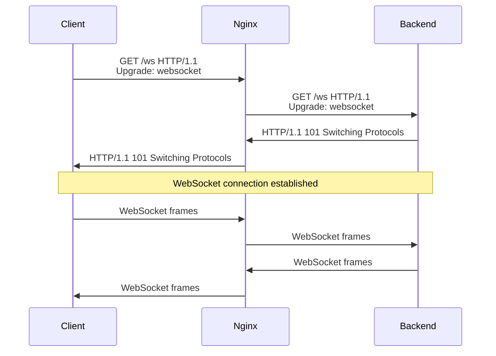
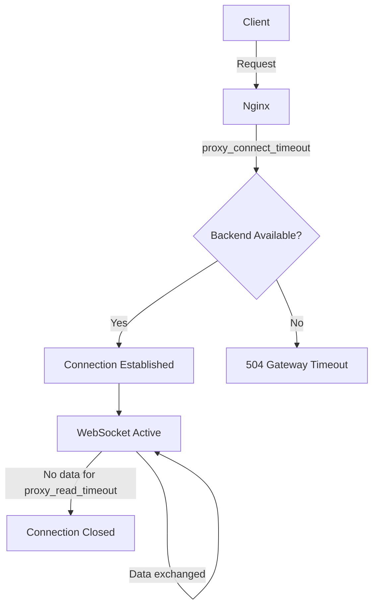

# How to Configure WebSocket with Nginx Reverse Proxy

Author: [nawazdhandala](https://www.github.com/nawazdhandala)

Tags: WebSocket, Nginx, Reverse Proxy, DevOps, Networking

Description: Learn how to configure Nginx as a reverse proxy for WebSocket connections, including SSL termination, load balancing, and handling common issues.

---

Nginx is commonly used as a reverse proxy in front of WebSocket servers for SSL termination, load balancing, and routing. However, WebSocket requires specific configuration because it uses HTTP upgrade mechanism. This guide covers the complete setup for production WebSocket proxying.

## Basic WebSocket Proxy Configuration

WebSocket connections start as HTTP requests that upgrade to the WebSocket protocol. Nginx must forward the upgrade headers for this to work.

```nginx
# /etc/nginx/sites-available/websocket
# Basic WebSocket proxy configuration

upstream websocket_backend {
    server 127.0.0.1:8080;
}

server {
    listen 80;
    server_name ws.example.com;

    location /ws {
        proxy_pass http://websocket_backend;

        # Required for WebSocket: use HTTP/1.1 (not 1.0)
        proxy_http_version 1.1;

        # Forward the upgrade headers
        proxy_set_header Upgrade $http_upgrade;
        proxy_set_header Connection "upgrade";

        # Forward client information to backend
        proxy_set_header Host $host;
        proxy_set_header X-Real-IP $remote_addr;
        proxy_set_header X-Forwarded-For $proxy_add_x_forwarded_for;
        proxy_set_header X-Forwarded-Proto $scheme;
    }
}
```



## SSL Termination with HTTPS

In production, you should terminate SSL at Nginx and proxy to the backend over HTTP internally.

```nginx
# /etc/nginx/sites-available/websocket-ssl
# WebSocket with SSL termination

upstream websocket_backend {
    server 127.0.0.1:8080;
}

server {
    listen 80;
    server_name ws.example.com;

    # Redirect HTTP to HTTPS
    return 301 https://$server_name$request_uri;
}

server {
    listen 443 ssl;
    server_name ws.example.com;

    # SSL certificates
    ssl_certificate /etc/letsencrypt/live/ws.example.com/fullchain.pem;
    ssl_certificate_key /etc/letsencrypt/live/ws.example.com/privkey.pem;

    # Modern SSL configuration
    ssl_protocols TLSv1.2 TLSv1.3;
    ssl_ciphers ECDHE-ECDSA-AES128-GCM-SHA256:ECDHE-RSA-AES128-GCM-SHA256:ECDHE-ECDSA-AES256-GCM-SHA384:ECDHE-RSA-AES256-GCM-SHA384;
    ssl_prefer_server_ciphers off;

    # SSL session caching for performance
    ssl_session_cache shared:SSL:10m;
    ssl_session_timeout 1d;
    ssl_session_tickets off;

    # HSTS (optional but recommended)
    add_header Strict-Transport-Security "max-age=63072000" always;

    location /ws {
        proxy_pass http://websocket_backend;

        proxy_http_version 1.1;
        proxy_set_header Upgrade $http_upgrade;
        proxy_set_header Connection "upgrade";

        proxy_set_header Host $host;
        proxy_set_header X-Real-IP $remote_addr;
        proxy_set_header X-Forwarded-For $proxy_add_x_forwarded_for;
        proxy_set_header X-Forwarded-Proto $scheme;
    }
}
```

## Timeout Configuration

WebSocket connections are long-lived. Default Nginx timeouts will close idle connections prematurely.

```nginx
# Timeout settings for WebSocket

location /ws {
    proxy_pass http://websocket_backend;

    proxy_http_version 1.1;
    proxy_set_header Upgrade $http_upgrade;
    proxy_set_header Connection "upgrade";

    # Connection timeout: time to establish connection to backend
    proxy_connect_timeout 10s;

    # Read timeout: time to wait for response from backend
    # Set high for WebSocket to prevent idle disconnections
    proxy_read_timeout 86400s;  # 24 hours

    # Send timeout: time to transmit request to backend
    proxy_send_timeout 86400s;  # 24 hours

    # Disable buffering for real-time communication
    proxy_buffering off;

    # TCP optimizations
    proxy_socket_keepalive on;
}
```



## Load Balancing Multiple Backend Servers

When running multiple WebSocket server instances, you need sticky sessions because WebSocket is stateful.

```nginx
# Load balancing WebSocket with sticky sessions

upstream websocket_backend {
    # ip_hash ensures same client always goes to same server
    ip_hash;

    server 10.0.0.1:8080;
    server 10.0.0.2:8080;
    server 10.0.0.3:8080;
}

# Alternative: Use cookie-based sticky sessions
upstream websocket_backend_cookie {
    # Requires nginx-sticky-module-ng or commercial nginx plus
    # sticky cookie srv_id expires=1h domain=.example.com path=/;

    server 10.0.0.1:8080;
    server 10.0.0.2:8080;
    server 10.0.0.3:8080;
}

server {
    listen 443 ssl;
    server_name ws.example.com;

    # SSL configuration...

    location /ws {
        proxy_pass http://websocket_backend;

        proxy_http_version 1.1;
        proxy_set_header Upgrade $http_upgrade;
        proxy_set_header Connection "upgrade";

        proxy_set_header Host $host;
        proxy_set_header X-Real-IP $remote_addr;
        proxy_set_header X-Forwarded-For $proxy_add_x_forwarded_for;
    }
}
```

### Health Checks for WebSocket Backends

```nginx
# Backend health checks (requires nginx plus or commercial version)
# For open source nginx, use external health check solutions

upstream websocket_backend {
    zone websocket_backend 64k;

    server 10.0.0.1:8080;
    server 10.0.0.2:8080;
    server 10.0.0.3:8080;

    # Basic passive health checks (open source nginx)
    # Server marked as failed after max_fails within fail_timeout
}

# For open source nginx, use max_fails and fail_timeout
upstream websocket_backend_passive {
    ip_hash;

    server 10.0.0.1:8080 max_fails=3 fail_timeout=30s;
    server 10.0.0.2:8080 max_fails=3 fail_timeout=30s;
    server 10.0.0.3:8080 max_fails=3 fail_timeout=30s;
}
```

## Handling Mixed HTTP and WebSocket Traffic

Many applications serve both regular HTTP and WebSocket on the same domain.

```nginx
# Mixed HTTP and WebSocket on same domain

upstream api_backend {
    server 127.0.0.1:3000;
}

upstream websocket_backend {
    ip_hash;
    server 127.0.0.1:8080;
    server 127.0.0.1:8081;
}

server {
    listen 443 ssl;
    server_name api.example.com;

    # SSL configuration...

    # Regular API endpoints
    location /api {
        proxy_pass http://api_backend;

        proxy_set_header Host $host;
        proxy_set_header X-Real-IP $remote_addr;
        proxy_set_header X-Forwarded-For $proxy_add_x_forwarded_for;
        proxy_set_header X-Forwarded-Proto $scheme;
    }

    # WebSocket endpoint
    location /ws {
        proxy_pass http://websocket_backend;

        proxy_http_version 1.1;
        proxy_set_header Upgrade $http_upgrade;
        proxy_set_header Connection "upgrade";

        proxy_set_header Host $host;
        proxy_set_header X-Real-IP $remote_addr;
        proxy_set_header X-Forwarded-For $proxy_add_x_forwarded_for;
        proxy_set_header X-Forwarded-Proto $scheme;

        proxy_read_timeout 86400s;
        proxy_send_timeout 86400s;
    }

    # Socket.io specific path
    location /socket.io {
        proxy_pass http://websocket_backend;

        proxy_http_version 1.1;
        proxy_set_header Upgrade $http_upgrade;
        proxy_set_header Connection "upgrade";

        proxy_set_header Host $host;
        proxy_set_header X-Real-IP $remote_addr;
        proxy_set_header X-Forwarded-For $proxy_add_x_forwarded_for;
        proxy_set_header X-Forwarded-Proto $scheme;

        proxy_read_timeout 86400s;
        proxy_send_timeout 86400s;
    }
}
```

## Conditional Upgrade Based on Headers

Use map directive to conditionally set Connection header based on whether this is a WebSocket upgrade.

```nginx
# Conditional WebSocket upgrade

map $http_upgrade $connection_upgrade {
    default upgrade;
    ''      close;
}

server {
    listen 443 ssl;
    server_name api.example.com;

    # SSL configuration...

    location / {
        proxy_pass http://backend;

        proxy_http_version 1.1;
        proxy_set_header Upgrade $http_upgrade;
        proxy_set_header Connection $connection_upgrade;

        proxy_set_header Host $host;
        proxy_set_header X-Real-IP $remote_addr;
        proxy_set_header X-Forwarded-For $proxy_add_x_forwarded_for;
        proxy_set_header X-Forwarded-Proto $scheme;

        # Longer timeouts only when WebSocket
        proxy_read_timeout 86400s;
    }
}
```

## Rate Limiting WebSocket Connections

Prevent abuse by limiting new WebSocket connection rate.

```nginx
# Rate limiting for WebSocket connections

# Define rate limit zone (10 requests per second per IP)
limit_req_zone $binary_remote_addr zone=websocket_limit:10m rate=10r/s;

# Limit concurrent connections per IP
limit_conn_zone $binary_remote_addr zone=websocket_conn:10m;

server {
    listen 443 ssl;
    server_name ws.example.com;

    # SSL configuration...

    location /ws {
        # Apply rate limiting to new connections
        limit_req zone=websocket_limit burst=20 nodelay;

        # Limit concurrent connections
        limit_conn websocket_conn 10;

        proxy_pass http://websocket_backend;

        proxy_http_version 1.1;
        proxy_set_header Upgrade $http_upgrade;
        proxy_set_header Connection "upgrade";

        proxy_read_timeout 86400s;
    }
}
```

## Debugging WebSocket Issues

### Enable Debug Logging

```nginx
# Debug logging for WebSocket troubleshooting

error_log /var/log/nginx/websocket_error.log debug;

server {
    listen 443 ssl;
    server_name ws.example.com;

    # Access log with detailed timing
    log_format websocket '$remote_addr - $remote_user [$time_local] '
                         '"$request" $status $body_bytes_sent '
                         '"$http_referer" "$http_user_agent" '
                         'rt=$request_time uct="$upstream_connect_time" '
                         'uht="$upstream_header_time" urt="$upstream_response_time"';

    access_log /var/log/nginx/websocket_access.log websocket;

    location /ws {
        # Your WebSocket configuration...
    }
}
```

### Common Issues and Solutions

```nginx
# Issue 1: 400 Bad Request
# Cause: Missing upgrade headers
# Solution: Ensure these headers are set
proxy_http_version 1.1;
proxy_set_header Upgrade $http_upgrade;
proxy_set_header Connection "upgrade";

# Issue 2: 502 Bad Gateway
# Cause: Backend not responding or unreachable
# Solution: Check backend health, increase timeouts
proxy_connect_timeout 10s;

# Issue 3: Connection drops after 60 seconds
# Cause: Default proxy_read_timeout is 60s
# Solution: Increase timeout
proxy_read_timeout 86400s;

# Issue 4: Memory issues with many connections
# Cause: Default buffer sizes too large
# Solution: Tune buffer sizes
proxy_buffer_size 4k;
proxy_buffers 4 4k;
```

## Complete Production Configuration

```nginx
# /etc/nginx/sites-available/websocket-production
# Complete production WebSocket configuration

# Rate limiting zones
limit_req_zone $binary_remote_addr zone=ws_req:10m rate=10r/s;
limit_conn_zone $binary_remote_addr zone=ws_conn:10m;

# Connection upgrade map
map $http_upgrade $connection_upgrade {
    default upgrade;
    ''      close;
}

# WebSocket backend cluster
upstream websocket_cluster {
    ip_hash;

    server 10.0.1.10:8080 max_fails=3 fail_timeout=30s;
    server 10.0.1.11:8080 max_fails=3 fail_timeout=30s;
    server 10.0.1.12:8080 max_fails=3 fail_timeout=30s;

    keepalive 32;
}

# HTTP to HTTPS redirect
server {
    listen 80;
    listen [::]:80;
    server_name ws.example.com;

    return 301 https://$server_name$request_uri;
}

# Main HTTPS server
server {
    listen 443 ssl;
    listen [::]:443 ssl;
    http2 on;

    server_name ws.example.com;

    # SSL certificates
    ssl_certificate /etc/letsencrypt/live/ws.example.com/fullchain.pem;
    ssl_certificate_key /etc/letsencrypt/live/ws.example.com/privkey.pem;
    ssl_trusted_certificate /etc/letsencrypt/live/ws.example.com/chain.pem;

    # SSL settings
    ssl_protocols TLSv1.2 TLSv1.3;
    ssl_ciphers ECDHE-ECDSA-AES128-GCM-SHA256:ECDHE-RSA-AES128-GCM-SHA256:ECDHE-ECDSA-AES256-GCM-SHA384:ECDHE-RSA-AES256-GCM-SHA384:ECDHE-ECDSA-CHACHA20-POLY1305:ECDHE-RSA-CHACHA20-POLY1305:DHE-RSA-AES128-GCM-SHA256:DHE-RSA-AES256-GCM-SHA384;
    ssl_prefer_server_ciphers off;

    ssl_session_cache shared:SSL:10m;
    ssl_session_timeout 1d;
    ssl_session_tickets off;

    # OCSP stapling
    ssl_stapling on;
    ssl_stapling_verify on;
    resolver 8.8.8.8 8.8.4.4 valid=300s;
    resolver_timeout 5s;

    # Security headers
    add_header Strict-Transport-Security "max-age=63072000" always;
    add_header X-Frame-Options DENY always;
    add_header X-Content-Type-Options nosniff always;

    # Logging
    access_log /var/log/nginx/ws.example.com.access.log;
    error_log /var/log/nginx/ws.example.com.error.log;

    # Health check endpoint
    location /health {
        access_log off;
        return 200 "OK\n";
        add_header Content-Type text/plain;
    }

    # WebSocket endpoint
    location /ws {
        # Rate limiting
        limit_req zone=ws_req burst=20 nodelay;
        limit_conn ws_conn 10;

        # Proxy to backend
        proxy_pass http://websocket_cluster;

        # WebSocket upgrade
        proxy_http_version 1.1;
        proxy_set_header Upgrade $http_upgrade;
        proxy_set_header Connection $connection_upgrade;

        # Client information
        proxy_set_header Host $host;
        proxy_set_header X-Real-IP $remote_addr;
        proxy_set_header X-Forwarded-For $proxy_add_x_forwarded_for;
        proxy_set_header X-Forwarded-Proto $scheme;
        proxy_set_header X-Forwarded-Host $host;
        proxy_set_header X-Forwarded-Port $server_port;

        # Timeouts
        proxy_connect_timeout 10s;
        proxy_send_timeout 86400s;
        proxy_read_timeout 86400s;

        # Disable buffering
        proxy_buffering off;
        proxy_request_buffering off;

        # Buffer sizes
        proxy_buffer_size 8k;
        proxy_buffers 8 8k;

        # TCP optimizations
        proxy_socket_keepalive on;
        tcp_nodelay on;
    }

    # Socket.io compatibility
    location /socket.io {
        limit_req zone=ws_req burst=20 nodelay;
        limit_conn ws_conn 10;

        proxy_pass http://websocket_cluster;

        proxy_http_version 1.1;
        proxy_set_header Upgrade $http_upgrade;
        proxy_set_header Connection $connection_upgrade;

        proxy_set_header Host $host;
        proxy_set_header X-Real-IP $remote_addr;
        proxy_set_header X-Forwarded-For $proxy_add_x_forwarded_for;
        proxy_set_header X-Forwarded-Proto $scheme;

        proxy_connect_timeout 10s;
        proxy_send_timeout 86400s;
        proxy_read_timeout 86400s;

        proxy_buffering off;
    }
}
```

## Testing the Configuration

```bash
# Test Nginx configuration syntax
sudo nginx -t

# Reload Nginx with new configuration
sudo nginx -s reload

# Test WebSocket connection with curl
curl -v \
  -H "Upgrade: websocket" \
  -H "Connection: Upgrade" \
  -H "Sec-WebSocket-Key: dGVzdGtleQ==" \
  -H "Sec-WebSocket-Version: 13" \
  https://ws.example.com/ws

# Test with websocat tool
websocat wss://ws.example.com/ws

# Monitor Nginx connections
watch 'netstat -an | grep :443 | wc -l'
```

## Summary

| Configuration | Purpose |
|---------------|---------|
| proxy_http_version 1.1 | Required for HTTP upgrade |
| Upgrade and Connection headers | Enable WebSocket protocol switch |
| proxy_read_timeout 86400s | Prevent idle connection closures |
| ip_hash | Sticky sessions for load balancing |
| proxy_buffering off | Real-time data transmission |
| limit_req and limit_conn | Rate limiting and DoS protection |
| SSL termination | Secure connections with certificates |

Nginx is an excellent choice for WebSocket reverse proxy when configured correctly. The key points are forwarding upgrade headers, setting appropriate timeouts, and implementing sticky sessions for load-balanced deployments.
