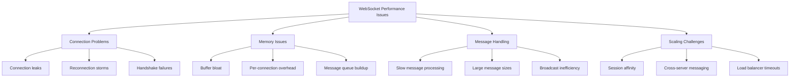
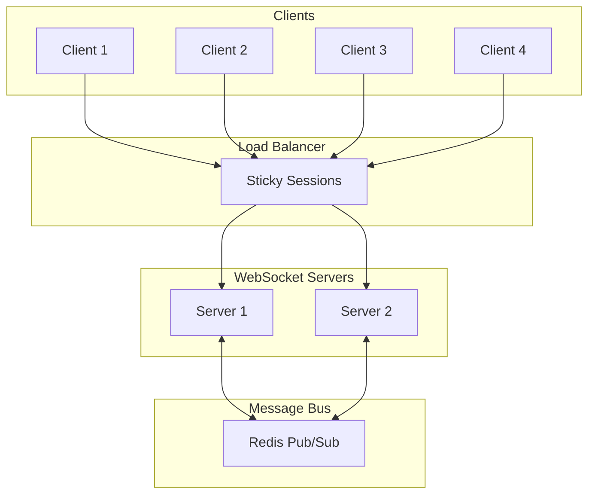

# How to Fix WebSocket Performance Issues

Author: [nawazdhandala](https://www.github.com/nawazdhandala)

Tags: WebSocket, Performance, Real-time, Scaling, Node.js, Python, Load Balancing, Monitoring

Description: A practical guide to identifying and fixing common WebSocket performance issues, including connection management, message handling, scaling strategies, and monitoring techniques.

---

> WebSockets enable real-time bidirectional communication between clients and servers. While they offer significant advantages over polling for real-time applications, they come with unique performance challenges around connection management, memory usage, and horizontal scaling. This guide covers the most common issues and their solutions.

Real-time applications like chat systems, live dashboards, and collaborative tools depend on WebSocket performance. Understanding and fixing common issues can mean the difference between a responsive application and one that frustrates users.

---

## Common WebSocket Performance Issues



---

## Connection Management

### Problem: Connection Leaks

Connections that are not properly closed consume server resources indefinitely.

```javascript
// BAD: No cleanup on disconnect
// This leads to memory leaks and zombie connections
const WebSocket = require('ws');
const wss = new WebSocket.Server({ port: 8080 });

const clients = new Set();

wss.on('connection', (ws) => {
    clients.add(ws);
    // No cleanup when connection closes!
});

// GOOD: Proper connection lifecycle management
const WebSocket = require('ws');
const wss = new WebSocket.Server({ port: 8080 });

// Track connections with metadata
const clients = new Map();

wss.on('connection', (ws, req) => {
    const clientId = generateUniqueId();
    const clientInfo = {
        ws,
        connectedAt: Date.now(),
        lastActivity: Date.now(),
        ip: req.socket.remoteAddress
    };

    clients.set(clientId, clientInfo);
    console.log(`Client connected: ${clientId}, total: ${clients.size}`);

    // Handle incoming messages
    ws.on('message', (data) => {
        clientInfo.lastActivity = Date.now();
        handleMessage(clientId, data);
    });

    // Clean up on close
    ws.on('close', (code, reason) => {
        clients.delete(clientId);
        console.log(`Client disconnected: ${clientId}, code: ${code}, total: ${clients.size}`);
        cleanupClientResources(clientId);
    });

    // Clean up on error
    ws.on('error', (error) => {
        console.error(`Client error: ${clientId}`, error);
        clients.delete(clientId);
        cleanupClientResources(clientId);
    });
});

// Periodic cleanup of stale connections
setInterval(() => {
    const now = Date.now();
    const timeout = 5 * 60 * 1000; // 5 minutes

    for (const [clientId, info] of clients) {
        if (now - info.lastActivity > timeout) {
            console.log(`Terminating stale connection: ${clientId}`);
            info.ws.terminate();
            clients.delete(clientId);
        }
    }
}, 60000);
```

### Heartbeat/Ping-Pong Implementation

```javascript
const WebSocket = require('ws');
const wss = new WebSocket.Server({ port: 8080 });

function heartbeat() {
    this.isAlive = true;
}

wss.on('connection', (ws) => {
    ws.isAlive = true;

    // Respond to pong frames
    ws.on('pong', heartbeat);

    ws.on('message', (data) => {
        // Any activity resets the alive flag
        ws.isAlive = true;
        processMessage(data);
    });
});

// Check for dead connections every 30 seconds
const interval = setInterval(() => {
    wss.clients.forEach((ws) => {
        if (ws.isAlive === false) {
            console.log('Terminating dead connection');
            return ws.terminate();
        }

        ws.isAlive = false;
        ws.ping(); // Send ping, expect pong in response
    });
}, 30000);

wss.on('close', () => {
    clearInterval(interval);
});
```

---

## Memory Optimization

### Problem: Per-Connection Memory Overhead

Each WebSocket connection consumes memory for buffers, state, and metadata.

```javascript
const WebSocket = require('ws');

// Optimize server settings for high connection count
const wss = new WebSocket.Server({
    port: 8080,
    // Reduce per-message-deflate memory usage
    perMessageDeflate: {
        zlibDeflateOptions: {
            chunkSize: 1024,
            memLevel: 7,
            level: 3  // Lower compression for less CPU
        },
        zlibInflateOptions: {
            chunkSize: 10 * 1024
        },
        // Only compress messages larger than 1KB
        threshold: 1024,
        // Limit concurrent compression
        concurrencyLimit: 10
    },
    // Limit max payload size
    maxPayload: 64 * 1024  // 64KB max message size
});

// Use streaming for large data instead of buffering
wss.on('connection', (ws) => {
    ws.on('message', (data, isBinary) => {
        // Process message in chunks if large
        if (data.length > 10000) {
            processLargeMessage(data, ws);
        } else {
            processMessage(data, ws);
        }
    });
});
```

### Message Queue Management

```python
import asyncio
from collections import deque
from dataclasses import dataclass
from typing import Any
import websockets

@dataclass
class QueuedMessage:
    data: Any
    timestamp: float
    priority: int = 0

class ConnectionHandler:
    def __init__(self, websocket, max_queue_size: int = 1000):
        self.ws = websocket
        self.message_queue = deque(maxlen=max_queue_size)
        self.is_sending = False
        self._lock = asyncio.Lock()

    async def send_message(self, data: Any, priority: int = 0):
        """Queue message for sending with backpressure handling"""
        async with self._lock:
            if len(self.message_queue) >= self.message_queue.maxlen:
                # Queue full - drop lowest priority messages
                self._drop_low_priority_messages()

            msg = QueuedMessage(
                data=data,
                timestamp=asyncio.get_event_loop().time(),
                priority=priority
            )
            self.message_queue.append(msg)

        # Start sender if not already running
        if not self.is_sending:
            asyncio.create_task(self._process_queue())

    async def _process_queue(self):
        """Process queued messages with rate limiting"""
        self.is_sending = True

        try:
            while self.message_queue:
                async with self._lock:
                    if not self.message_queue:
                        break
                    msg = self.message_queue.popleft()

                try:
                    await self.ws.send(msg.data)
                except websockets.exceptions.ConnectionClosed:
                    break

                # Rate limit: small delay between messages
                await asyncio.sleep(0.001)
        finally:
            self.is_sending = False

    def _drop_low_priority_messages(self):
        """Remove lowest priority messages when queue is full"""
        # Sort by priority (keep high priority)
        sorted_msgs = sorted(self.message_queue, key=lambda m: m.priority, reverse=True)
        # Keep top 80%
        keep_count = int(len(sorted_msgs) * 0.8)
        self.message_queue = deque(sorted_msgs[:keep_count], maxlen=self.message_queue.maxlen)
```

---

## Message Handling Optimization

### Problem: Slow Message Processing Blocking Event Loop

```javascript
// BAD: Blocking the event loop with synchronous processing
wss.on('connection', (ws) => {
    ws.on('message', (data) => {
        // This blocks processing of all other connections!
        const result = heavyComputation(data);  // Synchronous blocking
        ws.send(JSON.stringify(result));
    });
});

// GOOD: Non-blocking processing with worker threads
const { Worker, isMainThread, parentPort } = require('worker_threads');
const WebSocket = require('ws');

if (isMainThread) {
    const wss = new WebSocket.Server({ port: 8080 });
    const workerPool = createWorkerPool(4);  // 4 worker threads

    wss.on('connection', (ws) => {
        ws.on('message', async (data) => {
            try {
                // Offload heavy processing to worker thread
                const result = await workerPool.execute('heavyComputation', data);
                ws.send(JSON.stringify(result));
            } catch (error) {
                ws.send(JSON.stringify({ error: error.message }));
            }
        });
    });
} else {
    // Worker thread code
    parentPort.on('message', ({ task, data }) => {
        if (task === 'heavyComputation') {
            const result = heavyComputation(data);
            parentPort.postMessage(result);
        }
    });
}

function createWorkerPool(size) {
    const workers = [];
    let nextWorker = 0;

    for (let i = 0; i < size; i++) {
        workers.push(new Worker(__filename));
    }

    return {
        execute(task, data) {
            return new Promise((resolve, reject) => {
                const worker = workers[nextWorker];
                nextWorker = (nextWorker + 1) % workers.length;

                const handler = (result) => {
                    worker.off('message', handler);
                    resolve(result);
                };

                worker.on('message', handler);
                worker.postMessage({ task, data });
            });
        }
    };
}
```

### Efficient Broadcasting

```javascript
const WebSocket = require('ws');
const wss = new WebSocket.Server({ port: 8080 });

// BAD: Inefficient broadcast - serializes for each client
function broadcastBad(data) {
    wss.clients.forEach((client) => {
        if (client.readyState === WebSocket.OPEN) {
            // JSON.stringify called for every client!
            client.send(JSON.stringify(data));
        }
    });
}

// GOOD: Efficient broadcast - serialize once
function broadcastGood(data) {
    // Serialize once, send to all
    const serialized = JSON.stringify(data);

    wss.clients.forEach((client) => {
        if (client.readyState === WebSocket.OPEN) {
            client.send(serialized);
        }
    });
}

// BETTER: Batch broadcasts with micro-batching
class BroadcastManager {
    constructor(wss, batchIntervalMs = 50) {
        this.wss = wss;
        this.pendingMessages = [];
        this.batchInterval = batchIntervalMs;
        this.timer = null;
    }

    broadcast(data) {
        this.pendingMessages.push(data);

        if (!this.timer) {
            this.timer = setTimeout(() => this._flush(), this.batchInterval);
        }
    }

    _flush() {
        if (this.pendingMessages.length === 0) {
            this.timer = null;
            return;
        }

        // Batch all pending messages
        const batch = {
            type: 'batch',
            messages: this.pendingMessages
        };

        const serialized = JSON.stringify(batch);

        this.wss.clients.forEach((client) => {
            if (client.readyState === WebSocket.OPEN) {
                client.send(serialized);
            }
        });

        this.pendingMessages = [];
        this.timer = null;
    }
}
```

---

## Scaling WebSocket Servers

### Architecture with Redis Pub/Sub



### Implementation with Redis

```javascript
const WebSocket = require('ws');
const Redis = require('ioredis');

// Redis clients for pub/sub
const publisher = new Redis();
const subscriber = new Redis();

// Channel for cross-server messaging
const CHANNEL = 'ws:broadcast';

// Local WebSocket server
const wss = new WebSocket.Server({ port: 8080 });
const localClients = new Map();

// Subscribe to Redis channel
subscriber.subscribe(CHANNEL);
subscriber.on('message', (channel, message) => {
    if (channel === CHANNEL) {
        // Broadcast to local clients
        const data = JSON.parse(message);
        broadcastToLocal(data);
    }
});

wss.on('connection', (ws, req) => {
    const clientId = generateId();
    localClients.set(clientId, ws);

    ws.on('message', async (data) => {
        const message = JSON.parse(data);

        if (message.type === 'broadcast') {
            // Publish to Redis for cross-server broadcast
            await publisher.publish(CHANNEL, JSON.stringify(message.payload));
        } else if (message.type === 'direct') {
            // Send to specific user (may be on different server)
            await sendToUser(message.targetUserId, message.payload);
        }
    });

    ws.on('close', () => {
        localClients.delete(clientId);
    });
});

function broadcastToLocal(data) {
    const serialized = JSON.stringify(data);
    localClients.forEach((client) => {
        if (client.readyState === WebSocket.OPEN) {
            client.send(serialized);
        }
    });
}

// For direct messages, store user-to-server mapping in Redis
async function sendToUser(userId, payload) {
    const serverInfo = await publisher.hget('user:servers', userId);

    if (serverInfo) {
        const { serverId } = JSON.parse(serverInfo);
        await publisher.publish(`ws:direct:${serverId}`, JSON.stringify({
            targetUserId: userId,
            payload
        }));
    }
}
```

### Load Balancer Configuration for WebSockets

```nginx
# Nginx configuration for WebSocket load balancing
upstream websocket_servers {
    # Use IP hash for sticky sessions
    # WebSocket connections must stay on the same server
    ip_hash;

    server ws1.example.com:8080;
    server ws2.example.com:8080;
    server ws3.example.com:8080;
}

server {
    listen 80;
    server_name ws.example.com;

    location /ws {
        proxy_pass http://websocket_servers;

        # WebSocket upgrade headers
        proxy_http_version 1.1;
        proxy_set_header Upgrade $http_upgrade;
        proxy_set_header Connection "upgrade";

        # Preserve client IP
        proxy_set_header X-Real-IP $remote_addr;
        proxy_set_header X-Forwarded-For $proxy_add_x_forwarded_for;
        proxy_set_header Host $host;

        # Timeouts - important for long-lived connections
        proxy_connect_timeout 7d;
        proxy_send_timeout 7d;
        proxy_read_timeout 7d;

        # Buffering settings
        proxy_buffering off;
        proxy_buffer_size 4k;
    }
}
```

---

## Client-Side Optimization

### Reconnection with Exponential Backoff

```javascript
class WebSocketClient {
    constructor(url) {
        this.url = url;
        this.ws = null;
        this.reconnectAttempts = 0;
        this.maxReconnectAttempts = 10;
        this.baseDelay = 1000;
        this.maxDelay = 30000;
        this.messageQueue = [];
    }

    connect() {
        this.ws = new WebSocket(this.url);

        this.ws.onopen = () => {
            console.log('Connected');
            this.reconnectAttempts = 0;

            // Send any queued messages
            this.flushMessageQueue();
        };

        this.ws.onclose = (event) => {
            console.log(`Disconnected: ${event.code}`);

            // Don't reconnect for intentional closes
            if (event.code !== 1000) {
                this.scheduleReconnect();
            }
        };

        this.ws.onerror = (error) => {
            console.error('WebSocket error:', error);
        };

        this.ws.onmessage = (event) => {
            this.handleMessage(event.data);
        };
    }

    scheduleReconnect() {
        if (this.reconnectAttempts >= this.maxReconnectAttempts) {
            console.error('Max reconnection attempts reached');
            return;
        }

        // Exponential backoff with jitter
        const delay = Math.min(
            this.baseDelay * Math.pow(2, this.reconnectAttempts),
            this.maxDelay
        );
        const jitter = delay * 0.2 * Math.random();
        const totalDelay = delay + jitter;

        console.log(`Reconnecting in ${totalDelay}ms (attempt ${this.reconnectAttempts + 1})`);

        setTimeout(() => {
            this.reconnectAttempts++;
            this.connect();
        }, totalDelay);
    }

    send(data) {
        if (this.ws && this.ws.readyState === WebSocket.OPEN) {
            this.ws.send(JSON.stringify(data));
        } else {
            // Queue message for later
            this.messageQueue.push(data);
        }
    }

    flushMessageQueue() {
        while (this.messageQueue.length > 0) {
            const data = this.messageQueue.shift();
            this.ws.send(JSON.stringify(data));
        }
    }

    handleMessage(data) {
        try {
            const message = JSON.parse(data);
            // Handle different message types
            this.emit('message', message);
        } catch (error) {
            console.error('Failed to parse message:', error);
        }
    }

    close() {
        if (this.ws) {
            this.ws.close(1000, 'Client closing');
        }
    }
}
```

---

## Monitoring WebSocket Performance

### Key Metrics to Track

```javascript
const WebSocket = require('ws');
const prometheus = require('prom-client');

// Metrics
const connectionsGauge = new prometheus.Gauge({
    name: 'websocket_connections_total',
    help: 'Total active WebSocket connections'
});

const messagesCounter = new prometheus.Counter({
    name: 'websocket_messages_total',
    help: 'Total WebSocket messages',
    labelNames: ['direction', 'type']
});

const messageLatency = new prometheus.Histogram({
    name: 'websocket_message_processing_seconds',
    help: 'Message processing latency',
    buckets: [0.001, 0.005, 0.01, 0.05, 0.1, 0.5, 1]
});

const connectionDuration = new prometheus.Histogram({
    name: 'websocket_connection_duration_seconds',
    help: 'Connection duration',
    buckets: [1, 10, 60, 300, 600, 1800, 3600]
});

// Instrumented server
const wss = new WebSocket.Server({ port: 8080 });

wss.on('connection', (ws) => {
    const connectedAt = Date.now();
    connectionsGauge.inc();

    ws.on('message', (data) => {
        const start = process.hrtime();
        messagesCounter.inc({ direction: 'received', type: 'data' });

        // Process message...
        processMessage(data);

        // Record processing time
        const [seconds, nanoseconds] = process.hrtime(start);
        messageLatency.observe(seconds + nanoseconds / 1e9);
    });

    ws.on('close', () => {
        connectionsGauge.dec();

        // Record connection duration
        const duration = (Date.now() - connectedAt) / 1000;
        connectionDuration.observe(duration);
    });
});

// Expose metrics endpoint
const express = require('express');
const app = express();

app.get('/metrics', async (req, res) => {
    res.set('Content-Type', prometheus.register.contentType);
    res.send(await prometheus.register.metrics());
});

app.listen(9090);
```

---

## Best Practices Summary

1. **Always handle connection cleanup** - Remove references and free resources on close/error events

2. **Implement heartbeat/ping-pong** - Detect dead connections before they consume resources

3. **Use message queuing with backpressure** - Prevent memory exhaustion from slow clients

4. **Offload heavy processing** - Use worker threads to keep the event loop responsive

5. **Serialize once for broadcasts** - Avoid redundant JSON.stringify calls

6. **Use Redis for multi-server setups** - Enable cross-server messaging with pub/sub

7. **Configure load balancer properly** - Enable sticky sessions and long timeouts

8. **Implement exponential backoff** - Prevent reconnection storms on server issues

9. **Monitor connection metrics** - Track active connections, message rates, and latencies

---

## Conclusion

WebSocket performance optimization requires attention to connection lifecycle, memory management, message processing efficiency, and horizontal scaling. The persistent nature of WebSocket connections means that resource leaks and inefficient message handling have cumulative effects that grow over time.

The key is to treat each connection as a resource that needs careful management, implement proper monitoring to catch issues early, and design for horizontal scaling from the start if you expect significant traffic.

---

*Need to monitor your WebSocket-based real-time applications? [OneUptime](https://oneuptime.com) provides comprehensive monitoring for WebSocket connections, including connection counts, message latencies, and error rates.*

**Related Reading:**
- [How to Handle Microservices Performance](https://oneuptime.com/blog)
- [Real-time Application Monitoring Best Practices](https://oneuptime.com/blog)
